# CCIE Security 認定 初学者向けステップバイステップ解説ガイド

> **対象読者**: ネットワーク／セキュリティの基礎（CCNA〜CCNP 程度）を学び、CCIE Security を目指し始めた方
> **作成基準日**: 2026-10-04
> **起点ページ**: [CCIE Security 認定とトレーニングプログラム（Cisco Japan）](https://www.cisco.com/c/ja_jp/training-events/training-certifications/certifications/expert/ccie-security-v2.html)
> **図解ルール**: ASCII 図は使用せず、フローチャート／シーケンスは Mermaid、表は Markdown 表で表現しています。

---

## 目次

1. [このガイドの使い方と最初に知っておくべき注意点](#1-このガイドの使い方と最初に知っておくべき注意点)
2. [CCIE Security 認定の全体像](#2-ccie-security-認定の全体像)
3. [製品名の新旧対照表（試験文書とGUIの名前が違う問題）](#3-製品名の新旧対照表)
4. [学習ロードマップ](#4-学習ロードマップ)
5. [Domain 1: Perimeter Security and Intrusion Prevention（20%）](#5-domain-1-perimeter-security-and-intrusion-prevention20)
6. [Domain 2: Secure Connectivity and Segmentation（20%）](#6-domain-2-secure-connectivity-and-segmentation20)
7. [Domain 3: Security Infrastructure（15%）](#7-domain-3-security-infrastructure15)
8. [Domain 4: Identity Management, Information Exchange, and Access Control（25%）](#8-domain-4-identity-management-information-exchange-and-access-control25)
9. [Domain 5: Advanced Threat Protection and Content Security（20%）](#9-domain-5-advanced-threat-protection-and-content-security20)
10. [横断ベストプラクティス集](#10-横断ベストプラクティス集)
11. [ラボ試験の戦い方](#11-ラボ試験の戦い方)
12. [用語集](#12-用語集)
13. [参考文献・ソース URL 一覧](#13-参考文献ソース-url-一覧)

---

## 1. このガイドの使い方と最初に知っておくべき注意点

### 1.1 読み方（初学者向け 3 ステップ）

| ステップ | やること | 目安 |
|---|---|---|
| ① 全体像を掴む | 第 2〜4 章を読み、試験の構造と学習順序を理解する | 1 日 |
| ② ドメイン単位で学ぶ | 第 5〜9 章を 1 ドメインずつ読む。各項目は「やさしい説明 → しくみ → ベストプラクティス → 試験での狙われどころ」の順 | 1 ドメイン 1〜2 週間 |
| ③ 手を動かす | 各項目の設定例を実機／仮想環境で再現し、`show` コマンドで検証する | 継続 |

各トピックの見出し番号（例: `1.1`, `4.4`）は、Cisco 公式ブループリント（CCIE Security v6.1）の項目番号と一致しています。公式の文書と見比べながら学習できます。

### 1.2 ⚠️ 最初に確認すべき「情報の鮮度」に関する注意

CCIE Security は、**試験の構成要素ごとに更新サイクルが別**になっています。2026-10-04 時点で、私が確認できた公式情報は次のとおりです。

| 項目 | 確認できた内容 | 出典 |
|---|---|---|
| 起点ページ（日本語） | ページ上の表記は「CCIE Security v6.0」。クオリファイ試験（SCOR 350-701）とラボ試験の 2 段構成。認定の有効期間は 3 年。公式な前提条件はないが、5〜7 年の経験を推奨 | Cisco Japan 公式ページ |
| ラボ試験ブループリント | 公式 PDF の題名は **CCIE Security v6.1**。8 時間のハンズオン。IPv4/IPv6 のデュアルスタックで、計画・設計・導入・運用・最適化を問う。「ネットワークをプログラムし自動化する」ことも想定されている | Cisco ブループリント PDF |
| v6.0 → v6.1 の変更点 | Dynamic objects（1.4.d）の追加、MACsec 項目（旧 2.4）の削除、EAP Chaining and TEAP（4.13.a）、IBNS 2.0（4.18）の追加、Umbrella 関連（5.4）の具体化 | Cisco リリースノート PDF |
| クオリファイ試験 | **SCOR 350-701 の v2.0 が 2026-08-27 から受験可能**。従来版の最終受験日は 2026-08-26。v1.1 に合格済みであれば、有効期間内はラボ受験資格として有効 | Cisco Learning Blog（2026-08-27） |
| ラボ試験の今後 | SCOR v2.0 の公開はラボ試験の変更を引き起こさない（別サイクル）。別途、**AI を取り入れた DOO（Design, Deploy, Operate, Optimize）モジュールがラボ試験に計画されている**。ブループリントの公開時期・ソフトウェアバージョンは Cisco Learning Network で今後告知される | Cisco Learning Blog（2026-08-27） |

> **注意**: 一部の第三者サイトには「AI トラブルシューティングモジュールが既に 2026-05-01 以降のラボで必須になっている」という記述があります。しかし、公式ブログ（2026-08-27）では「計画中」と書かれています。第三者情報と公式情報が食い違っているため、**受験直前に必ず Cisco Learning Network で最新のブループリントとリリースノートを確認してください**。本ガイドは公開済みの **v6.1 ブループリントを基準**に解説します。

### 1.3 本ガイドの「ベストプラクティス」の位置づけ

- Cisco 公式ドキュメント（設定ガイド、ハードニングガイド、SAFE、サポート技術文書）に書かれている推奨事項を軸にしています。
- 設計思想（最小権限、多層防御、変更管理など）は業界標準の考え方に沿っています。
- **機種・バージョンで挙動やコマンドが異なる機能**は、その旨を明記しています。ラボ試験は指定された機器・ソフトウェアバージョンで出題されるので、必ず公式の機器・ソフトウェアリストを確認してください。

---

## 2. CCIE Security 認定の全体像

### 2.1 取得までの流れ

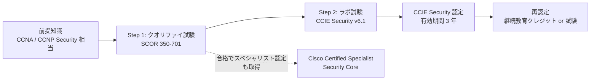

| 項目 | 内容 |
|---|---|
| 必要な試験 | クオリファイ試験（SCOR 350-701）＋ラボ試験（CCIE Security） |
| クオリファイ試験の主な範囲 | コアセキュリティ技術・セキュリティインフラの知識 |
| ラボ試験の主な範囲 | 設計から導入、運用、最適化まで、セキュリティインフラストラクチャのライフサイクル全体 |
| 公式な前提条件 | なし（ただし 5〜7 年の設計・導入・運用・最適化の経験を推奨） |
| 有効期間 | 3 年（再認定ポリシーあり） |
| クオリファイ合格の有効期間 | 合格日から 3 年以内にラボ受験が必要（公式ブログの記述）。継続教育クレジットではこの期間は延長されない |

### 2.2 ラボ試験の 5 つのドメインと配点

| # | ドメイン | 配点 | 一言でいうと |
|---|---|---|---|
| 1 | Perimeter Security and Intrusion Prevention | 20% | 「境界」を守る：ファイアウォール、IPS、攻撃対策 |
| 2 | Secure Connectivity and Segmentation | 20% | 「安全につなぐ・分ける」：VPN、VRF、TrustSec |
| 3 | Security Infrastructure | 15% | 「機器自身を守る」：ハードニング、L2 セキュリティ、API |
| 4 | Identity Management, Information Exchange, and Access Control | 25% | 「誰が・何が」を識別して制御：ISE、802.1X、pxGrid、Duo |
| 5 | Advanced Threat Protection and Content Security | 20% | 「脅威を見つけて止める」：マルウェア、Web/メール、クラウドセキュリティ |

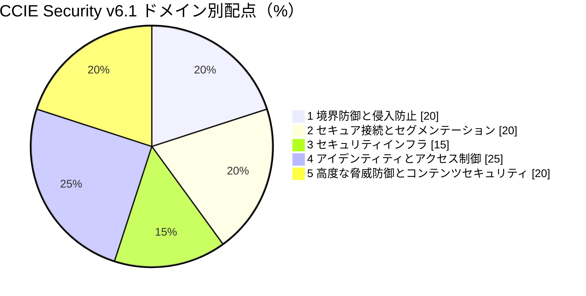

> **学習の優先度のヒント**: 最大配点は Domain 4（25%）で、ISE を中心に多くの製品が連携します。Domain 4 は「他ドメインと連携する接着剤」でもあるため、早めに ISE の基礎を固めると、他ドメインの理解が一気に進みます。

### 2.3 クオリファイ試験（SCOR）とラボ試験の関係

| 比較軸 | SCOR 350-701（クオリファイ） | CCIE Security ラボ |
|---|---|---|
| 形式 | 選択式・知識中心 | 実機／仮想環境でのハンズオン（8 時間） |
| 問われること | 概念・アーキテクチャ・比較 | 設計、設定、検証、トラブルシューティング、最適化 |
| 学習のコツ | 用語と仕組みを正確に理解 | 「速く・正確に・壊さずに」設定する反復練習 |
| 最新状況 | v2.0 が 2026-08-27 から開始（Cisco は「新規コンテンツとして扱うべき大幅改定」と説明） | v6.1 ブループリントが公開中。AI を取り入れた DOO モジュールを計画中 |

---

## 3. 製品名の新旧対照表

試験ブループリント（2023 年版）は旧製品名で書かれていますが、現在の GUI やドキュメントは新名称です。**検索や学習の際は両方の名前を頭に入れてください。**

| ブループリント上の名称 | 現在よく見る名称 | 補足 |
|---|---|---|
| Cisco ASA | Cisco Secure Firewall ASA | ASA ソフトウェアは継続 |
| Cisco FTD | Cisco Secure Firewall Threat Defense | Snort 3 が主流 |
| Cisco FMC | Cisco Secure Firewall Management Center | クラウド提供の cdFMC もある |
| AnyConnect | Cisco Secure Client | VPN / NAM / ISE Posture / Umbrella 等のモジュール |
| AMP for Endpoints | Cisco Secure Endpoint | |
| Threat Grid | Cisco Secure Malware Analytics | サンドボックス |
| Stealthwatch | Cisco Secure Network Analytics | フローベースの脅威検知 |
| WSA | Cisco Secure Web Appliance | |
| ESA | Cisco Secure Email Gateway | |
| SMA | Cisco Secure Email and Web Manager | |
| Cisco Threat Response | 現在は Cisco XDR に統合 | 提供形態は変遷しているため要確認 |
| Cisco DNAC | Cisco Catalyst Center | API パスは `/dna/...` のまま |
| Umbrella | Cisco Umbrella／Cisco Secure Access（SSE） | Cisco は SSE（Secure Access）を中心に据える方向 |

---

## 4. 学習ロードマップ

### 4.1 おすすめの学習順序

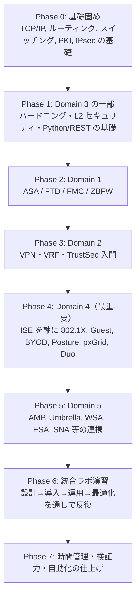

### 4.2 学習環境（ラボ）の用意

| 区分 | 内容 | 補足 |
|---|---|---|
| 公式リスト | CCIE Security の機器・ソフトウェアリストと Learning Matrix | Cisco Japan ページから公式リンクあり（参考文献参照） |
| 仮想環境の例 | Cisco Modeling Labs（CML）等のシミュレータ、ASAv / FTDv / FMCv、ISE、仮想 WLC、Catalyst 仮想スイッチ | 評価ライセンスや提供状況は変わるため公式サイトで確認 |
| 必須スキル | CLI の速度、`show` による検証、設定のコピー＆ペーストの癖づけ、テキストエディタでの下書き | ラボは時間勝負 |

### 4.3 各項目の学習サイクル

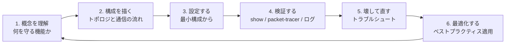

---

## 5. Domain 1: Perimeter Security and Intrusion Prevention（20%）

> **このドメインのゴール**: 企業ネットワークの「出入口」を、ファイアウォールと IPS で守れるようになること。

### 5.0 まず押さえる全体像

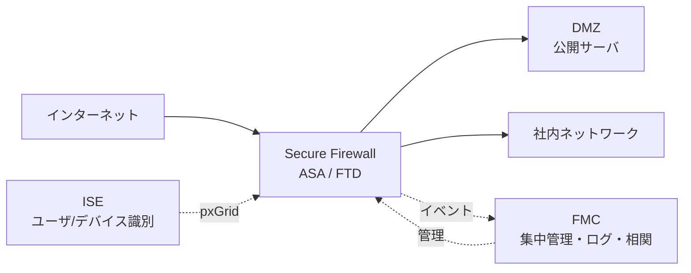

### 5.1 【1.1】ASA / FTD の展開モード

**やさしい説明**
ファイアウォールを「ネットワークの中でどういう立場で置くか」を決める設定です。置き方を間違えると、後から設定を作り直すことになるため、最初に決めます。

| モード | 説明 | 主な用途 | 注意点 |
|---|---|---|---|
| **Routed（ルーテッド）** | L3 ホップとして動作。各インターフェースが別サブネットの IP を持つ | 一般的な境界 FW。NAT・ルーティング・VPN を使う場合 | 既存ネットワークの IP 設計変更が必要になることがある |
| **Transparent（トランスペアレント）** | L2 の「見えない」FW。ブリッジとして動作し、IP の付け替えが不要 | 既存ネットワークに後付けしたい場合 | 機能制限あり（NAT・動的ルーティング・VPN 終端の制約などはプラットフォーム／バージョンで確認） |
| **Single（シングル）** | 1 台の FW を 1 つのコンテキストで使う | 標準 | — |
| **Multi-context（マルチコンテキスト）** | 1 台の ASA を複数の仮想 FW（コンテキスト）に分割 | マルチテナント、部門分離 | **ASA の機能**。システムコンテキスト／アドミンコンテキストがある |
| **Multi-instance（マルチインスタンス）** | 1 台の物理アプライアンス上に複数の独立した FTD インスタンス（コンテナ）を稼働 | FTD でのテナント分離 | 対応プラットフォームが限定される（リリースノートで確認） |

**しくみ（ASA マルチコンテキストの考え方）**

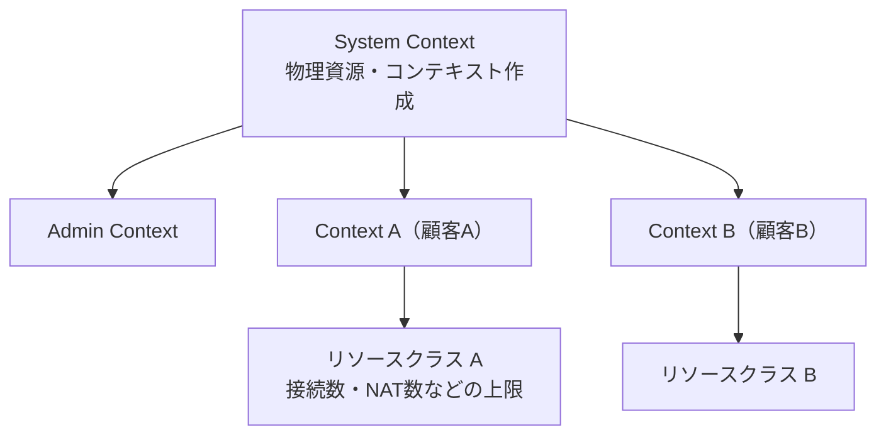

**ベストプラクティス**

- モード（Routed / Transparent、Single / Multi-context）は**導入初期に決定**する。変更時に設定が消えるため、運用中の切り替えは避ける。
- マルチコンテキストでは**リソースクラスで上限を設定**し、1 つのコンテキストが資源を使い切らないようにする。
- インターフェースを複数コンテキストで共有する場合は、**MAC アドレスを自動割り当て（`mac-address auto`）**にして分類の曖昧さを避ける。
- Transparent モードでは、ブリッジグループの管理 IP と、通過させたいプロトコル（ルーティングプロトコルなど）の **ACL 許可**を忘れない。

**試験での狙われどころ**

- 「どのモードで何ができないか」（例: Transparent では NAT/ルーティングに制約）
- ASA のコンテキストと FTD のマルチインスタンスの**違い**
- コンテキスト間のインターフェース共有と分類（Classifier）

---

### 5.2 【1.2】ASA / FTD のファイアウォール機能

#### 5.2.a NAT（Network Address Translation）

**やさしい説明**
社内のプライベート IP を、外向けの別 IP（または別ポート）に「書き換える」機能です。

| NAT の種類 | 説明 | 使いどころ |
|---|---|---|
| Dynamic NAT | 内部アドレスをプールから動的に割り当て | 内部→外部の汎用変換 |
| Dynamic PAT | 1 つの IP とポート番号で多数を変換 | インターネットアクセス（最も一般的） |
| Static NAT | 1 対 1 の固定変換（ポート指定も可能） | 公開サーバ |
| Identity NAT | 「変換しない」NAT | VPN トラフィックの変換除外 |

**Auto NAT と Manual NAT（Twice NAT）**

| 比較 | Auto NAT（Object NAT） | Manual NAT（Twice NAT） |
|---|---|---|
| 設定対象 | ネットワークオブジェクトに付随 | 送信元と宛先を明示して柔軟に定義 |
| 柔軟性 | 低い（送信元のみが基準） | 高い（宛先に応じて変換先を変えられる） |
| 使いどころ | 単純な変換 | 宛先ベースの変換、VPN の除外（identity NAT） |

ASA／FTD では、NAT ルールは **Manual NAT（先頭セクション）→ Auto NAT → Manual NAT（Auto の後ろ）** の順に評価されます（FMC では NAT ポリシー内でカテゴリ／順序として表現されます）。

**ASA の設定例（Dynamic PAT: 内部全体を外側インターフェースの IP に変換）**

```text
object network OBJ-INSIDE-NET
 subnet 10.1.1.0 255.255.255.0
 nat (inside,outside) dynamic interface
```

**FMC（FTD）の流れ**: `Devices > NAT` → **New Policy > Threat Defense NAT** → ルール追加（Auto / Manual、Static / Dynamic）→ ポリシーを対象デバイスに割り当て → **Deploy**。
Cisco のドキュメントには、NAT ポリシーを作成する際、**ルールが空のポリシーをデバイスに適用すると、そのデバイスの NAT ルールがすべて削除される**という注意があります。

**ベストプラクティス**

- 可能な限り **Auto NAT で簡潔に**書き、宛先で変換を変えたい場合のみ Manual NAT を使う。
- **VPN 用の Identity NAT（NAT 除外）を、汎用の Dynamic PAT より上位に置く**（順序の誤りは「VPN だけ通信できない」典型障害）。
- Identity NAT では、プロキシ ARP が不要なケース（または逆に障害になるケース）があるため、オプション（`no-proxy-arp` 相当）を意識する。
- アクセスルールは**変換前（実）アドレス**を基準に書く（ASA 8.3 以降の考え方）。
- 変更後は `show nat detail`、`show xlate`、`packet-tracer` で確認する。

#### 5.2.b アプリケーションインスペクション

**やさしい説明**
FTP や SIP のように「制御用の接続」と「データ用の接続」が別ポートになるプロトコルで、FW が中身を解析して**動的に必要なポートだけ開ける**機能です。

- ASA では **MPF（Modular Policy Framework）**：`class-map` → `policy-map` → `service-policy`
- 既定では `global_policy` が全インターフェースに適用され、よく使うプロトコル（DNS、FTP、HTTP など）のインスペクションが有効になっています。

```text
policy-map global_policy
 class inspection_default
  inspect dns preset_dns_map
  inspect ftp
  inspect icmp
service-policy global_policy global
```

**ベストプラクティス**: 必要なインスペクションだけ有効にする（不要なものは性能劣化の原因）。ICMP は、戻りパケットを許可する `inspect icmp` を使うと、ACL で戻りを個別許可する必要がなくなる。FTD では一部設定が FlexConfig 経由になる場合があるので、バージョンごとの対応を確認する。

#### 5.2.c Traffic zones（トラフィックゾーン）

**やさしい説明**
**ASA の機能**で、複数インターフェースを 1 つの「ゾーン」にまとめ、**ECMP（等コストマルチパス）や非対称ルーティング**でも状態を保ったまま通信できるようにするものです（FTD の「セキュリティゾーン」はポリシー上の概念で、別物として整理してください）。

```text
zone OUTSIDE-ZONE
interface GigabitEthernet0/0
 zone-member OUTSIDE-ZONE
interface GigabitEthernet0/1
 zone-member OUTSIDE-ZONE
```

**試験での狙われどころ**: 「ECMP で戻りパケットが別インターフェースに来る」状況の解決策としてのゾーン機能。

#### 5.2.d Policy-based routing（PBR）

**やさしい説明**
宛先 IP だけでなく、送信元やプロトコルなどの条件で**経路を選ぶ**機能です。

- ASA: ACL でトラフィックを分類し、`route-map` でネクストホップを指定してインターフェースに適用。
- FTD: 新しめのバージョンでは FMC の GUI から設定可能（旧バージョンは FlexConfig）。

**ベストプラクティス**: PBR は「通常のルーティングより優先される」ため、**対象を最小限に絞る**。戻り経路の整合性（対称性）と、ネクストホップ障害時の動作（ルートトラッキングやパスモニタリング）を設計に含める。

#### 5.2.e Traffic redirection to service modules（サービスモジュールへのリダイレクト）

**やさしい説明**
ASA に追加の検査エンジン（例: ASA FirePOWER サービスモジュール）を載せている場合に、MPF のポリシーで一部のトラフィックを**モジュールへ迂回させて検査**させる仕組みです。

- 障害時の挙動として **fail-open（通す）／fail-close（止める）** を選べる。

**ベストプラクティス**: 可用性優先なら fail-open、セキュリティ優先なら fail-close。**リダイレクト対象は必要なトラフィックだけ**に絞り、モジュールの負荷を管理する。

#### 5.2.f Identity firewall（ID ファイアウォール）

**やさしい説明**
IP アドレスではなく**ユーザ名やグループ**でルールを書けるようにする機能です。IP とユーザの対応（マッピング）を、AD や ISE から取得します。

| プラットフォーム | ユーザ情報の取得元（例） |
|---|---|
| ASA | AD（AD Agent / 旧 CDA）、ISE（pxGrid）、SGT（TrustSec） |
| FTD | Realm（AD/LDAP）、ISE／ISE-PIC（pxGrid）、キャプティブポータル、ターミナルサーバ用エージェント |

**ベストプラクティス**: パッシブ認証（ISE/ISE-PIC）を優先し、ブラウザ認証できないデバイスには別の手段（MAB、ISE プロファイリング）を併用する。**古い User Agent 方式は避け**、ISE-PIC／ISE へ移行する方向で設計する。

---

### 5.3 【1.3】Cisco IOS / IOS XE のセキュリティ機能

#### 5.3.a Application awareness

ルータ／スイッチが**アプリケーション（NBAR2 による識別）単位で**可視化・制御する機能です。

```text
ip nbar protocol-discovery   ! インターフェース配下で有効化（プロトコル分布の把握）
class-map match-any CM-VIDEO
 match protocol webex-meeting
```

**ベストプラクティス**: まず可視化（Protocol Discovery）→ ポリシー適用の順で段階導入。プロトコルパックを最新化する。

#### 5.3.b Zone-based Firewall（ZBFW）

**やさしい説明**
ルータ上でインターフェースを「ゾーン」に所属させ、**ゾーン間（ゾーンペア）の通信だけにポリシーを適用**する方式です。

重要な基本ルール:

| ルール | 内容 |
|---|---|
| ゾーン間は既定で拒否 | ゾーンペア＋ポリシーがなければ、異なるゾーン間は通信不可 |
| 同一ゾーン内は既定で許可 | 同じゾーンのインターフェース同士は通る |
| ゾーンペアは方向性あり | inside→outside と outside→inside は別々に定義 |
| `self` ゾーン | ルータ自身宛／発のトラフィック |
| アクション | `inspect`（状態管理）、`pass`（片方向通過）、`drop` |

```text
zone security INSIDE
zone security OUTSIDE
!
class-map type inspect match-any CM-WEB
 match protocol http
 match protocol https
 match protocol dns
!
policy-map type inspect PM-IN-TO-OUT
 class type inspect CM-WEB
  inspect
 class class-default
  drop log
!
zone-pair security ZP-IN-OUT source INSIDE destination OUTSIDE
 service-policy type inspect PM-IN-TO-OUT
!
interface GigabitEthernet0/0
 zone-member security INSIDE
interface GigabitEthernet0/1
 zone-member security OUTSIDE
```

**ベストプラクティス**

- **管理トラフィック（SSH・ルーティングプロトコル）は `self` ゾーンのポリシー**で明示的に許可する（付け忘れで自分自身が入れなくなる）。
- `drop log` でログを残し、パラメータマップで **DoS 閾値**を調整する。
- 検証は `show policy-map type inspect zone-pair sessions`。

#### 5.3.c NAT（IOS / IOS XE）

```text
interface GigabitEthernet0/0
 ip nat inside
interface GigabitEthernet0/1
 ip nat outside
access-list 1 permit 10.1.1.0 0.0.0.255
ip nat inside source list 1 interface GigabitEthernet0/1 overload
```

**試験での狙われどころ**: NAT と ZBFW・ACL の**処理順序**（どのアドレスをどの機能が見るか）。`show ip nat translations` と `show policy-map type inspect zone-pair` を併用して確認する癖をつける。

---

### 5.4 【1.4】Cisco FMC の機能

| 項目 | 説明 | ベストプラクティス |
|---|---|---|
| **1.4.a Alerting** | ヘルスモニタや相関ルールの結果を、メール／SNMP／Syslog で通知 | 重要度別に宛先を分け、**ノイズ（過剰通知）を抑える** |
| **1.4.b Logging** | 接続イベント・侵入イベントなどの記録。FMC 保存または外部 Syslog / eStreamer | **接続の終了時ログ**を基本にし、全通信の「開始時ログ」は必要最小限（イベント量とストレージ負荷） |
| **1.4.c Reporting** | ダッシュボードとレポートテンプレート。定期レポート | 監査・運用で使う項目をテンプレート化 |
| **1.4.d Dynamic objects** | クラウド等の属性（ラベル・タグ・IP の変化）を取り込み、**変動する IP をオブジェクトとして自動更新**してルールで使える仕組み（Cisco Secure Dynamic Attributes Connector との連携） | 手作業での IP 更新を減らし、**クラウドのワークロード変動に追従**する |

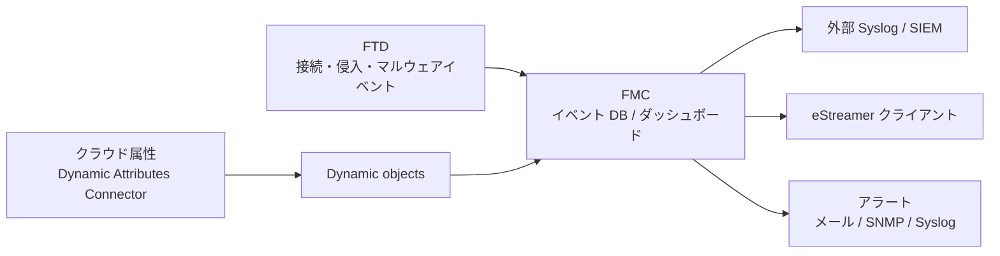

---

### 5.5 【1.5】Cisco NGIPS の展開モード

| モード | 動作 | 攻撃のブロック | 用途 |
|---|---|---|---|
| **In-line** | 通信経路に直列に挿入し、パケットが通過する | 可能（drop） | 本番の防御 |
| **In-line tap（インライン・タップモード）** | 経路上に置くがコピーのみ検査 | 不可 | 導入前の試験運用 |
| **Passive（SPAN）** | スイッチの SPAN ポートに接続し、ミラーされたトラフィックを検査 | 不可（検知のみ） | 可視化・監視 |
| **TAP** | ネットワークタップ装置からのコピーを受信 | 不可（検知のみ） | 完全なコピー取得が必要な監視 |

**ベストプラクティス**

- 最初は **Passive／In-line tap** でチューニングし、誤検知を減らしてから **In-line（ブロック）**へ段階移行する。
- IPS の基本ポリシーは「Connectivity over Security」「Balanced Security and Connectivity」「Security over Connectivity」「Maximum Detection」から選び、**環境に合わせた段階（まず Balanced）**で始める。
- In-line では**ハードウェアバイパス／fail-open**の設計を決めておく。

---

### 5.6 【1.6】Cisco NGFW の機能

| 項目 | 説明 | ベストプラクティス |
|---|---|---|
| **1.6.a SSL inspection** | 暗号化通信（TLS）を復号して検査 | 後述 5.8（HTTP 復号）と合わせて設計。**復号しない（Do not decrypt）カテゴリ**（金融・医療など）を明示 |
| **1.6.b User identity** | ユーザ／グループ単位のポリシー | ISE パッシブ認証を基本に |
| **1.6.c Geolocation** | 国・地域単位のポリシー | GeoDB を**定期更新**。国ブロックは誤判定があり得るため過信しない |
| **1.6.d AVC** | アプリケーション可視化と制御 | アプリの**リスクと業務関連度**でフィルタ。まず「モニタ」で実態把握 |

**ベストプラクティス（NGFW 全体）**: ポリシーの評価は「早い段階で安く判定する」ほど高速化に有利です。Cisco のアクセスコントロールガイダンスでも、**ルールはできるだけ具体的に書く**こと、**Prefilter** で重い検査の前に絞ること、**Security Intelligence（Talos のレピュテーション）** をアクセスコントロールの前に適用する構造が説明されています。

---

### 5.7 【1.7】一般的な攻撃の検知と緩和

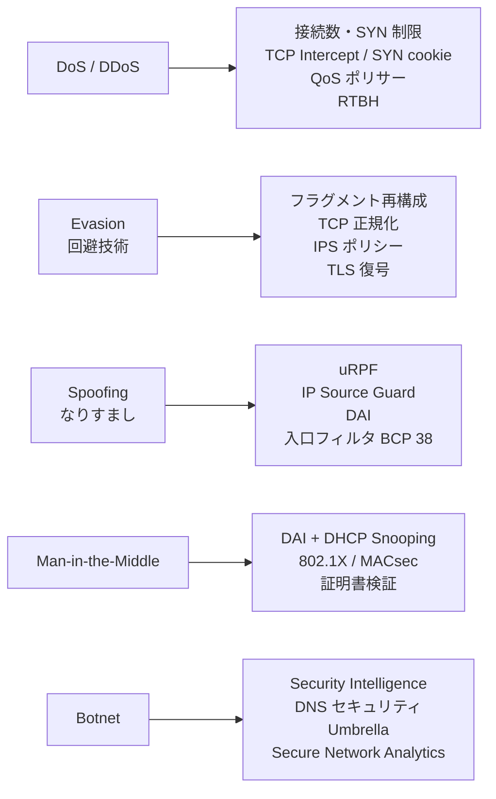

| 攻撃 | 例 | 主な対策機能 | 設計の考え方 |
|---|---|---|---|
| DoS/DDoS | SYN フラッド、UDP フラッド、増幅攻撃 | MPF の接続数／embryonic 接続の上限、TCP Intercept、スキャン脅威検知、QoS、**RTBH**、上流 ISP の協力 | 大規模 DDoS は**オンプレ単独では防げない**ので上流対策を計画 |
| Evasion | フラグメント分割、プロトコル難読化、暗号化 | 再構成・正規化、IPS、**復号** | 検査エンジンの前に**正規化** |
| Spoofing | 偽の送信元 IP/MAC | **uRPF**、DHCP Snooping + IPSG + DAI、入口フィルタ | **境界でも内部でも**防ぐ |
| MITM | ARP 汚染、不正 DHCP | DAI、DHCP Snooping、802.1X、TLS | **L2 の信頼ポート設計** |
| Botnet | C&C 通信 | Security Intelligence（DNS/URL/IP）、Umbrella、Flow 分析 | **DNS 層と L3/L4 層の両方**で止める |

**ASA の接続数制限の例（MPF）**

```text
class-map CM-LIMIT
 match any
policy-map global_policy
 class CM-LIMIT
  set connection conn-max 10000 embryonic-conn-max 2000 per-client-max 100 per-client-embryonic-max 50
```

---

### 5.8 【1.8】クラスタリングと高可用性（HA）

| 方式 | 構成 | 特徴 |
|---|---|---|
| **ASA Failover（Active/Standby）** | 2 台。片方がアクティブ、もう片方が待機 | シンプル。ステートフルフェイルオーバーで接続維持 |
| **ASA Failover（Active/Active）** | マルチコンテキストで、コンテキスト単位に Active/Standby を分散 | 負荷分散的。**マルチコンテキスト必須** |
| **ASA Clustering** | 複数ユニットを 1 つの論理 FW として動作（Control/Data ユニット） | スケールアウト。**Cluster Control Link（CCL）** が必須 |
| **FTD HA** | 2 台の Active/Standby ペア（FMC 管理） | **同一モデル・同一ソフトウェア**が前提。Active/Active は非対応 |
| **FTD Clustering** | 対応プラットフォームで複数ユニットをクラスタ化 | 対応機種・バージョンの確認が必要 |

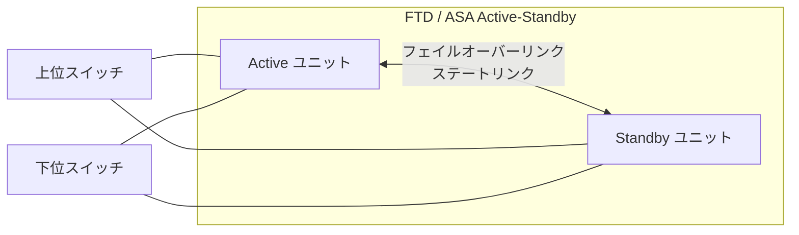

**クラスタの重要用語**: フロー所有者（Owner）、ディレクター（Director）、フォワーダ（Forwarder）。接続ごとに役割が割り当てられ、非対称にパケットが届いても処理を継続します。

**ベストプラクティス**

- フェイルオーバー／ステートリンクは**専用リンク**とし、可能なら冗長化する。
- **CCL の MTU は、データインターフェースの最大 MTU より少なくとも 100 バイト程度大きく**設定する（Cisco 設定ガイドの推奨）。
- **モニタ対象インターフェース**を設計する（重要でないインターフェースの障害でフェイルオーバーしない）。
- 切り替え試験（計画停止での検証）と、ソフトウェアアップグレード手順（スタンバイ→アクティブ）を事前に確認する。
- クラスタ構成では、**スパンド EtherChannel（L2）を基本**に検討する。

---

### 5.9 【1.9】トラフィック制御のポリシーとルール

#### ASA のルール評価

| 項目 | 内容 |
|---|---|
| ACL 評価 | 上から順に評価し、最初に一致したルールを適用（First match）。最後に暗黙の deny |
| 適用方向 | インターフェース ACL（in 方向が一般的）／グローバル ACL |
| セキュリティレベル | 高→低は既定で許可、低→高は ACL が必要 |
| オブジェクトグループ | 大量の IP/ポートの管理を簡素化 |
| 時間ベース | `time-range` による時間帯制御 |

#### FTD のパケット処理（概念）

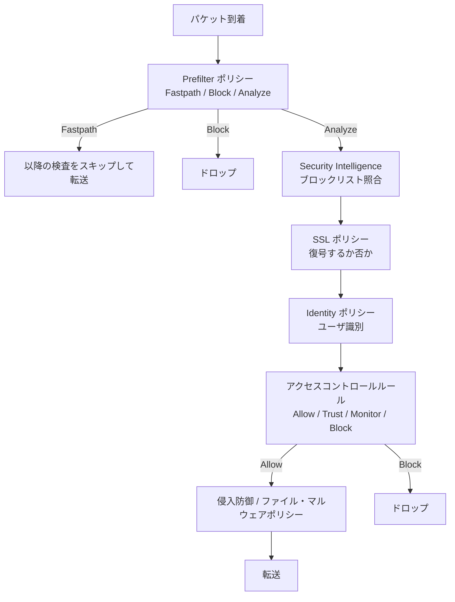

> 正確な内部順序は版により細部が異なります。上図は「Prefilter → Security Intelligence → SSL → Identity → アクセスコントロール → IPS/File」という**学習用の骨格**です。

**ベストプラクティス**

- **ルールは具体的に（Cisco のアクセスコントロール文書でも推奨）**。「any any allow」は避ける。
- 高スループットで信頼できるトラフィック（バックアップ、DC 間複製など）は **Prefilter の Fastpath** にして検査負荷を下げる（ただし**セキュリティ検査を省略**する点は承知のうえで）。
- ルールのヒット数を定期的に確認し、**使われていないルールは整理**する。
- ルールには**名前・説明・カテゴリ**を付け、変更管理に紐づける。

---

### 5.10 【1.10】ルーティングプロトコルのセキュリティ

| プロトコル | 保護策 | 補足 |
|---|---|---|
| OSPF | ネイバー認証（キーチェーン＋暗号化認証）、`passive-interface` | OSPFv3 は IPsec か認証トレーラ |
| EIGRP | HMAC-SHA-256 認証（名前付きモード）、`passive-interface` | 旧来の MD5 より強力な方式を優先 |
| BGP | MD5 または TCP-AO、**GTSM（TTL Security）**、max-prefix、プレフィックスフィルタ | 外部 BGP は特に慎重に |
| 共通 | **CoPP** で制御プレーン保護、ルートフィルタ、再配布の制限 | 機器本体の保護は Domain 3 参照 |

```text
! BGP の例（認証＋ TTL セキュリティ＋最大プレフィックス）
router bgp 65000
 neighbor 203.0.113.2 remote-as 65100
 neighbor 203.0.113.2 password <SECRET>
 neighbor 203.0.113.2 ttl-security hops 1
 neighbor 203.0.113.2 maximum-prefix 1000 80
```

**ASA／FTD の注意**: ASA/FTD が対応する認証方式は IOS より限定的な場合がある（MD5 中心など）。**バージョンごとの対応をドキュメントで確認**する。

**ベストプラクティス**: ユーザセグメント側のインターフェースは `passive-interface` を徹底し、**意図しないネイバー成立**を防ぐ。

---

### 5.11 【1.11】ASA／FTD 経由のネットワーク接続

**やさしい説明**
「FW を通して通信が成立する」ために必要な要素（ルーティング、NAT、ACL、インスペクション、MTU など）を**一式**理解する項目です。

**トラブルシュート手順（フロー）**

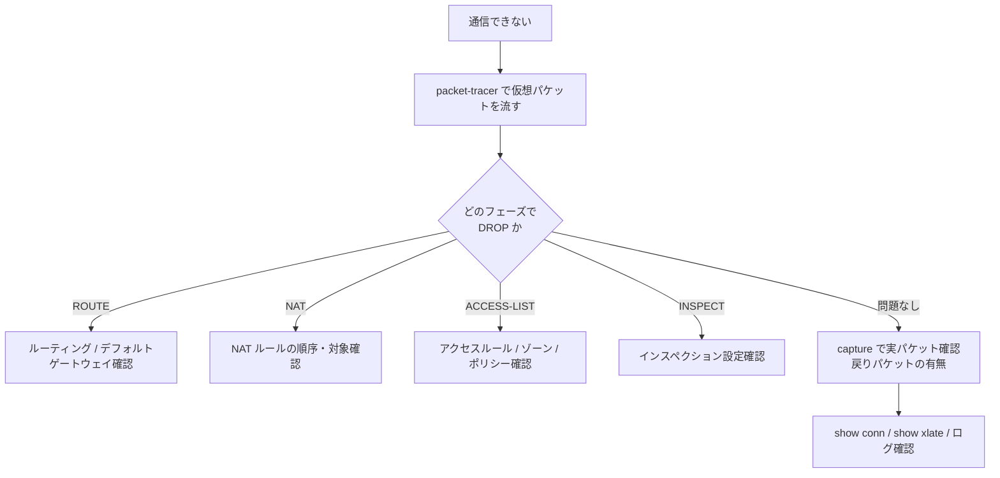

**代表コマンド（ASA）**

| 目的 | コマンド |
|---|---|
| 擬似パケットで評価 | `packet-tracer input inside tcp 10.1.1.10 12345 203.0.113.80 80` |
| パケットキャプチャ | `capture CAP interface inside match tcp host 10.1.1.10 any eq 80` |
| 接続状態 | `show conn`, `show conn address 10.1.1.10` |
| NAT 状態 | `show xlate`, `show nat detail` |
| ドロップ理由 | `show asp drop` |

**よくある落とし穴**

- 戻りパケットが別のインターフェースへ流れる（**非対称ルーティング**）。
- ICMP は、インスペクション（`inspect icmp`）または ACL で許可しないと戻りが通らない。
- **MTU / MSS** 不整合により、VPN 越しなどで特定のサイズだけ通らない。
- ルートの優先順位（スタティック vs 動的）の取り違え。

---

### 5.12 【1.12】FMC の相関ルールとリメディエーション

**やさしい説明**
複数のイベントを**組み合わせて**「これは重大な兆候だ」と判定し、自動で対処（通知・隔離など）を実行する仕組みです。

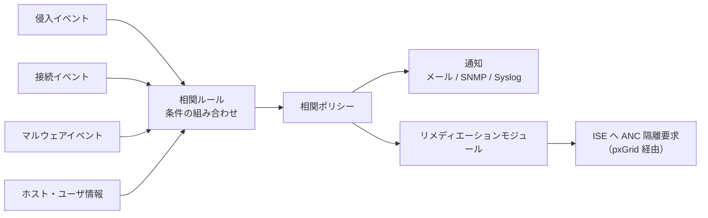

| 構成要素 | 説明 |
|---|---|
| 相関ルール | 「侵入イベント A かつ 同一ホストでマルウェアイベント B」など条件を定義 |
| 相関ポリシー | 複数ルールをまとめて有効化 |
| レスポンス | メール、SNMP、Syslog、リメディエーションモジュール |
| ホワイトリスト | 誤検知源（脆弱性スキャナ等）を除外 |

**ベストプラクティス**

- 最初は**通知のみ**にし、誤検知を減らしてから**自動隔離**へ進む。
- リメディエーションは**影響範囲が大きい**ため、対象（重要サーバ等）の除外を設計する。
- ISE の ANC（Adaptive Network Control）と連携すると、検知から隔離までを自動化できる（詳細は Domain 4 の pxGrid）。


---

## 6. Domain 2: Secure Connectivity and Segmentation（20%）

> **このドメインのゴール**: 拠点間・リモートユーザを**安全に接続**し、ネットワークを**目的別に分割**できるようになること。

### 6.0 全体像

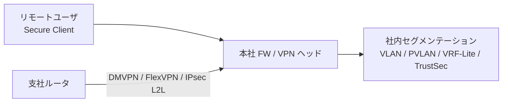

### 6.1 【2.1】Cisco Secure Client（旧 AnyConnect）によるリモートアクセス VPN

**やさしい説明**
自宅や外出先の PC から、会社のネットワークへ暗号化トンネルでつなぐ仕組みです。ASA、FTD、IOS ルータが VPN ヘッド（接続先）になれます。

| 比較軸 | SSL/TLS（DTLS 併用） | IPsec（IKEv2） |
|---|---|---|
| 使うポート | TCP/UDP 443 が基本（FW を通りやすい） | UDP 500 / 4500（NAT 越えあり） |
| 特徴 | Web プロキシや制限の厳しいネットワークで通りやすい | OS ネイティブクライアントなどでも使える |
| 備考 | TLS 接続を確立し、性能向上のため DTLS を併用 | 近年は IKEv2 が推奨 |

**接続の流れ**

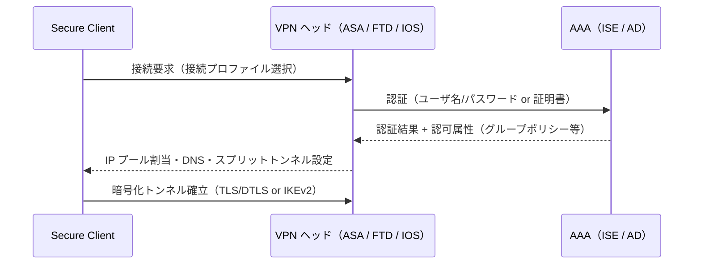

**主な構成要素**

| 要素 | 役割 |
|---|---|
| Connection Profile（トンネルグループ） | 認証方式・グループポリシー・IP プールの紐づけ |
| Group Policy | スプリットトンネル、DNS、バナー、タイムアウト等のユーザ属性 |
| Client Profile（XML） | クライアント側の動作設定 |
| Dynamic Access Policy（DAP） | ASA 上で、ユーザ／端末状態に基づいて動的に制御（ASA の機能） |
| Posture 連携 | ISE と組み合わせて端末の状態を確認（Domain 4 の 4.8 / 4.9） |

**ベストプラクティス**

- **多要素認証（MFA）を必須化**する（Duo など。Domain 4 の 4.16 / 4.17）。
- **証明書認証**または SAML 認証を検討し、パスワード単独は避ける。
- 古い暗号スイートや古い TLS バージョンを無効化し、**IKEv2 / TLS 1.2 以上**を基本にする。
- **スプリットトンネル**は「何を会社経由にするか」を設計（全トラフィックを通す方式と、社内宛のみ通す方式のトレードオフ：セキュリティ可視性 vs 帯域・遅延）。
- 外部公開される VPN ヘッドは**攻撃対象になりやすい**ため、セキュリティアドバイザリを監視し、**ソフトウェアを速やかに更新**する。
- 複数台で冗長化する場合、ロードバランシングと認証サーバ冗長化を設計に含める。

**試験での狙われどころ**: 接続プロファイル→グループポリシー→IP プールの関係、ASA と FTD での設定場所の違い（ASDM/CLI と FMC の RA VPN ウィザード）、ISE を AAA に使った場合の認可属性の返し方。

---

### 6.2 【2.2】Cisco IOS CA による VPN 認証

**やさしい説明**
ルータ自身を**小さな認証局（CA）**として動かし、VPN 参加機器に証明書を発行できます。事前共有鍵（PSK）より管理が楽で安全な運用に向きます。

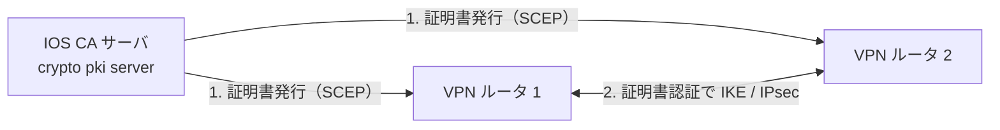

**設定の流れ（概念）**

1. **NTP を同期**する（証明書の有効期限判定に必須）。
2. CA サーバ側で鍵を生成し、`crypto pki server` を設定して起動。
3. クライアント側で `crypto pki trustpoint` を作り、CA 証明書を**認証（authenticate）**、続けて**登録（enroll）**。
4. IKE プロファイルで **証明書認証**を指定。

```text
! CA サーバ側（ラボ用の最小例）
ip http server
crypto key generate rsa general-keys label IOS-CA modulus 2048 exportable
crypto pki server IOS-CA
 database level complete
 grant auto            ! 本番では使わない（手動承認または自動承認の制限を検討）
 lifetime certificate 365
 no shutdown
```

```text
! クライアント側
crypto pki trustpoint CA-TP
 enrollment url http://192.0.2.1:80
 revocation-check crl
crypto pki authenticate CA-TP
crypto pki enroll CA-TP
```

**ベストプラクティス**

- **`grant auto`（無条件の自動発行）は本番で使わない**。手動承認、または事前登録された端末のみ自動承認する運用にする。
- CA 秘密鍵は**エクスポートの管理とバックアップ**を徹底する。
- **失効（CRL / OCSP）**の仕組みを用意する。
- NTP 不整合で「証明書が有効期限外」になる障害が多発する。**時刻同期を最優先**で確認する。

---

### 6.3 【2.3】FlexVPN、DMVPN、IPsec L2L トンネル

#### 6.3.a IPsec Site-to-Site（L2L）の基礎

| 項目 | IKEv1 | IKEv2 |
|---|---|---|
| フェーズ | Phase 1（ISAKMP）＋ Phase 2（IPsec） | IKE_SA_INIT / IKE_AUTH / CHILD_SA |
| 特徴 | 古い。メッセージ数が多い | 効率的、DPD・EAP・非対称認証対応 |
| 推奨 | 既存互換で使用 | **新規は IKEv2 を優先** |

方式は **クリプトマップ方式**（旧来）と **VTI（トンネルインターフェース）方式**（ルーティングと相性が良い）があります。

#### 6.3.b DMVPN（Dynamic Multipoint VPN）

**やさしい説明**
拠点が増えても、ハブに**自動登録**し、必要に応じて**拠点同士が直接トンネルを張る**仕組み。mGRE + NHRP + IPsec + ルーティングの組み合わせです。

| フェーズ | 通信 | 特徴 |
|---|---|---|
| Phase 1 | Spoke ↔ Hub のみ | Hub が全通信を中継 |
| Phase 2 | Spoke ↔ Spoke 直接 | Spoke 間で NHRP 解決（ネクストホップ保持が必要） |
| Phase 3 | Spoke ↔ Spoke 直接 | **NHRP Redirect / Shortcut** で効率的。サマリルートが使える（現在の主流） |

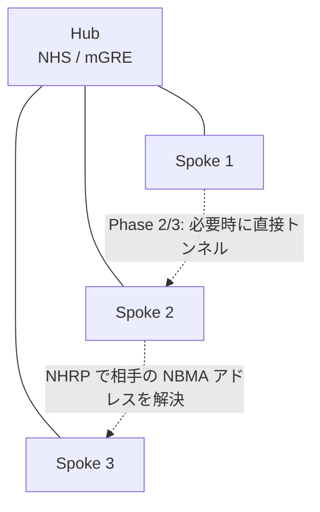

構成要素:

| 要素 | 役割 |
|---|---|
| mGRE | 1 つのトンネルインターフェースで複数相手と通信 |
| NHRP | 論理アドレス（トンネル IP）と物理アドレス（NBMA）の対応を管理 |
| IPsec | トンネルを暗号化（`tunnel protection ipsec profile`） |
| ルーティング | EIGRP / BGP などをトンネル上で運用 |

#### 6.3.c FlexVPN

**やさしい説明**
**IKEv2 を土台に、サイト間・リモートアクセス・ハブ&スポーク・スポーク間を 1 つの統一的な設定体系で**扱えるようにした Cisco の実装です。スマートデフォルト（既定の IKEv2 プロポーザル／ポリシー／IPsec プロファイル）により設定量が減ります。

```text
! FlexVPN サイト間の骨格（IOS XE の例）
crypto ikev2 profile IKEV2-PROF
 match identity remote address 203.0.113.2 255.255.255.255
 authentication remote pre-share key <KEY>   ! 本番は証明書認証を推奨
 authentication local  pre-share key <KEY>
!
crypto ipsec profile IPSEC-PROF
 set ikev2-profile IKEV2-PROF
!
interface Tunnel0
 ip address 172.16.0.1 255.255.255.252
 tunnel source GigabitEthernet0/0
 tunnel destination 203.0.113.2
 tunnel protection ipsec profile IPSEC-PROF
```

| 比較 | DMVPN | FlexVPN |
|---|---|---|
| 土台 | mGRE + NHRP + IPsec（IKEv1/IKEv2） | IKEv2（Virtual Template / Virtual Access） |
| 構成情報の配布 | ルーティングプロトコルが中心 | **AAA（ローカル／RADIUS）による属性配布**が可能 |
| 設定の統一性 | 方式ごとに異なる | リモートアクセス／サイト間を統一的に扱える |

**ベストプラクティス（VPN 共通）**

- **認証は証明書**（PSK を使うなら十分な長さと拠点別の管理）。
- **AES-GCM、SHA-2、強い DH グループ**を基本に、**古いアルゴリズム（3DES、MD5、DH グループ 1/2 等）を無効化**する。
- **DPD / キープアライブ**で障害を検知し、再接続を高速化する。
- **MTU / MSS** をトンネルオーバーヘッドに合わせて調整する（トンネルインターフェースで `ip tcp adjust-mss` を設定）。
- トンネル上のルーティングプロトコルにも**認証**を設定する。

**検証コマンド**: `show crypto ikev2 sa`、`show crypto ipsec sa`、`show dmvpn`、`show ip nhrp`

---

### 6.4 【2.4】VPN の高可用性

#### 6.4.a ASA VPN クラスタリング（ロードバランシング）

| 方式 | 内容 | 補足 |
|---|---|---|
| VPN ロードバランシング | 複数 ASA を**仮想クラスタ IP** でまとめ、マスターがクライアントを負荷の低いユニットにリダイレクト | リモートアクセス VPN の分散に利用 |
| ASA クラスタ（データセンター向け） | ユニット群を 1 つの論理 FW として動かす | **VPN のサポート範囲（サイト間／リモート、集中／分散）はプラットフォームとバージョンで異なる**ため要確認 |

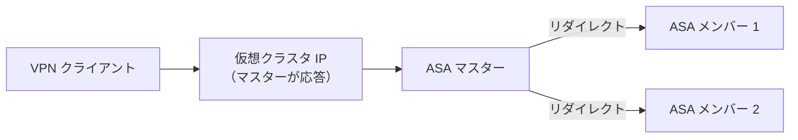

#### 6.4.b デュアルハブ DMVPN

| 構成 | 説明 | 特徴 |
|---|---|---|
| Dual-hub, single-cloud | 1 つの DMVPN クラウドに 2 つのハブ | 設計は比較的シンプル。クラウド全体の障害には弱い |
| Dual-hub, dual-cloud | 異なる 2 つの DMVPN クラウド（別トンネルインターフェース）にそれぞれハブ | 冗長性が高く、経路ごとの優先制御が容易 |

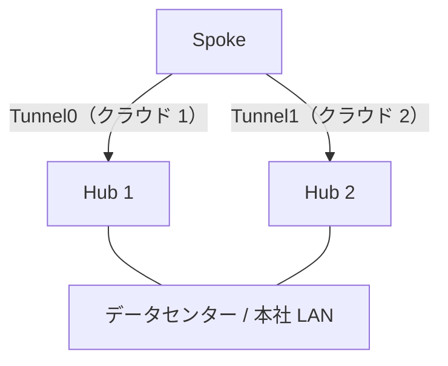

**ベストプラクティス**

- Spoke は **両方のハブに NHRP 登録**し（`ip nhrp nhs` を 2 つ）、ルーティングメトリックで**優先ハブ**を決める。
- 障害検知は、ルーティングプロトコルの Hello/Hold タイマー、IKEv2 DPD、BFD などを**組み合わせて調整**する。
- **フェイルオーバー試験**（ハブを落として切り替わり時間と非対称経路を確認）を設計手順に含める。

---

### 6.5 【2.5】インフラのセグメンテーション手法

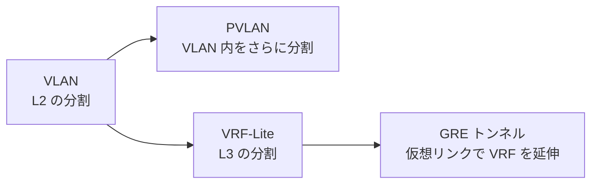

| 技術 | 何を分けるか | 主な用途 |
|---|---|---|
| **VLAN** | L2 ブロードキャストドメイン | 部門・機能ごとの分離 |
| **PVLAN** | 同一 VLAN 内のホスト間通信 | DMZ・マルチテナントで「サーバ同士を直接話させない」 |
| **GRE** | 仮想的なポイントツーポイントリンク | 異なるネットワークの接続、VRF 延伸、IPsec と併用 |
| **VRF-Lite** | L3 ルーティングテーブル | 事業部・顧客ごとにルーティングを分離（MPLS なしでも利用可） |

#### PVLAN の考え方

| ポート種別 | 通信できる相手 |
|---|---|
| Promiscuous（プロミスキャス） | すべて（ゲートウェイ / FW 側） |
| Isolated（アイソレーテッド） | Promiscuous のみ（他の isolated とも通信不可） |
| Community（コミュニティ） | 同一コミュニティ内と Promiscuous |

```text
vlan 101
 private-vlan isolated
vlan 102
 private-vlan community
vlan 100
 private-vlan primary
 private-vlan association 101,102
!
interface GigabitEthernet1/0/1      ! ホスト側
 switchport mode private-vlan host
 switchport private-vlan host-association 100 101
interface GigabitEthernet1/0/24     ! ゲートウェイ側
 switchport mode private-vlan promiscuous
 switchport private-vlan mapping 100 101,102
```

#### VRF-Lite の設定例

```text
vrf definition BLUE
 rd 65000:10
 address-family ipv4
 exit-address-family
!
interface GigabitEthernet0/1
 vrf forwarding BLUE
 ip address 10.10.10.1 255.255.255.0
!
! VRF 間のルート漏えい（必要最小限のみ）は、静的ルートまたは route-target で制御
```

**ベストプラクティス**

- セグメントは**「業務上の理由」**で定義する（部門・信頼度・規制要件）。
- **VRF 間通信は FW を経由**させ、ルートリークは**最小限**に。
- PVLAN は VTP モードや対応スイッチ機能を事前確認する（プラットフォーム依存あり）。
- セグメンテーションの設計は **SAFE（Domain 3 の 3.8）** の「Segmentation」ドメインと対応させる。

---

### 6.6 【2.6】Cisco TrustSec によるマイクロセグメンテーション（SGT と SXP）

> **補足**: ブループリントには「SFT and SXP」とありますが、公式文書内で SFT の略語定義が示されていません。本ガイドでは TrustSec の中核である **SGT（Security Group Tag）／SGACL／SXP** を中心に説明します。最新の公式定義は Cisco Learning Network のブループリントと関連ドキュメントで確認してください。

**やさしい説明**
従来のセグメンテーションは「IP アドレスや VLAN」を基準にしましたが、TrustSec では**ユーザ／デバイスの役割（タグ＝SGT）**で制御します。IP が変わっても、**役割に基づくポリシー**が追従します。

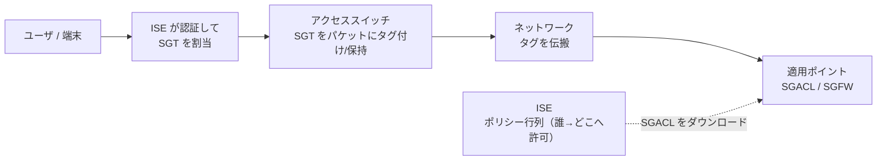

| 要素 | 説明 |
|---|---|
| **SGT** | 役割を表すタグ（例: Employees、Servers、Printers） |
| **分類（Classification）** | SGT を割り当てる方法。**動的**（802.1X/MAB 後に ISE が割当）／**静的**（IP-SGT、VLAN-SGT、サブネット-SGT、ポート-SGT 等） |
| **伝搬（Propagation）** | **インラインタグ付け**（対応機器間でパケットにタグを埋め込む）、または **SXP**（IP-SGT のバインディングを TCP で伝える） |
| **適用（Enforcement）** | **SGACL**（スイッチ等で SGT 間の許可／拒否）、**SGFW**（ASA/FTD で SGT をルール条件に使う） |
| **ポリシー管理** | ISE の TrustSec ポリシー行列（送信元 SGT × 宛先 SGT） |

#### SXP（SGT eXchange Protocol）

| 項目 | 内容 |
|---|---|
| 目的 | インラインタグ付けに対応しない機器経路を挟んでも、**IP-SGT バインディング**を伝える |
| 役割 | **Speaker**（送る側）と **Listener**（受ける側）。双方向（Both）も可能 |
| 通信 | TCP（既定ポートは 64999） |
| 運用上の注意 | **認証（パスワード）**の設定、バージョン（新しい SXP は経路ループ検出などの改善あり）、バインディング数の上限 |

```text
! スイッチの SXP 設定例（概念）
cts sxp enable
cts sxp default password <SECRET>
cts sxp connection peer 192.0.2.10 source 192.0.2.1 password default mode local listener
!
show cts sxp connections
show cts role-based sgt-map all
show cts role-based permissions
```

**ベストプラクティス**

- **SGT の数は最小限**に設計（役割の粒度を細かくしすぎない）。
- **段階導入**：まず**モニタモード**／許可寄りのデフォルトで影響を観測し、段階的に厳格化する。
- SXP は**パスワードを必ず設定**し、リスナー／スピーカーの**トポロジをループしないように設計**する。
- 可能な限り**インラインタグ付け**を優先し、SXP は補完用途にする。
- ASA／FTD のルールに SGT を使うと、IP ベースよりも**変更に強いポリシー**になる。

**試験での狙われどころ**: 分類→伝搬→適用の 3 ステップをどの機器が担うか、ISE のポリシー行列とスイッチへのダウンロード、SXP のモード（speaker/listener）とバインディングの流れ。


---

## 7. Domain 3: Security Infrastructure（15%）

> **このドメインのゴール**: ルータ・スイッチ・FW **機器そのもの**を守り、監視し、API で自動化できるようになること。

### 7.0 3 つのプレーンという考え方

ネットワーク機器の機能は 3 つの「プレーン」に分けて守ります（Cisco IOS XE ハードニングガイドの整理）。

```mermaid
flowchart LR
    MP["管理プレーン<br/>SSH / SNMP / Syslog / AAA<br/>機器に対する操作"] --- CP["制御プレーン<br/>ルーティングプロトコル / ARP / STP<br/>機器が動くための通信"]
    CP --- DP["データプレーン<br/>ユーザ通信の転送"]
```

| プレーン | 守る対象 | 主な対策 |
|---|---|---|
| 管理プレーン | 機器の操作・設定 | AAA、SSH、ACL、SNMPv3、ログ、閾値監視 |
| 制御プレーン | ルーティング・L2 制御 | CoPP、プロトコル認証、iACL |
| データプレーン | 通過トラフィック | uRPF、ACL、QoS、RTBH |

### 7.1 【3.1】デバイスハードニングと制御プレーン保護

#### 3.1.a CoPP（Control Plane Policing）

**やさしい説明**
機器の CPU 宛て（制御プレーン）トラフィックに**流量制限**をかけ、攻撃や異常で CPU が枯渇するのを防ぎます。

```mermaid
flowchart LR
    IN["受信パケット"] --> CL["分類<br/>routing / management / その他"]
    CL --> POL["クラスごとにポリサー"]
    POL -- "許容範囲内" --> CPU["制御プレーン（CPU）"]
    POL -- "超過" --> DROP["ドロップ"]
```

```text
ip access-list extended ACL-COPP-ROUTING
 permit ospf any any
 permit tcp any any eq bgp
 permit tcp any eq bgp any
class-map match-all CM-COPP-ROUTING
 match access-group name ACL-COPP-ROUTING
policy-map PM-COPP
 class CM-COPP-ROUTING
  police 1000000 conform-action transmit exceed-action transmit   ! まず監視のみ
 class class-default
  police 100000 conform-action transmit exceed-action drop
control-plane
 service-policy input PM-COPP
```

**ベストプラクティス**

- **最初は「監視のみ（`exceed-action transmit`）」**で実トラフィック量を `show policy-map control-plane` で確認し、閾値を決めてからドロップへ切り替える。
- **ルーティング・管理・その他**のクラスを分け、重要プロトコルが巻き添えにならないようにする。
- **Catalyst 9000 系（IOS XE）では、システム定義の `system-cpp-policy` が使われ、ユーザ定義クラスマップに制約がある**（IOS XE 16.8.1a 以降）。プラットフォーム別の挙動の違いを把握する。

#### 3.1.b IP source routing

**やさしい説明**
**ソースルーティング**は、送信元が経路を指定できる機能で、**攻撃者に経路を操作される**危険があります。

```text
no ip source-route
```

#### 3.1.c iACL（Infrastructure ACL）

**やさしい説明**
外部から**インフラ機器の IP アドレス宛**への通信を境界で遮断する ACL です。ユーザ通信は通し、機器宛は拒否します。

```mermaid
flowchart LR
    EXT["外部"] --> EDGE["境界ルータ<br/>iACL 適用"]
    EDGE -- "インフラ宛（機器の管理/ループバック等）" --> BLK["拒否"]
    EDGE -- "通過トラフィック（ユーザ宛）" --> INT["内部"]
```

**その他の基本ハードニング（IOS XE ハードニングガイドの代表項目）**

| 項目 | コマンド例／方針 |
|---|---|
| 不要サービス停止 | `no ip http server`、`no ip finger`、`no service pad`、`no ip bootp server` など |
| 不要な通知を抑制 | インターフェースで `no ip redirects` / `no ip unreachables` / `no ip proxy-arp` |
| Directed broadcast | `no ip directed-broadcast` |
| CDP/LLDP | 外部／ユーザ向けポートでは無効化 |
| セキュリティアドバイザリ | Cisco PSIRT の公表を**継続的に監視** |
| 署名済みソフトウェア | ダウンロードイメージの**ハッシュ検証** |
| 設定の保護 | 構成のロールバック／排他編集／変更通知ログ |

---

### 7.2 【3.2】管理プレーン保護

#### 3.2.a / 3.2.b CPU・メモリの閾値監視

**やさしい説明**
CPU やメモリが危険水準に達したら**通知（Syslog/SNMP）**する設定です。攻撃やリソース枯渇の早期発見に役立ちます。

```text
process cpu threshold type total rising 80 interval 5 falling 40 interval 5
memory free low-watermark processor 20000
snmp-server enable traps cpu threshold
snmp-server enable traps memory bufferpeak
```

#### 3.2.c デバイスアクセスの保護

```mermaid
flowchart TD
    A["管理者"] --> B["SSH v2 のみ許可"]
    B --> C["vty に ACL（access-class）で管理元を制限"]
    C --> D["AAA（TACACS+ / ISE）で認証・認可・アカウンティング"]
    D --> E["ローカル緊急アカウント（強力なシークレット）"]
    D --> F["コマンド認可・ログ"]
```

```text
! SSH と vty の基本
hostname EDGE1
ip domain name example.local
crypto key generate rsa modulus 3072
ip ssh version 2
ip ssh time-out 60
!
ip access-list standard ACL-MGMT
 permit 192.0.2.0 0.0.0.255
line vty 0 15
 access-class ACL-MGMT in
 transport input ssh
 exec-timeout 10 0
 login authentication VTY-AUTH
!
login block-for 120 attempts 5 within 60
login on-failure log
login on-success log
!
username emergency privilege 15 algorithm-type scrypt secret <STRONG-SECRET>
enable algorithm-type scrypt secret <STRONG-SECRET>
```

**ベストプラクティス（管理プレーン）**

- **Telnet 禁止、SSH v2 のみ**。HTTP サーバーは無効化し、必要なら HTTPS のみ。
- **AAA（TACACS+）を集中管理**し、**ローカルの非常用アカウント**を残す（AAA サーバ障害時の保険）。
- **SNMP は v3（authPriv）**、不要なら無効。v2c コミュニティ文字列は平文で流れる。
- **NTP（認証付き）で時刻同期**し、**Syslog にタイムスタンプとソースインターフェース**を設定する。
- ロールベース CLI ビューや権限レベルで、**最小権限**を実現。
- **構成バックアップと変更履歴**（アーカイブ、config diff）を保存。

---

### 7.3 【3.3】データプレーン保護

#### 3.3.a uRPF（Unicast Reverse Path Forwarding）

**やさしい説明**
受信パケットの**送信元 IP が、そのパケットを受信したインターフェース経由で到達可能か**を逆引きで確認し、偽装された送信元を落とします。

| モード | 判定 | 使いどころ |
|---|---|---|
| **Strict** | 送信元への最良経路が**受信 I/F と同じ** | 単一接続の境界（シングルホーム） |
| **Loose** | 送信元がルーティングテーブルに**存在すれば OK** | マルチホーム／非対称経路。RTBH と組み合わせる |

```text
interface GigabitEthernet0/0
 ip verify unicast source reachable-via rx      ! strict
interface GigabitEthernet0/1
 ip verify unicast source reachable-via any     ! loose
```

**ベストプラクティス**: マルチホームや非対称経路で **strict を使うと正当な通信を落とす**ため、環境に応じて loose を選ぶ。BCP 38（RFC 2827）の入口フィルタ実装の中核技術。

#### 3.3.b QoS によるデータプレーン保護

**やさしい説明**
攻撃や異常トラフィックを**分類して帯域制限（ポリシング）**し、正常業務への影響を限定します。

```text
class-map match-any CM-SUSPECT
 match access-group name ACL-SUSPECT
policy-map PM-LIMIT
 class CM-SUSPECT
  police 1000000 conform-action transmit exceed-action drop
interface GigabitEthernet0/0
 service-policy input PM-LIMIT
```

#### 3.3.c RTBH（Remote Triggered Black Hole）

**やさしい説明**
DDoS で特定の宛先が攻撃されたとき、**BGP で全境界ルータに「その宛先は Null0 へ」と一斉に配布**して、被害をネットワークの入口で遮断する手法です。

```mermaid
flowchart LR
    T["トリガルータ<br/>攻撃宛先 /32 を静的登録して BGP へ再配布"] -- "BGP でネクストホップ 192.0.2.1 を伝える" --> E1["エッジ 1"]
    T -- "BGP" --> E2["エッジ 2"]
    E1 -- "192.0.2.1 は Null0" --> N1["攻撃パケットを破棄"]
    E2 -- "192.0.2.1 は Null0" --> N2["攻撃パケットを破棄"]
```

```text
! 全エッジルータ（受信側）
ip route 192.0.2.1 255.255.255.255 Null0
!
! トリガルータ
ip route 203.0.113.10 255.255.255.255 Null0 tag 66
route-map RTBH-TRIGGER permit 10
 match tag 66
 set ip next-hop 192.0.2.1
 set origin igp
 set community no-export
router bgp 65000
 redistribute static route-map RTBH-TRIGGER
```

| 種類 | 概要 |
|---|---|
| **宛先ベース RTBH** | 攻撃を受ける宛先を落とす（被害者宛が全滅するが、他への波及を防ぐ） |
| **送信元ベース RTBH** | **uRPF（loose）** と組み合わせて、攻撃元を落とす |

**ベストプラクティス**: トリガ操作を**権限管理・承認フロー**に載せる（誤操作で正常な宛先を遮断する危険）。タグ・コミュニティで**適用範囲を制御**する。

---

### 7.4 【3.4】Layer 2 セキュリティ技術

```mermaid
flowchart TD
    A["不正 DHCP サーバ"] --> A1["DHCP Snooping"]
    B["ARP 汚染（MITM）"] --> B1["DAI"]
    C["送信元 IP/MAC 偽装"] --> C1["IP Source Guard"]
    D["不正スイッチ / ルートブリッジ乗っ取り"] --> D1["BPDU Guard / Root Guard"]
    E["MAC フラッディング"] --> E1["Port Security"]
    F["不正 RA（IPv6）"] --> F1["RA Guard"]
    G["VLAN 内の不要通信"] --> G1["VACL"]
```

| 技術 | 守るもの | ポイント |
|---|---|---|
| **DHCP Snooping（3.4.e）** | 不正 DHCP | **信頼ポート（Trust）**はアップリンク／DHCP サーバ側のみ。バインディングデータベースを生成 |
| **DAI（3.4.a）** | ARP 汚染 | DHCP Snooping のバインディングを使い ARP を検証 |
| **IPSG** | IP/MAC 偽装 | バインディングに基づき送信元 IP をフィルタ |
| **Port Security（3.4.d）** | MAC フラッディング／不正接続 | 最大 MAC 数、sticky、違反時の動作（protect/restrict/shutdown） |
| **STP セキュリティ（3.4.c）** | トポロジ操作 | **BPDU Guard**（PortFast ポートで BPDU を受けたら遮断）、**Root Guard**（上位ブリッジを奪われない）、**Loop Guard**、UDLD |
| **RA Guard（3.4.f）** | 不正 IPv6 ルータ広告 | ホストポートに host ポリシー、ルータ側に router ポリシー |
| **VACL（3.4.g）** | VLAN 内トラフィック制御 | ブリッジされる通信にも ACL 適用 |
| **IPDT（3.4.b）** | 端末情報の追跡 | 旧来の IP Device Tracking。新しい IOS XE では SISF（Switch Integrated Security Features）に統合・置換される傾向（版により要確認） |

**アクセススイッチの標準設定（例）**

```text
ip dhcp snooping
ip dhcp snooping vlan 10,20,30
ip arp inspection vlan 10,20,30
ip arp inspection validate src-mac dst-mac ip
!
interface GigabitEthernet1/0/1       ! ユーザポート
 switchport mode access
 switchport access vlan 10
 switchport port-security
 switchport port-security maximum 2
 switchport port-security violation restrict
 spanning-tree portfast
 spanning-tree bpduguard enable
 ip dhcp snooping limit rate 10
 ip verify source                    ! IP Source Guard
!
interface TenGigabitEthernet1/1/1    ! アップリンク
 ip dhcp snooping trust
 ip arp inspection trust
```

**RA Guard と VACL の例**

```text
ipv6 nd raguard policy HOST-POLICY
 device-role host
ipv6 nd raguard policy ROUTER-POLICY
 device-role router
interface GigabitEthernet1/0/2
 ipv6 nd raguard attach-policy HOST-POLICY
!
ip access-list extended ACL-BLOCK-TELNET
 permit tcp any any eq 23
vlan access-map VACL-DENY-TELNET 10
 match ip address ACL-BLOCK-TELNET
 action drop
vlan access-map VACL-DENY-TELNET 20
 action forward
vlan filter VACL-DENY-TELNET vlan-list 10
```

**ベストプラクティス**

- **DHCP Snooping → DAI → IPSG の順に段階導入**（前者のバインディング DB に後者が依存）。
- 信頼ポートは**必要最小限**に。誤って全ポートを trust にすると意味がなくなる。
- **未使用ポートは shutdown、既定 VLAN から外す、専用の「ブラックホール VLAN」へ**。
- トランクは**許可 VLAN を限定**し、**ネイティブ VLAN をユーザ VLAN と別にする**。
- DTP を無効化（`switchport nonegotiate`）。

---

### 7.5 【3.5】ワイヤレスセキュリティ技術

| 規格 | 暗号方式 | 認証 | 備考 |
|---|---|---|---|
| **WPA（3.5.a）** | **TKIP（3.5.d）** | PSK / 802.1X | 旧世代。使用すべきではない |
| **WPA2（3.5.b）** | **AES-CCMP（3.5.e）** | PSK / 802.1X | 現在も広く利用 |
| **WPA3（3.5.c）** | AES（Personal は SAE、Enterprise は強化暗号モードあり） | **SAE**（Personal）／802.1X（Enterprise） | **PMF（保護された管理フレーム）が必須**、辞書攻撃への耐性向上 |

```mermaid
flowchart LR
    W1["WPA / TKIP<br/>非推奨"] --> W2["WPA2 / AES-CCMP<br/>現行"] --> W3["WPA3 / SAE + PMF<br/>推奨"]
```

**ベストプラクティス**

- **TKIP は無効化**し、AES（CCMP/GCMP）のみにする。
- **Enterprise（802.1X）＋ ISE** を基本とし、PSK は IoT 等の限定用途に（その場合も PSK を端末ごとに分ける仕組みを検討）。
- **PMF（802.11w）**を有効化（WPA3 では必須）。
- 古い端末向けの **WPA2/WPA3 移行モード**は期限を決めて運用する。
- ローグ AP 検知、管理フレーム保護、WLC/AP の管理アクセス制限（Domain 3.2）も併せて設計。

---

### 7.6 【3.6】監視プロトコル

| プロトコル | 何を取る | 特徴 / ベストプラクティス |
|---|---|---|
| **NetFlow / IPFIX / NSEL（3.6.a）** | フロー情報（誰が誰と何バイト） | NetFlow v9／IPFIX（RFC 7011）。**NSEL** は ASA のイベント駆動フロー（セッション開始・終了・拒否など）。Secure Network Analytics 等へ送る |
| **SNMP（3.6.b）** | 状態・性能・トラップ | **v3 authPriv**、ACL で管理サーバを限定、読み取り専用ビュー |
| **Syslog（3.6.c）** | イベントログ | **重要度（0〜7）**を決め、**複数サーバ**と**時刻同期**、ソース I/F 固定 |
| **RMON（3.6.d）** | しきい値ベースのアラーム/イベント | 軽量な監視（アラームがイベントを起こす） |
| **eStreamer（3.6.e）** | FMC/FTD のイベントを外部システムへストリーム | SIEM 連携。**クライアント証明書で認証** |

```text
! Flexible NetFlow の最小例
flow record FR-SEC
 match ipv4 source address
 match ipv4 destination address
 match transport source-port
 match transport destination-port
 match ipv4 protocol
 collect counter bytes long
 collect counter packets long
flow exporter FE-SNA
 destination 192.0.2.50
 transport udp 2055
 export-protocol netflow-v9
flow monitor FM-SEC
 record FR-SEC
 exporter FE-SNA
interface GigabitEthernet0/0
 ip flow monitor FM-SEC input
!
! SNMPv3
snmp-server group SEC-GRP v3 priv
snmp-server user SEC-USER SEC-GRP v3 auth sha <AUTH-PASS> priv aes 128 <PRIV-PASS>
!
! Syslog
logging host 192.0.2.60
logging trap informational
logging source-interface Loopback0
service timestamps log datetime msec
```

---

### 7.7 【3.7】組織のセキュリティポリシー・標準への準拠

| 標準 | ひとことで | ネットワーク機能との対応例 |
|---|---|---|
| **BCP 38 / RFC 2827（3.7.b）** | **入口フィルタリング**で送信元アドレスの偽装を防ぐ | uRPF、境界 ACL、DHCP Snooping/IPSG |
| **ISO 27001（3.7.a）** | 情報セキュリティマネジメント（ISMS）の国際規格 | アクセス制御、ログ、変更管理、リスクベースの運用 |
| **PCI-DSS（3.7.c）** | カード会員データ保護の業界基準 | **カード環境のセグメンテーション**、FW ルールの定期レビュー、強力な認証（MFA）、**ログ保管**（最低 12 か月、直近 3 か月はすぐ参照可能な状態が求められる） |

**ベストプラクティス**: コンプライアンスは「**要求事項 → 技術的統制 → 証跡（ログ・設定）**」の対応表を作って維持する。ファイアウォール／ACL の定期レビュー、変更の承認記録、ログの保管と時刻同期が共通の基盤。

---

### 7.8 【3.8】Cisco SAFE モデルによる設計検証と脅威特定

**やさしい説明**
SAFE は、セキュリティを**「ビジネスフロー → 脅威 → 必要な機能（ケイパビリティ）→ アーキテクチャ → 設計」**の順で整理する Cisco の参照モデルです。ネットワークを **PIN（Places in the Network）**ごとに考えます。

```mermaid
flowchart TD
    BF["ビジネスフロー<br/>誰が何のためにどの通信をするか"] --> TH["脅威<br/>その経路に潜む攻撃"]
    TH --> CAP["ケイパビリティ<br/>必要なセキュリティ機能群"]
    CAP --> ARCH["アーキテクチャ<br/>どこに何を置くか"]
    ARCH --> DES["設計・実装"]
```

| SAFE の概念 | 内容 |
|---|---|
| **PIN（Places in the Network）** | Branch、Campus、Data Center、Edge、Cloud、WAN など（ドキュメント版により PIN の数の記載が異なる） |
| **ケイパビリティ** | Secure Access、Secure Remote Access、Secure Communications、Secure Applications、Secure Web Access など、機能グループ |
| **攻撃対象領域（Attack Surface）** | 有線ネットワーク、無線ネットワーク、分析、WAN、クラウドなど |

**ベストプラクティス**: 設計レビューでは「その PIN の主要ビジネスフローを列挙 → 想定脅威 → 各脅威に対し**検知・防御・可視化**の機能が配置されているか」をチェックリスト化する。

---

### 7.9 【3.9】API を使った機器操作（基本的な Python スクリプト）

#### 3.9.a REST API の基礎

| 要素 | 内容 |
|---|---|
| **HTTP メソッド（アクション動詞）** | `GET`（取得）／`POST`（作成）／`PUT`（置換・更新）／`PATCH`（部分更新）／`DELETE`（削除） |
| **ステータスコード** | `200 OK`、`201 Created`、`204 No Content`、`400 Bad Request`、`401 Unauthorized`（認証エラー）、`403 Forbidden`（権限不足）、`404 Not Found`、`409 Conflict`、`429 Too Many Requests`、`500 Internal Server Error` |
| **ヘッダ** | `Content-Type`（送るデータ形式）、`Accept`（受けたい形式）、`Authorization`、`X-Auth-Token`（Catalyst Center 等のトークン） |
| **Cookie** | セッション維持（ログイン後に Cookie を再送する API もある） |
| **ペイロード** | **JSON** または **XML** |
| **認証** | Basic 認証でトークン取得 → 以降トークンをヘッダで送る方式などが一般的 |

#### 3.9.b データエンコーディング形式

| 形式 | 例 | 特徴 |
|---|---|---|
| **JSON** | `{"hostname":"SW1","up":true}` | 軽量。REST で最も一般的 |
| **XML** | `<device><hostname>SW1</hostname></device>` | タグ構造。NETCONF や一部の API で使用 |
| **YAML** | `hostname: SW1`（インデントで階層） | 人間に読みやすい。Ansible 等の設定記述 |

#### Python で REST API を呼ぶ基本形

```python
import requests

BASE = "https://api.example.local"
# 本番では証明書検証を有効にする（verify=True、または社内 CA のパスを指定）。
session = requests.Session()
session.headers.update({"Accept": "application/json", "Content-Type": "application/json"})

resp = session.get(f"{BASE}/api/v1/devices", timeout=10, verify="/path/to/internal-ca.pem")
if resp.status_code == 200:
    for d in resp.json().get("items", []):
        print(d.get("hostname"))
elif resp.status_code in (401, 403):
    print("認証または権限エラー")
else:
    resp.raise_for_status()
```

**ベストプラクティス（API 運用）**

- 認証情報は**ソースコードに書かず、環境変数やシークレット管理**から読み込む。
- **TLS の証明書検証を無効にしない**（ラボで必要なときだけ、明示して使う）。
- **タイムアウト**、**リトライ（指数バックオフ）**、**レート制限（429）**への対応を入れる。
- 状態を変更する前に**GET で現状確認 → 差分適用**（冪等性を意識）。
- 結果の**ステータスコードとエラー本文をログ**に残す。

---

### 7.10 【3.10】Cisco Catalyst Center（旧 DNAC）の Northbound API ユースケース

**やさしい説明**
Catalyst Center には、外部プログラムから機器の発見・一覧取得・ホスト情報取得などができる **Intent API** があります。

| ユースケース | 内容 | 代表的なパス（Cisco 開発者ドキュメントに基づく） |
|---|---|---|
| **3.10.a 認証と認可** | Basic 認証でトークンを取得し、以降 `X-Auth-Token` で呼ぶ。**トークンの有効期間は 60 分**、失効すると 401 が返る | `POST /dna/system/api/v1/auth/token` |
| **3.10.b ネットワーク探索** | Discovery を作成して機器を見つける。**非同期**で実行され、タスク ID で完了を確認 | `/dna/intent/api/v1/discovery` 系 |
| **3.10.c ネットワークデバイス** | インベントリ情報の取得・追加 | `GET /dna/intent/api/v1/network-device` |
| **3.10.d ネットワークホスト** | 接続ホスト情報の取得 | `/dna/intent/api/v1/host` 系 |

> API のパスや必須パラメータは**リリースによって変わる**ため、Catalyst Center の **Developer Toolkit（Platform > Developer Toolkit）**と公式 API リファレンスで確認します。

```python
import requests
from requests.auth import HTTPBasicAuth

HOST = "https://catalyst.example.local"
USER, PASS = "apiuser", "<PASSWORD>"      # 実運用ではシークレット管理から取得
CA = "/path/to/internal-ca.pem"

# 1) トークン取得
r = requests.post(f"{HOST}/dna/system/api/v1/auth/token",
                  auth=HTTPBasicAuth(USER, PASS), verify=CA, timeout=10)
r.raise_for_status()
token = r.json()["Token"]
headers = {"X-Auth-Token": token, "Content-Type": "application/json"}

# 2) デバイス一覧取得
r = requests.get(f"{HOST}/dna/intent/api/v1/network-device",
                 headers=headers, verify=CA, timeout=10)
r.raise_for_status()
for dev in r.json().get("response", []):
    print(dev.get("hostname"), dev.get("managementIpAddress"), dev.get("reachabilityStatus"))
```

```mermaid
sequenceDiagram
    participant S as Python スクリプト
    participant C as Catalyst Center
    S->>C: POST /dna/system/api/v1/auth/token（Basic 認証）
    C-->>S: Token（有効 60 分）
    S->>C: GET /dna/intent/api/v1/network-device（X-Auth-Token）
    C-->>S: 200 OK + デバイス一覧（JSON）
    Note over S,C: 401 が返ったらトークン再取得
```

**ベストプラクティス**: API 専用アカウントを作り**最小権限（RBAC）**にする。トークンは期限内に再利用し、**期限切れ（401）で再取得**するロジックを実装する。非同期処理は**タスク ID をポーリング**して結果を確認する。


---

## 8. Domain 4: Identity Management, Information Exchange, and Access Control（25%）

> **このドメインのゴール**: 「**誰が・どの端末が・どんな状態で**」ネットワークにつながるかを識別し、その情報を他のセキュリティ製品と共有して**アクセスを自動制御**できるようになること。配点が最大（25%）の最重要ドメインです。

### 8.0 全体像：ISE を中心にした情報の流れ

```mermaid
flowchart LR
    EP["端末・ユーザ"] --> NAD["スイッチ / WLC / VPN<br/>（NAD: Network Access Device）"]
    NAD -- "RADIUS" --> ISE["Cisco ISE<br/>認証・認可・プロファイリング・ポスチャ"]
    ISE --- ID["AD / LDAP / 外部 RADIUS<br/>外部 ID ソース"]
    ISE --- MFA["Duo<br/>多要素認証"]
    ISE -- "pxGrid" --> FMC["FMC / FTD"]
    ISE -- "pxGrid" --> WSA["Secure Web Appliance"]
    ISE -- "SGT / SGACL" --> NAD
    ISE --- MDM["MDM"]
```

**AAA の基本用語**

| 用語 | 意味 |
|---|---|
| Authentication（認証） | 「あなたは誰か」を確認 |
| Authorization（認可） | 「何をしてよいか」を決める（VLAN、ACL、SGT など） |
| Accounting（アカウンティング） | 「何をしたか」を記録 |
| RADIUS | ネットワークアクセス用（802.1X、VPN）の AAA プロトコル |
| TACACS+ | **デバイス管理**（CLI コマンド単位の認可）に適した AAA プロトコル |
| CoA（Change of Authorization） | 接続後に、ISE から NAD へ**動的に権限を変更**させる仕組み |

---

### 8.1 【4.1】ISE のスケーラビリティ（複数ノードとペルソナ）

**やさしい説明**
ISE は 1 台でも動きますが、規模が大きくなると**役割（ペルソナ）ごとにノードを分けて**構成します。

| ペルソナ | 役割 |
|---|---|
| **PAN（Policy Administration Node）** | 管理画面・設定の起点。設定を他ノードへ複製 |
| **PSN（Policy Service Node）** | 実際の認証・認可・ポスチャ・プロファイリングなどを処理 |
| **MnT（Monitoring and Troubleshooting Node）** | ログ・レポートの集約 |
| **pxGrid ノード** | pxGrid による情報共有のブローカ |

ISE のドキュメントでは、**ノードは Administration / Policy Service / Monitoring / pxGrid のペルソナを持てる**と説明されています。

```mermaid
flowchart TD
    subgraph Admin["管理系"]
        PAN1["Primary PAN"] --- PAN2["Secondary PAN"]
        MNT1["Primary MnT"] --- MNT2["Secondary MnT"]
    end
    subgraph Policy["処理系（スケールアウト）"]
        PSN1["PSN 1"]
        PSN2["PSN 2"]
        PSN3["PSN 3"]
    end
    PAN1 -- "設定の複製" --> PSN1
    PAN1 -- "設定の複製" --> PSN2
    PAN1 -- "設定の複製" --> PSN3
    NAD["NAD（スイッチ / WLC）"] -- "RADIUS" --> LB["ロードバランサ or<br/>プライマリ / セカンダリ指定"]
    LB --> PSN1
    LB --> PSN2
    LB --> PSN3
    PSN1 -- "ログ" --> MNT1
```

| 展開モデル | 説明 |
|---|---|
| Standalone | 1 ノードに全ペルソナ（小規模・検証） |
| 2 ノード HA | 管理／処理ペルソナを 2 台で冗長化（小規模） |
| 分散展開 | PAN/MnT と複数 PSN を分離（中〜大規模） |

**ベストプラクティス**

- **本番は PSN を管理系から分離**し、認証負荷をスケールアウトさせる。
- **ISE のスケール＆パフォーマンスガイド**でノード数と台数あたり容量を見積もる（Cisco が公式に提供）。
- NAD 側で **プライマリ／セカンダリ RADIUS サーバ**を設定し、サーバダウン検知（`radius-server dead-criteria` 等）を設計する。
- **PSN ノードグループ**で、PSN 間のセッション情報共有（フェイルオーバー時の影響軽減）を設計する。
- **時刻同期（NTP）**と**DNS（正引き／逆引き）**を正しく整える。ISE は DNS と NTP に大きく依存する。
- **証明書**（管理、EAP、ポータル、pxGrid 用）は用途別に管理し、SAN に FQDN を含める。
- バージョンアップ手順（PAN → MnT → PSN の順などリリースノートに従う）を事前に確認する。

---

### 8.2 【4.2】スイッチと WLC のネットワークアクセス AAA（ISE 連携）

**やさしい説明**
アクセススイッチや無線 LAN コントローラ（WLC）を ISE の **NAD（Network Access Device）**として登録し、RADIUS で認証・認可を ISE に任せる設定です。

```text
! IOS XE スイッチ側の基本設定
aaa new-model
!
radius server ISE-PSN1
 address ipv4 192.0.2.11 auth-port 1812 acct-port 1813
 key <RADIUS-SECRET>
radius server ISE-PSN2
 address ipv4 192.0.2.12 auth-port 1812 acct-port 1813
 key <RADIUS-SECRET>
aaa group server radius ISE-GROUP
 server name ISE-PSN1
 server name ISE-PSN2
!
aaa authentication dot1x default group ISE-GROUP
aaa authorization network default group ISE-GROUP
aaa accounting dot1x default start-stop group ISE-GROUP
!
aaa server radius dynamic-author
 client 192.0.2.11 server-key <RADIUS-SECRET>
 client 192.0.2.12 server-key <RADIUS-SECRET>
!
radius-server dead-criteria time 5 tries 3
radius-server deadtime 5
ip radius source-interface Loopback0
dot1x system-auth-control
```

| 設定 | 目的 |
|---|---|
| `aaa authentication dot1x` | 802.1X 認証を ISE に委任 |
| `aaa authorization network` | VLAN や dACL などの認可結果を受け取る |
| `aaa accounting dot1x` | セッション情報を ISE に送る（プロファイリング・CoA に重要） |
| `aaa server radius dynamic-author` | **CoA を受け付ける**ための設定 |
| `radius-server dead-criteria` | ISE の障害判定条件 |

**ベストプラクティス**

- **RADIUS の共有シークレットは強力なもの**を NAD ごと（または NAD グループごと）に管理する。
- **ソースインターフェースを固定**（Loopback）して、ISE 側の NAD 登録 IP と一致させる。
- WLC では **AAA サーバ登録 → RADIUS NAC（ISE NAC）／CoA 有効 → AAA Override** を忘れない。
- スイッチ側にも **ISE が動作確認する テスト用認証**（`test aaa group`）や dead 検知を備える。

---

### 8.3 【4.3】ISE による機器の管理アクセス（TACACS+）

**やさしい説明**
ルータ・スイッチ・FW に**管理者がログインする際**の認証と、**コマンド単位の認可**を ISE（TACACS+）に集約します。

```text
aaa new-model
tacacs server ISE-TAC1
 address ipv4 192.0.2.11
 key <TACACS-SECRET>
aaa group server tacacs+ TAC-GROUP
 server name ISE-TAC1
!
aaa authentication login default group TAC-GROUP local
aaa authorization exec default group TAC-GROUP local if-authenticated
aaa authorization commands 15 default group TAC-GROUP local if-authenticated
aaa accounting exec default start-stop group TAC-GROUP
aaa accounting commands 15 default start-stop group TAC-GROUP
```

**ISE 側の構成**

```mermaid
flowchart LR
    A["Device Administration を有効化"] --> B["ネットワークデバイスを登録<br/>（TACACS+ 共有シークレット）"]
    B --> C["外部 ID ソース（AD）を参照"]
    C --> D["TACACS+ プロファイル<br/>priv-lvl 等"]
    D --> E["コマンドセット<br/>許可・拒否コマンド"]
    E --> F["ポリシーセット<br/>AD グループ → 権限"]
```

**ベストプラクティス**

- **RADIUS（ネットワークアクセス用）と TACACS+（管理用）をポリシー上も分離**する。
- 管理者ロール（例: 閲覧のみ／設定変更可）を **AD グループ → ISE → コマンドセット**で表現し、**最小権限**にする。
- **ローカルアカウントのフォールバック**（`local`）を残し、ISE 障害時にもログイン可能にする（強力なシークレット必須）。
- **TACACS+ over TLS** により、TACACS+ の通信自体を TLS で保護できる構成が公式ドキュメントで紹介されている（ISE 3.4 と IOS XE 17.18.1 以降の組み合わせでの例）。要件（バージョン）を確認して採用を検討する。

---

### 8.4 【4.4】802.1X と MAB による有線／無線のネットワークアクセス AAA

#### 802.1X の登場人物

| 役割 | 実体 |
|---|---|
| **Supplicant（サプリカント）** | 端末側のソフト（Windows 標準、Secure Client NAM 等） |
| **Authenticator（オーセンティケータ）** | スイッチ／WLC（ポートや SSID でアクセスを制御） |
| **Authentication Server** | ISE（RADIUS） |

```mermaid
sequenceDiagram
    participant S as 端末（Supplicant）
    participant N as スイッチ（Authenticator）
    participant I as ISE（RADIUS）
    S->>N: EAPOL-Start（リンクアップ）
    N->>S: EAP-Request/Identity
    S->>N: EAP-Response/Identity
    N->>I: RADIUS Access-Request（EAP を中継）
    I-->>S: EAP 認証のやりとり（PEAP / EAP-TLS など）
    I->>N: RADIUS Access-Accept + 認可属性（VLAN / dACL / SGT）
    N-->>S: EAP-Success（ポートを許可状態に）
```

| EAP 方式 | 特徴 |
|---|---|
| **EAP-TLS** | 端末（とサーバ）の**証明書**で相互認証。最も強力 |
| **PEAP** | サーバ証明書でトンネルを張り、内側でユーザ名/パスワード（MSCHAPv2）。導入が容易 |
| **EAP-FAST / TEAP** | PAC やトンネル方式。**EAP チェイニング**に対応（4.13） |

#### MAB（MAC Authentication Bypass）

802.1X に対応しない機器（プリンタ、IP 電話、IoT 等）を **MAC アドレスで識別して認証する**方式です。

Cisco の MAB 導入ガイドには、MAB が 802.1X のフォールバックにも単独の認証方式にもなること、一方で **MAB は 802.1X のような強い認証方式ではない**ことが明記されています。

| 比較 | 802.1X | MAB |
|---|---|---|
| 認証の強さ | 強い（資格情報・証明書） | 弱い（MAC は偽装できる） |
| 対応端末 | サプリカント対応端末 | ほぼ全端末 |
| 補完策 | — | **ISE プロファイリング**で「その MAC が本当にプリンタらしいか」を確認 |

#### ポートの動作モード

| モード | 内容 | 特徴 |
|---|---|---|
| **Monitor（オープン）モード** | 認証に失敗しても通信を許可し、ログだけ収集 | **導入初期の影響調査**に最適 |
| **Low-impact モード** | 認証前は限定 ACL、認証後に dACL/VLAN で許可 | 推奨の段階 |
| **Closed モード** | 認証されるまで EAPOL 以外を完全遮断 | 最も厳格 |

| ホストモード | 内容 |
|---|---|
| single-host | 1 ポートに 1 端末のみ |
| multi-host | 最初の 1 台が認証されれば他も通過（弱い） |
| multi-domain | データ VLAN と音声 VLAN で各 1 台 |
| **multi-auth** | **複数端末をそれぞれ個別に認証**（推奨されることが多い） |

```text
interface GigabitEthernet1/0/10
 switchport mode access
 switchport access vlan 10
 switchport voice vlan 110
 ip access-group ACL-DEFAULT in                ! 認証前の限定 ACL（Low-impact）
 authentication host-mode multi-auth
 authentication order dot1x mab
 authentication priority dot1x mab
 authentication port-control auto
 authentication periodic
 authentication timer reauthenticate server
 authentication event server dead action authorize vlan 999   ! 認証サーバ障害時（Critical VLAN）
 authentication event server alive action reinitialize
 mab
 dot1x pae authenticator
 spanning-tree portfast
```

**ベストプラクティス**

- **「802.1X を使えるところは 802.1X、使えない機器は MAB ＋プロファイリング」**が基本方針。
- **Monitor モード → Low-impact → 必要なら Closed** と**段階導入**する。
- **ISE 障害時の挙動**（Critical VLAN／Inaccessible Authentication Bypass／Critical ACL）を、事業継続の観点で設計する。
- MAB でフォールバックする際は **802.1X タイムアウトによる接続遅延**が出る点に留意し、`authentication order` と `priority` を整える。
- **再認証タイマー**は ISE 側のセッションタイムアウトに合わせる。
- 無線は **WPA2/WPA3-Enterprise＋802.1X**、MAB は特殊用途に限定。

---

### 8.5 【4.5】ゲストライフサイクル管理（ISE と WLC）

**やさしい説明**
来訪者に**期限付きの Wi-Fi アカウント**を提供し、使用後は自動的に失効・削除する仕組みです。

```mermaid
flowchart LR
    A["ゲスト作成<br/>スポンサー or 自己登録"] --> B["通知<br/>メール / SMS / 印刷"]
    B --> C["ゲストが SSID に接続"]
    C --> D["Web リダイレクト<br/>ISE ゲストポータル（CWA）"]
    D --> E["ログイン + AUP 同意"]
    E --> F["CoA で ISE が認可を更新<br/>インターネットのみ許可"]
    F --> G["有効期限到達"]
    G --> H["アカウント失効 → 端末登録のパージ"]
```

| ゲストタイプ | 内容 |
|---|---|
| **Contractor / Daily / Weekly** | 有効期間別のゲストタイプ |
| **スポンサー型** | 社員（スポンサー）がアカウントを作成 |
| **自己登録型** | ゲストが自分で登録（必要ならスポンサー承認） |
| **ホットスポット型** | AUP 同意のみ（資格情報なし） |

**CWA（Central Web Authentication）の要点**

- スイッチ／WLC で **Redirect ACL**（リダイレクトする通信と除外する通信）を定義し、ISE ポータルへ誘導する。
- リダイレクト ACL では **DNS・DHCP・ISE ポータルへの通信を除外（deny）** しないと、ポータル到達前に詰まる。

**ベストプラクティス**

- ゲストポータルには**信頼された証明書**を使い、ブラウザ警告を出さない（FQDN を DNS に登録）。
- ゲストは**社内ネットワークから完全分離**し、インターネットのみ許可（dACL / VLAN / SGT で制御）。
- **有効期限・同時ログイン数・帯域**を制限し、期限後の**エンドポイントのパージ**を設定する。
- スポンサーアカウントの**権限範囲（作成できるゲストタイプ）**を最小限に。

---

### 8.6 【4.6】BYOD オンボーディングとネットワークアクセスフロー

**やさしい説明**
社員の私物端末を、**ユーザ認証を経て端末登録し、証明書とネットワーク設定を自動配布**して、以降は**証明書認証（EAP-TLS）**でつなぐ仕組みです。

```mermaid
flowchart TD
    A["私物端末が SSID に接続"] --> B["初回: ユーザ認証（AD 等）"]
    B --> C["BYOD ポータルへリダイレクト"]
    C --> D["端末を登録（MAC 登録）"]
    D --> E["サプリカント設定 + 証明書を自動配布<br/>（ISE 内部 CA / 外部 CA）"]
    E --> F["端末が EAP-TLS で再接続"]
    F --> G["社員の私物端末向けポリシーでアクセス許可"]
```

| 方式 | 説明 |
|---|---|
| **シングル SSID オンボーディング** | 1 つの SSID。初回は PEAP、登録後は EAP-TLS に切り替え |
| **デュアル SSID オンボーディング** | オンボーディング用（オープン等）と本番用（802.1X）で SSID を分ける |

**ベストプラクティス**

- **端末の登録数の上限**をユーザ単位で設ける。
- **証明書の失効**（紛失・退職時）の運用を決める。
- MDM と連携すれば、**端末の健全性（暗号化、OS バージョン）**まで確認できる（4.11）。
- BYOD は**社内機とは別の認可プロファイル**（アクセス範囲を限定、SGT で区別）にする。

---

### 8.7 【4.7】ISE と外部 ID ソースの統合

| ソース | 内容 | 注意点 |
|---|---|---|
| **4.7.b AD（Active Directory）** | ISE をドメインに**参加**させ、ユーザ／マシンの認証、グループ、属性を取得 | **時刻同期（Kerberos）**、DNS、**複数ドメインコントローラ**、必要ポートの開放 |
| **4.7.a LDAP** | 汎用ディレクトリ（AD 以外含む）から検索・認証 | **LDAPS（暗号化）**を使用、検索用アカウントは最小権限 |
| **4.7.c 外部 RADIUS** | 他の RADIUS サーバへ**プロキシ** | トークンサーバ（RSA・Duo 等）との連携にも利用 |

**ID ソースシーケンス**を使うと、「AD で見つからなければ LDAP」「内部ユーザ → AD → 外部」といった**検索順序**を定義できます。

```mermaid
flowchart LR
    A["認証要求"] --> B["ID ソースシーケンス"]
    B --> C["1. 内部ユーザ"]
    C -- "見つからない" --> D["2. AD"]
    D -- "見つからない" --> E["3. LDAP / 外部 RADIUS"]
```

**ベストプラクティス**

- AD 参加アカウントは**専用・最小権限**。ISE は**複数 DC を参照**できるよう DNS サイト設計を行う。
- グループは**入れ子（ネスト）の深さ**に注意（取得遅延・誤認可）。
- **ID ソース障害時のフォールバック**（認証失敗の扱い）をポリシーで明確化。

---

### 8.8 【4.8】ISE と ASA による AnyConnect（Secure Client）のプロビジョニング

**やさしい説明**
VPN 接続時に、ISE が **Secure Client（と ISE Posture モジュール／コンプライアンスモジュール）を端末へ自動配布**し、同時にポスチャチェックを行う構成です。

```mermaid
sequenceDiagram
    participant C as VPN クライアント
    participant A as ASA
    participant I as ISE
    C->>A: VPN 接続（認証）
    A->>I: RADIUS 認証
    I-->>A: Access-Accept + リダイレクト（クライアントプロビジョニング）
    A-->>C: ISE へリダイレクト
    C->>I: Secure Client / ポスチャモジュールをダウンロード
    C->>I: ポスチャチェック結果を報告
    I->>A: CoA（準拠 → フルアクセスに変更）
```

**ASA 側で重要な設定**

- ISE を `aaa-server` として登録し、**`dynamic-authorization`（CoA 受信）**を有効にする。
- **`interim-accounting-update`** などで ISE にセッション情報を渡す。
- **リダイレクト ACL**（リダイレクト対象と除外対象）を定義する。

**ベストプラクティス**: ISE 側では**クライアントプロビジョニングポリシー**で OS ごとのパッケージを管理し、**最新バージョン**を保つ。ポスチャ前の限定アクセス（ISE・修復サーバのみ許可）を厳密に定義する。

---

### 8.9 【4.9】ISE によるポスチャ評価

**やさしい説明**
端末が接続するときに、**ウイルス対策ソフト、OS パッチ、ディスク暗号化などが「会社の基準を満たしているか」**を確認し、満たしていなければ**隔離・修復**へ誘導する仕組みです。

```mermaid
flowchart TD
    A["端末が接続"] --> B["状態: Unknown<br/>→ リダイレクト ACL で ISE へ"]
    B --> C["ポスチャエージェントが評価<br/>AV / パッチ / 暗号化 / USB / レジストリ"]
    C --> D{"ポリシー準拠?"}
    D -- "準拠（Compliant）" --> E["CoA で通常アクセスを付与"]
    D -- "非準拠（Non-Compliant）" --> F["限定アクセス + 修復手順<br/>（パッチサーバ等のみ許可）"]
    F --> C
```

| 構成要素 | 内容 |
|---|---|
| **条件（Conditions）** | ファイル／レジストリ／アプリケーション／サービス／AV／パッチ／ディスク暗号化など |
| **要件（Requirements）** | 条件の組み合わせと OS 別の適用 |
| **修復（Remediation）** | 自動修復、リンク提示、メッセージ表示 |
| **ポスチャポリシー** | ユーザ／グループ・OS ごとに要件を割り当て |
| **ポスチャ状態の認可ルール** | Unknown / Non-Compliant / Compliant ごとに別の認可プロファイル |
| **再評価** | 定期的な再評価（一度合格しても継続的に確認） |

**ベストプラクティス**

- **最初は「監査（ログのみ）」**で非準拠率を把握し、徐々に強制へ。
- Non-Compliant 時の**修復手段へのアクセス**（パッチ配信サーバ等）を必ず許可。
- 業務を止めない**猶予期間（グレース期間）**を設定する。
- 運用負荷が大きいため、MDM／EDR と役割分担する（4.11）。

---

### 8.10 【4.10】ISE によるエンドポイントのプロファイリング（デバイスセンサー含む）

**やさしい説明**
ネットワーク上の通信（DHCP、CDP/LLDP、HTTP など）の**手がかりから、端末の種類（プリンタ、IP 電話、Windows PC、IoT など）を自動分類**する機能です。

| プローブ | 取得する手がかり |
|---|---|
| RADIUS | MAC アドレス、NAS 情報 |
| DHCP（および DHCP SPAN） | ホスト名、ベンダークラス、パラメータ要求リスト |
| HTTP | User-Agent |
| SNMP | 機器から取得するテーブル（CDP/LLDP 等） |
| NMAP | アクティブスキャン |
| AD / DNS / NetFlow | 追加情報 |
| **Device Sensor** | **スイッチ自身が CDP/LLDP/DHCP の情報を収集し、RADIUS アカウンティングで ISE へ送る** |

```mermaid
flowchart LR
    EP["端末"] -- "DHCP / CDP / LLDP" --> SW["スイッチ<br/>Device Sensor"]
    SW -- "RADIUS アカウンティングで属性を送信" --> ISE["ISE プロファイラ"]
    ISE --> POL["プロファイリングポリシー<br/>確信度（Certainty Factor）で分類"]
    POL --> GRP["エンドポイント ID グループ"]
    GRP --> AUTH["認可ポリシーで利用"]
```

```text
! Device Sensor の最小設定例（IOS XE）
device-sensor filter-list dhcp list DS-DHCP
 option name host-name
 option name class-identifier
 option name client-identifier
device-sensor filter-list lldp list DS-LLDP
 tlv name system-name
 tlv name system-description
device-sensor filter-list cdp list DS-CDP
 tlv name device-name
 tlv name platform-type
device-sensor filter-spec dhcp include list DS-DHCP
device-sensor filter-spec lldp include list DS-LLDP
device-sensor filter-spec cdp include list DS-CDP
device-sensor accounting
device-sensor notify all-changes
```

**ベストプラクティス**

- **RADIUS と DHCP のプローブ、Device Sensor を中心に**、必要最小限のプローブから始める（SNMP クエリや NMAP は負荷や副作用に注意）。
- プロファイリングは**「認証」ではなく「推定」**であることを理解し、MAB と組み合わせて**確信度の高いプロファイルのみ**を自動許可する。
- プロファイリングの**フィード（定義更新）**を定期的に更新する。

---

### 8.11 【4.11】MDM と ISE の統合

**やさしい説明**
MDM（モバイルデバイス管理）が持つ**端末の登録状況・コンプライアンス情報**を、ISE が API で取得し、**認可に利用**します。

```mermaid
flowchart LR
    EP["モバイル端末"] --> ISE["ISE"]
    ISE -- "API で端末状態を照会" --> MDM["MDM"]
    MDM -- "登録済み / 準拠 / 非準拠" --> ISE
    ISE -- "未登録なら MDM 登録へ誘導" --> EP
```

| MDM 属性（例） | 認可での使い方 |
|---|---|
| 登録状態（Registered） | 未登録なら MDM 登録ページへリダイレクト |
| コンプライアンス（Compliant） | 準拠なら社内アクセス、非準拠なら限定 |
| 端末暗号化・PIN 設定など | ポリシー条件として利用 |

**ベストプラクティス**: 証明書（EAP-TLS）と MDM 準拠を**組み合わせる**と、「認証＋状態」の両方を担保できる。API 認証情報は最小権限にし、MDM 障害時の挙動（フェイルクローズ／オープン）を決める。

---

### 8.12 【4.12】証明書ベース認証

**やさしい説明**
パスワードではなく、**端末やユーザが持つ証明書**で認証します。パスワード漏えいに強く、運用の自動化もしやすい方式です。

```mermaid
flowchart LR
    EP["端末（クライアント証明書）"] -- "EAP-TLS" --> ISE["ISE"]
    ISE --> CHK1["証明書チェーンを信頼できるか<br/>（信頼された CA 証明書）"]
    ISE --> CHK2["失効していないか<br/>（CRL / OCSP）"]
    ISE --> CHK3["識別子を取り出す<br/>（CN / SAN）"]
    CHK3 --> AD["AD / LDAP と照合（任意）"]
```

| 設定項目 | 内容 |
|---|---|
| **信頼された証明書ストア** | クライアント証明書の発行 CA を ISE に登録し、**「クライアント認証で信頼する」**を有効化 |
| **証明書認証プロファイル** | どのフィールド（CN、SAN など）を ID として使うか、AD と照合するか |
| **失効確認** | CRL／OCSP を設定 |
| **EKU** | クライアント認証用の拡張キー用途を持つテンプレート |
| **ISE 内部 CA** | BYOD などで簡易に証明書を発行 |

**ベストプラクティス**

- **OCSP／CRL による失効確認**を有効化する。
- 端末証明書は **GPO やMDM で自動配布・自動更新**し、**有効期間を適切に**設定。
- **マシン証明書**と**ユーザ証明書**の役割を整理（4.13 の EAP チェイニングへ）。
- 証明書期限切れで一斉に接続できなくなる事故を防ぐため、**期限の監視**を実施。

---

### 8.13 【4.13】認証方式（EAP チェイニング、TEAP、MAR）

#### 4.13.a EAP チェイニングと TEAP

**やさしい説明**
**「端末（マシン）」と「ユーザ」の両方が認証された場合のみ**許可する、という要件を**1 回の認証セッション**で実現する方式です。

| 方式 | 説明 |
|---|---|
| **EAP-FAST チェイニング（EAP-FASTv2）** | 端末認証とユーザ認証を 1 つのトンネル内で連結。Cisco Secure Client NAM などが対応 |
| **TEAP（RFC 7170）** | 標準化された EAP トンネル方式。**EAP チェイニング**と**証明書プロビジョニング**に対応。OS ごとのサポート状況は要確認 |

```mermaid
flowchart LR
    A["端末（マシン証明書）"] --> T["TEAP / EAP-FAST トンネル"]
    B["ユーザ（資格情報 or ユーザ証明書）"] --> T
    T --> ISE["ISE: 端末とユーザの両方を確認"]
    ISE --> R["両方 OK → フルアクセス<br/>片方のみ → 限定アクセス"]
```

#### 4.13.b MAR（Machine Access Restriction）

**やさしい説明**
**「マシン認証に成功している端末からの、ユーザ認証のみ許可する」**という制約を実現する ISE の機能です。ISE は AD に対するマシン認証の履歴（時刻・MAC 等）を保持し、ユーザ認証時に「その端末が事前にマシン認証済みか」を照合します。

| 比較 | MAR | EAP チェイニング／TEAP |
|---|---|---|
| 仕組み | **別々の認証セッション**の履歴を突き合わせる | **同一セッション内**で端末とユーザを同時に確認 |
| 弱点 | 履歴のキャッシュ（保持時間）や Calling-Station-ID に依存 | サプリカントの対応が必要 |
| 位置づけ | 従来方式 | より確実な新方式（v6.1 で TEAP が明示） |

---

### 8.14 【4.14】ID マッピング（ASA、ISE、WSA、FTD）

**やさしい説明**
「IP アドレス ↔ ユーザ名／グループ／SGT」の対応表（マッピング）を、**どの製品が作り、どの製品が使うか**を整理する項目です。

| 利用側 | マッピングの取得元（例） | 用途 |
|---|---|---|
| **ASA** | AD エージェント／ISE（pxGrid）／TrustSec（SGT） | ID ファイアウォール |
| **FTD（FMC）** | Realm（AD/LDAP）、ISE／ISE-PIC（パッシブ）、キャプティブポータル（アクティブ） | ユーザ／グループ単位のアクセスコントロール |
| **WSA（Secure Web Appliance）** | ISE（pxGrid）による**透過的識別**、または Kerberos/NTLM/Basic による**明示的認証** | 識別プロファイル → Web ポリシー |
| **ISE** | 認証セッション（RADIUS）自体がマッピングの源泉 | 他製品へ pxGrid で配信 |

```mermaid
flowchart LR
    AUTH["802.1X / VPN で認証されたセッション"] --> ISE["ISE<br/>IP ↔ ユーザ ↔ SGT"]
    ISE -- "pxGrid（配信）" --> ASA["ASA / FTD"]
    ISE -- "pxGrid（配信）" --> WSA["Secure Web Appliance"]
    AD["AD ログイン監視 / キャプティブポータル"] --> FMC["FMC（Realm）"]
```

**ベストプラクティス**: **パッシブ（ISE 経由）を第一選択**にして、ユーザに追加操作を求めない。**ブラウザを使わない端末**はアクティブ認証が使えないので、MAB やプロファイリングと併用する。マッピングの**有効期限と遅延**（ローミングで IP が変わる場合）を考慮する。

---

### 8.15 【4.15】pxGrid による ISE・WSA・FMC の連携

**やさしい説明**
pxGrid は、ISE を**情報のハブ**として、セキュリティ製品同士が**「ユーザ・端末・脅威の情報」を発行（Publish）／購読（Subscribe）**で共有するための基盤です。

```mermaid
flowchart LR
    ISE["ISE（pxGrid コントローラ）"]
    ISE -- "セッション情報<br/>ユーザ / SGT / プロファイル" --> FMC["FMC：購読（ID 情報）"]
    ISE -- "セッション情報" --> WSA["WSA：購読（ID 情報）"]
    FMC -- "脅威検知 → ANC 隔離要求" --> ISE
    ISE -- "CoA で隔離" --> NAD["スイッチ / WLC"]
```

| 概念 | 内容 |
|---|---|
| ペルソナ | ISE の **pxGrid ペルソナ**を有効化したノードがブローカ |
| クライアント登録 | 各製品が ISE に**クライアントとして登録**し、**承認（手動／自動）** |
| 認証 | **証明書ベース**の相互信頼（ISE と各クライアントで証明書の信頼を整える） |
| トピック | セッションディレクトリ、ANC、TrustSec、エンドポイント資産など |
| ANC（Adaptive Network Control） | 脅威検知側から ISE に**隔離（Quarantine）を要請**する仕組み |
| クラウド版 | **pxGrid Cloud** により、クラウド提供 FMC（cdFMC）と ISE を連携できる（ISE 3.1 パッチ 3 以降の記載） |

**ベストプラクティス**

- **証明書の信頼関係**（pxGrid 証明書、CA チェーン）を最初に整える（連携失敗の最大の原因）。
- **pxGrid ノードの冗長化**（複数ノード）。
- ANC の**隔離ポリシー**（隔離時の VLAN／SGT／dACL）を事前に作り込む。
- 連携する製品の**バージョン互換**を事前確認。

---

### 8.16 【4.16】ISE と多要素認証（MFA）の統合

**やさしい説明**
パスワード（第 1 要素）に加え、スマホのプッシュ通知やパスコード（第 2 要素）を要求します。Duo と ISE の組み合わせでは、**Duo Authentication Proxy** を挟む構成が代表的です。

```mermaid
sequenceDiagram
    participant U as ユーザ / VPN
    participant I as ISE
    participant P as Duo Authentication Proxy
    participant A as AD
    participant D as Duo クラウド
    U->>I: RADIUS 認証要求
    I->>P: RADIUS 要求を転送（外部 RADIUS サーバとして指定）
    P->>A: 第 1 要素（パスワード）を確認
    A-->>P: OK
    P->>D: 第 2 要素（プッシュ等）を要求（TCP 443）
    D-->>P: 承認結果
    P-->>I: Access-Accept / Reject
    I-->>U: 認可結果
```

| 構成のポイント | 内容 |
|---|---|
| Duo Authentication Proxy | **社内に設置**する中継サービス。ISE からの RADIUS 要求を受け、AD 等で第 1 要素を確認し、Duo クラウドで第 2 要素を確認する |
| 通信 | Proxy から Duo クラウドへ **TCP 443** |
| 制約 | **AD を第 1 要素にする場合、RADIUS の MS-CHAP は Proxy でサポートされない**（Cisco コミュニティ記事の記載。構成時に要確認） |
| ISE 側設定 | 外部 RADIUS サーバ（または RADIUS トークンサーバ）として Proxy を指定し、認証ポリシーで MFA 対象のみ Proxy へ流す |

**ベストプラクティス**

- **MFA 対象を絞る**（VPN、管理者ログイン、ISE 管理ポータルなど）。全 RADIUS 要求を Duo に流さない。
- **Proxy の冗長化**（複数台）と、ISE/ASA の **RADIUS タイムアウトをプッシュ承認の待ち時間より長く**設定する。
- **Duo の障害時の動作**（フェイルオープン／フェイルクローズ）を方針として決めておく。

---

### 8.17 【4.17】Cisco Duo によるアクセス制御とシングルサインオン（SSO）

**やさしい説明**
Duo は MFA と**端末の信頼性チェック**を提供するクラウドサービスです。**SAML による SSO** でアプリへのログインを一元化でき、ISE 連携にも利用されます。

| 機能 | 内容 |
|---|---|
| **MFA** | プッシュ通知、パスコード、**Verified Push**（確認コード入力によるプッシュ疲労攻撃対策）、パスキー等の認証方式 |
| **ポリシー** | ユーザ／グループ／アプリ単位で、認証方式・場所・端末状態を条件に制御 |
| **端末の健全性** | 端末の OS／パッチ／暗号化状態などで可否を判定（適応型アクセス） |
| **SSO** | Duo Single Sign-On（SAML IdP）でアプリを一元化 |
| **ISE 連携** | ISE の RADIUS 認証に MFA を追加、ISE のポータル用 SSO／MFA にも対応 |

```mermaid
flowchart LR
    U["ユーザ"] --> APP["アプリ / VPN / ISE ポータル"]
    APP --> SSO["Duo SSO（SAML IdP）"]
    SSO --> P1["第 1 要素<br/>AD / IdP"]
    SSO --> P2["第 2 要素<br/>Duo MFA"]
    P2 --> POL["Duo ポリシー<br/>ユーザ・場所・端末状態"]
    POL --> OK["許可 / 拒否"]
```

**ベストプラクティス**

- **プッシュ疲労（MFA Fatigue）対策**として Verified Push など、確認コード入力型の方式を採用する。
- **バイパス（MFA 免除）ユーザは最小限**にし、期限と承認を管理する。
- **端末ポリシー**（OS 最新、画面ロック、暗号化）を段階的に強制。
- 重要アプリには**より厳しいポリシー**、一般アプリには利便性を考慮した設定と、**リスクに応じた段階的設計**にする。
- 管理者アカウントは**別ポリシー（より厳格）**にする。

---

### 8.18 【4.18】Cisco IBNS 2.0（C3PL）による認証・アクセス制御・ユーザポリシー適用

**やさしい説明**
IBNS（Identity-Based Networking Services）2.0 は、従来のインターフェース単位の `authentication ...` コマンド（IBNS 1.x）に代わる、**C3PL（Cisco Common Classification Policy Language）によるポリシー駆動の記述方式**です。「**イベント**が起きたとき、**条件（クラス）**に合致したら、**アクション**を実行する」という形で、認証の流れを柔軟に書けます。

| 概念 | 内容 |
|---|---|
| **class-map type control subscriber** | 条件（どの認証方式／結果か）を定義 |
| **policy-map type control subscriber** | イベント（session-started、authentication-failure、agent-found など）に対するアクションを定義 |
| **service-template** | 認可として適用する内容（VLAN、ACL、SGT 等）をテンプレート化 |
| **インターフェース適用** | `service-policy type control subscriber <name>` |
| **アクション例** | `authenticate using dot1x/mab`、`terminate`、`activate service-template`、`authorize` |

```mermaid
flowchart TD
    E1["event session-started"] --> A1["authenticate using dot1x priority 10"]
    A1 -- "dot1x 応答なし（agent-not-found）" --> A2["terminate dot1x → authenticate using mab priority 20"]
    A1 -- "dot1x 成功" --> OK["authorize（ISE の認可属性を適用）"]
    A2 -- "MAB 成功" --> OK
    A2 -- "MAB 失敗" --> F["service-template でゲスト / 隔離アクセス"]
    E2["event agent-found（後から 802.1X 開始）"] --> A3["terminate mab → authenticate using dot1x"]
```

```text
class-map type control subscriber match-all DOT1X-NO-RESP
 match method dot1x
 match result-type method dot1x agent-not-found
!
policy-map type control subscriber PMAP-DOT1X-MAB
 event session-started match-all
  10 class always do-until-failure
   10 authenticate using dot1x priority 10
 event authentication-failure match-first
  10 class DOT1X-NO-RESP do-until-failure
   10 terminate dot1x
   20 authenticate using mab priority 20
 event agent-found match-all
  10 class always do-until-failure
   10 terminate mab
   20 authenticate using dot1x priority 10
!
interface GigabitEthernet1/0/10
 access-session port-control auto
 mab
 dot1x pae authenticator
 service-policy type control subscriber PMAP-DOT1X-MAB
```

> 上記は**概念理解のための骨格**です。実機のバージョンにより利用できるイベント／条件／コマンドが異なるため、最終的な構文は対象プラットフォームの設定ガイドで確認してください。

**IBNS 1.x と 2.0 の違い**

| 比較 | IBNS 1.x（`authentication ...`） | IBNS 2.0（C3PL） |
|---|---|---|
| 記述 | インターフェース配下の個別コマンド | **ポリシーマップ**で集約 |
| 柔軟性 | 限定的 | イベント／条件に応じた**細かな分岐**が可能 |
| 運用 | ポートごとの設定が散在 | **共通ポリシーを複数ポートへ適用** |
| 変換 | — | 旧スタイルから新スタイルへの変換機能あり（版により） |

**ベストプラクティス**: **共通ポリシー 1 つ**を作り、全アクセスポートに適用して**設定の一貫性**を保つ。ISE 障害時（`aaa-timeout` 系の結果）の挙動をポリシーで明示する。まず少数ポートで検証し、**モニタモード相当**から導入する。


---

## 9. Domain 5: Advanced Threat Protection and Content Security（20%）

> **このドメインのゴール**: 境界を通り抜けた脅威や、Web・メール・クラウド経由の脅威を**検知・分析・封じ込め**できるようになること。

### 9.0 全体像

```mermaid
flowchart LR
    TALOS["Cisco Talos<br/>脅威インテリジェンス"] --> EP["Secure Endpoint<br/>（AMP for Endpoints）"]
    TALOS --> NET["FTD / FMC<br/>（AMP for Networks）"]
    TALOS --> WEB["Secure Web Appliance"]
    TALOS --> MAIL["Secure Email Gateway"]
    TALOS --> CLOUD["Umbrella / Secure Access"]
    EP --> XDR["Cisco XDR 等<br/>統合調査・対応"]
    NET --> XDR
    WEB --> XDR
    MAIL --> XDR
    CLOUD --> XDR
```

---

### 9.1 【5.1】AMP（Advanced Malware Protection）：ネットワーク／エンドポイント／コンテンツセキュリティ

| 形態 | 製品／場所 | 内容 |
|---|---|---|
| **AMP for Networks** | FTD（FMC のファイルポリシー） | 通過するファイルのハッシュをクラウドへ照会し、悪意あれば**ブロック** |
| **AMP for Endpoints** | Secure Endpoint（端末のコネクタ） | 端末上でファイル・プロセスの挙動を監視、**レトロスペクティブ（遡及）検知** |
| **AMP for Content Security** | ESA／WSA | メール添付／Web ダウンロードのファイルレピュテーションと解析 |

**重要な概念：判定（Disposition）**

| 判定 | 意味 |
|---|---|
| Clean | 安全 |
| Malicious | 悪意あり |
| Unknown | 未判定（サンドボックス解析の候補） |
| Custom Detection | 管理者が登録した独自検知 |

**レトロスペクティブ（遡及）セキュリティ**: その時点で Unknown／Clean と判定されたファイルが、**後で Malicious と判明**した場合、過去に通過した端末や場所を遡って通知・対応できます。

```mermaid
sequenceDiagram
    participant FTD as FTD（ファイルポリシー）
    participant CL as AMP クラウド
    participant SB as サンドボックス（Secure Malware Analytics）
    FTD->>CL: ファイルの SHA-256 を照会
    CL-->>FTD: 判定（Clean / Malicious / Unknown）
    FTD->>SB: Unknown ファイルを動的解析へ送付（設定時）
    SB-->>CL: 解析結果（脅威スコア）
    CL-->>FTD: 後日、判定を更新（レトロスペクティブ通知）
```

**ベストプラクティス**

- **ファイルポリシー**で「ブロック（Malware Cloud Lookup）」を使い、**ファイルタイプを絞って**負荷を管理。
- Unknown ファイルは**サンドボックス（Secure Malware Analytics）**へ送る。
- Endpoint では**保護（Protect）モードのポリシー**を基本に、**除外（Exclusion）は最小限**（除外は攻撃者に悪用される）。
- **端末コネクタのプロキシ設定／通信許可**を確認する（クラウド到達性）。
- 検知後の調査のため、**Device Trajectory（端末上の動き）**やファイルトラジェクトリを活用する。

---

### 9.2 【5.2】マルウェアインシデントの検知・分析・緩和

```mermaid
flowchart TD
    A["1. 準備<br/>ログ・EDR・Flow・手順書を整備"] --> B["2. 検知<br/>AMP / IPS / Flow / ユーザ通報"]
    B --> C["3. 分析<br/>影響範囲・侵入経路・IOC を特定"]
    C --> D["4. 封じ込め<br/>端末隔離 / ネットワーク隔離 / ブロックリスト登録"]
    D --> E["5. 根絶・復旧<br/>マルウェア除去・再構築・パッチ"]
    E --> F["6. 事後対応<br/>教訓の反映・ポリシー更新"]
    F --> A
```

※ 上記は NIST SP 800-61 の考え方（準備／検知と分析／封じ込め・根絶・復旧／事後活動）に沿った整理です。

| 手順 | 使うツール／機能（例） |
|---|---|
| 検知 | FMC のマルウェアイベント・IoC（Indications of Compromise）、Secure Endpoint のアラート |
| 分析 | Device Trajectory、Secure Malware Analytics のレポート、Secure Network Analytics のフロー履歴 |
| 封じ込め | **端末隔離**（Secure Endpoint）、**ISE ANC による隔離**（pxGrid 連携）、ブロックリスト（Custom Detection、Security Intelligence） |
| 根絶・復旧 | 再イメージ化、パッチ適用、認証情報のリセット |
| 再発防止 | IPS／ファイルポリシー更新、設定の強化、検知ルールの追加 |

**ベストプラクティス**: **隔離は先に**、**調査は並行して**行う。調査用に**証拠（ログ・メモリ・パケット）を保全**する。ブロックの根拠（ハッシュ・URL・IP）を**記録して他製品へ展開**する。

---

### 9.3 【5.3】パケットキャプチャと解析（Wireshark、tcpdump、SPAN、ERSPAN、RSPAN）

| 技術 | 用途 |
|---|---|
| **SPAN** | 同一スイッチ内でポート／VLAN のトラフィックをコピー |
| **RSPAN** | 専用 VLAN を使って**別スイッチへ**コピーを運ぶ |
| **ERSPAN** | GRE でカプセル化し、**IP 到達可能な離れた場所**へコピーを運ぶ |
| **tcpdump** | CLI でのキャプチャ（Linux／一部 Cisco 機器） |
| **Wireshark** | GUI での詳細解析 |

```mermaid
flowchart LR
    SRC["監視対象ポート / VLAN"] --> SPAN["SPAN<br/>同一スイッチ内"]
    SRC --> RSPAN["RSPAN<br/>L2 の専用 VLAN で転送"]
    SRC --> ERSPAN["ERSPAN<br/>GRE で L3 越え"]
    SPAN --> A["解析ホスト<br/>Wireshark / IDS"]
    RSPAN --> A
    ERSPAN --> A
```

```text
! SPAN
monitor session 1 source interface GigabitEthernet1/0/1 both
monitor session 1 destination interface GigabitEthernet1/0/24
!
! RSPAN（送信側）
vlan 999
 remote-span
monitor session 1 source interface GigabitEthernet1/0/1 rx
monitor session 1 destination remote vlan 999
!
! ERSPAN 送信元（IOS XE の例）
monitor session 10 type erspan-source
 source interface GigabitEthernet1/0/1
 destination
  erspan-id 100
  ip address 192.0.2.50
  origin ip address 192.0.2.1
```

```text
! ASA / FTD のキャプチャ例
capture CAP interface inside match tcp host 10.1.1.10 any eq 443
show capture CAP
! tcpdump 例（Linux）
! tcpdump -i eth0 -nn host 10.1.1.10 and port 443 -w capture.pcap
```

**ベストプラクティス**

- キャプチャは**フィルタで絞る**（本番機器の CPU・ディスク負荷を避ける）。
- SPAN は**宛先ポートの帯域超過**でパケット欠落が起きる点に注意。
- キャプチャデータには**個人情報や認証情報が含まれる**ため、取り扱いと保管期限を決める。
- TLS 通信は暗号化されているため、中身の解析には**復号（鍵ログなど）**が必要になる。

---

### 9.4 【5.4】クラウドセキュリティ（Cisco Umbrella）

```mermaid
flowchart LR
    CL["クライアント / ネットワーク"] --> DNS["DNS クエリ"]
    DNS --> VA["Umbrella 仮想アプライアンス<br/>（社内 DNS フォワーダ）"]
    VA --> UMB["Umbrella クラウド"]
    UMB -- "許可" --> OK["通常の応答"]
    UMB -- "ブロック" --> BP["ブロックページ"]
    UMB -- "リスクあり" --> IP["Intelligent Proxy で詳細検査<br/>or RBI へ分離"]
```

#### 5.4.a Umbrella 仮想アプライアンス経由の DNS プロキシ

**やさしい説明**
社内の DNS 要求を、**仮想アプライアンス（VA）**を経由して Umbrella へ転送します。VA は**内部 IP や AD ユーザの識別情報を付与**でき、きめ細かいポリシー適用に役立ちます。

**ベストプラクティス**: **VA を 2 台以上**で冗長化し、社内 DNS サーバ（フォワーダ）の向き先として設定する。ローカルドメインは Umbrella に転送せず、**内部ドメインの除外（Internal Domains）**を設定する。

#### 5.4.b Umbrella の DNS セキュリティポリシー

| 要素 | 内容 |
|---|---|
| **アイデンティティ** | ポリシーの適用対象（ネットワーク、VA、ローミングクライアント、AD ユーザ等） |
| **コンテンツカテゴリ** | アダルト・ギャンブル等の分類によるブロック |
| **セキュリティ設定** | マルウェア、フィッシング、C&C、ニューリー・シーン・ドメイン等 |
| **宛先リスト** | 許可／ブロックの個別リスト |
| **ポリシー順序** | **上位のポリシーが優先**（Umbrella ドキュメントにも優先順位とベストプラクティスの章がある） |
| **Intelligent Proxy** | リスクの高いドメインのみ、プロキシで URL レベルの検査を実施 |

**ベストプラクティス**: **共通のベースラインポリシー**を最下位に置き、**例外ポリシーを上位**に置く。最初は**モニタ（ログのみ）**で影響を確認してからブロックへ。許可リストは**根拠を残して**棚卸しする。

#### 5.4.c RBI（Remote Browser Isolation）ポリシー

**やさしい説明**
リスクのあるサイトを、端末のブラウザではなく**クラウド上の隔離ブラウザで開き**、描画結果だけをユーザへ届けます。端末にマルウェアが届きません。

**ベストプラクティス**: **未分類・リスク高のサイト**から適用し、**業務に必須のサイト**は例外にする。ライセンス（RBI アドオン）が必要な点を確認する。

#### 5.4.d CASB ポリシー

**やさしい説明**
**クラウドアプリの利用状況を可視化・制御**します。社員が無許可のクラウドサービスを使う**シャドー IT** の発見、アプリごとのリスク評価、許可／ブロックを行います。

**ベストプラクティス**: まず**アプリ検出（可視化）**から始め、**リスクの高いアプリ**と**個人アカウントでのアップロード**を優先して制御する。

#### 5.4.e DLP ポリシー

**やさしい説明**
**機密情報（カード番号、個人情報など）が外部サービスへ流出する**のを検知・遮断します。ルール（データ識別子・分類）、対象（宛先アプリ／ユーザ）、アクション（モニタ／ブロック）を組み合わせます。

**ベストプラクティス**: **モニタ → 誤検知調整 → ブロック**の順。**HTTPS 検査**が前提となる点に注意（5.8 と併せて設計）。

> **補足**: Cisco は Umbrella の機能を Secure Access（SSE）へ統合する方向を進めています。学習では、ブループリントの用語（Umbrella）で機能理解し、実際の UI 名称は最新ドキュメントで確認してください。

---

### 9.5 【5.5】Web フィルタリング、ユーザ識別、AVC（FTD と WSA）

| 機能 | FTD | WSA（Secure Web Appliance） |
|---|---|---|
| **URL フィルタリング** | URL カテゴリ＆レピュテーションをアクセスルールで利用（ライセンス要） | カテゴリ＋ **Web レピュテーション**スコアで判定 |
| **ユーザ識別** | Realm／ISE／キャプティブポータル | 識別プロファイル（透過／明示認証／ゲスト） |
| **AVC** | アプリケーション可視化と制御 | アプリケーション（ビヘイビア含む）の制御 |

**WSA のポリシー評価の流れ**

```mermaid
flowchart LR
    REQ["Web リクエスト"] --> IDP["識別プロファイル<br/>誰か・どう認証するか"]
    IDP --> DEC["復号ポリシー<br/>HTTPS を復号するか"]
    DEC --> ACC["アクセスポリシー<br/>URL カテゴリ・レピュテーション・AVC"]
    ACC --> OUT["許可 / ブロック / モニタ / 警告"]
```

**ベストプラクティス**

- カスタム URL カテゴリを**標準カテゴリより先に**評価させ、例外・許可を制御する。
- まず**モニタ**でカテゴリ別の実態を把握してからブロックする。
- **HTTPS の URL カテゴリ判定**は、復号しない場合 **SNI／証明書情報**に基づく（粒度が粗い）点を理解する。URL レベルで制御したい場合は復号が必要。
- **Web レピュテーション**の閾値を環境に合わせて調整し、誤検知による業務停止を避ける。

---

### 9.6 【5.6】WCCP リダイレクション

**やさしい説明**
**WCCPv2** は、ルータ／スイッチ／ASA が**特定のトラフィック（HTTP/HTTPS 等）を WSA に透過的に転送**するためのプロトコルです。クライアントのブラウザにプロキシ設定をしなくても、Web 通信を WSA に通せます。

```mermaid
flowchart LR
    C["クライアント"] --> R["ルータ / スイッチ / ASA<br/>WCCP でリダイレクト"]
    R -- "HTTP: サービス web-cache<br/>HTTPS: サービス 70" --> W["WSA"]
    W --> I["インターネット"]
    R -. "除外対象（内部宛 / 特定ホスト）はそのまま通過" .-> I
```

| 項目 | 内容 |
|---|---|
| サービス ID | HTTP は標準の `web-cache`（ID 0）、HTTPS は **ID 70**（Cisco 技術文書の例）など |
| リダイレクト対象 | `redirect-list` の ACL で決める |
| 参加できる WSA | `group-list` の ACL で許可 |
| 注意 | **1 つの WCCP サービス ID に割り当てられるポートは最大 8 つ**（技術上の制約） |

```text
! IOS 側の基本例
ip wccp web-cache redirect-list ACL-WEB-CACHE group-list ACL-WSA
ip wccp 70 redirect-list ACL-HTTPS-CACHE group-list ACL-WSA
interface GigabitEthernet0/0
 ip wccp web-cache redirect in
 ip wccp 70 redirect in
```

**ベストプラクティス**

- **WSA 自身や内部宛のトラフィックはリダイレクト対象から除外**（ループ・性能劣化を防止）。
- **WCCP 認証（パスワード）**を設定する。
- **複数 WSA でロードバランス**し、**障害時のバイパス動作**を設計する。
- HTTPS を扱う場合は、**WSA で HTTPS プロキシを有効化**し、**クライアントに WSA の CA 証明書を信頼させる**。

---

### 9.7 【5.7】メールセキュリティ機能

#### メールの処理の流れ（概念）

```mermaid
flowchart LR
    S["送信元 MTA"] --> L["リスナー"]
    L --> HAT["HAT<br/>送信元の評価（SBRS 等）"]
    HAT --> RAT["RAT<br/>受信可能な宛先か"]
    RAT --> WQ["ワークキュー<br/>アンチスパム / アンチウイルス / AMP / アウトブレイク / コンテンツフィルタ / DLP"]
    WQ --> D["配信 or 隔離 or ドロップ"]
```

| 機能 | 内容 | ベストプラクティス |
|---|---|---|
| **5.7.a メールポリシー** | 受信／送信ポリシーごとに、アンチスパム・アンチウイルス・AMP・コンテンツフィルタ等を適用 | **ユーザ／グループ別**に差を付けつつ、**共通の基準ポリシー**を堅持 |
| **5.7.b DLP** | 送信メールの機密情報検知 | **モニタ → 隔離／暗号化 → ブロック**と段階導入 |
| **5.7.c 隔離（Quarantine）** | スパン、ポリシー違反、ウイルス、アウトブレイク等を隔離領域へ | 保管期間と**ユーザ通知**、管理者のレビュー運用 |
| **5.7.d 認証** | **SPF／DKIM／DMARC** による送信元ドメインの検証、SMTP 認証 | 検証失敗時のアクション（隔離／拒否）を設計 |
| **5.7.e 暗号化** | TLS、S/MIME、Cisco の暗号化サービス | 機密メールは**ポリシーで自動暗号化** |

**SPF／DKIM／DMARC の役割**

| 方式 | 何を確認するか |
|---|---|
| **SPF** | 送信元 IP が、ドメインの DNS に登録された「正規の送信サーバ」か |
| **DKIM** | メールの電子署名が正しく、改ざんされていないか |
| **DMARC** | SPF／DKIM の結果と From ドメインの整合性を見て、**失敗時の扱い**（none／quarantine／reject）をドメイン所有者が指示 |

Cisco のクラウドメールセキュリティの「Gold Configuration」ドキュメントには、**DKIM のハードフェイルや SPF 失敗のメールを隔離する**コンテンツフィルタの例など、ベストプラクティス設定が紹介されています。

**ベストプラクティス**: **送信側ドメインの SPF／DKIM／DMARC を整備**してから、**受信側の厳格な検証（隔離／拒否）**を段階的に有効化する。**暗号化／DLP**は誤配信防止の観点で、**送信ポリシー**に優先的に適用する。

---

### 9.8 【5.8】HTTP(S) 復号と検査（FTD、WSA、Umbrella）

**やさしい説明**
暗号化された通信（HTTPS）の中にもマルウェアや情報漏えいが隠れます。**中間で一度復号して検査し、再暗号化して送る**のが復号検査です。

```mermaid
sequenceDiagram
    participant C as クライアント
    participant P as 検査装置（FTD / WSA / Umbrella）
    participant S as Web サーバ
    C->>P: TLS 接続要求
    P->>S: TLS 接続（サーバ証明書を検証）
    S-->>P: サーバ証明書
    P-->>C: 検査装置の CA で署名した証明書を提示
    C->>P: 暗号化された要求（復号して検査）
    P->>S: 再暗号化して転送
    S-->>P: 応答（復号して検査）
    P-->>C: 再暗号化して返却
```

| 製品 | 設定の場所 | 主な方式 |
|---|---|---|
| **FTD** | SSL ポリシー | **Decrypt - Resign**（外向け）、**Decrypt - Known Key**（自社公開サーバ宛）、Do not decrypt、Block |
| **WSA** | 復号ポリシー | Decrypt／Pass-through／Drop／Monitor。HTTPS プロキシを有効化し、証明書を設定 |
| **Umbrella** | HTTPS 検査（Web ポリシー） | ルート CA 証明書を端末へ配布して復号 |

**ベストプラクティス**

- **復号しないカテゴリ（金融・医療・政府など）**を決め、**プライバシー・法規制**を確認する。
- **ルート CA 証明書を端末に配布**（GPO／MDM）しておく。配布漏れは「証明書エラー」の原因。
- **証明書ピンニングを使うアプリ**は復号すると失敗するため、**除外リスト**で管理する。
- 性能への影響が大きいので、**対象を絞る**。復号できない通信（古い暗号、無効な証明書等）の扱いを**ポリシーで明示**する。
- **復号 → 検査**の順序を意識（URL カテゴリ判定、IPS、AMP は復号後のほうが精度が上がる）。

---

### 9.9 【5.9】Cisco SMA による一元的なコンテンツセキュリティ管理

**やさしい説明**
SMA（Secure Email and Web Manager）は、**複数台の ESA／WSA のレポート・メッセージ追跡・隔離領域を一箇所に集約**する管理装置です。

```mermaid
flowchart TD
    E1["ESA 1"] --> SMA["SMA<br/>Secure Email and Web Manager"]
    E2["ESA 2"] --> SMA
    W1["WSA 1"] --> SMA
    W2["WSA 2"] --> SMA
    SMA --> R["集中レポート"]
    SMA --> T["メッセージ追跡"]
    SMA --> Q["集中スパム隔離"]
    SMA --> U["集中ソフトウェアアップグレード<br/>（版により）"]
```

**ベストプラクティス**: ログ量に応じた**ストレージ容量の設計**、**バックアップ**、**役割ベースのアクセス制御**を実施する。ESA／WSA と SMA の**バージョン互換性**を事前確認する。

---

### 9.10 【5.10】Cisco 高度脅威ソリューションとその連携

| 製品 | 役割 |
|---|---|
| **Secure Network Analytics（旧 Stealthwatch）** | **フローデータ（NetFlow 等）**から、内部での不審な振る舞い（横展開、データ流出、C&C）を検知 |
| **FMC（FTD）** | 侵入・マルウェア・接続イベントの集約、相関ルール |
| **Secure Endpoint（AMP）** | 端末上のマルウェア検知・隔離・遡及 |
| **Cognitive Threat Analytics（CTA）** | Web プロキシログの機械学習分析（提供状況・名称は変遷しているため要確認） |
| **Secure Malware Analytics（旧 Threat Grid）** | サンドボックスでの動的解析 |
| **ETA（Encrypted Traffic Analytics）** | **復号せずに**暗号化通信のメタデータ（パケット長・時間間隔・TLS 情報等）から不審な通信を検知。Catalyst スイッチの拡張フロー情報を Secure Network Analytics へ |
| **WSA / SMA** | Web／メールの脅威制御と集中管理 |
| **Cisco Threat Response → Cisco XDR** | 複数製品の観測結果（IP・ドメイン・ハッシュ）を横断して調査・対応 |
| **Umbrella** | DNS／Web レイヤの防御と調査 |

```mermaid
flowchart LR
    SW["Catalyst スイッチ<br/>拡張 Flexible NetFlow（ETA）"] --> SNA["Secure Network Analytics"]
    FTD["FTD"] --> FMC["FMC"]
    EP["Secure Endpoint"] --> XDR["Cisco XDR<br/>横断調査"]
    FMC --> XDR
    SNA --> XDR
    SMA["SMA / ESA / WSA"] --> XDR
    UMB["Umbrella"] --> XDR
    SNA -- "pxGrid / API で隔離要求" --> ISE["ISE（ANC）"]
    FMC -- "相関ルール → リメディエーション" --> ISE
    ISE -- "CoA" --> SW
    SB["Secure Malware Analytics"] --> FMC
    SB --> EP
```

**統合設計の考え方（SAFE の「脅威防御」ドメインと対応）**

1. **可視化**：Flow・ログ・エンドポイント情報を集める。
2. **相関**：複数のイベントを組み合わせて信頼度を高める。
3. **自動対応**：ISE の ANC や端末隔離で封じ込める。
4. **学習**：結果をポリシー・Security Intelligence に反映する。

**ベストプラクティス**

- 連携の**認証・信頼（API キー、証明書、pxGrid 登録）**を最初に整える。
- **自動隔離は段階的に**（まず通知 → 承認付き → 完全自動）。
- 各製品の**時刻同期**を徹底（イベントの前後関係が崩れると相関が成立しない）。
- 連携に必要な**ライセンス**を事前確認する。

---

## 10. 横断ベストプラクティス集

### 10.1 設計原則

| 原則 | 内容 | 該当する技術 |
|---|---|---|
| **多層防御（Defense in Depth）** | 単一の対策に頼らず、層ごとに止める | FW → IPS → AMP → DNS → エンドポイント |
| **最小権限（Least Privilege）** | 必要最小限の権限のみ付与 | TACACS+ コマンドセット、SGACL、API の RBAC |
| **ゼロトラスト** | ネットワークの位置で信頼せず、常に検証 | ISE、Duo、ポスチャ、マイクロセグメンテーション |
| **フェイルセーフの設計** | 障害時の動作（開く／閉じる）を事前に決める | Critical VLAN、fail-open/close、MFA 障害時 |
| **変更管理と可観測性** | 変更前後の検証、ログ・フローの取得 | Syslog、NetFlow、構成バックアップ |

### 10.2 導入の進め方（共通パターン）

```mermaid
flowchart LR
    A["1. 可視化<br/>モニタモード"] --> B["2. 影響評価<br/>誤検知 / 例外洗い出し"]
    B --> C["3. 部分的に強制<br/>パイロット"]
    C --> D["4. 全面展開"]
    D --> E["5. 継続的な最適化<br/>棚卸し / チューニング"]
    E --> A
```

この「**モニタ → 検証 → 強制**」は、802.1X（モニタモード）、IPS（passive → inline）、TrustSec（monitor mode）、DNS セキュリティ（ログ → ブロック）、メールのアクション（隔離 → 拒否）など、**ほぼ全ドメインに共通する考え方**です。

### 10.3 検証・トラブルシュートの共通手順

```mermaid
flowchart TD
    A["症状を特定<br/>誰が・どこから・どこへ・いつから"] --> B["経路の確認<br/>ルーティング / NAT / ゾーン"]
    B --> C["ポリシーの確認<br/>ACL / FW / 認可プロファイル"]
    C --> D["認証・認可の確認<br/>ISE Live Logs / show authentication sessions"]
    D --> E["証明書・時刻・DNS の確認"]
    E --> F["パケットキャプチャで事実確認"]
    F --> G["修正 → 再テスト → ドキュメント化"]
```

**「まず疑う 3 点」**: ① **時刻（NTP）**、② **DNS**、③ **証明書**。ISE・VPN・TLS・PKI の障害の大半はここに起因します。

### 10.4 ISE トラブルシュートの定番コマンド／画面

| 場所 | 確認内容 |
|---|---|
| ISE: Operations > RADIUS > Live Logs | 認証成功／失敗、使用されたポリシー、失敗理由 |
| スイッチ: `show authentication sessions interface <if> details` | 認証方式、認可結果、dACL/VLAN/SGT |
| スイッチ: `show cts role-based sgt-map all` | SGT バインディング |
| スイッチ: `test aaa group <グループ> <ユーザ> <パスワード> new-code` | RADIUS サーバとの到達性 |
| スイッチ: `debug radius`／`debug dot1x` | 詳細な動作（本番では慎重に） |

### 10.5 自動化（ブループリントの前提）

ブループリントには「**試験内でネットワークをプログラムし自動化することが想定されている**」と明記されています。次の最低限は押さえておきましょう。

| 領域 | 最低限のスキル |
|---|---|
| Python | `requests` による GET/POST、JSON のパース、例外処理、ステータスコード判定 |
| データ形式 | JSON／XML／YAML の読み書き |
| 認証 | Basic 認証でトークン取得 → ヘッダで利用（Catalyst Center、FMC 等） |
| 設計 | 冪等性（何度実行しても同じ結果）、ドライラン、ログ出力 |

---

## 11. ラボ試験の戦い方

### 11.1 試験の構造（公式情報から確認できること）

- **8 時間のハンズオン**で、**計画・設計・導入・運用・最適化**を問う。
- **IPv4/IPv6 のデュアルスタック**の複雑なエンタープライズネットワークが対象。
- ブループリントの全トピックが、**ネットワークのライフサイクル全体**を通じて問われうる（特に明記されたものを除く）。
- 今後、**AI を取り入れた DOO モジュール**が計画されている（Cisco 公式ブログ）。最新のブループリントを必ず確認する。

### 11.2 時間管理の基本戦略

```mermaid
flowchart TD
    A["最初の 15〜20 分<br/>全体を読み、依存関係を把握"] --> B["簡単なタスクから着手<br/>確実に得点"]
    B --> C["各タスク完了時に<br/>必ず検証コマンドで確認"]
    C --> D{"詰まった?"}
    D -- "20〜30 分以上" --> E["一旦保留<br/>次のタスクへ"]
    D -- "いいえ" --> F["次のタスクへ"]
    E --> F
    F --> G["残り時間の最後に<br/>保留タスク・全体の検証"]
```

| 心構え | 具体策 |
|---|---|
| **全体を最初に読む** | 前提となる設定（ルーティング、PKI、ISE の基本）を先に済ませる |
| **壊さない** | 既存の接続に影響する設定は、**変更前に現状を確認**し、変更後は**必ず疎通確認** |
| **検証を省略しない** | `show` と実通信テスト（ping、アクセス、認証ログ）で必ず確認 |
| **テキストエディタで下書き** | 長い設定は事前に整形し、貼り付けて入力時間を短縮 |
| **設定の保存** | `write memory` 等の保存忘れで再起動後に消える事故を避ける |
| **ドキュメントの索引化** | 公式ドキュメントの使用可否・範囲は試験規約で確認し、**引ける場所を把握**しておく |

### 11.3 準備のチェックリスト

| チェック項目 | 状態 |
|---|---|
| 公式機器・ソフトウェアリストと同じバージョンで練習した | ☐ |
| 各ドメインの項目を、**ゼロから自力で設定**できる | ☐ |
| トラブルシュート（壊れた設定の修復）を練習した | ☐ |
| Python / REST の基本スクリプトを書ける | ☐ |
| ISE の主要フロー（802.1X/MAB、ゲスト、BYOD、ポスチャ、TrustSec）を通しで構築できる | ☐ |
| 時間を計った通しの模擬ラボを複数回実施した | ☐ |
| 最新ブループリント（AI モジュール含む）と受験規約を直前に確認した | ☐ |

---

## 12. 用語集

| 用語 | 意味 |
|---|---|
| AAA | Authentication / Authorization / Accounting |
| ACP | Access Control Policy（FTD のアクセスコントロールポリシー） |
| ANC | Adaptive Network Control（ISE 経由の隔離機能） |
| AVC | Application Visibility and Control |
| BCP 38 | 入口フィルタリングによる送信元偽装対策の推奨（RFC 2827） |
| CoA | Change of Authorization（認可の動的変更） |
| CoPP | Control Plane Policing |
| CWA | Central Web Authentication |
| DAI | Dynamic ARP Inspection |
| DMVPN | Dynamic Multipoint VPN |
| DOO | Design, Deploy, Operate, Optimize |
| ERSPAN | Encapsulated Remote SPAN |
| FMC | Secure Firewall Management Center |
| FTD | Secure Firewall Threat Defense |
| IBNS | Identity-Based Networking Services |
| IPDT / SISF | IP Device Tracking / Switch Integrated Security Features |
| iACL | Infrastructure ACL |
| MAB | MAC Authentication Bypass |
| MAR | Machine Access Restriction |
| MnT | Monitoring and Troubleshooting（ISE ノード） |
| NAD | Network Access Device |
| NHRP | Next Hop Resolution Protocol |
| NSEL | NetFlow Secure Event Logging（ASA） |
| PAN / PSN | Policy Administration Node / Policy Service Node |
| PIN | Places in the Network（SAFE） |
| PVLAN | Private VLAN |
| pxGrid | Platform Exchange Grid（Cisco のセキュリティ情報共有基盤） |
| RBI | Remote Browser Isolation |
| RTBH | Remotely Triggered Black Hole |
| SAFE | Cisco のセキュリティ参照アーキテクチャ |
| SGACL | Security Group ACL |
| SGT | Security Group Tag |
| SMA | Secure Email and Web Manager |
| SXP | SGT eXchange Protocol |
| TEAP | Tunnel Extensible Authentication Protocol（RFC 7170） |
| uRPF | Unicast Reverse Path Forwarding |
| VACL | VLAN Access Control List |
| WCCP | Web Cache Communication Protocol |
| ZBFW | Zone-Based Firewall |

---

## 13. 参考文献・ソース URL 一覧

> **凡例（確認状況）**
> - ✅ **内容確認済み**：本ガイドの作成時に、実際にページ／ドキュメントの内容を取得して記述を裏づけたもの
> - 🔗 **公式・標準の入口**：安定した公式／標準化団体のページ。内容は本ガイド作成時に個別取得しておらず、最新版や正確な URL は各自で再確認してください
>
> 一部の Cisco ドキュメントは、検索結果で別ホスト名（ミラー）として返されたものがあります。その場合は、同名の文書番号で `cisco.com` 上の最新版を検索してください。

### 13.1 認定・試験の公式情報

| # | 内容 | URL | 確認 |
|---|---|---|---|
| 1 | CCIE Security 認定とトレーニングプログラム（Cisco Japan。本ガイドの起点） | https://www.cisco.com/c/ja_jp/training-events/training-certifications/certifications/expert/ccie-security-v2.html | ✅ |
| 2 | **CCIE Security v6.1 ブループリント（公式 PDF）** | https://learningcontent.cisco.com/documents/marketing/exam-topics/CCIE_Security_v6.1_Blueprint.pdf | ✅ |
| 3 | CCIE Security v6.1 リリースノート（v6.0 → v6.1 の変更点） | https://learningcontent.cisco.com/documents/marketing/exam-topics/CCIE_Security_v6.1_rel_notes.pdf | ✅（検索結果の抜粋で確認） |
| 4 | Cisco Learning Blog: Cisco Security Certification Updates — Your Questions Answered（2026-08-27。SCOR v2.0、CCIE Security への影響、AI DOO モジュール計画） | https://blogs.cisco.com/learning/cisco-security-certification-updates-your-questions-answered | ✅ |
| 5 | SCOR 350-701 試験ページ（Cisco Japan） | https://www.cisco.com/c/ja_jp/training-events/training-certifications/exams/current-list/scor-350-701.html | 🔗（起点ページ内のリンク） |
| 6 | CCIE Security 試験トピック（Cisco Learning Network） | https://learningnetwork.cisco.com/s/ccie-security-exam-topics | 🔗（起点ページ内のリンク） |
| 7 | CCIE Security（v6.0）機器とソフトウェアリスト | https://learningnetwork.cisco.com/s/article/ccie-security-v6-0-equipment-and-software-list | 🔗（起点ページ内のリンク） |
| 8 | CCIE Security v6 Learning Matrix（Excel） | https://www.cisco.com/c/dam/en_us/training-events/le31/le46/cln/marketing/learning-matrix/CCIE-Security-v6-Learning-Matrix.xlsx | 🔗（起点ページ内のリンク） |
| 9 | 再認定ポリシー（Cisco Japan） | https://www.cisco.com/c/ja_jp/training-events/training-certifications/recertification-policy.html | 🔗（起点ページ内のリンク） |

### 13.2 Domain 1: 境界防御・IPS（FW / FTD / FMC）

| # | 内容 | URL | 確認 |
|---|---|---|---|
| 10 | Secure Firewall アクセスコントロールポリシーのガイダンス（Prefilter、Security Intelligence、「具体的に書く」推奨） | https://secure.cisco.com/secure-firewall/docs/access-control-policy | ✅ |
| 11 | FTD の NAT 設定（NAT ポリシー、Auto/Manual NAT） | https://docs.manage.security.cisco.com/cdfmc/t_configure_nat_for_threat_defense.html | ✅ |
| 12 | FTD NAT ポリシーの作成（空のポリシー適用時の注意など） | https://securitydocs.cisco.com/docs/scc-fw/ftd/manage/74637.dita | ✅ |
| 13 | FTD Identity NAT の設定 | https://securitydocs.cisco.com/docs/scc-fw/ftd/manage/74652.dita | ✅ |
| 14 | ASA ドキュメント入口（ASA/FTD のクラスタ、フェイルオーバー、マルチコンテキスト等） | https://www.cisco.com/c/en/us/support/security/adaptive-security-appliance-asa-software/products-installation-and-configuration-guides-list.html | 🔗 |
| 15 | Secure Firewall Threat Defense ドキュメント入口 | https://www.cisco.com/c/en/us/support/security/firepower-ngfw/products-installation-and-configuration-guides-list.html | 🔗 |

### 13.3 Domain 2: セキュア接続・セグメンテーション

| # | 内容 | URL | 確認 |
|---|---|---|---|
| 16 | FlexVPN and IKEv2 Configuration Guide, IOS XE 3S | https://www.cisco.com/en/US/docs/ios-xml/ios/sec_conn_ike2vpn/configuration/xe-3s/sec-flex-vpn-xe-3s-book.html | ✅（目次で確認） |
| 17 | FlexVPN 構成と検証（技術文書 223120） | https://www.cisco.com/c/fr_ca/support/docs/security/flexvpn/223120-configure-and-verify-flexvpn-solution.pdf | ✅（フランス語版。英語版は同番号で検索） |
| 18 | TrustSec: SGT/SXP 伝搬の構成（技術文書 222699） | https://www.cisco.com/c/en/us/support/docs/routers/sd-wan/222699-configure-trustsec-sgt-sxp-propagation-i.html | ✅ |
| 19 | Cisco TrustSec Switch Configuration Guide | https://www3-realm.cisco.com/en/US/docs/switches/lan/trustsec/configuration/guide/preface.html | ✅ |
| 20 | ASA と Cisco TrustSec の統合（SGT/SXP） | https://www3-realm.cisco.com/en/US/docs/security/asa/asa90/asdm70/configuration_guide/aaa_trustsec.html | ✅ |

### 13.4 Domain 3: セキュリティインフラ

| # | 内容 | URL | 確認 |
|---|---|---|---|
| 21 | Cisco IOS XE ハードニングガイド（管理／制御／データプレーン、CoPP）（技術文書 220270） | https://www.cisco.com/c/en/us/support/docs/ios-nx-os-software/ios-xe-16/220270-use-cisco-ios-xe-hardening-guide.html | ✅（同一文書の PDF 版で内容確認） |
| 22 | Catalyst 9300: Control Plane Policing 設定（system-cpp-policy の制約） | https://www.cisco.com/c/en/us/td/docs/Sanity_test/INC9625337/b_1710_sec_9300_cg1/m9_1710_sec_copp_cg.html | ✅ |
| 23 | Catalyst スイッチの L2 セキュリティ機能（Port Security、DHCP Snooping、DAI、IPSG） | https://www.cisco.com/c/en/us/support/docs/switches/catalyst-3750-series-switches/72846-layer2-secftrs-catl3fixed.html | ✅ |
| 24 | Catalyst 9K での DAI と IP Source Guard の検証（技術文書 222274） | https://www.cisco.com/c/en/us/support/docs/switches/lan-switch-software/222274-troubleshoot-dynamic-arp-inspection-dai.html | ✅ |
| 25 | SAFE Secure Branch アーキテクチャガイド | https://www.cisco.com/c/dam/en/us/solutions/collateral/enterprise/design-zone-security/safe-secure-branch-architecture-guide.pdf | ✅ |
| 26 | SAFE Secure Edge アーキテクチャガイド | https://www.cisco.com/c/dam/en/us/solutions/collateral/enterprise/design-zone-security/safe-architecture-guide-pin-secure-internet-edge.pdf | ✅ |
| 27 | Cisco SAFE ソリューション概要 | https://www3-realm.cisco.com/en/US/docs/solutions/Enterprise/Security/SAFESolOver.html | ✅ |
| 28 | Catalyst Center API: 認証（トークン、有効期間 60 分、`X-Auth-Token`） | https://developer.cisco.com/docs/dna-center/authentication | ✅ |
| 29 | Catalyst Center API: 認証（最新ドキュメント） | https://developer.cisco.com/docs/catalyst-center/authentication/ | ✅ |
| 30 | Catalyst Center API クイックスタート（`network-device` 等） | https://developer.cisco.com/docs/dna-center/api-quick-start/ | ✅ |
| 31 | Catalyst Center Credentials API ガイド | https://developer.cisco.com/docs/catalyst-center/credentials/ | ✅ |
| 32 | BCP 38 / RFC 2827（入口フィルタリング） | https://www.rfc-editor.org/rfc/rfc2827 | 🔗 |
| 33 | RFC 3704（マルチホームでの入口フィルタ） | https://www.rfc-editor.org/rfc/rfc3704 | 🔗 |
| 34 | RFC 5635（RTBH／uRPF による攻撃元遮断） | https://www.rfc-editor.org/rfc/rfc5635 | 🔗 |
| 35 | RFC 7011（IPFIX） | https://www.rfc-editor.org/rfc/rfc7011 | 🔗 |
| 36 | PCI Security Standards Council | https://www.pcisecuritystandards.org/ | 🔗 |
| 37 | ISO/IEC 27001 | https://www.iso.org/standard/27001 | 🔗 |
| 38 | Wi-Fi Alliance: Wi-Fi のセキュリティ（WPA2 / WPA3） | https://www.wi-fi.org/discover-wi-fi/security | 🔗 |

### 13.5 Domain 4: アイデンティティ・アクセス制御

| # | 内容 | URL | 確認 |
|---|---|---|---|
| 39 | MAB 導入ガイド（Cisco Validated Design 系。MAB は強い認証方式ではない旨） | https://www3-realm.cisco.com/en/US/docs/solutions/Enterprise/Security/TrustSec_1.99/MAB/MAB_Dep_Guide.html | ✅ |
| 40 | MAB 導入ガイド（PDF） | https://www3-realm.cisco.com/en/US/prod/collateral/iosswrel/ps6537/ps6586/ps6638/config_guide_c17-663759.pdf | ✅ |
| 41 | ISE 3.1 管理ガイド：展開（ノード・ペルソナ） | https://www.cisco.com/c/en/us/td/docs/security/ise/3-1/admin_guide/b_ise_admin_3_1/b_ISE_admin_31_deployment.html | ✅ |
| 42 | ISE スケール＆パフォーマンスガイド | https://www.cisco.com/c/en/us/td/docs/security/ise/performance_and_scalability/b_ise_perf_and_scale.html | 🔗（Cisco コミュニティ投稿内で参照されていた URL） |
| 43 | ISE 有線アクセス 規範的導入ガイド（Cisco コミュニティ） | https://community.cisco.com/t5/security-knowledge-base/ise-secure-wired-access-prescriptive-deployment-guide/ta-p/3641515 | 🔗（コミュニティ投稿内で参照） |
| 44 | Cisco コミュニティ: 802.1X 推奨事項（「802.1X が使えるところは 802.1X、MAB は必要な場合のみ、プロファイリング併用」） | https://community.cisco.com/t5/network-access-control/802-1x-recommendations/m-p/5323113/highlight/true | ✅（コミュニティ投稿＝参考情報） |
| 45 | TACACS+ over TLS の設定（ISE と IOS XE、技術文書 225097） | https://www.cisco.com/c/en/us/support/docs/security-vpn/terminal-access-controller-access-control-system-tacacs-/225097-configure-tacacs-over-tls-1-3-on-an.html | ✅ |
| 46 | ISE と cdFMC の pxGrid Cloud 連携（技術文書 222886） | https://www.cisco.com/c/en/us/support/docs/security/secure-firewall-management-center/222886-integrate-cloud-delivered-firewall-manag.html | ✅ |
| 47 | Duo: Cisco ISE RADIUS（Authentication Proxy を使った 2FA） | https://duo.com/docs/ciscoise-radius | ✅ |
| 48 | ISE の Duo 二要素認証設定（技術文書 214813） | https://www.cisco.com/c/en/us/support/docs/security/identity-services-engine/214813-configure-duo-two-factor-authentication.html | ✅ |
| 49 | Cisco コミュニティ: AnyConnect VPN／ASA／ISE と Duo の統合オプション | https://community.cisco.com/t5/security-knowledge-base/duo-integration-options-for-cisco-anyconnect-vpn-with-asa-and/tac-p/4120106 | ✅（コミュニティ投稿＝参考情報） |
| 50 | Cisco pxGrid（DevNet） | https://developer.cisco.com/docs/pxgrid/ | 🔗 |
| 51 | RFC 7170（TEAP） | https://www.rfc-editor.org/rfc/rfc7170 | 🔗 |

### 13.6 Domain 5: 高度な脅威防御・コンテンツセキュリティ

| # | 内容 | URL | 確認 |
|---|---|---|---|
| 52 | WSA と WCCP の設定（技術文書 118157。サービス ID 70、最大 8 ポート制約） | https://www.cisco.com/c/en/us/support/docs/security/web-security-appliance/118157-configure-wsa-00.html | ✅ |
| 53 | WSA: URL リダイレクトと HTTPS 復号の関係（技術文書 118229） | https://www.cisco.com/c/en/us/support/docs/security/web-security-appliance/118229-technote-wsa-00.html | ✅ |
| 54 | Cisco Secure Email Cloud Gateway「Gold Configuration」ベストプラクティス（技術文書 210890） | https://www.cisco.com/c/en/us/support/docs/security/cloud-email-security/210890-Configuration-Best-Practices-for-CES-ESA.html | ✅ |
| 55 | Cisco Umbrella SIG ユーザガイド（DNS ポリシーの優先順位／ベストプラクティスの章あり） | https://securitydocs.cisco.com/docs/umbrella-sig/olh/152428.dita | ✅（目次で確認） |
| 56 | Cisco Umbrella ドキュメント | https://docs.umbrella.com/ | 🔗 |
| 57 | Cisco Secure Endpoint ドキュメント | https://docs.amp.cisco.com/ | 🔗 |
| 58 | Cisco Secure Network Analytics（製品ページ） | https://www.cisco.com/c/en/us/products/security/stealthwatch/index.html | 🔗 |
| 59 | NIST SP 800-61 Rev.2: インシデント対応ガイド | https://csrc.nist.gov/pubs/sp/800/61/r2/final | 🔗 |

### 13.7 本ガイドの限界と、次にやるべきこと

1. **試験範囲は更新されます。** ラボ試験には AI を取り入れた DOO モジュールが計画されています（公式ブログ）。**受験前に Cisco Learning Network で最新ブループリントを確認**してください。
2. **一部の機能はバージョン・プラットフォーム依存**です（Transparent モードの制約、マルチインスタンス対応機種、PBR の GUI 化、IBNS 2.0 の構文、TEAP の OS サポート等）。試験の機器・ソフトウェアリストのバージョンに合わせて検証してください。
3. 本ガイドのコマンド例は**学習用の最小構成**です。実機では、IP アドレス・シークレット・証明書・ポリシー名などを環境に合わせて置き換え、変更前後に検証してください。
4. ブループリント 2.6 の「SFT」のように、**公式文書で略語が定義されていない項目**は、本ガイドでは推測で断定せず、その旨を明記しました。
5. 次の一歩としては、**各ドメインの設定を、ゼロから自力で再現する演習**（第 4.3 章の学習サイクル）をおすすめします。