# Cisco Certified Support Technician (CCST) サイバーセキュリティ 初学者向け完全ガイド

> **対象試験**：100-160 Cisco Certified Support Technician (CCST) Cybersecurity
> **想定読者**：IT・セキュリティの実務経験がほぼない初学者、学生、ヘルプデスクや運用から SOC / セキュリティ職を目指す方
> **作成日**：2026-10-05（試験範囲は Cisco 公式の試験トピックに基づく。受験前に必ず最新版を確認してください）
> **方針**：専門用語は初出時に日本語＋英語で説明し、各項目に「ベストプラクティス」と「試験での狙われ方」を付けています。図はすべて Mermaid または Markdown 表で表現しています。

---

## 目次

- [0. このガイドの使い方](#0-このガイドの使い方)
- [1. 試験の概要](#1-試験の概要)
- [2. 学習ロードマップ](#2-学習ロードマップ)
- [3. 試験範囲マップ（全 23 目標）](#3-試験範囲マップ全-23-目標)
- [第1章 Essential Security Principles（セキュリティの基本原則）](#第1章-essential-security-principlesセキュリティの基本原則)
- [第2章 Basic Network Security Concepts（ネットワークセキュリティの基礎）](#第2章-basic-network-security-conceptsネットワークセキュリティの基礎)
- [第3章 Endpoint Security Concepts（エンドポイントセキュリティ）](#第3章-endpoint-security-conceptsエンドポイントセキュリティ)
- [第4章 Vulnerability Assessment and Risk Management（脆弱性評価とリスク管理）](#第4章-vulnerability-assessment-and-risk-management脆弱性評価とリスク管理)
- [第5章 Incident Handling（インシデント対応）](#第5章-incident-handlingインシデント対応)
- [第6章 総まとめ（頻出ポイント・用語集・確認問題）](#第6章-総まとめ頻出ポイント用語集確認問題)
- [参考文献・ソース一覧](#参考文献ソース一覧)

---

## 0. このガイドの使い方

### 0-1. 各項目の構成

各セクションは次の順で読み進めると理解しやすくなります。

| 見出し | 内容 |
|---|---|
| 📘 まず理解しよう | 初学者向けの平易な説明（たとえ話を含む） |
| 🔧 詳細解説 | 試験範囲に沿った技術的な内容 |
| ✅ ベストプラクティス | 実務でそのまま使える対策・設定方針 |
| 🎯 試験ポイント | 出題されやすい観点・紛らわしい用語の違い |

### 0-2. 重要な注意（法律と倫理）

このガイドには、ポートスキャンやパケットキャプチャなどの**調査・診断コマンド**が登場します。これらは**自分が管理している環境、または書面で許可を得た環境でのみ**実行してください。許可なく他人のシステムをスキャン・侵入する行為は、日本では不正アクセス禁止法などに抵触するおそれがあります（詳細は 1-1 の「倫理規範」を参照）。

---

## 1. 試験の概要

### 1-1. 基本情報

| 項目 | 内容 | 出典 |
|---|---|---|
| 試験名 | Cisco Certified Support Technician (CCST) サイバーセキュリティ | Cisco 日本語ページ |
| 試験コード | 100-160 | Cisco Learning Network |
| 所要時間 | 50 分 | Cisco 日本語ページ |
| 提供言語 | 日本語、英語、アラビア語、中国語、スペイン語、フランス語、ポルトガル語 | Cisco 日本語ページ |
| 受験申込 | Certiport の受験者プロファイルが必要（Cisco 認定の受験者プロファイルがあっても別途作成） | Cisco 日本語ページ |
| 位置づけ | エントリーレベル。CyberOps Associate 認定取得の第一歩 | Cisco 日本語ページ |
| 想定受験者 | 学生、インターン、エントリーレベルの IT / セキュリティ担当者。150 時間程度の学習と実習経験が目安 | Global Knowledge（Cisco の公開ブループリントを掲載） |
| 問題数・合格点 | 本ガイド作成時点で Cisco 日本語ページには記載なし。予約時の案内・試験ポリシーで確認してください | — |

### 1-2. 出題の 5 つのドメイン

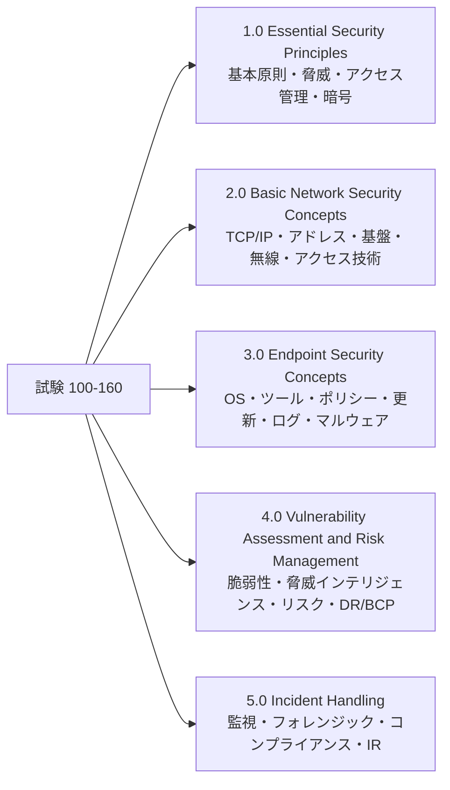

> 📝 公式ブループリントでは、ドメインごとの配点（％）は日本語ページ上で確認できませんでした。5 ドメインとも満遍なく学習することを推奨します。

---

## 2. 学習ロードマップ

### 2-1. 学習の進め方（フローチャート）

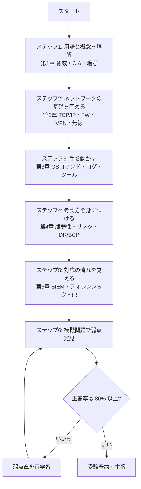

### 2-2. 4 週間学習プラン（目安）

| 週 | 学習内容 | ゴール | 手を動かす課題 |
|---|---|---|---|
| 第1週 | 第1章（原則・脅威・AAA・暗号） | CIA と各脅威の違いを自分の言葉で説明できる | パスワードマネージャーの導入、MFA を自分のアカウントで有効化 |
| 第2週 | 第2章（ネットワーク） | IP / CIDR / NAT / DMZ / ACL / VPN の役割を説明できる | Cisco Packet Tracer で ACL を 1 つ作成（無料の Cisco Networking Academy 教材を活用） |
| 第3週 | 第3章・第4章（エンドポイント、脆弱性、リスク） | `netstat` / `nslookup` / `tcpdump` の出力を読める。CVSS とリスク分類を説明できる | 自宅 PC で netstat とイベントビューアを確認、自宅ルーターの設定見直し |
| 第4週 | 第5章・第6章（インシデント対応、総復習） | IR ライフサイクルとキルチェーンを説明できる | 模擬問題を解き、弱点章を復習 |

> 無料の公式学習教材として、Cisco Networking Academy の「サイバーセキュリティ キャリア パス」が Cisco 日本語ページで案内されています（URL は参考文献を参照）。

---

## 3. 試験範囲マップ（全 23 目標）

Cisco Learning Network 公開の試験トピック（100-160）に基づく一覧です。

| 目標 | 内容 | 本ガイドの節 |
|---|---|---|
| **1.0** | **Essential Security Principles** | **第1章** |
| 1.1 | 基本的なセキュリティ原則の定義 | 1.1 |
| 1.2 | 一般的な脅威と脆弱性の説明 | 1.2 |
| 1.3 | アクセス管理の原則の説明 | 1.3 |
| 1.4 | 暗号化の方式と用途の説明 | 1.4 |
| **2.0** | **Basic Network Security Concepts** | **第2章** |
| 2.1 | TCP/IP プロトコルの脆弱性 | 2.1 |
| 2.2 | ネットワークアドレスがセキュリティに与える影響 | 2.2 |
| 2.3 | ネットワークインフラと関連技術 | 2.3 |
| 2.4 | SoHo 無線ネットワークの安全な設定 | 2.4 |
| 2.5 | セキュアなアクセス技術の実装 | 2.5 |
| **3.0** | **Endpoint Security Concepts** | **第3章** |
| 3.1 | OS のセキュリティ概念 | 3.1 |
| 3.2 | セキュリティ評価情報を収集するエンドポイントツール | 3.2 |
| 3.3 | エンドポイントがポリシー・標準を満たすことの確認 | 3.3 |
| 3.4 | ソフトウェアとハードウェアの更新 | 3.4 |
| 3.5 | システムログの解釈 | 3.5 |
| 3.6 | マルウェア除去の基礎 | 3.6 |
| **4.0** | **Vulnerability Assessment and Risk Management** | **第4章** |
| 4.1 | 脆弱性管理の説明 | 4.1 |
| 4.2 | 脅威インテリジェンスによる脆弱性の特定 | 4.2 |
| 4.3 | リスク管理の説明 | 4.3 |
| 4.4 | 災害復旧と事業継続計画の重要性 | 4.4 |
| **5.0** | **Incident Handling** | **第5章** |
| 5.1 | セキュリティイベントの監視とエスカレーション判断 | 5.1 |
| 5.2 | デジタルフォレンジックと攻撃者の特定プロセス | 5.2 |
| 5.3 | コンプライアンスフレームワークがインシデント対応に与える影響 | 5.3 |
| 5.4 | サイバーセキュリティインシデント対応の要素 | 5.4 |

---

# 第1章 Essential Security Principles（セキュリティの基本原則）

## 1.1 基本的なセキュリティ原則の定義

> 試験トピック：脆弱性・脅威・エクスプロイト・リスク、攻撃ベクトル、ハードニング、多層防御、CIA、攻撃者の種類、攻撃の動機、倫理規範

### 📘 まず理解しよう：家の防犯にたとえると

| セキュリティ用語 | 家のたとえ | 具体例（IT） |
|---|---|---|
| 資産 (Asset) | 家の中の貴重品 | 顧客データ、サーバー、アカウント |
| 脆弱性 (Vulnerability) | 鍵の壊れた窓 | 未パッチの OS、弱いパスワード、設定ミス |
| 脅威 (Threat) | 空き巣に入ろうとする人・台風 | 攻撃者、マルウェア、災害 |
| エクスプロイト (Exploit) | 壊れた窓をこじ開ける道具・手口 | 脆弱性を突くコードや手順 |
| リスク (Risk) | 実際に盗難被害が出る可能性と大きさ | 「発生確率 × 影響度」で評価 |

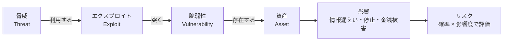

### 🔧 詳細解説

#### (1) 攻撃ベクトル (Attack Vector)

攻撃者が**侵入・攻撃に使う経路**のことです。

| 攻撃ベクトル | 例 | 主な対策 |
|---|---|---|
| メール | 添付ファイル、悪意あるリンク | メールフィルタ、利用者教育、添付ファイルのサンドボックス |
| Web | 改ざんサイト、ドライブバイダウンロード | Web フィルタ、ブラウザ更新、プロキシ |
| リモート接続 | 公開 RDP・VPN への総当たり | MFA、VPN 経由のみ許可、アカウントロックアウト |
| リムーバブルメディア | 拾った USB メモリ | USB 利用制限、自動実行無効化 |
| 無線 | 偽アクセスポイント | WPA3 / 802.1X、不正 AP 検知 |
| サプライチェーン | 改ざんされたソフトウェア更新 | ベンダー評価、署名検証、SBOM の活用 |
| クラウド設定ミス | 公開設定のストレージ | 設定監査、最小権限、既定で非公開 |
| 内部者 | 退職者の残存アカウント | アカウントのライフサイクル管理、ログ監視 |

#### (2) ハードニング (Hardening)

**システムの攻撃されやすい箇所（攻撃対象領域：Attack Surface）を減らす作業**です。

| ハードニング項目 | 具体例 |
|---|---|
| 不要なものを止める | 使わないサービス・ポート・アカウント・ソフトを削除/無効化 |
| 初期設定を変える | 既定のパスワード・SSID・管理者名の変更 |
| 最新化する | OS、アプリ、ファームウェアのパッチ適用 |
| 最小権限にする | 日常作業は一般ユーザーで実施、管理者権限は必要時のみ |
| 保護機能を有効化 | ホスト型ファイアウォール、ディスク暗号化、ログ記録 |
| 基準に沿う | CIS Benchmarks などの設定基準に照らして点検 |

#### (3) 多層防御 (Defense in Depth)

1 つの対策が破られても、**次の層で止める**考え方です。「城の堀・城壁・門・見張り・金庫」のように、複数の防御を重ねます。

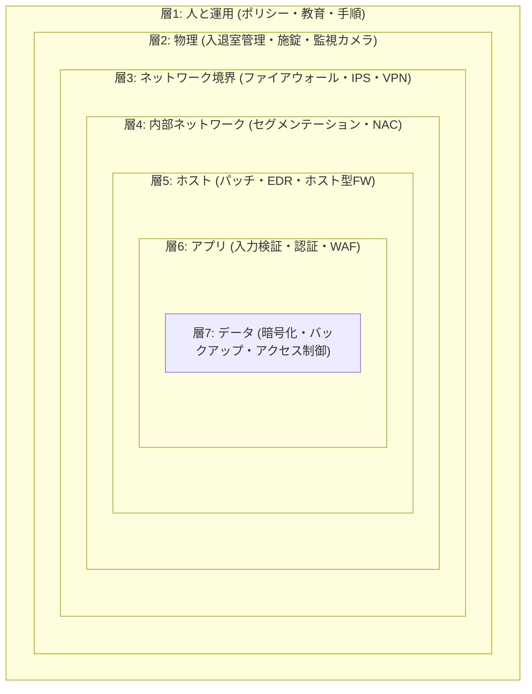

#### (4) CIA トライアド（情報セキュリティの 3 要素）

| 要素 | 意味 | 侵害される例 | 代表的な対策 |
|---|---|---|---|
| **機密性 (Confidentiality)** | 許可された人だけが情報にアクセスできる | 顧客情報の漏えい、盗聴 | 暗号化、アクセス制御、MFA |
| **完全性 (Integrity)** | 情報が正確で、改ざんされていない | データ書き換え、ファイル改ざん | ハッシュ、デジタル署名、変更管理 |
| **可用性 (Availability)** | 必要なときに使える | DDoS、ランサムウェア、機器故障 | 冗長化、バックアップ、DDoS 対策 |

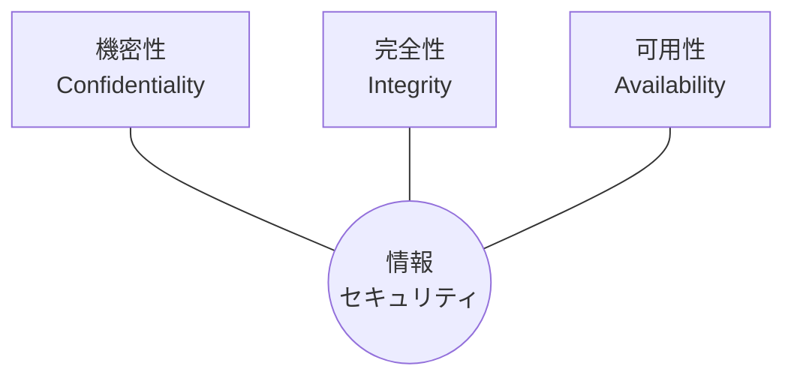

> 💡 **関連概念**：認証（本人確認）、否認防止（Non-repudiation：後から「やっていない」と言えないこと）、説明責任（Accountability：誰が何をしたか追えること）も CIA を補う重要な性質です。

#### (5) 攻撃者の種類と動機

| 攻撃者の種類 | 特徴 | 主な動機 |
|---|---|---|
| スクリプトキディ | 既製ツールを使う初心者 | 好奇心、いたずら、承認欲求 |
| ハクティビスト | 主張のための攻撃（Web 改ざん、DDoS） | 政治・社会的主張 |
| サイバー犯罪者 / 組織犯罪 | ランサムウェア、詐欺、情報売買 | 金銭 |
| 内部者 (Insider) | 従業員、委託先 | 不満、金銭、あるいは過失 |
| 国家支援の攻撃者 / APT | 高度で長期間、潜伏 | スパイ活動、妨害、地政学的目的 |
| ホワイトハット / ブラックハット / グレーハット | 許可を得て診断 / 悪意で攻撃 / 許可なく発見・公表 | 防御 / 犯罪 / 混在 |

#### (6) 倫理規範 (Code of Ethics)

セキュリティの専門家は強力な知識を持つため、**倫理と法令順守**が前提です。国際資格団体 ISC2 の倫理規範の 4 本柱が代表例です。

1. 社会、公共の利益、必要な公的信頼と信用、およびインフラを守る
2. 名誉・誠実・公正・責任ある行動をとり、法令を順守する
3. 依頼者（主たる関係者）に対して勤勉かつ有能なサービスを提供する
4. 専門職を発展させ、守る

実務でのポイントは次のとおりです。

- **必ず事前に書面の許可を得る**（診断の範囲・期間・手法を明記）
- 診断で得た機密情報は目的外に使わない・持ち出さない
- 脆弱性を見つけたら、責任ある開示（Responsible Disclosure）の手順で関係者へ連絡する
- 日本では**不正アクセス禁止法**により、他人の ID・パスワードの不正利用や、アクセス制御を破る行為が禁止されています

### ✅ ベストプラクティス

1. **資産を把握する**：守る対象（資産）を洗い出して優先順位を付ける。守る対象が分からないと対策が決まらない。
2. **多層防御を前提に設計する**：単一の製品や対策に依存しない。
3. **最小権限の原則 (Least Privilege)**：業務に必要な最小限の権限だけを付与する。
4. **デフォルトで安全 (Secure by Default)**：初期設定のまま使わない。
5. **CIA のどれを重視するか明確にする**：たとえば病院の電子カルテは可用性と完全性、機密文書は機密性を特に重視する。

### 🎯 試験ポイント

- 「脆弱性」＝**弱点**、「脅威」＝**害を及ぼす存在や事象**、「エクスプロイト」＝**脆弱性を突く手段**、「リスク」＝**損害が生じる可能性と影響の大きさ**。この 4 つの区別が頻出です。
- 「データが書き換えられた」→ **完全性**、「サービスが止まった」→ **可用性**、「情報が盗み見られた」→ **機密性**。
- 「複数の防御を重ねる」→ **多層防御**。
- 「不要なサービスを停止する」→ **ハードニング**。

---

## 1.2 一般的な脅威と脆弱性の説明

> 試験トピック：マルウェア、ランサムウェア、DoS、ボットネット、ソーシャルエンジニアリング（テールゲーティング、スピアフィッシング、フィッシング、ビッシング、スミッシング等）、物理攻撃、MITM、IoT の脆弱性、内部脅威、APT

### 📘 まず理解しよう

サイバー攻撃は「**技術の弱点を突く**」ものと「**人の心理や油断を突く**」ものに大別できます。実際の被害の多くは、人の操作（メールの添付ファイルを開く等）をきっかけに始まります。

### 🔧 詳細解説

#### (1) マルウェア (Malware) の種類

| 種類 | 特徴 | 感染・拡散の仕組み |
|---|---|---|
| ウイルス (Virus) | 他のファイルに寄生し、利用者の操作で動く | ファイルの実行・開封で拡散 |
| ワーム (Worm) | 単独で動き、自己増殖する | ネットワーク経由で自動的に拡散 |
| トロイの木馬 (Trojan) | 正規ソフトに見せかける | 利用者が自分でインストールしてしまう |
| ランサムウェア (Ransomware) | ファイルを暗号化し、復旧と引き換えに金銭を要求 | メール、脆弱性、盗まれた認証情報から侵入。近年はデータを盗み公開を脅す「二重恐喝」も一般的 |
| スパイウェア (Spyware) | 情報を密かに収集 | フリーソフトに同梱など |
| キーロガー (Keylogger) | キー入力を記録して ID・パスワードを盗む | マルウェアやハードウェアで実現 |
| ルートキット (Rootkit) | 自分や他のマルウェアの存在を隠す | OS の深部に潜む。検出・除去が困難 |
| アドウェア (Adware) | 広告を強制表示 | フリーソフトに同梱 |
| ファイルレスマルウェア | ディスクにファイルを残さずメモリ上や正規ツールで動く | PowerShell など正規ツールの悪用 |

#### (2) DoS / DDoS とボットネット

| 用語 | 説明 |
|---|---|
| DoS (Denial of Service) | 大量の通信や処理要求で、サービスを使えなくする攻撃（**可用性**への攻撃） |
| DDoS (Distributed DoS) | 多数の端末から同時に行う DoS |
| ボットネット (Botnet) | マルウェアに感染した多数の端末（ボット）を、C2（指令サーバー）から遠隔操作するネットワーク。DDoS、スパム送信、ブルートフォースに悪用される |
| 増幅攻撃 (Amplification) | 小さな要求で大きな応答を返す仕組み（DNS、NTP 等）を悪用し、偽装した送信元に応答を集中させる |

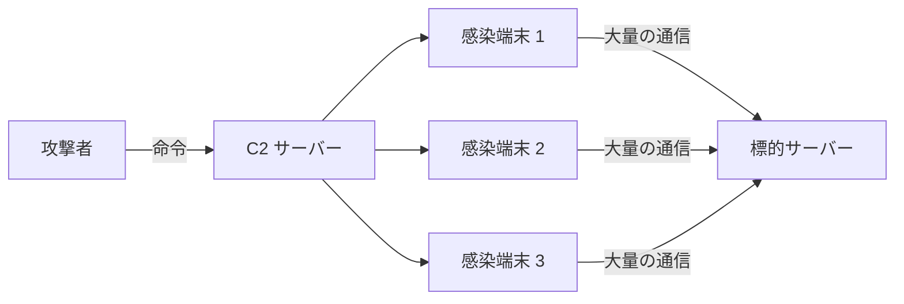

#### (3) ソーシャルエンジニアリング (Social Engineering)

人の心理的な隙や信頼を悪用して、情報を聞き出したり、不正な行動をさせたりする手法の総称です。

| 手法 | 手段・特徴 | 見分け方・対策 |
|---|---|---|
| フィッシング (Phishing) | 偽メール・偽サイトで認証情報を盗む（不特定多数向け） | 送信元アドレス・URL の確認、リンクを直接開かず公式アプリやブックマークから |
| スピアフィッシング (Spear Phishing) | 特定の個人・組織に合わせて作り込んだ標的型メール | 取引先を装う内容でも、別経路（電話等）で確認 |
| ホエーリング (Whaling) | 経営層を狙うスピアフィッシング | 経営層向けの追加教育、承認フローの二重化 |
| ビッシング (Vishing) | 電話（Voice）を使う詐欺 | 着信番号を信用せず、公式番号へかけ直す |
| スミッシング (Smishing) | SMS を使う詐欺 | SMS のリンクを開かない、公式アプリから確認 |
| テールゲーティング / ピギーバッキング | 入館者の後ろについて不正入室 | 1 人ずつ認証、入退室ゲート、声かけ文化 |
| プリテキスティング (Pretexting) | 作り話（なりすまし）で信頼させて情報を得る | 本人確認の手順を決め、例外を作らない |
| ベイティング (Baiting) | 餌（拾わせる USB 等）で誘い込む | 拾った媒体は PC に挿さずに報告 |
| ショルダーサーフィン | 画面・入力を肩越しに盗み見 | プライバシーフィルター、周囲確認 |
| ダンプスターダイビング | ゴミ箱から書類を漁る | シュレッダー、媒体の確実な廃棄 |

> 💡 **ポイント**：多くのソーシャルエンジニアリングは「**緊急性**（今すぐ！）」「**権威**（上司・当局）」「**恐怖・利益**」で判断力を奪います。「急がされたら一度止まる」が最大の防御です。

#### (4) 物理攻撃と中間者攻撃 (MITM)

| 脅威 | 説明 | 対策 |
|---|---|---|
| 物理攻撃 | 端末の盗難、不正機器の接続、カード複製、施錠破り | 施錠、監視カメラ、入退室管理、ディスク暗号化、未使用ポートの無効化 |
| MITM（中間者攻撃） | 通信の途中に割り込み、盗聴や改ざんを行う（ARP スプーフィング、偽 AP＝イービルツイン、SSL ストリッピング等） | HTTPS/TLS の徹底、証明書警告を無視しない、公共 Wi-Fi で VPN、DAI（後述） |

#### (5) IoT の脆弱性、内部脅威、APT

| 脅威 | 説明 | 対策 |
|---|---|---|
| IoT の脆弱性 | カメラ、ルーター、家電などで、初期パスワードのまま、更新されない、不要なポートが開放されている等。ボットネット化されやすい | 初期パスワード変更、更新、専用 VLAN への分離、不要サービス停止 |
| 内部脅威 (Insider Threat) | 悪意のある従業員だけでなく、**不注意（誤送信、設定ミス）**も含む | 最小権限、職務分掌、ログ監視、退職時の即時アカウント停止 |
| APT (Advanced Persistent Threat) | 高度で執拗な標的型攻撃。長期間潜伏して目的を達成 | 多層防御、ログの長期保存と相関分析、EDR、脅威インテリジェンス |

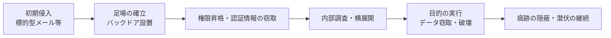

### ✅ ベストプラクティス

| 脅威カテゴリ | 推奨対策 |
|---|---|
| マルウェア全般 | EDR / アンチウイルス、定期更新、最小権限、アプリケーション許可リスト |
| ランサムウェア | **オフライン／イミュータブルなバックアップ**、定期的な復元テスト、パッチ、MFA、ネットワーク分離 |
| DDoS | クラウド型 DDoS 対策、CDN、レート制限、帯域の冗長化 |
| ソーシャルエンジニアリング | 定期的な教育・模擬訓練、報告しやすい文化、メール認証（SPF / DKIM / DMARC） |
| 物理 | 入退室管理、来訪者管理、機器の持ち出し管理、画面ロック |
| IoT | 資産台帳に登録、初期設定変更、VLAN 分離、サポート終了機器の撤去 |

### 🎯 試験ポイント

- **ウイルス**＝利用者の操作が必要、**ワーム**＝自己増殖、**トロイの木馬**＝正規を装う、を区別する。
- **フィッシング / スピアフィッシング / ホエーリング / ビッシング / スミッシング**は「対象」と「手段」で判別する。
- 入館者の後ろにつく → **テールゲーティング**。
- 多数の感染端末が C2 の指令で動く → **ボットネット**。
- 長期間潜伏して標的を狙う → **APT**。

---

## 1.3 アクセス管理の原則の説明

> 試験トピック：AAA、RADIUS、MFA、パスワードポリシー

### 📘 まず理解しよう：ホテルのたとえ

| AAA | ホテルでの例 | IT での例 |
|---|---|---|
| **認証 (Authentication)** | フロントで宿泊者本人か確認する | ID・パスワード、MFA で「誰か」を確認 |
| **認可 (Authorization)** | 渡されたカードキーで入れる部屋が決まる | 「何ができるか」の権限を付与 |
| **アカウンティング (Accounting)** | 入退室の記録が残る | 誰が・いつ・何をしたかのログ |

### 🔧 詳細解説

#### (1) AAA と RADIUS

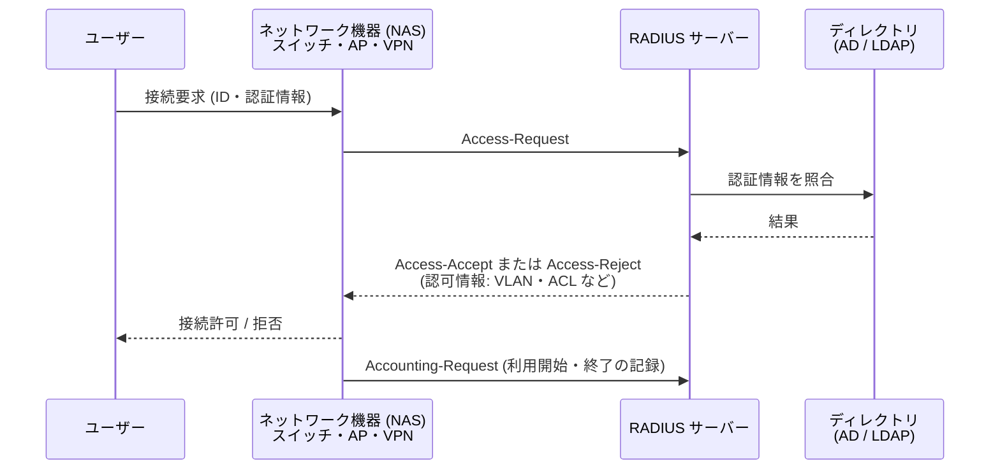

| 項目 | RADIUS | TACACS+（比較用） |
|---|---|---|
| 主な用途 | ネットワークアクセス（VPN、Wi-Fi、802.1X） | ネットワーク機器の管理（ルーター・スイッチのコマンド認可） |
| トランスポート | UDP（認証 1812、アカウンティング 1813） | TCP 49 |
| 暗号化 | **パスワードのみ**暗号化 | **ペイロード全体**を暗号化 |
| AAA の分離 | 認証と認可を組み合わせる | 認証・認可・アカウンティングを分離 |
| 規格 | オープン標準 (IETF) | Cisco 由来 |

> 💡 Cisco の NAC 製品 Cisco Identity Services Engine (ISE) は RADIUS / TACACS+ の両方に対応しています。

#### (2) 多要素認証 (MFA)

**異なる種類の要素を 2 つ以上**組み合わせる認証です。同じ種類を 2 つ（パスワード＋秘密の質問）組み合わせても MFA にはなりません。

| 要素 | 意味 | 例 |
|---|---|---|
| 知識 (Something you know) | 本人だけが知っている情報 | パスワード、PIN |
| 所持 (Something you have) | 本人だけが持っている物 | スマホ、IC カード、セキュリティキー |
| 生体 (Something you are) | 身体的特徴 | 指紋、顔、虹彩 |
| 場所・行動 (補助的) | 位置情報や行動パターン | 位置情報、普段と違うログイン検知 |

**MFA 方式の強度の目安**（下に行くほど強い）

| 方式 | 強度 | 注意点 |
|---|---|---|
| SMS コード | 低〜中 | SIM スワップ、フィッシングに弱い |
| TOTP アプリ（ワンタイムパスワード） | 中 | 偽サイトにコードを入力してしまうと突破される |
| プッシュ通知 | 中 | 「MFA 疲労攻撃」に注意。数字照合を併用 |
| FIDO2 / パスキー / セキュリティキー | **高（フィッシング耐性あり）** | 導入・運用設計が必要 |

#### (3) パスワードポリシー

| 観点 | 従来型（試験で問われやすい） | 近年の考え方（NIST SP 800-63B-4） |
|---|---|---|
| 長さ | 8〜12 文字以上 | **長さを重視**。パスワード単独なら 15 文字以上を要求、64 文字以上を受け付ける |
| 複雑性 | 大文字・小文字・数字・記号を必須化 | 組成ルールの強制はしない |
| 有効期限 | 60〜90 日ごとに変更 | 定期変更を要求しない。**漏えいの疑い時に変更** |
| 履歴 | 過去の再利用を禁止 | 既知の漏えい・弱いパスワードのブロックリストで拒否 |
| ロックアウト | 数回の失敗でロック | レート制限など。ロックによる DoS にも配慮 |
| その他 | — | パスワードマネージャーの利用を許可（貼り付け許可） |

> ⚠️ **試験対策**：CCST の学習では、従来型のポリシー（長さ・複雑性・有効期限・履歴・ロックアウト）が「パスワードポリシーの要素」として扱われる可能性があります。一方、実務では NIST の新しい指針が推奨です。**どちらも説明できる**ようにしておくと安心です。

#### (4) 認可モデルと原則

| 用語 | 説明 |
|---|---|
| 最小権限 (Least Privilege) | 業務に必要な最小限の権限だけ付与 |
| 職務分掌 (Separation of Duties) | 重要な作業を複数人で分担し、不正を防ぐ |
| Need-to-Know | 業務上知る必要がある情報だけ開示 |
| DAC（任意アクセス制御） | 所有者が権限を決める（一般的なファイル共有） |
| MAC（強制アクセス制御） | システム/ポリシーが機密レベルで強制 |
| RBAC（ロールベース） | 役割（経理、人事等）に権限を紐づける。企業で最も一般的 |
| ABAC（属性ベース） | 部署・場所・時間などの属性で動的に判断 |

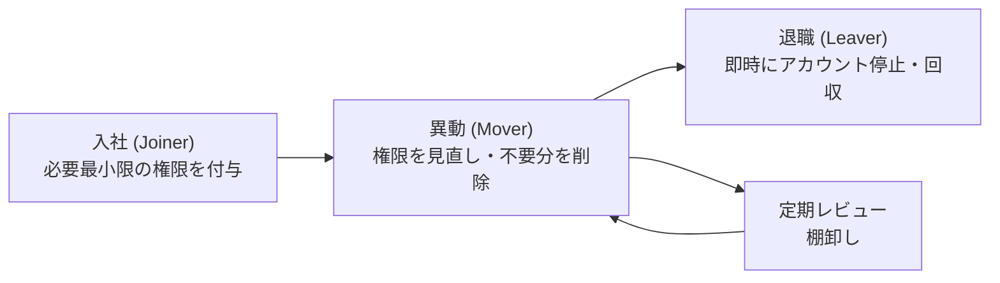

### ✅ ベストプラクティス

1. **すべての重要なアカウントに MFA** を有効化（特に管理者、VPN、メール、クラウド）。
2. **可能なら FIDO2 / パスキー**などフィッシング耐性のある方式を採用。
3. **パスワードマネージャー**で、サービスごとに固有の長いパスワードを使う。
4. 管理者アカウントは**日常利用と分離**し、必要時のみ昇格（特権アクセス管理）。
5. **共有アカウントを避ける**（誰が操作したか追えなくなる）。
6. アカウントの**棚卸しを定期的に実施**し、退職者・休眠アカウントを削除。
7. 認証の成功・失敗ログを**集約して監視**（アカウンティングの実践）。

### 🎯 試験ポイント

- 「誰か」→ **認証**、「何ができるか」→ **認可**、「何をしたか記録」→ **アカウンティング**。
- RADIUS は **UDP**、**パスワードのみ暗号化**。TACACS+ は **TCP**、**全体を暗号化**。
- MFA は**異なる要素**の組み合わせ（パスワード＋PIN は MFA ではない）。
- 最小権限、職務分掌の定義を正確に。

---

## 1.4 暗号化の方式と用途の説明

> 試験トピック：暗号化の種類、ハッシュ、証明書、PKI、強い/弱い暗号アルゴリズム、データの状態と適切な暗号化（転送中・保存中・使用中）、暗号を使うプロトコル

### 📘 まず理解しよう

- **暗号化 (Encryption)**：鍵を使ってデータを読めない形（暗号文）に変換する。**鍵があれば元に戻せる**（機密性）。
- **ハッシュ (Hash)**：データから固定長の「指紋」を作る。**元に戻せない**（完全性の確認）。
- **エンコード (Encoding)**：Base64 などの単なる形式変換。**鍵がなく誰でも戻せる**ため、セキュリティ対策ではない。

| 比較 | 暗号化 | ハッシュ | エンコード |
|---|---|---|---|
| 目的 | 機密性 | 完全性の確認、パスワード保管 | データ形式の変換 |
| 元に戻せるか | 鍵があれば戻せる | 戻せない（一方向） | 誰でも戻せる |
| 例 | AES、RSA | SHA-256、bcrypt | Base64 |

### 🔧 詳細解説

#### (1) 暗号の種類：共通鍵と公開鍵

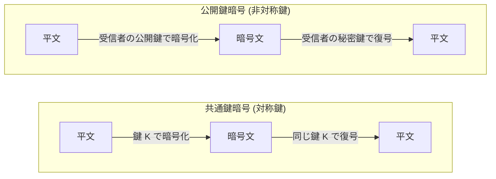

| 比較 | 共通鍵暗号 (Symmetric) | 公開鍵暗号 (Asymmetric) |
|---|---|---|
| 鍵 | 1 つの鍵を共有 | 公開鍵と秘密鍵のペア |
| 速度 | 速い（大量データ向き） | 遅い（少量のデータ・鍵交換・署名向き） |
| 課題 | 鍵を安全に配る必要 | 計算が重い |
| 代表例 | AES（128/192/256 ビット）、ChaCha20 | RSA、ECC（楕円曲線）、Diffie-Hellman（鍵交換） |
| 弱い例 | DES、3DES、RC4 | 短い鍵長の RSA（1024 ビット以下） |

> 💡 実際の通信（HTTPS など）は**ハイブリッド方式**です。公開鍵暗号で安全に鍵を交換し、その後は速い共通鍵暗号でデータを暗号化します。

#### (2) ハッシュとデジタル署名

| 項目 | 説明 |
|---|---|
| ハッシュの性質 | 同じ入力→同じ出力／1 ビット違えば全く別の値（雪崩効果）／逆算できない／衝突しにくい |
| 強いハッシュ | SHA-256、SHA-384、SHA-512、SHA-3 |
| 弱いハッシュ | MD5、SHA-1（衝突攻撃が実証されており、セキュリティ用途では非推奨） |
| パスワードの保管 | **ソルト（ランダム値）付き**で、bcrypt / scrypt / Argon2 / PBKDF2 など**わざと遅い**方式を使う |

**デジタル署名**は「秘密鍵で署名し、公開鍵で検証する」仕組みで、**完全性・真正性・否認防止**を提供します（機密性は提供しません）。

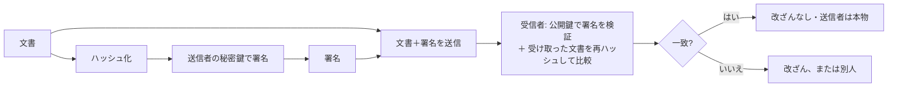

#### (3) 証明書と PKI

**デジタル証明書 (X.509)** は、「この公開鍵は確かにこの相手のもの」と**第三者（認証局：CA）が保証**する電子的な身分証です。

| PKI の構成要素 | 役割 |
|---|---|
| 認証局 (CA) | 証明書を発行・署名する信頼できる第三者 |
| ルート CA / 中間 CA | 信頼の起点 / ルートの下で実際に発行する CA |
| 登録局 (RA) | 申請者の本人確認を担当 |
| CSR | 証明書署名要求。公開鍵と申請情報をまとめたもの |
| CRL / OCSP | 失効した証明書を確認する仕組み |

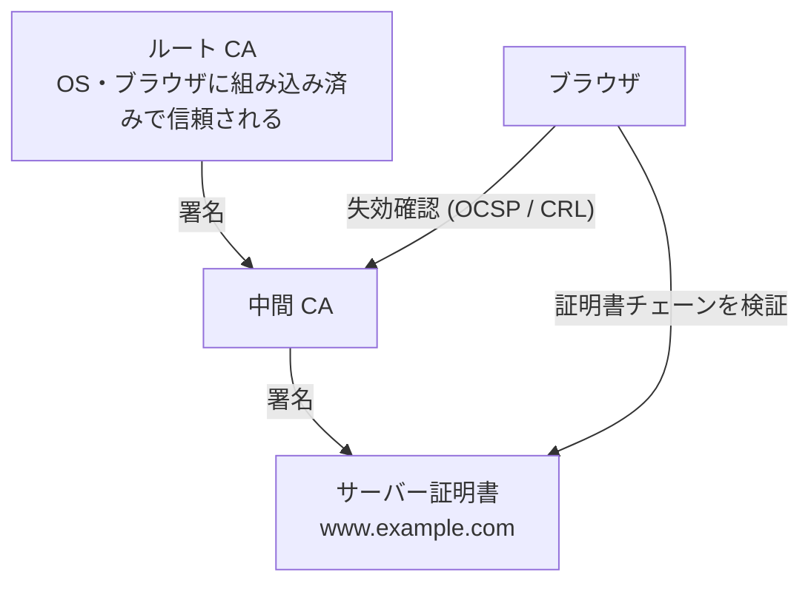

ブラウザが確認するポイントは「**信頼された CA の署名か／有効期限内か／ドメイン名が一致するか／失効していないか**」です。

#### (4) 強い暗号と弱い暗号

| 分類 | 強い（推奨） | 弱い（非推奨・廃止） |
|---|---|---|
| 共通鍵 | AES-128 / AES-256（GCM 等） | DES、3DES、RC4 |
| 公開鍵 | RSA 2048 ビット以上、ECC（P-256 等） | RSA 1024 ビット以下 |
| ハッシュ | SHA-256 以上、SHA-3 | MD5、SHA-1 |
| TLS | TLS 1.3、TLS 1.2（安全な暗号スイート） | SSL 2.0/3.0、TLS 1.0/1.1 |
| 無線 | WPA3、WPA2-AES (CCMP) | WEP、WPA-TKIP |

#### (5) データの状態と適切な暗号化

| データの状態 | 意味 | 暗号化の例 |
|---|---|---|
| 保存中 (At Rest) | ディスク・DB・バックアップに保管されている | BitLocker、FileVault、LUKS、DB の透過的暗号化、暗号化バックアップ |
| 転送中 (In Transit) | ネットワークを流れている | TLS (HTTPS)、SSH、IPsec VPN、WPA3 |
| 使用中 (In Use) | メモリ上で処理中 | コンフィデンシャルコンピューティング、メモリ保護、アクセス制御 |

#### (6) 暗号を使うプロトコルと、その非暗号版

| 用途 | 安全なプロトコル | 安全でない（平文）プロトコル |
|---|---|---|
| Web | HTTPS (TCP 443、TLS) | HTTP (TCP 80) |
| リモート管理 | SSH (TCP 22) | Telnet (TCP 23) |
| ファイル転送 | SFTP（SSH 上）、FTPS | FTP (TCP 21)、TFTP |
| メール | SMTPS / STARTTLS、IMAPS、POP3S、S/MIME | 平文の SMTP / POP3 / IMAP |
| VPN | IPsec、TLS VPN、WireGuard | PPTP（脆弱） |
| 無線 | WPA2-AES、WPA3 | WEP、オープン |
| 管理 | SNMPv3 | SNMPv1 / v2c（コミュニティ文字列が平文） |
| DNS | DoH / DoT（クエリの暗号化）、DNSSEC（応答の**署名**による改ざん検知） | 平文の DNS (UDP/TCP 53) |

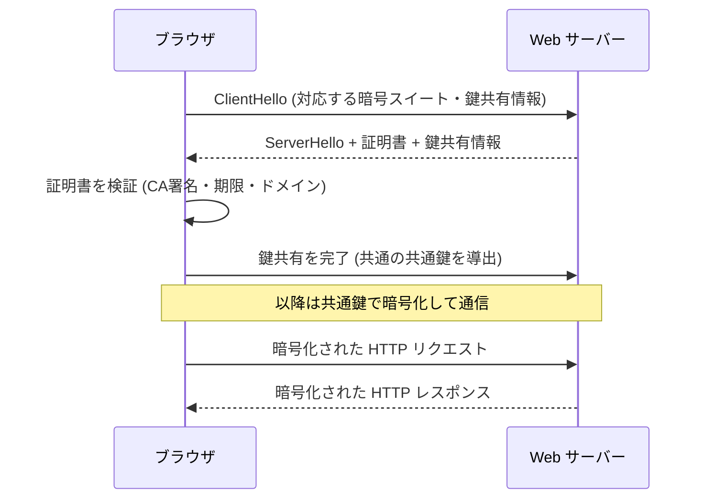

### ✅ ベストプラクティス

1. **TLS 1.2 以上（できれば 1.3）** を使用し、TLS 1.0 / 1.1 と SSL は無効化する。
2. **自作の暗号は使わない**。実績ある標準アルゴリズムとライブラリを使う。
3. **鍵管理を重視**：鍵は暗号化したデータと別の場所で保管し、定期的にローテーション。HSM や KMS の利用も検討。
4. **パスワードは平文保存せず、ソルト付きの低速ハッシュで保存**。
5. **全データの状態（保存中・転送中）を暗号化**。ノート PC や USB は特にディスク暗号化を必須化。
6. 証明書は**有効期限を管理**し、自動更新（ACME 等）を活用。期限切れによる障害を防ぐ。
7. 弱いアルゴリズム（MD5、SHA-1、DES、RC4）は**設定で明示的に無効化**する。

### 🎯 試験ポイント

- 共通鍵 = **速い・1 つの鍵**、公開鍵 = **遅い・鍵ペア**。実際の通信は**両者の組み合わせ**。
- ハッシュは**一方向**で**完全性**、暗号化は**双方向**で**機密性**。
- デジタル署名は**秘密鍵で署名・公開鍵で検証**。
- **DNSSEC は暗号化ではなく署名**（改ざん検知）。暗号化は DoH / DoT。
- 弱い：**DES / 3DES / RC4 / MD5 / SHA-1 / WEP / TLS 1.0**。
- 状態：**At Rest / In Transit / In Use**。

---

# 第2章 Basic Network Security Concepts（ネットワークセキュリティの基礎）

## 2.1 TCP/IP プロトコルの脆弱性

> 試験トピック：TCP、UDP、HTTP、ARP、ICMP、DHCP、DNS

### 📘 まず理解しよう

TCP/IP の多くのプロトコルは、**インターネットが小さな信頼できる研究ネットワークだった時代**に設計されたため、「相手が正直である」前提で作られています。そのため、認証がない・平文である・送信元を偽装できるといった**設計上の弱点**があり、攻撃に悪用されます。

### 🔧 詳細解説

| プロトコル | 役割・特徴 | 代表的な脆弱性・攻撃 | 主な対策 |
|---|---|---|---|
| **TCP** | 信頼性のある接続型通信（3 ウェイハンドシェイク） | **SYN フラッド**（半開接続を大量に作りリソース枯渇）、セッションハイジャック、ポートスキャン | SYN クッキー、レート制限、ファイアウォール、ランダムなシーケンス番号 |
| **UDP** | 軽量な非接続型通信 | 送信元の偽装が容易、**増幅型 DDoS**（DNS・NTP 等）、UDP フラッド | 送信元アドレスの検証（ingress フィルタリング）、不要な UDP ポートの遮断、レート制限 |
| **HTTP** | Web の通信（TCP 80） | **平文**で盗聴・改ざん可能、Cookie 窃取、アプリ層攻撃（SQL インジェクション、XSS） | **HTTPS 化**、HSTS、WAF、入力値検証、Cookie に Secure / HttpOnly 属性 |
| **ARP** | IP アドレスから MAC アドレスを調べる（同一セグメント内） | **認証がない**ため、ARP スプーフィング/ポイズニングで MITM が可能 | **DAI (Dynamic ARP Inspection)**、ポートセキュリティ、静的 ARP（重要機器のみ） |
| **ICMP** | 疎通確認・エラー通知（ping 等） | ping スイープ（偵察）、ICMP フラッド、スマーフ攻撃（ブロードキャスト悪用）、ICMP トンネリング | 必要な種類のみ許可（すべて遮断すると障害切り分けが困難）、レート制限、ブロードキャスト応答の無効化 |
| **DHCP** | IP アドレス等の自動配布 | **不正 DHCP サーバー**（偽のゲートウェイ/DNS を配布）、**DHCP 枯渇攻撃** | **DHCP スヌーピング**（信頼ポートのみサーバー応答を許可）、ポートセキュリティ |
| **DNS** | 名前から IP アドレスを解決（UDP/TCP 53） | **キャッシュポイズニング**、DNS ハイジャック、**DNS トンネリング**（情報持ち出し）、DNS 増幅攻撃 | DNSSEC、DoH/DoT、再帰問い合わせの制限、DNS ログ監視 |

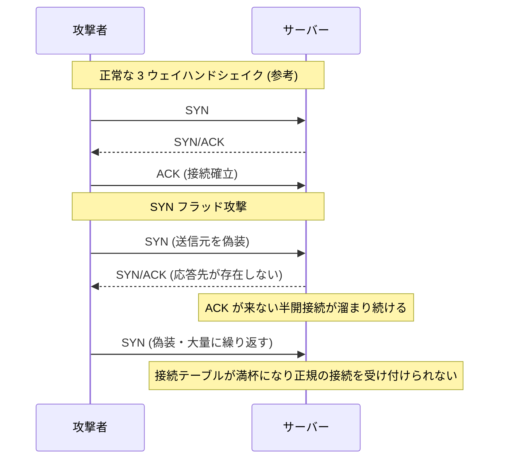

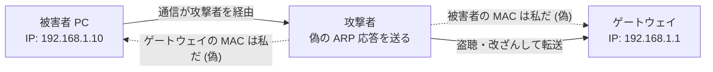

#### 主なポート番号（暗記推奨）

| ポート | プロトコル | ポート | プロトコル |
|---|---|---|---|
| 20/21 | FTP（データ/制御） | 110 | POP3 |
| 22 | SSH / SFTP | 123 | NTP（UDP） |
| 23 | Telnet | 143 | IMAP |
| 25 | SMTP | 161/162 | SNMP（UDP） |
| 53 | DNS | 389 / 636 | LDAP / LDAPS |
| 67/68 | DHCP（UDP） | 443 | HTTPS |
| 69 | TFTP（UDP） | 514 | Syslog（UDP） |
| 80 | HTTP | 3389 | RDP |

### ✅ ベストプラクティス

1. **平文プロトコルを暗号化版へ置き換える**（HTTP→HTTPS、Telnet→SSH、FTP→SFTP）。
2. L2 スイッチで **ポートセキュリティ・DHCP スヌーピング・DAI** をセットで有効化する。
3. 境界で **ingress / egress フィルタリング**（偽装された送信元アドレスの遮断、不要ポートの遮断）。
4. DNS は社内の**信頼できるリゾルバーを使用**し、ログを収集して異常なクエリ（長いランダム文字列など）を監視する。
5. ICMP は**完全遮断ではなく、必要なタイプのみ許可**する。
6. 不要なサービス・ポートは閉じる（ハードニング）。

### 🎯 試験ポイント

- **ARP は認証なし** → ARP スプーフィング → 対策は **DAI**。
- **DHCP** の脅威（不正サーバー、枯渇）→ 対策は **DHCP スヌーピング**。
- **SYN フラッド** = TCP の半開接続を悪用した DoS。
- **DNS キャッシュポイズニング** = 偽の応答を正規の DNS キャッシュに記憶させる攻撃。
- **HTTP は平文** → HTTPS が対策。

---

## 2.2 ネットワークアドレスがセキュリティに与える影響

> 試験トピック：IPv4・IPv6 アドレス、MAC アドレス、ネットワークセグメンテーション、CIDR 表記、NAT、パブリック/プライベートネットワーク

### 📘 まず理解しよう：住所のたとえ

| アドレス | たとえ | 特徴 |
|---|---|---|
| **MAC アドレス** | 機器そのものの「製造番号」 | 同一ネットワーク（L2）内の通信で使う。48 ビット |
| **IP アドレス** | 現在の「住所」 | ネットワークをまたぐ通信（L3）で使う。ネットワークを移れば変わる |

### 🔧 詳細解説

#### (1) IPv4 と IPv6

| 項目 | IPv4 | IPv6 |
|---|---|---|
| 長さ | 32 ビット（例：192.168.1.10） | 128 ビット（例：2001:db8::1） |
| アドレス数 | 約 43 億 | 事実上無限 |
| NAT | 一般的に利用 | 基本的に不要（機器ごとにグローバルアドレスを持てる） |
| セキュリティ上の注意 | ARP スプーフィング、スキャンが容易 | **NAT に頼れない**ため、ファイアウォールで明示的に制御。RA（ルーター広告）の偽装、IPv6 を使っていない環境でも有効なままの IPv6 を悪用される例 |

> 💡 **IPv6 の注意**：「NAT がないから安全でない」のではなく、「**NAT は本来セキュリティ機能ではない**」ことが重要です。IPv6 でも適切なファイアウォールポリシーで守ります。

#### (2) 特別なアドレス範囲

| 範囲 | 用途 |
|---|---|
| 10.0.0.0/8、172.16.0.0/12、192.168.0.0/16 | **プライベートアドレス**（RFC 1918）。インターネットには直接ルーティングされない |
| 127.0.0.0/8（::1） | ループバック（自分自身） |
| 169.254.0.0/16（IPv6 は fe80::/10） | リンクローカル（DHCP が取得できない時の自動割り当て等） |
| IPv6 の fc00::/7 | ユニークローカル（IPv4 のプライベートに相当） |
| IPv6 の 2000::/3 | グローバルユニキャスト（インターネットで使用可能） |

#### (3) CIDR 表記（サブネット）

`192.168.10.0/24` の `/24` は、**先頭 24 ビットがネットワーク部**であることを意味します。

| CIDR | サブネットマスク | 利用可能ホスト数 | 用途の例 |
|---|---|---|---|
| /8 | 255.0.0.0 | 16,777,214 | 超大規模 |
| /16 | 255.255.0.0 | 65,534 | 大規模 |
| /24 | 255.255.255.0 | 254 | 一般的な LAN |
| /26 | 255.255.255.192 | 62 | 部署単位 |
| /27 | 255.255.255.224 | 30 | 小規模セグメント |
| /28 | 255.255.255.240 | 14 | DMZ など小規模 |
| /30 | 255.255.255.252 | 2 | ルーター間リンク |

> 計算式：利用可能ホスト数 = 2^(32 − プレフィックス長) − 2（ネットワークアドレスとブロードキャストアドレスを除く）

#### (4) ネットワークセグメンテーション

ネットワークを**用途や信頼度ごとに分割**し、侵害されても被害を局所化する考え方です。

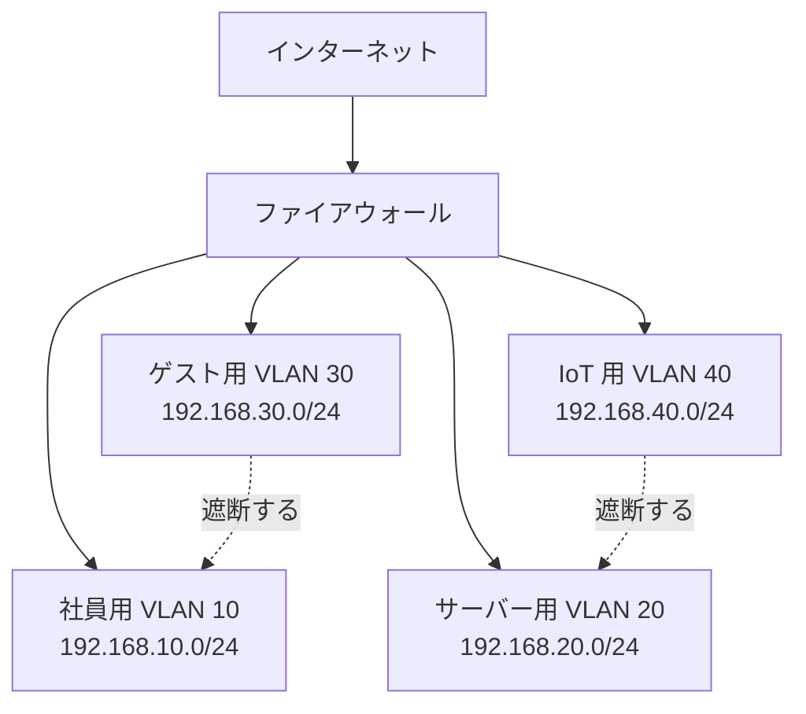

| 手法 | 説明 |
|---|---|
| VLAN | 物理スイッチを論理的に分割する（L2 での分離） |
| サブネット + ACL / FW | L3 で分割し、セグメント間の通信を制御 |
| マイクロセグメンテーション | ワークロード単位の細かい分離（データセンタ・クラウド） |
| 物理分離 | 完全に別のネットワーク（重要な制御系など） |

**効果**：①横展開（ラテラルムーブメント）の抑制、②ブロードキャストの範囲縮小、③コンプライアンス対象（例：カード情報）の範囲限定、④障害の影響範囲の限定。

#### (5) NAT（Network Address Translation）

プライベートアドレスをパブリックアドレスに**変換**する技術です。

| 種類 | 説明 |
|---|---|
| 静的 NAT | 1 対 1 の固定変換（公開サーバー向け） |
| 動的 NAT | アドレスのプールから動的に割り当て |
| PAT（NAPT / オーバーロード） | **1 つのグローバルアドレスをポート番号で多数の端末が共有**（家庭用ルーターで一般的） |

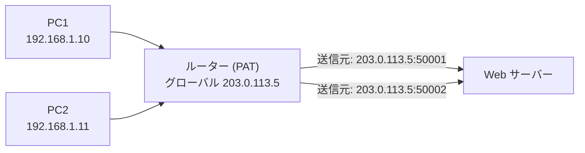

**セキュリティ上の位置づけ**

- 内部アドレスが外部から直接見えないため、**副次的に外部からの直接到達を防ぐ**効果はある。
- しかし NAT 自体は**ファイアウォールの代替ではない**。ポートフォワーディングや UPnP で意図せず内部機器が公開されることもある。

#### (6) MAC アドレス

- 48 ビット（例：`00:1A:2B:3C:4D:5E`）。前半 24 ビットはベンダー識別子 (OUI)。
- **MAC アドレスは書き換え可能**（MAC スプーフィング）。**MAC アドレスだけで認証する方式は弱い**。
- 対策：ポートセキュリティ（ポートごとに学習できる MAC を制限）、802.1X。

### ✅ ベストプラクティス

1. **ゲスト・IoT・社員・サーバー・管理用ネットワークを分離**し、セグメント間は**デフォルト拒否**の ACL / ファイアウォールで制御。
2. **インターネットに公開する機器だけを DMZ に置き**、内部と分離する（2.3 参照）。
3. 機器に**必要以上のグローバル IP を割り当てない**。ルーターの UPnP は原則無効化。
4. **IPv6 を使わない場合でも**、有効のまま放置せず、使うなら IPv4 と同等のフィルタリングを設定する。
5. IP アドレス管理 (IPAM) を行い、**資産台帳とアドレス割り当てを一致**させる。
6. MAC アドレスは**識別情報として補助的に使う**。認証の根拠にしない。

### 🎯 試験ポイント

- **RFC 1918 のプライベート範囲**（10/8、172.16/12、192.168/16）を覚える。
- **/24 = 254 ホスト**、/30 = 2 ホスト など CIDR とホスト数の対応。
- **PAT** = ポート番号を使って 1 つの IP アドレスを複数端末が共有。
- **NAT はセキュリティ製品ではない**（副次的効果）。
- セグメンテーションの目的は**被害の局所化（横展開の防止）**。

---

## 2.3 ネットワークインフラと関連技術

> 試験トピック：ネットワークセキュリティアーキテクチャ、DMZ、仮想化、クラウド、ハニーポット、プロキシサーバー、IDS、IPS

### 📘 まず理解しよう

企業ネットワークは「**外（インターネット）**」「**中間（公開サーバー用）**」「**内（社内）**」のように**信頼度の異なるゾーン**に分けて設計します。ゾーンの境界にファイアウォールなどを置いて通信を制御します。

### 🔧 詳細解説

#### (1) DMZ（スクリーンドサブネット）

インターネットから接続される**公開サーバー（Web、メール、DNS など）を置く緩衝地帯**です。DMZ のサーバーが侵害されても、社内ネットワークへ直接広がらないようにします。

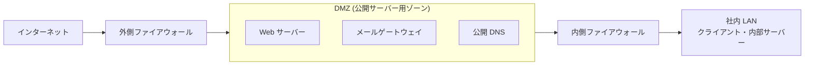

| 通信の方向 | 基本ポリシー |
|---|---|
| インターネット → DMZ | 必要なサービスのポートのみ許可 |
| インターネット → 社内 | **原則すべて拒否** |
| DMZ → 社内 | **原則拒否**（必要最小限のみ例外的に許可） |
| 社内 → DMZ | 管理・利用に必要なものを許可 |
| 社内 → インターネット | プロキシ経由など、ポリシーに従い許可 |

> 構成は「2 台のファイアウォールで挟む形」のほか、「**1 台のファイアウォールに 3 つ目のインターフェースを設けて DMZ とする形**」もあります。

#### (2) 仮想化 (Virtualization)

| 項目 | 内容 |
|---|---|
| 仕組み | 1 台の物理サーバー上で、ハイパーバイザーが複数の仮想マシン (VM) を動かす（Type 1：ベアメタル型、Type 2：ホスト OS 上で動作） |
| 利点 | 資源の効率化、スナップショット、迅速な復旧、検証環境の分離 |
| リスク | **VM エスケープ**（ゲストからハイパーバイザー/他 VM へ侵害）、**VM スプロール**（管理されない VM の乱立）、ハイパーバイザーの脆弱性、古いスナップショットに残る脆弱性 |
| 対策 | ハイパーバイザーの迅速なパッチ、管理ネットワークの分離、VM テンプレートのハードニング、VM 台帳管理、不要な VM の削除 |

#### (3) クラウド (Cloud)

**責任共有モデル**：クラウド事業者と利用者で、守る範囲が分かれます。

| 守る対象 | IaaS | PaaS | SaaS |
|---|---|---|---|
| データ・アカウント・アクセス管理 | 利用者 | 利用者 | 利用者 |
| アプリケーション | 利用者 | 利用者 | 事業者 |
| OS・ミドルウェア | 利用者 | 事業者 | 事業者 |
| 仮想化基盤・ネットワーク | 事業者 | 事業者 | 事業者 |
| 物理（データセンタ） | 事業者 | 事業者 | 事業者 |

> 💡 **どの形態でも「データ」と「アクセス管理（ID・権限）」は利用者の責任**です。クラウドの事故の多くは**設定ミス**（ストレージの公開設定、過剰な権限、MFA 未設定）です。

#### (4) ハニーポット (Honeypot)

攻撃者を引き寄せるための**おとり（偽のシステム）**です。

| 目的 | 説明 |
|---|---|
| 早期検知 | 通常業務では誰も触らないはずの機器へのアクセス＝不審な動きとして検知 |
| 攻撃手法の収集 | 攻撃者のツール・手口を観察し、脅威インテリジェンスに活用 |
| 時間稼ぎ | 攻撃者の注意を本物から逸らす |

低対話型（簡易なサービスを模倣）と高対話型（本物に近い）があり、複数をまとめたものは**ハニーネット**と呼ばれます。**本番ネットワークから隔離**して運用し、踏み台にされないよう注意します。

#### (5) プロキシサーバー (Proxy Server)

| 種類 | 役割 |
|---|---|
| フォワードプロキシ | **社内のクライアントの代理**でインターネットへ接続。URL フィルタリング、マルウェア検査、アクセスログ、キャッシュ |
| リバースプロキシ | **サーバー側の代理**として外部からのリクエストを受ける。サーバーの隠蔽、負荷分散、TLS 終端、WAF 機能 |

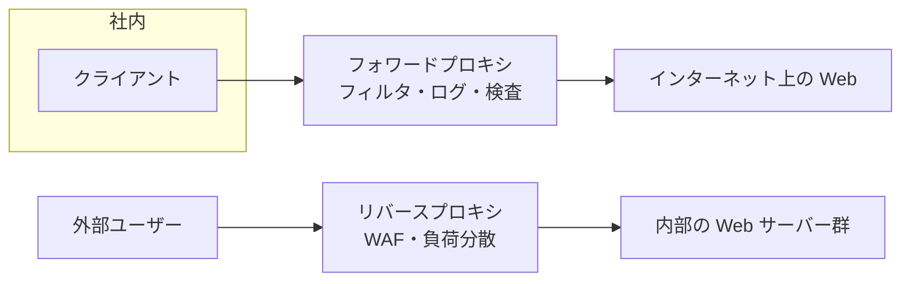

#### (6) IDS と IPS

| 比較 | IDS（侵入検知システム） | IPS（侵入防御システム） |
|---|---|---|
| 動作 | **検知して通知**（パッシブ） | **検知して自動的にブロック**（インライン） |
| 設置 | ミラーポート (SPAN) / TAP で**コピーした通信を監視** | 通信経路上に**直列に設置** |
| 通信への影響 | 通信を止めない（遅延なし） | 障害点・遅延になり得る |
| 誤検知（False Positive）の影響 | アラートが増える | **正常な通信を遮断**してしまうリスク |
| 種類 | NIDS（ネットワーク型）／HIDS（ホスト型） | NIPS／HIPS |

| 検知方式 | 説明 | 長所 | 短所 |
|---|---|---|---|
| シグネチャ型 | 既知の攻撃パターンと照合 | 既知の攻撃に正確 | 未知の攻撃（ゼロデイ）に弱い。更新が必須 |
| アノマリ型（異常検知） | 通常の状態を学習し、逸脱を検知 | 未知の攻撃も検知し得る | 誤検知が多くなりがち。チューニングが必要 |

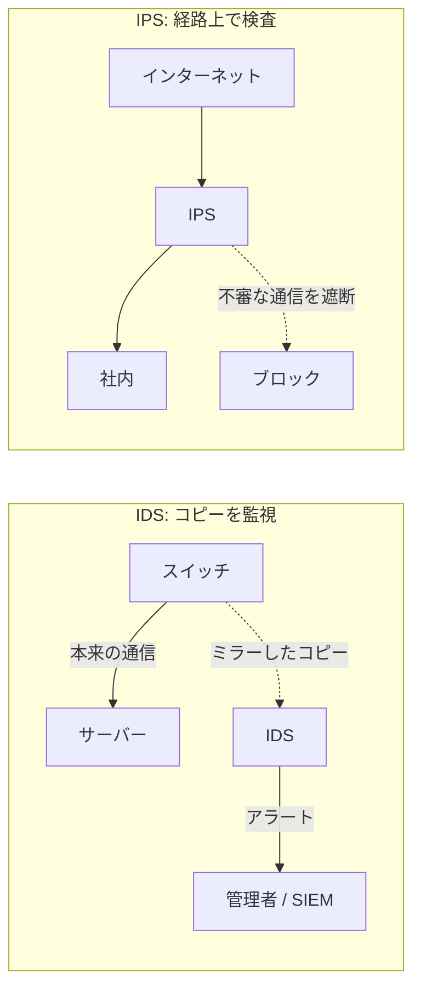

### ✅ ベストプラクティス

1. **ゾーン設計**：インターネット、DMZ、社内、管理、ゲスト、IoT を分け、**ゾーン間はデフォルト拒否**。
2. **DMZ の機器は最小構成・最優先パッチ**。DMZ から社内への通信は厳しく制限。
3. **クラウドは責任共有を理解**し、IAM の最小権限、MFA、公開設定の継続監査（CSPM など）を実施。
4. **IPS はまず検知モードで運用**し、誤検知を調整してから防御モードへ。
5. **IDS/IPS のシグネチャを自動更新**し、アラートを SIEM に集約して相関分析する。
6. ハニーポットは**隔離して設置**し、検知ログを必ず監視体制に接続する。
7. プロキシで**URL フィルタリング・ログ取得**を行い、インシデント調査に備える。

### 🎯 試験ポイント

- **DMZ** = 公開サーバーを置く緩衝地帯（社内への直接到達を防ぐ）。
- **IDS = 検知（パッシブ）／IPS = 防御（インライン）**。
- **フォワードプロキシ = クライアント側の代理／リバースプロキシ = サーバー側の代理**。
- **ハニーポット** = おとり。早期検知と手法の収集。
- 責任共有：**データとアクセス管理は常に利用者**。

---

## 2.4 SoHo 無線ネットワークの安全な設定

> 試験トピック：MAC アドレスフィルタリング、暗号化の規格とプロトコル、SSID

### 📘 まず理解しよう

SoHo（Small Office / Home Office）は小規模なオフィス・自宅のネットワークです。専任の管理者がいないため、**設定ミスや初期設定のまま放置**が最大のリスクになります。無線は電波が壁を越えるため、**暗号化が最重要**です。

### 🔧 詳細解説

#### (1) 無線の暗号化規格

| 規格 | 暗号化方式 | 状態 | 備考 |
|---|---|---|---|
| WEP | RC4 | ❌ **完全に破られており使用禁止** | 数分で解読可能 |
| WPA | TKIP (RC4 ベース) | ❌ 非推奨 | WEP の暫定的な後継 |
| **WPA2** | **AES-CCMP** | ⭕ 現在も広く使用 | PSK（家庭向け）／Enterprise（802.1X） |
| **WPA3** | AES（GCMP 等）+ **SAE** | ⭕ **推奨** | 総当たり耐性の強化、保護された管理フレーム (PMF) 必須 |

| モード | 認証方式 | 用途 |
|---|---|---|
| Personal（PSK / SAE） | 共通のパスフレーズ | 家庭・小規模オフィス |
| Enterprise（802.1X） | **RADIUS サーバー**で利用者ごとに認証 | 企業。退職者の個別失効が可能 |

> 💡 WPA3-Personal の SAE (Simultaneous Authentication of Equals) は、オフライン辞書攻撃への耐性を高め、前方秘匿性（Forward Secrecy）も提供します。

#### (2) SSID と MAC アドレスフィルタリングの位置づけ

| 対策 | 効果 | 評価 |
|---|---|---|
| **SSID の変更** | 初期 SSID（機種名が分かるもの）を変え、機種特定のヒントを減らす | ⭕ 推奨（ただし個人情報を含めない） |
| **SSID の非表示（ステルス）** | 一覧に表示されない | ⚠️ **セキュリティ効果は低い**（接続時の通信で SSID が見える。接続の不具合の原因にもなる） |
| **MAC アドレスフィルタリング** | 登録した機器のみ接続許可 | ⚠️ **補助的**（MAC は盗聴で見えて、偽装も容易） |
| **強力な暗号化 (WPA2/3)** | 通信内容の保護と認証 | ⭕ **最優先** |

#### (3) SoHo 無線の安全な設定手順

```mermaid
flowchart TD
    S1["1. ルーターの管理者パスワードを初期値から変更"] --> S2["2. ファームウェアを最新に更新"]
    S2 --> S3["3. SSID を変更 (個人情報・機種名を含めない)"]
    S3 --> S4["4. WPA3 (無理なら WPA2-AES) を設定し<br/>長いパスフレーズを設定"]
    S4 --> S5["5. WPS を無効化 / UPnP・リモート管理を無効化"]
    S5 --> S6["6. ゲスト用・IoT 用の SSID を分離"]
    S6 --> S7["7. 必要に応じて MAC フィルタを補助的に追加"]
    S7 --> S8["8. ログ確認・定期的な接続端末の棚卸し"]
```

| 設定項目 | 推奨 |
|---|---|
| 管理者パスワード | 初期値から変更。長く固有のものに |
| 無線の暗号化 | **WPA3**。非対応端末があれば WPA2-AES（TKIP は使わない） |
| パスフレーズ | 長い（目安 15 文字以上）ランダムなフレーズ |
| WPS | **無効化**（PIN 方式に脆弱性が知られている） |
| リモート管理 / UPnP | 原則無効化 |
| ゲストネットワーク | 社内機器と分離し、帯域・時間も制限 |
| ファームウェア | 自動更新、サポート終了機器は交換 |
| 不正 AP 対策 | 周辺の SSID を定期確認し、同名の不審な AP（イービルツイン）に注意 |

### ✅ ベストプラクティス

1. **暗号化が主役、SSID 非表示や MAC フィルタは補助**と理解する。
2. 企業向けは **WPA2/WPA3-Enterprise（802.1X + RADIUS）** で個人ごとに認証。
3. **IoT 機器は専用 SSID・VLAN に隔離**する。
4. パスフレーズは**退職時・漏えい時に変更**する。Enterprise なら個別アカウントの失効で対応。
5. 公共 Wi-Fi では **VPN と HTTPS** を使う。

### 🎯 試験ポイント

- **WEP は完全に危険、WPA2-AES / WPA3 が推奨**。TKIP は非推奨。
- **SSID 非表示・MAC フィルタはセキュリティ上は弱い補助策**（試験では「十分な対策ではない」という観点で問われやすい）。
- **WPS は無効化**。
- 初期パスワードの変更、ファームウェア更新は基本中の基本。

---

## 2.5 セキュアなアクセス技術の実装

> 試験トピック：ACL、ファイアウォール、VPN、NAC

### 🔧 詳細解説

#### (1) ACL（アクセスコントロールリスト）

ルーターやスイッチ、ファイアウォールで、**通信を「許可 (permit)」または「拒否 (deny)」するルールの一覧**です。

| 種類 | 判断条件 | 番号の範囲 | 設置のコツ |
|---|---|---|---|
| 標準 ACL | **送信元 IP アドレスのみ** | 1–99、1300–1999 | **宛先に近い**場所 |
| 拡張 ACL | 送信元・宛先 IP、プロトコル、ポート番号 | 100–199、2000–2699 | **送信元に近い**場所 |

**ACL の基本ルール**

1. **上から順に評価**し、最初に一致したルールで処理（以降は評価しない）。
2. 末尾に**暗黙の deny any**がある（どれにも一致しなければ拒否）。
3. インターフェースの**方向（in / out）ごと**に適用する。
4. 具体的なルールを上、一般的なルールを下に書く。

```mermaid
flowchart TD
    P["パケットが到着"] --> R1{"ルール1に一致?"}
    R1 -- "はい" --> A1["ルールの動作 (permit または deny)"]
    R1 -- "いいえ" --> R2{"ルール2に一致?"}
    R2 -- "はい" --> A2["ルールの動作"]
    R2 -- "いいえ" --> RN{"最後のルールに一致?"}
    RN -- "はい" --> AN["ルールの動作"]
    RN -- "いいえ" --> D["暗黙の deny で破棄"]
```

**設定例（Cisco IOS・学習用）：社員 VLAN から Web と DNS のみ許可**

```text
ip access-list extended EMPLOYEE-OUT
 permit tcp 192.168.10.0 0.0.0.255 any eq 80
 permit tcp 192.168.10.0 0.0.0.255 any eq 443
 permit udp 192.168.10.0 0.0.0.255 any eq 53
 deny ip any any log
!
interface GigabitEthernet0/1
 ip access-group EMPLOYEE-OUT in
```

> `0.0.0.255` は**ワイルドカードマスク**（サブネットマスクの逆）です。「`0` = 一致を確認、`255` = 無視」を意味します。

#### (2) ファイアウォール

| 種類 | 仕組み | 特徴 |
|---|---|---|
| パケットフィルタ型 | 1 パケットずつ IP・ポートで判定 | 高速だが、通信の「文脈」を見ない |
| **ステートフル型** | **通信の状態（セッション）を記憶**して判定 | 戻りの通信を自動的に許可。現在の標準 |
| プロキシ / アプリケーションゲートウェイ型 | 代理接続し、アプリ層の内容まで検査 | 詳細な検査が可能だが負荷が高い |
| **次世代 FW (NGFW)** | ステートフル + アプリ識別 + IPS + URL フィルタ + マルウェア対策 + ユーザー識別 | 現在の企業境界の主流 |
| WAF | Web アプリへの攻撃（SQL インジェクション、XSS）を防ぐ | HTTP/HTTPS に特化 |
| ホスト型 FW | 端末ごとのファイアウォール（Windows Defender ファイアウォール、firewalld 等） | 端末単位で防御（3.1 参照） |

```mermaid
flowchart TD
    P["パケットが到着"] --> T{"状態テーブルに<br/>既存セッションがある?"}
    T -- "はい (戻りの通信など)" --> ALLOW["許可"]
    T -- "いいえ" --> RULE{"ポリシーのルールに一致?"}
    RULE -- "許可ルール" --> NEW["許可し、状態テーブルに登録"]
    RULE -- "拒否 / 一致なし" --> DROP["破棄しログ記録"]
```

#### (3) VPN（仮想プライベートネットワーク）

公衆網（インターネット）上に**暗号化されたトンネル**を作り、安全に通信する技術です。

| 種類 | 用途 |
|---|---|
| **リモートアクセス VPN** | 在宅勤務者や出張者が社内へ接続 |
| **サイト間 (Site-to-Site) VPN** | 拠点同士（本社と支店）をルーター/FW 間で接続 |

| 方式 | 特徴 |
|---|---|
| IPsec VPN | ネットワーク層で暗号化。**IKE** で鍵交換し、**ESP** で暗号化と認証。**トンネルモード**（IP パケット全体を包む）と**トランスポートモード**（ペイロードのみ） |
| SSL/TLS VPN | TLS（443）を利用。ブラウザやクライアントで接続しやすく、ファイアウォールを通過しやすい |
| 参考 | Cisco のクライアントは **Cisco Secure Client**（旧 AnyConnect）として提供 |

| 設計の選択 | 説明 |
|---|---|
| フルトンネル | **すべての通信**を VPN 経由にする。会社の検査・ログを確実に適用できる。負荷は増える |
| スプリットトンネル | 社内向けのみ VPN 経由、他は直接インターネット。負荷は減るが、端末が直接インターネットに触れるリスク |

```mermaid
flowchart LR
    R["在宅ユーザー"] -->|"暗号化トンネル"| VG["VPN ゲートウェイ"]
    VG --> LAN["社内ネットワーク"]
    B1["本社ルーター / FW"] <-->|"サイト間 IPsec トンネル"| B2["支店ルーター / FW"]
```

#### (4) NAC（ネットワークアクセス制御）

ネットワークに接続しようとする機器やユーザーを**認証し、状態（ポリシー準拠）を確認したうえで、接続を許可・制限・隔離**する仕組みです。Cisco の代表製品は **Cisco Identity Services Engine (ISE)** です。

```mermaid
sequenceDiagram
    participant S as サプリカント<br/>(端末)
    participant A as オーセンティケーター<br/>(スイッチ・AP)
    participant R as 認証サーバー<br/>(RADIUS / NAC)
    S->>A: 接続 (802.1X: EAPOL)
    A->>R: 認証要求 (RADIUS)
    R->>R: 認証 + ポスチャ (OS更新・AV 有無など) の確認
    alt 準拠している
        R-->>A: Access-Accept (業務 VLAN へ)
    else 非準拠
        R-->>A: Access-Accept (隔離 VLAN・修復用ネットワークへ)
    else 認証失敗
        R-->>A: Access-Reject
    end
```

| 機能 | 説明 |
|---|---|
| **IEEE 802.1X** | ポート単位の認証。**サプリカント（端末）／オーセンティケーター（スイッチ・AP）／認証サーバー**の 3 役 |
| ポスチャ評価 | OS パッチ、アンチウイルス、暗号化の有無などを確認 |
| 隔離 (Quarantine) VLAN | 非準拠端末を修復用ネットワークへ誘導 |
| MAB（MAC Authentication Bypass） | 802.1X 非対応機器（プリンター、IoT）を MAC アドレスで例外的に認証。**補助的で、偽装されやすいため VLAN を厳しく制限する** |

### ✅ ベストプラクティス

| 技術 | 推奨プラクティス |
|---|---|
| ACL | **最小限の許可＋最後に明示的な deny（ログ付き）**、コメント（remark）で目的を記載、定期的な見直し、変更は変更管理に従う |
| ファイアウォール | **デフォルト拒否**、不要なルールの削除、ルールの棚卸し、ログを SIEM へ送信、管理画面は管理ネットワークからのみ許可 |
| VPN | **MFA 必須**、強い暗号スイート、クライアントの更新、**使わない VPN 機器の公開停止**、フルトンネルまたは厳格な分割ポリシー、接続ログの監視 |
| NAC | 802.1X を基本とし、MAB は例外運用。ゲスト・業務・隔離を VLAN で分離。**段階的導入（モニタモード → 強制）** |

### 🎯 試験ポイント

- **ACL は上から順、最後は暗黙の deny**。標準 = 送信元のみ、拡張 = 送信元・宛先・ポート。
- **ステートフルファイアウォール** = 状態を記憶し、戻りの通信を自動許可。
- **リモートアクセス VPN** と **サイト間 VPN** の違い。
- **802.1X** の 3 役（サプリカント・オーセンティケーター・認証サーバー）。
- **NAC** = 認証 + 端末の状態確認 + 隔離。

---

# 第3章 Endpoint Security Concepts（エンドポイントセキュリティ）

> **エンドポイント (Endpoint)** とは、PC、ノート PC、スマートフォン、サーバー、IoT 機器など、**ネットワークの末端に接続される機器**のことです。攻撃の多くは最終的にエンドポイントを狙うため、ここが**最後の砦**になります。

## 3.1 OS のセキュリティ概念

> 試験トピック：Windows、macOS、Linux、Windows Defender やホスト型ファイアウォールなどのセキュリティ機能、CLI と PowerShell、ファイルとディレクトリの権限、権限昇格

### 📘 まず理解しよう

OS は、利用者・アプリ・ハードウェアの間を取り持つ**すべての土台**です。OS が破られると、その上のアプリやデータも守れません。どの OS にも共通する守りの柱は次の 4 つです。

| 守りの柱 | 内容 |
|---|---|
| ① 認証とアカウント管理 | 誰が使うかを確認し、権限を分ける |
| ② アクセス制御（権限） | ファイルや機能を使える人を限定する |
| ③ 保護機能 | マルウェア対策、ファイアウォール、暗号化 |
| ④ 更新とログ | 脆弱性を塞ぎ、操作の記録を残す |

### 🔧 詳細解説

#### (1) Windows のセキュリティ機能

| 機能 | 役割 | 確認・設定の場所 |
|---|---|---|
| **Microsoft Defender ウイルス対策** | マルウェアのリアルタイム保護とスキャン | Windows セキュリティ → ウイルスと脅威の防止 |
| **Windows Defender ファイアウォール** | ホスト型ファイアウォール。**ドメイン／プライベート／パブリック**のプロファイルごとにルールを設定 | Windows セキュリティ → ファイアウォールとネットワーク保護 |
| アプリとブラウザーコントロール | SmartScreen（不審なアプリ・サイトの警告） | Windows セキュリティ → アプリとブラウザーコントロール |
| **UAC（ユーザーアカウント制御）** | 管理者権限が必要な操作の前に確認を求める | コントロールパネル／設定 |
| **BitLocker** | ドライブ全体の暗号化（保存データの保護）。TPM と併用 | コントロールパネル／管理ツール |
| **NTFS アクセス許可** | ファイル・フォルダーごとの権限（読み取り、書き込み、変更、フルコントロール 等） | プロパティ → セキュリティ |
| Windows Update | OS と Defender 定義の更新 | 設定 → Windows Update |
| イベントビューアー | セキュリティ関連のログ確認（3.5 参照） | eventvwr.msc |

**NTFS の権限の考え方**

| ポイント | 説明 |
|---|---|
| 継承 | 親フォルダーの権限は子に継承される（変更可能） |
| 拒否は許可に優先 | 同じ対象に許可と拒否が両方ある場合、**拒否が優先** |
| 累積 | ユーザーとグループの許可は**合算**される（拒否を除く） |
| 共有とNTFS | ネットワーク共有では、**共有権限と NTFS 権限のうち、より厳しい方**が実効権限になる |

**Windows の主なコマンド**

| 区分 | コマンド | 用途 |
|---|---|---|
| CMD | `ipconfig /all` | IP・DNS・MAC の確認 |
| CMD | `whoami /groups` | 現在のユーザーと所属グループ |
| CMD | `net user` | ローカルユーザー一覧 |
| CMD | `icacls C:\Data` | フォルダーの権限表示・変更 |
| CMD | `tasklist` / `taskkill` | プロセスの一覧／終了 |
| CMD | `sfc /scannow` | システムファイルの整合性検査・修復 |
| PowerShell | `Get-Process` | プロセス一覧 |
| PowerShell | `Get-NetTCPConnection` | TCP 接続の確認 |
| PowerShell | `Get-LocalUser` | ローカルユーザー一覧 |
| PowerShell | `Get-Acl C:\Data` | ACL（権限）の確認 |
| PowerShell | `Get-MpComputerStatus` | Defender の状態（定義の更新状況など） |
| PowerShell | `Start-MpScan -ScanType QuickScan` | Defender のクイックスキャン |
| PowerShell | `Get-WinEvent -LogName Security -MaxEvents 20` | セキュリティログの取得 |

> 💡 **PowerShell** はオブジェクト指向のシェルで、管理や自動化に強力な一方、**攻撃者にも悪用されやすい**（ファイルレスマルウェア等）。実行ポリシー、スクリプトブロックログ、制約付き言語モードなどで守ります。

#### (2) macOS のセキュリティ機能

| 機能 | 役割 |
|---|---|
| **Gatekeeper** | 署名・公証 (Notarization) されていないアプリの実行を制限 |
| **XProtect** | Apple 組み込みのマルウェア検出 |
| **FileVault** | ディスク全体の暗号化 |
| **SIP（System Integrity Protection）** | 重要なシステム領域を管理者（root）からも保護 |
| ファイアウォール（アプリケーションファイアウォール） | 受信接続の制御 |
| **TCC / プライバシー設定** | カメラ、マイク、ファイルへのアクセスをアプリごとに許可制御 |
| キーチェーン | パスワード・証明書の安全な保管 |

| 確認コマンド | 内容 |
|---|---|
| `fdesetup status` | FileVault の状態 |
| `csrutil status` | SIP の状態 |
| `spctl --status` | Gatekeeper の状態 |

#### (3) Linux のセキュリティ機能

**ファイル権限（`ls -l` の読み方）**

```text
-rwxr-x---  1  alice  staff  1024  Oct  5 10:00  report.sh
```

| 部分 | 意味 |
|---|---|
| 先頭 `-` | ファイルの種類（`-` ファイル、`d` ディレクトリ、`l` リンク） |
| `rwx` | **所有者**の権限（読み r・書き w・実行 x） |
| `r-x` | **グループ**の権限（読みと実行のみ） |
| `---` | **その他**の権限（なし） |

| 権限 | 数値 |
|---|---|
| r（読み） | 4 |
| w（書き） | 2 |
| x（実行） | 1 |

| 例 | 意味 |
|---|---|
| `chmod 750 file` | 所有者 rwx(7)、グループ r-x(5)、その他 なし(0) |
| `chmod 640 file` | 所有者 rw-(6)、グループ r--(4)、その他 なし(0) |
| `chmod 777 file` | **全員が全権限（危険。原則使わない）** |
| `chown alice:staff file` | 所有者とグループの変更 |

| Linux の機能 | 役割 |
|---|---|
| `sudo` / `/etc/sudoers` | 必要なコマンドだけ管理者権限で実行。**root で直接ログインしない** |
| `/etc/passwd` と `/etc/shadow` | アカウント情報／**ハッシュ化されたパスワード**（root のみ読める） |
| **firewalld**（`firewall-cmd`） / **ufw** / iptables・nftables | ホスト型ファイアウォール |
| **SELinux / AppArmor** | 強制アクセス制御（MAC）。プロセスの動作範囲を制限 |
| SSH のハードニング | root ログイン禁止、**公開鍵認証**、パスワード認証の無効化、許可ユーザーの限定 |

#### (4) 権限昇格 (Privilege Escalation)

| 種類 | 説明 | 例 |
|---|---|---|
| **垂直（Vertical）** | 一般ユーザーが**管理者・root**などより高い権限を得る | OS の脆弱性悪用、不適切な sudo 設定 |
| **水平（Horizontal）** | 同じ権限レベルの**別のユーザー**の権限・データを得る | 他人のセッションの乗っ取り |

```mermaid
flowchart TD
    A["一般ユーザー権限で侵入"] --> B{"どう昇格するか"}
    B --> C["未パッチの脆弱性を悪用"]
    B --> D["設定の不備を悪用<br/>過剰な sudo、SUID、サービスの権限"]
    B --> E["認証情報を窃取して管理者になりすます"]
    C --> F["管理者 / root 権限を取得"]
    D --> F
    E --> F
    F --> G["永続化・横展開・データ窃取"]
```

| 対策 | 内容 |
|---|---|
| 最小権限 | 日常作業は一般ユーザー。管理者権限は必要な時だけ |
| 迅速なパッチ適用 | 権限昇格の脆弱性を塞ぐ |
| UAC / sudo の適切な設定 | 昇格を明示的な操作にし、許可コマンドを限定 |
| 設定の点検 | 不要な SUID / 権限の緩いサービスを探して是正 |
| 監視 | 管理者グループへの追加、特権ログオンをログで検知（イベント 4672、4732 など） |

### ✅ ベストプラクティス

1. **日常の作業用アカウントは標準ユーザー**にし、管理者アカウントは別に用意する。
2. **ディスク暗号化**（BitLocker / FileVault / LUKS）を標準で有効化する。
3. **ホスト型ファイアウォールを常時有効**にし、受信は**デフォルト拒否**、必要なものだけ許可。
4. **マルウェア対策（Defender / EDR）を有効に保ち、定義ファイルを自動更新**する。
5. **権限は最小限**に設定し、`chmod 777` のような全員への開放は使わない。
6. **OS・アプリを最新**に保つ（3.4 参照）。
7. 設定は**ベースライン（CIS Benchmarks 等）**に沿って統一し、変更を検知する。

### 🎯 試験ポイント

- Windows の **Defender（AV）/ ファイアウォール / UAC / BitLocker / NTFS 権限** の役割を区別する。
- Linux の **`rwx` と数値（4・2・1）** の読み替え（例：`755`、`644`、`600`）。
- **垂直権限昇格 = より上位の権限へ**、**水平 = 同格の別ユーザーへ**。
- PowerShell と CMD の違い（PowerShell = オブジェクトベース、高機能、攻撃にも悪用される）。

---

## 3.2 セキュリティ評価情報を収集するエンドポイントツール

> 試験トピック：netstat、nslookup、tcpdump

### 📘 まず理解しよう

不審な動きがあるとき、まず次の 3 つの疑問に答えられることが大切です。

| 疑問 | 使うツール |
|---|---|
| この PC は**どこと通信しているか／どのポートを開いているか**？ | `netstat` |
| その**名前（ドメイン）は正しい IP アドレスに解決されるか**？ | `nslookup` |
| ネットワーク上を**実際にどんなパケットが流れているか**？ | `tcpdump` |

```mermaid
flowchart TD
    S["端末が怪しい・遅い・不審な通信がある"] --> Q1{"何を知りたい?"}
    Q1 -->|"開いているポートと<br/>接続中の相手"| N["netstat / ss"]
    Q1 -->|"ドメインの名前解決が<br/>おかしいか"| NS["nslookup / dig"]
    Q1 -->|"パケットの中身・<br/>通信パターン"| T["tcpdump / Wireshark"]
    N --> R["不審なプロセス・接続を特定"]
    NS --> R
    T --> R
    R --> NEXT["ログ確認・隔離・エスカレーション"]
```

### 🔧 詳細解説

#### (1) netstat：接続とポートの状態確認

| OS | コマンド | 内容 |
|---|---|---|
| Windows | `netstat -ano` | すべての接続とリスニングポートを**数値表示**し、**プロセス ID (PID)** も表示 |
| Windows | `netstat -b` | 接続を作成した実行ファイル名を表示（管理者権限が必要） |
| Windows | `netstat -r` | ルーティングテーブルの表示 |
| Linux | `netstat -tulpn`（または新しい **`ss -tulpn`**） | TCP/UDP のリスニングポートとプロセス |

主なオプションの意味：`-a`（すべて）、`-n`（名前解決せず数値表示）、`-o`（PID 表示、Windows）、`-t`（TCP）、`-u`（UDP）、`-l`（リスニング）、`-p`（プロセス、Linux）。

**出力の読み方（例）**

| Proto | ローカルアドレス | 外部アドレス | 状態 | PID |
|---|---|---|---|---|
| TCP | 0.0.0.0:3389 | 0.0.0.0:0 | LISTENING | 1100 |
| TCP | 192.168.1.10:50321 | 203.0.113.50:443 | ESTABLISHED | 4820 |
| TCP | 192.168.1.10:50322 | 198.51.100.7:4444 | ESTABLISHED | 7312 |

| 状態 | 意味 |
|---|---|
| LISTENING | 接続待ち受け中（ポートが開いている） |
| ESTABLISHED | 接続確立済み |
| SYN_SENT / SYN_RECEIVED | 接続開始の途中（**SYN_RECEIVED が大量なら SYN フラッドの疑い**） |
| TIME_WAIT / CLOSE_WAIT | 接続の終了処理中 |

**不審のサイン（チェックリスト）**

- 心当たりのないサービスが **LISTENING**（例：不要な 3389（RDP）、telnet の 23）
- 見慣れないアドレスへの **ESTABLISHED**、特に**怪しいポート**（4444 など攻撃ツールで多用される番号）
- 同じ外部アドレスへ**一定間隔で繰り返される接続**（C2 との定期通信＝ビーコニングの可能性）
- 不明な PID → `tasklist /FI "PID eq 7312"`（Windows）で**プロセス名を確認**

#### (2) nslookup：名前解決の確認

| 使い方 | コマンド例 |
|---|---|
| 基本の問い合わせ（A レコード） | `nslookup example.com` |
| 特定の DNS サーバーを指定 | `nslookup example.com 8.8.8.8` |
| レコードタイプの指定（MX、TXT、NS など） | `nslookup -type=MX example.com` |
| 逆引き（IP → 名前） | `nslookup 8.8.8.8` |

**セキュリティでの使いどころ**

| 目的 | 内容 |
|---|---|
| 名前解決の異常確認 | 社内 DNS と公開 DNS で**結果が違う**場合、DNS ポイズニングやハイジャックの可能性 |
| 不審ドメインの調査 | メール内のリンク先ドメインが**どの IP に解決されるか**を確認（※ブラウザで開かない） |
| メール認証の確認 | `-type=TXT` で SPF / DMARC レコードを確認 |
| 不審な問い合わせ | 異常に長く、ランダムな文字列のサブドメインは **DNS トンネリング**の疑い |

> 💡 Linux/macOS では **`dig`** が同様の目的でよく使われます（例：`dig example.com MX`）。

#### (3) tcpdump：パケットキャプチャ（Linux/macOS）

| 目的 | コマンド例 |
|---|---|
| インターフェースを指定してキャプチャ | `sudo tcpdump -i eth0 -nn` |
| 特定ホストの通信のみ | `sudo tcpdump -i eth0 host 192.168.1.10` |
| 特定ポートのみ（例：DNS） | `sudo tcpdump -i eth0 port 53` |
| 条件の組み合わせ | `sudo tcpdump -i eth0 tcp and port 443` |
| ファイルに保存 | `sudo tcpdump -i eth0 -w capture.pcap` |
| 保存したファイルの読み込み | `tcpdump -r capture.pcap` |
| 件数を制限 | `sudo tcpdump -i eth0 -c 100` |
| 内容を ASCII で表示 | `sudo tcpdump -i eth0 -A port 80` |

| オプション | 意味 |
|---|---|
| `-i` | 監視するインターフェース |
| `-nn` | 名前解決とポート名変換をしない（高速・正確） |
| `-w` / `-r` | ファイルへ書き出し／読み込み |
| `-c` | 取得するパケット数 |
| `-A` / `-X` | ペイロードを ASCII／16 進＋ASCII で表示 |
| 末尾の `host` `port` `tcp` | **BPF フィルター**（絞り込み条件） |

**何が分かるか**

| 観察できること | 示唆される問題 |
|---|---|
| SYN が大量に来て ACK が返らない | SYN フラッド |
| 同一 IP に対する ARP 応答が異なる MAC から来る | ARP スプーフィング |
| 異常に長い DNS クエリが大量 | DNS トンネリング |
| HTTP / Telnet / FTP で ID・パスワードが読める | 平文プロトコルの利用 |
| 不明な外部ホストへの定期的な小さな通信 | C2 ビーコン |

> ⚠️ **パケットキャプチャには機密情報（パスワード、個人情報）が含まれ得ます。** 許可された範囲・目的でのみ実施し、保存ファイルは暗号化して厳格に管理します。結果の詳細分析には **Wireshark** が使いやすいです。

#### 補足：併用したい基本コマンド

| コマンド | 用途 |
|---|---|
| `ping` | 疎通確認（ICMP） |
| `tracert`（Windows）/ `traceroute`（Linux） | 経路の確認 |
| `ipconfig /all`（Windows）/ `ip a`（Linux） | 自分の IP・MAC・DNS の確認 |
| `arp -a` | ARP テーブルの確認（同じ IP に異なる MAC が出ていないか） |

### ✅ ベストプラクティス

1. **ベースライン（平常時の状態）を把握**する。平常時の LISTEN ポートと通信先を知らないと、異常に気付けない。
2. `netstat` の結果は **PID → プロセス名 → 実行ファイルのパスと署名**まで確認する。
3. 名前解決の異常は**複数の DNS サーバー**で比較する。
4. パケットキャプチャは **フィルターで必要最小限に絞り**、保存データを保護する。
5. 調査は**他システムに影響を与えない読み取り中心**の操作で行い、**記録を残す**（日時、実行者、コマンド、結果）。
6. 調査結果が**インシデントの疑い**なら、操作を止めてエスカレーションする（第5章）。

### 🎯 試験ポイント

- **`netstat` = 接続とポート／`nslookup` = DNS 名前解決／`tcpdump` = パケットキャプチャ**。
- `netstat -ano` の **`-o` は PID**（Windows）。
- **LISTENING / ESTABLISHED** などの状態の意味。
- `tcpdump -w` で保存、**`-r` で読み込み**。

---

## 3.3 エンドポイントがポリシー・標準を満たすことの確認

> 試験トピック：ハードウェア資産管理、ソフトウェア資産管理、プログラム展開、データバックアップ、規制コンプライアンス（PCI DSS、HIPAA、GDPR）、BYOD（デバイス管理、データ暗号化、アプリ配布、構成管理）

### 📘 まず理解しよう

「**把握していないものは守れない**」が出発点です。持っている機器とソフトウェアを把握し、**決めたルール（ポリシー）どおりの状態か**を継続的に確認します。

```mermaid
flowchart LR
    A["資産の把握<br/>ハード・ソフトの台帳"] --> B["基準の設定<br/>ポリシー・ベースライン"]
    B --> C["展開・設定<br/>プログラム配布・構成管理"]
    C --> D["検証・監査<br/>準拠状況の確認"]
    D --> E["是正<br/>非準拠の修正"]
    E --> A
```

### 🔧 詳細解説

#### (1) 資産管理

| 区分 | 管理する内容 | 目的 |
|---|---|---|
| **ハードウェア資産管理** | PC、サーバー、ネットワーク機器、スマホ等の**種類・シリアル・所有者・設置場所・OS・導入日・保証** | 未把握機器（シャドー IT）の排除、紛失・盗難の把握、更新計画 |
| **ソフトウェア資産管理** | 導入ソフトの**名称・バージョン・ライセンス・導入先端末** | **未許可ソフト**・脆弱な旧バージョンの発見、ライセンス違反の防止 |

#### (2) プログラム（ソフトウェア）展開

| 項目 | 内容 |
|---|---|
| 一元配布 | MDM / 構成管理ツール（Microsoft Intune、Configuration Manager 等）で**承認済みソフトのみ**を配布 |
| 許可リスト（Allowlist） | 承認されたアプリだけ実行を許可 |
| 変更管理 | 展開前に**テスト→承認→展開→記録**の手順を踏む |
| 標準イメージ | ハードニング済みの**標準 OS イメージ**から展開し、設定の一貫性を確保 |

#### (3) データバックアップ

| 項目 | 内容 |
|---|---|
| **3-2-1 ルール** | **3 つ**のコピー、**2 種類**の媒体、**1 つ**はオフサイト（遠隔地・クラウド） |
| 拡張（3-2-1-1-0） | さらに **1 つはオフライン／書き換え不可（イミュータブル）**、**0 = 復元テストでエラーなし** |
| バックアップ方式 | **フル**（全データ）／**差分**（直近のフル以降の変更）／**増分**（直近のバックアップ以降の変更） |
| 暗号化 | バックアップデータも**暗号化**して保管 |

| 方式 | 容量・時間 | 復元 |
|---|---|---|
| フル | 大・長い | 最も簡単（1 つで復元） |
| 差分 | 中 | フル＋最新の差分の 2 つで復元 |
| 増分 | 小・短い | フル＋**すべての増分**が必要（復元は手間） |

> ⚠️ **「バックアップは復元できて初めて意味がある」**。定期的な**復元テスト**が必須です。ランサムウェア対策として、**オフライン／イミュータブルなコピー**が特に重要です。

#### (4) 規制コンプライアンス

| 規制 | 対象 | 概要 | 試験での押さえどころ |
|---|---|---|---|
| **PCI DSS** | **クレジットカード情報**（カード会員データ）を扱う組織 | カード情報の保護のための技術・運用要件（ネットワーク分離、暗号化、アクセス制御、ログ、脆弱性管理 など） | **カード情報＝PCI DSS** |
| **HIPAA** | 米国の**医療情報（PHI）**を扱う組織 | プライバシー規則、セキュリティ規則（管理的・物理的・技術的保護措置）、違反通知規則 | **医療情報＝HIPAA** |
| **GDPR** | **EU 居住者の個人データ**を扱う組織（EU 域外でも対象となり得る） | 本人の権利、適法な処理根拠、データ保護、**侵害時は原則 72 時間以内に監督機関へ通知**、高額の制裁金 | **EU の個人データ＝GDPR** |

> 💡 日本では**個人情報保護法**が個人情報保護の基本法です。

#### (5) BYOD（Bring Your Own Device）

私物の端末（スマホ、PC）を業務に使う運用です。**利便性とコスト削減**の一方、**情報漏えい・マルウェア・紛失**のリスクが高まります。

| 管理の領域 | 内容 |
|---|---|
| **デバイス管理** | MDM（端末全体）／MAM（業務アプリのみ）に登録。OS・パッチ・画面ロック・脱獄/root 化の検知、**リモートワイプ** |
| **データ暗号化** | 端末ストレージの暗号化、業務データの**コンテナ化**（私用領域との分離）、通信の VPN / TLS |
| **アプリ配布** | 業務アプリは管理された配布経路から。**許可リスト／禁止リスト**で管理 |
| **構成管理** | パスワード要件、Wi-Fi・VPN 設定、証明書、セキュリティ設定の**ポリシーを一括適用** |
| **規程** | 利用規程への同意、紛失時の報告義務、退職時のデータ削除、**プライバシー**（私用データへの配慮） |

```mermaid
flowchart TD
    D["私物端末"] --> E["MDM / MAM に登録"]
    E --> C{"準拠チェック<br/>OS最新・画面ロック・暗号化・脱獄なし"}
    C -- "準拠" --> OK["業務データ・アプリへのアクセスを許可"]
    C -- "非準拠" --> NG["アクセス制限・是正を要求"]
    OK --> L["紛失・退職時<br/>業務データのみ遠隔削除"]
```

### ✅ ベストプラクティス

1. **ハード・ソフトの台帳を常に最新に**保つ（自動検出ツールで補完）。
2. **標準イメージとベースライン**を定め、**設定のドリフト（逸脱）**を継続的に検知する。
3. **バックアップは 3-2-1（できれば 3-2-1-1-0）** とし、**復元テストを定期実施**。
4. 規制対象データ（カード情報、医療情報、個人データ）は**範囲を特定して分離・暗号化・アクセス制限**する。
5. **BYOD は MDM / MAM と条件付きアクセス**（準拠端末のみ接続許可）で管理し、**規程への同意**を取る。
6. 準拠状況を**定期的に監査**し、結果を記録・報告する。

### 🎯 試験ポイント

- **PCI DSS = カード**、**HIPAA = 医療（米国）**、**GDPR = EU の個人データ**。
- **3-2-1 ルール**の中身。**増分 vs 差分**の復元手順の違い。
- BYOD の 4 要素：**デバイス管理・データ暗号化・アプリ配布・構成管理**。
- **未許可ソフトの発見＝ソフトウェア資産管理**の目的。

---

## 3.4 ソフトウェアとハードウェアの更新

> 試験トピック：Windows Update、アプリケーションの更新、デバイスドライバー、ファームウェア、パッチ適用

### 📘 まず理解しよう

攻撃の多くは**すでに公開され、修正済みの脆弱性**を突いています。**更新（パッチ適用）が遅れるほど、攻撃されるリスクが高まります。**

| 用語 | 意味 |
|---|---|
| パッチ (Patch) | 脆弱性や不具合を修正する小さな更新プログラム |
| アップデート | 機能追加や修正を含む更新 |
| ファームウェア | ハードウェアを制御する組み込みソフト（BIOS/UEFI、ルーター、IoT 機器など） |
| ゼロデイ | 修正が提供される前に悪用される脆弱性 |

### 🔧 詳細解説

| 更新対象 | 内容 | 注意点 |
|---|---|---|
| **OS（Windows Update 等）** | セキュリティ更新・品質更新。Windows の月例更新は一般に**毎月第 2 火曜日（パッチチューズデー）** | 緊急の更新（定例外）もある |
| **アプリケーション** | ブラウザ、Office、PDF リーダー、Java など | **Web ブラウザとそのプラグイン**は特に優先 |
| **デバイスドライバー** | プリンタ、GPU、NIC など | **メーカー公式／署名付き**のものを使用 |
| **ファームウェア** | BIOS/UEFI、ルーター、スイッチ、IoT | 更新中の**電源断で故障**し得る。提供元の署名・ハッシュを確認 |
| **サポート終了 (EOL) 製品** | 更新が提供されない | **リスクが高く、速やかに移行**（例：Windows 10 は 2025 年 10 月 14 日にサポート終了） |

**パッチ管理のライフサイクル**

```mermaid
flowchart TD
    S1["1. 資産の把握<br/>何がどこにあるか"] --> S2["2. 情報収集<br/>ベンダー情報・CVE・脅威情報"]
    S2 --> S3["3. 優先順位付け<br/>深刻度・悪用の有無・資産の重要度"]
    S3 --> S4["4. テスト<br/>検証環境で動作確認"]
    S4 --> S5["5. 段階的展開<br/>少数の端末 → 全体"]
    S5 --> S6["6. 検証<br/>適用状況・不具合の確認"]
    S6 --> S7["7. 記録・報告"]
    S7 --> S1
    S5 -. "問題発生" .-> RB["ロールバック"]
```

| 優先順位付けの観点 | 例 |
|---|---|
| 悪用の実態 | **実際に攻撃で悪用されている**脆弱性は最優先（CISA の Known Exploited Vulnerabilities カタログ等を参照） |
| 深刻度 | CVSS のスコア（4.1 参照） |
| 露出度 | インターネットに公開されているか |
| 資産の重要度 | 重要システム・機密データを扱うか |

### ✅ ベストプラクティス

1. **自動更新を基本**とする（個人・小規模）。企業は **WSUS / Intune / Windows Update for Business** 等で配布管理。
2. **緊急度の高い更新は例外対応の手順**で迅速に展開（定例の周期を待たない）。
3. **本番展開前にテスト**し、**段階的（リング方式）に展開**する。
4. 更新前に**バックアップとロールバック手順**を準備する。
5. **サポート終了（EOL）の製品を台帳で管理**し、期限前に更新・移行計画を立てる。
6. ファームウェアは**公式サイトから入手し、署名・ハッシュを検証**して適用する。
7. 更新できない機器は**ネットワーク分離**や**仮想パッチ（IPS）**で補う。

### 🎯 試験ポイント

- 更新の目的＝**既知の脆弱性を塞ぐ**。
- パッチ適用は**テスト → 展開 → 検証**の順。
- ドライバーとファームウェアは**公式・署名付き**を使う。
- **EOL 製品はリスクが高い**。

---

## 3.5 システムログの解釈

> 試験トピック：イベントビューアー、監査ログ、システム・アプリケーションログ、syslog、異常の識別

### 📘 まず理解しよう

ログは**防犯カメラの録画**のようなものです。何が起きたか、誰が・いつ・何をしたかの**証拠**であり、**攻撃の早期発見と事後調査**の両方に必須です。

### 🔧 詳細解説

#### (1) Windows のログ（イベントビューアー）

| ログの種類 | 内容 |
|---|---|
| **セキュリティ (Security)** | ログオン成功/失敗、権限の利用、アカウント管理などの**監査イベント**（監査ポリシーで有効化したもの） |
| システム (System) | OS やドライバー、サービスの動作 |
| アプリケーション (Application) | アプリのエラー・動作 |
| セットアップ (Setup) | インストール・更新 |
| 転送されたイベント (Forwarded Events) | 他のコンピューターから収集したイベント |

| イベント ID | ログ | 意味 | 注目するポイント |
|---|---|---|---|
| **4624** | セキュリティ | **ログオン成功** | 通常ではない時間帯・場所・アカウント。ログオンの種類（2：対話型、3：ネットワーク、10：リモートデスクトップ） |
| **4625** | セキュリティ | **ログオン失敗** | **短時間に大量**＝ブルートフォース／パスワードスプレー |
| 4672 | セキュリティ | 特権（管理者相当）でのログオン | 想定外のアカウントによる特権ログオン |
| 4688 | セキュリティ | プロセスの作成 | 不審なプロセス（一時フォルダーからの実行など） |
| **4720** | セキュリティ | **ユーザーアカウントの作成** | 想定外のアカウント作成（バックドアの可能性） |
| 4732 | セキュリティ | ローカルグループへのメンバー追加 | 管理者グループへの追加 |
| 4740 | セキュリティ | アカウントのロックアウト | 攻撃や設定不備の兆候 |
| **1102** | セキュリティ | **監査ログがクリアされた** | **証拠隠滅の兆候（要警戒）** |
| 7045 | システム | 新しいサービスのインストール | 不審なサービスの登録（永続化） |

```text
# PowerShell で直近 1 時間のログオン失敗 (4625) を取得する例
Get-WinEvent -FilterHashtable @{ LogName='Security'; Id=4625; StartTime=(Get-Date).AddHours(-1) }
```

#### (2) Linux のログ

| ファイル / コマンド | 内容 |
|---|---|
| `/var/log/auth.log`（Debian・Ubuntu 系）／`/var/log/secure`（RHEL 系） | 認証、sudo、SSH ログイン |
| `/var/log/syslog` ／ `/var/log/messages` | 一般的なシステムメッセージ |
| `journalctl` | systemd のログ閲覧（例：`journalctl -u ssh --since "1 hour ago"`） |
| `last` ／ `lastb` | ログイン履歴／**ログイン失敗の履歴** |
| 検索の例 | `grep "Failed password" /var/log/auth.log` |

#### (3) syslog

ネットワーク機器・サーバーのログを**中央のサーバーへ集約**する標準的な仕組みです（既定は UDP 514。TLS の場合は TCP 6514 などを使用）。

| 重大度（Severity）| 名称 | 意味 |
|---|---|---|
| 0 | Emergency | システムが使用不能 |
| 1 | Alert | 直ちに対処が必要 |
| 2 | Critical | 重大な状態 |
| 3 | Error | エラー |
| 4 | Warning | 警告 |
| 5 | Notice | 正常だが重要 |
| 6 | Informational | 情報 |
| 7 | Debug | デバッグ |

> 💡 **数値が小さいほど重大**です（0 が最重大）。試験で頻出です。

```mermaid
flowchart LR
    A["Windows / Linux / FW / スイッチ<br/>各種ログ"] --> B["収集<br/>syslog・エージェント"]
    B --> C["集約・保管<br/>ログサーバー / SIEM"]
    C --> D["相関分析・アラート"]
    D --> E["調査・対応"]
```

#### (4) 異常（アノマリ）の見つけ方

| 異常のパターン | 考えられる事象 |
|---|---|
| 4625 が大量 → その後 4624 が成功 | **ブルートフォースに成功された**可能性 |
| 深夜・休日の管理者ログオン | 不正利用の可能性 |
| 1102（ログクリア） | 証拠隠滅 |
| 新規アカウント作成 → 管理者グループ追加 | バックドア・権限昇格 |
| 新しいサービス登録（7045）／不明な自動起動 | 永続化 |
| 通常と異なる国・IP からのログイン | アカウント乗っ取り |
| ログが突然途切れる | ログ収集の停止・改ざん |

### ✅ ベストプラクティス

1. **ログを中央に集約**（SIEM 等）し、端末上のログだけに頼らない（攻撃者に消される）。
2. **全機器の時刻を NTP で同期**する（複数ログの突き合わせに必須）。
3. **重要なイベントの監査を有効化**する（ログオン、特権の利用、アカウント変更、ポリシー変更）。
4. **保存期間とサイズを定義**し、ログの**改ざん防止**（書き込み権限の制限、転送）を行う。
5. **ベースライン**を知り、**アラート条件**（失敗の閾値、管理者グループ変更 等）を設定する。
6. ログには**個人情報**が含まれるため、アクセスを制限する。

### 🎯 試験ポイント

- **Security ログのイベント 4624（成功）／4625（失敗）／1102（ログクリア）**。
- **syslog の重大度は 0〜7、数値が小さいほど重大**。
- **ログの集約と時刻同期**の重要性。
- ログの用途＝**検知・調査・証拠・コンプライアンス**。

---

## 3.6 マルウェア除去の基礎

> 試験トピック：システムのスキャン、スキャンログの確認、マルウェアの修復（駆除）

### 📘 まず理解しよう

マルウェア感染を疑ったら、**慌てて削除しようとせず、まず被害の拡大を止める**ことが基本です。手順を決めておくことで、確実で記録の残る対応ができます。

**感染を疑う症状**：動作が極端に遅い／見覚えのないプログラムやポップアップ／ブラウザのホームページ変更／セキュリティソフトが無効化される／ファイルが開けない・拡張子が変わる／身に覚えのない通信やログイン通知。

### 🔧 詳細解説

#### マルウェア対応の標準的な流れ

```mermaid
flowchart TD
    A["1. 症状の特定・確認<br/>本当に感染か判断"] --> B["2. 隔離 (Quarantine)<br/>ネットワークから切断"]
    B --> C["3. システムの復元ポイントを無効化<br/>(Windows: マルウェアが復元ポイントに残るのを防ぐ)"]
    C --> D["4. 駆除 (Remediation)<br/>定義ファイル更新 → スキャン → 削除"]
    D --> E{"駆除できた?<br/>再検出・ルートキットの疑いは?"}
    E -- "いいえ" --> F["オフラインスキャン・<br/>クリーンな環境で再スキャン<br/>それでも駄目なら再インストール"]
    E -- "はい" --> G["5. 再スキャンと検証<br/>スキャンログ確認"]
    F --> G
    G --> H["6. 復元ポイントを有効化し<br/>新しいポイントを作成"]
    H --> I["7. 教育・再発防止<br/>原因の特定・利用者への周知"]
```

| 手順 | 具体的な作業 |
|---|---|
| ① 特定 | 症状・時刻・直前の操作（添付ファイルを開いた等）を記録。セキュリティソフトの警告を確認 |
| ② 隔離 | **LAN ケーブルを抜く／Wi-Fi を切る**。電源を落とすとメモリ上の証拠が失われるため、**組織の手順に従う** |
| ③ 復元ポイントの無効化 | 感染済みの復元ポイントからの再感染を防ぐ（Windows） |
| ④ 駆除 | **定義ファイルを更新**（別のクリーンな環境から取得）→ **フルスキャン** → 隔離/削除。ブートするとスキャンが難しい場合は**セーフモード**、**オフラインスキャン**（例：Microsoft Defender オフライン スキャン）、**ブータブルな修復メディア**を使用 |
| ⑤ 検証 | 再スキャンし、**スキャンログ**を確認。**永続化の痕跡**（スタートアップ、タスクスケジューラ、サービス、レジストリの Run キー）が残っていないか確認 |
| ⑥ 復元ポイントの再有効化 | クリーンな状態で新しいポイントを作成 |
| ⑦ 教育 | 感染経路の説明、**パスワード変更**（クリーンな別端末で）、再発防止策 |

**Microsoft Defender の主な PowerShell コマンド**

| コマンド | 内容 |
|---|---|
| `Get-MpComputerStatus` | 定義ファイルの更新状況などを確認 |
| `Update-MpSignature` | 定義ファイルを更新 |
| `Start-MpScan -ScanType FullScan` | フルスキャン |
| `Start-MpWDOScan` | Microsoft Defender オフライン スキャン（再起動して実行） |
| `Get-MpThreatDetection` | 検出された脅威の履歴 |

#### スキャンログの見方

| 確認項目 | 見るポイント |
|---|---|
| 検出された脅威名・種類 | トロイの木馬、ランサムウェア、ルートキット等 |
| ファイルのパス | 一時フォルダー、ダウンロードフォルダー、システム領域など（**感染経路のヒント**） |
| 実行された処置 | 隔離／削除／**駆除失敗** |
| 検出時刻 | **感染のタイミングと原因の特定**に使う |
| 再検出の有無 | 何度も同じ脅威が出る＝**永続化の残存**の疑い |
| 他端末での検出 | **同じ脅威が複数端末で出ていれば組織内で拡散中**（エスカレーション） |

### ✅ ベストプラクティス

1. **最初に隔離**して被害の拡大を防ぐ。
2. **ルートキットや重度の感染は、駆除に頼らず「再インストール（クリーンな状態への復元）」**が確実。
3. 駆除後は、**パスワードを変更**（感染していない別の端末から）し、**MFA を確認**。
4. **インシデントの疑いがあれば、証拠（ログ・メモリ・ディスクイメージ）の保全を検討**してから処置する（第 5 章）。
5. **他の端末にも感染がないか確認**（同じファイルのハッシュ、通信先で横断検索）。
6. **原因（経路）を特定**し、メールフィルタ、パッチ、教育など**再発防止策**を講じる。

### 🎯 試験ポイント

- **「最初は隔離（ネットワーク切断）」**。
- 駆除の流れ：**定義更新 → スキャン → 削除 → 再スキャン（ログ確認）**。
- **セーフモード／オフラインスキャン**は駆除しづらいマルウェアに有効。
- **スキャンログの見方**（再検出＝永続化の疑い）。

---

# 第4章 Vulnerability Assessment and Risk Management（脆弱性評価とリスク管理）

## 4.1 脆弱性管理の説明

> 試験トピック：脆弱性の特定・管理・緩和、アクティブ／パッシブな偵察、テスト（ポートスキャン、自動化）

### 📘 まず理解しよう：健康診断のたとえ

| 健康管理 | 脆弱性管理 |
|---|---|
| 定期健康診断で悪い所を見つける | **脆弱性スキャン**で弱点を見つける |
| 悪い所の重さで治療の順番を決める | **深刻度・影響度**で対応の優先順位を決める |
| 治療する・生活を改善する | **パッチ適用・設定変更・回避策**で緩和する |
| 再検査で治ったか確認する | **再スキャン**で是正を確認する |

脆弱性は**毎日新しく見つかる**ため、一度きりでなく**継続的なサイクル**として運用することが重要です。

```mermaid
flowchart LR
    A["1. 発見<br/>資産の洗い出し・スキャン"] --> B["2. 評価・優先順位付け<br/>CVSS・悪用状況・資産の重要度"]
    B --> C["3. 対処<br/>パッチ・設定変更・回避策"]
    C --> D["4. 検証<br/>再スキャン・動作確認"]
    D --> E["5. 報告・改善<br/>記録・指標の確認"]
    E --> A
```

### 🔧 詳細解説

#### (1) 脆弱性の特定

| 手法 | 説明 |
|---|---|
| 脆弱性スキャナー | Nessus、OpenVAS（Greenbone）、Qualys などで、既知の脆弱性や設定不備を自動検出 |
| **認証付きスキャン** | 管理者相当のアカウントでログインして調べる。**内部の詳細（未適用パッチ等）まで正確**に把握できる |
| 認証なしスキャン | 外部の攻撃者の視点。公開されている情報のみで調べる |
| エージェント型 | 端末にエージェントを入れて継続的に報告（リモートワーク端末に有効） |
| 構成レビュー・コードレビュー | 設定やソースコードの確認 |

| 比較 | 脆弱性スキャン | ペネトレーションテスト（侵入テスト） |
|---|---|---|
| 目的 | **既知の脆弱性の網羅的な洗い出し** | 脆弱性を**実際に悪用して**到達できる被害を検証 |
| 方法 | 主に自動 | 専門家による手動中心 |
| 頻度 | 定期的（週次・月次・変更時） | 年 1 回など、節目 |
| 結果 | 脆弱性の一覧と深刻度 | 攻撃シナリオと影響の実証 |

> ⚠️ スキャンには**誤検知（False Positive：脆弱性がないのにあると判断）**と**検出漏れ（False Negative：あるのに見逃す）**があります。結果は**必ず人が確認**し、判断の根拠を記録します。

#### (2) アクティブ偵察とパッシブ偵察

偵察 (Reconnaissance) は、攻撃や診断の前に**対象の情報を集める**段階です。

| 比較 | アクティブ偵察 | パッシブ偵察 |
|---|---|---|
| 内容 | **対象に直接接触**して情報を得る | **対象に触れず**、公開情報や観測で情報を得る |
| 例 | ポートスキャン、ping スイープ、バナー取得、ネットワークマッピング | WHOIS、DNS の公開情報、検索エンジン、SNS・求人情報、証明書の公開ログ、公開されたリポジトリ |
| 検知される可能性 | **高い**（ログや IDS に痕跡が残る） | **低い**（対象は気づけない） |
| 得られる情報 | 開いているポート、稼働中のサービス、OS の推定 | 組織構造、メールアドレス、利用技術、ドメイン |

> 💡 パッシブ偵察で使う公開情報の収集を **OSINT（Open Source Intelligence）** と呼びます。**攻撃者は事前に OSINT で情報を集める**ため、組織は「自社について何が公開されているか」を点検する必要があります。

#### (3) ポートスキャン

対象の機器で**どのポートが開いているか**を調べる手法です。代表的なツールは **Nmap** です。

| ポートの状態 | 意味 | 見え方（SYN スキャンの例） |
|---|---|---|
| **open（開いている）** | サービスが待ち受けている | SYN に **SYN/ACK** が返る |
| **closed（閉じている）** | 到達できるが、待ち受けるサービスがない | **RST** が返る |
| **filtered（フィルタされている）** | ファイアウォール等が遮断し、状態が判別できない | **応答なし**、または ICMP 到達不能 |

```mermaid
sequenceDiagram
    participant S as スキャナー
    participant T as 対象ホスト
    S->>T: SYN → ポート 22
    T-->>S: SYN/ACK (open)
    S->>T: RST (接続を完了させず切断: SYN スキャン)
    S->>T: SYN → ポート 23
    T-->>S: RST (closed)
    S->>T: SYN → ポート 25
    Note over S,T: 応答なし → filtered の可能性
```

| 目的 | Nmap のコマンド例（※許可された環境のみ） |
|---|---|
| 稼働中ホストの探索（ポートスキャンなし） | `nmap -sn 192.168.1.0/24` |
| 代表的なポートを SYN スキャン | `nmap -sS 192.168.1.10` |
| ポート範囲を指定 | `nmap -p 1-1024 192.168.1.10` |
| サービスのバージョン検出 | `nmap -sV 192.168.1.10` |
| 結果をファイルに保存 | `nmap -sV -oN result.txt 192.168.1.10` |

> ⚠️ **許可のない対象へのスキャンは行わない**こと。自分が管理する環境、または**書面で許可**を得た範囲のみです。

#### (4) 自動化

| 自動化の対象 | 内容 |
|---|---|
| 定期スキャン | 週次・月次のスケジュール実行、**システム変更後**にも自動実行 |
| 結果の連携 | チケット管理システムへ自動登録し、担当者へ割り当て |
| CI/CD への組み込み | ビルド時にコンテナイメージやライブラリの脆弱性を自動検査 |
| ダッシュボード | 深刻度別の件数、是正までの期間（SLA）の可視化 |

**自動化の限界**：誤検知の調整が必要／業務ロジックの欠陥は見つけにくい／スキャンの負荷で業務に影響する場合がある（時間帯・範囲を調整）。

#### (5) 緩和（Mitigation）の選択肢

| 対処 | 内容 | 例 |
|---|---|---|
| **修正（根本対応）** | パッチ適用、設定修正、アップグレード | OS 更新、不要サービスの削除 |
| **回避策・暫定対策** | 修正できない場合に影響を下げる | 該当機能の無効化、アクセス元の制限 |
| **補完的統制** | 別の対策でリスクを下げる | IPS の仮想パッチ、ネットワーク分離、WAF ルール |
| **リスク受容** | 影響が小さい、または対応コストが過大な場合に**承認を得て**受け入れる | 期限と責任者を記録し、定期再評価 |

### ✅ ベストプラクティス

1. **資産台帳に基づいてスキャン範囲を網羅**する（把握していない機器は診断できない）。
2. **認証付きスキャン**を基本とし、**定期的（および重大な変更後）に実施**する。
3. **優先順位は「深刻度だけでなく、悪用の有無・露出度・資産の重要度」**で決める。
4. 対応期限（SLA）を深刻度別に定める（例：緊急は数日、高は 30 日など。**組織の基準で決める**）。
5. **是正後は必ず再スキャンで検証**する。
6. 誤検知・受容したリスクは**理由・承認者・期限を記録**する。
7. パッシブ偵察の視点で、**自社の公開情報（求人、SNS、公開リポジトリ等）に機密が含まれていないか**を確認する。

### 🎯 試験ポイント

- **アクティブ偵察＝対象に接触（検知されやすい）／パッシブ偵察＝接触しない（検知されにくい）**。
- **ポートの 3 状態：open / closed / filtered**。
- **脆弱性スキャン＝既知の弱点の洗い出し／ペネトレーションテスト＝実際に悪用して検証**。
- 認証付きスキャンのほうが**詳細で正確**。
- **誤検知（False Positive）と検出漏れ（False Negative）**の違い。

---

## 4.2 脅威インテリジェンスによるネットワークの脆弱性の特定

> 試験トピック：脆弱性データベースの利用と限界、脆弱性評価ツールとレポート、CVE、サイバーセキュリティレポート・ニュース・購読サービス・集合知、アドホック／自動化された脅威インテリジェンス、インシデント前・中・後の文書化とコミュニケーション

### 📘 まず理解しよう

**脅威インテリジェンス (Threat Intelligence)** は、攻撃者・攻撃手法・脆弱性に関する情報を**集めて分析し、意思決定に使える形にしたもの**です。天気予報のように、**被害が出る前に備える**ために使います。

```mermaid
flowchart LR
    A["情報源<br/>CVE・ベンダー情報・ニュース・ISAC・フィード"] --> B["収集"]
    B --> C["整理・正規化<br/>重複削除・形式統一"]
    C --> D["分析<br/>自社に関係あるか・優先度は"]
    D --> E["共有・活用<br/>パッチ・検知ルール・報告"]
    E --> F["フィードバック<br/>効果を確認し改善"]
    F --> A
```

### 🔧 詳細解説

#### (1) 脆弱性データベースと CVE、CVSS

| 名称 | 内容 |
|---|---|
| **CVE (Common Vulnerabilities and Exposures)** | 公開された脆弱性に付ける**共通の識別番号**。形式は `CVE-年-連番`（例：CVE-2024-12345）。同じ脆弱性を別名で呼んでも**同一のものとして特定できる** |
| **NVD (National Vulnerability Database)** | NIST が運営。CVE に**深刻度（CVSS）、影響を受ける製品、弱点の分類**などを付加 |
| **CVSS (Common Vulnerability Scoring System)** | 脆弱性の深刻度を **0.0〜10.0** で数値化する共通基準（FIRST が管理） |
| **CWE (Common Weakness Enumeration)** | 脆弱性の**原因となるソフトウェアの弱点の分類**（例：入力値検証の不備） |
| **CISA KEV カタログ** | **実際に悪用が確認された**脆弱性の一覧（優先対応の判断材料） |
| ベンダーの公式情報 | Cisco Security Advisories、Microsoft Security Response Center など。**修正プログラムの情報源として最も確実** |
| JVN / JVN iPedia（日本） | JPCERT/CC と IPA が運営する日本語の脆弱性情報 |

**CVSS の深刻度の区分**

| スコア | 深刻度 |
|---|---|
| 0.0 | なし (None) |
| 0.1 – 3.9 | 低 (Low) |
| 4.0 – 6.9 | 中 (Medium) |
| 7.0 – 8.9 | 高 (High) |
| 9.0 – 10.0 | 緊急 (Critical) |

> 💡 CVSS は機密性・完全性・可用性への影響のほか、**攻撃の容易さ（ネットワーク経由か、認証が必要か、利用者の操作が必要か等）**を加味して算出されます。

**脆弱性データベースの利用と限界**

| 利用できること | 限界・注意点 |
|---|---|
| 脆弱性の**共通言語**（CVE 番号）で情報を探せる | **情報の公開にはタイムラグ**がある（未公開の脆弱性＝ゼロデイは載っていない） |
| 深刻度（CVSS）で**優先順位の目安**を付けられる | **CVSS は「一般的な」深刻度**。自社の環境・資産の重要度・補完的対策は反映されない |
| 影響を受ける製品・バージョンの確認 | 情報の**正確性や更新**に差があり、他の情報源との**突き合わせ**が必要 |
| 修正情報・回避策へのリンク | **悪用されているかどうかは別途確認**が必要（KEV 等） |

#### (2) 脆弱性評価ツールとレポート

| ツール | 用途 |
|---|---|
| Nessus、OpenVAS（Greenbone）、Qualys、Rapid7 InsightVM | 脆弱性スキャナー（ネットワーク・OS・アプリ） |
| Nmap | ポートスキャン、サービス検出 |
| Microsoft Defender Vulnerability Management 等 | エンドポイントの脆弱性管理 |

**良いレポートの構成要素**

| 項目 | 内容 |
|---|---|
| エグゼクティブサマリー | **経営層向けに**全体の状況・主要なリスク・必要な判断を簡潔に |
| 対象範囲と方法 | いつ・何を・どのツールで調べたか |
| 検出事項 | **深刻度別**の一覧、対象資産、根拠（証拠） |
| 推奨対策 | **具体的な対処手順と優先順位**、期限の目安 |
| 再現手順・補足 | 技術担当者が再現・確認できる情報 |

#### (3) 情報源：レポート、ニュース、購読、集合知

| 区分 | 例 |
|---|---|
| サイバーセキュリティレポート | Cisco Talos の分析、IPA の「情報セキュリティ 10 大脅威」、各種年次の侵害調査レポート |
| ニュース・注意喚起 | JPCERT/CC の注意喚起、CISA のアラート、ベンダーのセキュリティ速報 |
| 購読サービス | ベンダーのメーリングリスト／RSS、商用の脅威インテリジェンスフィード |
| 集合知（コミュニティ） | 業界別の **ISAC**（情報共有分析センター）、MISP などのコミュニティでの情報共有 |

#### (4) アドホックと自動化された脅威インテリジェンス

| 比較 | アドホック（その都度・手動） | 自動化 |
|---|---|---|
| 内容 | アナリストが**必要な時に**調べる（不審な IP・ドメインを検索サイトで確認 等） | **フィードを自動取り込み**し、SIEM・FW・EDR に**自動反映** |
| 利点 | 状況に合わせた**深い調査**が可能、柔軟 | **速く**、**大量**の情報を**継続的に**処理 |
| 欠点 | **属人化・遅い・抜けが出る** | **誤検知**や**古い情報**が混ざる。品質管理が必要 |
| 代表技術 | 手動の調査・OSINT | **STIX**（記述形式）／**TAXII**（配信プロトコル）、TIP（脅威インテリジェンスプラットフォーム） |

| 指標の種類（IoC：Indicator of Compromise） | 例 |
|---|---|
| IP アドレス／ドメイン／URL | C2 サーバーやフィッシングサイト |
| ファイルのハッシュ値 | マルウェアの検体 |
| ファイル名・レジストリキー・プロセス名 | 感染の痕跡 |

> ⚠️ IoC は**時間が経つと無効になる**（攻撃者はインフラを変える）ため、**有効期限と信頼度の管理**が重要です。

#### (5) インシデント前・中・後の文書化とコミュニケーション

| 時期 | 文書化・コミュニケーションの例 |
|---|---|
| **前（備え）** | 対応手順書（プレイブック）、連絡先一覧（社内・ベンダー・当局）、ネットワーク構成図・資産台帳、報告の様式、役割分担 |
| **中（対応中）** | **時系列の記録（誰が・いつ・何をしたか）**、定期的な状況報告、**必要な人にだけ共有（Need-to-Know）**、**侵害されたネットワーク以外の安全な連絡手段**（別系統の連絡網） |
| **後（振り返り）** | インシデント報告書、**教訓（Lessons Learned）**、手順書・検知ルール・構成図の**更新**、関係者・当局への報告 |

**文書の安全な保管・共有・更新**

| 観点 | 内容 |
|---|---|
| 保管 | アクセス制御、暗号化、バージョン管理、バックアップ |
| 共有 | **機密区分のラベル付け**。外部共有では **TLP（Traffic Light Protocol）** の区分（TLP:RED／AMBER／GREEN／CLEAR 等）を使って**共有範囲を明示** |
| 更新 | 定期的な見直し、**インシデント後の更新**、版の管理（古い手順が使われないようにする） |

### ✅ ベストプラクティス

1. **公式情報（ベンダー、NVD、JVN）を一次情報**とし、複数の情報源で裏を取る。
2. **CVSS だけで判断せず、悪用の有無（KEV 等）・露出度・資産の重要度を加味**する。
3. 自社が使う**製品・バージョンの一覧と照合**して、**関係する情報だけを抽出**する（情報過多を防ぐ）。
4. **自動化と人の分析を併用**する。自動化で量をさばき、重要案件は人が深掘りする。
5. IoC は**信頼度と有効期限を付けて管理**する。
6. 通知先・連絡先を**事前に整備**し、**インシデント対応後は必ず文書を更新**する。

### 🎯 試験ポイント

- **CVE＝識別番号、CVSS＝深刻度スコア（0–10）、NVD＝CVE に情報を付加した DB**。
- **CVSS の区分：9.0 以上が Critical、7.0–8.9 が High**。
- 脆弱性 DB の限界：**公開までのタイムラグ、自社環境が反映されない**。
- **文書化は「前・中・後」の 3 段階**。インシデント後は**教訓の反映と文書の更新**。

---

## 4.3 リスク管理の説明

> 試験トピック：脆弱性とリスク、リスクのランク付け、リスク管理のアプローチ、リスク緩和策、リスクのレベル（低・中・高・極めて高い）、データの種類・分類に伴うリスク、IT システムのセキュリティ評価（情報セキュリティ、変更管理、コンピューター運用、情報保証）

### 📘 まず理解しよう

**リスク**は「悪いことが起きる**可能性**」と「起きたときの**影響の大きさ**」の組み合わせです。**脆弱性があること自体がすぐにリスクが高いことを意味するわけではありません**。

| 状況 | 脆弱性 | 脅威・露出 | 影響 | リスク |
|---|---|---|---|---|
| A：社内の検証用サーバーにパッチ未適用（外部から到達不可・機密データなし） | あり | 低い | 小さい | **低** |
| B：インターネット公開の Web サーバーにパッチ未適用（顧客データ DB に接続） | あり | **高い（攻撃が現実的）** | **大きい** | **高〜極めて高い** |

### 🔧 詳細解説

#### (1) リスク管理のプロセス

```mermaid
flowchart TD
    A["1. 資産の特定と重要度の評価"] --> B["2. 脅威と脆弱性の特定"]
    B --> C["3. リスク分析<br/>発生可能性 × 影響度"]
    C --> D["4. リスク評価・ランク付け<br/>優先順位を決める"]
    D --> E["5. リスク対応<br/>回避・低減・移転・受容"]
    E --> F["6. 監視と見直し<br/>残留リスクの確認"]
    F --> A
```

> 参考となる枠組み：NIST リスクマネジメントフレームワーク（SP 800-37）、NIST リスクアセスメント指針（SP 800-30）、ISO/IEC 27005、NIST サイバーセキュリティフレームワーク（CSF）2.0。

#### (2) リスクのランク付け（定性的評価）

**例：4×4 のリスクマトリクス（点数 = 発生可能性 × 影響度）**

| 発生可能性＼影響度 | 1：軽微 | 2：中程度 | 3：重大 | 4：壊滅的 |
|---|---|---|---|---|
| **4：ほぼ確実** | 4（中） | 8（高） | 12（極めて高い） | 16（極めて高い） |
| **3：高い** | 3（中） | 6（高） | 9（高） | 12（極めて高い） |
| **2：可能性あり** | 2（低） | 4（中） | 6（高） | 8（高） |
| **1：稀** | 1（低） | 2（低） | 3（中） | 4（中） |

| リスクのレベル | 点数の目安（※組織ごとに定義） | 基本的な対応 |
|---|---|---|
| 低 (Low) | 1–2 | 受容、または通常の運用で監視 |
| 中 (Medium) | 3–4 | 計画的に対策。コストに応じて判断 |
| 高 (High) | 6–9 | **優先的に**対策。期限と責任者を設定 |
| 極めて高い (Extremely High) | 12–16 | **直ちに**対策。経営層へ報告、場合によっては**サービス停止も検討** |

> ⚠️ 点数の区切りは**組織が決める基準**です。上の表は理解のための**例**です。

**定量的評価（参考）**：金額で見積もる方法です。

| 指標 | 意味 | 式 |
|---|---|---|
| AV (Asset Value) | 資産価値 | — |
| EF (Exposure Factor) | 1 回の事象で失われる資産価値の割合 | — |
| **SLE** (Single Loss Expectancy) | 1 回あたりの予想損失額 | AV × EF |
| **ARO** (Annualized Rate of Occurrence) | 年間の発生頻度 | — |
| **ALE** (Annualized Loss Expectancy) | 年間の予想損失額 | SLE × ARO |

> 例：資産価値 1,000 万円、EF 30%、年 0.5 回 → SLE = 300 万円、ALE = 150 万円。**対策費用が ALE を大きく超えるなら、費用対効果が低い**と判断できます。

#### (3) リスク対応のアプローチ

| アプローチ | 内容 | 例 |
|---|---|---|
| **回避 (Avoid)** | リスクの原因となる活動をやめる | 危険なサービスの提供を中止、サポート終了の機器を撤去 |
| **低減 / 緩和 (Mitigate / Reduce)** | 対策を講じて可能性や影響を下げる | パッチ適用、MFA、ネットワーク分離、暗号化 |
| **移転 / 転嫁 (Transfer / Share)** | リスクの負担を第三者へ移す | サイバー保険、運用の外部委託（※責任そのものは残る） |
| **受容 (Accept)** | 承認のうえでリスクを受け入れる | 影響が小さい、対策コストが過大な場合 |

```mermaid
flowchart TD
    R["特定したリスク"] --> Q1{"リスクを許容できるか?"}
    Q1 -- "許容できる" --> ACC["受容 (承認・記録・定期的に再評価)"]
    Q1 -- "許容できない" --> Q2{"その活動をやめられるか?"}
    Q2 -- "やめられる" --> AVD["回避"]
    Q2 -- "やめられない" --> Q3{"対策で十分下げられるか?"}
    Q3 -- "下げられる" --> MIT["低減 (対策の実施)"]
    Q3 -- "一部のみ" --> TRN["移転 (保険・委託) と<br/>低減を併用"]
    MIT --> RES["残留リスクの確認"]
    TRN --> RES
```

> **残留リスク (Residual Risk)**：対策を講じた後も残るリスク。**ゼロにはならない**ため、受容できる水準か確認します。

#### (4) リスク緩和策（コントロール）の分類

| 分類（機能） | 目的 | 例 |
|---|---|---|
| **予防的 (Preventive)** | 起きる前に防ぐ | ファイアウォール、MFA、パッチ、教育、施錠 |
| **検知的 (Detective)** | 起きたことに気づく | IDS、ログ監視、監視カメラ、整合性チェック |
| **是正的 (Corrective)** | 起きた後に元に戻す・被害を抑える | バックアップからの復元、インシデント対応、パッチの緊急適用 |

| 分類（性質） | 例 |
|---|---|
| 管理的 (Administrative) | ポリシー、手順、教育、職務分掌、審査 |
| 技術的 (Technical) | 暗号化、アクセス制御、AV、FW |
| 物理的 (Physical) | 入退室管理、ゲート、ロック、環境制御 |

#### (5) データの分類とリスク

**データ分類**は、データの**重要度・機密性に応じてレベルを分け、取り扱いルールを決める**仕組みです（名称は組織ごとに異なります）。

| 分類（例） | 内容 | 取り扱いの例 |
|---|---|---|
| 公開 (Public) | 公開しても問題のない情報 | 特別な制限なし（改ざん防止は必要） |
| 社内限定 (Internal) | 社内向け情報 | 社外への持ち出し・共有は制限 |
| 機密 (Confidential) | 漏えいで事業に影響 | **アクセス制限、暗号化、ラベル付け** |
| 極秘 (Restricted) | 漏えいで重大な損害や法的責任 | **厳格な承認制、強い暗号化、全アクセスのログ記録** |

| データの種類 | 関連するリスク・規制 |
|---|---|
| 個人情報（PII） | プライバシー侵害、GDPR・個人情報保護法の違反、本人への損害 |
| 医療情報（PHI） | 患者のプライバシー、HIPAA の違反 |
| カード会員データ | 不正利用、PCI DSS の違反 |
| 知的財産・営業秘密 | 競争力の喪失、法的紛争 |
| 認証情報 | 他システムへの侵害の足がかり |

#### (6) IT システムのセキュリティ評価

| 領域 | 内容 | 主な活動 |
|---|---|---|
| **情報セキュリティ** | 情報の機密性・完全性・可用性を守る統制が**ポリシーどおりに機能しているか**の評価 | 脆弱性診断、ペネトレーションテスト、設定監査、アクセス権の棚卸し |
| **変更管理 (Change Management)** | システムの変更が**計画・承認・テスト・記録**されて実施されているか | 変更申請→影響評価→**承認（CAB）**→テスト→実施→記録、**ロールバック計画** |
| **コンピューター運用 (Computer Operations)** | 日々の運用が安全・確実に行われているか | バックアップ、監視、ジョブ管理、パッチ運用、本番環境へのアクセス管理 |
| **情報保証 (Information Assurance)** | 情報の**利用・処理・保存・伝送**に関するリスクを管理し、**CIA に加えて真正性・否認防止**などを保証する、より広い概念 | リスク評価、統制の有効性の確認、監査、継続的な改善 |

```mermaid
flowchart LR
    A["変更の要求"] --> B["影響評価"]
    B --> C{"承認 (CAB)"}
    C -- "却下" --> X["終了・記録"]
    C -- "承認" --> D["テスト環境で検証"]
    D --> E["本番へ実施 (保守時間帯)"]
    E --> F{"問題あり?"}
    F -- "あり" --> G["ロールバック"]
    F -- "なし" --> H["記録・文書更新"]
    G --> H
```

### ✅ ベストプラクティス

1. **資産とデータの重要度を先に決め**、リスク評価の優先順位に反映する。
2. **リスクは「脆弱性の深刻度」ではなく「発生可能性 × 影響度」**で評価する。
3. **リスクの対応方針（回避・低減・移転・受容）と責任者・期限**を記録する（**受容は必ず承認を得る**）。
4. **予防・検知・是正を組み合わせる**（予防だけに頼らない）。
5. データを**分類してラベル付け**し、分類ごとの取り扱いルール（暗号化、共有可否、保管、廃棄）を定める。
6. **変更管理を徹底**し、無承認の変更（シャドー変更）を防ぐ。
7. リスク評価は**定期的・重大な変化のたびに見直す**。

### 🎯 試験ポイント

- **脆弱性 ≠ リスク**。リスク = 脅威 × 脆弱性 × 影響（概念）／**発生可能性 × 影響度**。
- リスク対応の 4 つ：**回避・低減（緩和）・移転・受容**。
- コントロールの 3 機能：**予防・検知・是正**。
- リスクレベル：**低・中・高・極めて高い**。
- **ALE = SLE × ARO**、**SLE = AV × EF**。
- 変更管理：**承認・テスト・記録・ロールバック**。

---

## 4.4 災害復旧と事業継続計画の重要性

> 試験トピック：自然災害と人為的災害、災害復旧計画（DRP）と事業継続計画（BCP）の特徴、バックアップ、災害復旧のコントロール（検知的・予防的・是正的）

### 📘 まず理解しよう

| 用語 | 意味 | 焦点 |
|---|---|---|
| **BCP**（事業継続計画） | 災害や障害が起きても**重要な業務を止めない／早期に再開する**ための計画 | **事業全体**（人・場所・設備・取引先・IT を含む） |
| **DRP**（災害復旧計画） | 被害を受けた **IT システムとデータを復旧**する計画 | **IT の復旧**（BCP の一部） |
| **BIA**（事業影響度分析） | 業務の停止が**どれだけ影響するか**を分析し、**重要業務と優先順位を決める** | BCP・DRP の出発点 |

```mermaid
flowchart TD
    BIA["BIA: 事業影響度分析<br/>重要業務・目標復旧時間を決める"] --> BCP["BCP: 事業継続計画<br/>代替手段・人・場所・連絡体制"]
    BCP --> DRP["DRP: 災害復旧計画<br/>システムとデータの復旧手順"]
    DRP --> TEST["訓練・テスト"]
    TEST --> REV["見直し・改善"]
    REV --> BIA
```

### 🔧 詳細解説

#### (1) 災害の種類

| 分類 | 例 |
|---|---|
| **自然災害** | 地震、津波、台風、洪水、火災、落雷、猛暑・停電、感染症の流行 |
| **人為的災害** | **サイバー攻撃（ランサムウェア等）**、人的ミス（誤削除・設定ミス）、内部不正、**停電・機器故障**、テロ・破壊行為、サプライヤーの停止 |

> 💡 日本は**地震・台風・水害**が多いため、拠点の分散（遠隔地のバックアップ）やクラウドの活用が特に重要です。

#### (2) 復旧の目標指標：RTO と RPO

```mermaid
flowchart LR
    A["最後のバックアップ"] -- "RPO: ここまでのデータ損失を許容" --> B["災害発生"]
    B -- "RTO: ここまでに復旧する" --> C["サービス再開"]
```

| 指標 | 意味 | 例 |
|---|---|---|
| **RPO**（Recovery Point Objective：目標復旧時点） | **どの時点のデータまで戻せればよいか**＝許容できるデータ損失の時間 | RPO 1 時間 → **少なくとも 1 時間おき**にバックアップ／複製が必要 |
| **RTO**（Recovery Time Objective：目標復旧時間） | **停止してから何時間以内に復旧するか** | RTO 4 時間 → 4 時間以内に再開できる体制が必要 |
| **MTD**（Maximum Tolerable Downtime：最大許容停止時間） | 事業が**存続できる限界の停止時間**（RTO は MTD より短く設定） | — |

> **RPO ＝データ（どこまで戻すか）、RTO ＝時間（いつまでに戻すか）**。試験で混同しやすいので注意しましょう。

#### (3) DRP / BCP に含める要素

| 要素 | 内容 |
|---|---|
| 目的・適用範囲 | 対象のシステム・業務、想定する災害 |
| 体制と役割 | 責任者、代行者、**連絡網（社内外）** |
| 優先順位 | BIA に基づく**復旧の順番** |
| 復旧手順書 | **具体的な手順**（誰が読んでも実行できる粒度） |
| バックアップと復旧戦略 | 取得方法、保管場所、復元手順 |
| 代替サイト・代替手段 | 代替拠点、リモートワーク、手作業での代替 |
| コミュニケーション計画 | 従業員・顧客・取引先・当局・報道への連絡 |
| **訓練・テストと見直し** | 定期的な訓練、結果の反映（**使えない計画は計画ではない**） |

#### (4) 代替サイトの種類

| 種類 | 状態 | 復旧までの時間 | コスト |
|---|---|---|---|
| **ホットサイト** | 設備・システム・**最新データ**が稼働状態 | **すぐ（数分〜数時間）** | **高** |
| **ウォームサイト** | 設備・ハードウェアは用意、データは**最近のバックアップ** | 数時間〜数日 | 中 |
| **コールドサイト** | 場所・電源・ネットワークのみ | **数日〜数週間** | **低** |
| クラウド DR | クラウド上に複製・環境を用意 | 設計次第（短くできる） | 利用量に応じて |

#### (5) バックアップ

3.3 の内容に加えて、DR の観点では次が重要です。

| 項目 | 内容 |
|---|---|
| 方式 | フル／差分／増分、**複製（レプリケーション）**、スナップショット |
| 保管場所 | **オフサイト（遠隔地）**、クラウド。**同じ災害で同時に被災しない**場所 |
| 保護 | 暗号化、アクセス制限、**オフライン／イミュータブル**（ランサムウェア対策） |
| 検証 | **定期的な復元テスト**（復元できなければ意味がない） |
| 目標との整合 | **RPO を満たす頻度**で取得し、**RTO を満たす復元方式**を選ぶ |

#### (6) 災害復旧のコントロール（予防的・検知的・是正的）

| 種類 | 目的 | 具体例 |
|---|---|---|
| **予防的 (Preventive)** | 災害の発生や被害の拡大を**未然に防ぐ** | **UPS・非常用発電機**、機器・回線の冗長化、耐震・免震、**消火設備**、バックアップ、パッチ適用、アクセス制限 |
| **検知的 (Detective)** | 災害や障害に**早期に気づく** | **火災・煙・温度・漏水センサー**、システム監視・アラート、IDS、ログ監視、バックアップの整合性チェック |
| **是正的 (Corrective)** | 被害を**復旧・修正する** | **バックアップからの復元**、フェイルオーバー、代替サイトの起動、システムの再構築、インシデント対応 |

#### (7) 訓練・テストの種類

| 種類 | 内容 | 負荷・リスク |
|---|---|---|
| **チェックリスト / 机上レビュー** | 計画書を個別に読み合わせて確認 | 低 |
| **机上演習（Tabletop）** | 関係者が集まり、**シナリオに沿って議論**する | 低 |
| **シミュレーション** | 模擬の障害を発生させ、役割どおりに動く | 中 |
| **並行テスト** | 代替環境を**本番と並行して**起動し、動作確認 | 中〜高 |
| **完全停止テスト** | 本番を実際に停止して代替へ切り替える | **高**（業務影響あり。慎重に計画） |

### ✅ ベストプラクティス

1. **BIA から始め**、重要業務ごとに **RTO / RPO** を決める（すべてを最高水準にするとコストが過大になる）。
2. **バックアップは 3-2-1（できれば 3-2-1-1-0）**。オフサイトとオフライン/イミュータブルを確保する。
3. **DRP・BCP は手順書化し、紙・オフラインでもアクセスできる**ようにする（システム停止時に読めなくなる事態を防ぐ）。
4. **定期的に訓練**（机上演習から始め、段階的に高度化）し、**結果を計画に反映**する。
5. **予防・検知・是正をバランス良く**組み合わせる。
6. **連絡網を最新に**し、**代行者**を決めておく。
7. サイバー攻撃（ランサムウェア）を前提にした**復旧シナリオ**（クリーンな環境での再構築、バックアップの感染確認）を用意する。

### 🎯 試験ポイント

- **BCP = 事業全体／DRP = IT の復旧（BCP の一部）**。
- **RPO = データの損失許容（時点）／RTO = 復旧までの時間**。
- **ホット = 即時・高コスト／ウォーム = 中間／コールド = 低コスト・時間がかかる**。
- 災害復旧のコントロール：**予防的（UPS・冗長化）／検知的（センサー・監視）／是正的（復元・フェイルオーバー）**。
- **自然災害**と**人為的災害**の例。

---

# 第5章 Incident Handling（インシデント対応）

> **インシデント (Incident)** とは、情報システムの**機密性・完全性・可用性を脅かす、またはポリシーに違反する出来事**です。完全に防ぐことは不可能なため、**「起きること」を前提に、素早く見つけ、被害を最小化して回復する**力が求められます。

| 用語 | 意味 | 例 |
|---|---|---|
| イベント (Event) | システムやネットワークで観測できる**あらゆる出来事** | ログイン成功、ファイルの作成 |
| アラート (Alert) | 検知ルールが**注意を促す通知** | 「ログイン失敗が 5 分間に 50 回」 |
| インシデント (Incident) | **実際に被害や脅威**を生じさせる出来事 | 不正アクセスの成立、ランサムウェア感染 |

```mermaid
flowchart LR
    E["イベント<br/>大量に発生"] --> A["アラート<br/>ルールに合致したもの"]
    A --> T{"調査<br/>(トリアージ)"}
    T -- "問題なし (誤検知)" --> C["クローズ・ルール調整"]
    T -- "実害・脅威あり" --> I["インシデントとして対応"]
```

---

## 5.1 セキュリティイベントの監視とエスカレーションの判断

> 試験トピック：SIEM と SOAR の役割、ネットワークデータ（パケットキャプチャ、ログ等）の監視によるインシデントの特定、不審なイベントの識別

### 📘 まず理解しよう

SOC（Security Operations Center）の担当者は、毎日**何千〜何百万件**ものイベントを扱います。人手だけでは見切れないため、**SIEM が集めて分析し、SOAR が定型対応を自動化**します。

### 🔧 詳細解説

#### (1) SIEM と SOAR

| 比較 | **SIEM**（Security Information and Event Management） | **SOAR**（Security Orchestration, Automation and Response） |
|---|---|---|
| 一言で | **見つける**ための基盤 | **対応する**ための自動化基盤 |
| 主な機能 | ログの**収集・正規化・保管**、**相関分析**、アラート、ダッシュボード、コンプライアンス報告 | **プレイブック（対応手順）の自動実行**、他ツールとの連携（FW でブロック、EDR で隔離、チケット作成）、情報の自動付与（エンリッチメント） |
| 効果 | 点在するログの**つながり**から攻撃を発見 | **対応時間の短縮**、人的ミスの削減、アナリストの負荷軽減 |
| 例 | Splunk、Microsoft Sentinel、Elastic Security | 上記と連携する自動化製品（SIEM と一体型のものもある） |

```mermaid
flowchart LR
    subgraph SRC["ログ・データ源"]
        S1["FW・IPS"]
        S2["サーバー・端末 (EDR)"]
        S3["認証基盤 (AD・VPN)"]
        S4["DNS・プロキシ・メール"]
        S5["パケットキャプチャ・NetFlow"]
    end
    SRC --> SIEM["SIEM<br/>収集・正規化・相関分析"]
    SIEM --> AL["アラート"]
    AL --> SOAR["SOAR<br/>自動エンリッチメントと一次対応"]
    SOAR --> AN["アナリストの判断"]
    SOAR --> ACT["自動対応の例<br/>IP ブロック・端末隔離・チケット起票"]
```

> 💡 **相関分析の例**：「海外 IP からのログイン成功」＋「その直後に大量ファイルのダウンロード」＋「通常使わない時間帯」を**組み合わせて**初めて危険度が高いと判断できる（単独ではただのイベント）。

#### (2) 監視するデータ

| データ | 分かること |
|---|---|
| **ログ**（認証、FW、プロキシ、DNS、サーバー、アプリ） | **誰が・いつ・何をしたか**、通信の許可/拒否 |
| **パケットキャプチャ (PCAP)** | 通信の**中身**（詳細な調査向け。容量が大きい） |
| **フローデータ (NetFlow 等)** | 通信の**概要**（誰と誰が・どれだけ・どのポートで）。**軽量で長期保存向き** |
| **EDR のテレメトリ** | 端末上の**プロセス、ファイル、レジストリ、通信**の挙動 |
| 脅威インテリジェンス | 既知の悪性 IP・ドメイン・ハッシュとの照合 |

#### (3) 不審なイベントの識別

| 兆候（インジケーター） | 考えられる事象 |
|---|---|
| 短時間のログイン失敗の連続 | ブルートフォース、パスワードスプレー |
| 通常と異なる時間・場所・国からのログイン | アカウント乗っ取り |
| 通常業務に無い**大量のデータ送信（外向き）** | **情報窃取（データ持ち出し）** |
| 内部端末が**多数の内部ホストへ接続を試行**（スキャン） | 横展開の準備 |
| **一定間隔で外部の不審なドメイン**へ接続 | C2 通信（ビーコニング） |
| ウイルス対策の**無効化**、**ログの削除** | 攻撃者の防御回避・隠蔽 |
| 管理者グループへの**突然のメンバー追加** | 権限昇格・永続化 |
| 一時フォルダーからの実行ファイル、不審な PowerShell | マルウェアの実行 |

#### (4) トリアージとエスカレーション

**アラートの 4 つの結果**

| | 実際に攻撃あり | 実際は攻撃なし |
|---|---|---|
| **アラートが出た** | **真陽性 (True Positive)** ＝正しい検知 | **偽陽性 (False Positive)** ＝誤検知 |
| **アラートが出ない** | **偽陰性 (False Negative)** ＝**見逃し（最も危険）** | **真陰性 (True Negative)** ＝正しい無視 |

```mermaid
flowchart TD
    A["アラート受信"] --> B["エンリッチメント<br/>資産の重要度・ユーザー・脅威情報を確認"]
    B --> C{"真陽性か?"}
    C -- "誤検知" --> D["クローズ・検知ルールの改善を依頼"]
    C -- "疑わしい / 真陽性" --> E{"重大度と範囲を判断"}
    E -- "低: 影響が限定的・既知の手順で対応可" --> F["Tier 1 で対応・記録"]
    E -- "中〜高: 重要資産・拡大の兆候・判断が難しい" --> G["Tier 2 / インシデント対応チームへエスカレーション"]
    E -- "重大: 個人情報の漏えい・業務停止・ランサムウェア" --> H["経営層・法務・広報へ報告<br/>CSIRT の招集"]
```

**エスカレーションすべき状況（目安）**

| 状況 | 理由 |
|---|---|
| **重要な資産**（ドメインコントローラー、顧客 DB 等）への影響 | 影響が大きい |
| **管理者・特権アカウント**の関与 | 権限昇格・全面侵害の可能性 |
| **個人情報・機密データ**の漏えいの疑い | **法的な通知義務**が発生し得る（5.3） |
| **拡大（複数端末・複数拠点）**の兆候 | 被害が広がっている |
| ランサムウェア、データ破壊 | 事業停止のリスク |
| 担当の権限・スキルで**判断・対処できない** | 上位のスキルが必要 |
| 対応の**期限（SLA）に間に合わない見込み** | 組織的な判断が必要 |

| SOC の階層（例） | 役割 |
|---|---|
| **Tier 1** | アラートの一次確認・トリアージ、定型対応 |
| **Tier 2** | 詳細な調査・分析、封じ込めの実施 |
| **Tier 3** | 高度な分析、脅威ハンティング、検知ルールの開発 |
| 管理者・CSIRT 責任者 | 方針判断、社内外への連絡、意思決定 |

> 💡 重大度の例：**P1（緊急）**＝重要業務が停止／個人情報の大規模漏えい、**P2（高）**＝限定的な影響で拡大の恐れ、**P3（中）**、**P4（低）**。**区分と対応時間は組織で定義**します。

### ✅ ベストプラクティス

1. **ログの網羅と時刻同期**（NTP）を整え、SIEM に集約する。
2. **検知ルールを継続的にチューニング**し、**アラート疲れ（誤検知過多）**を防ぐ。
3. **よくあるアラートはプレイブック化・SOAR 化**し、人は判断が必要な案件に集中する。
4. 検知ユースケースを **MITRE ATT&CK** にマップして、**カバレッジの穴**を確認する。
5. **エスカレーション基準・連絡先・時間**を事前に文書化し、迷わず動ける状態にする。
6. 迷ったら**エスカレーションする**（過小評価のほうが危険）。
7. **MTTD（平均検知時間）／MTTR（平均対応時間）**を指標にして改善する。

### 🎯 試験ポイント

- **SIEM＝収集と相関分析（見つける）／SOAR＝自動化された対応**。
- **偽陰性（見逃し）が最も危険**。
- 不審なイベントの典型例（ログイン失敗の連続、異常な外向き通信、ログ削除）。
- エスカレーション基準：**重要資産、特権アカウント、個人情報、拡大、判断困難**。

---

## 5.2 デジタルフォレンジックと攻撃者の特定プロセス

> 試験トピック：サイバーキルチェーン、MITRE ATT&CK マトリクス、ダイヤモンドモデル、TTP、証拠の種類（アーティファクト）、証拠の取り扱い（デジタル証拠の保全、証拠の保管の連鎖：チェーン・オブ・カストディ）

### 📘 まず理解しよう

**デジタルフォレンジック**は、コンピューターやネットワークに残る**デジタルの痕跡（証拠）を、法的にも通用する形で収集・保全・分析**する活動です。「**何が起き、どう侵入され、何が盗まれたか**」を明らかにするための科学的な調査です。

| 重視する原則 | 内容 |
|---|---|
| **原本を変えない** | 調査は**コピー（フォレンジックイメージ）**に対して行う |
| **揮発性の高い順に収集** | 消えやすい情報から先に取る |
| **記録する** | いつ・誰が・何をしたかを全て記録 |
| **証拠の連鎖を保つ** | 誰の手を経たか途切れなく説明できる |

### 🔧 詳細解説

#### (1) 攻撃の分析フレームワーク

##### ① サイバーキルチェーン (Cyber Kill Chain)

Lockheed Martin 社が提唱した、攻撃を**7 つの段階**で捉えるモデルです。**どこか 1 段階でも断ち切れば、攻撃は完遂できない**という考えです。

```mermaid
flowchart LR
    K1["1. 偵察<br/>Reconnaissance"] --> K2["2. 武器化<br/>Weaponization"]
    K2 --> K3["3. 配送<br/>Delivery"]
    K3 --> K4["4. 攻撃実行<br/>Exploitation"]
    K4 --> K5["5. インストール<br/>Installation"]
    K5 --> K6["6. C2 確立<br/>Command and Control"]
    K6 --> K7["7. 目的の実行<br/>Actions on Objectives"]
```

| 段階 | 攻撃者の行動 | 防御の例 |
|---|---|---|
| 1. 偵察 | 標的の情報を収集（OSINT、スキャン） | 公開情報の最小化、スキャン検知 |
| 2. 武器化 | マルウェアと攻撃手段を組み合わせて作る | （外部から見えにくい）脅威インテリジェンスで動向把握 |
| 3. 配送 | メール添付、悪意あるリンク、USB で届ける | メールフィルタ、Web フィルタ、教育 |
| 4. 攻撃実行 | 脆弱性や利用者の操作を悪用して実行 | パッチ、EDR、マクロ制限 |
| 5. インストール | バックドアなどを設置して**永続化** | EDR、アプリケーション許可リスト |
| 6. C2 確立 | 外部の指令サーバーと通信を確立 | DNS・プロキシのフィルタ、**外向き通信の制御** |
| 7. 目的の実行 | データ窃取、破壊、暗号化（ランサムウェア） | **DLP、セグメンテーション、バックアップ** |

##### ② MITRE ATT&CK

実際の攻撃から収集した**攻撃者の戦術（Tactics）と技術（Techniques）の知識ベース**です。

| 階層 | 意味 | 例 |
|---|---|---|
| **戦術 (Tactic)** | 攻撃者の**目的（Why）** | 初期アクセス、権限昇格、情報の窃取 |
| **技術 (Technique)** | 目的を達成する**方法（How）** | フィッシング（T1566）、有効なアカウントの悪用（T1078）、コマンドとスクリプトインタープリター（T1059） |
| **手順 (Procedure)** | 特定の攻撃グループによる**具体的な実装** | 特定のマクロを使った添付ファイルでの配送 |

**Enterprise マトリクスの 14 の戦術（攻撃の流れの目安）**

| No. | 戦術（英語） | 日本語 |
|---|---|---|
| 1 | Reconnaissance | 偵察 |
| 2 | Resource Development | リソース開発 |
| 3 | Initial Access | 初期アクセス |
| 4 | Execution | 実行 |
| 5 | Persistence | 永続化 |
| 6 | Privilege Escalation | 権限昇格 |
| 7 | Defense Evasion | 防御回避 |
| 8 | Credential Access | 認証情報へのアクセス |
| 9 | Discovery | 探索 |
| 10 | Lateral Movement | 横展開 |
| 11 | Collection | 収集 |
| 12 | Command and Control | C2（指令と制御） |
| 13 | Exfiltration | データの持ち出し |
| 14 | Impact | 影響（破壊・暗号化など） |

> 💡 **TTP = Tactics（戦術）, Techniques（技術）, Procedures（手順）**。攻撃者の**行動パターン（癖）**を指し、IP アドレスのようにすぐ変わる情報より**変えにくい**ため、攻撃者の特定や検知ルール作成に有用です。

##### ③ ダイヤモンドモデル (Diamond Model of Intrusion Analysis)

侵入のイベントを、**4 つの要素**の関係で分析するモデルです。

```mermaid
flowchart TB
    AD["攻撃者<br/>Adversary"] --- CA["能力<br/>Capability<br/>マルウェア・攻撃手法"]
    AD --- IN["インフラ<br/>Infrastructure<br/>C2 サーバー・ドメイン・IP"]
    CA --- VI["被害者<br/>Victim<br/>組織・人・資産"]
    IN --- VI
    AD -. "標的として狙う" .- VI
    CA -. "インフラ経由で配送" .- IN
```

| 要素 | 内容 |
|---|---|
| **攻撃者 (Adversary)** | 攻撃を行う個人・組織 |
| **能力 (Capability)** | 使用するマルウェア、ツール、手法 |
| **インフラ (Infrastructure)** | 攻撃に使う物理・論理的な基盤（C2 サーバー、ドメイン、メールアドレス） |
| **被害者 (Victim)** | 標的となった組織・人・システム |

> 補助的な属性（メタ特徴）として、**時刻、段階、結果、方向、手法、資源**などを付与して分析します。**1 つの要素（例：インフラ）が分かれば、他の要素（攻撃者や能力）をたどれる**のが利点です（ピボット分析）。

##### 3 つのフレームワークの比較

| 比較 | キルチェーン | MITRE ATT&CK | ダイヤモンドモデル |
|---|---|---|---|
| 視点 | 攻撃の**流れ（段階）** | 攻撃者の**行動の網羅的な知識ベース** | **イベントの構成要素の関係** |
| 構造 | 7 段階 | 戦術 × 技術のマトリクス | 4 つの頂点（＋メタ特徴） |
| 主な用途 | 攻撃の**各段階での防御**設計 | 検知ルールの**カバレッジ確認**、脅威分析、レッドチーム | **攻撃者の特定・関連づけ**、キャンペーン分析 |

#### (2) 攻撃者の特定（アトリビューション）

| 観点 | 内容 |
|---|---|
| 使う情報 | TTP、使用するマルウェア/ツールの類似性、インフラの再利用、活動時間帯、標的の傾向 |
| **難しさ** | 攻撃者は**偽の痕跡（フォールスフラッグ）**を残す、ツールが共有・流用される、**他国や第三者のインフラを踏み台**にする |
| 注意点 | **断定せず、確度（Confidence）を付けて表現**する。早まった特定は誤った対応につながる |
| 実務上の位置づけ | 特定そのものより、**対応・防御に役立つ情報（TTP、IoC）**の抽出が重要 |

#### (3) 証拠の種類（アーティファクト）

| 証拠 | 内容 | 揮発性 |
|---|---|---|
| メモリ（RAM） | 実行中のプロセス、ネットワーク接続、パスワードや鍵 | **非常に高い（電源を切ると消える）** |
| ネットワーク状態 | 接続情報、ARP キャッシュ、ルーティング | 高い |
| ディスク | ファイル、削除済みファイルの痕跡、タイムスタンプ、レジストリ、ブラウザ履歴 | 低い |
| ログ | OS、アプリ、認証、FW、プロキシ、クラウド | 保持設定による（上書きされる） |
| ネットワークキャプチャ | PCAP、フローデータ | 保存していなければ失われる |
| メール | メールヘッダー（送信経路）、添付ファイル | 中 |
| クラウド / モバイル | クラウドの監査ログ、端末のアプリデータ | サービスによる |

**揮発性の順序（Order of Volatility）**：RFC 3227 に基づき、**消えやすいものから先に収集**します。

```mermaid
flowchart TD
    V1["1. CPU レジスタ・キャッシュ (最も揮発性が高い)"] --> V2["2. ルーティングテーブル・ARP キャッシュ・<br/>プロセス一覧・カーネル統計・メモリ"]
    V2 --> V3["3. 一時ファイルシステム"]
    V3 --> V4["4. ディスク"]
    V4 --> V5["5. リモートのログ・監視データ"]
    V5 --> V6["6. 物理構成・ネットワークトポロジ"]
    V6 --> V7["7. アーカイブ媒体 (最も揮発性が低い)"]
```

#### (4) 証拠の取り扱い

**デジタル証拠の保全**

| 手順 | 内容 |
|---|---|
| ① 現場の保存 | 不用意に操作せず、**状況を記録（写真・メモ）**。隔離は行っても**電源の扱いは手順に従う** |
| ② 揮発性の高い情報の取得 | メモリダンプ、接続情報など |
| ③ **フォレンジックイメージの作成** | ディスクの**ビット単位の完全なコピー**を、**書き込み防止装置（ライトブロッカー）**を介して作成 |
| ④ **ハッシュ値の記録** | 取得時に **SHA-256 等でハッシュ**を計算し記録。後で**同一であること（改ざんなし）**を検証 |
| ⑤ 調査は**コピーで**実施 | 原本は封印して保管 |
| ⑥ 記録 | 実施した全作業を、日時・担当者・手順・結果とともに記録 |

**チェーン・オブ・カストディ（証拠保全の連鎖）**：**証拠が収集されてから法廷（や社内手続き）に提出されるまで、誰が・いつ・どこで・なぜ扱ったかを途切れなく記録**すること。**途切れると、証拠として認められない**可能性があります。

| 記録項目 | 例 |
|---|---|
| 証拠の識別 | 管理番号、種類、シリアル番号、説明 |
| 収集 | 収集日時、場所、収集者 |
| ハッシュ値 | 取得時の SHA-256 |
| 受け渡し | 譲渡者・受領者の署名、日時、理由 |
| 保管 | 保管場所（施錠された保管庫）、**アクセス記録** |
| 返却・廃棄 | 処理日時、承認者 |

### ✅ ベストプラクティス

1. **インシデントの疑いがある時は、駆除や再起動の前に、証拠保全の判断**をする（先に消すと証拠も消える）。
2. **揮発性の高い順に収集**し、**原本は触らず、コピーで調査**する。
3. **ハッシュ値で完全性を証明**し、**チェーン・オブ・カストディを最初から記録**する。
4. 調査環境は**隔離**し、調査ツールが**証拠を書き換えない**ようにする。
5. **攻撃者の特定は慎重に**（確度を明示）。それより **TTP・IoC を防御に活かす**。
6. フレームワークは**併用**する：**キルチェーンで段階を整理 → ATT&CK で技術を詳細化 → ダイヤモンドモデルで関係を整理**。
7. 法的な対応（訴訟・捜査）の可能性がある場合は、**法務や専門家（外部フォレンジック）に早期に相談**する。

### 🎯 試験ポイント

- **キルチェーン＝7 段階**（偵察、武器化、配送、攻撃実行、インストール、C2、目的の実行）。
- **ATT&CK＝戦術（Why）× 技術（How）の知識ベース**。**TTP＝戦術・技術・手順**。
- **ダイヤモンドモデル＝攻撃者・能力・インフラ・被害者**。
- **揮発性の順序**：メモリ・キャッシュが先、アーカイブが最後。
- **チェーン・オブ・カストディ＝証拠の管理履歴を途切れなく記録**。**ハッシュ値で完全性を確認**。
- 調査は**コピー（イメージ）で行い、原本を保全**。

---

## 5.3 コンプライアンスフレームワークがインシデント対応に与える影響

> 試験トピック：コンプライアンスフレームワーク（GDPR、HIPAA、PCI-DSS、FERPA、FISMA）、報告および通知要件

### 📘 まず理解しよう

インシデントが**個人情報・医療情報・カード情報**に関わると、技術的な対応に加えて、**法律や規則が定める「期限付きの報告・通知」**が発生します。**どの規制の対象かを素早く判断し、時計（期限）を意識して動く**ことが重要です。

### 🔧 詳細解説

#### (1) 各フレームワークの概要と影響

| フレームワーク | 対象（何を守る？） | インシデント対応・通知への主な影響 |
|---|---|---|
| **GDPR**（EU 一般データ保護規則） | **EU 域内の個人データ**（EU 域外の組織でも、EU 居住者のデータを扱えば対象となり得る） | 個人データの侵害を認識したら、**原則 72 時間以内に監督機関へ通知**（個人の権利・自由へのリスクが低い場合を除く）。**高いリスクがある場合は本人へも遅滞なく通知**。**処理者は管理者へ遅滞なく通知**。**侵害の記録を残す義務**。違反時は高額の制裁金（最大で 2,000 万ユーロまたは世界年間売上高の 4% のいずれか高い方、違反の類型による） |
| **HIPAA**（米国の医療保険の相互運用性と説明責任に関する法律） | **医療情報（PHI）**を扱う医療機関・保険者・委託先 | **違反通知規則**：影響を受けた個人へ**発見から 60 日以内**に通知。HHS（保健福祉省）にも報告（**500 人以上**は同様に 60 日以内、**500 人未満**は年次でまとめて報告）。**大規模な場合はメディアへの通知**も必要 |
| **PCI DSS**（ペイメントカード業界データセキュリティ基準） | **カード会員データ**を扱う事業者 | **インシデント対応計画の整備と運用**が要件（要件 12.10）。侵害時は**契約先（アクワイアラ）やカードブランドへの報告**が必要（具体的な期限・手順は契約・ブランド規則による） |
| **FERPA**（米国の家庭教育の権利とプライバシーに関する法律） | **学生の教育記録** | 教育機関が教育記録の保護と開示制限の責任を負う。**法令自体に詳細な侵害通知期限は定められていない**が、州法や契約で通知義務が生じ得る |
| **FISMA**（米国の連邦情報セキュリティ近代化法） | **米国連邦政府の情報システム**（と委託先） | 連邦機関は**インシデント対応能力を整備**し、**インシデントを CISA へ報告**（種別ごとに期限が定められている） |

> 📝 **日本の組織が特に押さえるべき法令**：**個人情報保護法**では、①要配慮個人情報が含まれる、②財産的被害のおそれがある、③不正の目的による、④**1,000 人を超える**、のいずれかに該当する漏えい等が発生・発生のおそれがあるとき、**個人情報保護委員会への報告と本人への通知が義務**です。報告は**速報（知った日から概ね 3〜5 日以内）**と**確報（30 日以内。不正の目的による場合は 60 日以内）**の 2 段階です。

#### (2) 規制が対応プロセスに与える影響

```mermaid
flowchart TD
    I["インシデント発生<br/>(認識した時点が時計の起点)"] --> Q1{"個人データ・医療情報・<br/>カード情報などに影響?"}
    Q1 -- "いいえ" --> N["通常の対応手順<br/>(契約上の報告義務は確認)"]
    Q1 -- "はい" --> Q2["適用される法令・規則・契約を特定<br/>GDPR / HIPAA / PCI DSS / 個人情報保護法 など"]
    Q2 --> L["法務・コンプライアンス・経営層へ即時エスカレーション"]
    L --> T["期限を管理<br/>(例: GDPR 72 時間)"]
    T --> D["事実を記録し証拠を保全"]
    D --> R["当局・本人・取引先へ通知"]
    R --> P["事後: 報告書・再発防止・記録の保管"]
```

| 影響の観点 | 内容 |
|---|---|
| **時間の制約** | 通知期限が決まっているため、**初動の判断の速さ**が求められる。調査が終わらなくても**第一報**を出す必要がある場合がある |
| **起点（「認識した時」）** | 組織が侵害を**認識した時点**から時計が始まる。「いつ知ったか」を**記録**する |
| **記録・文書化** | 何が起き、何を判断し、何をしたかを**証明できる記録**が必須（当局の確認に備える） |
| **証拠保全** | 法的手続きに備えた**証拠保全とチェーン・オブ・カストディ** |
| **コミュニケーション統制** | 外部への発信は**法務・広報の承認**を得る。**事実が確認できないことは断定しない** |
| **委託先・取引先** | 委託先に**速やかな報告を義務づける契約**（GDPR の処理者など） |
| **事後の報告** | 当局への最終報告、再発防止策の報告 |

### ✅ ベストプラクティス

1. **自社が対象となる規制を事前に洗い出し**、**通知期限と通知先を一覧化**しておく（インシデント時に調べない）。
2. **インシデント対応計画に「規制対応担当（法務・コンプライアンス）」を明記**し、**早い段階から巻き込む**。
3. **通知文のテンプレート**を事前に準備する。
4. **認識した日時・判断根拠・実施事項**を**時系列で記録**する。
5. **委託先との契約**に、侵害時の報告期限と協力義務を入れる。
6. 規制対象データの**所在（データマップ）**を把握しておく。
7. **訓練（机上演習）で通知の手順を確認**する。

### 🎯 試験ポイント

- **GDPR＝72 時間以内に監督機関へ通知**（EU の個人データ）。
- **HIPAA＝医療情報、通知は 60 日以内**。
- **PCI DSS＝カード会員データ**、**FERPA＝学生の教育記録**、**FISMA＝米国連邦政府の情報システム**。
- 規制は**「いつ通知するか」「誰に通知するか」「何を記録するか」**に影響する。
- 試験では**各規制の対象データ**を結びつけて問われやすい。

---

## 5.4 サイバーセキュリティインシデント対応の要素

> 試験トピック：ポリシー、計画、手順の要素、インシデント対応ライフサイクルの段階（NIST SP 800-61 の 2.3、3.1〜3.4 節）

### 📘 まず理解しよう：火災対応のたとえ

| 火災対応 | インシデント対応 |
|---|---|
| 防火の規則・防火管理者 | **ポリシー**（組織としての方針と権限） |
| 防災計画 | **計画**（体制・連絡・基本方針） |
| 消火器の使い方・避難経路の手順書 | **手順（プレイブック）**（具体的な操作手順） |
| 避難訓練 | **訓練・演習** |

### 🔧 詳細解説

#### (1) ポリシー・計画・手順の違いと要素（NIST SP 800-61 Rev. 2 の 2.3 節）

| 文書 | 目的 | 主な要素 |
|---|---|---|
| **インシデント対応ポリシー** | 組織の**方針と権限**を定める（最上位） | 経営層の承認と責任、**適用範囲**、**用語の定義（何をインシデントとするか）**、**役割と責任**、**優先順位と重大度の分類**、**報告・エスカレーションの要件** |
| **インシデント対応計画** | ポリシーを実現するための**ロードマップ** | 使命・戦略・目標、**体制（チームの構成）**、**組織内外の連絡体制**、他部門との関係、**対応能力の成熟度を測る指標**、計画の見直し方針 |
| **手順（SOP・プレイブック）** | **具体的な操作手順** | マルウェア感染、不正ログイン、DDoS、情報漏えい等の**インシデント種別ごとの手順**、チェックリスト、様式 |

```mermaid
flowchart TD
    P["ポリシー<br/>方針・権限・定義"] --> PL["計画<br/>体制・連絡・指標"]
    PL --> SOP["手順 / プレイブック<br/>インシデント種別ごとの具体的操作"]
    SOP --> TR["訓練・演習"]
    TR --> IMP["見直し・改善"]
    IMP --> P
```

**インシデント対応チームの主な役割**

| 役割 | 内容 |
|---|---|
| インシデント責任者（コマンダー） | 全体の指揮、意思決定 |
| アナリスト（調査担当） | ログ・端末の調査、分析 |
| IT 運用・ネットワーク担当 | 隔離・復旧作業の実施 |
| 法務・コンプライアンス | 法令対応、通知の判断 |
| 広報 | 外部への情報発信 |
| 人事 | 内部不正の対応 |
| 経営層 | 重大な判断、リソースの確保 |

#### (2) インシデント対応ライフサイクル（NIST SP 800-61 Rev. 2 の 3.1〜3.4 節）

試験ブループリントが参照する **Rev. 2 の 4 段階モデル**です。

```mermaid
flowchart LR
    A["3.1 準備<br/>Preparation"] --> B["3.2 検知と分析<br/>Detection and Analysis"]
    B --> C["3.3 封じ込め・根絶・復旧<br/>Containment, Eradication and Recovery"]
    C --> D["3.4 事後活動<br/>Post-Incident Activity"]
    D -. "教訓を反映" .-> A
    C -. "新たな事実の判明" .-> B
```

##### 3.1 準備 (Preparation)

| 項目 | 内容 |
|---|---|
| 体制 | インシデント対応チーム（CSIRT）の編成、役割・連絡網 |
| ツール | ログ収集、SIEM、EDR、フォレンジックツール、**ジャンプキット**（調査用の持ち出しセット）、安全な通信手段 |
| **訓練と手順** | SOP、プレイブックの整備、**演習** |
| 報告・通知要件 | 社内外への連絡基準（5.3） |
| **予防** | **インシデントを予防する対策**（リスク評価、パッチ、ハードニング、ネットワークのセキュリティ、マルウェア対策、**利用者教育**） |

##### 3.2 検知と分析 (Detection and Analysis)

| 項目 | 内容 |
|---|---|
| 攻撃ベクトルの把握 | 外部/リムーバブルメディア、侵害されたアカウント、メール、Web 等 |
| 兆候（シグナル） | **前兆 (Precursor)**：将来の攻撃の予兆（脆弱性スキャン、攻撃予告） ／ **指標 (Indicator)**：侵害が起きている兆し（IDS アラート、ウイルス検出、ファイル改ざん、ログイン異常） |
| 情報源 | IDS/IPS、SIEM、AV、ログ、ネットワークフロー、**人からの報告**、脅威インテリジェンス |
| 分析 | 事実の確認、範囲の特定、**時系列の記録**（すべて文書化） |
| **優先順位付け** | **機能への影響**、**情報への影響**、**復旧の労力**で優先度を決定（下表） |
| **通知** | 経営層、法務、関係部署、当局等へ適切に通知 |

| 優先順位付けの観点 | 区分の例 |
|---|---|
| **機能への影響 (Functional Impact)** | なし／低／中／高（業務への影響） |
| **情報への影響 (Information Impact)** | なし／プライバシー侵害／機密情報の侵害／完全性の損失 |
| **復旧可能性 (Recoverability)** | 通常の対応で復旧／追加の資源が必要／長期間／復旧不能 |

##### 3.3 封じ込め・根絶・復旧 (Containment, Eradication and Recovery)

| 段階 | 目的 | 具体例 |
|---|---|---|
| **封じ込め (Containment)** | **被害の拡大を止める** | 端末のネットワーク切断、アカウント停止、悪意ある IP のブロック、VLAN 隔離。**短期的な封じ込め（すぐ止める）**と**長期的な封じ込め（暫定的に安全な状態で運用）** |
| **根絶 (Eradication)** | **原因を取り除く** | マルウェア削除、バックドアの除去、**脆弱性へのパッチ適用**、侵害されたアカウントのパスワードリセット |
| **復旧 (Recovery)** | **正常な運用に戻す** | クリーンなバックアップからの復元、**システムの再構築**、動作確認、**監視の強化（再発の確認）** |

```mermaid
flowchart TD
    D["インシデントを確認"] --> C1{"封じ込めの戦略を判断<br/>被害の拡大・証拠の保全・業務への影響・復旧までの時間"}
    C1 --> C2["封じ込めの実施<br/>(隔離・遮断・アカウント停止)"]
    C2 --> EV["必要に応じて証拠を収集・保全"]
    EV --> ER["根絶<br/>(原因の除去・パッチ適用)"]
    ER --> RC["復旧<br/>(復元・検証・監視強化)"]
    RC --> OK{"再発の兆候はないか?"}
    OK -- "あり" --> C2
    OK -- "なし" --> PI["事後活動へ"]
```

> ⚠️ **封じ込め戦略の判断**：「攻撃者に気づかれて証拠を消される」「業務が止まる」「すぐに隔離したいが証拠が消える」といった**トレードオフ**があります。**証拠保全と迅速な封じ込めのバランス**を、**事前に決めた手順と責任者の判断**で取ります。

##### 3.4 事後活動 (Post-Incident Activity)

| 項目 | 内容 |
|---|---|
| **教訓の振り返り（Lessons Learned）** | **関係者全員で**「何が起きたか／何がうまくいき、何が足りなかったか／再発防止に何をするか」を議論（**重大インシデント後、速やかに**実施） |
| 報告書 | 時系列、原因、影響、対応、改善策を文書化 |
| 改善 | ポリシー・手順・検知ルール・訓練内容の**更新** |
| 証拠の保管 | 保管期間・方法を決めて管理 |
| 指標 | 検知・対応にかかった時間などを集計し、改善に活用 |

#### (3) 補足：NIST SP 800-61 Rev. 3（2025 年 4 月）

NIST は **2025 年 4 月に SP 800-61 Rev. 3 を公開し、Rev. 2 を置き換えました（Rev. 2 は廃止）**。Rev. 3 は **NIST CSF 2.0 に沿った形**で、インシデント対応をリスク管理全体の中に位置づけています。

| Rev. 2 の段階 | Rev. 3 の考え方（CSF 2.0 の機能） |
|---|---|
| 準備 | **統治 (Govern)・識別 (Identify)・防御 (Protect)** によるリスク管理活動の一部 |
| 検知と分析 | **検知 (Detect)** |
| 封じ込め・根絶・復旧 | **対応 (Respond)・復旧 (Recover)** |
| 事後活動 | **識別 (Identify)** の「改善」に位置づけ |

> 📝 **学習上の注意**：CCST サイバーセキュリティのブループリントは、**Rev. 2 の節番号（2.3、3.1〜3.4）を参照**する記載になっています。**まず Rev. 2 の 4 段階（準備→検知と分析→封じ込め・根絶・復旧→事後活動）を確実に覚え**、そのうえで Rev. 3 の概念（CSF 2.0 との対応）も**理解として押さえておく**と、試験の更新にも対応しやすくなります。**受験前に、公式の最新ブループリントを必ず確認**してください。

#### (4) 具体例：ランサムウェア感染の対応（4 段階への当てはめ）

| 段階 | 実施内容 |
|---|---|
| **準備**（事前） | オフラインバックアップ、復元テスト、EDR 導入、プレイブック整備、連絡網、机上演習 |
| **検知と分析** | EDR が大量のファイル暗号化を検知 → 真陽性と判断 → **感染範囲（端末・サーバー・共有）を特定** → 重大度を P1 と判定 → 経営層・法務へ報告、**個人情報の窃取有無を調査（5.3）** |
| **封じ込め** | 感染端末のネットワーク切断、共有フォルダーの遮断、**侵害された管理者アカウントの停止**、必要なら**メモリ・ディスクの保全** |
| **根絶** | 侵入経路（脆弱な VPN、フィッシング等）の特定と**パッチ・設定修正**、バックドアの除去、全パスワードのリセット |
| **復旧** | **クリーンなバックアップから復元**（感染前の時点のものか確認）、システムの再構築、**段階的に業務再開し監視を強化**。**身代金支払いは推奨されない**（復旧の保証がなく、再攻撃や法的リスクがあるため）。支払いの判断は**経営層・法務・当局と協議** |
| **事後** | 教訓の振り返り、報告書、通知対応、再発防止（MFA、パッチ、セグメンテーション、バックアップ強化） |

### ✅ ベストプラクティス

1. **ポリシー → 計画 → 手順の 3 層を整備**し、経営層の承認を得る。
2. **平時の準備（バックアップ、ログ、訓練、連絡網）が成否を決める**。インシデント発生後に準備はできない。
3. **対応中はすべてを時系列で記録**する。
4. **封じ込めの判断基準（証拠保全 vs 迅速な遮断）を事前に決めておく**。
5. **根絶の前に侵入経路を特定**し、**復旧の前に脆弱性を塞ぐ**（再侵害を防ぐ）。
6. **復旧後は監視を強化**して再発を確認する。
7. **事後の教訓の振り返りを必ず実施**し、**ポリシー・手順・検知ルールを更新**する。
8. **定期的に机上演習**を行い、手順の抜けを発見する。

### 🎯 試験ポイント

- **ポリシー（方針）→ 計画（体制・連絡）→ 手順（具体的操作）**の違い。
- **NIST 800-61 Rev. 2 の 4 段階**：**準備 → 検知と分析 → 封じ込め・根絶・復旧 → 事後活動**。
- **封じ込め → 根絶 → 復旧**の順序。
- **事後活動の中心は「教訓の振り返り（Lessons Learned）」**。
- **前兆 (Precursor)** と **指標 (Indicator)** の違い。
- **優先順位付けの 3 観点**：機能への影響、情報への影響、復旧の労力。

---

# 第6章 総まとめ（頻出ポイント・用語集・確認問題）

## 6.1 紛らわしい用語の比較（直前確認用）

| 比較 | 違い（一言で） |
|---|---|
| 脆弱性 / 脅威 / エクスプロイト / リスク | 弱点 / 害を及ぼす存在 / 弱点を突く手段 / 可能性 × 影響 |
| 機密性 / 完全性 / 可用性 | 見せない / 改ざんさせない / 使えるようにする |
| ウイルス / ワーム / トロイの木馬 | 操作で感染 / 自己増殖 / 正規を装う |
| フィッシング / スピアフィッシング / ホエーリング | 不特定多数 / 特定の標的 / 経営層 |
| ビッシング / スミッシング | 電話 / SMS |
| 認証 / 認可 / アカウンティング | 誰か / 何ができるか / 何をしたか記録 |
| RADIUS / TACACS+ | UDP・パスワードのみ暗号化 / TCP・全体を暗号化 |
| 共通鍵 / 公開鍵 | 1 つの鍵・速い / 鍵ペア・遅い |
| 暗号化 / ハッシュ / エンコード | 戻せる（鍵あり）/ 戻せない / 誰でも戻せる |
| DNSSEC / DoH・DoT | 応答の署名（改ざん検知）/ クエリの暗号化 |
| IDS / IPS | 検知のみ（パッシブ）/ 検知して遮断（インライン） |
| フォワードプロキシ / リバースプロキシ | クライアント側の代理 / サーバー側の代理 |
| 標準 ACL / 拡張 ACL | 送信元のみ / 送信元・宛先・プロトコル・ポート |
| リモートアクセス VPN / サイト間 VPN | 個人⇔社内 / 拠点⇔拠点 |
| 垂直権限昇格 / 水平権限昇格 | 上位の権限へ / 同格の別ユーザーへ |
| アクティブ偵察 / パッシブ偵察 | 接触する（検知されやすい）/ 接触しない |
| 脆弱性スキャン / ペネトレーションテスト | 既知の弱点の洗い出し / 実際に悪用して検証 |
| SIEM / SOAR | 集めて見つける / 自動で対応する |
| 偽陽性 / 偽陰性 | 誤検知 / **見逃し（より危険）** |
| BCP / DRP | 事業全体の継続 / IT の復旧 |
| RPO / RTO | データをどこまで戻すか（時点）/ いつまでに戻すか（時間） |
| ホット / ウォーム / コールドサイト | 即時・高コスト / 中間 / 低コスト・時間がかかる |
| 予防的 / 検知的 / 是正的 | 防ぐ / 気づく / 元に戻す |
| 前兆 (Precursor) / 指標 (Indicator) | 攻撃の予兆 / 侵害の兆し |
| 封じ込め / 根絶 / 復旧 | 拡大を止める / 原因を除く / 元に戻す |

## 6.2 数字で覚える

| 項目 | 値 |
|---|---|
| CCST サイバーセキュリティの試験時間 | 50 分（試験コード 100-160） |
| 試験ドメイン数 / 目標数 | 5 / 23 |
| プライベート IP（RFC 1918） | 10.0.0.0/8、172.16.0.0/12、192.168.0.0/16 |
| /24 のホスト数 | 254 |
| RADIUS のポート | UDP 1812（認証）／1813（アカウンティング） |
| TACACS+ のポート | TCP 49 |
| 主なポート | SSH 22、Telnet 23、SMTP 25、DNS 53、HTTP 80、HTTPS 443、RDP 3389 |
| Syslog | UDP 514、重大度 0（Emergency）〜 7（Debug）。**小さいほど重大** |
| CVSS 深刻度 | 0.1–3.9 低／4.0–6.9 中／7.0–8.9 高／9.0–10.0 緊急 |
| バックアップ | 3-2-1（3 つのコピー、2 種類の媒体、1 つはオフサイト） |
| サイバーキルチェーン | 7 段階 |
| ATT&CK（Enterprise）の戦術 | 14 |
| NIST SP 800-61 Rev. 2 のライフサイクル | 4 段階 |
| GDPR の監督機関への通知 | 原則 72 時間以内 |
| HIPAA の個人への通知 | 発見から 60 日以内 |
| 個人情報保護法の報告 | 速報：概ね 3〜5 日以内／確報：30 日以内（不正目的は 60 日以内） |
| Windows のイベント ID | 4624 ログオン成功／4625 失敗／4720 アカウント作成／**1102 監査ログのクリア** |
| 暗号の強弱 | 強：AES、SHA-256 以上、TLS 1.2/1.3、WPA3／弱：DES、RC4、MD5、SHA-1、WEP、TLS 1.0 |

## 6.3 用語集（日本語 / English）

| 用語 | 英語 | 説明 |
|---|---|---|
| 攻撃対象領域 | Attack Surface | 攻撃者が狙える入口の総体 |
| 多層防御 | Defense in Depth | 複数の防御を重ねる考え方 |
| 最小権限 | Least Privilege | 必要最小限の権限のみ付与 |
| 職務分掌 | Separation of Duties | 重要作業を複数人で分担 |
| 認証 / 認可 | Authentication / Authorization | 本人確認 / 権限付与 |
| 多要素認証 | Multi-Factor Authentication (MFA) | 異なる種類の要素を 2 つ以上組み合わせる |
| 公開鍵基盤 | Public Key Infrastructure (PKI) | 証明書を発行・管理する仕組み |
| 認証局 | Certificate Authority (CA) | 証明書を発行する信頼できる第三者 |
| デジタル署名 | Digital Signature | 秘密鍵で署名し、公開鍵で検証 |
| ソルト | Salt | ハッシュ前に加えるランダム値 |
| スクリーンドサブネット / DMZ | Screened Subnet / DMZ | 公開サーバー用の緩衝地帯 |
| ネットワークアクセス制御 | Network Access Control (NAC) | 認証と状態確認で接続を制御 |
| ポートスキャン | Port Scan | 開いているポートの調査 |
| ステートフルインスペクション | Stateful Inspection | 通信の状態を記憶して判定 |
| ハードニング | Hardening | 攻撃されやすい箇所を減らす |
| 権限昇格 | Privilege Escalation | より高い権限を得る行為 |
| 資産管理 | Asset Management | ハード・ソフトの把握と管理 |
| 構成管理 | Configuration Management | 設定を標準化し逸脱を管理 |
| パッチ管理 | Patch Management | 更新の計画・テスト・適用・検証 |
| 偵察 | Reconnaissance | 標的の情報収集 |
| 脆弱性 | Vulnerability | 悪用され得る弱点 |
| 共通脆弱性識別子 | CVE | 脆弱性の識別番号 |
| 共通脆弱性評価システム | CVSS | 深刻度スコア（0–10） |
| 脅威インテリジェンス | Threat Intelligence | 脅威に関する分析済みの情報 |
| 侵害指標 | Indicator of Compromise (IoC) | 侵害の痕跡となる情報 |
| リスク受容 / 低減 / 移転 / 回避 | Accept / Mitigate / Transfer / Avoid | リスク対応の 4 方針 |
| 残留リスク | Residual Risk | 対策後に残るリスク |
| 事業影響度分析 | Business Impact Analysis (BIA) | 業務停止の影響を分析 |
| 目標復旧時点 / 時間 | RPO / RTO | 許容データ損失の時点 / 復旧までの時間 |
| セキュリティ情報イベント管理 | SIEM | ログ集約・相関分析 |
| セキュリティオーケストレーション自動化対応 | SOAR | 対応の自動化 |
| 真陽性 / 偽陽性 / 偽陰性 | True / False Positive / False Negative | 検知の結果の分類 |
| サイバーキルチェーン | Cyber Kill Chain | 攻撃の 7 段階モデル |
| 戦術・技術・手順 | TTP | 攻撃者の行動パターン |
| 証拠保全の連鎖 | Chain of Custody | 証拠の取り扱い履歴の記録 |
| 揮発性の順序 | Order of Volatility | 消えやすい証拠から収集する原則 |
| 封じ込め / 根絶 / 復旧 | Containment / Eradication / Recovery | 対応の 3 段階 |
| 教訓の振り返り | Lessons Learned | 事後の改善活動 |
| CSIRT | Computer Security Incident Response Team | インシデント対応チーム |

## 6.4 確認問題（25 問）

> 解答は直後の表にあります。まず自力で解いてみましょう。

**Q1.** 脆弱性を突くために使われるコードや手順を指す用語はどれですか。
A. リスク　B. 脅威　C. エクスプロイト　D. 資産

**Q2.** ファイルの内容が無断で書き換えられた場合、主に侵害されたのは CIA のどの要素ですか。
A. 機密性　B. 完全性　C. 可用性　D. 認証

**Q3.** 入館者の直後について、認証なしで建物に入る手口はどれですか。
A. ビッシング　B. スミッシング　C. テールゲーティング　D. ホエーリング

**Q4.** RADIUS について正しいものはどれですか。
A. TCP を使い、全体を暗号化する　B. UDP を使い、パスワードのみ暗号化する　C. ネットワーク機器の管理専用である　D. 認証のみを行い、アカウンティングはできない

**Q5.** 多要素認証（MFA）として正しい組み合わせはどれですか。
A. パスワード＋秘密の質問　B. パスワード＋PIN　C. パスワード＋スマートフォンのワンタイムコード　D. パスワード＋別のパスワード

**Q6.** 元のデータに戻せない一方向の変換で、完全性の確認に使われるものはどれですか。
A. 共通鍵暗号　B. 公開鍵暗号　C. ハッシュ　D. Base64 エンコード

**Q7.** ARP スプーフィング対策として適切なスイッチの機能はどれですか。
A. DHCP スヌーピング単体　B. DAI（Dynamic ARP Inspection）　C. NAT　D. SYN クッキー

**Q8.** 192.168.10.0/26 のサブネットで利用可能なホストアドレス数はいくつですか。
A. 30　B. 62　C. 126　D. 254

**Q9.** DMZ の主な目的はどれですか。
A. 社内端末のウイルス検査　B. 公開サーバーを社内ネットワークから切り離して配置する　C. 無線 LAN の暗号化　D. バックアップの保管

**Q10.** 通信経路上に直列に設置し、不正な通信を自動で遮断する機器はどれですか。
A. IDS　B. IPS　C. ハニーポット　D. フォワードプロキシ

**Q11.** SoHo の無線 LAN で最も効果的な基本対策はどれですか。
A. SSID を非表示にする　B. MAC アドレスフィルタのみを使う　C. WPA3（または WPA2-AES）で暗号化する　D. WEP を使う

**Q12.** Cisco IOS の ACL について正しいものはどれですか。
A. 下から順に評価する　B. 末尾に暗黙の deny がある　C. 標準 ACL は宛先ポートを指定できる　D. 一致するルールがなければ許可される

**Q13.** Windows で `netstat -ano` の `-o` オプションが表示する情報はどれですか。
A. 開いているファイル　B. プロセス ID（PID）　C. オプションの設定値　D. 経路の一覧

**Q14.** syslog の重大度で最も重大なものはどれですか。
A. 0（Emergency）　B. 3（Error）　C. 6（Informational）　D. 7（Debug）

**Q15.** Windows のセキュリティログのイベント ID 1102 が示すものはどれですか。
A. ログオン成功　B. ログオン失敗　C. 監査ログがクリアされた　D. アカウントの作成

**Q16.** マルウェア感染が疑われる端末への最初の対応として最も適切なものはどれですか。
A. すぐにフォーマットする　B. ネットワークから隔離する　C. 利用者に使い続けてもらう　D. 放置して様子を見る

**Q17.** 3-2-1 バックアップルールの説明として正しいものはどれですか。
A. 3 台のサーバー、2 つの拠点、1 人の管理者　B. 3 つのコピー、2 種類の媒体、1 つはオフサイト　C. 3 世代、2 日ごと、1 回の復元テスト　D. 3 つの暗号方式、2 つの鍵、1 つの証明書

**Q18.** アクティブ偵察の例として最も適切なものはどれですか。
A. WHOIS の検索　B. 求人情報の閲覧　C. Nmap によるポートスキャン　D. 公開 SNS の閲覧

**Q19.** CVSS 基本スコア 9.8 の脆弱性の深刻度区分はどれですか。
A. 低　B. 中　C. 高　D. 緊急（Critical）

**Q20.** サイバー保険に加入して、リスクの金銭的負担を第三者に移すリスク対応はどれですか。
A. 回避　B. 低減　C. 移転　D. 受容

**Q21.** 「データ損失は最大 1 時間まで許容できる」という要件を表す指標はどれですか。
A. RTO　B. RPO　C. MTD　D. ALE

**Q22.** サイバーキルチェーンの 6 番目の段階はどれですか。
A. 配送　B. インストール　C. C2（指令と制御）　D. 目的の実行

**Q23.** GDPR において、個人データ侵害を認識した場合の監督機関への通知期限（原則）はどれですか。
A. 24 時間　B. 72 時間　C. 30 日　D. 60 日

**Q24.** チェーン・オブ・カストディの目的として正しいものはどれですか。
A. 証拠の暗号化　B. 証拠の取り扱い履歴を途切れなく記録して証拠能力を保つ　C. 証拠の自動削除　D. 攻撃者の特定

**Q25.** NIST SP 800-61 Rev. 2 のインシデント対応ライフサイクルの正しい順序はどれですか。
A. 準備 → 封じ込め・根絶・復旧 → 検知と分析 → 事後活動　B. 準備 → 検知と分析 → 封じ込め・根絶・復旧 → 事後活動　C. 検知と分析 → 準備 → 事後活動 → 封じ込め　D. 準備 → 事後活動 → 検知と分析 → 復旧

### 解答と解説

| 問 | 答 | 解説 |
|---|---|---|
| Q1 | C | エクスプロイトは脆弱性を突く手段。リスクは可能性と影響の組み合わせ |
| Q2 | B | 改ざん＝完全性の侵害 |
| Q3 | C | 入館者の後ろにつくのはテールゲーティング |
| Q4 | B | RADIUS は UDP で、パスワードのみ暗号化。TACACS+ は TCP で全体を暗号化 |
| Q5 | C | 知識＋所持の異なる要素。A・B・D は同じ「知識」要素の組み合わせ |
| Q6 | C | ハッシュは一方向。Base64 は誰でも戻せるエンコード |
| Q7 | B | DAI が ARP の偽装を検査。DHCP スヌーピングは DHCP の不正対策（DAI はスヌーピングのテーブルを利用する） |
| Q8 | B | /26 は 2^6 = 64 アドレス − 2 = 62 |
| Q9 | B | DMZ は公開サーバー用の緩衝地帯 |
| Q10 | B | インライン設置で遮断するのは IPS。IDS は検知（パッシブ） |
| Q11 | C | 暗号化が最優先。SSID 非表示・MAC フィルタは補助で、WEP は破られている |
| Q12 | B | ACL は上から評価し、末尾に暗黙の deny がある。標準 ACL は送信元のみ |
| Q13 | B | `-o` は PID（Windows） |
| Q14 | A | syslog は数値が小さいほど重大（0 が最重大） |
| Q15 | C | 1102 は監査ログのクリア（証拠隠滅の兆候） |
| Q16 | B | まず隔離して拡大を防ぐ。組織の手順に従い、必要なら証拠保全も検討する |
| Q17 | B | 3 つのコピー、2 種類の媒体、1 つはオフサイト |
| Q18 | C | 対象に接触するポートスキャンがアクティブ偵察。A・B・D はパッシブ |
| Q19 | D | 9.0–10.0 は Critical |
| Q20 | C | 保険は移転（責任そのものは残る点に注意） |
| Q21 | B | RPO は許容できるデータ損失の時点（時間）。RTO は復旧までの時間 |
| Q22 | C | 偵察→武器化→配送→攻撃実行→インストール→C2→目的の実行 |
| Q23 | B | 認識から原則 72 時間以内 |
| Q24 | B | 証拠の管理履歴を記録し、証拠能力を維持する |
| Q25 | B | 準備 → 検知と分析 → 封じ込め・根絶・復旧 → 事後活動 |

## 6.5 受験直前チェックリスト

**第1章**
- [ ] 脆弱性・脅威・エクスプロイト・リスクを例で説明できる
- [ ] CIA の侵害例と対策を言える
- [ ] 主要なマルウェアとソーシャルエンジニアリングの種類を区別できる
- [ ] AAA、RADIUS と TACACS+、MFA の「異なる要素」を説明できる
- [ ] 共通鍵・公開鍵・ハッシュ・デジタル署名・PKI の違いを説明できる
- [ ] 強い/弱い暗号アルゴリズムと、データの 3 つの状態を言える

**第2章**
- [ ] TCP/IP 各プロトコルの脆弱性と対策（DAI、DHCP スヌーピング 等）を言える
- [ ] RFC 1918、CIDR とホスト数、NAT/PAT、セグメンテーションを説明できる
- [ ] DMZ、IDS/IPS、プロキシ、ハニーポット、責任共有モデルを説明できる
- [ ] SoHo 無線の設定手順（WPA3/WPA2-AES、WPS 無効化、SSID/MAC フィルタの位置づけ）
- [ ] ACL（上から順・暗黙の deny）、ステートフル FW、VPN の種類、802.1X/NAC

**第3章**
- [ ] Windows/macOS/Linux の主要なセキュリティ機能と、Linux の権限（数値表記）
- [ ] `netstat`・`nslookup`・`tcpdump` の用途と主要オプション
- [ ] 資産管理、3-2-1 バックアップ、PCI DSS/HIPAA/GDPR、BYOD の 4 要素
- [ ] パッチ管理の流れ、主要なログ（4624/4625/1102、syslog の重大度）
- [ ] マルウェア対応の流れ（隔離 → 駆除 → 検証 → 教育）

**第4章**
- [ ] 脆弱性管理サイクル、アクティブ/パッシブ偵察、ポートの 3 状態
- [ ] CVE / NVD / CVSS / KEV の役割、CVSS の区分
- [ ] リスク = 可能性 × 影響、対応 4 方針、予防/検知/是正、データ分類、変更管理
- [ ] BCP と DRP、RPO と RTO、ホット/ウォーム/コールドサイト

**第5章**
- [ ] SIEM と SOAR、真陽性/偽陽性/偽陰性、エスカレーション基準
- [ ] キルチェーン 7 段階、ATT&CK、ダイヤモンドモデル、TTP
- [ ] 揮発性の順序、ハッシュ、チェーン・オブ・カストディ
- [ ] GDPR / HIPAA / PCI DSS / FERPA / FISMA の対象と通知
- [ ] ポリシー・計画・手順、NIST 800-61 Rev. 2 の 4 段階（Rev. 3 の概要）

## 6.6 試験当日の戦略

1. **50 分の時間配分**：最初に全体を通して解き、迷う問題は**フラグを付けて後回し**にする（具体的な問題数は予約時の案内を確認）。
2. **「最も適切なもの」を選ぶ問題**：複数が正しく見える場合は、**根本的・優先度が高い対策**（例：暗号化 ＞ SSID 非表示）を選ぶ。
3. **用語の区別問題**：6.1 の比較表の観点（「誰が・何を・どの層で」）で消去法を使う。
4. **コマンド出力の問題**：`netstat` の状態（LISTENING / ESTABLISHED）、ポート番号、PID を丁寧に読む。
5. **シナリオ問題**：「**まず何をするか**」は、多くの場合 **隔離・エスカレーション・記録・証拠保全**が正解の方向。
6. 受験前に **Certiport のプロファイル作成**、会場・本人確認書類・試験ポリシーの確認を済ませる。

---

# 参考文献・ソース一覧

> **確認状況の凡例**
> - ◎ …… 本ガイド作成時（2026-10-05）に、ページの内容を取得または検索結果で確認したもの
> - ○ …… 各分野で標準的に参照される公式 URL。本作成中には個別に開いていません。**リンク切れの場合はサイト内検索**でタイトルを検索してください
>
> 試験範囲・出題内容は Cisco により更新される場合があります。**最終的な根拠は必ず Cisco 公式の最新情報**で確認してください。

## A. Cisco 公式（試験の根拠）

| 確認 | 内容 | URL |
|---|---|---|
| ◎ | CCST サイバーセキュリティ 試験ページ（日本語）：試験時間・言語・位置づけ・予約案内 | https://www.cisco.com/c/ja_jp/training-events/training-certifications/exams/current-list/ccst-cybersecurity-exam.html |
| ◎ | 100-160 試験トピック（Cisco Learning Network） | https://learningnetwork.cisco.com/s/ccst-cybersecurity-exam-topics |
| ◎ | CCST 認定の概要（Cisco Learning Network） | https://learningnetwork.cisco.com/s/ccst-certifications |
| ◎ | CCST に関する FAQ（日本語） | https://www.cisco.com/c/ja_jp/training-events/training-certifications/certifications/entry/ccst/faqs.html |
| ◎ | 試験のポリシー（日本語） | https://www.cisco.com/c/ja_jp/training-events/training-certifications/exams/policies.html |
| ◎ | Cisco Networking Academy：サイバーセキュリティ キャリア パス（無料の公式トレーニング） | https://skillsforall.com/career-path/cybersecurity?userLang=en-US |
| ◎ | 試験予約（日本：Odyssey） | https://www.odyssey-com.co.jp/ccst/ |
| ◎ | Certiport 受験者プロファイル | https://app.certiport.com/portal/?defaultlang=jpn |
| ◎ | Cisco Press 公式テキスト（100-160 Official Cert Guide、章立ての確認） | https://www.ciscopress.com/store/cisco-certified-support-technician-ccst-cybersecurity-9780138203986 |
| ◎ | 同書（InformIT：目次の確認） | https://www.informit.com/store/cisco-certified-support-technician-ccst-cybersecurity-9780138203924 |
| ◎ | 試験ブループリント（23 目標の詳細な項目。Cisco の公開内容を掲載する Global Knowledge の試験ページ） | https://www.globalknowledge.com/en-sa/products/cisco/100-160 |
| ○ | Cisco：よく使われる IP ACL の設定（ACL の設定例の参考） | https://www.cisco.com/c/en/us/support/docs/security/ios-firewall/23602-confaccesslists.html |
| ○ | Cisco Security Advisories（ベンダーの脆弱性情報） | https://sec.cloudapps.cisco.com/security/center/publicationListing.x |
| ○ | Cisco Talos（脅威インテリジェンス） | https://talosintelligence.com/ |

## B. 標準・フレームワーク（NIST / MITRE / FIRST / IETF）

| 確認 | 対応する章 | 内容 | URL |
|---|---|---|---|
| ◎ | 5.4 | NIST インシデント対応プロジェクト（SP 800-61 Rev. 3 の概要） | https://csrc.nist.gov/projects/incident-response |
| ◎ | 5.4 | NIST 発表：SP 800-61 Rev. 3 の公開（Rev. 2 を置き換え） | https://nist.gov/news-events/news/2025/04/nist-revises-sp-800-61-incident-response-recommendations-and-considerations |
| ◎ | 5.4 | NIST SP 800-61 Rev. 3（DOI） | https://doi.org/10.6028/NIST.SP.800-61r3 |
| ◎ | 5.4 | NIST SP 800-61 Rev. 2 Computer Security Incident Handling Guide（廃止済み。ブループリントの節番号 2.3、3.1〜3.4 の参照元） | https://nvlpubs.nist.gov/nistpubs/specialpublications/nist.sp.800-61r2.pdf |
| ○ | 1.3 | NIST SP 800-63B-4 デジタル ID ガイドライン（認証とパスワード） | https://pages.nist.gov/800-63-4/sp800-63b.html |
| ◎ | 1.3 | SP 800-63B-4 のパスワード要件の解説（崎村夏彦氏） | https://www.sakimura.org/en/2025/10/7710/ |
| ○ | 4.3 | NIST サイバーセキュリティフレームワーク（CSF 2.0） | https://www.nist.gov/cyberframework |
| ○ | 4.2 | NVD（National Vulnerability Database） | https://nvd.nist.gov/ |
| ○ | 4.2 | CVE プログラム | https://www.cve.org/ |
| ○ | 4.2 | FIRST：CVSS（共通脆弱性評価システム） | https://www.first.org/cvss/ |
| ○ | 4.2 | FIRST：TLP（Traffic Light Protocol） | https://www.first.org/tlp/ |
| ○ | 3.4 / 4.2 | CISA Known Exploited Vulnerabilities カタログ | https://www.cisa.gov/known-exploited-vulnerabilities-catalog |
| ○ | 5.2 | MITRE ATT&CK | https://attack.mitre.org/ |
| ○ | 5.2 | Lockheed Martin：Cyber Kill Chain | https://www.lockheedmartin.com/en-us/capabilities/cyber/cyber-kill-chain.html |
| ○ | 5.2 | The Diamond Model of Intrusion Analysis（原論文。DTIC。リンク切れの場合はタイトルで検索） | https://apps.dtic.mil/sti/citations/ADA586960 |
| ○ | 2.2 | RFC 1918：プライベートアドレス割り当て | https://www.rfc-editor.org/rfc/rfc1918 |
| ○ | 5.2 | RFC 3227：証拠の収集と保管のガイドライン（揮発性の順序） | https://www.rfc-editor.org/rfc/rfc3227 |
| ○ | 3.5 | RFC 5424：Syslog プロトコル（重大度） | https://www.rfc-editor.org/rfc/rfc5424 |
| ○ | 1.3 | RFC 2865：RADIUS | https://www.rfc-editor.org/rfc/rfc2865 |
| ○ | 1.3 | RFC 8907：TACACS+ | https://www.rfc-editor.org/rfc/rfc8907 |
| ○ | 1.4 | RFC 8446：TLS 1.3 | https://www.rfc-editor.org/rfc/rfc8446 |
| ○ | 1.4 | RFC 8996：TLS 1.0/1.1 の廃止 | https://www.rfc-editor.org/rfc/rfc8996 |

## C. 法令・規制・コンプライアンス

| 確認 | 対応する章 | 内容 | URL |
|---|---|---|---|
| ◎ | 5.3 | GDPR 第 33 条：個人データ侵害の監督機関への通知（72 時間） | https://gdpr-text.com/read/article-33/ |
| ○ | 5.3 | GDPR 原文（EUR-Lex） | https://eur-lex.europa.eu/eli/reg/2016/679/oj |
| ○ | 3.3 / 5.3 | HHS：HIPAA 違反通知規則 | https://www.hhs.gov/hipaa/for-professionals/breach-notification/index.html |
| ○ | 3.3 / 5.3 | PCI Security Standards Council（PCI DSS） | https://www.pcisecuritystandards.org/ |
| ○ | 5.3 | 米国教育省：Student Privacy（FERPA） | https://studentprivacy.ed.gov/ |
| ○ | 5.3 | CISA（FISMA に基づく連邦機関のインシデント報告。サイト内で FISMA を検索） | https://www.cisa.gov/ |
| ◎ | 5.3 | 個人情報保護委員会：漏えい等報告・本人通知の義務化（速報 3〜5 日、報告対象の 4 類型） | https://www.ppc.go.jp/news/kaiseihou_feature/roueitouhoukoku_gimuka/ |
| ○ | 1.1 | 不正アクセス行為の禁止等に関する法律（e-Gov 法令検索） | https://laws.e-gov.go.jp/law/411AC0000000128 |
| ○ | 4.4 | ISO 22301（事業継続マネジメントシステム） | https://www.iso.org/standard/75106.html |

## D. 日本の公的機関・実務情報

| 確認 | 内容 | URL |
|---|---|---|
| ○ | IPA 情報処理推進機構（情報セキュリティ 10 大脅威 等） | https://www.ipa.go.jp/security/ |
| ○ | JPCERT/CC（注意喚起・インシデント対応） | https://www.jpcert.or.jp/ |
| ○ | JVN（Japan Vulnerability Notes） | https://jvn.jp/ |
| ○ | JVN iPedia（脆弱性対策情報データベース） | https://jvndb.jvn.jp/ |
| ○ | 内閣府 防災情報（事業継続に関するガイドライン。サイト内で「事業継続」を検索） | https://www.bousai.go.jp/ |

## E. 技術・ツールの公式ドキュメント

| 確認 | 対応する章 | 内容 | URL |
|---|---|---|---|
| ○ | 3.1 | Microsoft Learn：Windows セキュリティ（日本語） | https://learn.microsoft.com/ja-jp/windows/security/ |
| ○ | 3.1 | Apple Platform Security（日本語） | https://support.apple.com/ja-jp/guide/security/welcome/web |
| ○ | 3.1 | chmod のマニュアル（Linux man-pages） | https://man7.org/linux/man-pages/man1/chmod.1.html |
| ○ | 3.2 | tcpdump のマニュアル | https://www.tcpdump.org/manpages/tcpdump.1.html |
| ○ | 3.2 | Wireshark ドキュメント | https://www.wireshark.org/docs/ |
| ○ | 4.1 | Nmap リファレンスガイド | https://nmap.org/book/man.html |
| ○ | 2.4 | Wi-Fi Alliance：Wi-Fi のセキュリティ（WPA3） | https://www.wi-fi.org/discover-wi-fi/security |
| ○ | 3.1 | CIS Benchmarks（設定基準） | https://www.cisecurity.org/cis-benchmarks |
| ○ | 1.2 / 2.1 | OWASP Cheat Sheet Series（Web/アプリのセキュリティ対策） | https://cheatsheetseries.owasp.org/ |
| ○ | 1.1 | ISC2 倫理規範 | https://www.isc2.org/ethics |

## F. 本ガイドの注意事項

1. **試験範囲の根拠**：23 の目標の文言と順序は、Cisco Learning Network の試験トピック（Cisco 日本語ページからリンクされているもの）と、その内容を掲載する Global Knowledge の試験ページに基づいています。Cisco の日本語ページは、試験時間・言語・位置づけ・予約方法を確認する用途に使いました。
2. **問題数・合格点・ドメイン別の配点**：本ガイド作成時、Cisco 日本語ページには記載が見当たらなかったため、**記載していません**。予約時の案内と試験ポリシーでご確認ください。
3. **規制・標準の更新**：NIST SP 800-61 は 2025 年 4 月に Rev. 3 が公開され Rev. 2 は廃止されています。パスワードの指針（NIST SP 800-63B-4）も 2025 年に更新されました。本ガイドは**試験ブループリントの参照（Rev. 2 の節）**と**最新の指針**の両方を併記しています。
4. **法令の記述**：GDPR、HIPAA、個人情報保護法などの記述は**学習用の要約**です。実際の法的判断や通知は、**必ず最新の原文と専門家（法務）**で確認してください。
5. **ツールの利用**：Nmap、tcpdump、脆弱性スキャナーなどは、**自分が管理する環境または書面で許可を得た環境のみ**で使用してください。

---

*本ガイドは学習補助資料です。受験前に、Cisco 公式の最新の試験情報を必ずご確認ください。*
