# Cisco Certified CyberOps Associate（200-201 CBROPS）初学者向け完全ガイド

> **対象読者**：セキュリティ運用（SOC）をこれから学ぶ初学者
> **ゴール**：試験の全出題項目を「かんたん説明 → 仕組み → ベストプラクティス → 試験の着眼点」の順で理解し、根拠となる一次情報（URL）までたどれるようになること
> **ベース資料**：Cisco 日本語公式の認定ページ・試験ページ・試験範囲 PDF（v1.2）
> **作成日**：2026-10-05
> **図解ルール**：フローチャート・シーケンス図は Mermaid、表と構造化された図解は Markdown を使用（ASCII アートは使用しません）

---

## 目次

- [第0章 はじめに（必ず最初にお読みください）](#第0章-はじめにまず最初にお読みください)
- [第1章 認定と試験の全体像](#第1章-認定と試験の全体像)
- [第2章 ドメイン1：セキュリティの概念（20%）](#第2章-ドメイン1セキュリティの概念20)
- [第3章 ドメイン2：セキュリティ監視（25%）](#第3章-ドメイン2セキュリティ監視25)
- [第4章 ドメイン3：ホストベース分析（20%）](#第4章-ドメイン3ホストベース分析20)
- [第5章 ドメイン4：ネットワーク侵入分析（20%）](#第5章-ドメイン4ネットワーク侵入分析20)
- [第6章 ドメイン5：セキュリティポリシーと手順（15%）](#第6章-ドメイン5セキュリティポリシーと手順15)
- [第7章 総合：SOC アナリストの調査ワークフロー](#第7章-総合soc-アナリストの調査ワークフロー)
- [第8章 確認問題（解答・解説つき）](#第8章-確認問題解答解説つき)
- [第9章 ベストプラクティス総まとめ](#第9章-ベストプラクティス総まとめ)
- [第10章 学習計画（4 週間モデル）](#第10章-学習計画4-週間モデル)
- [第11章 参考文献・ソース URL](#第11章-参考文献ソース-url)

---

## 第0章 はじめに（まず最初にお読みください）

### 0.1 この資格で何が証明されるのか

Cisco 公式ページでは、CyberOps Associate は SOC（セキュリティ オペレーション センター）チームが日々、脅威の検出と対応に必要とする戦術的な知識とスキルを証明する認定と説明されています。対応可能な職種は「エントリーレベルのサイバーセキュリティ アナリスト」です。

### 0.2 ⚠️ 学習前に知っておくべき 4 つの更新ポイント

| # | 更新ポイント | 内容 | 学習への影響 |
|---|---|---|---|
| 1 | **名称変更** | Cisco の試験範囲 PDF（v1.2）には、**2025 年 1 月 21 日付で「CyberOps Associate」が「Cybersecurity Associate」に名称変更**される旨が記載されています。試験コード **200-201 CBROPS** は維持され、バージョンは v1.1 → **v1.2** です。 | 古い教材（v1.1 以前）には v1.2 の追加内容（AI 関連）が含まれません |
| 2 | **名称・日付の表記ゆれ** | 一部の第三者サイトは「2026 年に CCNA Cybersecurity へ改称」「試験コード接尾辞 CCNACBR」と記載していますが、Cisco 公式 PDF の日付（2025-01-21）と食い違います。**第三者情報は一次情報で確認できていません** | 受験予約時に Cisco / Pearson VUE の現行ページで名称・コードを必ず確認 |
| 3 | **AI トピックの追加** | v1.2 では「生成 AI を使ったソーシャルエンジニアリング」「予測型 AI を使ったエンドポイント監視」など、AI が絡む項目が追加されています | 本ガイドの 3.7（生成 AI のソーシャルエンジニアリング）・4.1（予測型 AI）で解説 |
| 4 | **NIST SP 800-61 の改訂** | 試験範囲は NIST SP 800-61 の **4 フェーズ（準備／検知と分析／封じ込め・根絶・復旧／事後対応）** を前提にしています。一方、NIST は 2025 年 4 月に **Rev.3 を公開し Rev.2 を置き換え**ました（CSF 2.0 ベース） | 試験対策は 4 フェーズ（Rev.2 の枠組み）を軸に、Rev.3 の考え方を「実務知識」として補足（6 章） |

> 📝 **補足**：CVSS にも v4.0 が存在しますが、試験範囲に載っている用語（スコープ、現状評価基準＝Temporal、環境評価基準＝Environmental）は **v3.x の用語**です。本ガイドは v3.1 を軸に解説し、v4.0 との差分は 2.7.3 節で触れます。

### 0.3 本ガイドの読み方（ステップバイステップ）

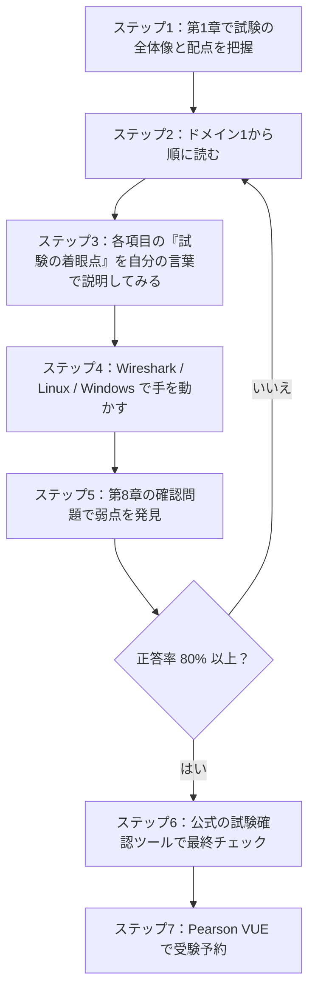

### 0.4 各項目の記述スタイル

各項目は次の 4 点セットで統一しています。

| ラベル | 意味 |
|---|---|
| 🟢 **かんたん説明** | 一言でいうと何か（初学者向けの比喩・要約） |
| 🔵 **仕組み・詳細** | 技術的な中身、用語、具体例 |
| 🟠 **ベストプラクティス** | 現場で推奨される運用・設定・考え方 |
| 🔴 **試験の着眼点** | 出題されやすい比較・見分け方・落とし穴 |

---

## 第1章 認定と試験の全体像

### 1.1 試験・認定の基本情報

| 項目 | 内容 | 出典 |
|---|---|---|
| 認定名 | Cisco Certified CyberOps Associate（現：Cybersecurity Associate への名称変更が試験範囲 PDF に記載） | Cisco 認定ページ / 試験範囲 PDF |
| 必須試験 | **200-201 CBROPS**（Understanding Cisco Cybersecurity Operations Fundamentals） | Cisco 試験ページ |
| 試験時間・問題数 | **120 分、95〜105 問**（日本語ページ記載） | Cisco 試験ページ |
| 試験言語 | 英語（日本語ページ記載） | Cisco 試験ページ |
| 前提条件 | 正式な前提条件なし | Cisco 認定ページ |
| 有効期間 | 3 年間 | Cisco 認定ページ |
| 再認定 | 認定試験に合格 **または** 継続教育クレジット 30 ポイント | Cisco 認定ページ |
| 受験方法 | オンライン監督付き試験、または Pearson VUE 会場 | Cisco 認定ページ |
| 推奨トレーニング | Understanding Cisco Cybersecurity Operations Fundamentals（CBROPS）コース | Cisco 認定ページ |

> ⚠️ 試験料金・問題数・出題形式は変更される可能性があります。受験前に必ず Cisco 公式ページで最新情報を確認してください。

### 1.2 出題ドメインと配点

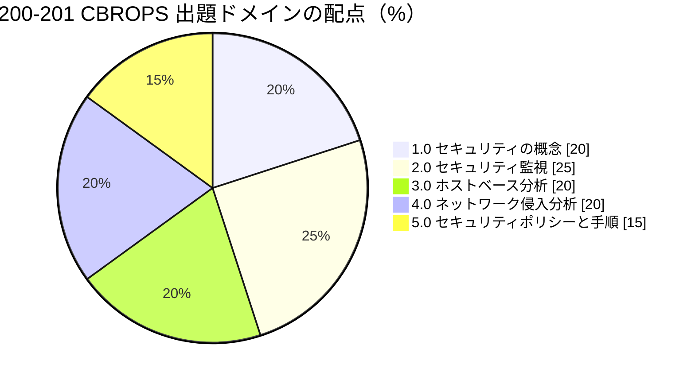

| ドメイン | 配点 | 一言でいうと | 学習のコツ |
|---|---|---|---|
| 1.0 セキュリティの概念 | 20% | 用語・モデル・考え方の土台 | 「比較」問題が多い。違いを表で覚える |
| 2.0 セキュリティ監視 | 25% | **最大配点**。何のデータが見えるか／見えなくなるか | データ種別と攻撃手法をセットで理解 |
| 3.0 ホストベース分析 | 20% | PC・サーバー側の調査 | Windows / Linux の基本操作とログ |
| 4.0 ネットワーク侵入分析 | 20% | パケット・ログを読んで侵入を特定 | Wireshark とプロトコルヘッダーを手で触る |
| 5.0 セキュリティポリシーと手順 | 15% | インシデント対応・管理プロセス | NIST SP 800-61 / 800-86 の流れを暗記 |

### 1.3 Cisco 公式が示す 8 ステップの学習・取得フロー

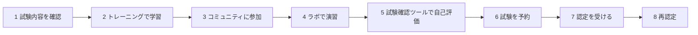

| ステップ | 公式が挙げているリソース |
|---|---|
| 1 試験内容の確認 | 試験内容（Exam Topics）、CyberOps Associate At-a-glance、Essentials ウェビナーシリーズ |
| 2 学習 | e ラーニング、クラスルーム、シスコ デジタルラーニング、プライベートグループ、ガイド付き学習グループ |
| 3 コミュニティ | Cisco Learning Network の CyberOps コミュニティ、ラーニングマップ、トレーニングビデオ |
| 4 演習 | Cisco Learning Labs、Cisco Modeling Labs、Packet Tracer |
| 5 自己評価 | 試験確認ツール（Exam Review）：CyberOps Associate |
| 6 予約 | オンライン試験、Pearson VUE 会場、試験問題チュートリアル |
| 7 認定 | 認定トラッカー、デジタルバッジ |
| 8 再認定 | 再認定ポリシー、継続教育 |

### 1.4 「SOC」とは何か（全章の前提知識）

🟢 **かんたん説明**：SOC（Security Operations Center）は、組織のセキュリティを**24 時間 365 日見張り、異変を見つけ、対応する専門チーム（または部屋・機能）**です。

🔵 **典型的な役割分担**

| 役割 | 主な仕事 | この資格との関係 |
|---|---|---|
| Tier 1 アナリスト | アラートのトリアージ（優先順位付け・誤検知の除外）、エスカレーション | **本資格の主な対象** |
| Tier 2 アナリスト | 詳細調査、封じ込めの実行 | 本資格の上位（CCNP / CyberOps Professional）で扱う |
| Tier 3 / ハンター | 脅威ハンティング、マルウェア解析、検知ルール開発 | 用語としては本資格でも登場 |
| SOC マネージャー | 体制・メトリクス・報告 | 5.11 の SOC メトリクス |

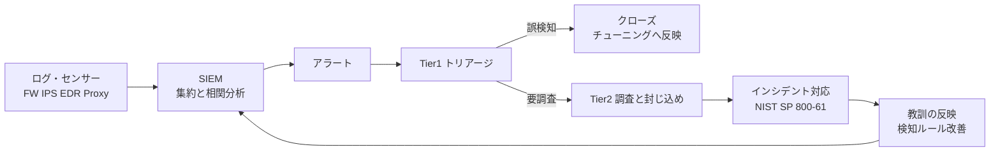

---

## 第2章 ドメイン1：セキュリティの概念（20%）

> 試験項目：1.1 〜 1.11（CIA、導入方式、用語、リスク、多層防御、アクセス制御、CVSS、可視性、データ損失、5 タプル、検知方式）

### 2.1 〔1.1〕CIA トライアド

🟢 **かんたん説明**：情報セキュリティで守る 3 つの目的 ― **機密性（Confidentiality）・完全性（Integrity）・可用性（Availability）**。

🔵 **仕組み・詳細**

| 要素 | 意味 | 破られる例 | 代表的な対策 |
|---|---|---|---|
| **Confidentiality 機密性** | 許可された人だけが情報を見られる | 情報漏えい、盗聴、設定ミスによる公開 | 暗号化（保存時・通信中）、アクセス制御、MFA、データ分類 |
| **Integrity 完全性** | 情報が改ざんされていない・正確である | データ改ざん、ログの書き換え | ハッシュ値、デジタル署名、ファイル完全性監視（FIM）、変更管理 |
| **Availability 可用性** | 必要なときに使える | DDoS、ランサムウェア、機器障害 | 冗長化、バックアップ、DDoS 対策、容量計画、DR 計画 |

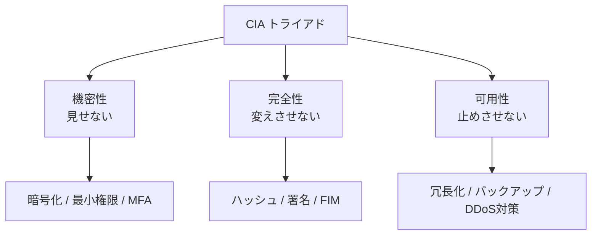

🟠 **ベストプラクティス**
- 情報資産ごとに **C・I・A のどれが最重要か**を分類する（例：公開 Web サイトは A と I、人事情報は C）
- 3 つは**トレードオフ**になることがある（強固な暗号化・認証は利便性や可用性に影響）。リスクに応じてバランスを取る
- 対策は「予防」だけでなく「検知」「復旧」も組み合わせる

🔴 **試験の着眼点**
- シナリオから「どの要素が侵害されたか」を判定させる問題が定番（例：ランサムウェア → 主に A、加えて C（二重恐喝の場合））
- ハッシュ・署名は **完全性**、暗号化は **機密性**

---

### 2.2 〔1.2〕セキュリティ導入方式の比較

🟢 **かんたん説明**：防御装置を「どこに」「どんな形で」置くかの違い。ネットワーク側・エンドポイント側・アプリ側、エージェントあり／なし、従来型／最新型、クラウドや仮想環境など。

#### 2.2.1 〔1.2.a〕ネットワーク・エンドポイント・アプリケーションのセキュリティシステム

| 区分 | 代表例 | 見える範囲 | 強み | 弱み |
|---|---|---|---|---|
| **ネットワーク** | 次世代ファイアウォール（NGFW）、IDS/IPS、セキュア Web / メールゲートウェイ | ネットワークを通るトラフィック | 全端末を一括で守れる／端末にソフト不要 | 暗号化通信の中身、ネットワーク外（在宅・社外）の端末は見えにくい |
| **エンドポイント** | EDR、アンチウイルス、ホストベース IPS/ファイアウォール | 端末内のプロセス・ファイル・レジストリ・ローカル通信 | 端末内の詳細な挙動が見える／ネットワーク外でも有効 | 端末ごとに導入・管理が必要、エージェント負荷 |
| **アプリケーション** | WAF、RASP、SAST/DAST/SCA | アプリへのリクエスト／コードの脆弱性 | SQLi・XSS など Web 固有の攻撃に強い | 他レイヤーの攻撃は守れない |

#### 2.2.2 〔1.2.b〕エージェントレスとエージェントベースの保護

| 比較軸 | エージェントレス | エージェントベース |
|---|---|---|
| 仕組み | 対象にソフトを入れず、API・ネットワーク・ハイパーバイザー経由で監視 | 対象にソフト（エージェント）をインストールして監視 |
| 導入のしやすさ | 容易（短時間で広範囲） | 展開・更新・互換性管理が必要 |
| 可視性の深さ | 浅い（メタデータ中心） | 深い（プロセス・メモリ・ファイル操作まで） |
| 向いている対象 | クラウドリソースの棚卸し、IoT/OT 機器、短命なコンテナのスキャン | PC、サーバー、重要資産のリアルタイム保護 |
| 弱点 | リアルタイム防御・応答が限定的 | 負荷、古い OS や特殊機器に入れられない |

🟠 **ベストプラクティス**：両者は**対立ではなく補完**。広く浅く（エージェントレス）で資産を把握し、重要資産には深く（エージェント）を併用する。

#### 2.2.3 〔1.2.c〕従来型のアンチウイルス／マルウェア対策

| 世代 | 検知方式 | 特徴 | 限界 |
|---|---|---|---|
| 従来型 AV | **シグネチャ（既知パターン）** 照合 | 既知マルウェアに高速・低誤検知 | 未知・亜種・ファイルレス攻撃に弱い |
| 発展型 | ヒューリスティック、振る舞い検知、サンドボックス、機械学習 | 未知の脅威にも対応しうる | 誤検知の調整が必要 |
| EDR / XDR | 端末テレメトリの継続記録＋調査・隔離機能 | 事後調査と封じ込めが可能 | 運用体制（アナリスト）が必要 |

🔴 **試験の着眼点**：「従来型 AV＝シグネチャ依存」「新種には不十分」という対比。

#### 2.2.4 〔1.2.d〕SIEM・SOAR・ログ管理

| 製品区分 | 役割 | たとえ |
|---|---|---|
| **ログ管理** | ログの収集・保管・検索 | 図書館（資料を集めて保管） |
| **SIEM** | ログの**相関分析**・アラート生成・ダッシュボード | 司書＋探偵（資料を突き合わせて怪しい点を指摘） |
| **SOAR** | 対応の**自動化・オーケストレーション**（ケース管理、プレイブック実行） | 実行部隊（見つけた後の定型対応を自動で動かす） |

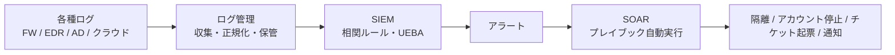

🟠 **ベストプラクティス**
- ログ収集前に「**何を検知したいか（ユースケース）**」を定義してから収集対象を決める（無目的な全量収集はコストとノイズが増える）
- **時刻同期（NTP）**を全機器で統一する（相関分析の前提）
- ログは改ざん防止のため**別サーバーへ転送**し、保管期間を規程で定める
- 自動化は**低リスクな対応（情報収集・通知）から**始め、隔離など影響の大きい操作は承認フローを挟む

#### 2.2.5 〔1.2.e〕コンテナ・仮想環境

| 項目 | 仮想マシン（VM） | コンテナ |
|---|---|---|
| 分離の単位 | OS ごと（ハイパーバイザー上） | プロセス単位（ホスト OS の**カーネルを共有**） |
| 起動速度・軽さ | 重い・遅い | 軽い・速い |
| 分離の強さ | 強い | 相対的に弱い（カーネル脆弱性の影響が大きい） |
| 主なリスク | VM エスケープ、イメージの管理不備 | 脆弱なイメージ、過剰な権限（特権コンテナ）、シークレット混入 |

🟠 **ベストプラクティス**：信頼できるベースイメージのみ使用／イメージの脆弱性スキャンを CI に組み込む／非 root で実行／最小権限／シークレットをイメージに埋め込まない／実行時ログ（Kubernetes 監査ログ等）を SIEM へ。

🔴 **試験の着眼点**：コンテナは**短命**でログが消えやすい → 外部への集約が必須。

#### 2.2.6 〔1.2.f〕クラウドセキュリティの導入

🔵 **責任共有モデル**：クラウド事業者とお客様で守る範囲が異なります。

| サービスモデル | 事業者が主に責任 | **お客様が主に責任** |
|---|---|---|
| IaaS | 物理・ネットワーク基盤・ハイパーバイザー | OS、ミドルウェア、アプリ、データ、アクセス管理 |
| PaaS | 上記＋OS・ランタイム | アプリ、データ、アクセス管理 |
| SaaS | 上記＋アプリ | **データ、アクセス管理（ID・権限）、設定** |

> どのモデルでも「**データとアクセス管理はお客様の責任**」が共通点です。

🟠 **ベストプラクティス**：MFA と最小権限の徹底／クラウドの操作ログ（監査ログ）を有効化して SIEM へ／設定不備を継続的に検査（CSPM）／SaaS 利用の可視化（CASB）／ストレージの公開設定を定期点検。

---

### 2.3 〔1.3〕セキュリティ用語の説明

| 用語 | 🟢 かんたん説明 | 🔵 詳細 | 🟠 ベストプラクティス |
|---|---|---|---|
| **脅威インテリジェンス（TI）** | 攻撃者・手口に関する「情報」 | IOC（IP・ドメイン・ハッシュ）、攻撃者の手口（TTP）、キャンペーン情報など。共有形式に STIX/TAXII がある。Cisco Talos などの情報源 | 信頼性・鮮度を評価して使う。自組織の環境に関係するものに絞る |
| **脅威ハンティング** | 検知を待たず**先に探しに行く**活動 | 仮説（例：「この手口で侵入されているかも」）を立て、ログ・EDR データを横断検索する | 仮説ベースで実施し、結果を検知ルールにフィードバック |
| **マルウェア分析** | 怪しいファイルが何をするか調べる | **静的解析**（実行せず調査）と**動的解析**（サンドボックスで実行して観察） | 必ず隔離環境で。機密ファイルを公開サンドボックスにアップロードしない |
| **攻撃者（Threat Actor）** | 攻撃を行う主体 | 国家支援、犯罪組織、ハクティビスト、内部犯、スクリプトキディなど。動機（金銭・諜報・思想）が異なる | 自社が狙われやすい攻撃者像を想定して対策を優先付け |
| **ランブック自動化（RBA）** | 定型対応手順を**自動で実行** | ランブック＝手順書、プレイブック＝シナリオ別の対応計画。RBA/SOAR がこれを機械的に実行 | 手順を文書化 → 自動化の順。例外ケースは人が判断 |
| **リバースエンジニアリング** | 完成品を分解して仕組みを知る | マルウェアのコードを逆アセンブル／デコンパイルして機能・通信先を特定 | 高度な技能が必要。外部専門家や TI を活用 |
| **スライディングウィンドウ異常検知** | 直近の一定期間（窓）を動かしながら**平常との差**を見る | 例：「直近 5 分間のログイン失敗数が、過去の平均を大きく超えたらアラート」 | ウィンドウ幅としきい値を業務パターン（時間帯・曜日）に合わせて調整 |
| **脅威モデリング** | 設計段階で「どう攻撃されうるか」を洗い出す | STRIDE（なりすまし・改ざん・否認・情報漏えい・DoS・権限昇格）、攻撃ツリー、MITRE ATT&CK の活用 | 設計・変更のたびに実施し、対策の優先度を決める |
| **DevSecOps** | 開発・運用の流れに**最初からセキュリティを組み込む** | 「シフトレフト」。SAST（静的）、DAST（動的）、SCA（依存関係）、IaC スキャンを CI/CD に統合 | 自動テストで早期に脆弱性を発見し、修正コストを下げる |

🔴 **試験の着眼点**：用語の**定義を 1 行で言えるか**。特に「ハンティング＝能動的」「RBA＝手順の自動化」「スライディングウィンドウ＝直近期間との比較」。

---

### 2.4 〔1.4〕リスク・脅威・脆弱性・エクスプロイト

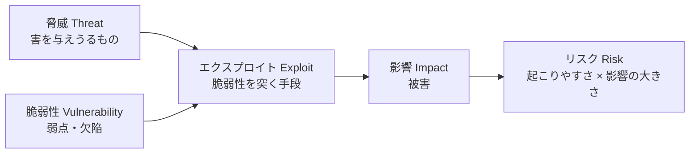

| 用語 | 🟢 たとえ（家の防犯） | 例 |
|---|---|---|
| **脅威（Threat）** | 空き巣そのもの／空き巣が来る可能性 | マルウェア、攻撃者、内部不正、自然災害 |
| **脆弱性（Vulnerability）** | 鍵のかけ忘れ・壊れた窓 | 未パッチの OS、弱いパスワード、設定ミス |
| **エクスプロイト（Exploit）** | 窓を破る道具・手順 | 脆弱性を突くコードや手法 |
| **リスク（Risk）** | 実際に被害が出る見込みと大きさ | 「公開されたサーバーが未パッチ」→ 侵害の可能性 × 業務停止の影響 |

#### 2.4.1 〔1.4.a〕リスクの 3 つの側面

| 側面 | 意味 | 具体例 |
|---|---|---|
| **リスク評価（Risk Assessment）** | リスクを特定・分析・評価する | 定性（高・中・低）または定量（金額）で評価 |
| **リスクスコアリング／重み付け** | リスクを数値化し優先順位を付ける | 資産の重要度 × 脅威の可能性 × 脆弱性の深刻度 |
| **リスク低減（Risk Reduction）** | リスクを下げる対策 | パッチ適用、アクセス制限、監視強化 |

🔵 **リスク対応の 4 つの選択肢**

| 選択肢 | 意味 | 例 |
|---|---|---|
| 低減（Mitigate） | 対策でリスクを下げる | パッチ適用、多層防御 |
| 移転（Transfer） | 他者へ負担を移す | サイバー保険、アウトソース |
| 回避（Avoid） | リスクの原因をやめる | 危険なサービスの提供停止 |
| 受容（Accept） | 許容して何もしない | コストが損失を上回る低リスク |

🔵 **定量評価の基本式**（参考）：`ALE（年間予想損失額）= SLE（1 回あたりの損失額）× ARO（年間発生率）`

🟠 **ベストプラクティス**：資産の重要度（ビジネス影響）を基準にリスクを評価し、**CVSS の深刻度だけで優先順位を決めない**（6.1.5 の脆弱性管理で詳述）。

🔴 **試験の着眼点**：シナリオ文中の語句が「脅威・脆弱性・エクスプロイト・リスク」のどれに当たるかを区別する。

---

### 2.5 〔1.5〕多層防御（Defense in Depth）の原則

🟢 **かんたん説明**：**1 つの防御が破られても次の防御で止める**ように、守りを何重にも重ねる考え方。城の「堀・城壁・門・天守」のイメージ。

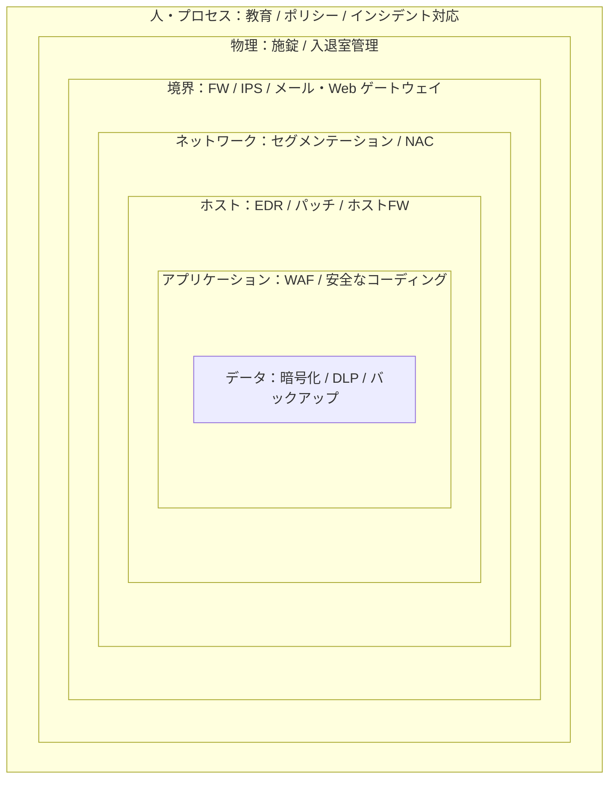

| 原則 | 説明 |
|---|---|
| 最小権限（Least Privilege） | 業務に必要な最低限の権限だけ付与 |
| 職務分掌（Separation of Duties） | 重要な操作を 1 人に集中させない（承認者と実行者を分ける） |
| 単一障害点の排除 | どれか 1 つが壊れても全体が崩れない |
| 検知と対応の組み込み | 防ぐだけでなく、破られたことに**気づける**仕組み |
| ゼロトラストとの関係 | 「内部だから安全」と考えず、すべてのアクセスを検証する考え方（多層防御を補強） |

🟠 **ベストプラクティス**：**異なる種類**の対策を重ねる（同じ方式を 2 つ並べても同じ弱点で破られる）／ネットワークを分割して横展開（ラテラルムーブメント）を防ぐ／各層のログを集約して**層をまたいで**相関分析する。

🔴 **試験の着眼点**：「境界防御だけに頼る」は誤り。多層防御の層の例を挙げられるか。

---

### 2.6 〔1.6〕アクセス制御モデルの比較

🟢 **かんたん説明**：「誰が」「何に」「どこまで」アクセスできるかを決める**ルールの作り方**の違い。

| モデル | 誰が権限を決める？ | 判断の基準 | 例 | 強み／弱み |
|---|---|---|---|---|
| **DAC 任意（1.6.a）** | **リソースの所有者** | 所有者が個別に許可 | Windows のフォルダ共有、Linux のファイルパーミッション | 柔軟／管理が分散し設定ミスや過剰共有が起きやすい |
| **MAC 強制（1.6.b）** | **システム（管理者の中央ポリシー）** | 機密ラベル × 利用者のクリアランス | SELinux、軍事・政府系システム | 強固／運用が厳格で柔軟性が低い |
| **非任意（1.6.c）** | **中央の管理者・ポリシー**（所有者ではない） | 中央管理の規則全般（MAC・RBAC などを含む総称として扱われる） | 管理者が一括で決める方式 | 統制しやすい／管理者の負担が大きい |
| **ルールベース（1.6.e）** | 管理者が定めた規則 | 「条件に合えば許可／拒否」 | ファイアウォールの ACL | 明確／ルールが増えると複雑化 |
| **時間ベース（1.6.f）** | 管理者 | **時間帯・曜日・期間** | 「平日 9〜18 時のみ VPN 許可」 | 業務に合わせやすい |
| **ロールベース RBAC（1.6.g）** | 管理者が**役割**に権限を紐づけ | 利用者の**役割（ロール）** | 「経理」ロールは会計システムのみ | 管理が楽・最小権限を実現しやすい／ロール爆発に注意 |
| **属性ベース ABAC（1.6.h）** | ポリシーエンジン | 利用者・資源・環境の**属性**の組み合わせ | 「部署=開発 かつ 端末=管理対象 かつ 社内ネットワーク → 許可」 | 細粒度で動的／設計・運用が複雑 |

#### 2.6.1 〔1.6.d〕AAA（認証・認可・アカウンティング）

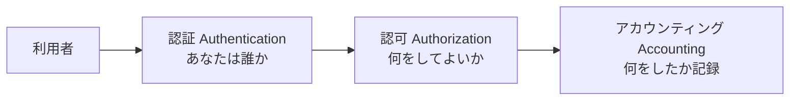

| 要素 | 意味 | 技術例 |
|---|---|---|
| 認証 | 本人確認（知識・所有・生体の要素） | パスワード、ワンタイムパスワード、IC カード、生体認証、FIDO2 |
| 認可 | 認証後に許す操作範囲 | ACL、ロール、ポリシー |
| アカウンティング | 利用履歴の記録（監査・課金） | ログ、RADIUS / TACACS+ のアカウンティング |

🔵 **RADIUS と TACACS+**：どちらも AAA プロトコル。RADIUS は主にネットワークアクセス（Wi-Fi・VPN）向け、TACACS+ は主に**機器管理（コマンド単位の認可）**向け。Cisco では ISE（Identity Services Engine）が AAA サーバーとして使われます。

🟠 **ベストプラクティス**：RBAC を基本に、例外的に細かい制御が要る部分で ABAC を併用／権限の定期棚卸し（退職・異動）／特権アカウントは MFA ＋ 操作ログ必須／認証情報は共有しない。

🔴 **試験の着眼点**
- 「所有者が決める＝DAC」「ラベルとクリアランス＝MAC」「役割＝RBAC」「属性＝ABAC」の**キーワード対応**
- 「時間帯で制限」→ 時間ベース、「ACL の条件」→ ルールベース

---

### 2.7 〔1.7〕CVSS で定義されている用語

🟢 **かんたん説明**：CVSS（Common Vulnerability Scoring System）は、脆弱性の**深刻度を 0.0〜10.0 で共通の物差しで表す**仕組みです（FIRST が管理）。

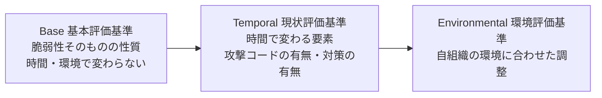

#### 2.7.1 基本評価基準（Base）の 8 指標（v3.1）

| 指標 | 試験項目 | 問い | 値（例） |
|---|---|---|---|
| **攻撃ベクトル AV** | 1.7.a | どこから攻撃できるか | Network（遠隔）/ Adjacent（同一セグメント）/ Local / Physical |
| **攻撃条件の複雑さ AC** | 1.7.b | 攻撃成功に特別な条件が要るか | Low（容易）/ High（特殊条件が必要） |
| **必要な権限 PR** | 1.7.c | 攻撃前にどんな権限が必要か | None / Low / High |
| **ユーザーの関与 UI** | 1.7.d | 被害者の操作（クリック等）が必要か | None / Required |
| **スコープ S** | 1.7.e | 影響が脆弱なコンポーネントの**外**へ及ぶか | Unchanged / Changed |
| 機密性への影響 C | ― | 情報漏えいの程度 | None / Low / High |
| 完全性への影響 I | ― | 改ざんの程度 | None / Low / High |
| 可用性への影響 A | ― | 停止の程度 | None / Low / High |

🔵 **現状評価基準（Temporal・1.7.f）**：Exploit Code Maturity（攻撃コードの成熟度）、Remediation Level（対策の入手状況）、Report Confidence（報告の信頼度）。**時間とともに変わる**。

🔵 **環境評価基準（Environmental・1.7.g）**：自組織での重要度（Confidentiality / Integrity / Availability Requirement）と、環境に応じた基本指標の修正（Modified Base Metrics）。

#### 2.7.2 深刻度の区分と読み方

| スコア | 深刻度 |
|---|---|
| 0.0 | None（なし） |
| 0.1〜3.9 | Low（低） |
| 4.0〜6.9 | Medium（中） |
| 7.0〜8.9 | High（高） |
| 9.0〜10.0 | Critical（緊急） |

ベクトル文字列の例（読み方の練習）：

```text
CVSS:3.1/AV:N/AC:L/PR:N/UI:N/S:U/C:H/I:H/A:H   →  基本スコア 9.8（Critical）
```

読み解き：「ネットワーク経由（AV:N）／条件容易（AC:L）／権限不要（PR:N）／ユーザー操作不要（UI:N）／スコープ変化なし（S:U）／C・I・A すべて High」＝**誰でも遠隔から簡単に完全掌握できる**最悪級の脆弱性。

#### 2.7.3 CVSS v4.0 との違い（参考）

| 項目 | v3.1（試験範囲の用語） | v4.0 |
|---|---|---|
| 指標グループ | Base / Temporal / Environmental | Base / **Threat** / Environmental / Supplemental |
| 攻撃条件 | AC のみ | AC に加え **AT（Attack Requirements）** を追加 |
| ユーザーの関与 | None / Required | None / **Passive / Active** |
| スコープ | あり（Unchanged/Changed） | 廃止し、**脆弱なシステムと後続システム**への影響を個別に評価 |

🟠 **ベストプラクティス**
- **CVSS の基本スコアは「深刻度」であって「リスク」ではない**。資産の重要度、攻撃が実際に観測されているか（CISA KEV 等）、悪用される確率（EPSS）、緩和策の有無を加味して優先順位を決める
- 外部公開資産で AV:N かつ PR:N の脆弱性は優先度を上げる

🔴 **試験の着眼点**：各指標の**名前と意味の対応**、Base は不変・Temporal は時間で変動・Environmental は自社環境で調整。

---

### 2.8 〔1.8〕検知における「データの可視性」の課題（ネットワーク・ホスト・クラウド）

🟢 **かんたん説明**：**見えないものは検知できない**。どこに「死角」ができるかを知ることが重要です。

| 領域 | 主な可視性の課題 | 対策 |
|---|---|---|
| **ネットワーク** | 暗号化通信（TLS）で中身が見えない／NAT で内部ホストが特定しにくい／非対称ルーティングで片方向しか見えない／センサー未設置区間 | TLS 復号（法令・プライバシー方針に沿って）、NAT ログの相関、TAP/SPAN の配置見直し、NetFlow の併用 |
| **ホスト** | エージェント未導入端末／持ち込み端末（BYOD）／ログが短期間で上書き／シャドー IT | 資産管理との突合、エージェント展開の網羅、ログ保管の強化 |
| **クラウド** | 短命なリソース（コンテナ等）／事業者側の管理領域は見えない／マルチクラウドでログ形式がバラバラ／ログが既定で無効の場合あり | 監査ログの有効化、API 経由の継続収集、ログ形式の正規化 |

🟠 **ベストプラクティス**：「**検知カバレッジ**を可視化」し、どの資産・どの攻撃手法に死角があるかをリスト化／メタデータ（NetFlow・DNS ログ・TLS 指紋）で暗号化の死角を補う。

🔴 **試験の着眼点**：「暗号化は機密性を高める一方で、**セキュリティ監視にとっては死角を生む**」という両面性。

---

### 2.9 〔1.9〕トラフィックプロファイルから生じうるデータ損失の特定

🟢 **かんたん説明**：通常の通信パターン（プロファイル）と比べて、**持ち出し（データ流出）が疑われる異常な通信**を見つける力。

| 兆候 | 具体例 | なぜ怪しいか |
|---|---|---|
| 送信量の急増 | 内部サーバーから外部へ通常の数十倍のアップロード | 大量データの持ち出し |
| 時間帯の異常 | 深夜・休日に大量転送 | 業務外の活動 |
| 未知の宛先 | 初めて通信する海外のクラウドストレージや IP | 攻撃者管理の宛先の可能性 |
| 非標準の使われ方 | DNS 問い合わせが極端に長い／大量（DNS トンネリング）、ICMP ペイロードが大きい | 正規プロトコルに偽装した持ち出し |
| 一定間隔の通信 | 数十秒おきの小さな通信（ビーコン） | C2 通信の可能性（流出準備） |

🟠 **ベストプラクティス**：NetFlow 等でベースライン（通常の量・宛先・時間帯）を作る／重要データのある区画からの外向き通信を重点監視／DLP と併用／ファイル共有サービスの利用ルールを明文化。

🔴 **試験の着眼点**：NetFlow の「バイト数・宛先・時間」から流出を推定する問題。

---

### 2.10 〔1.10〕5 タプル（5-tuple）による侵害ホストの特定

🟢 **かんたん説明**：通信 1 本を一意に特定する **5 つの値**。大量のログから「どのホストが怪しいか」を絞り込むための基本の物差しです。

| 5 タプルの要素 | 例 |
|---|---|
| 送信元 IP アドレス | 10.1.1.25 |
| 宛先 IP アドレス | 203.0.113.50 |
| 送信元ポート | 49821 |
| 宛先ポート | 443 |
| プロトコル | TCP |

#### 2.10.1 ログから侵害ホストを絞り込む例（練習）

次のファイアウォールログ（架空）から、侵害の疑いがあるホストを特定します。

| 時刻 | 送信元 IP | 送信元ポート | 宛先 IP | 宛先ポート | プロトコル | 処理 | バイト数 |
|---|---|---|---|---|---|---|---|
| 02:01:05 | 10.1.1.25 | 49821 | 203.0.113.50 | 443 | TCP | 許可 | 120 |
| 02:02:05 | 10.1.1.25 | 49833 | 203.0.113.50 | 443 | TCP | 許可 | 118 |
| 02:03:05 | 10.1.1.25 | 49840 | 203.0.113.50 | 443 | TCP | 許可 | 121 |
| 09:15:11 | 10.1.1.40 | 51002 | 198.51.100.7 | 443 | TCP | 許可 | 52,300 |
| 09:16:40 | 10.1.1.52 | 50500 | 10.1.5.10 | 445 | TCP | 拒否 | 0 |
| 09:16:41 | 10.1.1.52 | 50501 | 10.1.5.11 | 445 | TCP | 拒否 | 0 |
| 09:16:42 | 10.1.1.52 | 50502 | 10.1.5.12 | 445 | TCP | 拒否 | 0 |

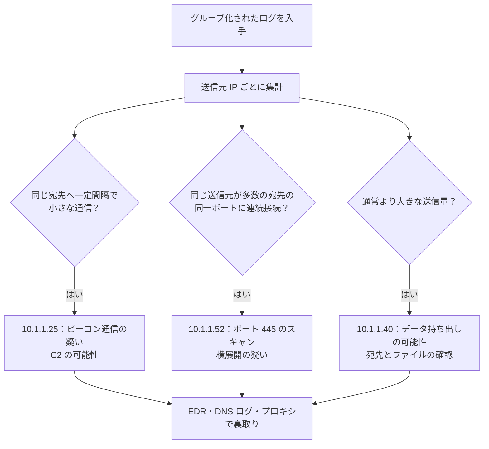

🔵 **読み取り結果**

| ホスト | 5 タプルの特徴 | 推定 |
|---|---|---|
| 10.1.1.25 | 宛先・宛先ポート・プロトコル固定、**一定間隔**、小サイズ、深夜 | ビーコン（C2 通信） |
| 10.1.1.40 | 外部へ大きなバイト数 | データ流出の可能性（正規バックアップの可能性も除外確認） |
| 10.1.1.52 | 連続した宛先、**宛先ポート 445（SMB）固定**、拒否多数 | 内部スキャン／横展開 |

🟠 **ベストプラクティス**：5 タプルで怪しい通信を絞った後は、**必ず別の情報源（EDR、DNS、プロキシ、認証ログ）で裏付け**する。NAT がある場合は変換前後のアドレスを突き合わせる。

🔴 **試験の着眼点**：パターン（ビーコン／スキャン／流出）と 5 タプルの特徴の対応。送信元ポートは通常ランダム（エフェメラル）で、**宛先ポートが通信の目的を示す**。

---

### 2.11 〔1.11〕ルールベース検知 vs 振る舞い／統計的検知

| 比較軸 | ルールベース（シグネチャ）検知 | 振る舞い／統計的（アノマリ）検知 |
|---|---|---|
| 仕組み | 既知の攻撃パターンに一致するか | 「通常」から外れているか（ベースラインとの差） |
| 得意 | **既知**の攻撃、確実性の高い検知 | **未知**の攻撃、内部不正、新しい手口 |
| 苦手 | 未知・亜種・巧妙に変形した攻撃 | 誤検知（業務の変化で「異常」になる）、ベースライン作成に期間が必要 |
| 誤検知 | 少ない（ルール次第） | 多くなりやすい |
| 運用負担 | ルール更新（シグネチャ更新）が必要 | ベースライン学習・しきい値調整が必要 |
| 例 | Snort/Suricata のシグネチャ、AV のパターンファイル | UEBA、NetFlow の異常検知、スライディングウィンドウ検知 |

🟠 **ベストプラクティス**：**両方を併用**する。既知はルールで確実に、未知は振る舞いで補う。ルールは定期的にチューニングし、誤検知の原因を記録して改善する。

🔴 **試験の着眼点**：「ゼロデイ（未知）攻撃に強いのはどちらか」→ 振る舞い／統計的検知。「誤検知が少ないのは？」→ ルールベース。

---

### ✅ ドメイン1 チェックリスト

- [ ] CIA 各要素の対策（暗号化／ハッシュ／冗長化）を言える
- [ ] DAC / MAC / RBAC / ABAC / ルール / 時間ベースを例つきで区別できる
- [ ] CVSS の Base / Temporal / Environmental と 5 つの基本指標を説明できる
- [ ] 5 タプルの 5 要素を言え、ログからビーコン／スキャン／流出を判断できる
- [ ] ルールベースと振る舞い検知の長所・短所を対比できる


---

## 第3章 ドメイン2：セキュリティ監視（25%）

> 試験項目：2.1 〜 2.11（攻撃対象領域、技術別データ、可視性への影響、データ種別、ネットワーク攻撃、Web 攻撃、ソーシャルエンジニアリング、エンドポイント攻撃、回避・難読化、証明書）
> **最大配点のドメイン**です。「何のデータが取れるか」「何が見えなくなるか」を軸に学びます。

### 3.1 〔2.1〕攻撃対象領域（Attack Surface）と脆弱性の比較

🟢 **かんたん説明**：**攻撃対象領域**は「攻撃者が狙える入口の総数」、**脆弱性**は「その入口にある個々の弱点」です。

| 比較軸 | 攻撃対象領域（Attack Surface） | 脆弱性（Vulnerability） |
|---|---|---|
| 意味 | 攻撃者が接触・侵入しうる**全ての露出点の集合** | 個々のソフトウェア／設定／プロセスの**欠陥** |
| 例 | 公開 Web サーバー、開放ポート、VPN、メールアドレス、API、従業員、サプライチェーン | 未パッチの CVE、弱いパスワード、不要なサービス |
| 減らし方 | 不要なサービス・ポート・アカウントの**削除**、公開範囲の縮小 | パッチ適用、設定修正、コード修正 |
| 管理の考え方 | 資産を把握して**露出を小さく** | 発見 → 優先順位付け → 修正 → 検証 |

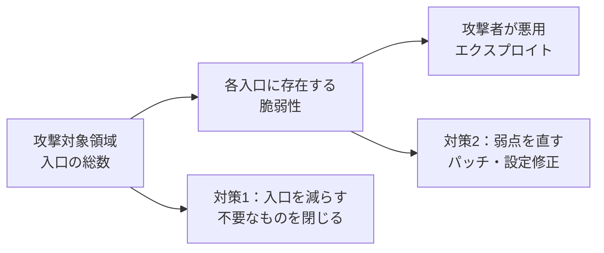

🟠 **ベストプラクティス**：外部公開資産の**継続的な棚卸し**（攻撃者視点で見える資産の確認）／不要ポート・サービス・アカウントを閉じる／ネットワーク分割で到達範囲を限定。

🔴 **試験の着眼点**：「脆弱性を直しても攻撃対象領域は減らない（入口自体が残る）」「入口を閉じれば脆弱性の有無に関わらず露出が減る」という違い。

---

### 3.2 〔2.2〕技術ごとに得られるデータの種類

| 技術 | 項目 | 🔵 得られるデータ | 🟢 向いている調査 |
|---|---|---|---|
| **tcpdump** | 2.2.a | パケットそのもの（ヘッダー＋ペイロード）を取得する CLI ツール。pcap ファイルに保存できる | 通信内容の詳細解析、ファイル抽出 |
| **NetFlow** | 2.2.b | **フロー情報**（5 タプル、バイト数、パケット数、開始・終了時刻、TCP フラグ、入出力インターフェースなど）。ペイロードは含まない | 通信量の把握、異常検知、流出の疑い、誰と通信したかの履歴 |
| **次世代ファイアウォール（NGFW）** | 2.2.c | 5 タプルに加え、**アプリケーション、ユーザー、URL カテゴリ、IPS イベント、ファイル／マルウェア判定**など | アプリ単位の可視化、脅威の検知 |
| **従来型ステートフル FW** | 2.2.d | **接続状態**（セッションテーブル）と 5 タプル、許可／拒否の記録 | 誰が誰に接続したか、拒否の履歴 |
| **アプリケーションの可視化と制御（AVC）** | 2.2.e | 使用されているアプリ（例：Web 会議、ファイル共有、SNS）の識別と帯域・制御の記録 | 許可していないアプリの利用発見（シャドー IT） |
| **Web コンテンツフィルタリング** | 2.2.f | アクセス先 URL、カテゴリ、レピュテーション、ブロック理由、ユーザー名（プロキシログ） | 不審サイトへのアクセス、マルウェア配布サイトの遮断記録 |
| **メールコンテンツフィルタリング** | 2.2.g | 送信者・件名・添付・URL、スパム／フィッシング／マルウェア判定、SPF・DKIM・DMARC の結果 | フィッシングの調査、添付ファイル経由の感染の追跡 |

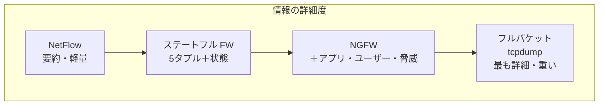

🔴 **試験の着眼点**
- 「ペイロードが取れるのは tcpdump（フルパケット）。NetFlow は**取れない**」
- 「アプリケーション名・ユーザーまで分かるのは NGFW／AVC」
- 「従来型ステートフル FW はアプリ層の詳細までは分からない」

---

### 3.3 〔2.3〕各技術がデータの可視性に与える影響

🟢 **かんたん説明**：便利な技術や防御策が、**監視にとっては「見えなくなる原因」**にもなります。

| 技術 | 項目 | 🔵 可視性への影響 | 🟠 対策・補い方 |
|---|---|---|---|
| **ACL（アクセス制御リスト）** | 2.3.a | 拒否した通信は先へ進まないため**その先のログが残らない**。ACL 自体はログを出さない場合がある（ログ指定が必要） | 重要な拒否ルールにはロギングを有効化し、ログを集約 |
| **NAT / PAT** | 2.3.b | 内部アドレスが変換され、外側のログに**内部ホストが見えない**（1 つの公開 IP に多数の端末が集約） | NAT 変換ログを取得し、変換前後を時刻つきで突き合わせる |
| **トンネリング** | 2.3.c | VPN・GRE・IPsec などで**内側の通信が外側から見えない** | トンネルの終端点で監視、トンネルの許可範囲を限定 |
| **TOR** | 2.3.d | 多段中継で**真の送信元・宛先が隠れる** | TOR 出口・入口ノードのリスト（既知アドレス）でブロック／アラート |
| **暗号化** | 2.3.e | **ペイロードが読めない**（ヘッダー・メタデータは見える） | TLS 復号（方針・法令の範囲で）、DNS・SNI・証明書情報・TLS 指紋などメタデータ分析 |
| **P2P** | 2.3.f | 動的ポート・分散接続で**制御・特定が難しい**。業務外利用や情報漏えいの温床 | アプリ識別（AVC）、ポリシーで禁止、ポート番号に依存しない検知 |
| **カプセル化** | 2.3.g | パケットが別のヘッダーで包まれ、**内側のヘッダーが見えない**（例：IPv6 over IPv4、GRE） | DPI やトンネル終端での検査 |
| **ロードバランシング** | 2.3.h | クライアント → VIP の通信が実サーバーに振り分けられ、**実サーバー側のログに本来のクライアント IP が残らない**ことがある | X-Forwarded-For ヘッダーの記録、LB のログ集約 |

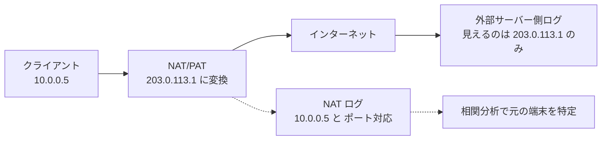

🔴 **試験の着眼点**：各技術について「**何が見えなくなるか**」を一言で答えられるか。暗号化＝ペイロード、NAT＝内部ホストの識別、LB＝実クライアント IP。

---

### 3.4 〔2.4〕セキュリティ監視で使われるデータの種類

| データ種別 | 項目 | 🔵 内容 | 長所 | 短所 | 🟢 たとえ |
|---|---|---|---|---|---|
| **フルパケットキャプチャ（PCAP）** | 2.4.a | 通信の全バイト（ヘッダー＋ペイロード） | 最も詳細。ファイル復元・攻撃の完全再現が可能 | **容量が大きい**・保管期間が短い・暗号化通信は読めない | 防犯カメラの高画質録画 |
| **セッションデータ** | 2.4.b | 2 者間の会話の要約（5 タプル、時間、バイト数） | 軽量で長期保管可能 | 内容は分からない | 通話履歴（誰と何分） |
| **トランザクションデータ** | 2.4.c | 要求と応答のやり取りの記録（HTTP のメソッド・URL・ステータス、DNS の問い合わせと応答） | アプリ層の事実が分かる | プロトコルごとに取得が必要 | 注文伝票（何を頼み何が返ったか） |
| **統計データ** | 2.4.d | 集計値・傾向（帯域使用率、接続数、上位通信先） | 異常の**傾向**把握に最適 | 個別の通信は特定できない | 月間の通信量グラフ |
| **メタデータ** | 2.4.e | 「データについてのデータ」（時刻、サイズ、送信元・宛先、ファイル名・ハッシュ、証明書情報など） | 暗号化通信でも一定の情報が取れる | 内容までは分からない | 封筒の差出人・宛先・消印 |
| **アラートデータ** | 2.4.f | IDS/IPS・FW・AV などが**ルールに基づき発した警告** | すぐに調査の起点になる | **誤検知**（False Positive）が混ざる | 防犯ブザー |

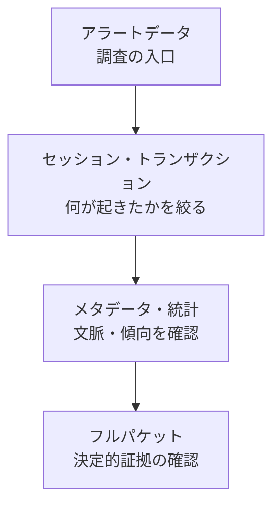

🟠 **ベストプラクティス**：「**アラート → セッション／トランザクション → フルパケット**」の順に絞り込む（フルパケットは容量が大きいので、必要な区間・期間だけ保存する、または重要セグメントに限定）／長期保管は軽量データ（NetFlow・メタデータ）、短期は詳細データ。

🔴 **試験の着眼点**：「ファイルの中身を復元したい → フルパケット」「長期の傾向 → 統計／セッション」「暗号化通信の調査 → メタデータ」。

---

### 3.5 〔2.5〕ネットワーク攻撃（プロトコルベース／DoS／DDoS／中間者）

#### 3.5.1 プロトコルベースの攻撃

| 攻撃 | 🔵 仕組み | 🟠 対策 |
|---|---|---|
| **SYN フラッド** | TCP 3 ウェイハンドシェイクの SYN を大量に送り、サーバーの半開き接続を使い切らせる | SYN クッキー、レート制限、FW/IPS の保護機能 |
| **ARP スプーフィング** | 偽の ARP 応答で、通信先の MAC を攻撃者のものに書き換える | DAI（Dynamic ARP Inspection）、DHCP スヌーピング、ポートセキュリティ、静的 ARP（重要機器） |
| **DNS スプーフィング／キャッシュポイズニング** | 偽の DNS 応答で利用者を偽サイトへ誘導 | DNSSEC、再帰 DNS の保護、ランダムポート・ID |
| **ICMP を悪用した攻撃**（スマーフ等） | ブロードキャスト宛 ICMP で応答を被害者に集中 | ブロードキャスト宛の遮断、送信元検証 |
| **IP フラグメントの悪用** | 不正な断片化で IDS/FW をすり抜け・停止させる | フラグメント再構築、正規化 |
| **TCP セッションハイジャック** | 通信中のシーケンス番号を推測し割り込む | 暗号化（TLS）、ランダムな初期シーケンス番号 |

#### 3.5.2 DoS と DDoS

| 比較 | DoS | DDoS |
|---|---|---|
| 攻撃元 | 単一 | **多数（ボットネット）** |
| 防ぎやすさ | 発信元をブロックすれば有効 | **分散しているため送信元ブロックが困難** |

| DDoS の分類 | 狙い | 例 |
|---|---|---|
| ボリューム型 | 帯域の飽和 | UDP フラッド、**増幅（リフレクション）攻撃**（DNS・NTP など） |
| プロトコル型 | 機器の処理資源の枯渇 | SYN フラッド |
| アプリケーション層型 | Web アプリの処理能力 | 大量の HTTP リクエスト |

🟠 **ベストプラクティス**：ISP／クラウド型 DDoS 対策（スクラビング）／アクセス制限・レート制限／送信元アドレス検証（uRPF、BCP38）／CDN・冗長化／DDoS 発生時の対応手順（ランブック）を事前に準備。

#### 3.5.3 中間者攻撃（MITM）

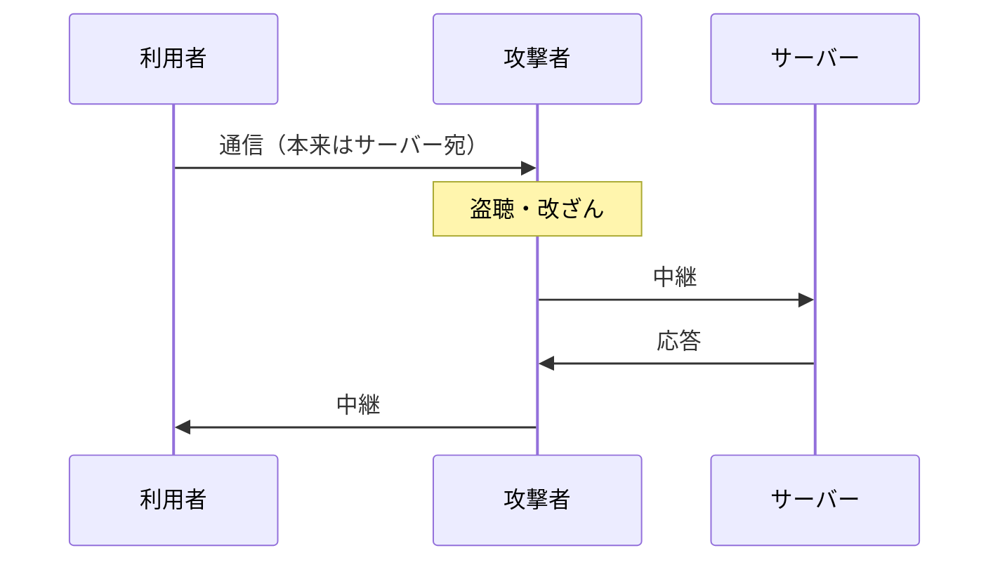

| 手口 | 説明 | 対策 |
|---|---|---|
| ARP / DNS スプーフィング | 経路を偽装して攻撃者を経由させる | DAI、DNSSEC |
| 不正アクセスポイント（Evil Twin） | 偽の Wi-Fi に接続させる | WPA3 / 802.1X、不正 AP 検知 |
| SSL ストリップ | HTTPS を HTTP に格下げさせる | **HSTS**、HTTPS の強制 |

🔴 **試験の着眼点**：攻撃名 ⇔ 仕組みのキーワード対応（SYN フラッド＝半開き接続、ARP スプーフィング＝MAC の偽装、リフレクション＝増幅）。DoS と DDoS の違いは「単一か分散か」。

---

### 3.6 〔2.6〕Web アプリケーション攻撃

| 攻撃 | 🟢 かんたん説明 | 🔵 仕組み | 🟠 対策 |
|---|---|---|---|
| **SQL インジェクション** | 入力欄から**データベースへの命令を紛れ込ませる** | 入力値が SQL 文にそのまま連結され、命令として実行される。例（教育用）：ログイン欄に `' OR '1'='1` を入力 | **プレースホルダ（パラメータ化クエリ）**、入力検証、DB 権限の最小化、WAF |
| **コマンドインジェクション** | 入力から**OS コマンドを実行させる** | 入力値が OS コマンドの一部として実行される（例：`;` や `&&` で別コマンドを連結） | OS コマンド呼び出しを避ける、安全な API を使う、入力のホワイトリスト検証 |
| **クロスサイトスクリプティング（XSS）** | 他人のブラウザで**攻撃者のスクリプトを動かす** | 反射型（URL に含める）、格納型（掲示板などに保存）、DOM 型 | **出力エスケープ**、CSP（Content Security Policy）、HttpOnly Cookie |
| **CSRF**（参考） | ログイン中の利用者に**意図しない操作**をさせる | 認証済みセッションを悪用したリクエスト偽造 | CSRF トークン、SameSite Cookie |
| **パストラバーサル**（参考） | `../` で本来アクセスできないファイルを読む | パスの検証不足 | パス正規化、ホワイトリスト |

ログに現れる痕跡の例（架空）：

```text
GET /login?user=admin'+OR+'1'='1&pass=x HTTP/1.1          ← SQL インジェクションの疑い
GET /search?q=<script>alert(1)</script> HTTP/1.1           ← XSS の試行の疑い
GET /ping?host=8.8.8.8;cat+/etc/passwd HTTP/1.1            ← コマンドインジェクションの疑い
GET /download?file=../../etc/passwd HTTP/1.1               ← パストラバーサルの疑い
```

🟠 **ベストプラクティス**：**「入力は信用しない」「出力はエスケープする」**が大原則。OWASP Top 10 を開発・レビューの共通語彙にする／WAF は補助（根本対策は安全なコーディング）／エラーメッセージに内部情報を出さない。

🔴 **試験の着眼点**：ログ文字列を見て攻撃種別を当てる問題（`'` や `OR 1=1` → SQLi、`<script>` → XSS、`;` や `|` ＋コマンド名 → コマンドインジェクション）。**SQLi の根本対策はパラメータ化クエリ**。

---

### 3.7 〔2.7〕ソーシャルエンジニアリング攻撃（手動および生成 AI）

🟢 **かんたん説明**：システムではなく**「人の心理」を攻める**攻撃。

| 手口 | 説明 |
|---|---|
| フィッシング | 偽メール・偽サイトで認証情報を盗む |
| スピアフィッシング | 特定の個人・組織を狙った精巧な標的型 |
| ホエーリング | 経営層を狙う |
| ビッシング／スミッシング | 電話／SMS を使う |
| BEC（ビジネスメール詐欺） | 取引先・経営者になりすまして送金させる |
| プリテキスティング | 偽の口実（設定した状況）で情報を聞き出す |
| ベイティング | USB メモリ置き去りなど「餌」でおびき寄せる |
| テールゲーティング | 入退室で他人の後ろについて侵入 |

🔵 **生成 AI で何が変わったか（v1.2 で追加された観点）**

| 観点 | 従来（手動） | 生成 AI の悪用 |
|---|---|---|
| 文面の質 | 不自然な日本語・誤字が手がかりだった | **自然で流暢**な文面が大量に作れる |
| 標的への最適化 | 手間がかかる | 公開情報から**個別化した文面**を自動生成 |
| 規模 | 人手の限界 | **低コストで大量**に実行 |
| 音声・映像 | なりすましは困難 | **ディープフェイク音声／映像**による本人偽装 |

🟠 **ベストプラクティス**
- **フィッシング耐性のある多要素認証（FIDO2/パスキー）**の導入（ワンタイムコードは中継型フィッシングに弱い）
- 送金・権限変更など重要な依頼は**別経路（電話の折り返し等）で確認**するルール化
- メール認証（SPF・DKIM・DMARC）、リンク書き換え・サンドボックス、「報告ボタン」で報告を簡単に
- 教育は「不自然な文面を探す」から「**依頼の状況（急かす・秘密にさせる・手順を飛ばさせる）を疑う**」へ

🔴 **試験の着眼点**：生成 AI により「**文面の不自然さに頼った見破り方は通用しにくくなった**」点。

---

### 3.8 〔2.8〕エンドポイントベースの攻撃

| 攻撃 | 🔵 仕組み | 🟠 対策 |
|---|---|---|
| **バッファオーバーフロー** | 確保した領域を超えてデータを書き込み、制御を奪う（スタック／ヒープ） | **ASLR**（配置のランダム化）、**DEP/NX**（データ領域の実行禁止）、スタックカナリア、メモリ安全な言語、パッチ |
| **C2（コマンド＆コントロール）** | 感染端末が攻撃者のサーバーと通信し、指示を受ける。**定期的なビーコン**、HTTPS／DNS を使って通常通信に紛れる | DNS・プロキシでの不審ドメイン遮断、egress（外向き）通信の制限、ビーコン検知 |
| **マルウェア** | 下表参照 | EDR、パッチ、権限制限、アプリ許可リスト |
| **ランサムウェア** | ファイルを暗号化して身代金を要求。近年は**データを盗んで公開を脅す二重恐喝** | **オフライン／イミュータブルなバックアップ（3-2-1）**、ネットワーク分割、最小権限、迅速な隔離手順 |

| マルウェア種別 | 特徴 |
|---|---|
| ウイルス | 宿主ファイルに寄生し、ユーザー操作で拡散 |
| ワーム | **自己増殖**してネットワーク経由で拡散 |
| トロイの木馬 | 無害を装って侵入し、裏で悪意ある動作 |
| ルートキット | 自身の存在を隠し、深い権限を維持 |
| スパイウェア／インフォスティーラー | 情報を盗む |
| RAT（遠隔操作型） | 攻撃者が端末を遠隔操作 |
| ファイルレス | ファイルを残さずメモリ上や正規ツール（PowerShell など）で動作 |

🔴 **試験の着眼点**：「**一定間隔の外向き通信＝C2 ビーコンの疑い**」「ワーム＝自己増殖」「ランサムウェア対策の要はバックアップ」。

---

### 3.9 〔2.9〕回避・難読化の手法（トンネリング・暗号化・プロキシ）

🟢 **かんたん説明**：攻撃者は**監視をすり抜けるため**、通信や中身を隠します。

| 手法 | 🔵 仕組み | 🟠 検知・対策 |
|---|---|---|
| **トンネリング** | 許可されたプロトコルの中に別の通信を埋め込む（**DNS トンネリング**、HTTP/HTTPS トンネル、ICMP トンネル） | DNS の問い合わせ長・頻度・エントロピー、TXT レコードの異常、ICMP のペイロード異常を監視 |
| **暗号化** | 通信・ペイロードを暗号化して中身を検査不能にする | TLS 復号、メタデータ（SNI・証明書・TLS 指紋）分析、不審な証明書の検出 |
| **プロキシ／匿名化** | プロキシ・VPN・TOR 経由で送信元を隠す | 既知の匿名化サービスのブロック、利用ポリシー |
| **難読化・パッキング**（参考） | コードを読みにくく／圧縮して AV を回避 | サンドボックスでの動的解析、振る舞い検知 |
| **Living off the Land**（参考） | OS 標準ツール（PowerShell、WMI 等）の悪用で痕跡を減らす | コマンドライン／スクリプトのログ強化 |

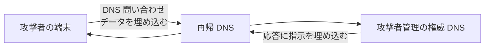

🔴 **試験の着眼点**：「**異常に長い・大量の DNS 問い合わせ**＝DNS トンネリングの疑い」。

---

### 3.10 〔2.10〕証明書がセキュリティに与える影響（PKI）

🟢 **かんたん説明**：証明書は「**この公開鍵は確かにこの相手のものです**」と信頼できる第三者（認証局：CA）が保証する**デジタルの身分証明書**です。

#### 3.10.1 暗号の 2 方式

| 比較 | 共通鍵（対称）暗号 | 公開鍵（非対称）暗号 |
|---|---|---|
| 鍵 | **同じ鍵**で暗号化・復号 | **鍵ペア**（公開鍵で暗号化 → 秘密鍵で復号、または秘密鍵で署名 → 公開鍵で検証） |
| 速度 | **高速** | 低速 |
| 課題 | 鍵の安全な共有（配送）が難しい | 公開鍵が本物かの保証が必要 |
| 代表例 | AES | RSA、ECDSA、ECDH |
| 用途 | 大量データの暗号化 | 鍵交換、デジタル署名、認証 |

> 実際の TLS では、**非対称暗号で安全に鍵を共有し、通信本体は高速な対称暗号**で行う（ハイブリッド方式）。

#### 3.10.2 PKI の信頼の連鎖

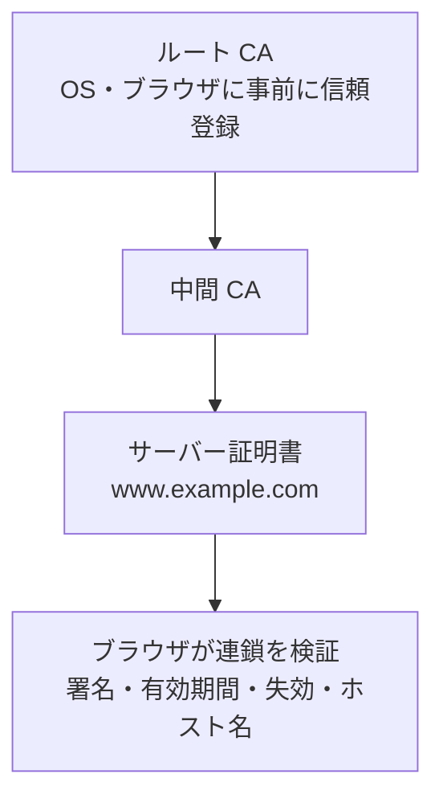

| 概念 | 説明 |
|---|---|
| 認証局（CA） | 証明書を発行する信頼された第三者 |
| CSR | 証明書署名要求。自分の公開鍵と情報を CA に提出 |
| 失効 | 秘密鍵漏えい等で無効化。**CRL** や **OCSP** で確認 |
| デジタル署名 | 秘密鍵で署名 → 公開鍵で検証。**完全性と否認防止**を提供 |

🟠 **ベストプラクティス**：証明書の**自動更新（ACME）**と期限監視／秘密鍵は安全に保管（HSM など）／**自己署名証明書を本番で使わない**／CT（証明書の透明性）ログの監視／失効確認の有効化／有効期間は短くする方向（運用の自動化が前提）。

🔴 **試験の着眼点**：「署名は秘密鍵で行い公開鍵で検証」「共通鍵は速いが配送が課題」。

#### 3.10.3 TLS ハンドシェイク（TLS 1.3 の概略）

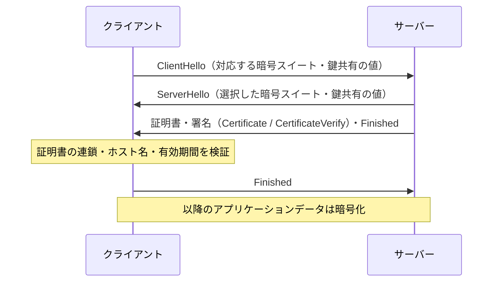

---

### 3.11 〔2.11〕シナリオ中の証明書コンポーネントの特定

#### 3.11.1 〔2.11.a〕暗号スイート（Cipher Suite）

TLS 1.2 の暗号スイート名は**部品の組み合わせ**です。

```text
TLS_ECDHE_RSA_WITH_AES_256_GCM_SHA384
```

この名前を分解すると次のとおりです。

| 名前の部分 | 意味 | 役割 |
|---|---|---|
| `ECDHE` | 鍵交換 | 通信用の鍵をどう共有するか（前方秘匿性あり） |
| `RSA` | 認証（署名） | サーバーが本物かの確認 |
| `AES_256_GCM` | 一括暗号 | データ本体の暗号化 |
| `SHA384` | ハッシュ | 完全性・鍵導出 |

| 部品 | 役割 | 例 |
|---|---|---|
| 鍵交換 | 通信用の共通鍵をどう共有するか | **ECDHE / DHE（前方秘匿性あり）**、RSA 鍵交換（前方秘匿性なし） |
| 認証 | 相手が本物か | RSA、ECDSA |
| 一括暗号 | データ本体の暗号化 | AES-GCM、ChaCha20-Poly1305 |
| ハッシュ | 完全性・鍵導出 | SHA-256、SHA-384 |

> TLS 1.3 では暗号スイートは **AEAD 暗号とハッシュの組**（例：`TLS_AES_256_GCM_SHA384`）となり、鍵交換は別の仕組みで常に前方秘匿性を持つ（弱い選択肢は廃止）。

#### 3.11.2 〔2.11.b〕X.509 証明書の主な項目

| フィールド | 意味 | 調査での見どころ |
|---|---|---|
| Version | バージョン（通常 v3） | ― |
| Serial Number | 発行者内で一意の番号 | 失効確認で使用 |
| Signature Algorithm | 署名アルゴリズム | **SHA-1 等の弱いもの**は不可 |
| **Issuer** | 発行者（CA） | 不審・未知の CA、**Subject と同じ＝自己署名** |
| **Validity** | 有効期間（開始・終了） | **期限切れ**、異常に長い／短い期間 |
| **Subject** | 持ち主（CN など） | ホスト名と一致するか |
| Subject Public Key Info | 公開鍵とアルゴリズム、鍵長 | 弱い鍵長（短い RSA 等） |
| 拡張：**SAN**（Subject Alternative Name） | 有効なホスト名の一覧 | 現在のブラウザは **SAN を優先**して検証 |
| 拡張：Key Usage / EKU | 用途（署名・暗号化・サーバー認証など） | 用途外の利用 |
| 拡張：Basic Constraints | CA かどうか | 末端証明書が CA になっていないか |

#### 3.11.3 〔2.11.c〕鍵交換

| 方式 | 前方秘匿性（PFS） | 備考 |
|---|---|---|
| RSA 鍵交換（共通鍵の元をサーバー公開鍵で暗号化して送る） | **なし**（将来秘密鍵が漏れると過去の通信を復号されうる） | 現在は非推奨 |
| DHE / ECDHE（一時的な鍵で交換） | **あり** | 推奨。TLS 1.3 は必須 |

#### 3.11.4 〔2.11.d〕プロトコルバージョン

| バージョン | 状態 |
|---|---|
| SSL 2.0 / 3.0 | **廃止・使用禁止**（重大な脆弱性） |
| TLS 1.0 / 1.1 | **非推奨**（廃止の方向。RFC 8996） |
| TLS 1.2 | 現役（安全な暗号スイートの選択が必要） |
| TLS 1.3 | **推奨**（ハンドシェイク短縮、弱い暗号の廃止） |

#### 3.11.5 〔2.11.e〕PKCS（Public-Key Cryptography Standards）

| 規格 | 内容 | 覚え方 |
|---|---|---|
| PKCS#1 | RSA 暗号・署名の規格 | RSA の基本 |
| PKCS#7 / CMS | 署名・暗号化メッセージ（証明書チェーンの配布にも） | S/MIME |
| PKCS#8 | 秘密鍵の格納形式 | **秘密鍵** |
| PKCS#10 | **証明書署名要求（CSR）** の形式 | CSR は 10 |
| PKCS#12 | 証明書＋秘密鍵をまとめたファイル（.p12 / .pfx） | **持ち運び用バンドル** |

🟠 **ベストプラクティス**：TLS 1.2 以上のみ許可／弱い暗号スイート（RC4、3DES、EXPORT、NULL など）を無効化／PFS のある暗号スイートを優先／HSTS／証明書の期限・失効・ホスト名を継続監視。

🔴 **試験の着眼点**
- 暗号スイート名を**部品に分解**して意味を答える問題
- 証明書のどの項目が「怪しい」かの判断（期限切れ、Issuer と Subject が同一、ホスト名不一致、弱い署名）
- PKCS の番号と用途（#10＝CSR、#12＝鍵＋証明書のバンドル）

---

### ✅ ドメイン2 チェックリスト

- [ ] 攻撃対象領域と脆弱性の違いを説明できる
- [ ] NetFlow・tcpdump・NGFW・プロキシ・メールフィルタが出すデータの違いを言える
- [ ] NAT・暗号化・トンネリング・LB が「何を見えなくするか」を言える
- [ ] フルパケット／セッション／トランザクション／統計／メタデータ／アラートを使い分けられる
- [ ] SYN フラッド、ARP スプーフィング、DDoS、MITM を区別でき、対策を挙げられる
- [ ] SQLi・XSS・コマンドインジェクションをログから見分けられる
- [ ] 暗号スイート名と X.509 の項目から問題点を指摘できる


---

## 第4章 ドメイン3：ホストベース分析（20%）

> 試験項目：3.1 〜 3.7（エンドポイント技術、OS コンポーネント、アトリビューション、証拠の種類、ログ解釈、マルウェア分析レポート）
> **PC・サーバーの「内側」**から何が起きたかを調べる力を問われます。

### 4.1 〔3.1〕エンドポイント技術の機能（ルール・シグネチャ・予測型 AI）

🟢 **かんたん説明**：端末に入れる防御ソフトは、**3 つの「判断の仕方」**を組み合わせて怪しい動きを見つけます。

| 判断の仕方 | 🔵 仕組み | 長所 | 短所 |
|---|---|---|---|
| **ルール** | 「この条件を満たしたら怪しい」と人が書いた条件（例：Office アプリから PowerShell を起動したらアラート） | 理由が明確・調整しやすい | 想定外の手口に弱い、ルール作成の手間 |
| **シグネチャ** | 既知のマルウェアの特徴（ハッシュ・バイト列など）との一致 | 既知には高速・高精度・誤検知が少ない | 未知・亜種に弱い |
| **予測型 AI（機械学習）** | 過去データから学習したモデルが「悪意らしさ」を確率的に判定 | 未知の脅威にも対応しうる | 誤検知／検出漏れ、**判断理由が説明しにくい**、攻撃者によるモデル回避の可能性 |

| 技術 | 項目 | 🔵 機能 | Cisco 製品例 |
|---|---|---|---|
| **ホストベース侵入検知（HIDS）／防御（HIPS）** | 3.1.a | 端末内のファイル改ざん、プロセス、ログ、レジストリ変更を監視。HIPS は**阻止**まで行う | Cisco Secure Endpoint など（EDR 機能） |
| **アンチマルウェア／アンチウイルス** | 3.1.b | ファイルのスキャン、シグネチャ＋振る舞い＋機械学習、隔離・削除 | Cisco Secure Endpoint |
| **ホストベースファイアウォール** | 3.1.c | 端末ごとに通信の許可／拒否（アプリ単位・ポート単位） | Windows Defender ファイアウォール、iptables / nftables / ufw |

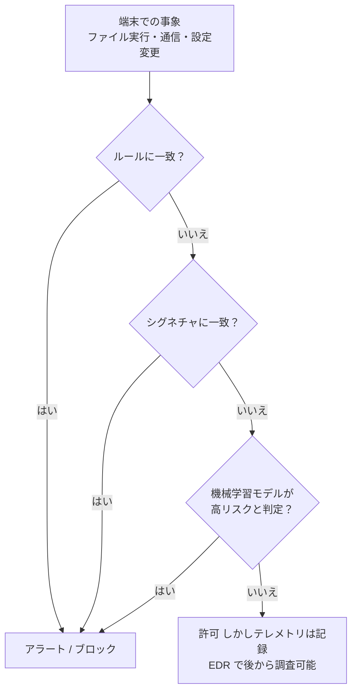

🟠 **ベストプラクティス**
- **ネットワーク防御とホスト防御を併用**（ネットワークから見えない暗号化通信や端末内の挙動はホスト側で補う）
- AI の判定は**そのまま鵜呑みにせず**、説明可能性・誤検知率を評価し、アナリストが検証できる運用にする
- EDR は**導入率（カバレッジ）**が命。未導入端末を資産管理と突き合わせて洗い出す
- ホストファイアウォールは**既定で受信拒否**、必要なものだけ許可

🔴 **試験の着眼点**：「シグネチャ＝既知」「機械学習＝未知に強いが誤検知・説明性の課題」「HIDS は検知、HIPS は阻止」。

---

### 4.2 〔3.2〕OS コンポーネントの特定（Windows・Linux）

#### 4.2.1 Windows の主要コンポーネント

| コンポーネント | 🔵 内容 | 🟢 調査での使い道 |
|---|---|---|
| **プロセス／サービス** | 実行中のプログラム。サービスはバックグラウンド常駐 | 不審な名前・パス・親子関係（例：Word → cmd.exe）の発見 |
| **レジストリ** | 設定のデータベース（HKLM / HKCU など）。`Run` キーなどに自動起動を登録 | **永続化（Persistence）**の痕跡の発見 |
| **イベントログ（.evtx）** | Security / System / Application ログ、PowerShell ログなど | ログオン成否、プロセス作成、サービス追加などの時系列 |
| **ファイルシステム（NTFS）** | MFT（マスターファイルテーブル）、代替データストリーム（ADS） | ファイルの作成・変更時刻、隠しデータ |
| **スケジュールタスク** | 定期実行の登録 | 永続化・遅延実行の痕跡 |
| **Active Directory（AD）** | ドメインの認証・権限管理 | 権限昇格・横展開（ラテラルムーブメント）の調査 |
| **PowerShell／WMI** | 強力な管理機能。攻撃にも悪用される | スクリプトブロックログで実行内容を確認 |
| **Sysmon**（Sysinternals） | 詳細なプロセス・ネットワーク・レジストリのテレメトリを記録する拡張ツール | EDR が無い環境での詳細ログ収集 |

**重要な Windows セキュリティイベント ID**

| イベント ID | 意味 | 調査の観点 |
|---|---|---|
| 4624 | ログオン成功 | ログオンタイプ（2＝対話、3＝ネットワーク、10＝リモートデスクトップ）を確認 |
| 4625 | ログオン失敗 | **短時間の連続失敗＝ブルートフォース／パスワードスプレー** |
| 4688 | プロセス作成 | コマンドライン記録を有効化すると強力 |
| 4672 | 特権の割り当て（管理者相当のログオン） | 管理者ログオンの追跡 |
| 4720 / 4732 | アカウント作成／グループへの追加 | 不正アカウント・権限付与 |
| 1102 | 監査ログのクリア | **証拠隠滅の疑い** |
| 7045 | サービスのインストール（System ログ） | 永続化の疑い |
| 4698 | スケジュールタスクの作成 | 永続化の疑い |

**Sysmon の主なイベント ID**：1＝プロセス作成、3＝ネットワーク接続、7＝イメージ（DLL）ロード、8＝リモートスレッド作成、10＝プロセスアクセス、11＝ファイル作成、13＝レジストリ値の設定、22＝DNS クエリ。

**Windows でよく使うコマンド**

| 目的 | コマンド |
|---|---|
| プロセス一覧 | `tasklist` / `Get-Process` |
| ネットワーク接続とプロセスの対応 | `netstat -ano` |
| IP 構成 | `ipconfig /all` |
| 現在のユーザー | `whoami` |
| タスク確認 | `schtasks /query` |
| ログ検索（PowerShell） | `Get-WinEvent -FilterHashtable @{LogName='Security'; Id=4625}` |
| レジストリ参照 | `reg query HKLM\Software\Microsoft\Windows\CurrentVersion\Run` |

#### 4.2.2 Linux の主要コンポーネント

| コンポーネント | 🔵 内容 | 🟢 調査での使い道 |
|---|---|---|
| **ファイルシステム階層** | `/etc`（設定）、`/var/log`（ログ）、`/home`（利用者）、`/tmp`（一時）、`/proc`（プロセス情報）、`/bin` `/usr/bin`（コマンド） | `/tmp` に置かれた不審ファイル、`/etc` の改ざん |
| **ユーザーと権限** | `/etc/passwd`（アカウント）、`/etc/shadow`（パスワードハッシュ）、`chmod`/`chown`、`sudo` | 不正アカウント、**SUID** ビットの悪用、`sudo` の履歴 |
| **プロセス管理** | `ps`、`top`、`systemd`（サービス管理） | 不審プロセスの確認、不正サービス |
| **スケジューラ** | `cron`、`systemd timer` | 永続化の痕跡 |
| **SSH** | `~/.ssh/authorized_keys` | **不正な公開鍵の追加**による裏口 |
| **ログ** | `/var/log/auth.log`（Debian 系）、`/var/log/secure`（RHEL 系）、`journalctl`、`/var/log/syslog` | 認証失敗・成功、`sudo` 実行、サービスの起動・停止 |

**Linux でよく使うコマンド**

| 目的 | コマンド例 |
|---|---|
| プロセス | `ps aux`、`top` |
| 通信とポート | `ss -tulpn`、`netstat -tulpn` |
| 開いているファイル | `lsof -i` |
| ログの追跡・検索 | `tail -f /var/log/auth.log`、`grep "Failed password" /var/log/auth.log` |
| ログイン履歴 | `last`、`lastb`、`who` |
| ファイルのハッシュ | `sha256sum ファイル名` |
| 永続化の確認 | `crontab -l`、`systemctl list-units --type=service` |

🟠 **ベストプラクティス**
- **ログを有効化し、保管と転送を設計**する（Windows は 4688 のコマンドライン記録、PowerShell スクリプトブロックログ、Sysmon／Linux は auditd）
- **最小権限**・不要サービスの停止・パッチ適用
- **ベースライン**（正常な状態：プロセス、起動項目、ポート）を取り、差分で異常を発見

🔴 **試験の着眼点**：シナリオ（例：レジストリの Run キー／`authorized_keys`／cron に不審な項目）から「**永続化**」を見抜く。ログの手がかりからイベントを特定する。

---

### 4.3 〔3.3〕調査におけるアトリビューション（攻撃者特定）の役割

🟢 **かんたん説明**：「**誰が・何を狙って・どう攻撃したか**」を整理する作業。ただし**確定は難しく、慎重さが必要**です。

| 要素 | 項目 | 🔵 内容 |
|---|---|---|
| **資産（Assets）** | 3.3.a | 守る対象（サーバー、データ、アカウント）。**どの資産が狙われたか**が攻撃者の目的を示唆する |
| **攻撃者（Threat Actor）** | 3.3.b | 攻撃を行う主体と動機・能力・手口（TTP） |
| **侵害の指標（IOC）** | 3.3.c | 侵害された**痕跡（結果）**：不審なハッシュ、IP、ドメイン、ファイル名、レジストリ |
| **攻撃の指標（IOA）** | 3.3.d | 攻撃**の最中の振る舞い（意図）**：不審な権限昇格の試行、資格情報ダンプ、横展開の動き |
| **証拠保全（Chain of Custody）** | 3.3.e | 証拠の**入手から提出までの管理履歴**を途切れなく記録すること |

#### 4.3.1 IOC と IOA の違い

| 比較 | IOC（Indicator of Compromise） | IOA（Indicator of Attack） |
|---|---|---|
| 着目点 | **すでに起きた侵害の痕跡**（事後） | **攻撃者の行動・意図**（進行中） |
| 例 | マルウェアのハッシュ、C2 の IP・ドメイン | 正規ツールを使った資格情報の窃取手順、異常な管理共有へのアクセス |
| 長所 | 照合が簡単で自動化しやすい | **未知のマルウェアでも**振る舞いで検知できる |
| 短所 | 攻撃者が IP・ドメインを変えれば無効（寿命が短い） | 検知ロジックの作り込みが必要 |

**参考：Pyramid of Pain（痛みのピラミッド）**：下の指標ほど攻撃者が変えるのは簡単、上ほど変えさせるのが「痛い」。

| 階層（上ほど攻撃者に痛い） | 例 |
|---|---|
| TTP（戦術・技術・手順） | 攻撃手順そのもの |
| ツール | 攻撃ツールの特徴 |
| ネットワーク／ホストの痕跡 | User-Agent、レジストリキー |
| ドメイン名 | 攻撃用ドメイン |
| IP アドレス | 攻撃元 IP |
| ハッシュ値 | ファイルのハッシュ（1 ビット変えれば別物） |

#### 4.3.2 証拠保全（Chain of Custody）の流れ

```mermaid
flowchart TD
    A["証拠を特定"] --> B["現状を記録<br/>写真・時刻・場所・状態"]
    B --> C["書き込み防止して取得<br/>イメージ作成"]
    C --> D["ハッシュ値を計算し記録<br/>原本とコピーで一致確認"]
    D --> E["封印・ラベル付け<br/>施錠保管"]
    E --> F["受け渡しごとに記録<br/>誰が・いつ・なぜ・どこへ"]
    F --> G["解析はコピーで実施<br/>原本は触らない"]
    G --> H["報告書に管理履歴を添付"]
```

🟠 **ベストプラクティス**
- **アトリビューションは「確度」を明記**する（確定／高い／中程度／低い）。IP アドレスや言語、使用時間帯は**偽装されうる**
- 証拠は**原本を保護**し、解析は**コピー**で行う。ハッシュ値で完全性を証明する
- 管理履歴（誰が・いつ・何を・なぜ）を**途切れさせない**。途切れた証拠は信頼性を失う
- 法的手続きの可能性がある場合は、**早期に法務・警察と連携**する

🔴 **試験の着眼点**：「IOC＝痕跡（事後）」「IOA＝行動（進行中）」の区別。Chain of Custody は**証拠の信頼性（法的な有効性）**のための記録。

---

### 4.4 〔3.4〕提供されたログに基づく証拠の種類の特定

| 種類 | 項目 | 🟢 かんたん説明 | 🔵 例 |
|---|---|---|---|
| **最良証拠（Best Evidence）** | 3.4.a | **原本そのもの**、最も信頼性が高い直接的な証拠 | 改ざんされていない原本のログファイル、押収したディスクの原本、実際の通信を記録した PCAP |
| **補強証拠（Corroborative Evidence）** | 3.4.b | **他の証拠を裏付け・補強**する証拠。単独でも意味はあるが主証拠を強める | あるホストの FW ログ（接続記録）が、そのホストの EDR ログ（プロセスの通信記録）と一致している |
| **間接証拠（Indirect Evidence）** | 3.4.c | 事実を**推論**によって示す状況的な証拠 | 「深夜に管理者アカウントでログオンがあった後、大量のファイルが外部へ送信された」→ 持ち出しを推論 |

```mermaid
flowchart LR
    A["原本ログ・PCAP<br/>最良証拠"] --> D["事実の認定"]
    B["別ログとの一致<br/>補強証拠"] --> D
    C["状況からの推論<br/>間接証拠"] --> D
```

> ⚠️ 証拠の分類の呼び方・法的な扱いは**国・法域によって異なります**。本試験の区分（最良／補強／間接）に沿って理解し、実務では法務と連携してください。

🟠 **ベストプラクティス**：ログは**原本を保護**し（ハッシュ・書き込み禁止）、**複数の独立した情報源**で裏付ける／時刻同期（NTP）を確認し、**タイムゾーンを統一**して時系列を作成する。

🔴 **試験の着眼点**：与えられたログがどの区分かを判定する（原本＝最良、別の証拠との一致＝補強、状況からの推論＝間接）。

---

### 4.5 〔3.5〕OS／SIEM／SOAR／アプリ／コマンドラインのログ解釈

🟢 **かんたん説明**：ログは「**いつ・どこで・誰が・何を・結果は？（5W1R）**」で読むと整理できます。

#### 4.5.1 ログ読解の基本 5 ステップ

```mermaid
flowchart TD
    A["1 時刻を確認<br/>タイムゾーン・時刻ずれ"] --> B["2 主体を確認<br/>ユーザー・ホスト・プロセス"]
    B --> C["3 行為を確認<br/>何をしたか"]
    C --> D["4 結果を確認<br/>成功か失敗か"]
    D --> E["5 前後のログと突き合わせて<br/>ストーリーにする"]
```

#### 4.5.2 ログ種別ごとの読み方の例（すべて架空）

**① Linux の認証ログ（SSH のブルートフォースの例）**

```text
Oct  5 02:11:03 srv01 sshd[2211]: Failed password for root from 203.0.113.50 port 51122 ssh2
Oct  5 02:11:05 srv01 sshd[2213]: Failed password for root from 203.0.113.50 port 51140 ssh2
Oct  5 02:11:07 srv01 sshd[2215]: Failed password for admin from 203.0.113.50 port 51161 ssh2
Oct  5 02:12:41 srv01 sshd[2301]: Accepted password for admin from 203.0.113.50 port 52010 ssh2
```

| 読み取り | 結論 |
|---|---|
| 同一の外部 IP から短時間に複数ユーザー名で失敗が連続 | **ブルートフォース** |
| 最後に `Accepted` が出ている | **侵入に成功した可能性が高い** → 即時調査（その後の操作、`authorized_keys` の変更など） |

**② Windows イベント（ログオン失敗の連続の後に成功）**

| 時刻 | イベント ID | アカウント | 送信元 | 意味 |
|---|---|---|---|---|
| 03:20:01〜03:20:30 | 4625 × 30 | administrator | 198.51.100.9 | 連続失敗（ブルートフォース） |
| 03:21:02 | 4624（タイプ 10） | administrator | 198.51.100.9 | **RDP でログオン成功** |
| 03:22:15 | 4688 | administrator | ― | `cmd.exe` から `whoami` / `net user` 実行（偵察） |

**③ コマンドラインログの危険な兆候**

| コマンドの特徴 | 疑われること |
|---|---|
| `powershell -enc ...`（Base64 エンコードの実行） | 難読化された悪性スクリプト |
| `certutil -urlcache -f http://...`、`bitsadmin` | 正規ツールを使ったファイルのダウンロード（Living off the Land） |
| `net user ... /add`、`net localgroup administrators ... /add` | 不正アカウント作成・権限付与 |
| `vssadmin delete shadows` | **シャドウコピーの削除（ランサムウェアの典型）** |
| `wevtutil cl Security` | イベントログの消去（証拠隠滅） |

**④ Syslog の重大度（Severity）**：0 Emergency、1 Alert、2 Critical、3 Error、4 Warning、5 Notice、6 Informational、7 Debug。**数字が小さいほど重大**。

**⑤ SIEM／SOAR のログ**：SIEM は**相関ルールが発したアラート**（例：「同一ユーザーが 5 分間に 10 回失敗後に成功」）と元ログへのリンク。SOAR は**プレイブックの実行履歴**（どの自動対応を、いつ、誰の承認で、結果はどうだったか）。アラートを**鵜呑みにせず元ログで裏取り**する。

🟠 **ベストプラクティス**：ログの**正規化**（共通フォーマット）と**時刻統一**／重要イベント（認証・権限変更・ログクリア）は**即時アラート**／**単発のログで断定せず**、複数ソースで時系列を再構成する。

🔴 **試験の着眼点**：ログ断片から**何が起きたか**を文章化する問題（ブルートフォース→成功→偵察、永続化、証拠隠滅）。

---

### 4.6 〔3.6〕マルウェア分析ツール（デトネーションチャンバー／サンドボックス）の出力レポートの解釈

🟢 **かんたん説明**：サンドボックスは**隔離された安全な環境で怪しいファイルを実行**し、何をしたかを記録します。レポートは「**そのファイルの行動履歴書**」です。Cisco 製品では Cisco Secure Malware Analytics（旧 Threat Grid）などがあります。

#### 4.6.1 レポートの主な項目と読み方

| セクション | 🔵 内容 | 🟢 何を判断するか |
|---|---|---|
| **判定／スコア** | 悪性度（例：0〜100）と判定（clean / suspicious / malicious） | 優先度の目安（鵜呑みにはしない） |
| **ファイル情報** | ファイル名、種別、サイズ、**ハッシュ（MD5 / SHA-1 / SHA-256）** | 同一ファイルの照合、TI への照会 |
| **静的解析** | 文字列、インポート関数（API）、PE セクション、**エントロピー（高い＝圧縮・暗号化の疑い）** | パッキング・難読化の有無 |
| **プロセスツリー** | 実行時の親子関係（例：`WINWORD.EXE` → `powershell.exe` → `cmd.exe`） | **Office からスクリプト実行は典型的な悪性** |
| **ファイル操作** | 作成・変更・削除・**ドロップされたファイル** | 追加ペイロード、永続化用ファイル |
| **レジストリ操作** | `Run` キー、サービス登録など | **永続化**の手口 |
| **ネットワーク通信** | DNS 問い合わせ、接続先 IP・ポート、HTTP リクエスト、ダウンロード URL | **C2 サーバー**、追加ダウンロード元 |
| **スクリーンショット** | 実行中の画面 | ユーザーを騙す偽画面などの確認 |
| **MITRE ATT&CK 対応** | 観測した技術の分類 | 攻撃の位置づけを共有 |

```mermaid
flowchart TD
    A["レポートを受領"] --> B["判定とスコアを確認"]
    B --> C["ハッシュを取得<br/>TIで既知か確認"]
    C --> D["プロセスツリーを確認<br/>不自然な親子関係は？"]
    D --> E["ネットワーク通信を確認<br/>C2・ダウンロード先"]
    E --> F["ファイル・レジストリ操作を確認<br/>永続化・ドロップ"]
    F --> G["IOC を抽出<br/>ハッシュ・IP・ドメイン・URL"]
    G --> H["自組織で該当ホストを検索<br/>EDR・プロキシ・DNS"]
    H --> I["ブロック・隔離・報告"]
```

#### 4.6.2 〔3.7〕レポートから抽出して使う項目

> 📝 **番号に関する注記**：公式の試験範囲 PDF では、3.6 の次の行が「3.7.a ハッシュ / 3.7.b URL / 3.7.c システム・イベント・ネットワーキング」と**親項目（3.7）の見出し無しで記載**されており、3.6 の下位項目とも読めます。内容は「**マルウェア分析の結果から取り出す要素**」として理解すれば十分です。

| 項目 | 🔵 活用方法 |
|---|---|
| **ハッシュ（3.7.a）** | TI での既知判定、**自組織の全端末を EDR で検索**、ブロックリスト登録。※ハッシュは 1 ビットの変更で別の値になる（脆い指標） |
| **URL（3.7.b）** | プロキシ／DNS ログで**アクセスした端末を特定**、Web フィルタでブロック |
| **システム・イベント・ネットワーキング（3.7.c）** | 作成されたファイル・レジストリ・サービス名（ホスト側の痕跡）、接続先 IP・ポート・ドメイン（ネットワーク側の痕跡）を**検知ルール化**し、他のホストも調査 |

🟠 **ベストプラクティス**
- **サンドボックスは万能ではない**：環境検知（VM 検知）、**遅延実行（スリープ）**、特定条件下でのみ動作するマルウェアは見逃されうる → 「悪性判定なし＝安全」と結論づけない
- **機密ファイルを公開オンラインサンドボックスへアップロードしない**（情報漏えいのリスク。社内・専用サンドボックスを利用）
- 得られた IOC は**期限（有効期間）と信頼度**を付けて管理し、検知に反映する
- 解析用端末は**本番ネットワークから隔離**する

🔴 **試験の着眼点**：レポートの断片（プロセスツリー、通信先、レジストリ）から**マルウェアの行動（永続化・C2・ドロップ）を特定**し、次のアクション（隔離、IOC 検索）を選ぶ。

---

### ✅ ドメイン3 チェックリスト

- [ ] ルール／シグネチャ／予測型 AI の違いと、HIDS・AV・ホスト FW の役割を説明できる
- [ ] Windows と Linux の永続化・認証・ログの場所を挙げられる
- [ ] 主要な Windows イベント ID（4624 / 4625 / 4688 / 1102 / 7045）の意味を言える
- [ ] IOC と IOA、資産・攻撃者・Chain of Custody の関係を説明できる
- [ ] 最良証拠・補強証拠・間接証拠をログで見分けられる
- [ ] ログからブルートフォース→成功→偵察の流れを文章化できる
- [ ] サンドボックスレポートからプロセスツリー・通信・IOC を読み取れる


---

## 第5章 ドメイン4：ネットワーク侵入分析（20%）

> 試験項目：4.1 〜 4.10（イベントと発生源のマッピング、検知結果の分類、DPI、インライン vs TAP、NetFlow、Wireshark、PCAP 分析、プロトコルヘッダー、アーティファクト、正規表現）
> **手を動かして覚える**分野です。Wireshark・Linux コマンドを実際に触りながら読み進めてください。

### 5.1 〔4.1〕イベントと発生源となる技術のマッピング

🟢 **かんたん説明**：ログの**書式や項目の特徴**から「どの装置が出したログか」を見分ける力。

| 発生源 | 項目 | 🔵 ログの特徴 | 見分けるキーワード |
|---|---|---|---|
| **IDS/IPS** | 4.1.a | **シグネチャ ID（SID）、メッセージ、分類、優先度**、送信元→宛先 | `[1:2100498:7]`、`Classification`、`Priority` |
| **ファイアウォール** | 4.1.b | 許可／拒否（Built / Deny）、**5 タプル**、ACL 名、インターフェース | `Deny`、`Built`、`access-group` |
| **ネットワークアプリケーション制御** | 4.1.c | **アプリケーション名・カテゴリ**、利用者、処理（許可／ブロック） | `Application: ...`、`Category` |
| **プロキシログ** | 4.1.d | **URL、HTTP メソッド、ステータス、ユーザー名、User-Agent、カテゴリ** | `GET http://...`、`TCP_MISS/200` |
| **ウイルス対策** | 4.1.e | **ファイル名、ハッシュ、脅威名、処理（隔離・削除）** | `Threat detected`、`Quarantined` |
| **トランザクションデータ（NetFlow）** | 4.1.f | **フロー単位の要約**（5 タプル、バイト数、パケット数、TCP フラグ、時刻）。内容なし | `bytes`、`packets`、`flows` |

ログのサンプル（架空）：

```text
# IDS/IPS（Snort 形式の例）
[**] [1:1000001:1] LOCAL Possible SQL Injection attempt [**]
[Classification: Web Application Attack] [Priority: 1]
10/05-10:15:22.123456 203.0.113.50:51122 -> 10.0.0.10:80 TCP

# ファイアウォール（Cisco ASA 形式の例）
%ASA-4-106023: Deny tcp src outside:203.0.113.50/51122 dst inside:10.0.0.10/3389 by access-group "OUTSIDE_IN"
%ASA-6-302013: Built inbound TCP connection 8812 for outside:203.0.113.50/51140 (203.0.113.50/51140) to inside:10.0.0.10/443 (198.51.100.10/443)

# プロキシ（Squid 形式の例）
1759626922.331 245 10.0.0.25 TCP_MISS/200 15321 GET http://malware.example.net/payload.exe - HIER_DIRECT/203.0.113.77 application/octet-stream
```

| ログ | 読み取り |
|---|---|
| IDS | 外部から Web サーバーへ **SQL インジェクションの試行**（優先度 1＝高） |
| ASA 106023 | 外部から内部の **3389（RDP）** への通信を ACL が**拒否** |
| ASA 302013 | 外部から内部の 443 への接続が**確立**（許可された通信） |
| プロキシ | 内部端末が不審サイトから **`.exe` をダウンロード**（成功：200） |

🟠 **ベストプラクティス**：各装置のログ形式を**正規化**し、**共通のフィールド**（時刻・送信元・宛先・処理）に揃えて SIEM で相関／「**拒否ログ**」と「**許可ログ**」の両方を見る（拒否はスキャン・攻撃の兆候、許可は実際の通信）。

🔴 **試験の着眼点**：ログ断片から**発生源の装置を当てる**（SID があれば IDS/IPS、URL とユーザーならプロキシ、バイト数とフロー要約なら NetFlow）。

---

### 5.2 〔4.2〕検知結果の分類（誤検出・検出漏れ・正検出・正常判定・無害）

🟢 **かんたん説明**：「**アラートが出たか**」×「**実際に攻撃があったか**」の 2 軸で 4 パターンに分類します（混同行列）。

| | **実際に攻撃あり** | **実際に攻撃なし** |
|---|---|---|
| **アラートあり（検知）** | **True Positive（正検出）**<br/>攻撃を正しく検知 | **False Positive（誤検出）**<br/>攻撃でないのに誤って警告 |
| **アラートなし（不検知）** | **False Negative（検出漏れ）**<br/>攻撃を見逃した | **True Negative（正常判定）**<br/>正常を正常と判断 |

| 分類 | 項目 | 🔵 意味 | 影響（Impact） | 🟠 対応 |
|---|---|---|---|---|
| **False Positive** | 4.2.a | 正常な通信を攻撃と誤判定 | **直接の被害はない**が、アナリストの工数を浪費し、**本物のアラートが埋もれる** | ルールのチューニング、例外設定（ホワイトリスト） |
| **False Negative** | 4.2.b | 攻撃を見逃した | **最も危険**（侵害に気づけず被害が拡大） | 検知範囲の拡大、追加の検知手法、ハンティング |
| **True Positive** | 4.2.c | 攻撃を正しく検知 | 対応が必要（被害の拡大を防げる） | インシデント対応の開始 |
| **True Negative** | 4.2.d | 正常を正常と判定 | 影響なし（期待どおり） | ― |
| **Benign（無害）** | 4.2.e | ルールには一致するが**実害のない**事象（例：脆弱性スキャナーによる社内の定期スキャン） | 実害なし。ただし**本物の攻撃と見分ける**必要あり | 既知の無害な活動として記録・除外条件を整理 |

> 💡 **覚え方**：「**後ろの語（Positive/Negative）＝システムの判定**、**前の語（True/False）＝その判定が正しいか**」。False Negative＝「陰性（検知なし）と判定したが、それは間違い」。

#### 5.2.1 評価指標（参考）

| 指標 | 式 | 意味 |
|---|---|---|
| 適合率（Precision） | TP ÷ (TP + FP) | **出したアラートのうち、本物の割合**（高い＝誤検知が少ない） |
| 再現率（Recall） | TP ÷ (TP + FN) | **本物の攻撃のうち、検知できた割合**（高い＝見逃しが少ない） |

> 感度を上げると**見逃しは減るが誤検知が増える**（トレードオフ）。

🟠 **ベストプラクティス**：**誤検知を放置しない**（アラート疲れの原因）／False Negative は「検知されなかった」ため見つけにくい → ハンティングやレッドチーム演習で検証／重要度の高い資産では**再現率**を重視。

🔴 **試験の着眼点**：シナリオを 4 分類に当てはめる。「**最も危険なのは False Negative**」。

---

### 5.3 〔4.3〕ディープパケットインスペクション（DPI）とパケットフィルタリング／ステートフル FW の比較

| 比較軸 | パケットフィルタリング | ステートフルファイアウォール | DPI（ディープパケットインスペクション） |
|---|---|---|---|
| 見る範囲 | L3〜L4 ヘッダー（IP・ポート・プロトコル） | L3〜L4 ＋ **接続状態** | **L7 ペイロードまで**（アプリのデータ内容） |
| 判断材料 | 各パケットを**個別に**ルール照合 | **セッションの状態**（TCP の接続確立・応答の対応） | プロトコルの正しさ、シグネチャ、ファイル、アプリ識別 |
| 検知できる例 | 特定ポートの遮断 | 外から始まった**未確立の通信（なりすまし応答）**の拒否 | **HTTP 中の SQL インジェクション、マルウェアのファイル、アプリ判別（80 番ポートで動くチャット等）** |
| 処理の負荷 | 軽い | 中程度 | **重い** |
| 暗号化通信 | ヘッダーのみで判断可 | 同様 | **復号しなければ中身は見えない** |

```mermaid
flowchart TD
    P["パケット到着"] --> F{"パケットフィルタ<br/>IP・ポートは許可？"}
    F -- "拒否" --> X["破棄"]
    F -- "許可" --> S{"ステートフル<br/>既存の接続に対応？"}
    S -- "いいえ" --> X
    S -- "はい" --> D{"DPI<br/>ペイロードに脅威や<br/>プロトコル違反は？"}
    D -- "あり" --> X
    D -- "なし" --> A["通過"]
```

🟠 **ベストプラクティス**：DPI は**負荷と暗号化**の課題があるため、**重要区間に適用**し、TLS 復号は**ポリシー・法令・プライバシー**に配慮して対象を絞る。

🔴 **試験の着眼点**：「**ステートフルは状態を、DPI はデータの中身を見る**」。「ポート 80 だから安全」はパケットフィルタの発想で、DPI が必要な場面がある。

---

### 5.4 〔4.4〕インライン検査と TAP／トラフィックモニタリングの比較

```mermaid
flowchart LR
    subgraph IL["インライン配置：通信の経路上に設置"]
      A1["クライアント"] --> IPS1["IPS / FW<br/>通信が必ず通過"] --> S1["サーバー"]
    end
    subgraph TP["TAP / SPAN 配置：通信のコピーを受け取る"]
      A2["クライアント"] --> SW["スイッチ / TAP"] --> S2["サーバー"]
      SW -. "コピー" .-> IDS2["IDS / モニター"]
    end
```

| 比較軸 | インライン（In-line） | TAP／SPAN（トラフィックモニタリング） |
|---|---|---|
| 配置 | 通信経路の**途中**に設置 | 通信の**コピー**を受信（経路の外） |
| 動作モード | **IPS**：検知し**その場で阻止**できる | **IDS**：検知・記録のみ（阻止はできない。別機器と連携して対応） |
| 通信への影響 | **遅延・障害点になりうる**（故障すると通信が止まる） | **通信に影響しない** |
| 故障時の考慮 | **フェイルオープン（通す）／フェイルクローズ（止める）**の設計が必要 | 故障しても業務通信に影響なし |
| 見逃し | 全通信を確認できる | **SPAN は負荷時にパケットを落とす**ことがある。TAP は全パケットを忠実にコピー |
| 向いている用途 | 確実な防御が必要な境界 | 本番に影響させたくない監視・調査・フォレンジック |

| 方式 | 🔵 特徴 |
|---|---|
| **ネットワーク TAP**（専用機器） | 通信を**忠実にコピー**。パケット欠落が少ない |
| **SPAN / ミラーポート**（スイッチ機能） | 設定で手軽。ただし**スイッチの負荷時に欠落**する可能性、VLAN・方向の設定に注意 |

🟠 **ベストプラクティス**：最初は**検知モード（IDS）**で動作を確認し、誤検知を調整してから**防御モード（IPS）**へ移行／インラインは**フェイルセーフ設計**（冗長構成、バイパス）／TAP/SPAN は**監視したい区間（境界・重要セグメント）**に配置。

🔴 **試験の着眼点**：「**阻止できるのはインライン**」「**TAP/SPAN は本番に影響しないが阻止はできない**」。

---

### 5.5 〔4.5〕TAP／監視データとトランザクションデータ（NetFlow）の特性比較

| 比較軸 | TAP／トラフィックモニタリング（パケットキャプチャ） | トランザクションデータ（NetFlow） |
|---|---|---|
| 内容 | **パケットそのもの**（ペイロード含む） | **フローの要約**（5 タプル、バイト数、パケット数、時刻、TCP フラグ） |
| 詳細度 | **最大** | 要約（ペイロードなし） |
| データ量 | **非常に大きい** | **小さい**（元データの数％程度とも言われる） |
| 保管期間 | 短い（数時間〜数日になりがち） | **長期保管が現実的**（数か月〜） |
| 収集の場所 | TAP/SPAN の設置箇所 | **ルーター／スイッチ／FW が生成**（設置箇所の制約が少ない） |
| 暗号化通信 | **中身は読めない** | **影響を受けにくい**（要約なので有効） |
| 得意な調査 | 攻撃の再現、ファイル復元、プロトコル解析 | **全体像の把握、異常な通信量、横展開・スキャン、データ持ち出しの検知** |

```mermaid
flowchart TD
    Q["調査したいこと"] --> Q1{"通信の内容<br/>ファイルや命令を<br/>確認したい？"}
    Q1 -- "はい" --> P["パケットキャプチャ"]
    Q1 -- "いいえ" --> Q2{"広範囲・長期間の<br/>誰と通信したかを知りたい？"}
    Q2 -- "はい" --> N["NetFlow"]
    P --> C["両者を組み合わせる<br/>NetFlowで怪しい通信を絞り込み<br/>該当区間のみパケットを確認"]
    N --> C
```

🟠 **ベストプラクティス**：**NetFlow で広く浅く常時監視 → 怪しい通信だけパケットキャプチャで深掘り**（コストと効果のバランス）／キャプチャは**重要セグメント・限定期間**で運用。

🔴 **試験の着眼点**：「**NetFlow にペイロードは含まれない**」「長期の傾向把握・暗号化通信の影響を受けにくい」。

---

### 5.6 〔4.6〕PCAP と Wireshark による TCP ストリームからのファイル抽出

🟢 **かんたん説明**：記録した通信（PCAP）の中から、**転送されたファイルを取り出す**手順。マルウェアの入手経路や持ち出されたデータの確認に使います。

> ⚠️ **安全上の注意**：PCAP から取り出したファイルは**マルウェアの可能性**があります。**隔離した解析用 VM で扱い**、ダブルクリックで実行しないでください。取り出したらハッシュ値を記録します。

#### 5.6.1 手順（HTTP の場合）

```mermaid
flowchart TD
    A["1 PCAP を Wireshark で開く"] --> B["2 表示フィルタで対象を絞る<br/>例：http.request.method == GET"]
    B --> C["3 怪しい通信を選択<br/>右クリック → Follow → TCP Stream"]
    C --> D["4 内容を確認<br/>要求のURL・応答ヘッダー・Content-Type"]
    D --> E["5 File → Export Objects → HTTP"]
    E --> F["6 該当ファイルを選び Save"]
    F --> G["7 sha256 ハッシュを計算して記録"]
    G --> H["8 TIで照会・サンドボックスで解析"]
```

| 手順 | 操作 | ポイント |
|---|---|---|
| 1 | 対象の PCAP を開く | 解析前に PCAP 自体のハッシュも記録（証拠保全） |
| 2 | 表示フィルタを適用 | 下表の例を参照 |
| 3 | **Follow TCP Stream** | 1 つの会話（要求と応答）を時系列で確認 |
| 4 | Content-Type・ファイル名を確認 | `application/octet-stream`、`.exe`、`.zip` などは要注意 |
| 5〜6 | **File → Export Objects → HTTP** | HTTP で転送された**ファイルの一覧**から保存 |
| 7 | `sha256sum ファイル名` | ハッシュを記録（Chain of Custody） |
| 8 | 解析 | 隔離環境・サンドボックスで解析、TI で照会 |

> **HTTP 以外のプロトコル（FTP・SMB・独自プロトコルなど）の場合**：Follow TCP Stream の画面で **「Show data as: Raw」** に切り替え、**Save as** でバイナリを保存します（先頭のヘッダー部分が混ざる場合は、ファイル形式のマジックナンバーで確認して不要部分を除去）。
>
> **HTTPS（暗号化）の場合**：そのままでは取り出せません。事前にブラウザの鍵ログ（`SSLKEYLOGFILE`）を取得して Wireshark に設定するなど、**復号できる条件**が必要です。

#### 5.6.2 よく使う Wireshark 表示フィルタ

| 目的 | フィルタ |
|---|---|
| 特定の IP の通信 | `ip.addr == 10.0.0.25` |
| 送信元／宛先を限定 | `ip.src == 10.0.0.25` / `ip.dst == 203.0.113.50` |
| 特定のポート | `tcp.port == 443` |
| 特定の会話（ストリーム） | `tcp.stream eq 5` |
| HTTP の GET | `http.request.method == "GET"` |
| HTTP のレスポンスコード | `http.response.code == 200` |
| DNS 問い合わせ名の絞り込み | `dns.qry.name contains "example"` |
| TCP SYN のみ（スキャン検知） | `tcp.flags.syn == 1 && tcp.flags.ack == 0` |
| TCP RST | `tcp.flags.reset == 1` |
| 複数条件 | `ip.addr == 10.0.0.25 && http` |

> 💡 **表示フィルタ**（解析後に絞り込む。Wireshark の画面上部）と**キャプチャフィルタ**（BPF 構文、取得時に絞る）は**別物**です。

🟠 **ベストプラクティス**：解析は**必ずコピーで**行い、PCAP の原本を保護／取り出したファイルは**ハッシュを記録してから**解析／**隔離環境**で扱い、**本番端末で開かない**。

🔴 **試験の着眼点**：「**Follow TCP Stream → Export Objects**」の流れ。

---

### 5.7 〔4.7〕PCAP から侵入の主要な要素を特定

🟢 **かんたん説明**：PCAP の中から「**どこから（送信元）・どこへ（宛先）・どのポート・どのプロトコル・何を送ったか（ペイロード）**」を読み取り、侵入の全体像を組み立てます。

| 要素 | 項目 | 🔵 何を見るか |
|---|---|---|
| 送信元アドレス | 4.7.a | **攻撃元**（外部 IP か、内部の侵害済み端末か） |
| 宛先アドレス | 4.7.b | **被害を受けた資産**（サーバー、重要資産か） |
| 送信元ポート | 4.7.c | 通常**ランダム**（エフェメラル）。同一の送信元ポートが固定なら特殊なツールの可能性 |
| 宛先ポート | 4.7.d | **狙われたサービス**（22＝SSH、80/443＝Web、445＝SMB、3389＝RDP） |
| プロトコル | 4.7.e | TCP / UDP / ICMP / DNS / HTTP など。**用途と合わない使い方**に注目（例：DNS で巨大データ） |
| ペイロード | 4.7.f | **攻撃の中身**（SQL 文、コマンド、ファイル、認証情報） |

#### 5.7.1 分析例（架空のシナリオ）

| 時系列 | 事象（PCAP から読み取れる内容） | 判断 |
|---|---|---|
| 10:00:00〜10:00:30 | 203.0.113.50 から 10.0.0.10 の**多数のポート**へ SYN のみ（応答なし／RST） | **ポートスキャン**（偵察） |
| 10:01:10 | 203.0.113.50 → 10.0.0.10:80 に `GET /login?user=admin'+OR+'1'='1` | **SQL インジェクション**の試行（初期侵入） |
| 10:02:05 | 応答に管理者のデータが含まれる | 攻撃が**成功** |
| 10:03:20 | 10.0.0.10 → 203.0.113.50:4444 への接続が確立 | **リバースシェル**／C2 の確立 |
| 10:05:00〜 | 10.0.0.10 から内部の別サーバー 445 番へ接続 | **横展開（ラテラルムーブメント）** |

```mermaid
flowchart LR
    A["偵察<br/>ポートスキャン"] --> B["初期侵入<br/>SQL インジェクション"]
    B --> C["C2 確立<br/>宛先ポート 4444"]
    C --> D["横展開<br/>SMB 445"]
    D --> E["被害拡大の調査<br/>範囲特定"]
```

🟠 **ベストプラクティス**：**時系列で整理**し、「偵察 → 侵入 → 定着 → 横展開 → 目的の実行」のどの段階かを特定／**IOC（IP・ドメイン・ハッシュ・URL）を抽出**して他のホストでも検索／報告書には**証拠（該当パケット番号）**を添える。

🔴 **試験の着眼点**：PCAP の断片から**攻撃元・標的・サービス・手口**を答える。

---

### 5.8 〔4.8〕プロトコルヘッダーのフィールド解釈

> 試験では、**ヘッダーのどのフィールドが何を意味し、侵入分析でどう使うか**が問われます。

#### 5.8.1 〔4.8.a〕イーサネットフレーム

| フィールド | サイズ | 意味 | 侵入分析での使い道 |
|---|---|---|---|
| 宛先 MAC | 6 バイト | 次の機器の MAC | 同一 LAN 内の通信先の特定 |
| 送信元 MAC | 6 バイト | 送信元の MAC | **ARP スプーフィング**（IP と MAC の対応の不整合）の検知 |
| EtherType | 2 バイト | 上位プロトコル（0x0800＝IPv4、0x86DD＝IPv6、0x0806＝ARP、0x8100＝VLAN タグ） | プロトコルの判別 |
| ペイロード | 46〜1500 バイト | 上位層のデータ | ― |
| FCS | 4 バイト | 誤り検出 | 破損の確認 |

#### 5.8.2 〔4.8.b〕IPv4 ヘッダー

| フィールド | 意味 | 侵入分析での使い道 |
|---|---|---|
| Version | 4 | ― |
| IHL | ヘッダー長 | オプションの有無 |
| DSCP / ECN | 優先制御 | QoS の確認 |
| Total Length | パケット全体の長さ | 異常に大きい／小さいパケット |
| Identification / Flags / Fragment Offset | **断片化**の制御 | **フラグメントを悪用した IDS 回避**の検知 |
| **TTL** | 経由できるルーター数の上限 | **OS の推定**（既定値の違い）、`traceroute` の原理、異常に低い TTL |
| **Protocol** | 上位プロトコル（1＝ICMP、6＝TCP、17＝UDP） | トンネリング・異常プロトコルの判別 |
| Header Checksum | ヘッダー誤り検出 | ― |
| **Source / Destination Address** | 送信元・宛先 IP | 攻撃元・被害先の特定。**送信元偽装（スプーフィング）**の可能性 |

#### 5.8.3 〔4.8.c〕IPv6 ヘッダー（固定 40 バイト）

| フィールド | 意味 | 備考 |
|---|---|---|
| Version | 6 | ― |
| Traffic Class | 優先制御 | IPv4 の DSCP/ECN 相当 |
| Flow Label | フロー識別 | ― |
| Payload Length | ペイロード長 | ― |
| **Next Header** | 次のヘッダー（TCP＝6、UDP＝17、ICMPv6＝58、拡張ヘッダー） | **拡張ヘッダーの連鎖**を悪用した回避に注意 |
| **Hop Limit** | IPv4 の TTL 相当 | ― |
| Source / Destination Address | 128 ビットのアドレス | IPv4 のみ監視している環境では**IPv6 が死角**になる |

> 💡 IPv6 ヘッダーには**チェックサムがありません**。また IPv4 と異なり、**中継ルーターによる断片化はしません**（送信元が行う）。

#### 5.8.4 〔4.8.d〕TCP ヘッダー

| フィールド | 意味 | 侵入分析での使い道 |
|---|---|---|
| 送信元／宛先ポート | 通信の入口と出口 | 宛先ポートで**狙われたサービス**を特定 |
| **シーケンス番号／確認応答番号** | データの順序管理 | セッションハイジャックの検知、再送の確認 |
| データオフセット | ヘッダー長 | ― |
| **フラグ（SYN / ACK / FIN / RST / PSH / URG / CWR / ECE）** | 接続の制御 | **スキャンの種類**の判別（下表） |
| ウィンドウサイズ | 受信可能量 | OS の推定、DoS の兆候 |
| チェックサム | 誤り検出 | ― |

**TCP 3 ウェイハンドシェイク**

```mermaid
sequenceDiagram
    participant C as クライアント
    participant S as サーバー
    C->>S: SYN（接続要求）
    S->>C: SYN と ACK（承諾）
    C->>S: ACK（確立）
    Note over C,S: 通信開始
    C->>S: FIN と ACK（終了要求）
    S->>C: ACK と FIN
    C->>S: ACK
```

**フラグのパターンと意味**

| パターン | 意味・疑われること |
|---|---|
| **SYN のみ**（ACK なし）が大量 | **SYN スキャン**／SYN フラッド |
| **SYN → RST/ACK** | ポートが**閉じている**（応答あり＝ホスト存在） |
| **SYN → SYN/ACK → RST** | ハーフオープンスキャン（接続を完了せずに切断） |
| **フラグなし（NULL）** | NULL スキャン |
| **FIN のみ** | FIN スキャン |
| **FIN + PSH + URG**（すべて立てる） | Xmas スキャン |
| **RST が頻発** | 接続拒否・強制切断・スキャン |

#### 5.8.5 〔4.8.e〕UDP ヘッダー（8 バイト固定）

| フィールド | 意味 |
|---|---|
| 送信元／宛先ポート | 通信の入口と出口 |
| 長さ | UDP データグラム全体の長さ |
| チェックサム | 誤り検出 |

> 💡 **コネクションレス**（ハンドシェイクなし、順序・再送の保証なし）。DNS・DHCP・NTP・SNMP・VoIP などで使用され、**送信元の偽装が容易**なため、DDoS の増幅（リフレクション）攻撃に悪用される。

#### 5.8.6 〔4.8.f〕ICMP

| Type | 意味 | 侵入分析での見方 |
|---|---|---|
| 0 | エコー応答（ping 応答） | ホストの存在確認（偵察） |
| 3 | 宛先到達不能（Code でポート／ホスト／ネットワークの不到達を区別） | ポートスキャンへの応答 |
| 8 | エコー要求（ping） | **ping スイープ**（ネットワーク探索） |
| 11 | 時間超過（TTL 切れ） | `traceroute` の動作 |

**ICMP トンネリング**の兆候：ペイロードが**通常（小さい標準データ）より大きい**、**一定間隔**で多数、内容が**ランダム／エンコード**されている。

#### 5.8.7 〔4.8.g〕DNS

| フィールド・概念 | 意味 | 侵入分析での使い道 |
|---|---|---|
| Transaction ID | 問い合わせと応答の対応 | スプーフィング（ID を推測した偽応答）の検知 |
| Flags（QR・Opcode・AA・TC・RD・RA・RCODE） | 問い合わせ／応答、再帰要求、**RCODE（0＝成功、3＝NXDOMAIN）** | **NXDOMAIN の大量発生＝DGA（ドメイン自動生成）の疑い** |
| 質問名（QNAME）・タイプ | A（IPv4）、AAAA（IPv6）、CNAME、MX、NS、PTR、**TXT** | TXT の異常な大量利用＝**DNS トンネリング** |

**DNS からの攻撃検知ポイント**

| 兆候 | 疑われること |
|---|---|
| 異常に**長いサブドメイン**、**高エントロピー**（ランダムな文字列） | DNS トンネリング、DGA |
| 同一ドメインへの**大量・定期的**な問い合わせ | ビーコン、データ持ち出し |
| 存在しないドメイン（NXDOMAIN）の**急増** | DGA によるマルウェアの C2 探索 |
| **TTL が極端に短く**、IP が頻繁に変わる | Fast Flux |

#### 5.8.8 〔4.8.h〕SMTP / POP3 / IMAP

| プロトコル | 用途 | ポート（暗号化なし／暗号化） |
|---|---|---|
| SMTP | **送信**・サーバー間の中継 | 25 ／ 587（提出：STARTTLS）、465（暗黙の TLS） |
| POP3 | 受信（ダウンロード型） | 110 ／ 995 |
| IMAP | 受信（サーバー上で管理） | 143 ／ 993 |

**メールヘッダーの調査ポイント**

| ヘッダー | 見どころ |
|---|---|
| `Received` | メールの**中継経路**（下から上へ読む。最も下が送信元に近い） |
| `From` / `Return-Path` / `Reply-To` | **差出人の偽装**（表示名と実アドレスの不一致、Reply-To が別ドメイン） |
| `Authentication-Results` | **SPF / DKIM / DMARC** の判定（fail は要警戒） |
| 添付・URL | 不審な拡張子（`.exe`、二重拡張子、マクロ付き Office）、短縮 URL、類似ドメイン |

> **SPF**＝送信元サーバーの許可、**DKIM**＝電子署名による改ざん検知、**DMARC**＝SPF/DKIM の失敗時のポリシー（none / quarantine / reject）と報告。

#### 5.8.9 〔4.8.i〕HTTP / HTTPS / HTTP/2

| 項目 | 内容・調査の観点 |
|---|---|
| **メソッド** | GET（取得）、POST（送信）、PUT/DELETE（更新/削除）。**POST で大量送信＝データ持ち出し**の疑い |
| **ステータスコード** | 2xx 成功、3xx リダイレクト、**4xx クライアントエラー（401/403/404：総当たり・探索の兆候）**、5xx サーバーエラー（攻撃の影響の可能性） |
| 主要ヘッダー | `Host`、**`User-Agent`**（ツール名・古いブラウザ・空欄は不審）、`Referer`、`Cookie`、`Content-Type`、`X-Forwarded-For` |
| **HTTPS** | HTTP を TLS で暗号化。**ペイロードは見えない**が、SNI・証明書・接続先 IP・量は見える |
| **HTTP/2** | **バイナリ形式**、**多重化**（1 接続で複数ストリーム）、ヘッダー圧縮（HPACK）。通常は TLS 上で利用 → 平文のテキストとしては読めず、**専用のデコードが必要** |

> 参考：HTTP/3 は QUIC（UDP 上）で動作するため、従来の「TCP の 443 番のみ監視」では見落とす可能性がある。

#### 5.8.10 〔4.8.j〕ARP

| フィールド | 意味 |
|---|---|
| Hardware Type / Protocol Type | 通常はイーサネット／IPv4 |
| **Opcode** | **1＝要求（Who has?）、2＝応答（Is at）** |
| Sender MAC / Sender IP | 送信者の MAC と IP |
| Target MAC / Target IP | 探している相手の IP（要求時の MAC は 0） |

**ARP スプーフィングの検知**：同一 IP に**複数の MAC**が現れる／**要求がないのに応答が大量に出る（Gratuitous ARP）**／ゲートウェイの MAC が突然変わる。

```mermaid
sequenceDiagram
    participant PC as PC
    participant GW as ゲートウェイ
    participant AT as 攻撃者
    PC->>GW: ARP 要求 ゲートウェイの MAC は？
    GW->>PC: ARP 応答 正規の MAC
    AT->>PC: 偽の ARP 応答 ゲートウェイの IP は攻撃者の MAC
    Note over PC: ARP テーブルが書き換わる
    PC->>AT: 通信が攻撃者経由に
```

🟠 **ベストプラクティス**：**IPv6・HTTP/2・QUIC を含めて**監視設計する（IPv4 と HTTP/1.1 だけを想定しない）／DNS ログを必ず収集（DNS は侵入分析の宝庫）／メールは SPF/DKIM/DMARC を設定・確認。

🔴 **試験の着眼点**：**フィールドの名前・サイズ・意味**、**TCP フラグの組み合わせからスキャン種別を答える**問題、ICMP の Type 番号、DNS の兆候（NXDOMAIN 急増・TXT の異常）。

---

### 5.9 〔4.9〕イベントの一般的なアーティファクト要素の解釈（アラートの特定）

🟢 **かんたん説明**：アラートや調査で必ず出てくる**共通の「手がかり」**の読み方。

| アーティファクト | 項目 | 🔵 読み方 | 🟠 次の一手 |
|---|---|---|---|
| **IP アドレス（送信元／宛先）** | 4.9.a | 外部か内部か、既知の悪性か、地理情報・レピュテーション | TI で照会、同じ IP と通信した他端末を検索 |
| **クライアント／サーバーのポート** | 4.9.b | **サーバー側のポート（宛先）が通信の目的を示す**。クライアント側は通常ランダム | 標準外のポートでの標準プロトコル利用（例：443 以外の TLS）に注意 |
| **プロセス（ファイル／レジストリ）** | 4.9.c | プロセス名・パス・親プロセス・コマンドライン、変更されたファイル・レジストリキー | 不自然なパス（`Temp`、`AppData`）や親子関係を確認、永続化の確認 |
| **システム（API コール）** | 4.9.d | プロセスが呼ぶ OS 機能（ファイル操作、プロセス注入、ネットワーク、レジストリ） | **悪性を示唆する API の組み合わせ**（例：他プロセスのメモリ書き込み → リモートスレッド作成＝プロセスインジェクション） |
| **ハッシュ** | 4.9.e | ファイルの一意な指紋（MD5 / SHA-1 / SHA-256） | TI で既知か確認。**MD5/SHA-1 は衝突の問題があり**、確認には SHA-256 を使う |
| **URI / URL** | 4.9.f | 要求先のパス・パラメータ・ドメイン。URL＝完全なアドレス、URI＝リソースの識別子 | 攻撃文字列（`'`、`<script>`、`../`）、類似ドメイン、短縮 URL を確認 |

**代表的な標準ポート**

| ポート | サービス | ポート | サービス |
|---|---|---|---|
| 20/21 | FTP | 25/587/465 | SMTP |
| 22 | SSH | 53 | DNS |
| 23 | Telnet（平文・非推奨） | 80/443 | HTTP / HTTPS |
| 110/995 | POP3 | 143/993 | IMAP |
| 135/139/445 | RPC / NetBIOS / SMB | 3389 | RDP |

🟠 **ベストプラクティス**：1 つのアーティファクトで結論を出さず、**複数のアーティファクトを組み合わせて**判断（例：不審な IP ＋ 不審なプロセス ＋ 不審なハッシュ）／調査結果を**共通の形式（IOC リスト）**で共有。

🔴 **試験の着眼点**：イベントの断片から**どのアーティファクトに着目すべきか**、**次に何を調べるか**を選ぶ。

---

### 5.10 〔4.10〕基本的な正規表現（Regex）

🟢 **かんたん説明**：ログから**パターンに一致する文字列を探す**ための記法。`grep -E` や SIEM の検索で使います。

| 記号 | 意味 | 例 | 一致するもの |
|---|---|---|---|
| `.` | 任意の 1 文字 | `a.c` | abc、a1c |
| `*` | 直前の 0 回以上の繰り返し | `ab*c` | ac、abc、abbc |
| `+` | 直前の 1 回以上の繰り返し | `ab+c` | abc、abbc（acは不一致） |
| `?` | 直前の 0 回または 1 回 | `colou?r` | color、colour |
| `^` / `$` | 行頭／行末 | `^ERROR` | 行頭が ERROR |
| `[ ]` | 文字クラス（いずれか 1 文字） | `[abc]`、`[0-9]` | a・b・c のいずれか、数字 |
| `[^ ]` | 否定（それ以外） | `[^0-9]` | 数字以外 |
| `( )` | グループ化 | `(ab)+` | ab、abab |
| `\|` | または | `cat\|dog` | cat または dog |
| `{n,m}` | n 回以上 m 回以下 | `\d{1,3}` | 1〜3 桁の数字 |
| `\d` / `\w` / `\s` | 数字／英数字と下線／空白 | `\d+` | 数字の連続 |
| `\b` | 単語の境界 | `\bfail\b` | 単語としての fail |
| `\` | 特殊文字のエスケープ | `\.` | ピリオドそのもの |

**実践例**

```bash
# 失敗したログイン試行を含む行を抽出
grep -E "Failed password" /var/log/auth.log

# IPv4 アドレスらしき文字列を抽出（緩い版：999.999.999.999 も一致してしまう）
grep -Eo "\b([0-9]{1,3}\.){3}[0-9]{1,3}\b" access.log

# IPv4 アドレスを厳密に抽出（各オクテットを 0-255 に制限）
grep -Eo "\b((25[0-5]|2[0-4][0-9]|1?[0-9]?[0-9])\.){3}(25[0-5]|2[0-4][0-9]|1?[0-9]?[0-9])\b" access.log

# SQL インジェクションの典型的な文字列を検索（大文字小文字を無視）
grep -Ei "(union.+select|or\+?1=1|'--)" access.log

# 失敗した SSH ログインの送信元 IP を集計
grep "Failed password" /var/log/auth.log | grep -Eo "from ([0-9]{1,3}\.){3}[0-9]{1,3}" | sort | uniq -c | sort -nr | head
```

| 目的 | 正規表現の例 |
|---|---|
| MAC アドレス | `([0-9A-Fa-f]{2}:){5}[0-9A-Fa-f]{2}` |
| SHA-256 ハッシュ | `\b[0-9a-fA-F]{64}\b` |
| メールアドレス（簡易） | `[A-Za-z0-9._%+-]+@[A-Za-z0-9.-]+\.[A-Za-z]{2,}` |
| 13〜16 桁の数字（カード番号らしき文字列の簡易検出。誤検知が多いため補助的に使用） | `\b\d{13,16}\b` |

🟠 **ベストプラクティス**：**単純なパターンから段階的に**作り、既知の正例／負例で**テスト**する／**範囲チェック**（IP の 0〜255 など）には正規表現だけに頼らず**プログラム側で検証**／**複雑すぎる正規表現は誤検知・負荷（ReDoS）の原因**になる。

🔴 **試験の着眼点**：正規表現の**意味を読み取り**、どの文字列に一致するか／しないかを選ぶ。`*`（0 回以上）と `+`（1 回以上）、`^`/`$` の違い。

---

### ✅ ドメイン4 チェックリスト

- [ ] ログの特徴から IDS/FW/プロキシ/AV/NetFlow を見分けられる
- [ ] TP / FP / TN / FN と Benign の違いを説明でき、FN が最も危険な理由を言える
- [ ] パケットフィルタ・ステートフル・DPI の違いを説明できる
- [ ] インライン（IPS）と TAP/SPAN（IDS）の違いと配置の注意点を言える
- [ ] NetFlow とパケットキャプチャの使い分けを説明できる
- [ ] Wireshark で Follow TCP Stream → Export Objects を実行できる
- [ ] TCP フラグの組み合わせからスキャンの種別を判別できる
- [ ] DNS・ICMP・HTTP・ARP の侵入の兆候を挙げられる
- [ ] 基本的な正規表現を読み書きできる


---

## 第6章 ドメイン5：セキュリティポリシーと手順（15%）

> 試験項目：5.1 〜 5.11（管理の概念、NIST SP 800-61、ステークホルダー、NIST SP 800-86、ネットワーク／サーバープロファイリング、保護対象データ、侵入モデル、SOC メトリクス）
> 配点は最小ですが、**暗記で得点しやすい**分野です。フェーズ名と順番を確実に覚えましょう。

### 6.1 〔5.1〕管理の概念

#### 6.1.1 〔5.1.a〕資産管理（Asset Management）

🟢 **かんたん説明**：「**何を持っているか分からなければ守れない**」。ハードウェア・ソフトウェア・データ・アカウントを**棚卸しして台帳で管理**する活動。

| 管理対象 | 例 | 記録する項目 |
|---|---|---|
| ハードウェア | サーバー、PC、ネットワーク機器、IoT | 機器名、IP、MAC、場所、**所有者**、OS・ファームウェア |
| ソフトウェア | OS、アプリ、ライブラリ | 名前、バージョン、ライセンス、サポート期限 |
| データ | 顧客情報、設計図 | **分類（機密度）**、保管場所、所有者 |
| クラウド・アカウント | SaaS、IaaS リソース、ID | 利用部門、管理者、契約 |

🟠 **ベストプラクティス**：**自動検出**（スキャン・エージェント）で台帳を最新に保つ／**重要度（クリティカリティ）**を付けて対応の優先順位に反映／**所有者を明確**にする／**シャドー IT** を発見する仕組み。

#### 6.1.2 〔5.1.b〕構成管理（Configuration Management）

🟢 **かんたん説明**：機器やソフトの**設定を「あるべき状態（ベースライン）」で管理**し、勝手な変更を防ぐ。

| 要素 | 内容 |
|---|---|
| **ベースライン** | 承認された標準設定（例：CIS Benchmarks をベースに自社基準を策定） |
| **変更管理** | 変更の申請 → 承認 → 実施 → 記録 → 確認 |
| **構成の逸脱検出** | 実際の設定とベースラインの差分を継続的に検出 |
| **CMDB** | 構成情報の台帳 |

🟠 **ベストプラクティス**：**最小構成（不要なサービス・ポート・アカウントを無効化）**／**インフラのコード化（IaC）で再現性を確保**／変更は**テスト環境で検証してから**本番へ適用／**既定のパスワードを変更**。

#### 6.1.3 〔5.1.c〕モバイルデバイス管理（MDM）

| 機能 | 内容 |
|---|---|
| 登録・設定配布 | Wi-Fi、VPN、証明書、アプリの一括配布 |
| **コンプライアンス判定** | OS の最新化、画面ロック、暗号化、**ルート化／脱獄の検知**を満たさない端末はアクセス拒否 |
| **リモートワイプ／ロック** | 紛失・盗難時にデータを消去・端末をロック |
| アプリ管理・コンテナ化 | 業務データと私用データを**分離** |

🟠 **ベストプラクティス**：**BYOD** では業務領域のみ管理（プライバシーに配慮）／**条件付きアクセス**（準拠端末のみ社内システムに接続）／**ストレージ暗号化の必須化**。

#### 6.1.4 〔5.1.d〕パッチ管理（Patch Management）

```mermaid
flowchart TD
    A["1 資産とソフトウェアの<br/>一覧を把握"] --> B["2 脆弱性情報を入手<br/>ベンダー通知・NVD・JVN"]
    B --> C["3 リスクに基づき<br/>優先順位付け"]
    C --> D["4 テスト環境で検証"]
    D --> E["5 計画に沿って展開<br/>段階的に適用"]
    E --> F["6 適用の確認と検証<br/>スキャンで再確認"]
    F --> G["7 記録と報告"]
    G --> A
    C -. "緊急度が高い（悪用が確認済み）" .-> H["緊急パッチ：<br/>通常のサイクルを短縮"]
    H --> E
```

🟠 **ベストプラクティス**：**悪用が確認されている脆弱性（CISA KEV 掲載など）や外部公開資産を最優先**／即時適用できない場合は**緩和策（暫定対処）**（アクセス制限、仮想パッチ、機能の無効化）／**ロールバック手順**を準備／**サポート終了（EOL）製品**を放置しない。

#### 6.1.5 〔5.1.e〕脆弱性管理（Vulnerability Management）

🟢 **かんたん説明**：脆弱性を**継続的に発見 → 評価 → 修正 → 確認**するサイクル。パッチ管理は、その中の「修正」を担う一部です。

```mermaid
flowchart LR
    A["発見<br/>スキャン・診断"] --> B["評価・優先順位付け<br/>CVSS＋悪用状況＋資産の重要度"]
    B --> C["対処<br/>パッチ・緩和策・受容"]
    C --> D["検証<br/>再スキャン"]
    D --> E["報告・改善"]
    E --> A
```

| 優先順位付けの要素 | 意味 |
|---|---|
| CVSS | 脆弱性の技術的な深刻度 |
| **悪用の実態** | 実際に攻撃が観測されているか（CISA の KEV カタログ） |
| **悪用される確率** | EPSS（FIRST）が示す、今後 30 日以内に悪用される確率の推定値 |
| **資産の重要度** | 外部公開、重要データの有無、業務への影響 |
| 緩和策の有無 | 既存の対策で影響を抑えられるか |

| 比較 | パッチ管理 | 脆弱性管理 |
|---|---|---|
| 範囲 | 更新プログラムの**適用** | 発見から検証までの**サイクル全体** |
| 手段 | パッチ | パッチ・設定変更・緩和策・リスク受容 |

🔴 **試験の着眼点**：5 つの管理の概念を**定義で区別**（資産＝棚卸し、構成＝ベースライン、MDM＝モバイル端末、パッチ＝更新適用、脆弱性＝サイクル）。

---

### 6.2 〔5.2〕NIST SP 800-61 に記載されたインシデント対応計画の要素

> 📝 **版に関する注記**：試験範囲は SP 800-61 の**4 フェーズ（Rev.2 の枠組み）**を前提にしています。NIST は 2025 年 4 月に **Rev.3** を公開して Rev.2 を置き換えました（CSF 2.0 ベース）。Rev.3 の概要は 6.3.4 節で補足します。

🟢 **かんたん説明**：インシデント対応計画（IR Plan）は「**事故が起きたとき誰が何をするか**」を事前に決めた**計画書**です。

#### 6.2.1 インシデント対応計画に含める要素（Rev.2 の整理）

| 要素 | 内容 |
|---|---|
| **ミッション** | チームの使命・目的 |
| **戦略と目標** | 何をどこまで達成するか |
| **経営層の承認** | 権限の裏付け（トップの支持） |
| **組織としての対応方針** | 組織構造、役割・責任、権限 |
| **他部門との連携** | 法務・広報・人事・IT 部門・外部機関との連絡 |
| **メトリクス** | 対応の効果の測定指標 |
| **成熟度向上のロードマップ** | 改善の道筋 |
| **全社の中での位置づけ** | 事業継続・リスク管理との関係 |

**インシデント対応ポリシーの要素**：経営層のコミットメント宣言／目的・目標／**適用範囲**／定義（インシデントとは何か）／組織構造・役割・責任・権限／**優先順位・深刻度の評価基準**／パフォーマンス指標／**報告と連絡の様式**。

#### 6.2.2 インシデント対応チームの体制モデル

| モデル | 内容 | 向いている組織 |
|---|---|---|
| 中央集権型 | 1 つのチームが全体を担当 | 小〜中規模、拠点が近い |
| 分散型 | 拠点・部門ごとにチーム | 大規模・地理的に分散 |
| 調整型 | 中央が調整・助言、実働は各部門 | 大規模で各部門の自律性が高い |

| 人員の調達 | 特徴 |
|---|---|
| 自社要員 | 事情に詳しい／常時体制は負担が大きい |
| 一部外部委託 | 自社＋専門家（例：フォレンジック）で補完 |
| 全面委託（MSSP 等） | 24 時間体制が容易／自社の事情への理解に限界 |

🟠 **ベストプラクティス**：計画は**文書化して終わりにせず、机上演習（テーブルトップ）や訓練で検証**／**連絡網**（夜間・休日含む）の最新化／**判断基準（どの深刻度でどこまでエスカレーション）**を明確に／**外部連絡先**（ベンダー、法執行機関、CSIRT）を事前に確保。

🔴 **試験の着眼点**：計画の要素を**定義から見分ける**（例：「経営層の承認」「メトリクス」「他部門との連携」）。

---

### 6.3 〔5.3・5.4〕インシデント処理プロセスの適用（NIST SP 800-61）

🟢 **かんたん説明**：インシデント対応は、**4 つのフェーズ**をぐるぐる回す**ライフサイクル**です。

```mermaid
flowchart LR
    P["1 準備<br/>Preparation"] --> D["2 検知と分析<br/>Detection and Analysis"]
    D --> C["3 封じ込め・根絶・復旧<br/>Containment, Eradication, Recovery"]
    C --> L["4 事後分析<br/>Post-Incident Activity<br/>教訓を生かす"]
    L --> P
    D -. "追加の証拠が見つかったら" .-> D
    C -. "封じ込めで新たな兆候が判明" .-> D
```

#### 6.3.1 〔5.4〕フェーズごとの要素のマッピング

| フェーズ | 項目 | 🔵 主な活動 | 具体例 |
|---|---|---|---|
| **準備（Preparation）** | 5.4.a | 体制・手順・ツールの整備、教育・訓練、防御策の実装、**連絡先リスト**、フォレンジックキットの準備 | IR 計画書作成、SIEM の導入、バックアップの検証、机上演習 |
| **検知と分析（Detection and Analysis）** | 5.4.b | 兆候（Precursor／Indicator）の検知、**事実確認**、**範囲・影響の特定**、**優先順位付け**、記録、通知 | SIEM アラートのトリアージ、ログ相関、IOC の確認、深刻度の判定 |
| **封じ込め・根絶・復旧** | 5.4.c | **封じ込め**（被害拡大の防止）→ **根絶**（原因の除去）→ **復旧**（正常運用への復帰） | 端末のネットワーク隔離、不正アカウント停止、マルウェア削除、パッチ適用、バックアップからの復元 |
| **事後分析（Lessons Learned）** | 5.4.d | **振り返り会議**、原因・対応の評価、**再発防止策**、証拠の保管、レポート | ポストモーテム、検知ルール追加、手順の改訂 |

> 💡 **「兆候」の 2 種類**：**Precursor（前兆）**＝将来インシデントが起きるかもしれない兆し（例：脆弱性スキャンの検知、攻撃予告）。**Indicator（指標）**＝すでに起きている／起きたかもしれない兆し（例：IDS アラート、ウイルス検知、ログの異常）。

#### 6.3.2 〔5.3〕インシデント処理プロセスを事象に適用する（ランサムウェアの例）

| フェーズ | この事象での対応例 |
|---|---|
| 準備 | 日頃からオフラインバックアップ、EDR 展開、ネットワーク分割、連絡網を整備 |
| 検知と分析 | EDR が大量のファイル名変更を検知 → 感染端末と**範囲を特定**（横展開の有無、暗号化された共有先）→ **深刻度を最高に設定**し、IR 責任者へエスカレーション |
| 封じ込め | **感染端末を即座にネットワークから隔離**（電源は**メモリ証拠のため原則すぐに切らない**判断も） → 共有サーバーへの接続を遮断、感染拡大の経路を遮断 |
| 根絶 | マルウェア・永続化の痕跡を除去、侵入経路の**脆弱性修正**、侵害された認証情報のリセット |
| 復旧 | **クリーンなバックアップから復元**、段階的に業務再開、**再感染がないか集中監視** |
| 事後分析 | 侵入経路・検知の遅れの原因を分析、手順・検知ルール・教育を改善、必要に応じ**報告（法令・取引先）** |

#### 6.3.3 封じ込めの戦略の選び方

| 判断軸 | 考慮すること |
|---|---|
| 被害の拡大リスク | 拡大が速いなら**即時隔離** |
| **証拠の保全** | 必要な証拠（メモリなど）を失わない手順 |
| 業務への影響 | 重要サービスを止める影響の評価（経営層の判断） |
| 攻撃者への気づかれやすさ | 隔離で攻撃者が痕跡を消す／行動を変える可能性 |
| 一時的か恒久的か | 暫定隔離と恒久対策の使い分け |

🟠 **ベストプラクティス**：**手順（ランブック／プレイブック）に沿って対応**し、**判断と実施内容を時系列で記録**／**根絶は原因（根本原因）の除去まで**行う（表面的な削除では再侵入される）／**復旧後も一定期間は重点監視**／**事後分析は非難ではなく改善が目的**（ブレームレス）。

#### 6.3.4 〔参考〕NIST SP 800-61 Rev.3 の考え方（CSF 2.0 ベース）

Rev.3 は、インシデント対応を**NIST CSF 2.0 の 6 つの機能**に沿って整理しています。

```mermaid
flowchart TD
    subgraph PREP["準備：インシデント対応そのものではなく、より広いリスク管理の一部"]
      G["Govern 統治"]
      I["Identify 識別"]
      PR["Protect 防御"]
    end
    subgraph IR["インシデント対応そのもの"]
      DE["Detect 検知"] --> RS["Respond 対応"] --> RC["Recover 復旧"]
    end
    PREP --> IR
    RC -. "改善：教訓を全体へ反映" .-> PREP
```

| Rev.2（試験範囲の 4 フェーズ） | Rev.3（CSF 2.0 の機能）での近い位置づけ（概念上の対応） |
|---|---|
| 準備 | Govern・Identify・Protect（インシデント発生前の準備を、広いリスク管理として扱う） |
| 検知と分析 | Detect（および Respond の初動分析） |
| 封じ込め・根絶・復旧 | Respond・Recover |
| 事後分析 | **改善**（Identify 機能の Improvement）として全体に還元 |

> ⚠️ 上表は**概念の対応づけ**であり、NIST による公式な 1 対 1 の対応表ではありません。**試験では 4 フェーズ**で解答し、Rev.3 は実務の知識として押さえてください。

🔴 **試験の着眼点**：**フェーズの名称と順番**、各活動がどのフェーズか（例：「隔離」＝封じ込め、「バックアップからの復元」＝復旧、「振り返り会議」＝事後分析、「アラートのトリアージ」＝検知と分析）。

---

### 6.4 〔5.5〕組織のステークホルダーを NIST IR カテゴリへマッピング

🟢 **かんたん説明**：インシデント対応は**セキュリティ部門だけでは完結しない**。各フェーズで誰が関わるかを整理します。

| ステークホルダー | 準備 | 検知と分析 | 封じ込め・根絶・復旧 | 事後分析 |
|---|---|---|---|---|
| **IR チーム／SOC** | 計画・手順・訓練 | **トリアージ・分析の中心** | 対応の実行・指揮 | 報告書・改善提案 |
| **経営層** | 方針・予算・承認 | 重大事象の報告を受ける | **業務停止などの意思決定** | 改善への投資判断 |
| **IT 運用／システム所有者** | 構成・バックアップ整備 | ログ・情報の提供 | **隔離・復旧作業の実施** | 恒久対策の実装 |
| **法務・コンプライアンス** | 報告義務・契約の整理 | 法的影響の評価 | **証拠保全の助言・届出判断** | 再発防止の法的確認 |
| **広報・コミュニケーション** | 対外説明の準備 | ― | **顧客・メディアへの情報発信** | 公表内容の振り返り |
| **人事** | 内部不正対応の手順 | 従業員関連事象の確認 | 懲戒・聞き取り等 | 教育施策 |
| **外部（ベンダー・CSIRT・ISAC・法執行機関）** | 連絡体制の確保 | 脅威情報の共有 | 専門的支援（フォレンジック等） | 情報共有・教訓の共有 |

> 📝 **CMMC について**：試験範囲には「NIST IR カテゴリ（CMMC、NIST SP 800-61）」と記載されています。CMMC（Cybersecurity Maturity Model Certification）は米国国防総省の調達に関わるセキュリティ成熟度の枠組みで、**インシデント対応（IR）のドメイン**を含みます。試験では**「各フェーズに誰が関与するか」**という考え方を理解していれば十分です。

🟠 **ベストプラクティス**：**RACI（実行責任者・説明責任者・協議先・報告先）**で役割を事前に明確化／**法務・広報を早期に巻き込む**（後手に回ると対外対応で失敗しやすい）／**連絡先を年次で見直す**。

🔴 **試験の着眼点**：事象に対して**どの関係者を、どのフェーズで関与させるか**（例：顧客情報の漏えい → 法務・広報、証拠保全 → 法務・IR チーム）。

---

### 6.5 〔5.6〕NIST SP 800-86 に記載された概念（デジタルフォレンジック）

🟢 **かんたん説明**：SP 800-86 は、**インシデント対応にフォレンジック（証拠の収集と分析）を組み込む**ためのガイドです。**IT の視点**（法執行の視点ではない）で書かれています。

#### 6.5.1 フォレンジックの 4 つのプロセス

```mermaid
flowchart LR
    C["収集<br/>Collection<br/>証拠の特定・取得"] --> E["検査<br/>Examination<br/>データの抽出・処理"] --> A["分析<br/>Analysis<br/>意味づけ・結論"] --> R["報告<br/>Reporting<br/>結果の文書化"]
```

#### 6.5.2 試験項目の 4 つの概念

| 概念 | 項目 | 🔵 内容 | 🟠 実務のポイント |
|---|---|---|---|
| **証拠収集の順序** | 5.6.a | **揮発性の高いデータから先に**収集（失われやすい順）。収集の優先度は、**揮発性・収集の手間・データの価値**で判断 | 下記の「揮発性の順序」を参照 |
| **データの完全性** | 5.6.b | 証拠が**改ざん・変化していない**ことを示す | **ハッシュ値（SHA-256 等）の記録**、**書き込み防止（ライトブロッカー）**、原本ではなくコピーで分析 |
| **データの保全（保存）** | 5.6.c | 証拠を**そのままの状態で保管**する | ビットストリームイメージ（完全複製）、封印・施錠保管、**Chain of Custody**、保管環境（温度・電磁波）の管理 |
| **揮発性データの収集** | 5.6.d | 電源を切ると消えるデータの取得 | メモリダンプ、ネットワーク接続、実行中のプロセス、ログオン中のユーザー、ARP キャッシュなど |

#### 6.5.3 揮発性の順序（Order of Volatility）

| 順位 | データ | 消えるタイミング |
|---|---|---|
| 1（最も揮発性が高い） | CPU レジスタ・キャッシュ | 数ナノ〜ミリ秒 |
| 2 | **メモリ（RAM）**：実行中のプロセス、ネットワーク接続、暗号鍵、マルウェア本体 | **電源断で消える** |
| 3 | ネットワーク状態：ARP キャッシュ、ルーティングテーブル、接続状態 | 変化が速い |
| 4 | 実行中のプロセス・ログオン中のユーザー | 再起動・終了で消える |
| 5 | **ディスク（ファイルシステム）** | 書き込みで上書きされうる |
| 6 | リモートのログ・監視データ | 保管期間で消える |
| 7 | 物理構成・ネットワークトポロジ | 比較的安定 |
| 8（最も揮発性が低い） | アーカイブ・バックアップ媒体 | 長期保存 |

```mermaid
flowchart TD
    A["インシデント対応チームの判断<br/>法務・責任者と連携"] --> B["揮発性データを先に取得<br/>メモリ・ネットワーク接続・プロセス"]
    B --> C["ディスクのビットストリームイメージ取得<br/>ライトブロッカーを使用"]
    C --> D["ハッシュ値を記録<br/>原本とコピーの一致確認"]
    D --> E["原本を封印・保管<br/>Chain of Custody 記録"]
    E --> F["コピーで検査・分析"]
    F --> G["報告書の作成"]
```

> ⚠️ **注意（実務）**：端末を「すぐに電源オフ」するとメモリ上の証拠が失われますが、**感染拡大防止のための即時隔離が優先される場面**もあります。どちらを優先するかは、**被害の拡大リスク・証拠の重要性・法的要件**を踏まえて IR 責任者と法務が判断します（通常は、**ネットワークから隔離しつつ電源は維持**し、メモリを取得する流れを検討）。

🟠 **ベストプラクティス**：**収集作業は事前に手順化し、ツールを検証しておく**／**取得した操作・コマンド・時刻をすべて記録**／**原本は触らず、必ずコピーで分析**／**ハッシュと Chain of Custody で証拠の信頼性を担保**。

🔴 **試験の着眼点**：「**揮発性が高いものから先に集める**」「**メモリが最優先**」「**ハッシュ値で完全性を示す**」。

---

### 6.6 〔5.7〕ネットワークプロファイリングで使われる要素

🟢 **かんたん説明**：ネットワークの「**普段の姿（ベースライン）**」を把握し、そこから外れた動きを異常として検知する。

| 要素 | 項目 | 🔵 内容 | 🔍 異常の例 |
|---|---|---|---|
| **総スループット** | 5.7.a | 一定時間あたりの総通信量（bps） | 通常の数倍に急増（DDoS、大量持ち出し） |
| **セッション期間** | 5.7.b | 接続が続く時間 | **異常に長いセッション**（持続的な C2、リモートシェル）／**極端に短い接続の大量発生**（スキャン） |
| **使用ポート** | 5.7.c | 通常使われているポートの一覧 | **普段使われないポート**での通信、標準外ポートでの標準プロトコル |
| **重要資産のアドレス空間** | 5.7.d | 保護すべきサーバー・ネットワークのアドレス範囲 | 重要資産に**未承認の通信元**からアクセス、通常は通信しない区画との通信 |

🟠 **ベストプラクティス**：**業務の周期（時間帯・曜日・月末）**を考慮して**ベースラインを複数作る**／**重要資産のアドレス空間を定義し、そこへの通信は厳しく監視**／NetFlow を継続収集して**履歴**を持つ／正常範囲は定期的に見直す。

### 6.7 〔5.8〕サーバープロファイリングで使われる要素

| 要素 | 項目 | 🔵 内容 | 🔍 異常の例 |
|---|---|---|---|
| **リスニングポート** | 5.8.a | サーバーが待ち受けているポート | **新しい待ち受けポートの出現**（バックドア） |
| **ログイン中のユーザー／サービスアカウント** | 5.8.b | 誰（何）がログインしているか | 通常ログインしないアカウント、**深夜の管理者ログイン**、サービスアカウントの対話ログオン |
| **実行中のプロセス** | 5.8.c | 稼働中のプロセス | **見慣れないプロセス**、不自然なパス（`Temp` 配下） |
| **実行中のタスク** | 5.8.d | スケジュールタスク・cron | **新規に追加された定期実行**（永続化） |
| **アプリケーション** | 5.8.e | インストール済み・稼働中のアプリ | **未承認アプリ**、古いバージョン |

```mermaid
flowchart LR
    A["正常時のプロファイルを作成<br/>ポート・アカウント・プロセス・タスク・アプリ"] --> B["継続的に現状を取得"]
    B --> C{"プロファイルと差分あり？"}
    C -- "なし" --> B
    C -- "あり" --> D["差分を調査<br/>正規の変更か？"]
    D -- "正規" --> E["ベースラインを更新"]
    D -- "不明・不正" --> F["インシデントとして対応"]
```

🟠 **ベストプラクティス**：**変更管理と連動**（承認された変更は更新、無承認の変更は調査）／サーバーの役割ごとに**ベースライン**（Web サーバーなら 80/443 のみ待ち受け、など）／**最小限のポート・サービス**で運用。

🔴 **試験の着眼点**：**ネットワークプロファイル 4 要素**（スループット・セッション期間・ポート・重要資産のアドレス空間）と**サーバープロファイル 5 要素**（リスニングポート・ログインユーザー・プロセス・タスク・アプリ）を**正確に分けて**覚える。

---

### 6.8 〔5.9〕ネットワーク内の保護されたデータの特定

| 区分 | 項目 | 🔵 内容 | 例 |
|---|---|---|---|
| **PII**（個人を特定できる情報） | 5.9.a | 単独または他の情報と組み合わせて**個人を特定できる**情報 | 氏名、住所、電話番号、メールアドレス、マイナンバー、生年月日 |
| **PSI** | 5.9.b | 公式の試験範囲には**定義が書かれていません**。教材によって表現が揺れる（**個人のセキュリティに関わる機密情報／支払い・セキュリティに関する情報**と説明されることがある） | パスワード、カード番号、セキュリティ質問の答え など |
| **PHI**（保護対象医療情報） | 5.9.c | **健康状態・医療提供・医療費の支払い**に関する個人情報（米国では HIPAA で保護） | 診療記録、病歴、検査結果、保険情報 |
| **知的財産** | 5.9.d | 企業の競争力の源泉となる情報 | ソースコード、設計図、特許出願前の発明、営業秘密 |

> ⚠️ **PSI の扱い**：本ガイド作成時に Cisco 公式資料で正式な定義を確認できていません。**公式教材（Cisco Press の認定ガイド等）の定義を必ず確認**してください。

> 🇯🇵 **日本での関連**：個人情報保護法では「個人情報」「**要配慮個人情報**（病歴、人種、信条など）」の取り扱いが規定されています。PHI に近い概念は日本では要配慮個人情報（病歴・健康診断結果など）にあたります。**業務で扱う場合は自社の法務・コンプライアンス部門の基準に従ってください**。

🟠 **ベストプラクティス**
- **データ分類（公開／社内／機密／極秘）**を定義し、**ラベル付け**する
- **どこに保護対象データがあるか**を把握（データ検出ツール、データマップ）
- **保存時・通信時の暗号化**、**アクセス制御（最小権限）**、**DLP**による持ち出し監視
- **データの最小化**（不要なデータは保持しない）と**保管期間の管理**・**安全な廃棄**
- ネットワーク監視では、**保護対象データが流れる区間・サーバーを重点的に監視**する

🔴 **試験の着眼点**：データの例を見て **PII / PHI / 知的財産**のどれかを判定する。

---

### 6.9 〔5.10〕侵入イベントのセキュリティモデルによる分類（サイバーキルチェーン、ダイヤモンドモデル）

#### 6.9.1 サイバーキルチェーン（Cyber Kill Chain）

🟢 **かんたん説明**：攻撃を **7 つの段階**に分け、**どこかの段階で断ち切れば攻撃は失敗する**という考え方（ロッキード・マーティン社が提唱）。

```mermaid
flowchart LR
    A["1 偵察<br/>Reconnaissance"] --> B["2 武器化<br/>Weaponization"] --> C["3 配送<br/>Delivery"] --> D["4 攻撃<br/>Exploitation"] --> E["5 インストール<br/>Installation"] --> F["6 C2 確立<br/>Command and Control"] --> G["7 目的の実行<br/>Actions on Objectives"]
```

| 段階 | 攻撃者の行動 | 具体例 | 防御側の対策例 |
|---|---|---|---|
| 1 偵察 | 標的の情報収集 | 公開情報の収集、ポートスキャン、メールアドレス収集 | 公開情報の最小化、スキャン検知 |
| 2 武器化 | 攻撃コードと配送手段を組み合わせる | マクロ付き文書の作成、エクスプロイト入りの PDF | TI による攻撃手法の把握（防御側からは見えにくい） |
| 3 配送 | 標的へ届ける | フィッシングメール、悪意ある Web サイト、USB | **メールフィルタ、Web フィルタ、利用者教育** |
| 4 攻撃（悪用） | 脆弱性やユーザー操作を悪用してコード実行 | 脆弱性の悪用、マクロの実行 | **パッチ、EDR、アプリケーション制御** |
| 5 インストール | 永続的な足場を作る | マルウェアの設置、レジストリへの登録 | EDR、ホスト IPS、権限制限 |
| 6 C2 | 攻撃者の遠隔操作経路を確立 | HTTPS / DNS による C2 通信 | **DNS・プロキシのフィルタ、外向き通信の制限、ビーコン検知** |
| 7 目的の実行 | 最終目的を達成 | データ窃取、暗号化（ランサムウェア）、破壊 | **DLP、ネットワーク分割、バックアップ** |

**防御側の対応方針（Courses of Action）**：**検知（Detect）／拒否（Deny）／妨害（Disrupt）／劣化（Degrade）／欺瞞（Deceive）／封じ込め（Contain）**。**早い段階（左）で断ち切るほど被害は小さい**。

#### 6.9.2 ダイヤモンドモデル（Diamond Model of Intrusion Analysis）

🟢 **かんたん説明**：すべての侵入イベントは **4 つのコア要素**で説明できる、という分析モデル。要素同士の関係から**ピボット分析**（1 つの手がかりから別の要素を芋づる式に調べる）ができます。

```mermaid
flowchart TD
    AD["攻撃者 Adversary<br/>誰が"] --- CA["能力 Capability<br/>マルウェア・ツール・手法"]
    AD --- IN["インフラ Infrastructure<br/>C2サーバー・ドメイン・IP"]
    CA --- VI["被害者 Victim<br/>標的の組織・人・資産"]
    IN --- VI
    AD --- VI
```

| コア要素 | 意味 | 例 |
|---|---|---|
| **攻撃者（Adversary）** | 攻撃を行う主体 | 特定の犯罪グループ、国家支援の攻撃者 |
| **能力（Capability）** | 攻撃に使うツール・マルウェア・手法 | 特定のマルウェア、エクスプロイト |
| **インフラ（Infrastructure）** | 攻撃を実行するための基盤 | C2 サーバー、攻撃用ドメイン、メール送信元 |
| **被害者（Victim）** | 標的となる対象 | 組織、個人、システム、データ |

| メタ特徴（イベントを補足する情報） | 意味 |
|---|---|
| 時刻（Timestamp） | いつ起きたか |
| フェーズ（Phase） | キルチェーンのどの段階か |
| 結果（Result） | 成功・失敗・不明 |
| 方向（Direction） | 攻撃の向き（例：被害者 → インフラ） |
| 手法（Methodology） | 攻撃の種類（例：フィッシング） |
| 資源（Resources） | 攻撃に必要な資源 |

**ピボット分析の例**：マルウェアのハッシュ（**能力**）→ そのマルウェアが通信する C2 ドメイン（**インフラ**）→ 同じドメインに通信している他の端末（**被害者**）→ ドメインの登録情報から関連する攻撃者のキャンペーン（**攻撃者**）。

#### 6.9.3 キルチェーンとダイヤモンドモデルの比較

| 比較軸 | サイバーキルチェーン | ダイヤモンドモデル |
|---|---|---|
| 焦点 | 攻撃の**時間的な流れ（段階）** | 攻撃イベントの**構成要素と関係** |
| 使いどころ | **どの段階で断ち切るか**を決める | 手がかりから**関連情報を広げて**攻撃者を理解する |
| 関係 | 組み合わせて使える（イベントごとにフェーズを付与） | |

> 参考：**MITRE ATT&CK** は、攻撃者の**戦術（目的）と技術（手段）**を体系化したナレッジベースで、本試験の 2 モデルを補完します（試験の中心ではありません）。

🟠 **ベストプラクティス**：**検知ルールを ATT&CK やキルチェーンの各段階にマッピング**して**カバレッジの穴**を可視化／**複数段階で検知・防御**する（1 段階に依存しない）／**IOC をダイヤモンドモデルで整理**して、攻撃者の再利用するインフラ・能力を追跡。

🔴 **試験の着眼点**：イベントを**キルチェーンの 7 段階に分類**（例：「フィッシングメールの受信」＝配送、「マクロ実行による感染」＝攻撃、「外部サーバーとの定期通信」＝C2）。ダイヤモンドの **4 つのコア要素**を答える。

---

### 6.10 〔5.11〕SOC メトリクスとスコープ分析の関係

🟢 **かんたん説明**：SOC の力を**時間で測る**指標。**短いほど、被害の範囲（スコープ）が小さくなる**。

```mermaid
flowchart LR
    A["侵入の発生"] -- "検知までの時間<br/>Time to Detect" --> B["検知"]
    B -- "対応開始までの時間<br/>Time to Respond" --> C["対応開始"]
    C -- "封じ込めまでの時間<br/>Time to Contain" --> D["封じ込め完了"]
    D -- "制御までの時間<br/>Time to Control" --> E["完全な制御の確立"]
```

| メトリクス | 意味（一般的な定義） | 改善の方法 |
|---|---|---|
| **Time to Detect（検知までの時間）／MTTD** | 侵入が起きてから**検知するまで** | 検知範囲の拡大、ルール改善、ハンティング、可視性の向上 |
| **Time to Respond（対応までの時間）／MTTR** | 検知してから**対応を開始するまで**（または解決までを指す場合もある） | トリアージ手順、SOAR による自動化、体制（24 時間） |
| **Time to Contain（封じ込めまでの時間）** | 検知から**被害の拡大を止めるまで** | ランブックの整備、隔離の自動化、権限の事前委任 |
| **Time to Control（制御までの時間）** | 事象を**完全に管理下に置くまで** | 根絶・復旧の手順、連携体制 |

> ⚠️ **定義の揺れに注意**：MTTR の「R」は **Respond**・**Recover**・**Resolve**・**Remediate** など組織や資料で異なり、**起点と終点も資料により異なります**。実務では「**どこからどこまでを測るか**」を**組織内で明確に定義して統一**することが重要です。試験では**問題文中の定義に従って**解答してください。

#### 6.10.1 スコープ分析との関係

**スコープ分析**＝インシデントの**影響範囲**（影響を受けたホスト・アカウント・データ・期間）を特定すること。

| 時間の指標 | 長いとどうなるか | スコープへの影響 |
|---|---|---|
| 検知までが長い（ドウェルタイムが長い） | 攻撃者が**長期間**潜伏して横展開・データ収集 | **スコープが大きく**なる（侵害端末・窃取データが増える） |
| 封じ込めまでが長い | 被害が拡大し続ける | スコープが拡大し、**復旧コストも増大** |
| 対応開始が遅い | 初動の遅れで拡大 | スコープが拡大 |

| 指標例 | 内容 |
|---|---|
| ドウェルタイム | 侵入から発見までの滞在期間 |
| 影響を受けたホスト数・アカウント数 | スコープの大きさ |
| 偽陽性率 | 分析の質（無駄な工数の割合） |
| インシデント件数・深刻度別の割合 | 傾向の把握 |
| エスカレーション率 | Tier1 で完結できる割合 |

🟠 **ベストプラクティス**：**測定の定義（開始時刻・終了時刻）を統一**／ **数字の改善だけを目的にしない**（短縮のために確認が雑にならないように）／**推移を見て**改善施策の効果を確認／**スコープ分析を早期に実施**して封じ込めの判断に活かす。

🔴 **試験の着眼点**：**時間が短い → スコープが小さい**という関係、4 つの時間の名称と意味。

---

### ✅ ドメイン5 チェックリスト

- [ ] 資産・構成・MDM・パッチ・脆弱性の 5 つの管理を区別できる
- [ ] NIST SP 800-61 の 4 フェーズを順番に言え、各活動を分類できる
- [ ] 各フェーズに関わるステークホルダーを挙げられる
- [ ] SP 800-86 の収集順序（揮発性）、完全性、保全、揮発性データの収集を説明できる
- [ ] ネットワークプロファイル 4 要素・サーバープロファイル 5 要素を言える
- [ ] PII / PHI / 知的財産の例を挙げられる
- [ ] キルチェーン 7 段階とダイヤモンドモデルの 4 要素を言え、イベントを分類できる
- [ ] SOC メトリクスとスコープ（被害範囲）の関係を説明できる


---

## 第7章 総合：SOC アナリストの調査ワークフロー

ここまでの知識を、**1 件のアラート対応**として通しで確認します。

### 7.1 シナリオ：「内部端末が外部へ定期通信している」というアラート

```mermaid
flowchart TD
    A["アラート受領<br/>SIEM：内部端末 10.1.1.25 が<br/>外部 203.0.113.50 へ一定間隔で通信"] --> B["トリアージ<br/>資産の重要度・過去の履歴を確認"]
    B --> C["5 タプルで通信を整理<br/>宛先ポート 443 / 間隔 60 秒 / 小さなバイト数"]
    C --> D{"ビーコン（C2）の<br/>疑いは強いか？"}
    D -- "いいえ（正規ソフトの更新通信）" --> E["誤検知としてクローズ<br/>例外ルールを検討"]
    D -- "はい" --> F["裏付け調査"]
    F --> F1["DNS ログ：宛先ドメインの確認<br/>新規ドメイン・高エントロピー？"]
    F --> F2["プロキシログ：URL・User-Agent"]
    F --> F3["EDR：通信しているプロセス・親プロセス"]
    F --> F4["TI：IP・ドメイン・ハッシュを照会"]
    F1 --> G["判定：インシデント"]
    F2 --> G
    F3 --> G
    F4 --> G
    G --> H["エスカレーション<br/>深刻度を設定し IR 責任者へ"]
    H --> I["封じ込め：端末を隔離<br/>メモリなど揮発性データを取得"]
    I --> J["スコープ分析<br/>同じ IOC の他端末・横展開の有無"]
    J --> K["根絶・復旧<br/>永続化の除去・認証情報のリセット"]
    K --> L["事後分析<br/>検知ルール改善・記録"]
```

### 7.2 各ステップと出題項目の対応

| ステップ | やること | 関連する出題項目 |
|---|---|---|
| トリアージ | 重要度と過去履歴の確認 | 5.1.a 資産管理、5.11 メトリクス |
| 5 タプル整理 | 通信の特徴を整理 | 1.10、4.7 |
| ビーコン判定 | 一定間隔・小サイズ | 1.9、2.8（C2）、5.7（ネットワークプロファイル） |
| DNS・プロキシ確認 | ドメインや URL を確認 | 2.2.f、4.1.d、4.8.g、4.9.f |
| EDR 確認 | プロセス・親子関係 | 3.1、3.2、4.9.c |
| TI 照会 | IOC を照合 | 1.3.a、3.3.c、3.7 |
| 封じ込め・揮発性データの取得 | 隔離とメモリ取得 | 5.4.c、5.6.d |
| スコープ分析 | 影響範囲の特定 | 5.11、4.5 |
| 根絶・復旧・事後分析 | 恒久対策と改善 | 5.4.c、5.4.d |
| モデルでの整理 | キルチェーン（C2 段階）で位置づけ | 5.10 |

### 7.3 SOC で使われる主なツール（参考）

| 区分 | Cisco 製品の例（名称は変更されるため公式ページで要確認） | 代表的な他社／OSS の例 |
|---|---|---|
| 次世代ファイアウォール／IPS | Cisco Secure Firewall | Snort、Suricata（OSS の IDS/IPS） |
| エンドポイント／EDR | Cisco Secure Endpoint | 各社 EDR、Wazuh（OSS）、osquery |
| メール・Web セキュリティ | Cisco Secure Email、Cisco Secure Web Appliance | ― |
| DNS／クラウドセキュリティ | Cisco Umbrella | ― |
| ネットワーク可視化（NetFlow 分析） | Cisco Secure Network Analytics | Zeek、ntopng |
| サンドボックス | Cisco Secure Malware Analytics | Cuckoo 系（OSS） |
| 脅威インテリジェンス | **Cisco Talos** | MISP（OSS）、各種 TI フィード |
| SIEM／SOAR／XDR | Cisco XDR、Splunk | Elastic（ELK）、OpenSearch、TheHive |
| パケット解析 | ― | **Wireshark**、tcpdump |
| 認証・アクセス制御 | Cisco Identity Services Engine（ISE） | ― |

> 📝 製品名・ブランド名は変更・統合されることがあります。**試験は特定製品の操作ではなく概念が中心**です。

---

## 第8章 確認問題（解答・解説つき）

> 25 問。**まず解答を見ずに**解いてください。解説は章末にまとめています。ドメインの配点に合わせて出題数を配分しています。
> ※ 本問題は学習用に作成したオリジナル問題であり、実際の試験問題ではありません。

### ドメイン1（セキュリティの概念）

**Q1.** ダウンロードしたファイルが改ざんされていないことを確認するために、公開されているハッシュ値と比較した。この行為が主に確認しているものは？
A. 機密性　B. 完全性　C. 可用性　D. 否認防止

**Q2.** ファイルの所有者が、他のユーザーに対して自分の判断で読み取り権限を与えられるアクセス制御モデルはどれか？
A. MAC　B. RBAC　C. DAC　D. ABAC

**Q3.** 次の CVSS ベクトルで、「被害者が何らかの操作（リンクのクリック等）をする必要がある」ことを示す指標はどれか？
`CVSS:3.1/AV:N/AC:L/PR:N/UI:R/S:U/C:H/I:H/A:H`
A. AV　B. AC　C. PR　D. UI

**Q4.** 5 タプルに**含まれない**ものはどれか？
A. 送信元 IP アドレス　B. 宛先ポート　C. プロトコル　D. 送信元 MAC アドレス

**Q5.** 既知のシグネチャが存在しない**新種の攻撃**の検知に、相対的に適している方式はどれか？
A. ルールベース（シグネチャ）検知　B. 振る舞い／統計的検知　C. ACL による遮断　D. パッケージのバージョン確認

### ドメイン2（セキュリティ監視）

**Q6.** NetFlow から**得られない**情報はどれか？
A. 送信元・宛先 IP アドレス　B. バイト数　C. 通信の開始・終了時刻　D. HTTP レスポンスの本文（ペイロード）

**Q7.** NAT/PAT が外側のログの可視性に与える影響として最も適切なものは？
A. 通信がすべて暗号化される　B. 内部ホストの個別の識別が困難になる　C. DNS の応答が改ざんされる　D. パケットが必ず破棄される

**Q8.** 長期間（数か月）にわたる通信の傾向を、**低コスト**で保管・分析したい。最も適したデータは？
A. フルパケットキャプチャ　B. セッションデータ／NetFlow　C. 画面の録画　D. メモリダンプ

**Q9.** Web サーバーのログに `GET /search?q=<script>alert(1)</script>` が記録されていた。疑われる攻撃と、**根本的な対策**の組み合わせとして適切なものは？
A. SQL インジェクション ／ 出力値のエスケープ　B. XSS ／ 出力値のエスケープ　C. コマンドインジェクション ／ パラメータ化クエリ　D. CSRF ／ パラメータ化クエリ

**Q10.** 暗号スイート `TLS_ECDHE_RSA_WITH_AES_256_GCM_SHA384` における**鍵交換方式**はどれか？
A. RSA　B. AES　C. ECDHE　D. SHA384

**Q11.** 証明書署名要求（CSR）の形式を定めている規格はどれか？
A. PKCS#1　B. PKCS#8　C. PKCS#10　D. PKCS#12

### ドメイン3（ホストベース分析）

**Q12.** Windows のセキュリティログで、同一アカウントのイベント ID **4625** が短時間に多数発生し、その直後に **4624** が記録された。最も疑われるのは？
A. 正常なパスワード変更　B. ブルートフォース攻撃の成功　C. 時刻同期の失敗　D. サービスの正常な再起動

**Q13.** 「**攻撃者が資格情報を窃取しようとする行動**」のような、侵害の**進行中の振る舞い**に着目する指標は？
A. IOC　B. IOA　C. CVE　D. MAC

**Q14.** ファイアウォールの接続ログが、同じ端末の EDR のネットワーク接続ログで**裏付けられた**。この EDR ログは証拠の種類としてどれに当たるか？
A. 最良証拠　B. 補強証拠　C. 間接証拠　D. 伝聞証拠

**Q15.** サンドボックスのレポートに「`WINWORD.EXE` → `powershell.exe` → 外部への HTTP ダウンロード」というプロセスツリーが記録されていた。最も適切な判断は？
A. 正常な Office の動作なので問題なし　B. 悪性の可能性が高い。ハッシュ・URL を IOC として抽出し他端末を検索する　C. サンドボックスが故障している　D. 通信先を確認せず端末を再起動する

### ドメイン4（ネットワーク侵入分析）

**Q16.** IPS が実際の攻撃通信に対して**アラートを出さなかった**。この分類は？
A. True Positive　B. False Positive　C. True Negative　D. False Negative

**Q17.** 通信を**その場で阻止**することができる配置はどれか？
A. SPAN ポートに接続した IDS　B. ネットワーク TAP に接続した IDS　C. 通信経路上にインラインで設置した IPS　D. NetFlow コレクター

**Q18.** TCP の通信で、**SYN フラグのみ**のパケットが同一送信元から多数のポートへ送られ、多くが RST で応答された。最も疑われるのは？
A. 正常なファイル転送　B. SYN スキャン（ポートスキャン）　C. DNS キャッシュポイズニング　D. ARP スプーフィング

**Q19.** 正規表現 `ab+c` に**一致する**文字列はどれか？
A. ac　B. abc　C. a+c　D. bc

**Q20.** DNS ログで、存在しないドメイン名（NXDOMAIN）への問い合わせが、**ランダムな文字列**のドメインに対して**急増**した。疑われることは？
A. DGA（ドメイン自動生成）を使うマルウェア　B. 正常な DNS キャッシュ更新　C. メールの SPF 設定　D. DHCP の更新

### ドメイン5（セキュリティポリシーと手順）

**Q21.** NIST SP 800-61 の 4 フェーズで、**感染した端末をネットワークから隔離する**活動が含まれるフェーズは？
A. 準備　B. 検知と分析　C. 封じ込め・根絶・復旧　D. 事後分析

**Q22.** NIST SP 800-86 の考え方に従うと、証拠収集で**最優先**すべきデータはどれか？
A. アーカイブされたバックアップテープ　B. メモリ（RAM）上の実行中プロセス・ネットワーク接続　C. 印刷された設計書　D. 古いログファイル

**Q23.** 「マクロ付き文書を添付した標的型メールが被害者に届いた」は、サイバーキルチェーンのどの段階か？
A. 偵察　B. 配送　C. C2　D. 目的の実行

**Q24.** ダイヤモンドモデルの 4 つのコア要素として正しい組み合わせは？
A. 攻撃者・能力・インフラ・被害者　B. 機密性・完全性・可用性・否認防止　C. 準備・検知・封じ込め・事後分析　D. 偵察・武器化・配送・攻撃

**Q25.** 検知までの時間（Time to Detect）が**長い**ことは、インシデントのスコープ（被害範囲）にどのような傾向をもたらすか？
A. スコープは小さくなる　B. 変わらない　C. 攻撃者の滞在が長くなりスコープが大きくなりやすい　D. 誤検知が減る

---

### 解答と解説

| 問 | 正解 | 解説 |
|---|---|---|
| Q1 | **B** | ハッシュ値の一致確認は**完全性**（改ざんされていないか）の検証。暗号化は機密性、冗長化は可用性。 |
| Q2 | **C** | 所有者が権限を決める＝**DAC（任意アクセス制御）**。MAC は中央ポリシーとラベル、RBAC は役割、ABAC は属性で判断する。 |
| Q3 | **D** | **UI（User Interaction）**。UI:R は利用者の操作が必要、UI:N は不要。 |
| Q4 | **D** | 5 タプルは送信元 IP・宛先 IP・送信元ポート・宛先ポート・プロトコル。MAC アドレスは含まれない（L2 の情報）。 |
| Q5 | **B** | 未知の攻撃には**振る舞い／統計的検知**が向く（ただし誤検知が増えやすい）。シグネチャは既知向き。 |
| Q6 | **D** | NetFlow は**フローの要約**でペイロードを含まない。 |
| Q7 | **B** | NAT/PAT で内部アドレスが変換され、外側からは内部ホストを個別に識別しにくくなる。NAT ログとの相関で補う。 |
| Q8 | **B** | **セッションデータ／NetFlow** は軽量で長期保管向き。フルパケットは容量が大きく長期保管に不向き。 |
| Q9 | **B** | `<script>` は **XSS** の典型。根本対策は**出力のエスケープ**（加えて CSP など）。SQLi の根本対策はパラメータ化クエリ。 |
| Q10 | **C** | `ECDHE` が**鍵交換**、`RSA` が認証、`AES_256_GCM` が一括暗号、`SHA384` がハッシュ。ECDHE は前方秘匿性を提供。 |
| Q11 | **C** | **PKCS#10＝CSR**。#1 は RSA、#8 は秘密鍵形式、#12 は証明書＋秘密鍵のバンドル。 |
| Q12 | **B** | 失敗（4625）が連続した後の成功（4624）は、**ブルートフォースの成功**を疑う。ログオンタイプ・送信元も確認する。 |
| Q13 | **B** | **IOA（攻撃の指標）**は進行中の行動・意図、IOC は侵害の痕跡（結果）。 |
| Q14 | **B** | 別の独立した情報源で**裏付ける**証拠は**補強証拠**。 |
| Q15 | **B** | Office からの PowerShell 実行＋外部ダウンロードは典型的な悪性の振る舞い。ハッシュ・URL を IOC 化し、EDR・プロキシで他端末を検索する。 |
| Q16 | **D** | 攻撃があったのに検知しない＝**False Negative**（最も危険な見逃し）。 |
| Q17 | **C** | 阻止できるのは**インライン**の IPS。SPAN／TAP は通信のコピーを受けるため阻止不可。 |
| Q18 | **B** | SYN のみの多数ポートへの送信＋RST 応答は **SYN スキャン**。 |
| Q19 | **B** | `+` は直前の文字の**1 回以上**の繰り返し。`ac` は b が 0 回なので不一致、`abc` が一致。 |
| Q20 | **A** | ランダム文字列の NXDOMAIN 急増は **DGA** を用いるマルウェアが C2 を探索している兆候。 |
| Q21 | **C** | 隔離は**封じ込め**（封じ込め・根絶・復旧）フェーズ。 |
| Q22 | **B** | **揮発性の高いデータ（メモリ）から先**に収集する。 |
| Q23 | **B** | 攻撃を標的に届ける段階＝**配送**。マクロの実行による感染は「攻撃（悪用）」段階。 |
| Q24 | **A** | **攻撃者・能力・インフラ・被害者**。B は CIA（+否認防止）、C は IR フェーズ、D はキルチェーン。 |
| Q25 | **C** | 検知が遅いほど攻撃者が長く滞在し、横展開・データ窃取が進んで**スコープが拡大**しやすい。 |

#### 自己採点の目安

| 正答数 | 判定 | 次の一手 |
|---|---|---|
| 23〜25 | 良好 | 公式の試験確認ツールで最終確認 |
| 18〜22 | 合格圏に近い | 間違えた分野を本文で復習、Wireshark の演習を追加 |
| 17 以下 | 要復習 | ドメインごとに本文を読み直し、表を自分で書き直す |

---

## 第9章 ベストプラクティス総まとめ

| 領域 | ベストプラクティス | 根拠となる考え方 |
|---|---|---|
| 全体設計 | **多層防御**で異なる種類の対策を重ね、層をまたいでログを相関分析する | 単一の防御が破られても止める |
| アクセス管理 | **最小権限**＋**RBAC**を基本に、必要に応じ ABAC。特権は MFA＋操作ログ。**定期的な権限の棚卸し** | 権限の過剰付与が被害拡大の主因 |
| 認証 | **フィッシング耐性のある MFA（FIDO2/パスキー）**。パスワードの使い回し禁止 | 生成 AI によるフィッシングの高度化 |
| 脆弱性・パッチ | **CVSS だけでなく**、悪用状況（KEV）、EPSS、資産の重要度で優先順位付け。外部公開資産を最優先。即時適用できない場合は緩和策 | CVSS は深刻度であってリスクではない |
| 構成管理 | ベースライン（CIS Benchmarks など）、**変更管理**、逸脱検出。既定パスワード変更、不要サービス停止 | 設定不備は典型的な侵入口 |
| ログと可視性 | **目的（ユースケース）起点**でログを収集、**NTP 同期**、改ざん防止（別サーバー転送）、保管期間の規程化。可視性の死角を一覧化 | 見えないものは検知できない |
| ネットワーク監視 | **NetFlow で広く常時監視 → 怪しい箇所だけパケットキャプチャ**。DNS ログは必ず収集。IPv6・HTTP/2・QUIC を含めて設計 | コストと詳細度のバランス |
| 検知の運用 | **ルールベース＋振る舞い検知**を併用。**誤検知のチューニング**を継続。検知ルールを ATT&CK/キルチェーンにマッピング | 誤検知放置はアラート疲れを招く |
| エンドポイント | EDR の**カバレッジ（導入率）**を管理。ホスト FW は既定で受信拒否。AI 判定は説明可能性を確認し、人が検証 | ネットワークから見えない挙動を補う |
| 暗号・PKI | **TLS 1.2 以上**（できれば 1.3）、PFS のある暗号スイート、証明書の自動更新・期限監視、HSTS | 弱い暗号・期限切れが事故のもと |
| Web アプリ | **パラメータ化クエリ**、入力検証、**出力エスケープ**、CSP、WAF は補助 | 「入力は信用しない」 |
| インシデント対応 | **4 フェーズの手順書（ランブック／プレイブック）**、机上演習、連絡網、判断基準の明文化。**根本原因まで根絶**、事後分析は改善目的 | 準備が結果を決める |
| フォレンジック | **揮発性の高い順**に収集、**ハッシュで完全性**、**コピーで分析**、**Chain of Custody**、法務と連携 | 証拠の信頼性と法的有効性 |
| ステークホルダー | **RACI で役割を明確化**し、法務・広報を早期に巻き込む | 技術だけでは完結しない |
| データ保護 | **データ分類**、保存時・通信時の暗号化、DLP、最小化、保管期間の管理、安全な廃棄 | 保護対象データの把握が起点 |
| SOC 運用 | **測定の定義（開始・終了時刻）を統一**し、指標は改善の手段とする。**スコープ分析を早期に** | 時間の短縮 → 被害範囲の縮小 |
| 自動化（SOAR） | **低リスクな処理から自動化**し、影響の大きい操作は承認を挟む。手順の文書化が先 | 誤った自動化は被害を拡大する |
| 学習 | **手を動かす**（Wireshark、Linux、Windows イベント）。毎回「なぜそう判断したか」を言語化 | 試験も実務も判断力が問われる |

---

## 第10章 学習計画（4 週間モデル）

> 1 日 1〜2 時間を想定。**IT・ネットワークの基礎（TCP/IP、OS の基本操作）が不安な場合は、期間を 6〜8 週間に延ばす**ことをおすすめします。

| 週 | 学習内容 | 演習・アウトプット | 到達目標 |
|---|---|---|---|
| **第 1 週** | 第1章（全体像）、ドメイン1（第2章） | CVSS ベクトルを 5 つ読み解く／アクセス制御の比較表を白紙から作る | 用語の定義を 1 行で説明できる |
| **第 2 週** | ドメイン2（第3章） | NetFlow・PCAP の違いを説明／TLS ハンドシェイクを図に描く／証明書の項目を実際のサイトで確認 | 攻撃手法と見えなくなる要因を対応づけられる |
| **第 3 週** | ドメイン3・4（第4・5章） | **Wireshark で PCAP を開き、TCP ストリームからファイルを抽出**／Linux の `grep` でログ集計／Windows のイベントビューアーで 4624/4625 を確認 | ログ・パケットから攻撃を文章化できる |
| **第 4 週** | ドメイン5（第6章）、第7〜9章、確認問題 | NIST 4 フェーズ・キルチェーンを白紙で再現／確認問題を時間を計って解く／公式の試験確認ツールで最終確認 | 確認問題で 80% 以上 |

### 10.1 手を動かす演習（無料でできるもの）

| 演習 | ツール | 学べること |
|---|---|---|
| パケットの観察 | Wireshark（公式サンプル PCAP を使用） | プロトコルヘッダー、TCP ストリーム、ファイル抽出 |
| ネットワークシミュレーション | Cisco Packet Tracer、Cisco Modeling Labs | ネットワーク構成・ACL・NAT の動作 |
| Linux の基本操作 | 仮想マシン上の Linux | `grep` / `ss` / `ps` / ログの確認 |
| IDS の体験 | Snort / Suricata を VM で動かす | ルールとアラートの関係 |
| 脅威調査 | 公開の TI サービス、MITRE ATT&CK の閲覧 | IOC・TTP の読み方 |
| 公式ラボ | Cisco Learning Labs | 公式の演習環境 |

> ⚠️ **演習の注意**：マルウェアの検体を扱う演習は、**必ず隔離した仮想環境**で行ってください。実在の組織・ネットワークへのスキャンや攻撃の試行は**違法となる可能性**があります。

### 10.2 試験当日のコツ

| 場面 | コツ |
|---|---|
| 時間配分 | 120 分で 95〜105 問。**1 問あたり約 1 分 10 秒**が目安。悩む問題は**一旦飛ばして**後で見直す |
| 問題文 | **「最も適切」「最も可能性が高い」**を見落とさない。複数の選択肢が正しく見えても、**問われている観点**で絞る |
| 比較問題 | 本ガイドの**比較表の「キーワード」**を思い出す（例：DAC＝所有者、IPS＝インライン） |
| ログ・PCAP 問題 | 5W1R（いつ・どこで・誰が・何を・結果）で整理してから選択肢を見る |
| 英語 | 試験言語は英語（日本語ページ記載）。**用語の英語表記**（本ガイドの表に併記）を覚えておく |

---

## 第11章 参考文献・ソース URL

> **取得日：2026-10-05**
> ソースを**2 つの区分**に分けて記載します。**区分 A は本ガイド作成時に実際にアクセスして内容を確認したもの**、**区分 B は一般に広く知られた一次情報で、本ガイド作成時には内容の再確認を行っていないもの**です。区分 B の URL は、**アクセス時にリンク切れや改訂がないか確認**してください。

### 区分 A：作成時に内容を確認したソース

| # | ソース | 本ガイドでの根拠 | URL |
|---|---|---|---|
| A1 | Cisco Certified CyberOps Associate（認定ページ・日本語） | 認定の概要、職種、前提条件、有効期間 3 年、再認定、必須試験、学習ステップ 1〜8 | https://www.cisco.com/c/ja_jp/training-events/training-certifications/certifications/associate/cyberops-associate.html |
| A2 | 200-201 CBROPS 試験ページ（日本語） | 試験時間 120 分・95〜105 問・英語、試験の概要 | https://www.cisco.com/c/ja_jp/training-events/training-certifications/exams/current-list/200-201-cbrops.html |
| A3 | 200-201 試験範囲 PDF（日本語・v1.2） | 全出題項目と配点、名称変更（2025-01-21 付）の記載 | https://www.cisco.com/c/dam/global/ja_jp/training-events/training-certifications/exam-topics/200-201-cbrops.pdf |
| A4 | 200-201 CBROPS v1.2 Exam Topics（英語・2024-10-01 版） | 英語の公式用語、項目番号の確認（3.7 の記載を含む） | https://learningcontent.cisco.com/documents/marketing/exam-topics/200-201-CBROPS-v1.2_2024Oct01.pdf |
| A5 | Cisco Learning Network：CyberOps Updates | 名称変更（CyberOps → Cybersecurity）、試験コード・略称が維持されること、認定が廃止ではなく改称であること | https://learningnetwork.cisco.com/s/cyberops-updates |
| A6 | NIST CSRC：NIST Revises SP 800-61（2025-04-03） | SP 800-61 Rev.3 の公開と Rev.2 の置き換え | https://csrc.nist.gov/news/2025/nist-revises-sp-800-61 |
| A7 | NIST CSRC：Incident Response プロジェクト | Rev.3 の CSF 2.0 ベースのライフサイクル（Govern/Identify/Protect は準備、Detect/Respond/Recover が対応） | https://csrc.nist.gov/projects/incident-response |
| A8 | NIST SP 800-61 Rev.2（撤回済み）Computer Security Incident Handling Guide | 4 フェーズ（試験範囲の前提）、IR ポリシー・計画の要素 | https://nvlpubs.nist.gov/nistpubs/specialpublications/nist.sp.800-61r2.pdf |
| A9 | NIST SP 800-86 Guide to Integrating Forensic Techniques into Incident Response | フォレンジックの考え方（IT の視点）、収集・検査・分析・報告 | https://www.nist.gov/publications/guide-integrating-forensic-techniques-incident-response （DOI：https://doi.org/10.6028/NIST.SP.800-86） |
| A10 | FIRST：CVSS | CVSS v3.1 の Base / Temporal / Environmental の構成 | https://www.first.org/cvss/ ／ https://www.first.org/cvss/specification-document |
| A11 | Cisco Security：CVSS Q&A | Base・Temporal・Environmental の役割 | https://www.cisco.com/c/en/us/about/security-center/cvss-q-a.html |
| A12 | Cisco Press：CCNA Cybersecurity CCNACBR 200-201 Official Cert Guide | 公式の学習書（v1.2 の AI 関連更新に対応した補足資料の案内あり） | https://www.ciscopress.com/store/cisco-cybersecurity-operations-fundamentals-cbrops-9780136807834 |

### 区分 A に記載された Cisco 公式の学習リソース（認定ページ A1 から）

| リソース | URL |
|---|---|
| CyberOps Associate At-a-glance | https://www.cisco.com/c/dam/en_us/training-events/certifications/associate/cyberops-associate-at-a-glance.pdf |
| Understanding Cisco Cybersecurity Operations Fundamentals（CBROPS）コース | https://www.cisco.com/c/en/us/training-events/training-certifications/training/training-services/courses/understanding-cisco-cybersecurity-operations-fundamentals-cbrops.html |
| 試験確認ツール：CyberOps Associate | https://learningnetworkstore.cisco.com/assessments-and-practice-exams/cisco-exam-review-cyberops-associate/CER-CBROPS-V1-025545.html |
| Cisco Learning Labs | https://learningnetworkstore.cisco.com/cisco-learning-labs |
| Cisco Modeling Labs | https://developer.cisco.com/modeling-labs/ |
| Packet Tracer | https://www.netacad.com/courses/packet-tracer |
| 試験の予約（Pearson VUE） | https://home.pearsonvue.com/cisco |
| 認定トラッカー | https://www.certmetrics.com/cisco/ |
| 再認定ポリシー | https://www.cisco.com/c/en/us/training-events/training-certifications/recertification-policy.html |
| 継続教育 | https://www.cisco.com/c/en/us/training-events/training-certifications/training/continuing-education-program.html |

> 上記は A1 の本文に記載されていた URL を転記したもので、リンク先の内容そのものは個別には確認していません（Cisco Learning Network の試験内容ページ `learningnetwork.cisco.com/s/cbrops-exam-topics` は取得時に 404 を返したため、試験範囲は A3・A4 の PDF を根拠にしました）。

### 区分 B：一般に知られた一次情報（内容の再確認は未実施）

| 分野 | ソース | URL |
|---|---|---|
| 攻撃モデル | MITRE ATT&CK | https://attack.mitre.org/ |
| 攻撃モデル | Lockheed Martin：Cyber Kill Chain | https://www.lockheedmartin.com/en-us/capabilities/cyber/cyber-kill-chain.html |
| 攻撃モデル | The Diamond Model of Intrusion Analysis（Caltagirone ほか） | https://apps.dtic.mil/sti/citations/ADA586960 |
| 指標 | Pyramid of Pain（David Bianco） | https://detect-respond.blogspot.com/2013/03/the-pyramid-of-pain.html |
| フレームワーク | NIST Cybersecurity Framework 2.0 | https://www.nist.gov/cyberframework |
| アクセス制御 | NIST SP 800-162（ABAC） | https://csrc.nist.gov/pubs/sp/800/162/upd2/final |
| 管理 | NIST SP 800-40 Rev.4（パッチ管理） | https://csrc.nist.gov/pubs/sp/800/40/r4/final |
| 管理 | NIST SP 800-124 Rev.2（モバイル端末の管理） | https://csrc.nist.gov/pubs/sp/800/124/r2/final |
| 管理 | CIS Benchmarks（構成ベースライン） | https://www.cisecurity.org/cis-benchmarks |
| 脆弱性 | CISA Known Exploited Vulnerabilities（KEV）カタログ | https://www.cisa.gov/known-exploited-vulnerabilities-catalog |
| 脆弱性 | FIRST EPSS | https://www.first.org/epss/ |
| データ保護 | NIST SP 800-122（PII の保護） | https://csrc.nist.gov/pubs/sp/800/122/final |
| フォレンジック | RFC 3227（証拠収集とアーカイブのガイドライン／揮発性の順序） | https://www.rfc-editor.org/rfc/rfc3227 |
| Web セキュリティ | OWASP Top 10 | https://owasp.org/www-project-top-ten/ |
| Web セキュリティ | OWASP Cheat Sheet Series | https://cheatsheetseries.owasp.org/ |
| プロトコル | RFC 9293（TCP） | https://www.rfc-editor.org/rfc/rfc9293 |
| プロトコル | RFC 791（IPv4）／RFC 8200（IPv6） | https://www.rfc-editor.org/rfc/rfc791 ／ https://www.rfc-editor.org/rfc/rfc8200 |
| プロトコル | RFC 768（UDP）／RFC 792（ICMP） | https://www.rfc-editor.org/rfc/rfc768 ／ https://www.rfc-editor.org/rfc/rfc792 |
| プロトコル | RFC 1035（DNS）／RFC 826（ARP） | https://www.rfc-editor.org/rfc/rfc1035 ／ https://www.rfc-editor.org/rfc/rfc826 |
| プロトコル | RFC 9110（HTTP Semantics）／RFC 9113（HTTP/2） | https://www.rfc-editor.org/rfc/rfc9110 ／ https://www.rfc-editor.org/rfc/rfc9113 |
| 暗号・PKI | RFC 5280（X.509）／RFC 8446（TLS 1.3）／RFC 8996（TLS 1.0/1.1 の廃止） | https://www.rfc-editor.org/rfc/rfc5280 ／ https://www.rfc-editor.org/rfc/rfc8446 ／ https://www.rfc-editor.org/rfc/rfc8996 |
| フロー | RFC 7011（IPFIX） | https://www.rfc-editor.org/rfc/rfc7011 |
| ツール | Wireshark User's Guide | https://www.wireshark.org/docs/wsug_html_chunked/ |
| ツール | Microsoft Sysmon | https://learn.microsoft.com/en-us/sysinternals/downloads/sysmon |
| 脅威情報 | Cisco Talos | https://talosintelligence.com/ |

### 参照時の注意（このガイドの限界）

| 注意点 | 内容 |
|---|---|
| 試験範囲の変更 | 試験範囲は**予告なく変更されることがあります**（A3・A4 にも明記）。受験直前に Cisco 公式の最新版を必ず確認してください |
| 名称の表記ゆれ | A3 は 2025-01-21 付で「Cybersecurity Associate」へ改称と記載。第三者の記事には異なる日付・名称の記載があり、**一次情報での確認ができていません** |
| 製品名 | Cisco 製品名は統合・改称されます（第 7 章の表）。試験の中心は**概念**です |
| PSI の定義 | 公式の試験範囲に定義の記載がなく、本ガイドでは**一般的な説明にとどめています**。公式教材で確認してください |
| 法令・実務 | 個人情報、証拠の取り扱い、他者のネットワークへのスキャンなどは、**法令・社内規程に従い、必要に応じて法務へ相談**してください |
| 問題数・料金 | A2 の記載（95〜105 問・120 分）は変更されうる情報です。予約時に最新の情報を確認してください |

---

*本ガイドは学習支援を目的として作成した教材であり、Cisco Systems, Inc. の公式教材ではありません。試験内容・合格を保証するものではありません。*