# Cisco Certified CyberOps Professional 初学者向けステップバイステップ完全ガイド

> **対象認定**: Cisco Certified CyberOps Professional（2025年1月21日以降は **Cybersecurity Professional** へ名称変更。詳細は 1.3 節）
> **必須試験**: コア試験 **350-201 CBRCOR** ＋ コンセントレーション試験 **300-215 CBRFIR**
> **想定読者**: セキュリティ運用（SOC）・インシデント対応（IR）を体系的に学びたい初学者〜中級者
> **作成基準日**: 2026年10月5日（Cisco 公式ページおよび試験ブループリント v1.2 を参照）

---

## 目次

1. [このガイドの読み方](#0-このガイドの読み方)
2. [第1部 認定の全体像](#第1部-認定の全体像)
3. [第2部 コア試験 350-201 CBRCOR](#第2部-コア試験-350-201-cbrcor)
   - [ドメイン1 基礎 (20%)](#ドメイン1-基礎-20)
   - [ドメイン2 手法 (30%)](#ドメイン2-手法-30)
   - [ドメイン3 プロセス (30%)](#ドメイン3-プロセス-30)
   - [ドメイン4 自動化 (20%)](#ドメイン4-自動化-20)
4. [第3部 コンセントレーション試験 300-215 CBRFIR](#第3部-コンセントレーション試験-300-215-cbrfir)
5. [第4部 Cisco セキュリティ製品マップ](#第4部-cisco-セキュリティ製品マップ)
6. [第5部 横断ベストプラクティスと学習計画](#第5部-横断ベストプラクティスと学習計画)
7. [第6部 確認問題](#第6部-確認問題)
8. [第7部 用語集](#第7部-用語集)
9. [第8部 参考URL一覧](#第8部-参考url一覧)

---

## 0. このガイドの読み方

### 0.1 各トピックの構成

各試験項目は、次の共通テンプレートで解説します。

| 見出し | 内容 |
|---|---|
| **ひとことで言うと** | 30秒で掴める要約 |
| **やさしい解説** | 初学者向けの用語説明・背景 |
| **手順（ステップ）** | 実務での進め方（Mermaid フローチャートや表） |
| **ベストプラクティス** | 現場で推奨される実装・運用の勘所 |
| **試験のコツ** | 問われ方の傾向（筆者の学習上の見立て） |
| **根拠・参考** | 参考にした一次情報の URL |

### 0.2 表記ルール

- 図解は **Mermaid** と **Markdown の表** のみを使用しています（ASCII アートは使用しません）。
- 用語は日本語を主とし、英語の技術用語は原語を併記します。
- コード例・IP アドレス・ドメインは **ドキュメント用の架空値**（`203.0.113.0/24`、`example.com` など）です。実環境にそのまま適用しないでください。
- 試験項目の番号（例: 2.17）は、Cisco 公式ブループリント（v1.2）の番号に対応しています。

### 0.3 重要な注意（必読）

| 注意点 | 説明 |
|---|---|
| ブループリントは変更されうる | Cisco は出題内容を予告なく変更する場合があると明記しています。受験前に必ず最新版を確認してください。 |
| 実試験には記載外の話題も出る | ブループリントにない関連トピックが出題される場合があります。 |
| 試験言語 | 日本の Cisco 公式ページでは、両試験とも**英語**での提供と記載されています。英語の用語も覚えておきましょう。 |
| 本ガイドの「試験のコツ」 | 公式情報ではなく、筆者の学習上の見立てです。 |
| 製品名の変遷 | Cisco 製品名は頻繁に変わります（第4部参照）。古い教材では旧名称が使われています。 |

---

# 第1部 認定の全体像

## 1.1 認定の構成

**ひとことで言うと**: 「コア試験」と「コンセントレーション試験」の **2つ** に合格すると Professional 認定を取得できます。

Cisco の日本語公式ページによると、本認定は SOC やインシデントレスポンス、クラウドセキュリティなどの役割における**シニアアナリスト**にふさわしい高度なスキルを証明するものです。また、各試験ごとに個別の**スペシャリスト認定**も取得できるため、途中経過も成果として認められます。

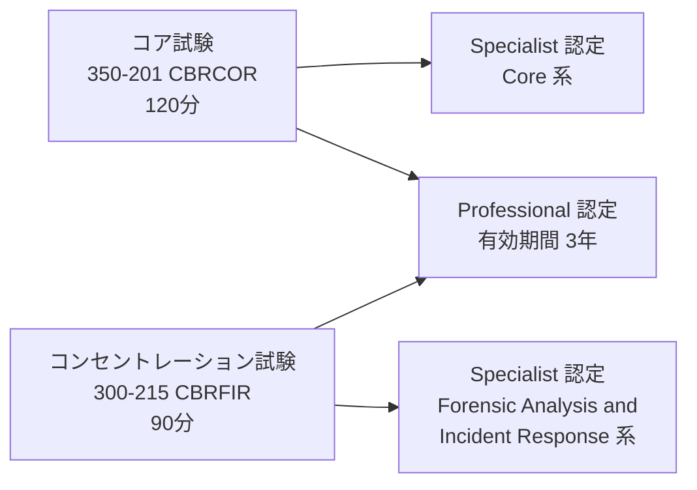

## 1.2 2つの試験の比較

| 項目 | 350-201 CBRCOR（コア） | 300-215 CBRFIR（コンセントレーション） |
|---|---|---|
| 正式名称（v1.2） | Performing Cybersecurity Using Cisco Security Technologies | Conducting Forensic Analysis and Incident Response Using Cisco Technologies for Cybersecurity |
| 試験時間 | 120 分 | 90 分 |
| 試験言語（日本ページ記載） | 英語 | 英語 |
| 出題の中心 | コアなセキュリティ運用（基礎・手法・プロセス・自動化） | フォレンジック分析とインシデント対応 |
| ドメイン構成 | 基礎20% / 手法30% / プロセス30% / 自動化20% | 基礎20% / フォレンジック手法20% / IR手法30% / フォレンジックプロセス15% / IRプロセス15% |
| 受験予約 | ピアソン VUE | ピアソン VUE |

### ドメイン配分の可視化

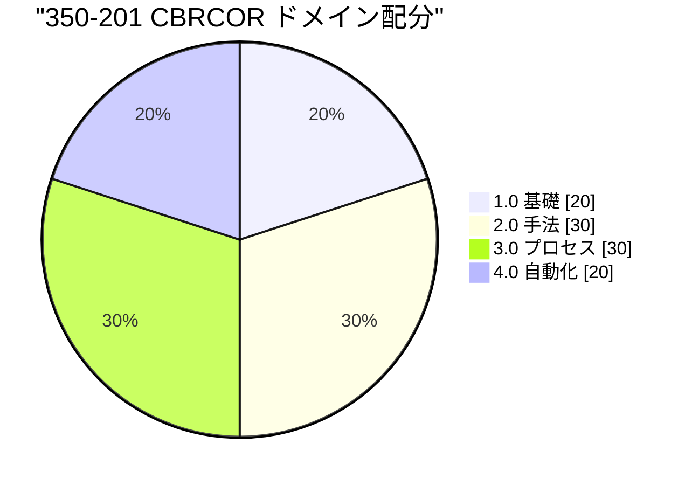

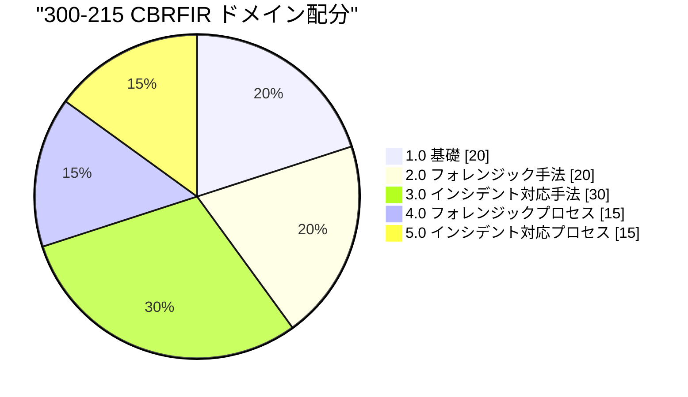

## 1.3 認定名称・試験名称の整理

公式資料の間で名称が揺れているため、混乱しないよう整理します。

| 時期・資料 | 名称 | 備考 |
|---|---|---|
| 日本語の認定ページ（本ガイドの出発点） | Cisco Certified CyberOps Professional | ページ上の記述は旧情報（CBRCOR 研修の「2021年4月リリース予定」など）を含みます |
| 2025年1月21日以降（Cisco ブループリントの記載） | Cybersecurity Professional | Cisco のブループリント文書に「CyberOps Professional の名称が変更される」旨の記載があります |
| 試験ブループリント v1.2（日本語 PDF） | CCNP Cybersecurity 認定に関連する試験 | 認定名の表記が資料により異なります |
| 試験名（350-201） | CyberOps → **Cybersecurity** | 旧: Performing CyberOps Using Core Security Technologies / 現: Performing Cybersecurity Using Cisco Security Technologies |

> **ポイント**: 試験番号（**350-201**、**300-215**）は共通です。検索・受験予約は試験番号で行うのが確実です。

**根拠・参考**
- Cisco 日本語 認定ページ: https://www.cisco.com/c/ja_jp/training-events/training-certifications/certifications/professional/cyberops-professional.html
- Cisco 350-201 ブループリント v1.2（英語・名称変更の記載）: https://learningcontent.cisco.com/documents/marketing/exam-topics/350-201-CBRCOR-v1.2_2024Oct01.pdf

## 1.4 受験条件・有効期間

| 項目 | 内容（日本語公式ページ） |
|---|---|
| 前提条件 | 正式な前提条件はなし |
| 推奨経験 | エンタープライズネットワークソリューションの実装経験 3〜5年 |
| 有効期間 | 3年間 |
| 再認定 | Cisco の再認定ポリシーに従う |

- 再認定ポリシー: https://www.cisco.com/c/ja_jp/training-events/training-certifications/recertification-policy.html

## 1.5 学習ロードマップ（初学者向け）

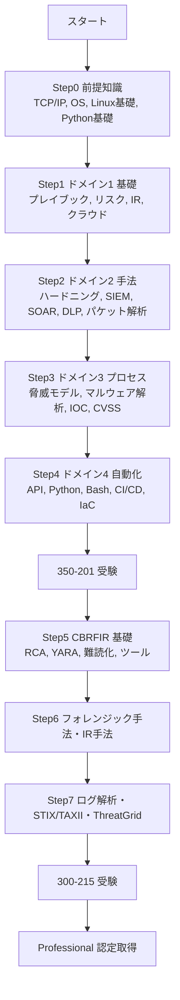

### 前提知識チェック

| 分野 | 最低限わかっておきたいこと |
|---|---|
| ネットワーク | TCP/UDP、DNS、HTTP/HTTPS、サブネット、VLAN、NAT |
| OS | Windows のイベントログ・レジストリ、Linux のコマンドライン・ログの場所 |
| セキュリティ基礎 | CIA（機密性・完全性・可用性）、認証と認可、暗号の基礎 |
| プログラミング | Python の基本（変数・ループ・関数・辞書・例外処理）、JSON の読み書き |
| 前段の資格 | CyberOps Associate（200-201 CBROPS）の内容は理解済みだとスムーズです |

---

# 第2部 コア試験 350-201 CBRCOR

試験の概要（公式）: コアなサイバーセキュリティ運用に関する知識を問う **120分** の試験。基礎・手法・プロセス・自動化を扱います。

---

## ドメイン1 基礎 (20%)

### 1.1 プレイブック内のコンポーネントの解釈

**ひとことで言うと**: プレイブックは「この事象が起きたら、誰が・何を・どの順で行うか」を書いた**対応手順書**です。

**やさしい解説**
- **ポリシー**（方針）は「何をすべきか」、**プレイブック**は「状況ごとの対応の流れ」、**ランブック**はより細かい「実行コマンドレベルの手順」を指すことが一般的です（組織により用法が異なります）。
- SOAR（後述）では、プレイブックを**自動実行できる形**（ワークフロー）で実装します。

**プレイブックの主な構成要素**

| 構成要素 | 役割 | 例 |
|---|---|---|
| 目的・適用範囲 | どの事象に使うか | 「フィッシングメール対応」 |
| トリガー（起動条件） | 開始のきっかけ | メール報告ボタン、SIEM アラート |
| 役割と責任 | 誰が何をするか | 一次分析担当、IR リード、法務 |
| 前提条件・必要ツール | 事前に必要な権限・ツール | EDR コンソール、サンドボックス |
| 手順（ステップ） | 検知・分析・封じ込め・根絶・復旧 | URL 評判確認 → 隔離 |
| 判断分岐 | 条件で処理が分かれる点 | 「悪性なら隔離、無害ならクローズ」 |
| エスカレーション基準 | 上位へ上げる条件 | 重要資産に影響がある場合 |
| コミュニケーション | 連絡先・報告タイミング | 経営層報告、規制当局への通知 |
| 証拠保全 | 何を保存するか | ログ、メール原本、メモリダンプ |
| 完了条件・事後対応 | 終了の定義と振り返り | チケットのクローズ、教訓の反映 |

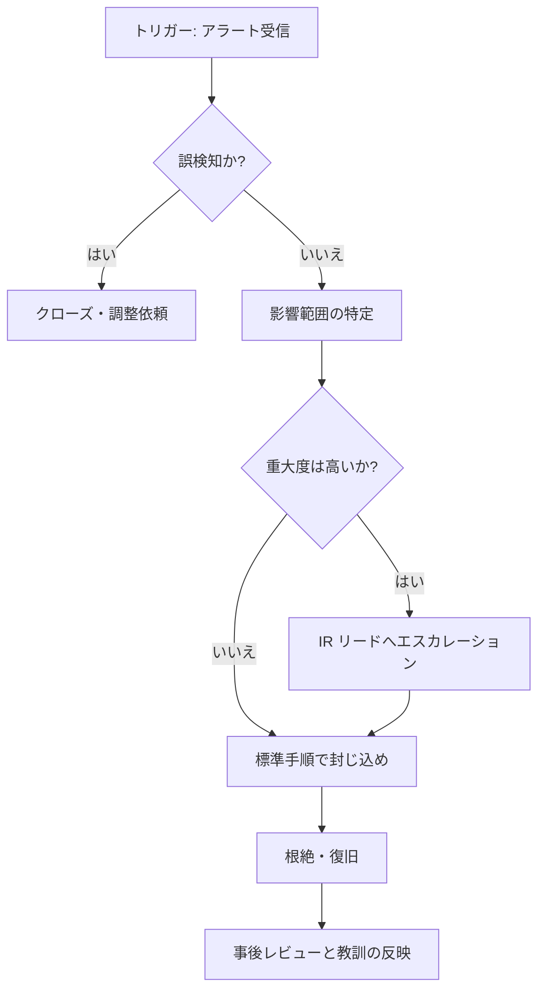

**ベストプラクティス**
1. **ひとつの事象に1つの目的**で書き、判断分岐を明記する。
2. **机上演習（テーブルトップ）** で定期的に検証し、改訂履歴を管理する。
3. 手順を MITRE ATT&CK の戦術・技術に紐付け、検知ルールとの対応を取る。
4. SOAR 化する際は、**破壊的アクション（隔離・削除）に人間の承認ステップ**を入れる。
5. 連絡先・権限の棚卸しを定期的に行う（古い連絡先が最大の落とし穴）。

**試験のコツ**: 「プレイブックの図やテキストを読み、足りない要素や正しい次の手順を選ぶ」形式を想定して、上の表の要素を言い換えられるようにしましょう。

**根拠・参考**
- NIST SP 800-61 Rev.3（インシデント対応の推奨事項）: https://csrc.nist.gov/pubs/sp/800/61/r3/final
- MITRE ATT&CK: https://attack.mitre.org/

---

### 1.2 プレイブックのシナリオに基づいた必要なツールの判断

**ひとことで言うと**: 事象の種類から「どのデータが必要か」を考え、そのデータを見せてくれるツールを選びます。

| シナリオ | 見たいデータ | 主なツール |
|---|---|---|
| フィッシング | メールヘッダー、URL、添付ファイル | メールセキュリティ、サンドボックス、URL 評判、SIEM |
| ランサムウェア | プロセス挙動、ファイル暗号化、横展開 | EDR（Secure Endpoint 等）、NDR、バックアップ |
| DDoS | トラフィック量、送信元分布 | NetFlow（Secure Network Analytics）、CDN/スクラビング、FW |
| 権限昇格 | 認証ログ、特権付与、プロセス | SIEM、EDR、IAM/PAM、AD 監査ログ |
| Web サイト改ざん | Web ログ、ファイル変更 | WAF、FIM（ファイル整合性監視）、Web サーバーログ |
| データ持ち出し | 大量送信、クラウド共有 | DLP、プロキシ、CASB、NDR |

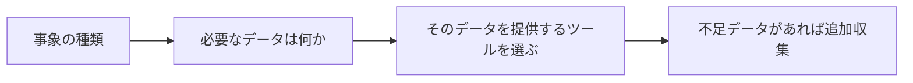

**ベストプラクティス**
- **ツールの目的別の分類**（検知・調査・封じ込め・復旧）を頭に入れておく。
- 「ツールが無い」場合は代替データ（例: EDR が無ければ Windows イベントログ＋Sysmon）を検討。
- ツール間の連携（SIEM ← EDR / FW / DNS）を前提に**データソースの網羅**を確認。

---

### 1.3 一般的なシナリオへのプレイブック適用

試験ブループリントでは、**不正な権限昇格、DoS/DDoS、Web サイト改ざん**が例示されています。

#### (A) 不正な権限昇格

| フェーズ | やること |
|---|---|
| 検知 | 特権グループへの追加、予期しない管理者ログオン（例: Windows イベント 4672、4728/4732）を検出 |
| 分析 | 誰が・どこから・どの方法で昇格したか（脆弱性悪用か資格情報窃取か） |
| 封じ込め | 該当アカウント無効化、セッション/トークン失効、該当端末の隔離 |
| 根絶 | 悪用された脆弱性のパッチ適用、バックドア・不正アカウントの除去 |
| 復旧 | 権限の棚卸し、MFA 強制、ログ監視強化 |
| 事後 | **最小権限の原則**の徹底、PAM 導入、監査頻度の見直し |

#### (B) DoS / DDoS

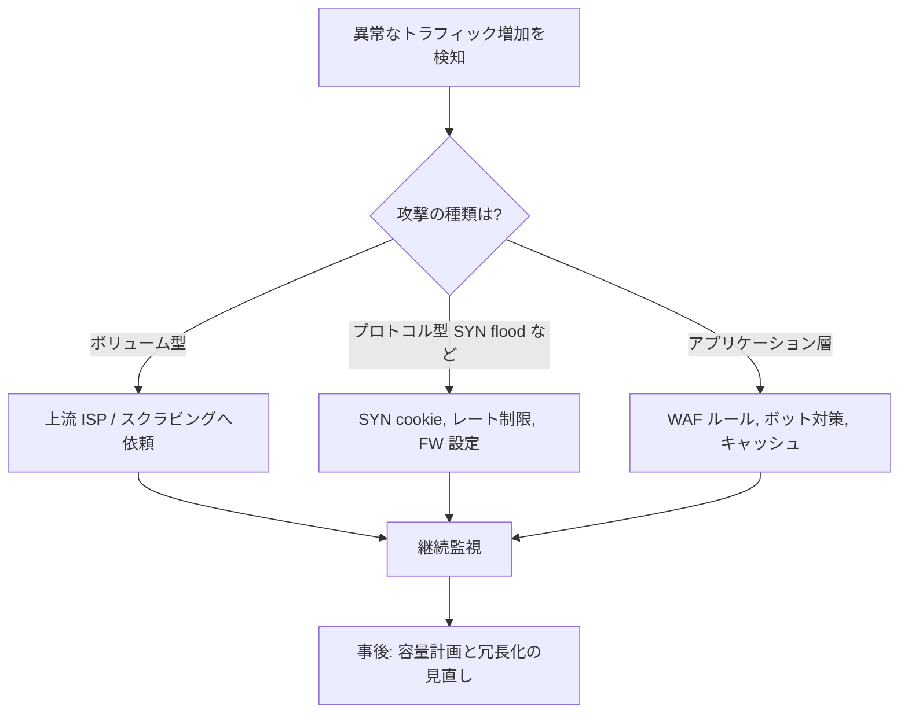

- ベストプラクティス: **事前に** ISP・CDN と連絡経路を確立し、通常時のトラフィックのベースラインを把握しておく。攻撃が始まってから契約するのは困難です。

#### (C) Web サイト改ざん（Defacement）

| ステップ | 内容 |
|---|---|
| 検知 | FIM のアラート、外部監視、利用者からの報告 |
| 証拠保全 | 改ざんされたページとサーバーのスナップショット、Web ログを保存 |
| 初期侵入経路の特定 | 脆弱な CMS/プラグイン、盗まれた管理者資格情報、アップロード機能 |
| 封じ込め | 一時的にサイトをメンテナンス表示、侵入口の遮断 |
| 復旧 | **クリーンなバックアップ**から復元、ウェブシェル検索、全資格情報のリセット |
| 再発防止 | WAF、パッチ管理、管理画面の IP 制限、ファイル書き込み権限の最小化 |

**試験のコツ**: 「最初にすべきことは何か」では、通常 **証拠保全・影響範囲の把握・封じ込め** の優先順位を問われます。むやみに再起動・再構築しないことがポイントです。

---

### 1.4 コンプライアンス規格と対象業界の推定

**ひとことで言うと**: 規格名を見て「どの業界・どのデータを守る規格か」を答えられるようにします。

| 規格・法令 | 主な対象 | 一言解説 |
|---|---|---|
| **PCI DSS** | カード決済データを扱うすべての事業者（小売・EC・決済・金融） | カード会員データ保護のための業界基準 |
| **FISMA** | 米国連邦政府機関とその委託事業者 | 連邦情報システムのセキュリティ管理を義務付ける法律 |
| **FedRAMP** | 米国連邦政府にクラウドサービスを提供する事業者 | クラウドの標準化されたセキュリティ認可プログラム |
| **SOC（SOC 1/2/3）** | サービス提供組織（SaaS、データセンター、委託先） | 内部統制の第三者保証報告書。SOC 2 は信頼性サービス基準が中心 |
| **SOX（サーベンス・オクスリー法）** | 米国上場企業 | 財務報告の内部統制（IT 統制を含む） |
| **GDPR** | EU 域内の個人データを扱う事業者（域外企業も該当しうる） | 個人データ保護規則。侵害は原則として**72時間以内**に監督機関へ通知 |
| **データプライバシー（例: HIPAA、日本の個人情報保護法）** | 医療・一般事業者など | 個人情報の取得・利用・漏えい対応のルール |
| **ISO/IEC 27001** | 業界を問わない | 情報セキュリティマネジメントシステム（ISMS）の国際規格 |

> **補足**: 日本語ブループリントには「ISO 27101」と記載されていますが、情報セキュリティ分野の代表的規格は **ISO/IEC 27001**（ISMS）です。筆者は誤記の可能性が高いと解釈していますが、試験では念のため原文の表記も意識してください。

**ベストプラクティス**
- 規格は「**どのデータ・どの業界に適用されるか**」と「**主な要求**（アクセス制御・暗号化・ログ・インシデント通知）」をセットで覚える。
- 複数規格に共通する要求（ログ保管、アクセス制御、変更管理）を**統合したコントロール**で運用すると効率的です。

**根拠・参考**
- PCI Security Standards Council: https://www.pcisecuritystandards.org/
- FedRAMP: https://www.fedramp.gov/
- GDPR 条文: https://gdpr-info.eu/
- ISO/IEC 27001: https://www.iso.org/standard/27001
- 個人情報保護委員会（日本）: https://www.ppc.go.jp/

---

### 1.5 サイバーリスク保険の目的

**ひとことで言うと**: セキュリティ対策を行っても残る**金銭的損失リスクを移転（Transfer）**するための保険です。

| 区分 | 補償される主な費用の例 |
|---|---|
| 第一者（自社の損害） | フォレンジック調査費用、復旧費用、事業中断による損失、恐喝対応、通知費用 |
| 第三者（他者への賠償） | 情報漏えいに伴う損害賠償、訴訟・法的対応費用、規制対応費用（保険可能な範囲） |

**リスク対応の4分類**

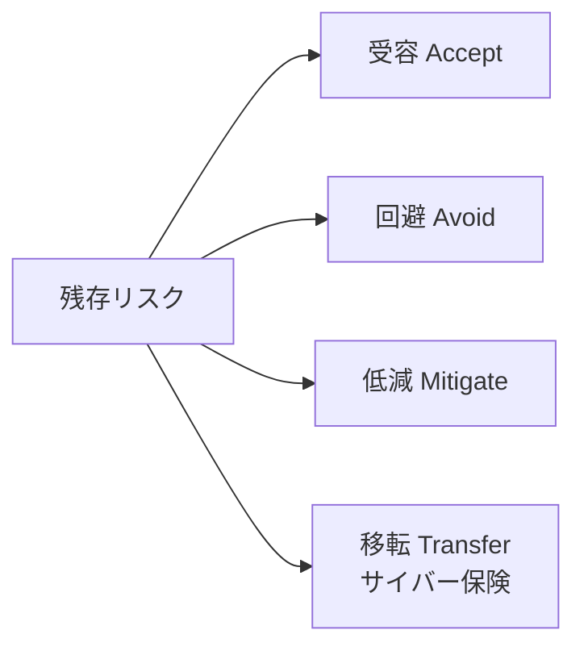

**ベストプラクティス**
- 保険は**セキュリティ対策の代替ではない**。保険会社は通常、MFA、EDR、バックアップ、パッチ管理、IR 計画などの実施状況を審査します。
- 免責事項（既知の未対応脆弱性、一部の戦争関連事由など）を契約前に確認する。
- 事故発生時の**連絡先・フォレンジック業者の指定**が契約に含まれるか確認する。

---

### 1.6 リスク分析の要素（資産・脆弱性・脅威）

**ひとことで言うと**: **リスク = 資産の価値 × 脅威の起こりやすさ × 脆弱性の突かれやすさ** を総合して考えます。

| 要素 | 説明 | 例 |
|---|---|---|
| 資産 | 守るべき価値のあるもの | 顧客データベース、基幹システム |
| 脅威 | 資産に害を与えうる原因 | ランサムウェア集団、内部不正 |
| 脆弱性 | 脅威に悪用されうる弱点 | 未パッチ、弱いパスワード |
| 影響（インパクト） | 被害の大きさ | 売上損失、信用失墜 |
| 可能性（ライクリフッド） | 発生しやすさ | 過去の発生頻度、攻撃の容易さ |

**定量分析の考え方**

| 用語 | 意味 | 計算 |
|---|---|---|
| SLE（単一損失予測額） | 1回の事故での損失額 | 資産価値 × 曝露係数 |
| ARO（年間発生率） | 1年あたりの発生回数 | 例: 0.5（2年に1回） |
| ALE（年間損失予測額） | 年間の期待損失 | SLE × ARO |

- 例: SLE が 1,000万円、ARO が 0.5 なら ALE は 500万円。対策費用が ALE を大きく超えるなら、費用対効果を再検討します。

**ベストプラクティス**
- **定性（高・中・低）** と **定量（金額）** を使い分ける。まず定性で優先度を付け、重要資産のみ定量化。
- リスク登録簿（Risk Register）に所有者・期限・対応方針を記録して**定期レビュー**。

**根拠・参考**
- NIST Cybersecurity Framework 2.0: https://www.nist.gov/cyberframework

---

### 1.7 インシデント対応のワークフローの適用

**ひとことで言うと**: 「準備 → 検知・分析 → 封じ込め・根絶・復旧 → 事後活動」の**ライフサイクル**を回します。

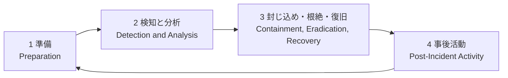

| フェーズ | 主な活動 |
|---|---|
| 準備 | IR 体制・手順整備、ツール導入、訓練、連絡網 |
| 検知と分析 | アラート確認、トリアージ、影響範囲の特定、重大度判定 |
| 封じ込め | 短期（隔離）と長期（恒久的な遮断）の2段階で拡大防止 |
| 根絶 | マルウェア削除、脆弱性修正、不正アカウント削除 |
| 復旧 | システム復元、監視強化、正常稼働の確認 |
| 事後活動 | 教訓の整理、レポート、プロセス改善 |

> **補足**: NIST SP 800-61 は 2025年4月に Rev.3 が公開され、**NIST CSF 2.0 の機能**（統治・識別・防御・検知・対応・復旧）に沿った形に整理されました。従来の4フェーズ（Rev.2）は多くの教材で今も基本モデルとして使われています。SANS の6段階（準備・特定・封じ込め・根絶・復旧・教訓）と対応させて覚えると実務でも役立ちます。

| NIST（従来の4フェーズ） | SANS（6段階） |
|---|---|
| 準備 | 準備 |
| 検知と分析 | 特定 |
| 封じ込め・根絶・復旧 | 封じ込め → 根絶 → 復旧 |
| 事後活動 | 教訓 |

**ベストプラクティス**
- **証拠保全を封じ込めより先**（または並行）に。揮発性の高い情報（メモリ、ネットワーク接続）は特に優先。
- 重大度（Severity）と優先度（Priority）を分けて定義。
- 「封じ込めで業務を止める判断」のために、**事前に業務部門と合意**しておく。

**根拠・参考**
- NIST SP 800-61 Rev.3: https://csrc.nist.gov/pubs/sp/800/61/r3/final
- JPCERT/CC（日本の CSIRT）: https://www.jpcert.or.jp/

---

### 1.8 インシデント対応メトリクスによる特徴と改善領域の説明

**ひとことで言うと**: 「時間」と「量」の指標で SOC の強み・弱みを読み解きます。

| 指標 | 意味 | 長い/高いときに疑うこと |
|---|---|---|
| **MTTD**（平均検知時間） | 侵害発生から検知までの時間 | ログ収集不足、検知ルール不足 |
| **MTTA**（平均確認時間） | アラートから担当者が着手するまで | 人員不足、アラート疲れ、優先度付けの不備 |
| **MTTC**（平均封じ込め時間） | 検知から封じ込めまで | 承認フローの遅れ、自動化不足 |
| **MTTR**（平均対応/復旧時間） | 対応や復旧が完了するまで（組織により定義が異なる） | 手順の不備、バックアップ不良 |
| **滞留時間（Dwell Time）** | 攻撃者が気付かれずに潜伏していた期間 | 検知能力全般の弱さ |
| 誤検知率 | アラートのうち誤りの割合 | ルール調整不足 |
| インシデント件数・種別 | 発生の傾向 | 特定の攻撃種別への備え不足 |
| 自動化率 | 自動処理されたアラートの割合 | 手作業が多すぎる |

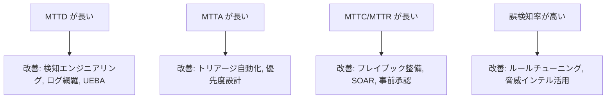

**ベストプラクティス**
- 指標の**開始時刻・終了時刻の定義を文書化**する（定義が曖昧だと比較できません）。
- 平均だけでなく**中央値・分布**も見る（外れ値の影響を避けるため）。
- 指標は**個人評価ではなくプロセス改善**に使う。

---

### 1.9 クラウド環境の種類の説明

**ひとことで言うと**: クラウドには「**配置モデル**」と「**サービスモデル**」の2つの切り口があります。

| 切り口 | 種類 | 説明 |
|---|---|---|
| 配置（デプロイ）モデル | パブリック | 事業者が複数顧客に提供 |
| | プライベート | 単一組織専用 |
| | ハイブリッド | オンプレとクラウドの組み合わせ |
| | コミュニティ | 共通目的の組織群で共有 |
| | マルチクラウド | 複数事業者のクラウドを併用（実務で一般的な概念） |
| サービスモデル | IaaS | 仮想サーバー・ネットワーク・ストレージを提供 |
| | PaaS | アプリ実行基盤・DB などを提供 |
| | SaaS | 完成したアプリを提供 |

**根拠・参考**
- NIST SP 800-145（クラウドの定義）: https://csrc.nist.gov/pubs/sp/800/145/final

---

### 1.10 クラウド（IaaS / PaaS）におけるセキュリティ運用上の考慮事項の比較

**ひとことで言うと**: **責任共有モデル**により、モデルが上位になるほど利用者が管理できる範囲は狭くなります。

| 管理対象 | オンプレ | IaaS | PaaS | SaaS |
|---|---|---|---|---|
| 物理・ハイパーバイザー | 利用者 | 事業者 | 事業者 | 事業者 |
| OS・パッチ | 利用者 | **利用者** | 事業者 | 事業者 |
| ミドルウェア・ランタイム | 利用者 | 利用者 | 事業者（設定は利用者） | 事業者 |
| アプリケーション | 利用者 | 利用者 | **利用者** | 事業者 |
| データ・ID・アクセス設定 | 利用者 | **利用者** | **利用者** | **利用者** |

| 観点 | IaaS | PaaS |
|---|---|---|
| ログ・可視性 | OS ログ・EDR エージェント・フローログを自前で収集可能 | OS へのアクセス不可。プラットフォームの監査ログ・アプリログが中心 |
| 脆弱性管理 | OS・ミドルウェアのパッチは利用者責任 | ランタイムの更新は事業者、**アプリの依存ライブラリは利用者** |
| フォレンジック | ディスクスナップショットの取得が可能 | 取得できる証拠が限られる。事前のログ有効化が必須 |
| 典型的な誤り | セキュリティグループの全開放、公開ストレージ | 過剰な IAM 権限、秘密情報のコード埋め込み |

**ベストプラクティス**
1. **IAM を最優先**で整備（最小権限、MFA、長期アクセスキーの廃止）。
2. クラウドの**監査ログ**（例: AWS CloudTrail、Azure Activity Log、Google Cloud Audit Logs）を全リージョン・全アカウントで有効化し、**改ざん不可の保管先**へ集約。
3. **CSPM**（クラウド設定の継続的チェック）で設定ミスを早期検出。
4. 一時的（エフェメラル）なリソースが多いため、**インシデント時に取得できるよう事前にスナップショット運用**を決める。

**根拠・参考**
- AWS 責任共有モデル: https://aws.amazon.com/compliance/shared-responsibility-model/
- NIST SP 800-145: https://csrc.nist.gov/pubs/sp/800/145/final

---

## ドメイン2 手法 (30%)

### 2.1 AI を活用したデータ分析手法の推奨

**ひとことで言うと**: 「何を知りたいか」に合わせて、**適切な機械学習の型**を選びます。

| 知りたいこと | 向いている手法 | セキュリティでの例 |
|---|---|---|
| ラベル付きデータで分類したい | 教師あり学習（分類） | マルウェア/正常の判定、フィッシングメール判定 |
| 数値を予測したい | 教師あり学習（回帰・時系列） | 通信量の予測、攻撃の発生見込み |
| 「いつもと違う」を見つけたい | 教師なし学習（異常検知・クラスタリング） | UEBA、未知の振る舞い検出 |
| 文章を扱いたい | 自然言語処理（LLM を含む） | 脅威レポートの要約、アラートの説明生成 |
| 関係性を調べたい | グラフ分析 | 攻撃インフラの関連付け |

**制約と注意点**

| リスク | 内容 | 対策 |
|---|---|---|
| 誤検知・見逃し | 精度は100%ではない | 人間によるレビューを組み込む（Human in the loop） |
| データドリフト | 環境の変化で精度が劣化 | 定期的な再学習・評価 |
| 敵対的攻撃 | 回避や汚染を狙われる | 多層防御、モデル入力の検証 |
| 説明可能性 | なぜ判定したか不明 | 根拠表示のあるツールを優先 |
| 情報漏えい | 機密を外部 AI に入力 | 利用ポリシーの策定、社内承認環境の利用 |

**ベストプラクティス**: AI の出力は**「証拠」ではなく「仮説・補助情報」**として扱い、重要な判断は元データで裏取りします。

**根拠・参考**
- NIST AI Risk Management Framework: https://www.nist.gov/itl/ai-risk-management-framework
- MITRE ATLAS（AI システムへの攻撃知識）: https://atlas.mitre.org/

---

### 2.2 セキュリティ強化されたマシンイメージを使用した展開

**ひとことで言うと**: 最初から安全な設定に固めた「**ゴールデンイメージ**」を作り、そこからサーバーを展開します。

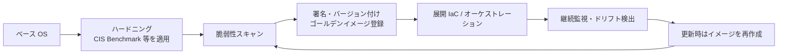

**ベストプラクティス**
1. 不要なパッケージ・サービス・アカウントを**最初から含めない**。
2. イメージ作成を **自動化**（例: Packer）し、手作業の差を排除。
3. **不変インフラ**: 稼働中サーバーにパッチを当てるのではなく、新しいイメージで置き換える。
4. イメージを**署名**し、信頼できるレジストリから取得する。
5. 秘密情報（パスワード、鍵）をイメージに焼き込まない。

**根拠・参考**
- CIS Benchmarks: https://www.cisecurity.org/cis-benchmarks
- NIST SP 800-190（コンテナセキュリティ）: https://csrc.nist.gov/pubs/sp/800/190/final

---

### 2.3 資産のセキュリティ態勢を評価するプロセス

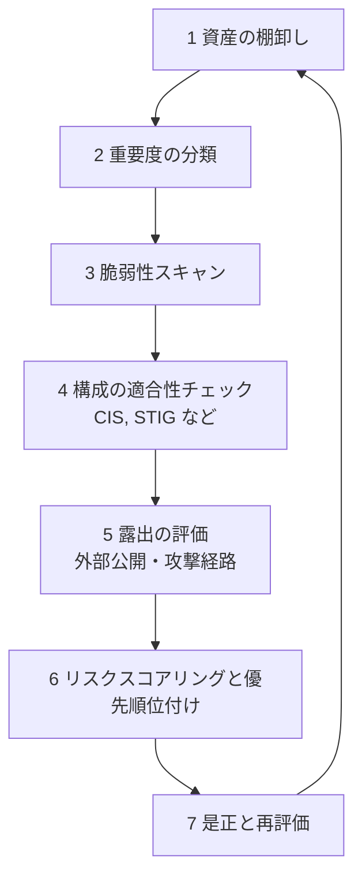

| 手順 | ポイント |
|---|---|
| 棚卸し | 「見えない資産（シャドー IT）」が最大のリスク。ネットワークスキャンとクラウド API で補完 |
| 分類 | 事業影響度（機密性・可用性）で重要度を決める |
| スキャン | 認証付きスキャンの方が精度が高い |
| 構成チェック | 標準ベースラインとの差分を自動測定 |
| 優先順位 | CVSS だけでなく**悪用状況と資産重要度**で決める（3.10 参照） |

---

### 2.4 セキュリティ管理の評価・ギャップ診断・改善提案

**コントロールの分類**

| 分類軸 | 種類 | 例 |
|---|---|---|
| 機能 | 予防 / 検知 / 是正 / 抑止 / 補完 | FW（予防）、SIEM（検知）、バックアップ復元（是正） |
| 性質 | 管理的 / 技術的 / 物理的 | ポリシー / 暗号化 / 施錠 |

**ギャップ診断の進め方**

1. 基準を決める（NIST CSF 2.0、CIS Controls、NIST SP 800-53、社内ポリシー）。
2. **現状（As-Is）** と **目標（To-Be）** を比較して差分を洗い出す。
3. 差分を**リスク**で優先順位付けする。
4. 改善案（技術・プロセス・人）と期限・責任者を決める。
5. **補完コントロール**（すぐに実装できない場合の代替策）も検討する。

**根拠・参考**
- CIS Critical Security Controls: https://www.cisecurity.org/controls
- NIST SP 800-53 Rev.5: https://csrc.nist.gov/pubs/sp/800/53/r5/upd1/final

---

### 2.5 システム強化のための業界標準・推奨リソース

| リソース | 提供元 | 用途 |
|---|---|---|
| CIS Benchmarks | CIS | OS・ミドルウェア・クラウドの具体的設定基準 |
| DISA STIG | 米国国防総省系 | 厳格な設定ガイド |
| NIST SP 800-123 | NIST | サーバーセキュリティの一般ガイド |
| NIST SP 800-53 | NIST | セキュリティ/プライバシー管理策のカタログ |
| OWASP ASVS / Top 10 | OWASP | Web アプリのセキュリティ要件 |
| ベンダーの強化ガイド | Cisco, Microsoft 等 | 製品固有の設定ガイド（Cisco の機器ハードニングガイドなど） |

**ベストプラクティス**: 業界標準を**そのまま全適用せず、業務要件に合わせて例外を文書化**する（例外には承認と期限を付ける）。

**根拠・参考**
- NIST SP 800-123: https://csrc.nist.gov/pubs/sp/800/123/final
- DISA STIG: https://public.cyber.mil/stigs/
- OWASP ASVS: https://owasp.org/www-project-application-security-verification-standard/

---

### 2.6 パッチ適用の推奨

**ひとことで言うと**: 「全部すぐ」ではなく、**悪用状況・資産の重要度・露出**で優先度を決めます。

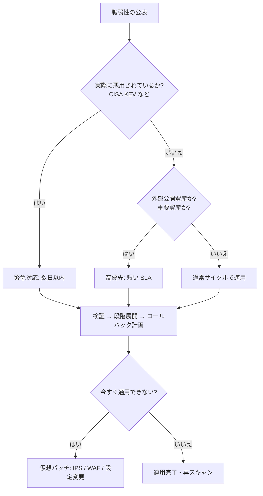

**ベストプラクティス**
- **テスト環境で検証 → 段階的展開（パイロット → 本番）→ ロールバック手順**。
- 資産を**メンテナンスグループ**に分け、サービス影響の少ない順に実施（NIST SP 800-40 Rev.4 の考え方）。
- 適用後に**再スキャン**して是正を確認する。

**根拠・参考**
- NIST SP 800-40 Rev.4: https://csrc.nist.gov/pubs/sp/800/40/r4/final
- CISA 既知の悪用された脆弱性（KEV）カタログ: https://www.cisa.gov/known-exploited-vulnerabilities-catalog

---

### 2.7 サービス無効化の推奨

**ひとことで言うと**: 使っていない機能は**攻撃面（アタックサーフェス）**になるので止めます（**最小機能の原則**）。

| 対象 | 無効化・対策の例 | 理由 |
|---|---|---|
| Telnet / FTP | SSH / SFTP へ置換 | 平文通信 |
| SMBv1 | 無効化 | 既知の重大な脆弱性の温床 |
| 未使用ポート・サービス | 停止・FW で遮断 | 攻撃経路の削減 |
| Cisco 機器の HTTP サーバー | `no ip http server`（不要な場合） | 管理面の露出削減 |
| 境界側での CDP/LLDP | 外部向けインターフェースで無効化 | 機器情報の漏えい防止 |
| 管理アクセス | `transport input ssh` で SSH のみに限定 | 平文プロトコルの排除 |

**手順**: ① 待受ポートを洗い出す（Linux の `ss -tulpn`、スキャナー）→ ② 依存関係を確認 → ③ 変更管理で停止 → ④ 監視して問題がないか確認 → ⑤ 設定をベースラインに反映。

---

### 2.8 ネットワークセグメンテーションの適用

**ひとことで言うと**: ネットワークを**ゾーンに分け、ゾーン間の通信を必要最小限**にして、侵害時の被害の広がりを抑えます。

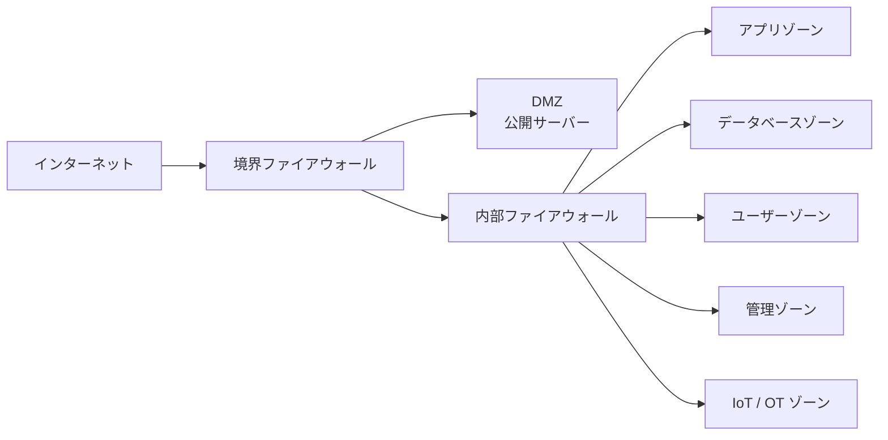

| 方式 | 説明 |
|---|---|
| VLAN + ACL | 基本的な論理分離 |
| ファイアウォール分離 | ゾーン間でステートフル検査・IPS |
| マイクロセグメンテーション | ワークロード単位の分離（例: Cisco Secure Workload） |
| ID ベース分離 | ユーザー・デバイスのタグ（SGT）で制御（Cisco ISE / TrustSec） |
| ゼロトラスト | 場所に依存せず、都度検証して最小権限を付与 |

**ベストプラクティス**
1. ゾーン間は **デフォルト拒否**、必要な通信のみ許可。
2. **管理プレーンを分離**し、踏み台（ジャンプホスト）経由に限定。
3. IoT/OT や来客用ネットワークは**業務ネットワークと分離**。
4. PCI DSS では、カード情報環境を分離することで**監査範囲を縮小**できる。

**根拠・参考**
- NIST SP 800-207（ゼロトラスト・アーキテクチャ）: https://csrc.nist.gov/pubs/sp/800/207/final

---

### 2.9 ネットワーク制御によるネットワークセキュリティの強化

| 層 | 制御 | 目的 |
|---|---|---|
| アクセス | 802.1X / NAC（Cisco ISE） | 認証されたデバイスのみ接続 |
| L2 | ポートセキュリティ、DHCP スヌーピング、DAI、IP ソースガード | 偽装・ARP スプーフィング対策 |
| L3 | ACL、uRPF | 不正パケットの遮断・送信元詐称防止 |
| 制御プレーン | CoPP | ルーター自体の保護 |
| 検査 | NGFW、IPS | 脅威の検出・遮断 |
| DNS/Web | DNS レイヤーセキュリティ（例: Cisco Umbrella） | 悪性ドメインへの接続防止 |
| 管理 | SSH、AAA（TACACS+）、SNMPv3、NTP 認証、ログ転送 | 安全な運用 |

**ベストプラクティス**: **単一の対策に頼らず多層防御（Defense in Depth）**。設定変更は必ず変更管理を通し、構成バックアップを取得します。

---

### 2.10 DevSecOps の推奨事項（影響）の判断

**ひとことで言うと**: セキュリティを開発の**最後ではなく最初から（シフトレフト）**組み込みます。

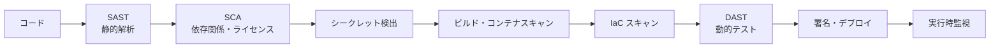

| 実践 | 影響（メリット） | 注意点（デメリット/コスト） |
|---|---|---|
| 自動セキュリティテスト | 早期に低コストで修正 | 誤検知の調整が必要 |
| パイプラインのゲート | 重大な脆弱性の混入防止 | ビルドが遅くなる、例外運用が必要 |
| SBOM（ソフトウェア部品表） | サプライチェーン可視化 | 運用負荷 |
| 開発者教育 | 根本的に品質向上 | 時間と文化の醸成が必要 |

**根拠・参考**
- NIST SP 800-218（SSDF）: https://csrc.nist.gov/pubs/sp/800/218/final
- OWASP DevSecOps Guideline: https://owasp.org/www-project-devsecops-guideline/

---

### 2.11 脅威インテリジェンスプラットフォーム（TIP）によるインテリジェンスの自動化

**ひとことで言うと**: 脅威情報を**集めて・整えて・評価して・各製品へ配る**ための基盤です。

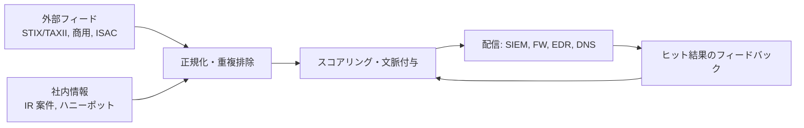

**ベストプラクティス**
1. IOC に**信頼度・有効期限**を付け、期限切れを自動で外す（古い IP のブロックは誤遮断の原因）。
2. **TLP**（共有範囲の表示）を守る。
3. 低信頼度の IOC は「ブロック」ではなく「アラート」から始める。
4. 配布後の**ヒット率**を測定して、有益なフィードを選別する。

**根拠・参考**
- NIST SP 800-150（サイバー脅威情報共有）: https://csrc.nist.gov/pubs/sp/800/150/final
- OASIS STIX/TAXII ドキュメント: https://oasis-open.github.io/cti-documentation/
- Cisco Talos: https://talosintelligence.com/

---

### 2.12 ツールを用いた AI 主導の脅威インテリジェンスの適用

| 用途 | AI の活用例 |
|---|---|
| レポートの要約 | 長い脅威レポートを要約し、要点・IOC を抽出 |
| エンティティ抽出 | 文章から IP・ハッシュ・マルウェア名を自動抽出 |
| ATT&CK マッピング | 記述された行動を技術 ID に対応付け |
| 優先順位付け | 悪用予測（EPSS など）で対応順を決定 |
| 調査支援 | XDR 内の AI アシスタントによるインシデントの説明・次の手順提案 |

**ベストプラクティス**
- **ハルシネーション（誤生成）**を前提に、IOC・CVE 番号などは必ず原典で確認。
- 機密データを外部 AI に入力しない。**プロンプトインジェクション**（文書内の悪意ある指示）にも注意。
- AI の提案による自動実行は、**承認フロー付き**で段階導入。

**根拠・参考**
- EPSS（悪用予測スコア）: https://www.first.org/epss/
- OWASP GenAI セキュリティ: https://genai.owasp.org/

---

### 2.13 データ損失・データ漏洩・移動中/使用中/保管中のデータ

**用語整理**

| 用語 | 意味 | 例 |
|---|---|---|
| データ損失（Data Loss） | データが失われ利用できなくなる | 誤削除、ランサムウェア、媒体紛失 |
| データ漏洩（Data Leakage） | 意図せず外部に露出する | 誤送信、公開設定ミス |
| データ持ち出し（Exfiltration） | 攻撃者などによる意図的な窃取 | C2 経由のアップロード |

**データの3つの状態と主な対策**

| 状態 | 説明 | 主な対策 |
|---|---|---|
| 保管中（At rest） | ディスク・DB・バックアップ上 | ディスク/DB 暗号化、アクセス制御、鍵管理 |
| 移動中（In motion/transit） | ネットワーク上 | TLS、VPN、メール暗号化 |
| 使用中（In use） | メモリ上・画面上・処理中 | エンドポイント制御、アクセス権、機密コンピューティング |

**ベストプラクティス**: まず**データ分類**（公開・社内・機密・極秘）を定義し、分類に応じた保護を決める。分類がなければ DLP は機能しません。

---

### 2.14 DLP 手法の検出と適用の仕組み

| 適用箇所 | 仕組みの例 | 主な機能 |
|---|---|---|
| **2.14.a ホスト** | エンドポイントエージェント | USB・クリップボード・印刷・スクリーンショットの制御 |
| **2.14.b ネットワーク** | プロキシ、メールゲートウェイ、TLS 検査 | 外向き通信の内容検査 |
| **2.14.c アプリケーション** | CASB、アプリ内ポリシー、フィールド暗号化 | SaaS・業務アプリ内での共有制限 |
| **2.14.d クラウド** | クラウドネイティブな機密データ検出、CASB | ストレージの公開設定・外部共有の検出 |

**検出手法**: ① パターン（正規表現、カード番号の Luhn チェック）、② ドキュメントのフィンガープリント/完全一致、③ 機械学習による分類、④ 分類ラベルの利用。

**ベストプラクティス（導入の流れ）**

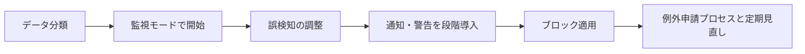

---

### 2.15 ルール・フィルタ・ポリシーの調整・設定変更の推奨

| 症状 | 原因の例 | 推奨する調整 |
|---|---|---|
| 誤検知が多い | しきい値が低い、正常業務を想定していない | 除外条件の追加、しきい値の見直し、文脈（資産重要度）の追加 |
| 見逃しがある | ルールが狭い、ログが不足 | 検知条件の拡張、ログソース追加 |
| 業務が止まる | ブロックが厳しすぎる | 検知のみ（モニターモード）へ変更し検証 |
| 古いルールが残る | 棚卸し不足 | 利用状況に基づく整理・無効化 |

**ベストプラクティス**
- 変更は**変更管理**を通し、**検証環境または検知のみモード**でテスト。
- 変更前後の効果（アラート数・検出率）を測定して記録。
- IPS シグネチャは**資産のOS・サービスに合うものだけ有効化**（不要な有効化は性能劣化と誤検知の原因）。

---

### 2.16 セキュリティデータ管理の概念

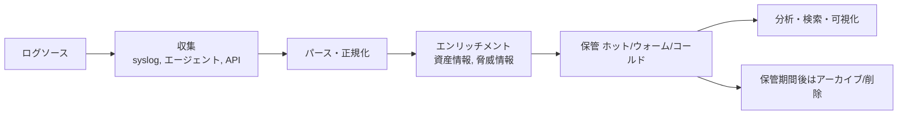

| 概念 | 内容 |
|---|---|
| 正規化 | 異なる形式を共通スキーマにそろえる（CEF、LEEF、ECS、OCSF など） |
| 時刻同期 | **NTP で全機器を同期**。相関分析の精度に直結 |
| 保持期間 | 規制・調査要件に基づき決定（ホット/ウォーム/コールドの階層化でコスト最適化） |
| 完全性 | ハッシュ、WORM ストレージで改ざん防止 |
| 個人情報 | ログ内の個人情報を最小化・マスキング |

**根拠・参考**
- NIST SP 800-92（ログ管理ガイド）: https://csrc.nist.gov/pubs/sp/800/92/final

---

### 2.17 SIEM ツールの使用と概念

**ひとことで言うと**: 様々なログを集め、**相関分析してアラートにする**ツールです。

| 機能 | 内容 |
|---|---|
| 収集・正規化 | 多様なログソースの取り込み |
| 相関ルール | 複数イベントの組み合わせで検知（例: 失敗ログイン連続後の成功） |
| ベースライン | 通常状態の学習と逸脱検出 |
| ダッシュボード・レポート | 可視化、コンプライアンス報告 |
| ケース/アラート管理 | トリアージ、調査支援 |

**検知ユースケースの例**

| ユースケース | 条件 |
|---|---|
| ブルートフォース | 同一送信元から短時間に多数の認証失敗 |
| 不可能な移動 | 短時間に地理的に離れた場所からのログオン |
| 特権アカウント作成 | 管理者グループへの追加イベント |
| ビーコニング | 外部ホストへの一定間隔の通信 |

**ベストプラクティス**
1. **ユースケース駆動**で導入する（ログを集めるだけでは意味がない）。
2. MITRE ATT&CK との**カバレッジ**を可視化し、不足を計画的に補う。
3. 検知ルールを**コードとして管理**（バージョン管理・テスト・レビュー）。
4. 重要ログソース（認証、DNS、プロキシ、EDR、クラウド監査）から優先的に取り込む。

---

### 2.18 SOAR ワークフローの推奨（問題の特定からエスカレーション・解決まで）

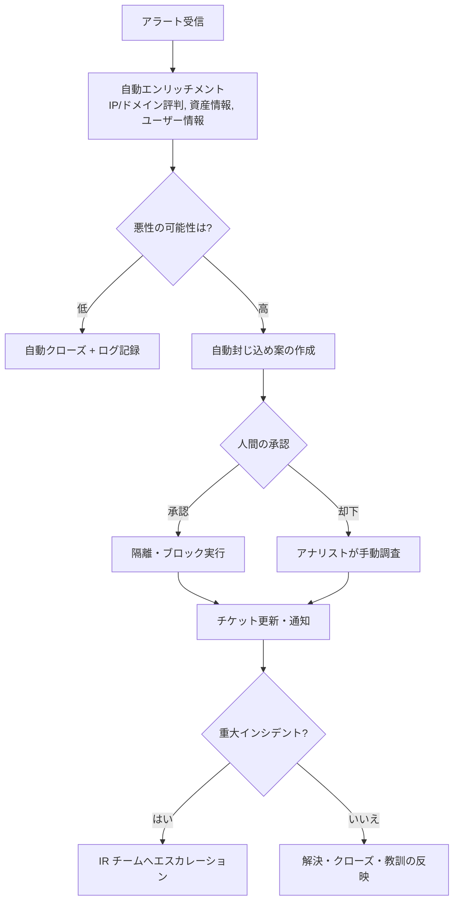

**ベストプラクティス**: 自動化は**可逆的で低リスクな処理**（情報取得・チケット作成）から開始し、**不可逆・業務影響が大きい処理は承認ゲート**を挟みます。

---

### 2.19 関係者向けダッシュボードデータの適用

| 対象者 | 見せたい内容 | 指標の例 | 頻度 |
|---|---|---|---|
| 技術者（アナリスト） | 運用状況 | アラートキュー、未対応件数、MTTA | リアルタイム |
| リーダー層 | 傾向と改善点 | MTTD/MTTR、誤検知率、脆弱性 SLA 達成率 | 週次・月次 |
| 経営陣 | ビジネスリスク | 主要リスクの変化、重大インシデントの影響、コンプライアンス状況 | 月次・四半期 |

**ベストプラクティス**: 相手の意思決定に必要な指標だけを**少なく**示し、専門用語を避け、**ビジネスへの影響**で語ります。

---

### 2.20 SIEM データを用いた UEBA

**ひとことで言うと**: ユーザーやデバイスの**「普段の行動」を学習**し、逸脱を検出します。

| 要素 | 内容 |
|---|---|
| 対象エンティティ | ユーザー、ホスト、サービスアカウント、アプリ |
| ベースライン | 時間帯、場所、アクセス先、データ量の通常パターン |
| ピアグループ比較 | 同じ役割の人と比べて異常か |
| リスクスコア | 複数の小さな異常を累積して優先順位付け |

**検出例**: 深夜の大量ファイルダウンロード、初めてのシステムへのアクセス、不可能な移動、退職予定者の大量データ送信。

**ベストプラクティス**: 学習期間を確保し、**文脈（出張・異動）を人事情報などと連携**して誤検知を減らします。

---

### 2.21 ユーザー行動アラートに基づく次のアクションの判断

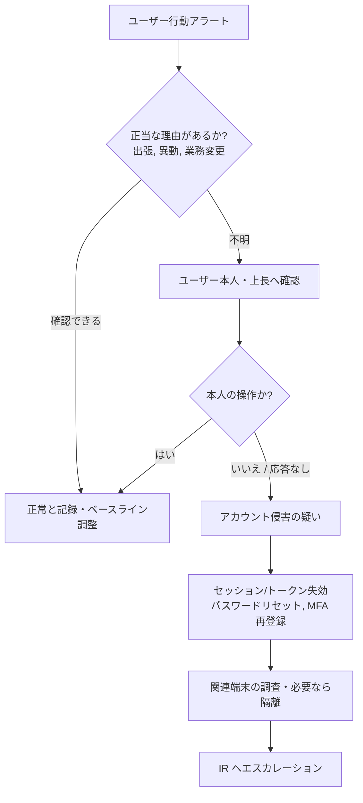

| アラートの種類 | 次のアクション例 |
|---|---|
| 不可能な移動 | 本人確認、セッション失効、MFA 強制 |
| 大量データのダウンロード | 内容確認、DLP ログ確認、上長・人事へ連絡 |
| 特権の不審な利用 | 即時エスカレーション、アカウント一時停止 |

---

### 2.22 ネットワーク分析ツールとその制限事項

| データ種類 | ツール例 | できること | 制限 |
|---|---|---|---|
| パケットキャプチャ | tcpdump、Wireshark、TShark | 全パケットの詳細解析 | 容量が大きい、暗号化通信の中身は不可 |
| フロー（メタデータ） | NetFlow/IPFIX（Secure Network Analytics） | 誰が誰とどれだけ通信したか | ペイロード（中身）はない。サンプリングの場合は欠落あり |
| ネットワーク解析基盤 | Zeek 等 | プロトコル別のログ生成 | 設置位置に依存 |
| ログ | FW、プロキシ、DNS | 接続の記録 | 取得項目はソース次第 |

**制限事項の整理**
- **暗号化（TLS 1.3 など）**: 中身は見えない。メタデータ（SNI、証明書、通信量・間隔）で補う。
- **SPAN ポートの取りこぼし**: 高負荷時にパケットが落ちる。TAP の利用を検討。
- **時刻のずれ**: 複数ソースの突き合わせに支障。
- **プライバシー・法令**: 取得範囲・保存期間のルールが必要。

---

### 2.23 パケットキャプチャファイル内のアーティファクトとストリームの評価

**Wireshark の基本操作と代表的なフィルター（表示フィルター）**

| 目的 | フィルター例 |
|---|---|
| 特定 IP | `ip.addr == 203.0.113.10` |
| TCP の接続開始のみ | `tcp.flags.syn == 1 && tcp.flags.ack == 0` |
| HTTP POST | `http.request.method == "POST"` |
| DNS の問い合わせ | `dns.qry.name contains "example"` |
| TLS Client Hello | `tls.handshake.type == 1` |

| 操作 | 用途 |
|---|---|
| Follow TCP Stream | 会話全体の流れを確認 |
| Export Objects（HTTP など） | 転送されたファイルを取り出し、ハッシュを算出 |
| Statistics → Conversations / Protocol Hierarchy | 通信の全体像、異常な通信先の発見 |

**怪しいパターン**

| パターン | 兆候 |
|---|---|
| ビーコニング | 一定間隔の短い通信を繰り返す |
| DNS トンネリング | 異常に長いサブドメイン、TXT レコードの多用 |
| データ持ち出し | 内部から外部への大量アップロード |
| C2 通信 | 不自然な User-Agent、まれな通信先、固定間隔 |

**ベストプラクティス**: 取り出したファイルは**隔離環境で扱い、ハッシュを記録**し、評判検索やサンドボックスへ回します。

**根拠・参考**
- Wireshark 表示フィルターリファレンス: https://www.wireshark.org/docs/dfref/
- Wireshark ユーザーガイド: https://www.wireshark.org/docs/wsug_html_chunked/

---

### 2.24 既存の検出ルールのトラブルシュート

```mermaid
flowchart TD
    S["検知ルールが期待どおり動かない"] --> Q{"症状は?"}
    Q -- "アラートが出ない" --> A1["1 ルールは有効か"]
    A1 --> A2["2 ログは届いているか<br/>ログソース, 遅延"]
    A2 --> A3["3 パースされているか<br/>フィールド名の不一致"]
    A3 --> A4["4 条件式は正しいか<br/>大文字小文字, 範囲, 時間窓"]
    A4 --> A5["5 しきい値は適切か"]
    Q -- "アラートが多すぎる" --> B1["1 条件が広すぎないか"]
    B1 --> B2["2 正常な業務の除外設定"]
    B2 --> B3["3 しきい値・時間窓の調整"]
    B3 --> B4["4 資産重要度で優先順位付け"]
```

**Snort ルールの基本構造（例）**

```text
alert tcp $EXTERNAL_NET any -> $HOME_NET 80 (msg:"Example suspicious request"; flow:to_server,established; content:"/admin"; http_uri; sid:1000001; rev:1;)
```

| 要素 | 意味 |
|---|---|
| アクション（alert） | 検出時の動作 |
| プロトコル・送信元・宛先 | 対象通信 |
| オプション（msg, content など） | 一致条件とメッセージ |
| sid / rev | ルール ID と改訂番号（ローカルルールは 1,000,000 以上が慣例） |

**ベストプラクティス**: ルールは**テストデータ（既知の攻撃再現）で動作確認**してから本番投入し、変更履歴を残します。

---

### 2.25 攻撃の戦術・技術・手順（TTP）の判断

**ひとことで言うと**: 観測した行動を **MITRE ATT&CK** の言葉で整理します。

| 用語 | 意味 | 例 |
|---|---|---|
| 戦術（Tactic） | 攻撃者の目的（Why） | 初期アクセス、永続化 |
| 技術（Technique） | 目的を達成する方法（How） | フィッシング（T1566） |
| 手順（Procedure） | 具体的な実行方法 | 特定の攻撃グループによるマクロ付き文書の使用 |

**ATT&CK Enterprise の14戦術**

| 順 | 戦術 | 順 | 戦術 |
|---|---|---|---|
| 1 | 偵察 | 8 | 認証情報アクセス |
| 2 | リソース開発 | 9 | 探索 |
| 3 | 初期アクセス | 10 | 横展開 |
| 4 | 実行 | 11 | 収集 |
| 5 | 永続化 | 12 | C2（コマンド&コントロール） |
| 6 | 権限昇格 | 13 | 持ち出し |
| 7 | 防御回避 | 14 | 影響 |

**観測内容と技術 ID の対応例**

| 観測された行動 | 技術 ID |
|---|---|
| 悪意あるメール添付・リンク | T1566 |
| PowerShell の不審な実行 | T1059.001 |
| 正規アカウントの悪用 | T1078 |
| 認証情報のダンプ | T1003 |
| リモートサービスで横展開 | T1021 |
| ファイル暗号化（ランサムウェア） | T1486 |
| 公開アプリの脆弱性悪用 | T1190 |
| ログの削除 | T1070 |

**苦痛のピラミッド（Pyramid of Pain）**: ハッシュや IP は攻撃者にとって変更が容易で、**TTP は変更が最も難しい**。そのため TTP ベースの検知は効果が高い、という考え方です。

**根拠・参考**
- MITRE ATT&CK: https://attack.mitre.org/
- Pyramid of Pain（David Bianco）: https://detect-respond.blogspot.com/2013/03/the-pyramid-of-pain.html
- MITRE D3FEND（防御技術の体系）: https://d3fend.mitre.org/

---

## ドメイン3 プロセス (30%)

### 3.1 脅威モデルの構成要素の分析

**ひとことで言うと**: 設計段階で「**何を守り、どこが狙われ、どう防ぐか**」を整理する作業です。

**脅威モデリングの4つの問い**
1. 何に取り組んでいるか（対象システムの理解）
2. 何がうまくいかなくなる可能性があるか（脅威の洗い出し）
3. それに対して何をするか（対策）
4. 十分に対応できたか（検証）

| 構成要素 | 内容 |
|---|---|
| 資産 | 守る対象（データ、機能） |
| エントリーポイント | 外部からの入口（API、ログイン画面） |
| 信頼境界 | 権限・信頼度が変わる境目 |
| データフロー図（DFD） | データの流れを可視化したもの |
| 脅威 | STRIDE 等で洗い出す |
| 緩和策 | 脅威への対策 |

**STRIDE 分類**

| 頭文字 | 脅威 | 侵害される性質 | 対策の例 |
|---|---|---|---|
| S | なりすまし（Spoofing） | 認証 | MFA、証明書 |
| T | 改ざん（Tampering） | 完全性 | 署名、ハッシュ |
| R | 否認（Repudiation） | 否認防止 | 監査ログ |
| I | 情報漏えい（Information disclosure） | 機密性 | 暗号化、アクセス制御 |
| D | サービス拒否（Denial of service） | 可用性 | レート制限、冗長化 |
| E | 権限昇格（Elevation of privilege） | 認可 | 最小権限 |

**ベストプラクティス**: 脅威モデルは**一度作って終わりではなく**、設計変更・新機能追加のたびに更新します。

---

### 3.2 一般的なタイプのケースを調査する手順の判断

```mermaid
flowchart TD
    A["受付: 事象の報告"] --> B["範囲と重大度の初期判断"]
    B --> C["証拠の収集・保全"]
    C --> D["分析: 時系列の再構築"]
    D --> E["仮説の立案と検証"]
    E --> F{"原因・影響は特定できたか?"}
    F -- "いいえ" --> C
    F -- "はい" --> G["封じ込め・是正の推奨"]
    G --> H["報告書の作成・共有"]
```

| ケース | 主なデータソース | 重点確認事項 |
|---|---|---|
| フィッシング | メールヘッダー、ゲートウェイログ、プロキシ | 受信者数、クリック有無、入力された資格情報 |
| マルウェア感染 | EDR、プロセスログ、サンドボックス | 感染経路、永続化、横展開 |
| アカウント侵害 | 認証ログ、VPN/クラウドログ | 不審なログイン元、設定変更 |
| 内部不正 | DLP、アクセスログ、HR 情報 | 大量アクセス、時間帯、退職予定 |
| Web アプリ攻撃 | Web/WAF ログ、アプリログ | 攻撃パターン、侵害の有無 |
| 情報漏えい | 通信ログ、クラウド監査ログ | 漏えいデータの種類・件数 |

**ベストプラクティス**: 調査は**事実（観測）と推測を区別して記録**し、**時刻は UTC に統一**します。

---

### 3.3 マルウェア分析プロセスの概念と一連の手順

```mermaid
flowchart TD
    A["3.3.a 分析対象サンプルの抽出・特定<br/>PCAP, 端末, メール"] --> B["ハッシュ計算・評判確認"]
    B --> C["3.3.e 静的解析"]
    C --> D["3.3.c 動的解析 サンドボックス"]
    D --> E{"3.3.d 追加の静的解析が必要か?"}
    E -- "はい" --> F["3.3.b リバースエンジニアリング"]
    E -- "いいえ" --> G["3.3.f 結果の取りまとめ・共有"]
    F --> G
```

| 段階 | 内容 | 主なツール/観点 |
|---|---|---|
| 抽出（3.3.a） | パケットキャプチャやメールからファイルを取り出す | Wireshark の Export Objects、メール添付 |
| 静的解析（3.3.e） | 実行せずに調べる | ハッシュ、文字列、PE ヘッダー、インポート関数、エントロピー |
| 動的解析（3.3.c） | 隔離環境で実行して挙動を観察 | プロセス、ファイル・レジストリ変更、通信（Secure Malware Analytics など） |
| 追加の静的解析が必要か（3.3.d） | 動的解析で得られない情報がある場合 | サンドボックス回避、時間待機、特定条件でのみ動作する場合 |
| リバースエンジニアリング（3.3.b） | 逆アセンブル・デバッグでコードを理解 | Ghidra など |
| 報告・共有（3.3.f） | IOC、挙動、推奨対策をまとめる | YARA ルール、STIX 形式 |

**サンドボックスで追加の静的解析が必要となる典型例**
- 仮想環境を検知すると動作を止める（アンチサンドボックス）。
- 一定時間後・特定日時・特定言語環境でのみ動作する。
- C2 サーバーが停止していて挙動が見えない。

**ベストプラクティス**
1. **隔離された分析ラボ**（本番ネットワークから分離、スナップショット運用）で実施。
2. 実サンプルを扱う際は**拡張子を無害化**して保管し、誤実行を防止。
3. IOC は共有時に**デファング**（`example[.]com` など）して誤クリックを防ぐ。
4. 共有範囲は **TLP** に従う。

---

### 3.4 トラフィックパターンの AI 予測分析に基づく攻撃イベントの解釈

**ひとことで言うと**: AI が示した**異常の時系列**を、攻撃の段階（キルチェーン）に当てはめて理解します。

**サイバーキルチェーン（7段階）**

| 段階 | 内容 | トラフィック上の兆候 |
|---|---|---|
| 1 偵察 | 標的の調査 | ポートスキャン、DNS 問い合わせの増加 |
| 2 武器化 | 攻撃コードの準備 | （攻撃者側のため通常は観測不可） |
| 3 配送 | メール・Web で届ける | 不審なメール、悪性サイトへのアクセス |
| 4 エクスプロイト | 脆弱性の悪用 | IPS アラート、異常なプロセス実行 |
| 5 インストール | 永続化 | 新規サービス・スケジュールタスク |
| 6 C2 | 遠隔操作の確立 | ビーコニング、不審な外部通信 |
| 7 目的の実行 | 横展開・持ち出し・暗号化 | 内部への大量通信、大量アップロード |

```mermaid
flowchart LR
    A["AI が異常を検知<br/>通信量・間隔・宛先"] --> B["ATT&CK / キルチェーンへマッピング"]
    B --> C["前後のイベントを時系列で結合"]
    C --> D["攻撃の段階と次の一手を推定"]
    D --> E["封じ込めと検知強化"]
```

**注意点**: AI 予測は**確率的**なので、元のログで裏取りし、誤検知の可能性を考慮します。

---

### 3.5 さまざまなプラットフォームにおける潜在的なエンドポイント侵入の調査

| プラットフォーム | 主な証拠と確認ポイント |
|---|---|
| **Windows** | イベントログ（4624 ログオン成功、4625 失敗、4688 プロセス作成、4672 特権、4720 アカウント作成、7045 サービス作成、1102 ログ消去）、Run キー、スケジュールタスク、Prefetch、Amcache |
| **Linux** | `/var/log/auth.log` または `/var/log/secure`、cron、`~/.ssh/authorized_keys`、`.bash_history`、systemd ユニット |
| **macOS** | 統合ログ、LaunchAgents/LaunchDaemons、構成プロファイル |
| **モバイル** | MDM のコンプライアンス状態、不審アプリ、OS の改変（ルート化/脱獄）、証明書プロファイル |
| **IoT** | ファームウェアバージョン、初期認証情報、通信先の異常（機器内での調査が難しいためネットワーク観測が中心） |

```mermaid
flowchart TD
    A["侵入の疑い"] --> B["端末の種類を特定"]
    B --> C["揮発性データを優先して保全<br/>メモリ, 接続, プロセス"]
    C --> D["永続化箇所・認証ログ・実行履歴の確認"]
    D --> E["横展開の痕跡を他端末で確認"]
    E --> F["隔離・復旧の判断"]
```

**ベストプラクティス**: 端末の種類ごとに**調査用チェックリスト**を事前に作成し、EDR で遠隔収集できる範囲を把握しておきます。

---

### 3.6 既知の侵害の指標（IOC）と攻撃の指標（IOA）

| 項目 | IOC（Indicator of Compromise） | IOA（Indicator of Attack） |
|---|---|---|
| 視点 | **事後的**：侵害の証拠 | **進行中**：攻撃者の意図・行動 |
| 例 | 悪性ハッシュ、C2 の IP/ドメイン、レジストリキー | Office からの PowerShell 起動、LSASS メモリへのアクセス |
| 利点 | 検知が明確で共有しやすい | 未知のマルウェアにも有効 |
| 欠点 | 攻撃者が容易に変更できる | 誤検知の調整が必要 |

**ベストプラクティス**: IOC（早期のブロック）と IOA（行動ベース検知）を**組み合わせて**使います。

---

### 3.7 サンドボックス環境での IOC の判断（複雑な指標の生成を含む）

**手順**
1. サンドボックスレポートから **ハッシュ、ドロップされたファイル、ミューテックス名、レジストリ、通信先、プロセスツリー**を抽出。
2. 単独の指標（例: ドメイン）だけでなく、**複数条件を組み合わせた複合指標**を作成。
3. YARA、Snort、Sigma、STIX パターンなど、用途に合う形式に変換。
4. **正常なソフトウェアで誤検知しないか**を検証して配布。

**STIX パターン（複合指標）の例**

```text
[file:hashes.'SHA-256' = 'EXAMPLE_HASH_VALUE'] OR [domain-name:value = 'malicious.example.com']
```

**ベストプラクティス**: 複合指標は**精度（誤検知の少なさ）**を重視し、有効期限と信頼度を付与します。

---

### 3.8 データ損失を調査するための手順（クラウド・エンドポイント・サーバー・DB・アプリ）

| 環境 | 確認する主なログ・観点 |
|---|---|
| クラウド | 監査ログ（誰がどのデータにアクセス・共有したか）、ストレージの公開設定、IAM の変更 |
| エンドポイント | USB 接続履歴、EDR のファイル操作、クラウド同期クライアント、印刷ログ |
| サーバー | 認証ログ、ファイルアクセス監査、大量の外向き通信 |
| データベース | 監査ログ・クエリログ（大量 SELECT、ダンプ）、特権の変更 |
| アプリケーション | API ログ、エクスポート機能の利用、トークンの不審な使用 |

```mermaid
flowchart TD
    A["データ損失の疑い"] --> B["損失データの種類・分類・範囲を特定"]
    B --> C["各環境のログを収集"]
    C --> D["誰が・いつ・どこへ・どの経路で を再構築"]
    D --> E["封じ込め: 共有停止, トークン失効, 経路遮断"]
    E --> F["法令・契約上の通知要否の判断"]
```

---

### 3.9 脆弱性の問題に対処するための一般的な緩和策

```mermaid
flowchart TD
    V["脆弱性を確認"] --> P{"パッチは利用可能か?"}
    P -- "はい" --> A["パッチ適用"]
    P -- "いいえ" --> B{"代替策はあるか?"}
    B --> C["仮想パッチ IPS / WAF"]
    B --> D["設定変更・機能の無効化"]
    B --> E["ネットワーク分離・アクセス制限"]
    B --> F["監視強化"]
    B --> G["リスク受容 期限付き承認"]
```

| 緩和策 | 使いどころ |
|---|---|
| パッチ/アップグレード | 根本対策。最優先 |
| 仮想パッチ | 本体の修正が間に合わない場合（WAF/IPS で攻撃を遮断） |
| 設定変更・機能無効化 | 脆弱な機能が不要な場合 |
| 分離・アクセス制限 | 修正できないレガシー資産 |
| 監視強化 | 補完として併用 |
| リスク受容 | 例外承認と**見直し期限**が必須 |

---

### 3.10 脆弱性トリアージとリスク分析（CVSS など）

**CVSS（共通脆弱性評価システム）**

| 重大度 | スコア |
|---|---|
| なし | 0.0 |
| 低 | 0.1〜3.9 |
| 中 | 4.0〜6.9 |
| 高 | 7.0〜8.9 |
| 緊急 | 9.0〜10.0 |

| バージョン | 主な基本評価項目 |
|---|---|
| CVSS v3.1 | 攻撃元区分（AV）、攻撃条件の複雑さ（AC）、必要な特権（PR）、利用者の関与（UI）、スコープ（S）、機密性・完全性・可用性への影響（C/I/A） |
| CVSS v4.0 | 上記に加え、攻撃要件（AT）、後続システムへの影響などが追加。「基本（B）」だけでなく脅威（T）・環境（E）を加味したスコアの表記を使う |

**ベクトルの読み方（例: v3.1）**: `CVSS:3.1/AV:N/AC:L/PR:N/UI:N/S:U/C:H/I:H/A:H` は、ネットワーク経由・低複雑度・特権不要・利用者操作不要で、機密性・完全性・可用性が高く損なわれる脆弱性で、基本スコアは 9.8（緊急）です。

**CVSS だけに頼らないための補助指標**

| 指標 | 内容 |
|---|---|
| EPSS | 今後30日以内に悪用される確率の予測 |
| CISA KEV | 実際に悪用が確認された脆弱性の一覧 |
| 資産の重要度・露出 | インターネット公開か、機密データを扱うか |
| 補完コントロールの有無 | WAF などで既に緩和されているか |

```mermaid
flowchart TD
    A["脆弱性"] --> B{"KEV に掲載 / 悪用が確認?"}
    B -- "はい" --> U["最優先"]
    B -- "いいえ" --> C{"CVSS 高以上 かつ 外部公開 または 重要資産?"}
    C -- "はい" --> H["高優先"]
    C -- "いいえ" --> D{"EPSS が高い?"}
    D -- "はい" --> H
    D -- "いいえ" --> N["通常対応"]
```

**根拠・参考**
- FIRST CVSS: https://www.first.org/cvss/
- FIRST EPSS: https://www.first.org/epss/
- CISA KEV: https://www.cisa.gov/known-exploited-vulnerabilities-catalog

---

## ドメイン4 自動化 (20%)

### 4.1 SOAR の概念、プラットフォーム、メカニズムの比較

| 用語 | 意味 |
|---|---|
| 自動化（Automation） | 単一タスクを人手なしで実行（例: IP 評判の自動取得） |
| オーケストレーション（Orchestration） | 複数ツール・タスクを連携させた一連のワークフロー |
| レスポンス | 封じ込め・修復などの対応アクション |
| SOAR | 上記を統合し、ケース管理や人の承認も含めて運用する基盤 |

| 比較軸 | SIEM | SOAR | XDR |
|---|---|---|---|
| 主目的 | ログの収集・相関・検知 | 対応の自動化・調整 | 複数領域（エンドポイント・ネットワーク・メール等）の検知と対応の統合 |
| 入力 | ログ | アラート・ケース | 各製品のテレメトリ |
| 出力 | アラート | 実行結果・チケット更新 | 相関済みインシデント・対応操作 |

**SOAR の主な仕組み**

| 仕組み | 説明 |
|---|---|
| 連携（コネクタ/インテグレーション） | 各ツールの API を呼び出す部品 |
| ワークフロー/プレイブック | 条件分岐を含む処理手順 |
| トリガー | Webhook、スケジュール、アラート受信 |
| 承認ステップ | 人間の確認を挟む |
| ケース管理 | 調査記録・証拠・担当者の管理 |

> Cisco XDR にも自動化・オーケストレーションのワークフロー機能があります（旧 SecureX のオーケストレーションの流れを汲む）。製品名・機能は更新されるため、最新の公式ドキュメントで確認してください。

---

### 4.2 基本的なスクリプト（Python など）の解釈

次のスクリプトを**1行ずつ読む**練習をします。

```python
import requests

API = "https://api.example.com/v1/alerts"
HEADERS = {"Authorization": "Bearer EXAMPLE_TOKEN"}

resp = requests.get(API, headers=HEADERS, params={"severity": "high"}, timeout=10)
resp.raise_for_status()

for alert in resp.json()["items"]:
    if alert["status"] == "open":
        print(alert["id"], alert["src_ip"])
```

| 行 | 意味 |
|---|---|
| `import requests` | HTTP 通信のライブラリを読み込む |
| `API`, `HEADERS` | 接続先 URL と認証ヘッダー（Bearer トークン） |
| `requests.get(...)` | GET リクエスト。`params` は URL の `?severity=high` に相当。`timeout=10` は10秒で打ち切り |
| `raise_for_status()` | 4xx/5xx の場合は例外を発生させる |
| `resp.json()["items"]` | 応答の本文を JSON として解析し `items` を取り出す |
| `for ... if ...` | 取り出した各アラートのうち `open` のものの ID と送信元 IP を表示 |

**読み取りのコツ**: ① 何に接続するか ② 認証方法 ③ どんなデータを取得・加工するか ④ 出力先、の順に追います。

---

### 4.3 セキュリティ運用タスクの自動化（指定されたスクリプトの修正）

**修正の典型パターン**

| 修正内容 | 例 |
|---|---|
| エンドポイント/パラメータの変更 | `severity` を `critical` に変更 |
| ページネーション対応 | 次ページのトークンがある間、繰り返し取得 |
| エラー処理の追加 | `try/except`、タイムアウト、リトライ |
| ログ出力 | `print` を `logging` に置き換え |
| 秘密情報の外出し | トークンを環境変数から取得 |

**改良版の例（環境変数・エラー処理・リトライ）**

```python
import os
import time
import requests

API = "https://api.example.com/v1/alerts"
TOKEN = os.environ["EXAMPLE_API_TOKEN"]  # コードに秘密情報を書かない
HEADERS = {"Authorization": f"Bearer {TOKEN}"}

def fetch_alerts(max_retries=3):
    for attempt in range(max_retries):
        try:
            resp = requests.get(API, headers=HEADERS, timeout=10)
            if resp.status_code == 429:  # レート制限
                wait = int(resp.headers.get("Retry-After", 2 ** attempt))
                time.sleep(wait)
                continue
            resp.raise_for_status()
            return resp.json()["items"]
        except requests.exceptions.RequestException as e:
            print(f"request failed: {e}")
            time.sleep(2 ** attempt)
    return []
```

**ベストプラクティス**: 自動化スクリプトは**冪等（何度実行しても結果が同じ）**にし、**最初はドライラン（実行せず結果だけ表示）**で検証します。

---

### 4.4 一般的なデータ形式（JSON、HTML、CSV、XML など）

同じデータを4つの形式で表すと次のとおりです。

| 形式 | 例 | 特徴 |
|---|---|---|
| JSON | `{"ip": "203.0.113.5", "score": 90}` | API で最も一般的。入れ子・配列を表現可能 |
| XML | `<alert><ip>203.0.113.5</ip><score>90</score></alert>` | タグ構造。古いシステム・SOAP で使用 |
| CSV | `ip,score` の次の行に `203.0.113.5,90` | 表形式。区切り文字・引用符の扱いに注意 |
| YAML | `ip: 203.0.113.5` と `score: 90` | 設定ファイルで多用（インデントが意味を持つ） |
| HTML | `<td>203.0.113.5</td>` | Web ページ用。データ交換には不向き |

**Python での読み込み**

```python
import json, csv

data = json.loads('{"ip": "203.0.113.5", "score": 90}')
print(data["ip"])

with open("alerts.csv", newline="", encoding="utf-8") as f:
    for row in csv.DictReader(f):
        print(row["ip"], row["score"])
```

**セキュリティ上の注意**: XML は **XXE（外部エンティティ攻撃）**に注意し、パーサーの外部エンティティ解決を無効化します。

---

### 4.5 SOAR プラットフォーム内での自動化・オーケストレーション・機械学習の機会

| タスク | 自動化の適性 | 備考 |
|---|---|---|
| IP/ドメイン/ハッシュの評判照会 | 高 | 低リスクで効果大 |
| フィッシングメールのトリアージ | 高 | 抽出・サンドボックス・判定まで自動化可能 |
| チケット作成・通知 | 高 | 人手の転記作業を削減 |
| ブロックリストへの追加 | 中 | 誤遮断リスクのため承認を推奨 |
| 端末の隔離 | 中 | 業務影響があるため条件付き・承認付き |
| アカウント停止 | 中〜低 | 業務影響が大きく承認必須 |
| 重大インシデントの最終判断 | 低 | 人間が判断 |

**機械学習の活用機会**: アラートの優先順位付け、類似インシデントの推薦、フィッシング分類、異常検知。

**自動化レベルの考え方**: 手動 → 情報収集のみ自動 → 提案付き（承認制）→ 自動実行（監視付き）。

---

### 4.6 API を使う際の制約（レート制限、タイムアウト、ペイロード）

| 制約 | 内容 | 対処 |
|---|---|---|
| レート制限 | 単位時間あたりの呼び出し上限（超過は HTTP 429） | `Retry-After` を尊重、**指数バックオフ＋ジッター** |
| タイムアウト | 応答待ちの上限 | 接続/読み取りのタイムアウトを明示し、再試行を設計 |
| ペイロードサイズ | 1リクエストの上限（超過は 413 など） | 分割送信、バッチ処理 |
| ページネーション | 一度に返す件数の上限 | 次ページを繰り返し取得 |
| クォータ | 日・月単位の利用上限 | 取得対象の絞り込み、キャッシュ |

**指数バックオフの考え方**: 失敗するたびに待ち時間を 1秒 → 2秒 → 4秒 のように倍にし、ランダムな揺らぎ（ジッター）を加えて、多数のクライアントが同時に再試行する集中を避けます。

---

### 4.7 REST API に関連する一般的な HTTP レスポンスコード

| コード | 意味 | 対処の考え方 |
|---|---|---|
| 200 OK | 成功 | 結果を処理 |
| 201 Created | 作成成功 | `Location` ヘッダーを確認 |
| 202 Accepted | 受理（非同期処理中） | 完了を後で確認 |
| 204 No Content | 成功・本文なし | 削除成功などで使用 |
| 301/302 | リダイレクト | `Location` へ再リクエスト |
| 304 Not Modified | 変更なし（キャッシュ利用） | キャッシュを使用 |
| 400 Bad Request | リクエスト不正 | パラメータ・形式を修正（再試行しても無駄） |
| 401 Unauthorized | **認証**が必要・失敗 | 認証情報・トークン期限を確認 |
| 403 Forbidden | **認可**されていない | 権限（スコープ）を確認 |
| 404 Not Found | リソースなし | URL・ID を確認 |
| 405 Method Not Allowed | メソッド不可 | GET/POST などを見直す |
| 409 Conflict | 競合 | 状態を確認して再実行 |
| 415 Unsupported Media Type | 形式非対応 | `Content-Type` を修正 |
| 422 Unprocessable Entity | 構文は正しいが内容が不正 | 値の検証 |
| 429 Too Many Requests | レート制限超過 | `Retry-After` に従い待機 |
| 500 Internal Server Error | サーバー内部エラー | 一時的なら再試行、継続なら提供元へ |
| 502/503/504 | ゲートウェイ/サービス停止/タイムアウト | バックオフ付きで再試行 |

> **覚え方**: 2xx は成功、3xx は転送、**4xx はクライアント側の問題（原則リトライしても直らない。ただし 429 は待てば再試行可）**、5xx はサーバー側の問題（再試行が有効な場合がある）。

**根拠・参考**
- RFC 9110（HTTP Semantics）: https://www.rfc-editor.org/rfc/rfc9110
- RFC 6585（429 Too Many Requests）: https://www.rfc-editor.org/rfc/rfc6585

---

### 4.8 HTTP レスポンスの構成要素（コード、ヘッダー、本文）の評価

```http
HTTP/1.1 200 OK
Content-Type: application/json
Content-Length: 58
Cache-Control: no-store
Strict-Transport-Security: max-age=31536000

{"items": [{"id": "a1", "status": "open"}]}
```

| 構成要素 | 内容 | 評価のポイント |
|---|---|---|
| ステータスライン | プロトコル・コード・理由句 | 成功か失敗かを最初に判断 |
| ヘッダー | メタデータ | `Content-Type`（形式の確認）、`Retry-After`、`Location`、`Set-Cookie`、`WWW-Authenticate` |
| 本文（ボディ） | 実際のデータ | JSON として解析し必須項目を確認、エラー時は詳細メッセージを確認 |

**セキュリティ関連ヘッダー**: `Strict-Transport-Security`（HTTPS を強制）、`Content-Security-Policy`、`X-Content-Type-Options` など。

---

### 4.9 API 認証メカニズム（ベーシック、カスタムトークン、API キー）

| 方式 | 仕組み | リクエスト例 | 注意点 |
|---|---|---|---|
| ベーシック認証 | `ユーザー名:パスワード` を Base64 エンコードして送信 | `Authorization: Basic <base64>` | **Base64 は暗号化ではない**。必ず TLS で使用 |
| カスタムトークン（Bearer 等） | 認証サーバーで取得した（有効期限付き）トークンを送信 | `Authorization: Bearer <token>` | 期限・スコープの管理、更新（リフレッシュ） |
| API キー | 固定の鍵文字列で呼び出し元を識別 | `X-API-Key: <key>`（ヘッダー名は製品により異なる） | 漏えい時の影響が大きい。ローテーションが必要 |

```mermaid
flowchart LR
    A["クライアント"] --> B["認証サーバーへ資格情報 / クライアント ID を送信"]
    B --> C["アクセストークン発行 有効期限付き"]
    C --> D["API へトークン付きで要求"]
    D --> E["API が検証して応答"]
```

**ベストプラクティス**
1. 秘密情報は**シークレット管理基盤・環境変数**に保管し、**ソースコード・Git に含めない**。
2. **最小権限のスコープ**を割り当てる。
3. **定期的にローテーション**し、漏えい時は即時失効。
4. ログに認証ヘッダーを出力しない。

**根拠・参考**
- OWASP API Security Top 10: https://owasp.org/API-Security/

---

### 4.10 Bash コマンドの活用（ファイル管理、ディレクトリ操作、環境変数）

| 分類 | コマンド | 用途 |
|---|---|---|
| ディレクトリ | `pwd`, `cd`, `ls -la`, `mkdir -p` | 位置確認・移動・一覧・作成 |
| ファイル | `cp`, `mv`, `rm`, `touch`, `cat`, `head`, `tail -f` | コピー・移動・削除・作成・閲覧 |
| 検索 | `find`, `grep` | ファイル/内容の検索 |
| 権限 | `chmod`, `chown` | 権限・所有者の変更 |
| 環境変数 | `export VAR=value`, `echo "$VAR"`, `env`, `printenv` | 変数の設定・参照 |
| テキスト処理 | `awk`, `sed`, `cut`, `sort`, `uniq -c`, `wc -l` | ログの集計・加工 |
| 通信 | `curl`, `jq` | API 呼び出しと JSON 処理 |

**実践例 1: 認証失敗の多い送信元 IP の上位を集計（Linux の SSH ログ）**

```bash
grep "Failed password" /var/log/auth.log | awk '{print $(NF-3)}' | sort | uniq -c | sort -nr | head
```

**実践例 2: API を呼び、JSON から項目を抽出**

```bash
curl -s -H "Authorization: Bearer $EXAMPLE_API_TOKEN" "https://api.example.com/v1/alerts" | jq -r '.items[].id'
```

**ベストプラクティス**
- スクリプトの先頭に `set -euo pipefail` を置き、**エラーで止める**。
- 変数は **常にダブルクォートで囲む**（`"$VAR"`）。
- `rm -rf` を変数と組み合わせる場合は、変数が空でないか**必ず検証**する。
- トークンを**コマンド履歴に残さない**（環境変数・ファイルから読み込む）。

---

### 4.11 CI/CD パイプラインの構成要素

```mermaid
flowchart LR
    A["ソース管理<br/>Git"] --> B["ビルド"]
    B --> C["自動テスト<br/>単体・結合・セキュリティ"]
    C --> D["成果物の保管<br/>レジストリ"]
    D --> E["デプロイ ステージング"]
    E --> F{"承認ゲート"}
    F --> G["本番デプロイ"]
    G --> H["監視・フィードバック"]
```

| 要素 | 説明 |
|---|---|
| CI（継続的インテグレーション） | コード変更のたびに自動でビルド・テスト |
| CD（継続的デリバリー/デプロイ） | 検証済みの成果物を自動でリリース可能な状態に/本番へ展開 |
| パイプライン定義 | YAML などで「コードとして」管理 |
| ランナー/エージェント | ジョブを実行する環境 |
| シークレット管理 | 認証情報を安全に注入 |

**パイプライン定義の例（汎用的な YAML）**

```yaml
stages: [build, test, security, deploy]

security_scan:
  stage: security
  script:
    - run-sast-scan
    - run-dependency-scan
    - run-secret-scan
  allow_failure: false   # 重大な指摘があればパイプラインを止める
```

**ベストプラクティス**: ランナーの権限を最小化し、**シークレットをログに出さない**こと、**ブランチ保護とレビュー必須化**、**成果物の署名**を徹底します。

---

### 4.12 DevOps プラクティスの原則の適用

| 原則 | 説明 | セキュリティ運用での応用 |
|---|---|---|
| 自動化 | 繰り返し作業を自動化 | 検知・対応の自動化 |
| 継続的な改善 | 小さな変更を頻繁に | 検知ルールの継続的チューニング |
| 共有 | 開発と運用の協力 | SOC と開発・インフラの連携 |
| 計測 | 指標で判断 | MTTD/MTTR の測定 |
| フィードバック | 早く学ぶ | 事後レビュー（非難しない形式） |

**3つの道（The Three Ways）**: ① フロー（流れ）の最適化、② フィードバックの強化、③ 継続的な学習と実験。

**応用: Detection as Code**: 検知ルールを Git で管理し、テスト・レビュー・自動展開を行う運用です。

---

### 4.13 コードとしてのインフラストラクチャ（IaC）の原則

| 原則 | 説明 |
|---|---|
| 宣言的 | 「あるべき状態」を記述（例: Terraform） |
| 冪等性 | 何度適用しても同じ結果 |
| バージョン管理 | 変更履歴とレビューが可能 |
| 再現性 | 同じ環境を何度でも構築 |
| ドリフト検出 | 実環境と定義のズレを検出 |

**セキュアな IaC の例（Terraform: S3 バケットの公開をブロック）**

```hcl
resource "aws_s3_bucket" "logs" {
  bucket = "example-logs-bucket"
}

resource "aws_s3_bucket_public_access_block" "logs" {
  bucket                  = aws_s3_bucket.logs.id
  block_public_acls       = true
  block_public_policy     = true
  ignore_public_acls      = true
  restrict_public_buckets = true
}
```

**ベストプラクティス**
1. **IaC スキャン**（誤設定の事前検出）と **ポリシーアズコード**（例: OPA）でデプロイ前に違反を検出。
2. **状態ファイル（state）に秘密情報が含まれる**ため、暗号化・アクセス制限して保管。
3. 手動での設定変更を禁止し、**すべて IaC 経由**で変更する（ドリフト防止）。

---

# 第3部 コンセントレーション試験 300-215 CBRFIR

試験の概要（公式）: フォレンジック分析とインシデント対応の基礎・手法・プロセスに関する知識を問う **90分** の試験です。日本語公式ページでは、出題の柱として「インシデント対応のプロセスとプレイブック」「脅威インテリジェンス」「デジタルフォレンジックのコンセプト」「エビデンスの収集と分析」「リバースエンジニアリングの原理」などが挙げられています。

**デジタルフォレンジックの全体像**

```mermaid
flowchart LR
    A["特定<br/>何が証拠になるか"] --> B["保全<br/>改変せずに確保"]
    B --> C["収集<br/>複製の取得・ハッシュ"]
    C --> D["分析<br/>時系列・IOC・原因"]
    D --> E["報告<br/>再現可能な形でまとめる"]
```

**揮発性の順序（Order of Volatility）**: 失われやすいものから先に収集します（RFC 3227）。

| 順 | 証拠の種類 | 例 |
|---|---|---|
| 1 | CPU レジスタ・キャッシュ | （通常は取得困難） |
| 2 | メモリ | 実行中プロセス、暗号鍵、メモリ上のマルウェア |
| 3 | ネットワーク状態 | 接続一覧、ARP、ルーティングテーブル |
| 4 | プロセス・システム状態 | 実行中プロセス、ログオンセッション |
| 5 | ディスク | ファイル、ログ、レジストリ |
| 6 | リモートログ・監視データ | SIEM、NetFlow |
| 7 | 物理構成・アーカイブ | バックアップ、物理媒体 |

**根拠・参考**
- RFC 3227（証拠の収集と保管ガイドライン）: https://www.rfc-editor.org/rfc/rfc3227
- NIST SP 800-86（インシデント対応へのフォレンジック技術の統合）: https://csrc.nist.gov/pubs/sp/800/86/final
- Cisco 300-215 CBRFIR 試験ページ（日本語）: https://www.cisco.com/c/ja_jp/training-events/training-certifications/exams/current-list/300-215-cbrfir.html
- Cisco 300-215 ブループリント（日本語 PDF）: https://www.cisco.com/c/dam/global/ja_jp/training-events/training-certifications/exam-topics/300-215-cbrfir.pdf

---

## F1 基礎 (20%)

### F1.1 根本原因分析（RCA）レポートに必要なコンポーネント

**ひとことで言うと**: 「何が起き、**なぜ起き**、どう防ぐか」を事実に基づいて文書化したレポートです。

| 構成要素 | 内容 |
|---|---|
| エグゼクティブサマリー | 経営層向けの要約（影響・原因・対応状況） |
| 影響範囲 | 影響を受けた資産・データ・期間・ビジネスへの影響 |
| タイムライン | 初期侵入から検知・封じ込め・復旧までの時系列（UTC 統一） |
| 根本原因 | 直接原因と、その背後にある構造的原因 |
| 寄与要因 | 検知遅延や設定不備など、被害を拡大した要因 |
| 検知・対応の評価 | うまくいった点・改善点（MTTD/MTTR など） |
| 証拠一覧 | ログ・ディスクイメージ・ハッシュ・保管場所（証拠の連続性） |
| 是正・再発防止策 | 担当者・期限付きの対策 |
| IOC・付録 | 共有可能な指標、技術的詳細 |

**根本原因の分析手法**: 「**なぜなぜ分析（5 Whys）**」、特性要因図（フィッシュボーン）。

**ベストプラクティス**
- **事実・推測・結論を分けて**書く。
- 個人の責任追及ではなく、**仕組み（プロセス・技術）の改善**に焦点を当てる（非難しない事後レビュー）。
- 対策には**担当者・期限・効果測定方法**を付ける。

---

### F1.2 インフラストラクチャ・ネットワークデバイスのフォレンジック分析

**ひとことで言うと**: ルーター・スイッチ・ファイアウォールも侵害されます。**再起動せずに揮発情報から先に採取**します。

```mermaid
flowchart TD
    A["デバイスの侵害の疑い"] --> B["作業記録の開始<br/>日時・担当者・実施コマンド"]
    B --> C["揮発性情報の採取<br/>実行中構成, ログ, セッション, ARP/MAC, ルーティング"]
    C --> D["不揮発性情報の採取<br/>起動構成, イメージ, フラッシュ内ファイル"]
    D --> E["イメージ・構成の完全性検証"]
    E --> F["ログ・NetFlow・AAA 履歴の相関"]
    F --> G["不正な変更・アカウント・トンネルなどの特定"]
    G --> H["封じ込め・復旧・再構築"]
```

**Cisco IOS 系機器で確認する代表的なコマンド（例）**

| 目的 | コマンドの例 |
|---|---|
| 実行中構成 | `show running-config` |
| 起動構成 | `show startup-config` |
| 稼働時間・バージョン | `show version` |
| ログ | `show logging` |
| ログインユーザー | `show users` |
| ルーティング | `show ip route` |
| ARP / MAC テーブル | `show arp`、`show mac address-table` |
| プロセス・CPU | `show processes cpu sorted` |
| サポート情報一括 | `show tech-support` |
| イメージの完全性 | `verify /md5 flash:<イメージ名>`（公式のハッシュと比較） |

**確認すべき不審点**: 未知のユーザーや特権レベルの設定、ACL・NAT・ルーティングの不正変更、GRE などのトンネル、SNMP コミュニティ、埋め込みパケットキャプチャ、不明な構成の差分。

**ベストプラクティス**
- **再起動・電源断をしない**（揮発情報が失われる）。
- 平常時から**構成バックアップ、NTP、syslog 集約、AAA ログ**を整備し、「正常時の基準」を保持する。
- イメージは**公式ハッシュと照合**し、侵害が疑われる場合は**クリーンなイメージで再構築**。

**根拠・参考**
- Cisco ネットワークセキュリティ対策（Cisco セキュリティガイダンス）: https://sec.cloudapps.cisco.com/security/center/resources/security_best_practices.html
- Cisco Guide to Harden Cisco IOS Devices: https://www.cisco.com/c/en/us/support/docs/ip/access-lists/13608-21.html

---

### F1.3 アンチフォレンジックの戦術・技術・手順

**ひとことで言うと**: 攻撃者が**証拠を消す・隠す・妨げる**ための行為です。

| カテゴリ | 具体例 | ATT&CK 技術（参考） |
|---|---|---|
| ログ改ざん・消去 | イベントログの削除（Windows イベント 1102）、ログ停止 | T1070 / T1562 |
| タイムスタンプ改変 | ファイルの作成・更新時刻を偽装（タイムストンプ） | T1070.006 |
| データ破棄 | 上書き消去ツール、シャドウコピー削除 | T1485 / T1490 |
| 隠蔽 | NTFS 代替データストリーム、ステガノグラフィ、暗号化コンテナ | T1564 |
| 難読化 | パッキング、Base64、XOR | T1027 |
| 検知回避 | 正規ツールの悪用（Living off the Land）、ファイルレス実行 | T1218 など |
| 痕跡の撹乱 | VPN/Tor/プロキシ経由、位置情報の偽装 | T1090 |
| 分析妨害 | アンチ VM/サンドボックス、デバッガ検知 | T1497 |

**対策の観点**

| 対策 | 効果 |
|---|---|
| ログのリモート転送（WORM） | 端末上のログを消されても残る |
| ファイル整合性監視（FIM） | 改ざんの検知 |
| メモリフォレンジック | ディスク上に痕跡がない攻撃を発見 |
| EDR のテレメトリ | 端末外にもイベント履歴を保持 |
| 「ログが無い」こと自体を異常とみなす | ログの空白期間・シーケンス欠落は重要な手掛かり |

---

### F1.4 エンコーディングおよび難読化の手法

| 手法 | 説明 | 見分け方・対処 |
|---|---|---|
| Base64 | バイナリを64文字で表現するエンコーディング（暗号ではない） | 英数字と `+`, `/`、末尾が `=` で終わることが多い |
| 16進（Hex）エンコード | 各バイトを2桁の16進数で表現 | `0-9a-f` のみで構成 |
| URL エンコード | `%XX` 形式 | Web ログで多用される |
| XOR | 単純な鍵との排他的論理和 | 単一バイト鍵ならブルートフォース可能 |
| パッキング | 実行ファイルを圧縮・暗号化して包む | 高エントロピー、インポート関数が少ない |
| **ポリモーフィック** | 暗号化・復号部分を毎回変え、**本体の機能は同じ** | シグネチャ回避。復号後の挙動で検知 |
| **メタモーフィック** | コード自体を毎回**書き換える**（復号部を持たない） | 検知が非常に困難。挙動分析が重要 |

**Python による解読の例（無害な文字列）**

```python
import base64

encoded = "SGVsbG8gQ3liZXJPcHM="
print(base64.b64decode(encoded).decode())        # Hello CyberOps

hexstr = "48656c6c6f"
print(bytes.fromhex(hexstr).decode())              # Hello

def xor_decode(data: bytes, key: int) -> bytes:
    return bytes(b ^ key for b in data)

cipher = xor_decode(b"Hello", 0x41)                # 暗号化（XOR は同じ操作で復号）
print(xor_decode(cipher, 0x41))                    # b'Hello'
```

> **補足**: Windows PowerShell の `-EncodedCommand` は **UTF-16LE の Base64** です。デコード時は文字コードに注意します。

**ベストプラクティス**: 難読化は**何層も重ねられる**ため、「1層デコードして終わり」にせず、**復号結果が平文になるまで繰り返し**ます。実行はせず、必ず**隔離環境**で扱います。

---

### F1.5 YARA ルール（基本）の使用と特徴

**ひとことで言うと**: ファイルやメモリを「**文字列やバイト列のパターン**」で分類する、マルウェア識別用のルール言語です。

**ルールの基本構造（例: 無害なデモ用）**

```text
rule Demo_Suspicious_Downloader
{
    meta:
        author      = "analyst"
        description = "Demo rule: PE file containing suspicious strings"
        date        = "2026-10-05"

    strings:
        $s1 = "example-c2.test" ascii wide nocase
        $s2 = { 6A 40 68 00 30 00 00 }
        $re = /https?:\/\/[a-z0-9\.\-]+\/gate\.php/

    condition:
        uint16(0) == 0x5A4D and filesize < 2MB and (2 of ($s*) or $re)
}
```

| セクション | 説明 |
|---|---|
| `meta` | 作者・説明・日付・参照など（検索や管理に有用） |
| `strings` | テキスト（`ascii`, `wide`, `nocase`, `fullword` の修飾子）、16進バイト列（`{ ... }`）、正規表現 |
| `condition` | 一致条件。`uint16(0) == 0x5A4D` は先頭が「MZ」（PE ファイル）、`2 of ($s*)` は2つ以上一致、`filesize` でサイズ制限 |

**実行例**: `yara -r rules.yar /path/to/scan`（`-r` は再帰的に検索）

**ベストプラクティス**
1. **ありふれた文字列だけで判定しない**（誤検知の原因）。複数の特徴を組み合わせる。
2. **正常ファイル群（グッドウェア）でテスト**して誤検知を確認する。
3. 先頭バイトやサイズなど、**軽い条件を先に書き**て性能を確保。
4. `meta` に説明・参照・バージョンを記載し、**命名規則とバージョン管理**を徹底。

**根拠・参考**
- YARA 公式ドキュメント: https://yara.readthedocs.io/

---

### F1.6 DFIR で使用するツールの役割

| 分類 | 代表ツール | 役割 |
|---|---|---|
| **Hex エディタ** | HxD、Hiew、Hexfiend | バイナリを16進で直接確認・編集（ファイルシグネチャ確認、埋め込みデータの発見） |
| **逆アセンブラ・デバッガ** | Ghidra、Radare2、Evans Debugger（edb） | 実行ファイルのコード解析・ステップ実行 |
| **難読化解除ツール** | XORBruteForcer、xortool、アンパッカー（UPX など） | XOR 鍵の推定、パッカーの展開 |
| **メモリフォレンジック** | Volatility など | メモリダンプからプロセス・接続・注入コードを抽出 |

| ツール | 主な使いどころ |
|---|---|
| Hex エディタ | ヘッダー（例: PE の `MZ`、ELF の `7F 45 4C 46`）を見て、拡張子偽装を見破る |
| Ghidra / Radare2 | 関数の流れ、文字列参照、通信先の特定 |
| xortool | XOR でエンコードされた通信・設定データの鍵推定 |
| Volatility | ディスクに痕跡がない（ファイルレス）攻撃の発見 |

**根拠・参考**
- Ghidra: https://ghidra-sre.org/
- Volatility 3 ドキュメント: https://volatility3.readthedocs.io/

---

### F1.7 仮想環境（クラウドベンダー）からの証拠収集に関連する問題

| 課題 | 内容 |
|---|---|
| 物理アクセス不可 | ディスクやメモリを直接取得できない（API・スナップショット経由） |
| マルチテナント | 他の顧客のデータが混在し、プライバシー・契約上の制約 |
| 一時的なリソース | インスタンスやコンテナは終了と同時に証拠が消える |
| ログ保持期間 | 既定の保持期間が短い場合がある |
| 管轄・データ所在地 | データがどの国・地域にあるかにより法的要件が異なる |
| ベンダーの協力範囲 | 取得できるログ・サポート範囲は契約・責任共有モデルによる |
| 時刻・ID の突き合わせ | 複数サービスのログの相関が必要 |

```mermaid
flowchart TD
    A["クラウド上のインシデント"] --> B["IR 専用の権限・アカウントでアクセス"]
    B --> C["対象のスナップショット取得<br/>ディスク, 可能ならメモリ"]
    C --> D["隔離されたフォレンジック用アカウントへコピー"]
    D --> E["ハッシュを記録し改ざん防止ストレージへ保管"]
    E --> F["監査ログ・フローログ・アプリログを収集"]
    F --> G["分析（元の環境には触れない）"]
```

**ベストプラクティス**
- **事前に**: 監査ログの全面有効化、保持期間の延長、IR 用ロールの準備、スナップショット手順の訓練。
- **事後に**: 証拠の連続性（Chain of Custody）の記録、法務部門との連携。

---

## F2 フォレンジック手法 (20%)

### F2.1 ファイルレスマルウェア分析に用いられる手法（MITRE ATT&CK）

**ひとことで言うと**: ディスクにファイルを残さず、**メモリ上や正規ツールで動作**する攻撃です。

| 手法 | 説明 | ATT&CK（参考） |
|---|---|---|
| PowerShell の悪用 | 難読化したスクリプトをメモリ上で実行 | T1059.001 |
| WMI の悪用 | WMI イベント購読で永続化・実行 | T1047 / T1546.003 |
| プロセスインジェクション | 正規プロセスのメモリにコードを注入 | T1055 |
| 反射型コードロード | メモリ上に直接ロード | T1620 |
| 署名付きバイナリの悪用（LOLBins） | 正規の OS 付属ツールで悪意ある処理 | T1218 |
| レジストリ内に格納 | ペイロードをレジストリに保存して実行 | T1112 など |

**検知・調査**
- PowerShell の**スクリプトブロックログ（イベント 4104）**、コマンドラインのログ取得、**AMSI**。
- Sysmon、EDR による親子プロセスの確認。
- **メモリフォレンジック**（`malfind` 等）で注入コードを発見。

---

### F2.2 ホスト上の必要なファイルとその場所

| OS | 重要な証拠 | 場所の例 |
|---|---|---|
| **Windows** | イベントログ | `C:\Windows\System32\winevt\Logs\` |
| | レジストリハイブ | `SYSTEM`, `SOFTWARE`, `SAM`, `SECURITY`、各ユーザーの `NTUSER.DAT` |
| | 実行履歴 | `C:\Windows\Prefetch\`、`Amcache.hve`、SRUM |
| | ファイルシステムの記録 | `$MFT`、USN ジャーナル |
| | 永続化 | スタートアップフォルダ、`C:\Windows\System32\Tasks\` |
| | メモリ関連 | `pagefile.sys`、`hiberfil.sys` |
| **Linux** | 認証ログ | `/var/log/auth.log`（Debian 系）、`/var/log/secure`（RHEL 系） |
| | システム・監査ログ | `/var/log/syslog`、`/var/log/messages`、`/var/log/audit/audit.log` |
| | ログイン履歴 | `wtmp`、`btmp`、`lastlog` |
| | 永続化 | cron（`/etc/cron*`、`crontab`）、systemd ユニット、`~/.ssh/authorized_keys` |
| | シェル履歴 | `~/.bash_history` |
| **macOS** | 統合ログ、LaunchAgents/LaunchDaemons、ユーザーライブラリ | `/Library/LaunchDaemons/` など |

**ベストプラクティス**: ライブ調査では**元のディスクに書き込まない**（書き込み防止・読み取り専用でイメージ取得）。変更してしまった場合は記録に残します。

---

### F2.3 ホスト上の IOC 識別のための出力の評価

| 分析 | 見るポイント |
|---|---|
| **プロセス分析** | 異常な親子関係（例: Word から PowerShell）、通常と異なるパスで動作するシステムプロセス名（偽装）、LSASS へのアクセス |
| **ログ分析（クラウドネイティブ含む）** | クラウド監査ログ、コンテナ/Kubernetes の監査ログ、サーバーレス関数の実行ログ、認証・権限変更 |
| **ネットワークトラフィック分析** | 通常と異なる宛先・時間帯・量、DNS の異常（逸脱検知） |

**ベストプラクティス**: **複数のデータソースで裏取り**（プロセスだけでなくネットワークやログと突き合わせ）し、時刻を UTC に統一します。

---

### F2.4 提供されたスニペットに基づくコードの種類の判断

| 言語 | 見分けるポイント |
|---|---|
| PowerShell | `Verb-Noun` 形式のコマンドレット（`Invoke-WebRequest`）、`$変数`、`-enc` / `-EncodedCommand` |
| Python | `import`、`def`、インデントによるブロック |
| JavaScript | `function`、`var/let/const`、`eval`、`atob`（Base64 デコード） |
| VBScript/VBA | `Sub`、`CreateObject("WScript.Shell")`、`Dim` |
| Bash | 先頭の `#!/bin/bash`、`$(...)`、`|` によるパイプ |
| バッチ | `@echo off`、`%変数%` |
| PHP（Web シェルの疑い） | `<?php` の中で、外部入力（`$_POST` など）を `eval` や `system` に渡している |
| アセンブリ | `mov`、`push`、`call` などのニーモニック |

**怪しさの手掛かり**: 外部からのダウンロードと実行、Base64 や 16進の長大な文字列、`eval`/`exec` の多用、無意味な変数名や極端な難読化。

---

### F2.5 ログや複数データソースを解析・検索するスクリプトの作成（Python・PowerShell・Bash）

**対象データソース例**: Cisco Umbrella、Cisco Secure Endpoint、Cisco Secure Network Analytics、pxGrid（ISE）。

| データソース | 取得できる情報 | 利用の考え方 |
|---|---|---|
| Umbrella | DNS・Web アクセスのログ、ドメインの判定 | 不審ドメインへの問い合わせ元の特定 |
| Secure Endpoint | ファイル・プロセス・ネットワークのイベント、検出結果 | 端末上の挙動とハッシュの追跡 |
| Secure Network Analytics | フローデータ、ホストの挙動、アラート | 横展開・持ち出しの兆候確認 |
| pxGrid（ISE） | ユーザー・デバイスのコンテキスト（誰がどの IP を使っていたか） | IP を人・端末に紐付ける |

> 各製品の API の URL・認証方式は製品・バージョンごとに異なります。実際のスクリプト作成では **公式の API ドキュメント**で確認してください。

**Python の例: 複数ソースからの結果を共通形式にまとめる**

```python
import requests

def normalize(source, record):
    return {
        "source": source,
        "time": record.get("time"),
        "host": record.get("host") or record.get("src_ip"),
        "indicator": record.get("indicator"),
    }

def search_ioc(ioc, sources):
    results = []
    for name, url, headers in sources:
        r = requests.get(url, headers=headers, params={"q": ioc}, timeout=10)
        r.raise_for_status()
        for rec in r.json().get("items", []):
            results.append(normalize(name, rec))
    return sorted(results, key=lambda x: x["time"] or "")
```

**PowerShell の例: Windows のログオン失敗イベントの抽出**

```powershell
Get-WinEvent -FilterHashtable @{ LogName='Security'; Id=4625 } -MaxEvents 100 |
  Select-Object TimeCreated, Id, Message
```

**Bash の例: 複数ログから IOC の IP を検索**

```bash
grep -rn "203.0.113.50" /var/log/ 2>/dev/null
```

**ベストプラクティス**: ① 認証情報は環境変数・シークレット管理で扱う、② レート制限とタイムアウトに配慮、③ **出力は共通スキーマ（時刻・ホスト・指標）にそろえて**相関しやすくする、④ 読み取り専用の API 権限で実行する。

**根拠・参考**
- Cisco DevNet セキュリティ: https://developer.cisco.com/site/security/
- Cisco pxGrid ドキュメント: https://developer.cisco.com/docs/pxgrid/

---

### F2.6 ライブラリやツールの目的・使用方法・機能

| ツール | 目的 | 使用例 |
|---|---|---|
| **Volatility** | メモリダンプの解析 | `vol -f mem.raw windows.pslist`（プロセス一覧）、`windows.pstree`、`windows.netscan`（ネットワーク接続）、`windows.malfind`（注入コード）、`windows.cmdline` |
| **Sysinternals** | Windows の詳細調査 | Process Explorer（プロセス）、Autoruns（自動起動）、Process Monitor（ファイル・レジストリ操作）、TCPView（接続）、Sysmon（詳細ログ） |
| **SIFT Workstation** | フォレンジック用ツール集（SANS） | ディスクイメージ・タイムライン分析の統合環境 |
| **tcpdump** | パケット取得 | `tcpdump -i eth0 -nn -s0 -w out.pcap host 203.0.113.10 and port 443` |

| tcpdump オプション | 意味 |
|---|---|
| `-i eth0` | 取得するインターフェース |
| `-nn` | 名前解決をしない（高速化・正確性） |
| `-s0` | パケット全体を取得 |
| `-w out.pcap` | ファイルへ保存 |

**ベストプラクティス**: 使用コマンドと結果は**すべて作業記録に残し**、**ハッシュ付きで証拠を保管**します。

**根拠・参考**
- SANS SIFT Workstation: https://www.sans.org/tools/sift-workstation/
- Microsoft Sysinternals: https://learn.microsoft.com/en-us/sysinternals/

---

## F3 インシデント対応手法 (30%)

### F3.1 アラートログ（SIEM、IDS/IPS、syslog など）の解釈

**syslog の重大度（Severity）**

| 値 | 名称 |
|---|---|
| 0 | Emergency（緊急） |
| 1 | Alert |
| 2 | Critical |
| 3 | Error |
| 4 | Warning |
| 5 | Notice |
| 6 | Informational |
| 7 | Debug |

**Snort/IPS アラートで見る項目**: ルール ID（GID:SID:REV）、メッセージ、分類・優先度、送信元/宛先の IP とポート、プロトコル、時刻。

**解釈の手順**

```mermaid
flowchart TD
    A["アラート受信"] --> B["何のルール・イベントか確認"]
    B --> C["送信元・宛先・時刻・方向を確認"]
    C --> D["対象資産は脆弱か?<br/>攻撃は成功し得るか"]
    D --> E["関連ログと突合<br/>FW, プロキシ, EDR"]
    E --> F{"真陽性か?"}
    F -- "はい" --> G["インシデントとして対応"]
    F -- "いいえ" --> H["誤検知として記録・ルール調整"]
```

**ベストプラクティス**: 「アラートが出た」ことと「攻撃が**成功した**」ことは別です。**後続の挙動（応答の内容、後続の通信）**で成功を判断します。

---

### F3.2 インシデントの種類に応じて関連付けるデータの判断

| 種類 | 主なデータ | 例 |
|---|---|---|
| **ホストベース** | プロセス、ファイル、レジストリ、認証、EDR | 不審なプロセス起動、永続化 |
| **ネットワークベース** | フロー、DNS、プロキシ、FW、IDS/IPS、PCAP | C2 通信、スキャン、持ち出し |

**ピボット（突合）のキー**: IP アドレス、ホスト名、ユーザー名、ファイルハッシュ、ドメイン、**時刻**。

```mermaid
flowchart LR
    A["ネットワークアラート<br/>外部への不審な通信"] --> B["送信元 IP をホストへ紐付け<br/>DHCP, pxGrid"]
    B --> C["EDR でそのホストのプロセスを確認"]
    C --> D["ハッシュで他ホストを検索"]
    D --> E["影響範囲の確定"]
```

---

### F3.3 攻撃ベクトル・攻撃対象領域の判断と緩和策の推奨

| 攻撃ベクトル | 緩和策 |
|---|---|
| メール（フィッシング、添付） | メールセキュリティ、サンドボックス、利用者教育、DMARC |
| 公開 Web アプリ | WAF、パッチ、入力検証、脆弱性診断 |
| リモートアクセス（RDP/VPN） | MFA、公開範囲の制限、パッチ |
| 認証情報の窃取・使い回し | MFA、パスワードの使い回し防止、PAM |
| サプライチェーン | 依存関係の検証、SBOM、署名検証 |
| リムーバブルメディア | USB 制御、EDR |
| クラウドの設定不備 | CSPM、IAM の最小権限 |
| 内部不正 | 最小権限、DLP、UEBA、職務分掌 |

**攻撃対象領域管理（ASM）**: 外部から見える資産（ドメイン、公開ポート、クラウド）を継続的に棚卸しし、不要な公開を縮小します。

---

### F3.4 インシデント発生後の分析に基づく対応策の推奨

**事後レビュー（ポストインシデント）で整理する観点**

| 観点 | 問い |
|---|---|
| 検知 | なぜもっと早く検知できなかったか |
| 対応 | 手順は有効だったか、連絡は円滑だったか |
| 原因 | 技術的・プロセス的な根本原因は何か |
| 再発防止 | どのコントロールを追加・強化するか |
| 学習 | プレイブック・訓練・検知ルールへどう反映するか |

**ベストプラクティス**: 提言は**測定可能（担当・期限・成功基準付き）**にし、実施状況を追跡します。

---

### F3.5 評価済みアラートに基づく緩和策の推奨（FW、SIEM、SOAR、IPS、Umbrella、SNA、XDR 等）

| ツール/アラート | 推奨される緩和策の例 |
|---|---|
| ファイアウォール/IPS | 送信元のブロック、IPS ルールの有効化・調整、ACL 更新 |
| DNS セキュリティ（Umbrella） | 悪性ドメイン/カテゴリのブロック、問い合わせ元ホストの調査 |
| Secure Network Analytics | 異常ホストの特定、横展開・持ち出しの調査、ISE 連携による隔離 |
| Secure Endpoint | ホストの隔離、ファイルの隔離、カスタム検知・ブロックリストへの追加、ファイル/デバイストラジェクトリで影響範囲を確認 |
| Cisco XDR | 複数製品を横断したインシデントの確認・対応アクションの実行 |
| SIEM/SOAR | 相関結果に基づくチケット化、プレイブックの実行 |

```mermaid
flowchart TD
    A["評価済みアラート"] --> B{"資産への影響は?"}
    B -- "端末" --> C["EDR で隔離・ファイル隔離"]
    B -- "ネットワーク" --> D["FW/IPS で遮断, ISE で隔離"]
    B -- "DNS/Web" --> E["Umbrella でドメインブロック"]
    B -- "アカウント" --> F["セッション失効・パスワードリセット"]
    C --> G["封じ込め後に根絶・復旧"]
    D --> G
    E --> G
    F --> G
```

---

### F3.6 ゼロデイ攻撃に対する対応策の推奨

**ひとことで言うと**: パッチが無い状態では、**多層の補完策と監視**で被害を最小化します。

```mermaid
flowchart TD
    A["ゼロデイの情報入手"] --> B["影響を受ける資産の洗い出し"]
    B --> C["補完策の適用<br/>仮想パッチ, 設定変更, 機能停止, アクセス制限"]
    C --> D["検知強化<br/>IOC/IOA 監視, ログ追加"]
    D --> E["悪用の痕跡を能動的に調査 ハンティング"]
    E --> F{"侵害の兆候あり?"}
    F -- "はい" --> G["インシデント対応を開始"]
    F -- "いいえ" --> H["ベンダー情報を継続監視しパッチ公開後に迅速適用"]
```

**AI を活用した予測的脆弱性管理**: リスク評価、**悪用予測**（EPSS など）、SIEM データの収集・処理により、どの脆弱性が悪用されやすいかを予測して優先度を決めます。

**ベストプラクティス**
- 「**侵害されている前提（Assume Breach）**」で調査する。
- 仮想パッチ（IPS/WAF）で攻撃経路を狭めつつ、**ベンダー公表を継続監視**。

---

### F3.7 インテリジェンスアーティファクトに基づく対応策の推奨

| アーティファクト | 対応策の例 |
|---|---|
| IOC（ハッシュ、IP、ドメイン） | ブロックリスト登録、過去ログの遡及検索（ハンティング） |
| IOA/TTP | 行動ベースの検知ルール作成、レッドチーム・演習 |
| 脆弱性情報 | パッチ優先度の見直し |
| 攻撃者プロファイル | 狙われやすい資産の防御強化 |

**ベストプラクティス**: **信頼度・鮮度・自社との関連性**を評価し、低信頼の IOC は監視から開始します。

---

### F3.8 検出と防止のための Cisco セキュリティソリューションの推奨

| 領域 | ソリューション | 主な役割 |
|---|---|---|
| ネットワーク | Cisco Secure Firewall（Firepower） | NGFW、IPS（Snort）、脅威検査 |
| ネットワーク可視化 | Cisco Secure Network Analytics | フロー分析による異常・横展開検知 |
| エンドポイント | Cisco Secure Endpoint | EDR、ファイル評価、隔離 |
| DNS/Web | Cisco Umbrella（Cisco Secure Access の SSE 構成要素として提供） | DNS 層での防御、評判 |
| 解析 | Cisco Secure Malware Analytics（旧 Threat Grid） | サンドボックス解析 |
| ID/アクセス | Cisco ISE、Duo | 認証・NAC・MFA |
| 統合 | Cisco XDR | 複数製品の統合検知・対応 |
| 脅威インテリジェンス | Cisco Talos | 脅威情報・シグネチャ提供 |
| ワークロード | Cisco Secure Workload | マイクロセグメンテーション |
| ログ分析 | Splunk（Cisco が2024年に買収） | SIEM、分析 |

> 製品名や提供形態は変更されることがあります。最新情報は Cisco の公式ページで確認してください。

---

### F3.9 脅威インテリジェンスフィードの解釈（IOC・IOA の判断）

| ソース | 例 |
|---|---|
| 内部 | SIEM、過去の IR 案件、ハニーポット、EDR |
| 外部（公開・共有） | CISA、JPCERT/CC、ISAC、MISP コミュニティ |
| 商用・ベンダー | Cisco Talos など |

**評価の観点**

| 観点 | 問い |
|---|---|
| 鮮度 | いつ観測されたものか |
| 信頼度 | 提供元・検証状況は |
| 関連性 | 自社の業界・技術に関係するか |
| 文脈 | どの攻撃キャンペーンの一部か |

---

### F3.10 脅威インテリジェンス由来のアーティファクトの評価による攻撃者プロファイルの判断

**ダイヤモンドモデル**: 攻撃を「**敵対者・能力・インフラ・被害者**」の4要素で整理する分析モデルです。

| プロファイルの要素 | 手掛かり |
|---|---|
| 動機 | 金銭、諜報、破壊、思想 |
| 能力・TTP | 使用ツール、悪用する脆弱性、攻撃手順 |
| インフラ | C2 ドメイン・IP、ホスティング事業者 |
| 標的 | 業界・地域（被害者の傾向） |
| コードの特徴 | 既知のマルウェアファミリーとのコード類似、コンパイル時刻、言語設定 |

**注意**: **帰属（誰の仕業か）の断定は難しい**。偽装工作（フォールスフラグ）の可能性があるため、断定ではなく**確度の表現**を使います。

---

### F3.11 脅威インテリジェンスに関連する Cisco セキュリティソリューションの機能

| 製品 | 脅威インテリジェンスとの関わり |
|---|---|
| Cisco Umbrella | ドメイン・IP の評判、DNS レベルでの悪性サイトのブロック。調査用の関連情報の参照 |
| Cisco Secure Firewall（Firepower） | **セキュリティインテリジェンス**（IP/URL/DNS のブロックリスト）、Talos が提供する IPS ルール |
| Cisco Secure Endpoint | クラウドでのファイル評判（ハッシュ照会）、検出後のさかのぼり検知 |
| Cisco Secure Network Analytics | Talos 由来の脅威情報との照合で既知の悪性通信を検出（ライセンス・機能は構成による） |
| Cisco Talos | 研究チーム。上記製品へ脅威情報・シグネチャを継続的に供給 |

**根拠・参考**
- Cisco Talos Intelligence: https://talosintelligence.com/
- Cisco Secure Firewall ドキュメント: https://www.cisco.com/c/en/us/support/security/firepower-ngfw/series.html

---

## F4 フォレンジックプロセス (15%)

### F4.1 アンチフォレンジック手法の説明と検出

| 手法 | 検知の手掛かり |
|---|---|
| ログ消去 | イベント 1102（監査ログの消去）、ログのシーケンス番号の欠落、空白期間 |
| タイムスタンプ改変 | `$MFT` の「標準情報」と「ファイル名」属性の時刻不一致、USN ジャーナルとの矛盾 |
| データ廃棄 | `vssadmin delete shadows` の実行履歴、上書きツールの痕跡 |
| 位置情報の偽装・匿名化 | VPN/Tor 出口ノードのリスト、地理的に不自然なログイン |
| 検知回避 | EDR/AV の停止・除外設定の変更（イベント・構成の変更履歴） |
| 分析妨害 | デバッガ・VM 検知による挙動の変化 |

**ベストプラクティス**: **複数のデータソース**（端末外のログ、フロー、EDR）で**矛盾**を探します。端末内の痕跡だけに依存しないことが重要です。

---

### F4.2 Web アプリケーション/サーバー（Apache・NGINX）のログ分析

**ログの場所（例）**: Apache は `/var/log/apache2/access.log`（Debian 系）または `/var/log/httpd/access_log`（RHEL 系）、NGINX は `/var/log/nginx/access.log`。

**Combined 形式のログ例**

```text
203.0.113.50 - - [05/Oct/2026:10:15:32 +0900] "GET /index.php?id=1%27%20OR%201=1-- HTTP/1.1" 200 5123 "-" "sqlmap/1.7"
```

| フィールド | 意味 |
|---|---|
| `203.0.113.50` | クライアント IP |
| `[05/Oct/2026:10:15:32 +0900]` | 時刻（タイムゾーンに注意） |
| `"GET /index.php?id=..."` | リクエスト行（メソッド・URL・プロトコル） |
| `200` | ステータスコード |
| `5123` | 応答サイズ（バイト） |
| `"-"` | Referer |
| `"sqlmap/1.7"` | User-Agent（スキャナーのツール名が露出している例） |

**攻撃パターンの見分け方**

| 攻撃 | ログ上の兆候 |
|---|---|
| SQL インジェクション | `UNION SELECT`、`' OR 1=1`、URL エンコードされた引用符（`%27`） |
| ディレクトリトラバーサル | `../`、`%2e%2e%2f` |
| スキャン・探索 | 同一 IP から大量の 404、ツール由来の User-Agent |
| ブルートフォース | ログインページへの大量の POST |
| Web シェルの設置・利用 | アップロード先ディレクトリの不審なスクリプトへの POST、`200` で小さい応答サイズ |

**集計コマンドの例（IP 別の件数）**

```bash
awk '{print $1}' /var/log/nginx/access.log | sort | uniq -c | sort -nr | head
```

**ベストプラクティス**: **URL デコードして**から判断し、**ステータスコードと応答サイズ**で攻撃の成否を推定します。リバースプロキシ配下では実クライアント IP を示す `X-Forwarded-For` の記録を確認します。

**根拠・参考**
- Apache HTTP Server ログ: https://httpd.apache.org/docs/current/logs.html
- NGINX ログ: https://docs.nginx.com/nginx/admin-guide/monitoring/logging/

---

### F4.3 ネットワークモニタリングツールによる悪意のあるアクティビティの分析（NetFlow、Wireshark）

**NetFlow の主な項目**: 送信元/宛先 IP・ポート、プロトコル、バイト数・パケット数、TCP フラグ、開始・終了時刻、入出力インターフェース。

| 見つけたい活動 | NetFlow での兆候 | Wireshark での確認 |
|---|---|---|
| ポートスキャン | 1つの送信元が多数のポートへ短い通信 | `tcp.flags.syn == 1 && tcp.flags.ack == 0` |
| ビーコニング | 同一宛先へ一定間隔・小サイズの通信 | 時間間隔の規則性、`Statistics > Conversations` |
| データ持ち出し | 内部→外部の大容量・長時間通信 | 対象の会話を `Follow TCP Stream` |
| DNS トンネリング | DNS の通信量が異常に多い | `dns.qry.name` の長さ、TXT レコード |

**NetFlow の利点**: ペイロードは持たないが、**容量が小さく長期保管でき、暗号化通信でも使える**。**Wireshark（PCAP）の利点**: 詳細な中身を確認でき、ファイルの復元も可能。両者を**使い分け**ます。

---

### F4.4 ファイルの特徴に基づく次のステップの推奨

```mermaid
flowchart TD
    A["不審なファイル"] --> B["安全に保全・ハッシュ計算 SHA-256"]
    B --> C{"既知の悪性か?<br/>評判・Talos・VirusTotal 等"}
    C -- "はい" --> D["IOC として登録し、組織内を検索・ブロック"]
    C -- "不明" --> E["静的解析<br/>file, strings, エントロピー, PE ヘッダー, メタデータ"]
    E --> F{"怪しい特徴あり?<br/>パッキング, 拡張子偽装, 不審な API"}
    F -- "はい" --> G["サンドボックスで動的解析"]
    F -- "いいえ" --> H["継続監視・記録"]
    G --> I{"悪性挙動を確認?"}
    I -- "はい" --> J["IOC 抽出、YARA 作成、封じ込め・根絶"]
    I -- "解析が進まない" --> K["リバースエンジニアリング"]
```

| 特徴 | 疑うこと |
|---|---|
| 拡張子と実際のファイル種別の不一致 | 偽装 |
| 高いエントロピー、少ないインポート | パッキング/暗号化 |
| 不審な API（プロセス注入、ネットワーク関連） | 悪意ある機能 |
| 署名なし・不正な署名 | 正規ソフトの偽装 |
| Office のマクロ・PDF のスクリプト | ドキュメント型マルウェア |

---

### F4.5 objdump や CLI ツールを用いたバイナリの解釈

| コマンド | 用途 |
|---|---|
| `file sample` | ファイルの種別（ELF/PE 等）の判定 |
| `strings -n 8 sample` | 可読文字列（URL、コマンド等）の抽出 |
| `readelf -h sample` | ELF ヘッダーの確認 |
| `objdump -x sample` | ヘッダー・セクション・シンボル情報 |
| `objdump -d -M intel sample` | 逆アセンブル（Intel 構文） |
| `nm`、`ldd` | シンボル・依存ライブラリの確認 |
| `strace`、`ltrace` | システムコール/ライブラリ呼び出しの追跡（隔離環境で実行） |

**x86 アセンブリの基本命令**

| 命令 | 意味 |
|---|---|
| `mov a, b` | 値のコピー |
| `push` / `pop` | スタックへの積み/取り出し |
| `call` / `ret` | 関数の呼び出し/復帰 |
| `jmp` / `je` / `jne` | 無条件/条件付きジャンプ |
| `cmp` | 比較（後続の条件分岐のため） |
| `xor eax, eax` | レジスタを0にする（定番の書き方） |

**逆アセンブルの例（概念的な抜粋）**

```text
push   0x0
push   0x1
push   0x2
call   <socket@plt>
```

> 上記は `socket()` 関数の呼び出し準備の様子の例です。ネットワーク機能（`socket`, `connect`）、プロセス実行（`execve`）、メモリ保護の変更（`mprotect`）、`ptrace`（デバッグ回避）などの**呼び出しがあれば機能を推定**できます。

**ベストプラクティス**: 解析は隔離環境で行い、**静的な確認（`strings`、`objdump`）を先に**、実行を伴う解析（`strace` 等）は後にします。

**根拠・参考**
- GNU Binutils（objdump）: https://sourceware.org/binutils/docs/binutils/objdump.html

---

## F5 インシデント対応プロセス (15%)

### F5.1 インシデント対応の目標

| 目標 | 説明 |
|---|---|
| 被害の最小化 | 拡大を防ぎ、影響を限定する |
| 事業の継続・復旧 | 業務を早期に正常化する |
| 証拠の保全 | 調査・法的対応に備える |
| 原因の解明 | 侵入経路・根本原因を特定する |
| 再発防止 | 教訓を対策へ反映する |
| 法令・契約の遵守 | 通知義務や報告を果たす |

**ベストプラクティス**: 目標が衝突する場面（例: 早期復旧 vs 証拠保全）を想定し、**優先順位を事前に合意**しておきます。人命・安全に関わる場合はそれが最優先です。

---

### F5.2 インシデント対応プレイブックに必要な要素の評価

| チェック項目 | 確認内容 |
|---|---|
| 目的・適用範囲・トリガー | どの事象に使うか明確か |
| 役割・責任（RACI） | 誰が何をするか |
| 重大度の定義 | レベル別の対応基準 |
| ステップ（検知〜復旧） | 判断分岐が明確か |
| 必要ツール・アクセス権 | 事前に用意されているか |
| 連絡・通知 | 社内・経営層・法務・規制当局・顧客 |
| 証拠の取り扱い | 保全手順・保管・連続性 |
| エスカレーション基準 | 上位への報告条件 |
| メトリクス・レビュー | 評価方法と改訂頻度 |

---

### F5.3 ThreatGrid（Cisco Secure Malware Analytics）レポートの関連コンポーネントの評価

> Threat Grid は現在 **Cisco Secure Malware Analytics** と呼ばれます。試験ブループリントでは旧名称（ThreatGrid）で記載されています。

**レポートの主な構成要素（例）**

| 構成要素 | 読み取ること |
|---|---|
| 脅威スコア・行動指標（Behavioral Indicators） | 疑わしい挙動の重大度と確信度 |
| サンプル情報 | ハッシュ（MD5/SHA-1/SHA-256）、ファイル種別、サイズ |
| プロセスツリー | 親子関係、起動されたプロセス |
| ネットワーク活動 | DNS、HTTP、接続先 IP・ポート |
| ファイル・レジストリ活動 | 作成・変更・削除、永続化箇所 |
| スクリーンショット・成果物 | 実行時の画面、ドロップされたファイル、PCAP |
| IOC | 抽出された指標（ブロック・検索用） |

```mermaid
flowchart LR
    A["脅威スコア・行動指標を確認"] --> B["プロセスツリーで流れを把握"]
    B --> C["ネットワーク・ファイル・レジストリの変化を確認"]
    C --> D["IOC を抽出"]
    D --> E["組織内で検索・ブロック・YARA 作成"]
```

**ベストプラクティス**: スコアだけで判断せず、**どの挙動が根拠か**を確認します。サンドボックス回避の可能性（短時間で終了、挙動なし）も考慮します。

---

### F5.4 エンドポイント上のファイルの評価とアドホックスキャンの次のステップ

```mermaid
flowchart TD
    A["エンドポイント上の不審なファイル"] --> B["ハッシュで評判を確認<br/>Secure Endpoint のファイル判定"]
    B --> C{"判定は?"}
    C -- "悪性" --> D["隔離・削除、端末の隔離検討"]
    C -- "不明" --> E["サンドボックスへ送付 / アドホックスキャン"]
    C -- "正常" --> F["記録して終了"]
    E --> G["結果に応じ カスタム検知 / ブロックリストへ登録"]
    D --> H["デバイス/ファイルトラジェクトリで他端末への影響を確認"]
    G --> H
```

| 手段 | 説明 |
|---|---|
| ファイル評判の確認 | ハッシュをクラウドで照会（良性/悪性/不明） |
| オンデマンド（アドホック）スキャン | 最新の定義で端末上を能動的にスキャン（フラッシュ/フル/カスタム） |
| YARA によるスキャン | 独自のパターンで検索 |
| トラジェクトリ | ファイル/端末の動き（どこから来て何をしたか）の確認 |
| 隔離 | 端末のネットワーク隔離 |

---

### F5.5 STIX・TAXII 形式で提供される脅威インテリジェンスの分析

**ひとことで言うと**: **STIX は「脅威情報の表現形式」、TAXII は「それを配信するプロトコル」**です。

| 項目 | STIX 2.1 | TAXII 2.1 |
|---|---|---|
| 役割 | 脅威情報の**記述言語**（JSON） | 脅威情報の**交換方法**（HTTPS 上の REST API） |
| 要素 | SDO（ドメインオブジェクト）、SRO（関係オブジェクト）、SCO（観測オブジェクト） | コレクション、ディスカバリ、API ルート |

**主な STIX オブジェクト**

| オブジェクト | 内容 |
|---|---|
| Indicator | 検知パターン（IOC） |
| Malware / Tool | マルウェア・ツールの情報 |
| Threat Actor / Intrusion Set | 攻撃者・攻撃グループ |
| Attack Pattern | 攻撃手法（ATT&CK の技術に対応） |
| Campaign | 攻撃キャンペーン |
| Vulnerability | 脆弱性（CVE） |
| Course of Action | 対応策 |
| Relationship | オブジェクト間の関係（例: 「マルウェアが技術を使用する」） |
| Sighting | 観測の記録 |

**Indicator の例（簡略化・架空値）**

```json
{
  "type": "indicator",
  "spec_version": "2.1",
  "id": "indicator--00000000-0000-4000-8000-000000000001",
  "created": "2026-10-05T00:00:00.000Z",
  "modified": "2026-10-05T00:00:00.000Z",
  "name": "Example C2 domain",
  "pattern": "[domain-name:value = 'malicious.example.com']",
  "pattern_type": "stix",
  "valid_from": "2026-10-05T00:00:00Z"
}
```

**TAXII クライアントの例（Python・`taxii2-client` ライブラリ使用）**

```python
from taxii2client.v21 import Server

server = Server("https://taxii.example.com/taxii2/", user="USER", password="PASSWORD")
for root in server.api_roots:
    for coll in root.collections:
        print(coll.title)
        objects = coll.get_objects()   # STIX バンドルを取得
```

**分析の手順**
1. 取得したバンドルから **Indicator** を抽出し、`valid_from` / `valid_until`、信頼度（confidence）、TLP マーキングを確認。
2. **Relationship** をたどり、関連するマルウェア・攻撃者・攻撃手法を把握。
3. 自社環境に関係する IOC を SIEM/FW/EDR に配布。有効期限が切れた指標は削除。

**根拠・参考**
- OASIS STIX/TAXII ドキュメント: https://oasis-open.github.io/cti-documentation/
- STIX 2.1 仕様: https://docs.oasis-open.org/cti/stix/v2.1/stix-v2.1.html
- TAXII 2.1 仕様: https://docs.oasis-open.org/cti/taxii/v2.1/taxii-v2.1.html

---

# 第4部 Cisco セキュリティ製品マップ

## 4.1 製品名の変遷（旧教材を読むときの対応表）

| 旧名称 | 現在の名称（一般に用いられる呼称） | 主な役割 |
|---|---|---|
| Stealthwatch | Cisco Secure Network Analytics | フロー分析・ネットワーク検知 |
| AMP for Endpoints | Cisco Secure Endpoint | EDR・ファイル評価 |
| Threat Grid | Cisco Secure Malware Analytics | サンドボックス解析 |
| Tetration | Cisco Secure Workload | ワークロード保護・マイクロセグメンテーション |
| SecureX | Cisco XDR（2024年〜） | 統合検知・対応 |
| Firepower | Cisco Secure Firewall | NGFW・IPS |
| Umbrella | Cisco Umbrella（Secure Access の構成要素としても提供） | DNS/Web 層の防御 |

> 試験ブループリントには旧名称（ThreatGrid、Firepower、Stealthwatch 系の記載など）と新名称が混在する場合があります。**両方の名称を対応付けて**覚えておきましょう。

**根拠・参考**
- Cisco セキュリティ製品一覧: https://www.cisco.com/site/us/en/products/security/index.html
- 学習者向けまとめ（名称変更の整理）: https://open-exam-prep.com/practice/cisco-350-201

## 4.2 製品とドメインの対応

```mermaid
flowchart TD
    subgraph Detect["検知"]
        SNA["Secure Network Analytics"]
        SE["Secure Endpoint"]
        FW["Secure Firewall IPS"]
    end
    subgraph Analyze["解析"]
        SMA["Secure Malware Analytics"]
        TAL["Talos インテリジェンス"]
    end
    subgraph Respond["対応"]
        XDR["Cisco XDR"]
        ISE["ISE / pxGrid"]
        UMB["Umbrella"]
    end
    SNA --> XDR
    SE --> XDR
    FW --> XDR
    SMA --> XDR
    TAL --> SNA
    TAL --> SE
    TAL --> FW
    TAL --> UMB
    XDR --> ISE
    XDR --> UMB
```

---

# 第5部 横断ベストプラクティスと学習計画

## 5.1 SOC・IR 運用の横断ベストプラクティス

| 領域 | ベストプラクティス |
|---|---|
| 準備 | プレイブックの整備・机上演習、連絡網の更新、IR 用権限・ツールの事前準備 |
| ログ | 時刻同期（NTP）、重要ログソースの優先取り込み、**改ざん防止の集中保管**、保持期間の設計 |
| 検知 | ユースケース駆動、ATT&CK でカバレッジ可視化、**Detection as Code**、定期的なルール棚卸し |
| 脆弱性 | CVSS＋EPSS＋KEV＋資産重要度でトリアージ、仮想パッチの活用、再スキャンで確認 |
| 自動化 | 低リスク処理から自動化、**破壊的処理には承認ゲート**、冪等性とログの確保 |
| 認証・秘密情報 | MFA、最小権限、シークレット管理、ローテーション、コードへの埋め込み禁止 |
| フォレンジック | 揮発性の順序、証拠の連続性（Chain of Custody）、ハッシュ記録、**原本に触れず複製で分析** |
| 脅威インテリジェンス | 信頼度・有効期限の付与、TLP の遵守、ヒット率で品質評価 |
| 共有 | IOC はデファング、機密情報の取り扱いルールの遵守 |
| 改善 | 非難しない事後レビュー、メトリクスで継続改善 |

## 5.2 インシデント対応 全体フロー（総まとめ）

```mermaid
flowchart TD
    A["検知: アラート・報告"] --> B["トリアージ: 誤検知か 重大度は"]
    B --> C["エスカレーションと体制確立"]
    C --> D["証拠保全: 揮発性情報から"]
    D --> E["範囲特定: IOC/IOA で横展開を調査"]
    E --> F["封じ込め: 短期 → 長期"]
    F --> G["根絶: マルウェア・脆弱性・不正アカウント"]
    G --> H["復旧: 検証と監視強化"]
    H --> I["事後レビュー: RCA・教訓・改善"]
    I --> J["プレイブック・検知・訓練へ反映"]
```

## 5.3 12週間の学習計画（目安）

| 週 | テーマ | 学習内容 | 実践 |
|---|---|---|---|
| 1 | 全体像・基礎 | 第1部、350-201 ドメイン1 | 用語整理、NIST 800-61 の概要読解 |
| 2 | ハードニング・脆弱性 | 2.2〜2.10、3.9〜3.10 | CIS Benchmark の確認、CVSS 計算の練習 |
| 3 | 脅威インテリジェンス・DLP | 2.11〜2.14 | MISP/OpenCTI のデモ環境 |
| 4 | SIEM・SOAR・UEBA | 2.15〜2.21 | 検知ルール作成（Sigma 等） |
| 5 | ネットワーク解析 | 2.22〜2.25 | Wireshark で PCAP 解析 |
| 6 | プロセス（マルウェア・IOC） | ドメイン3 | サンドボックスでの解析演習 |
| 7 | 自動化 | ドメイン4 | Python で REST API 呼び出し、Bash 集計 |
| 8 | **350-201 総復習・模擬問題** | 全体 | 弱点の復習 → 350-201 受験 |
| 9 | フォレンジック基礎 | F1、F2 | YARA ルール作成、Volatility 実習 |
| 10 | IR 手法 | F3 | ログ解釈・相関分析の演習 |
| 11 | フォレンジックプロセス | F4、F5 | Apache ログ分析、objdump 実習、STIX/TAXII |
| 12 | **300-215 総復習** | 全体 | 模擬問題 → 300-215 受験 |

## 5.4 ハンズオン環境（無料・公開ツール中心）

| 目的 | ツール例 |
|---|---|
| パケット解析 | Wireshark、TShark、Zeek |
| ログ・SIEM 学習 | Wazuh、Security Onion、Elastic Stack |
| フォレンジック | SIFT Workstation、Volatility 3、Autopsy |
| マルウェア解析（隔離環境） | REMnux、Ghidra、CAPE Sandbox |
| 脅威インテリジェンス | MISP、OpenCTI |
| 検知ルール | Sigma、YARA、Snort |
| 攻撃シミュレーション | Atomic Red Team |
| 自動化・API | Cisco DevNet サンドボックス、Python、jq |

> **安全上の注意**: マルウェアや攻撃シミュレーションは、**必ず自分で管理する隔離環境**（本番や社内ネットワークから切り離した仮想環境）で行い、**権限のない他者のシステムには絶対に実行しない**でください。

## 5.5 受験のコツ

| 観点 | ポイント |
|---|---|
| 形式 | 単一選択・複数選択のほか、並べ替えやシナリオ型が出題される可能性があります。公式の出題形式チュートリアルで確認してください |
| 言語 | 日本の公式ページでは試験言語は英語。**英語の用語・ログ・コードを読む練習**を |
| 時間配分 | 350-201 は 120 分、300-215 は 90 分。長文シナリオに時間をかけすぎない |
| 「最初に／次に」 | 優先順位問題が多い。**証拠保全 → 範囲把握 → 封じ込め → 根絶 → 復旧** の順を基本に |
| 4xx/5xx | 4xx はクライアント側、5xx はサーバー側。429 のみ「待てば再試行可」 |
| 旧・新名称 | 製品名の対応を整理しておく |
| ブループリント | 試験直前に最新版を確認 |

- Cisco 出題形式チュートリアル: https://www.cisco.com/c/ja_jp/training-events/training-certifications/exam-tutorial.html
- ピアソン VUE（Cisco 日本）: https://www.pearsonvue.co.jp/cisco

---

# 第6部 確認問題

> 理解度チェック用の筆者作成問題です（実際の試験問題ではありません）。まず自分で考えてから解答を確認しましょう。

**Q1.** インシデント対応のライフサイクル（NIST 800-61 の従来モデル）の4フェーズを順に挙げよ。
**Q2.** MTTD が長い SOC で最初に疑うべき点は何か。
**Q3.** 「データ損失」と「データ漏洩」の違いを説明せよ。
**Q4.** 脆弱性のトリアージで、CVSS に加えて見るべき指標を2つ挙げよ。
**Q5.** API が HTTP 429 を返した場合の適切な対処は何か。
**Q6.** 401 と 403 の違いは何か。
**Q7.** ベーシック認証の Base64 は安全か。理由とともに答えよ。
**Q8.** IOC と IOA の違いを説明せよ。
**Q9.** ポリモーフィックとメタモーフィックの違いは何か。
**Q10.** YARA の `uint16(0) == 0x5A4D` は何を確認しているか。
**Q11.** ネットワーク機器の侵害が疑われるとき、してはいけない操作は何か。その理由は。
**Q12.** STIX と TAXII の役割の違いを説明せよ。
**Q13.** Windows でイベントログが消去されたことを示すイベント ID は。
**Q14.** サンドボックスで悪性挙動が見えなかったが疑いが残る。次の一手は。
**Q15.** クラウドの PaaS 環境でフォレンジックが難しい理由を1つ挙げよ。

<details>
<summary>解答を見る</summary>

**A1.** 準備 → 検知と分析 → 封じ込め・根絶・復旧 → 事後活動。
**A2.** ログソースの不足、検知ルールの不足、ログ未収集の領域（検知エンジニアリングの弱さ）。
**A3.** 損失はデータが失われ利用できなくなること（削除・暗号化など）、漏洩は意図せず外部に露出すること。
**A4.** EPSS（悪用予測）、CISA KEV（悪用確認）、資産の重要度・露出、補完コントロールの有無などから2つ。
**A5.** `Retry-After` ヘッダーに従って待機し、指数バックオフ（＋ジッター）で再試行する。
**A6.** 401 は認証の失敗・未認証、403 は認証済みだが権限（認可）がない。
**A7.** 安全ではない。Base64 は単なるエンコーディングで暗号化ではないため、TLS で保護する必要がある。
**A8.** IOC は侵害後の証拠（ハッシュ、IP 等）、IOA は進行中の攻撃者の行動・意図（挙動パターン）。
**A9.** ポリモーフィックは復号・暗号化部分を変え本体は同じ。メタモーフィックはコード自体を書き換える。
**A10.** ファイル先頭が「MZ」（PE 実行ファイル）であること。
**A11.** 再起動・電源断。揮発性情報（実行中構成・セッション・ログ）が失われるため。
**A12.** STIX は脅威情報の表現形式（JSON）、TAXII はそれを配信・交換するプロトコル。
**A13.** 1102（セキュリティログの消去）。
**A14.** 静的解析（および必要ならリバースエンジニアリング）を追加。サンドボックス回避や条件付き動作を疑う。
**A15.** OS へアクセスできず取得できる証拠が限られる（プラットフォームのログに依存する）。

</details>

---

# 第7部 用語集

| 用語 | 説明 |
|---|---|
| ALE / SLE / ARO | 年間損失予測額 / 単一損失予測額 / 年間発生率 |
| ATT&CK | 攻撃者の戦術・技術を体系化した MITRE の知識ベース |
| C2 | コマンド＆コントロール。攻撃者が遠隔操作する通信 |
| CASB | クラウドアクセスセキュリティブローカー |
| CI/CD | 継続的インテグレーション/デリバリー |
| CSPM | クラウドセキュリティ態勢管理 |
| CVSS / EPSS / KEV | 脆弱性の深刻度評価 / 悪用予測 / 悪用確認済みリスト |
| DFIR | デジタルフォレンジックとインシデント対応 |
| DLP | データ損失防止 |
| EDR / XDR / NDR | エンドポイント/拡張/ネットワーク の検知と対応 |
| IaC | コードとしてのインフラストラクチャ |
| IOC / IOA | 侵害の指標 / 攻撃の指標 |
| MTTD / MTTA / MTTC / MTTR | 平均検知/確認/封じ込め/対応（復旧）時間 |
| NetFlow / IPFIX | ネットワークフロー情報の形式 |
| SIEM / SOAR | ログ相関分析 / 対応の自動化・調整 |
| STIX / TAXII | 脅威情報の記述形式 / 交換プロトコル |
| TIP | 脅威インテリジェンスプラットフォーム |
| TLP | 情報共有範囲を示す色分け表示（Traffic Light Protocol） |
| TTP | 戦術・技術・手順 |
| UEBA | ユーザー・エンティティ行動分析 |
| YARA | マルウェア識別用のパターンマッチ言語 |
| ダイヤモンドモデル | 攻撃を敵対者・能力・インフラ・被害者で整理する分析モデル |
| 揮発性の順序 | 失われやすい証拠から先に収集する原則 |
| Chain of Custody | 証拠の保管・移管の連続性の記録 |

---

# 第8部 参考URL一覧

> URL は 2026年10月5日時点で参照したもの、または標準的な公式ページです。ページ構成は変更されることがあるため、リンク切れの場合は各サイト内で検索してください。

## 8.1 Cisco 公式（認定・試験）

| 資料 | URL |
|---|---|
| Cisco Certified CyberOps Professional（日本語認定ページ） | https://www.cisco.com/c/ja_jp/training-events/training-certifications/certifications/professional/cyberops-professional.html |
| 350-201 CBRCOR 試験ページ（日本語） | https://www.cisco.com/c/ja_jp/training-events/training-certifications/exams/current-list/350-201-cbrcor.html |
| 350-201 試験ブループリント（日本語 PDF） | https://www.cisco.com/c/dam/global/ja_jp/training-events/training-certifications/exam-topics/350-201-cbrcor.pdf |
| 350-201 試験ブループリント v1.2（英語 PDF） | https://learningcontent.cisco.com/documents/marketing/exam-topics/350-201-CBRCOR-v1.2_2024Oct01.pdf |
| 300-215 CBRFIR 試験ページ（日本語） | https://www.cisco.com/c/ja_jp/training-events/training-certifications/exams/current-list/300-215-cbrfir.html |
| 300-215 試験ブループリント（日本語 PDF） | https://www.cisco.com/c/dam/global/ja_jp/training-events/training-certifications/exam-topics/300-215-cbrfir.pdf |
| Cisco Learning Network（CBRCOR） | https://learningnetwork.cisco.com/s/cbrcor-350-201 |
| 再認定ポリシー | https://www.cisco.com/c/ja_jp/training-events/training-certifications/recertification-policy.html |
| 出題形式チュートリアル | https://www.cisco.com/c/ja_jp/training-events/training-certifications/exam-tutorial.html |
| ピアソン VUE（Cisco 日本） | https://www.pearsonvue.co.jp/cisco |
| Cisco セキュリティ製品 | https://www.cisco.com/site/us/en/products/security/index.html |
| Cisco Talos | https://talosintelligence.com/ |
| Cisco DevNet セキュリティ | https://developer.cisco.com/site/security/ |
| Cisco pxGrid | https://developer.cisco.com/docs/pxgrid/ |

## 8.2 標準・ガイドライン

| 資料 | URL |
|---|---|
| NIST SP 800-61 Rev.3（インシデント対応） | https://csrc.nist.gov/pubs/sp/800/61/r3/final |
| NIST SP 800-86（フォレンジック） | https://csrc.nist.gov/pubs/sp/800/86/final |
| NIST SP 800-92（ログ管理） | https://csrc.nist.gov/pubs/sp/800/92/final |
| NIST SP 800-40 Rev.4（パッチ管理） | https://csrc.nist.gov/pubs/sp/800/40/r4/final |
| NIST SP 800-53 Rev.5（管理策カタログ） | https://csrc.nist.gov/pubs/sp/800/53/r5/upd1/final |
| NIST SP 800-123（サーバーセキュリティ） | https://csrc.nist.gov/pubs/sp/800/123/final |
| NIST SP 800-145（クラウドの定義） | https://csrc.nist.gov/pubs/sp/800/145/final |
| NIST SP 800-150（脅威情報共有） | https://csrc.nist.gov/pubs/sp/800/150/final |
| NIST SP 800-190（コンテナ） | https://csrc.nist.gov/pubs/sp/800/190/final |
| NIST SP 800-207（ゼロトラスト） | https://csrc.nist.gov/pubs/sp/800/207/final |
| NIST SP 800-218（SSDF） | https://csrc.nist.gov/pubs/sp/800/218/final |
| NIST Cybersecurity Framework 2.0 | https://www.nist.gov/cyberframework |
| NIST AI Risk Management Framework | https://www.nist.gov/itl/ai-risk-management-framework |
| RFC 3227（証拠の収集と保管） | https://www.rfc-editor.org/rfc/rfc3227 |
| RFC 9110（HTTP Semantics） | https://www.rfc-editor.org/rfc/rfc9110 |
| RFC 6585（HTTP 429） | https://www.rfc-editor.org/rfc/rfc6585 |
| CIS Benchmarks | https://www.cisecurity.org/cis-benchmarks |
| CIS Critical Security Controls | https://www.cisecurity.org/controls |
| DISA STIG | https://public.cyber.mil/stigs/ |
| ISO/IEC 27001 | https://www.iso.org/standard/27001 |
| PCI Security Standards Council | https://www.pcisecuritystandards.org/ |
| FedRAMP | https://www.fedramp.gov/ |
| GDPR 条文 | https://gdpr-info.eu/ |
| 個人情報保護委員会（日本） | https://www.ppc.go.jp/ |
| JPCERT/CC | https://www.jpcert.or.jp/ |

## 8.3 脅威・脆弱性・解析

| 資料 | URL |
|---|---|
| MITRE ATT&CK | https://attack.mitre.org/ |
| MITRE D3FEND | https://d3fend.mitre.org/ |
| MITRE ATLAS | https://atlas.mitre.org/ |
| Pyramid of Pain | https://detect-respond.blogspot.com/2013/03/the-pyramid-of-pain.html |
| FIRST CVSS | https://www.first.org/cvss/ |
| FIRST EPSS | https://www.first.org/epss/ |
| CISA KEV カタログ | https://www.cisa.gov/known-exploited-vulnerabilities-catalog |
| OASIS STIX/TAXII ドキュメント | https://oasis-open.github.io/cti-documentation/ |
| STIX 2.1 仕様 | https://docs.oasis-open.org/cti/stix/v2.1/stix-v2.1.html |
| TAXII 2.1 仕様 | https://docs.oasis-open.org/cti/taxii/v2.1/taxii-v2.1.html |
| YARA ドキュメント | https://yara.readthedocs.io/ |
| Volatility 3 | https://volatility3.readthedocs.io/ |
| Ghidra | https://ghidra-sre.org/ |
| SANS SIFT Workstation | https://www.sans.org/tools/sift-workstation/ |
| Microsoft Sysinternals | https://learn.microsoft.com/en-us/sysinternals/ |
| Wireshark 表示フィルター | https://www.wireshark.org/docs/dfref/ |
| GNU Binutils objdump | https://sourceware.org/binutils/docs/binutils/objdump.html |
| OWASP API Security | https://owasp.org/API-Security/ |
| OWASP DevSecOps Guideline | https://owasp.org/www-project-devsecops-guideline/ |
| OWASP ASVS | https://owasp.org/www-project-application-security-verification-standard/ |
| OWASP GenAI Security | https://genai.owasp.org/ |
| AWS 責任共有モデル | https://aws.amazon.com/compliance/shared-responsibility-model/ |

---

## 本ガイドの根拠と限界について

- **試験範囲・時間・有効期間**は、Cisco 日本語の認定ページ、試験ページ、およびブループリント PDF（v1.2）に基づいています。
- **各項目の解説・ベストプラクティス**は、上記の NIST・MITRE・IETF・OWASP などの一般に公開された標準文書と、筆者の実務知識に基づく教育目的の整理です。Cisco が公表する試験の「正解」を保証するものではありません。
- **製品の機能・名称**は変更が頻繁です。受験前に最新の Cisco 公式ドキュメントと最新のブループリントで確認してください。
- 日本語ページの一部は旧情報（例: 研修コースの提供時期の記載、認定名称）を含んでいるため、**英語の最新ブループリント**も併せて確認することを推奨します。