# Hacking Kubernetes 完全入門ガイド(初学者向け・ステップバイステップ)

> **対象書籍**: *Hacking Kubernetes*(Andrew Martin / Michael Hausenblas 著、O'Reilly Media)
> **情報基準日**: 2026年10月9日(Kubernetes v1.37 世代までの情報を反映)
> **文体方針**: 日本語を主とし、技術用語は英語表記を維持します
> **表記ルール**: 文中の `[S1]` などは、末尾「参考文献(ソース一覧)」の番号に対応します

---

## 目次

0. [このガイドについて](#0-このガイドについて)
1. [基礎編: Kubernetes の全体像と「攻撃面」](#1-基礎編-kubernetes-の全体像と攻撃面)
2. [Step 0: 安全な学習ラボを作る](#2-step-0-安全な学習ラボを作る)
3. [Step 1: 脅威モデリング(書籍 第1章)](#3-step-1-脅威モデリング書籍-第1章)
4. [Step 2: Pod レベルのリソース(書籍 第2章)](#4-step-2-pod-レベルのリソース書籍-第2章)
5. [Step 3: コンテナランタイムの分離(書籍 第3章)](#5-step-3-コンテナランタイムの分離書籍-第3章)
6. [Step 4: アプリケーションとサプライチェーン(書籍 第4章)](#6-step-4-アプリケーションとサプライチェーン書籍-第4章)
7. [Step 5: ネットワーキング(書籍 第5章)](#7-step-5-ネットワーキング書籍-第5章)
8. [Step 6: ストレージ(書籍 第6章)](#8-step-6-ストレージ書籍-第6章)
9. [Step 7: ハードマルチテナンシー(書籍 第7章)](#9-step-7-ハードマルチテナンシー書籍-第7章)
10. [Step 8: ポリシー(書籍 第8章)](#10-step-8-ポリシー書籍-第8章)
11. [Step 9: 侵入検知(書籍 第9章)](#11-step-9-侵入検知書籍-第9章)
12. [Step 10: 組織(書籍 第10章)](#12-step-10-組織書籍-第10章)
13. [2026年の重要トピック総まとめ](#13-2026年の重要トピック総まとめ)
14. [6週間ハンズオン学習計画](#14-6週間ハンズオン学習計画)
15. [総合セキュリティチェックリスト](#15-総合セキュリティチェックリスト)
16. [用語集](#16-用語集)
17. [参考文献(ソース一覧)](#17-参考文献ソース一覧)

---

## 0. このガイドについて

### 0.1 目的と対象読者

このガイドは、次のような方を想定した **「Hacking Kubernetes」の読解補助 + 最新情報アップデート** です。

| 想定読者 | このガイドで得られること |
|---|---|
| Kubernetes を触り始めた開発者・SRE | 「どこが、なぜ危ないのか」を攻撃者の視点で理解できる |
| セキュリティエンジニア・QA エンジニア | Kubernetes を脅威モデルで分解し、検証観点を作れる |
| 認定資格(CKS など)を目指す方 | 章ごとの防御策と確認コマンドを体系的に整理できる |

前提知識は **Linux の基本操作、Docker コンテナの概念、`kubectl` で Pod を作った経験** 程度です。足りない部分は「1. 基礎編」で補います。

### 0.2 重要な注意(倫理・法的事項)

> **許可のない環境への攻撃的な検証は、法律に違反する可能性があります。**
> このガイドの検証手順は、**自分で作成した使い捨てのローカルクラスタ**、または **書面で許可を得た環境** でのみ実施してください。

- 本ガイドは **防御を理解するための攻撃者視点** を扱います。実際の悪用手順(エクスプロイトコード等)は掲載しません。
- 脆弱性は「概念・影響・検出方法・緩和策」のレベルで解説します。
- 本番クラスタに「わざと脆弱な環境」を置いてはいけません(詳しくは Step 0)。

### 0.3 書籍情報

| 項目 | 内容 |
|---|---|
| 書名 | Hacking Kubernetes |
| 著者 | Andrew Martin, Michael Hausenblas |
| 出版社 | O'Reilly Media, Inc. |
| ISBN | 9781492081722 |
| 刊行 | 2021年10月(O'Reilly 掲載情報。著者の経歴紹介などでは 2022 年と記載される場合あり) |
| 規模・難易度 | 311ページ、O'Reilly の表記では「Intermediate to advanced」 |
| コンセプト | コンポーネントごとに **デフォルト設定 → 脅威モデル → 実際の攻撃と過去の CVE → 堅牢化の設定** をたどる、脅威ベースの Kubernetes セキュリティ解説 |

出典: [S1]

**著者について(国際的に知られた実務家)**

| 人物 | 主な肩書・活動(公開プロフィールより) |
|---|---|
| Andrew Martin | ControlPlane の創業者 CEO。KubeCon の CTF(Capture The Flag)運営や、Kubernetes の脅威モデリング、CIS Benchmarks への協力などの実績を紹介している [S21][S22][S23] |
| Michael Hausenblas | 本書の共著者(O'Reilly 書誌より) [S1] |

> 補足: このガイドで「実務家の発信」として参照している主な人物は、Rory McCune(CIS Benchmarks の主要著者の一人、Kubernetes SIG-Security メンバー) [S19][S20]、Tabitha Sable(Kubernetes Security Response Committee) [S7]、Graham Helton(2026年1月の `nodes/proxy` 問題の報告者) [S10]、Madhu Akula(Kubernetes Goat の作者) [S24] などです。

### 0.4 「2021年の本」と「2026年10月の現実」の差分

書籍は2021年刊行ですが、Kubernetes は v1.37(2026年8月26日リリース)まで進んでいます [S2]。**本の考え方(脅威モデル中心の分解)は今も有効** ですが、個々の機能・推奨設定は更新されています。

| 領域 | 書籍刊行時の状況 | 2026年10月時点で押さえるべき更新 |
|---|---|---|
| Pod の制限 | PodSecurityPolicy(PSP)から Pod Security Admission(PSA)への移行期 | PSP は削除済み。**Pod Security Standards(privileged / baseline / restricted)+ PSA** が標準 [S8] |
| root 権限の分離 | User Namespaces は実験段階 | **User Namespaces が v1.36 で GA**(`hostUsers: false`) [S4] |
| kubelet API の権限 | `nodes/proxy` に権限が集中 | 2026年1月に `nodes/proxy` GET 経由の問題が公開。**v1.36 で Fine-grained Kubelet Authorization が GA** [S5][S10] |
| Ingress | ingress-nginx が事実上の標準 | **2026年3月に Ingress NGINX が退役**(以後、修正・セキュリティパッチなし) [S6] |
| ポリシーエンジン | OPA が中心、Kyverno は新興 | **Kyverno が 2026年3月に CNCF Graduated**(CEL へ全面対応) [S17] |
| ランタイム検知 | Falco が登場 | Falco は 2024年2月29日に CNCF Graduated [S18] |
| サプライチェーン | SolarWinds(SUNBURST)直後 | 2026年3月に **Trivy 関連の GitHub Actions タグ改ざん** など、CI/CD 自体が狙われる事例 [S14][S15] |
| コンテナ脱出 | runc の CVE が中心 | 2026年は **Linux カーネル起因の脱出系 CVE** が相次ぐ(Step 3 参照) [S13] |

### 0.5 書籍の章構成と、このガイドの対応表

| 書籍の章 | テーマ | このガイドの節 | 一言でいうと |
|---|---|---|---|
| 1. Introduction | 脅威モデルの基本、Attack Trees | Step 1 | 「何を守り、誰が、どこから来るか」を整理する |
| 2. Pod-Level Resources | Pod 設定と securityContext | Step 2 | Pod 1つ1つの設定が最前線 |
| 3. Container Runtime Isolation | コンテナ・VM・サンドボックス | Step 3 | コンテナは「共有カーネル上のプロセス」 |
| 4. Applications and Supply Chain | 脆弱性、SBOM、署名 | Step 4 | 「何を動かすか」を信頼できる状態にする |
| 5. Networking | Pod 間通信、NetworkPolicy、サービスメッシュ、eBPF | Step 5 | デフォルトは「全部つながる」 |
| 6. Storage | ボリューム、Secret、ホストマウント | Step 6 | データと秘密情報の置き場所を守る |
| 7. Hard Multitenancy | テナント分離 | Step 7 | 「同居」はどこまで安全か |
| 8. Policy | RBAC、OPA、Kyverno | Step 8 | ルールを機械に強制させる |
| 9. Intrusion Detection | Falco、フォレンジクス、ハニーポット | Step 9 | 破られたときにどう気づくか |
| 10. Organizations | クラウド責任共有、人的要因 | Step 10 | 最も弱いのは「人と組織」 |

出典: 章構成は O'Reilly の目次 [S1] による。

### 0.6 学習の進め方(全体フロー)

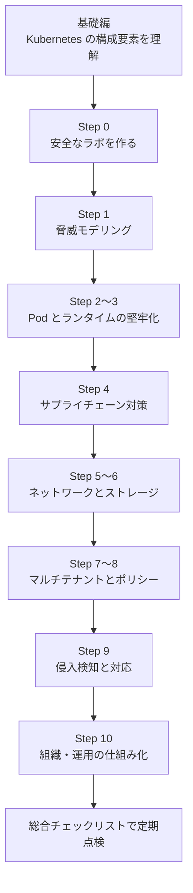

---

## 1. 基礎編: Kubernetes の全体像と「攻撃面」

攻撃を理解する最初の一歩は、**部品と信頼関係(誰が誰を信用しているか)** を知ることです。

### 1.1 構成要素マップ

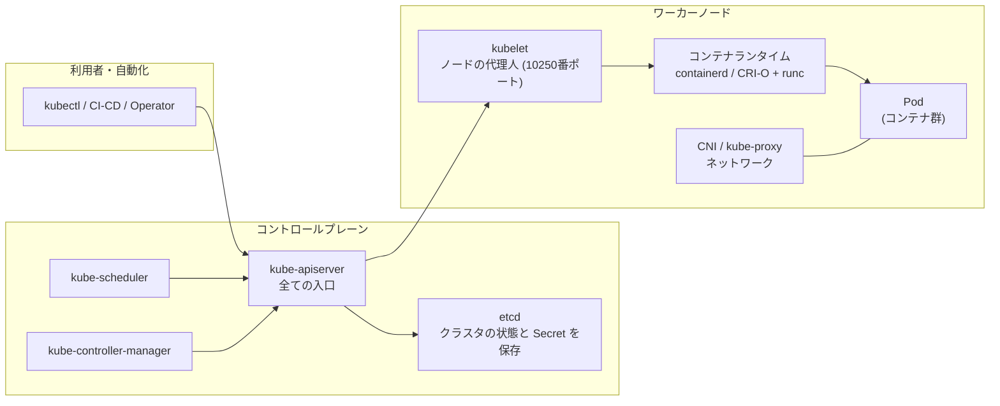

### 1.2 コンポーネント別・攻撃面の早見表

| コンポーネント | 役割 | 攻撃者にとっての魅力 | 主な守り方(本ガイドの節) |
|---|---|---|---|
| kube-apiserver | 全 API の入口。認証・認可・Admission を実施 | 乗っ取れば全権限 | 認証・RBAC・監査ログ・インターネット非公開(Step 8, 9) |
| etcd | 全リソース(Secret 含む)の保存先 | 直接読めれば Secret 全取得 | 保存時暗号化・アクセス制限(Step 6) |
| kubelet | ノード上の Pod 管理 API | ノード上の任意 Pod でコマンド実行の足がかり | 認可の細分化・ネットワーク制限(Step 8) |
| コンテナランタイム | コンテナの生成・隔離 | 脱出(container breakout)できればノード全体 | 最新化・サンドボックス・seccomp(Step 3) |
| Pod / コンテナ | アプリの実行単位 | 最初の侵入口(RCE の着地点) | securityContext・PSA(Step 2) |
| ServiceAccount トークン | Pod が API を呼ぶための身分証 | 盗めば API を叩ける | 自動マウント無効化・最小権限・短命化(Step 2, 8) |
| CNI・Service | 通信経路 | 横展開(lateral movement) | NetworkPolicy・mTLS(Step 5) |
| コンテナイメージ・CI/CD | 何を動かすか | 上流を汚せば全員に波及 | 署名・digest 固定・最小権限(Step 4) |

### 1.3 攻撃の典型的な流れ(Kill Chain の簡易版)

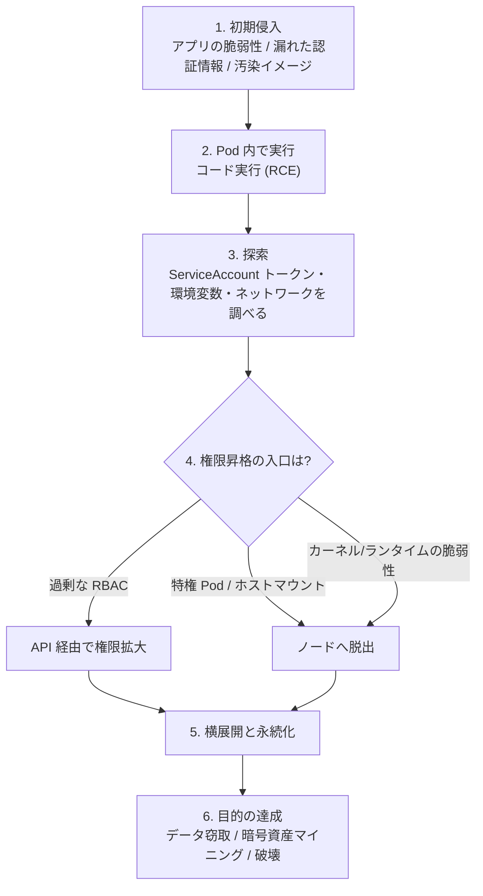

この流れの **どこで止めるか** を設計するのが、以降の各 Step の目的です。

---

## 2. Step 0: 安全な学習ラボを作る

### 2.1 ラボの原則

| 原則 | 理由 |
|---|---|
| 使い捨てのローカルクラスタを使う | 失敗しても影響がなく、すぐ作り直せる |
| 本番・社内ネットワークと分離する | 誤って脆弱な環境を公開してしまう事故を防ぐ |
| クラウドの認証情報を置かない | Pod 内から盗まれる練習をしても実害が出ない |
| 脆弱性学習用環境は「隔離クラスタ」限定 | 下記の Kubernetes Goat の警告を参照 |

### 2.2 `kind` でローカルクラスタを作る(例)

`kind`(Kubernetes IN Docker)は、Docker 上にクラスタを作る軽量ツールです。事前に Docker と `kubectl` を用意してください。

```bash
# クラスタ作成(名前は任意)
kind create cluster --name hk-lab

# 接続確認
kubectl cluster-info --context kind-hk-lab
kubectl get nodes -o wide

# バージョン確認(サーバーとクライアントの差に注意)
kubectl version

# ラボ用の Namespace を作成
kubectl create namespace lab

# Step 10 の ValidatingAdmissionPolicy(namespaceSelector: policy=enforced)の対象にする
kubectl label namespace lab policy=enforced
```

> **注意**: `kind` の既定 CNI が NetworkPolicy を強制するかは、バージョンや構成によって異なります。Step 5 で NetworkPolicy を試す際は、**Calico や Cilium など NetworkPolicy 対応 CNI を導入するか、実際に通信が遮断されるかを必ず確認** してください。

### 2.3 脆弱性学習用環境: Kubernetes Goat

**Kubernetes Goat** は、Madhu Akula 氏が作成した **「わざと脆弱に作られた」学習用 Kubernetes 環境** で、コンテナ脱出、SSRF、DIND(Docker-in-Docker)攻撃、クラスタ侵害など多数のシナリオを実践できます [S24]。

> **絶対に守ること**: プロジェクト自身が「本番環境や機密リソースのあるクラスタに入れてはいけない」と明記しています [S24]。kind はノードをホスト上のコンテナとして動かすため、**kind だけでは隔離境界として不十分** です(コンテナ脱出のシナリオはホストに到達し得ます)。**必ず使い捨ての VM の中、または専用ホスト上で kind などのクラスタを動かし、終わったらクラスタごと削除** してください。

```bash
# 使い終わったら必ずクラスタごと破棄
kind delete cluster --name hk-lab
```

### 2.4 ラボ準備チェックリスト

| 確認項目 | OK 条件 |
|---|---|
| クラスタは使い捨てか | `kind delete cluster` でいつでも消せる |
| 認証情報は含まれていないか | クラウドの鍵・本番 kubeconfig が入っていない |
| ネットワークは分離されているか | 外部に公開するポートがない |
| バージョンは把握しているか | `kubectl version` で確認済み |

---

## 3. Step 1: 脅威モデリング(書籍 第1章)

### 3.1 なぜ最初に脅威モデリングなのか

書籍は、設定項目を羅列する前に **「誰が・何を狙い・どこから来るか」を構造化する** ことから始めます。章立ては「Threat Actors(脅威アクター)」「Your First Threat Model」「Attack Trees」「Prior Art(先行事例)」などです [S1]。

**脅威モデリングの基本の問い**(4つ):

1. **何を守るのか?**(資産: Secret、顧客データ、計算資源、評判)
2. **誰が狙うのか?**(脅威アクター)
3. **どこから入るのか?**(侵入経路・信頼境界)
4. **どう防ぎ、どう気づくのか?**(対策・検知)

### 3.2 脅威アクター(Threat Actors)の整理

下表は、一般的な分類を初学者向けに整理した例です(書籍の分類を要約・再構成したものではなく、考え方の例として提示しています)。

| アクター | 動機 | 典型的な能力 | 想定される侵入口 |
|---|---|---|---|
| 外部の攻撃者(機会主義) | 暗号資産マイニング、踏み台 | 公開された脆弱性や設定ミスを自動スキャン | 公開された API/ダッシュボード、脆弱なアプリ |
| 標的型の攻撃者 | 情報窃取、金銭、諜報 | 時間をかけた調査、サプライチェーン攻撃 | 汚染された依存関係、CI/CD 認証情報 |
| 悪意ある内部者 | 金銭、恨み | 正規の権限を持つ | 正規の kubectl・CI/CD |
| 不注意な内部者 | (なし。ミス) | 誤設定・認証情報の誤公開 | 過剰な権限、公開リポジトリへの鍵漏えい |
| 敵対的テナント | 他テナントの情報 | クラスタ内でのコード実行 | 同居する別ワークロード |

### 3.3 Attack Tree(攻撃ツリー)の作り方

**Attack Tree** は、攻撃者の最終目標を頂点に置き、それを達成する手段を枝分かれで書き出す手法です。書籍も「Example Attack Trees」として具体例を扱っています [S1]。

**例: 目標「クラスタ内の Secret を盗む」**

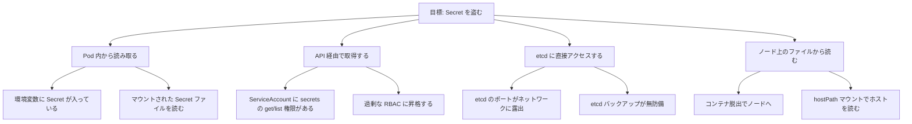

**この木から導く対策**:

| 枝 | 対策 | 該当 Step |
|---|---|---|
| A1/A2 | Secret を最小限に、読み取り専用で必要な Pod のみ | Step 6 |
| B1/B2 | RBAC の最小権限化と定期棚卸し | Step 8 |
| C1/C2 | etcd のネットワーク制限、保存時暗号化、バックアップの保護 | Step 6 |
| D1/D2 | ランタイム分離、hostPath 禁止 | Step 2, 3 |

### 3.4 初めての脅威モデル: ワークシート

次の表をコピーして、自分のクラスタに合わせて埋めてください。

| # | 資産 | 脅威アクター | 侵入経路 | 攻撃シナリオ | 現在の対策 | 不足している対策 | 優先度(高/中/低) |
|---|---|---|---|---|---|---|---|
| 1 | 例: DB の認証情報 | 外部の攻撃者 | アプリの RCE | RCE → 環境変数から取得 | なし | Secret を環境変数に出さない | 高 |
| 2 | | | | | | | |
| 3 | | | | | | | |

### 3.5 「すべてを防げるわけではない」という現実

Kubernetes プロジェクト自身も、**修正されないまま残る設計上のリスク** を公開しています。2026年5月、Security Response Committee は、修正版がないのに「fixed version」欄が入っていた古い CVE(CVE-2020-8554、CVE-2020-8561、CVE-2020-8562、CVE-2021-25740)の記録を、2026年6月1日に「全バージョンが影響を受ける」と正しく訂正しました。この結果、脆弱性スキャナでこれらが新たに検出される場合があるとされています [S7]。

> 学び: 脅威モデルには **「アーキテクチャ上受け入れるリスク」と「それを緩和する補完策」** の欄が必要です。たとえば、admission webhook へのリダイレクト(CVE-2020-8561)や、Endpoints 経由のクロス Namespace 転送(CVE-2021-25740)は、設計の性質に由来するリスクとして扱われています [S7]。

---

## 4. Step 2: Pod レベルのリソース(書籍 第2章)

### 4.1 なぜ Pod が最前線なのか

多くの攻撃は **「アプリの脆弱性で Pod 内にコードが実行される」ところから始まります**(Remote Code Execution)。書籍も第2章で「What's the Worst That Could Happen?」として、**Container Breakout(コンテナ脱出)** を最悪ケースに置き、Pod 設定の各項目(環境変数、イメージ、Probe、リソース制限、DNS、securityContext、Service Account、Volume など)を脅威の観点で確認しています [S1]。

### 4.2 危険な設定の早見表

| 設定項目 | 何が危険か | 安全な方向 |
|---|---|---|
| `privileged: true` | ほぼ全ての隔離機構が無効化される [S8] | 常に `false`(原則禁止) |
| `hostPath` ボリューム | ホストのファイルシステムが見える | 使わない。必要なら読み取り専用+限定パス |
| `hostNetwork` / `hostPID` / `hostIPC` | ホストのネットワーク・プロセス空間を共有 | 使わない |
| `capabilities`(特に `NET_ADMIN`、`SYS_ADMIN`) | カーネル機能の過剰付与 | `drop: ["ALL"]` から必要分のみ追加 |
| `allowPrivilegeEscalation: true`(既定) | setuid 等で権限が上がる余地 | `false` を明示 |
| root で実行 | 脱出時にホスト root へ直結しやすい | `runAsNonRoot: true` |
| ServiceAccount トークンの自動マウント | 侵入後に API を叩く材料になる | API を使わない Pod は `automountServiceAccountToken: false` |
| `latest` タグ・タグ参照 | 中身が知らぬ間に変わる | digest(`@sha256:...`)で固定 |
| リソース制限なし | 暗号資産マイニングや DoS の温床 | `requests` / `limits` を設定 |

### 4.3 Pod Security Standards(PSS)と Pod Security Admission(PSA)

Kubernetes には、Pod の安全度を3段階で定義した **Pod Security Standards** があります [S8]。

| レベル | 意味 | 使いどころ |
|---|---|---|
| **Privileged** | 制限なし(通常の隔離をバイパスできる) | システム用の特別な Namespace のみ |
| **Baseline** | 既知の権限昇格を防ぐ最低限の制限 | 既存アプリの最初の移行先 |
| **Restricted** | 現在の Pod 堅牢化のベストプラクティスに沿った強い制限 | **新規アプリの標準にする** |

これらを強制する組み込みの仕組みが **Pod Security Admission(PSA)** で、**Namespace のラベル** で設定します [S8]。

| モード | 動作 |
|---|---|
| `enforce` | 違反した Pod の作成を拒否 |
| `audit` | 違反を監査イベントに注釈として付与(拒否はしない) |
| `warn` | 違反時にユーザーへ警告を表示(拒否はしない) |

> **`audit` の注意点**: `audit` モードが行うのは、API リクエストの監査イベントへ違反内容の **注釈(annotation)を付与すること** だけです。Namespace にラベルを付けただけでは監査ログには何も記録されません。実際にログとして残すには、kube-apiserver で **監査機能を有効化**(`--audit-policy-file` で監査ポリシーを指定し、`--audit-log-path` などで出力先を設定)し、対象リクエストが `Metadata` 以上のレベルで記録されるようにする必要があります。マネージド Kubernetes では、各クラウドの監査ログ設定を有効化します。

```bash
# まずは warn と audit で影響を調べ、問題なければ enforce にする
kubectl label namespace lab \
  pod-security.kubernetes.io/warn=restricted \
  pod-security.kubernetes.io/audit=restricted

# 影響の無いことを確認後、強制を有効化
kubectl label namespace lab \
  pod-security.kubernetes.io/enforce=restricted
```

> **移行の鉄則**: いきなり `enforce` にせず、**`warn` → `audit` → `enforce`** の順で進めます。PSP(PodSecurityPolicy)は既に削除されているため、古い資料の PSP の手順は使えません [S8]。

**動作確認(拒否されることを確かめる)**: ラボで、わざと違反する Pod を作って拒否されることを確認します。

```yaml
# violating-pod.yaml (ラボ専用・拒否されることを確認する目的)
apiVersion: v1
kind: Pod
metadata:
  name: violating-demo
  namespace: lab
spec:
  containers:
  - name: app
    image: busybox:1.36
    command: ["sleep", "3600"]
    securityContext:
      privileged: true
```

```bash
kubectl apply -f violating-pod.yaml
# restricted が enforce されていれば、作成は拒否される
```

### 4.4 堅牢化した Pod の見本(Hardened securityContext)

書籍は「Using the securityContext Correctly」「Hardened securityContext」を取り上げています [S1]。下記は、現在の推奨に沿った見本です。

```yaml
apiVersion: v1
kind: Pod
metadata:
  name: hardened-demo
  namespace: lab
spec:
  automountServiceAccountToken: false     # API を使わない Pod はトークンを渡さない
  hostUsers: false                        # User Namespaces (v1.36 で GA。ノード側の対応が必要)
  securityContext:
    runAsNonRoot: true
    runAsUser: 10001
    runAsGroup: 10001
    fsGroup: 10001
    seccompProfile:
      type: RuntimeDefault                # 既定の seccomp で危険なシステムコールを制限
  containers:
  - name: app
    image: registry.example.com/app@sha256:<digest>   # タグではなく digest で固定
    securityContext:
      allowPrivilegeEscalation: false
      readOnlyRootFilesystem: true
      capabilities:
        drop: ["ALL"]
    resources:
      requests: { cpu: "50m", memory: "64Mi" }
      limits:   { cpu: "200m", memory: "128Mi" }
    volumeMounts:
    - name: tmp
      mountPath: /tmp
  volumes:
  - name: tmp
    emptyDir: {}
```

**各設定の「なぜ」**

| 設定 | 守るもの |
|---|---|
| `runAsNonRoot` / `runAsUser` | UID 0(root)でのコンテナ起動を拒否し、非 root UID で実行させる。脱出後にホスト上で root にならないことまでは保証しない(それは `hostUsers: false` の UID マッピングの役割) |
| `seccompProfile: RuntimeDefault` | 危険なシステムコールの呼び出しを制限。2026年のカーネル脆弱性の一部では、この設定が緩和策として明記された(Step 3 参照) [S13] |
| `allowPrivilegeEscalation: false` | プロセスが親より高い権限を得る経路を塞ぐ |
| `readOnlyRootFilesystem` | 攻撃者がツールを書き込みにくくする |
| `capabilities: drop ALL` | カーネル機能を必要最小限に |
| `hostUsers: false` | コンテナ内の root をホスト上の非特権ユーザーに割り当てる(下記) |
| digest 固定 | 中身の差し替え(タグの付け替え)を防ぐ |

### 4.5 User Namespaces が GA になった(2026年4月、v1.36)

Kubernetes v1.36 で **User Namespaces が GA** になりました(Linux 専用機能)。Pod の spec に `hostUsers: false` を設定するだけで、コンテナ内の root とホスト上のユーザーが分離されます [S4]。

| ポイント | 内容 |
|---|---|
| 効果 | `CAP_NET_ADMIN` などの capability が **名前空間内に限定** され、ホストへ影響しにくくなる [S4] |
| 設定 | Pod spec に `hostUsers: false`。イメージの変更は不要 [S4] |
| 実績 | User Namespaces が有効なとき、深刻度 HIGH/CRITICAL の脆弱性のいくつかは悪用できなかったと公式ドキュメントが述べている [S4] |
| 注意 | ノード(カーネル・ランタイム)が対応している必要がある。対応ノードへスケジュールされるよう確認する [S4] |

### 4.6 いまのクラスタを点検するコマンド集(読み取り専用)

```bash
# 1) 特権コンテナを使っている Pod を洗い出す(要 jq)
kubectl get pods -A -o json | jq -r '
  .items[]
  | select(any((.spec.containers[]?, .spec.initContainers[]?, .spec.ephemeralContainers[]?); .securityContext.privileged == true))
  | "\(.metadata.namespace)/\(.metadata.name)"'

# 2) hostPath を使っている Pod を洗い出す
kubectl get pods -A -o json | jq -r '
  .items[]
  | select(any(.spec.volumes[]?; .hostPath != null))
  | "\(.metadata.namespace)/\(.metadata.name)"'

# 3) hostNetwork / hostPID / hostIPC を使っている Pod
kubectl get pods -A -o json | jq -r '
  .items[]
  | select(.spec.hostNetwork == true or .spec.hostPID == true or .spec.hostIPC == true)
  | "\(.metadata.namespace)/\(.metadata.name)"'

# 4) Namespace ごとの PSA ラベルを確認
kubectl get ns -L pod-security.kubernetes.io/enforce,pod-security.kubernetes.io/audit,pod-security.kubernetes.io/warn
```

### 4.7 Step 2 の理解度チェック

| 質問 | 答えのヒント |
|---|---|
| `privileged: true` の Pod が危険な理由は? | 通常のコンテナ隔離機構の多くが無効になるため [S8] |
| PSA の3モードの違いは? | enforce は拒否、audit は記録、warn は警告 |
| 新規アプリに推奨される PSS レベルは? | Restricted |
| タグではなく digest で固定する理由は? | タグは付け替え可能で、中身が変わりうるため(Step 4 で詳述) |

---

## 5. Step 3: コンテナランタイムの分離(書籍 第3章)

### 5.1 コンテナは「隔離されたプロセス」にすぎない

書籍は、コンテナ・仮想マシン・サンドボックスの違いを整理し、「What's Wrong with Containers?」として User Namespace の脆弱性などに触れ、**gVisor、Firecracker、Kata Containers、rust-vmm** といったサンドボックス技術と、**Kubernetes RuntimeClass** を紹介しています [S1]。

最重要の考え方は次の1点です。

> **通常のコンテナは、ホストと「同じカーネル」を共有している。** カーネルに脆弱性があれば、コンテナの壁は破られうる。

### 5.2 隔離方式の比較

| 方式 | カーネルの扱い | 隔離の強さ | 性能・互換性の傾向 | 代表例 |
|---|---|---|---|---|
| 通常のコンテナ | ホストと共有 | 中(カーネル脆弱性に弱い) | 高速・互換性が高い | runc(containerd / CRI-O 経由) |
| ユーザー空間カーネル型サンドボックス | アプリ向けに別のカーネルを用意し、ホストへのシステムコールを限定 | 高 | 一部のシステムコールで互換性に制約 | gVisor(`runsc`) |
| 軽量 VM 型サンドボックス | 専用の軽量 VM 内で別カーネルを実行 | 高 | 起動時間・メモリのオーバーヘッドが増える傾向 | Kata Containers、Firecracker |
| VM(従来型) | ゲスト OS ごと分離 | 高 | 重い | 一般的な仮想マシン |

> 表の「傾向」は一般的な特性の整理です。実際の性能は環境・ワークロードで変わるため、**自分の環境で計測** してください。

### 5.3 RuntimeClass でサンドボックスを選ぶ

```yaml
# 1) ノード側にサンドボックスランタイム(例: gVisor の runsc)を導入済みであることが前提
apiVersion: node.k8s.io/v1
kind: RuntimeClass
metadata:
  name: gvisor
handler: runsc
---
# 2) 信頼できないコードを動かす Pod で指定する
apiVersion: v1
kind: Pod
metadata:
  name: sandboxed-demo
  namespace: lab
spec:
  runtimeClassName: gvisor
  containers:
  - name: app
    image: busybox:1.36
    command: ["sleep", "3600"]
```

### 5.4 2026年のケーススタディ: 「コンテナ脱出」が現実に続いた

Google の GKE セキュリティ情報(Security bulletins)には、2026年に公表された **コンテナ脱出につながりうる Linux カーネル脆弱性** が複数掲載されています [S13]。

| 公表日 | 通称 / ID | 概要(要点) | 緩和・対策のポイント |
|---|---|---|---|
| 2026-04-30 | Copy Fail(CVE-2026-31431) | 非特権のローカルユーザーがページキャッシュへ書き込みでき、権限昇格・コンテナ脱出につながりうる。`AF_ALG` と `splice()` を組み合わせた論理バグ | カーネル修正の適用。GKE Sandbox 使用のコンテナは影響なしと記載 [S13] |
| 2026-05-11 | DirtyFrag(CVE-2026-43284 / CVE-2026-43500) | 非特権のローカル攻撃者がホスト root へ昇格しうる。2つの攻撃経路(esp4 / rxrpc) | esp4 経路は `unshare` システムコールが必要で、**`RuntimeDefault` の seccomp を使うコンテナは呼べず影響を受けない** と記載。ただし `CAP_NET_ADMIN` を明示付与したコンテナは影響を受ける [S13] |
| 2026-05-14 | Fragnesia(CVE-2026-46300) | 非特権のローカル攻撃者がホスト root へ昇格しうる。GKE では Ubuntu ノードが影響、COS ノードは影響なしと記載 | 非 root 実行、`RuntimeDefault`、`allowPrivilegeEscalation: false` を推奨 [S13] |
| 2026-06-18 | containerd の複数脆弱性(CVE-2026-50195 ほか) | **Pod を作成できる権限** があれば、Kubernetes のセキュリティ境界を越えたホスト侵害、イメージキャッシュ汚染、DoS が可能 | Pod 作成権限(`create pods`)を信頼できる主体に限定。信頼できないワークロードでは `imagePullPolicy: Always`。**containerd がホスト側でラベルや CDI マウントを解決してから gVisor を呼ぶため、GKE Sandbox(gVisor)ではこの経路を防げない** と明記 [S13] |
| 2026-09-09 | containerd の checkpoint 復元の問題(GHSA-p7v4-vr35-mj6f、CVE は採番待ち) | 信頼できないチェックポイントから復元したコンテナが、宛先の security context を回避して高い権限で動く可能性 | containerd 2.3.4 以降 / 2.2.7 以降では既定で無効化。チェックポイント機能の利用を制限 [S13] |

**ここから学べること(重要)**

1. **サンドボックスは万能ではない。** カーネル系の脆弱性には強いが、containerd のようにホスト側で動くコンポーネントの欠陥は別問題 [S13]。
2. **「Pod を作れる権限」は事実上、ノードへの足がかりになりうる。** RBAC で `create pods` を厳しく管理する [S13]。
3. **基本の堅牢化(非 root、`RuntimeDefault` seccomp、特権昇格禁止)は、未知の脆弱性にも効くことがある** [S13]。
4. **ノード OS・ランタイムのパッチ適用の速度** が防御力に直結する。

過去の runc の脱出系脆弱性も押さえておきましょう。CVE-2024-21626 は、内部のファイル記述子のリークにより、コンテナからホストのファイルシステムへアクセスできる問題で、runc 1.1.12 以降で修正されました [S33]。また、2025年にも runC に、マウント操作のシンボリックリンクや競合状態を利用してコンテナ脱出につながる3件の脆弱性(CVE-2025-31133、CVE-2025-52565、CVE-2025-52881)が報告されています [S34]。

### 5.5 防御策のまとめ(多層防御)

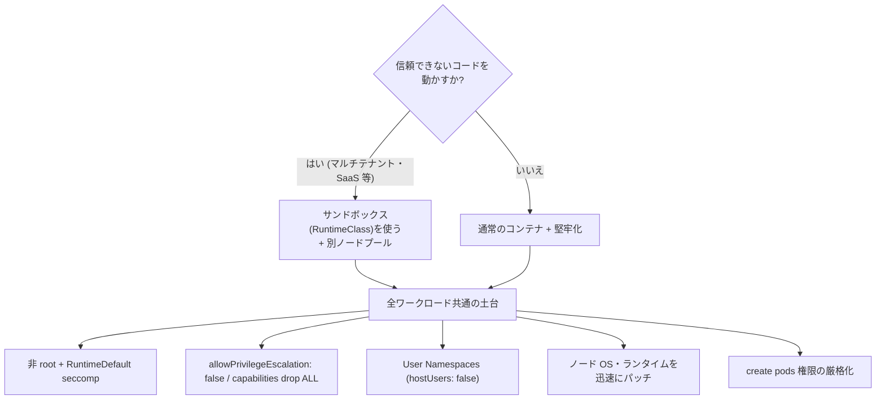

---

## 6. Step 4: アプリケーションとサプライチェーン(書籍 第4章)

### 6.1 サプライチェーンとは何か

「サプライチェーン」は、**自分たちが動かすソフトウェアが、誰の手を経て届くか** の連鎖です。書籍の第4章は、CVE スキャン、OSS の取り込み、信頼する提供元の判断、CNCF Security TAG、SBOM、署名(Notary v1、sigstore、in-toto と TUF、GCP Binary Authorization、Grafeas)、インフラ側のサプライチェーン、そして **SUNBURST への防御** まで扱います [S1]。

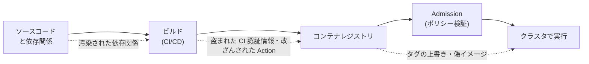

### 6.2 各段階の脅威と対策

| 段階 | 脅威 | 対策 |
|---|---|---|
| 依存関係 | 脆弱な/悪意あるライブラリの混入 | SBOM の作成、脆弱性スキャン、信頼する提供元の限定 |
| ビルド(CI/CD) | CI 認証情報の窃取、ワークフローの改ざん | CI の権限最小化、Action を **コミット SHA で固定**、Secret のスコープ制限 |
| レジストリ | イメージの上書き、偽イメージ | 署名・検証、**digest で参照**、プライベートレジストリ |
| デプロイ(Admission) | 未署名・未検証イメージの実行 | ポリシーエンジンで署名検証を強制 |
| 実行 | 侵害後の挙動 | ランタイム検知(Step 9) |

### 6.3 2026年に起きた現実の事例

#### (1) Trivy 関連のサプライチェーン侵害(2026年3月)

脆弱性スキャナ **Trivy** の提供元 Aqua Security は2026年3月、盗まれた認証情報を使って **悪意あるバイナリ、コンテナイメージ、GitHub Action のタグ** が公開される侵害を受けたと開示しました。影響を受けたのは Trivy v0.69.4、v0.69.4〜0.69.6 のコンテナイメージ、`trivy-action` の旧バージョン群(0.0.1〜0.34.2)、`setup-trivy` の旧バージョン群(0.2.0〜0.2.5)です。安全なバージョンとして Trivy v0.69.2 / v0.69.3、trivy-action 0.35.0、setup-trivy 0.2.6 が示されており、推奨対応として **GitHub Actions を不変のコミット SHA に固定すること** が挙げられています [S14]。

Cloud Security Alliance の研究ノートによれば、攻撃者は GitHub Actions のほぼ全てのバージョンタグを悪意あるコミットへ付け替え、CI/CD で使われる認証情報を収集する多段階の攻撃を行い、その認証情報を足がかりに他のエコシステムへも拡大したとされています [S15]。

#### (2) 悪意ある Docker イメージの公開(2026年4月)

The Hacker News は、Checkmarx の公式 Docker Hub リポジトリで、既存のタグ(v2.1.20 や alpine)が上書きされ、実在しない v2.1.21 タグが追加された事例を報じました。**このイメージで Terraform・CloudFormation・Kubernetes 設定をスキャンしていた場合、そこで扱った Secret や認証情報は侵害された可能性があるものとして扱う** よう警告されています [S16]。

**2つの事例の共通点と教訓**

| 事例の特徴 | 教訓 | 具体策 |
|---|---|---|
| **タグが付け替えられた** | タグ(`v1`、`latest`、`alpine`)は不変ではない | **digest(`@sha256:`)** や **コミット SHA** で固定 |
| **セキュリティツール自体が狙われた** | 「守るためのツール」も供給網の一部 | ツールのバージョン固定・出所の検証・実行環境の権限を最小に |
| **CI/CD の認証情報が足がかり** | パイプラインは高価値の標的 | CI の Secret を短命化・スコープ限定・定期ローテーション |

### 6.4 具体策1: digest で固定する

```bash
# タグから digest を調べる(例: crane を使用)
crane digest registry.example.com/app:1.2.3

# マニフェストでは digest を直接指定する
# image: registry.example.com/app@sha256:<上で得た digest>
```

GitHub Actions も同様に、タグではなくコミット SHA で固定します。

```yaml
# 悪い例: タグ参照(付け替えられる可能性がある)
# - uses: some-org/some-action@v1

# 良い例: コミット SHA で固定(コメントで元のバージョンを残す)
- uses: some-org/some-action@<40桁のコミットSHA>   # v1.2.3
```

### 6.5 具体策2: イメージ署名と検証(sigstore / cosign)

**sigstore** は署名・検証の仕組みで、書籍でも取り上げられています [S1]。**cosign** はそのコマンドラインツールです。

```bash
# 署名の検証(keyless 署名の場合: 署名した ID と発行元を指定して検証)
cosign verify registry.example.com/app@sha256:<digest> \
  --certificate-identity "https://github.com/ORG/REPO/.github/workflows/release.yml@refs/heads/main" \
  --certificate-oidc-issuer "https://token.actions.githubusercontent.com"
```

> 署名は「誰がビルドしたか」の証明であり、**「中身が安全か」の証明ではありません。** 脆弱性スキャン・SBOM と組み合わせて使います。

### 6.6 具体策3: SBOM と脆弱性スキャン

| 用語 | 意味 | 使い方 |
|---|---|---|
| **SBOM**(Software Bill of Materials) | ソフトウェアの部品表 | 新しい CVE が出たとき、影響するイメージを即座に特定する |
| 脆弱性スキャナ | 既知の CVE を検出 | CI とレジストリで継続的に実行 |
| **in-toto / SLSA** | ビルド工程の証跡・成熟度の枠組み | 「どう作られたか」を検証可能にする [S1] |

> **注意**: スキャナ自体も更新・固定・検証の対象です(Trivy の事例 [S14])。

### 6.7 Admission で「未検証イメージを実行させない」

ポリシーエンジン(Kyverno や OPA Gatekeeper)で、署名検証や許可レジストリの強制ができます。Kyverno は2026年3月に CNCF の Graduated プロジェクトとなりました [S17]。詳細は Step 8 で扱います。

### 6.8 Step 4 の実践ミニ課題

| 課題 | 目標 |
|---|---|
| 自分のマニフェストから `latest` とタグ参照を探す | 全て digest 固定に置き換える計画を立てる |
| CI の `uses:` 行を一覧化する | タグ参照の Action をコミット SHA に置換する |
| 使っているスキャナのバージョンを確認する | 侵害対象バージョン([S14])に該当しないことを確認 |

---

## 7. Step 5: ネットワーキング(書籍 第5章)

### 7.1 Kubernetes ネットワークの「デフォルト」

書籍は、まず **Defaults(既定の状態)** を確認します。Pod 内通信(Intra-Pod)、Pod 間通信(Inter-Pod)、Pod からワーカーノードへの通信、クラスタ外との通信を整理し、**暗号化なし**、**ワークロード ID なし** といった既定の弱点を指摘します [S1]。

| 既定の性質 | リスク |
|---|---|
| Pod 同士は(既定では)制限なく通信できる | 1つの Pod の侵害が横展開につながる |
| 通信は既定で暗号化されない | 盗聴・なりすましの余地 |
| Pod にワークロード固有の ID がない | 「誰からの通信か」を信頼できない |
| Pod からノードのサービス(kubelet の API など)へ届く場合がある | ノードの管理機能が狙われる |

### 7.2 通信の流れと制御ポイント

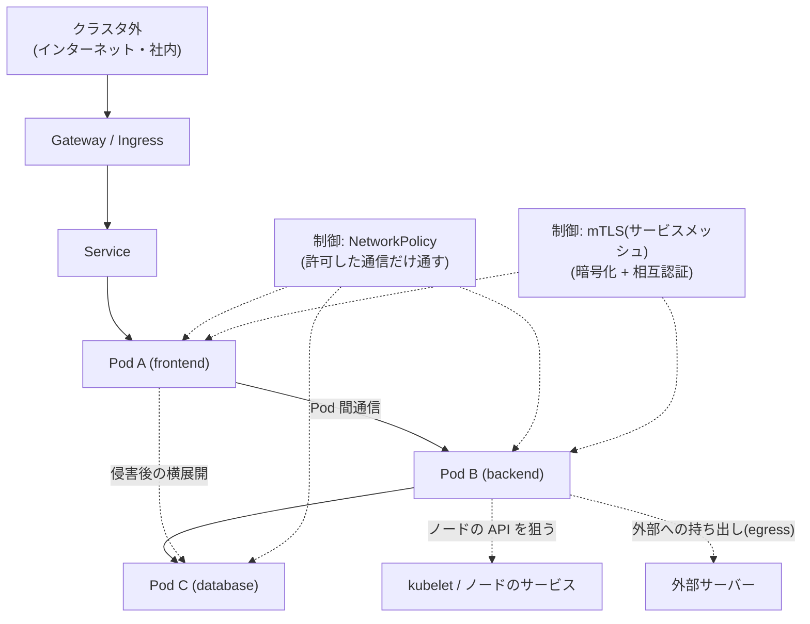

### 7.3 NetworkPolicy: 「全部拒否」から始める

**NetworkPolicy** は、どの Pod がどの Pod・IP と通信できるかを宣言するリソースです。**CNI が NetworkPolicy に対応していないと、作っても効きません**(Step 0 の注意参照)。

**手順1: Namespace 内の通信をすべて拒否する(default deny)**

```yaml
apiVersion: networking.k8s.io/v1
kind: NetworkPolicy
metadata:
  name: default-deny-all
  namespace: lab
spec:
  podSelector: {}          # Namespace 内の全 Pod が対象
  policyTypes:
  - Ingress
  - Egress
```

**手順2: 必要な通信だけを許可する(例: frontend → backend の 8080 番)**

```yaml
apiVersion: networking.k8s.io/v1
kind: NetworkPolicy
metadata:
  name: allow-frontend-to-backend
  namespace: lab
spec:
  podSelector:
    matchLabels:
      app: backend
  policyTypes:
  - Ingress
  ingress:
  - from:
    - podSelector:
        matchLabels:
          app: frontend
    ports:
    - protocol: TCP
      port: 8080
---
# egress を既定拒否している場合、送信側(frontend)にも対応する許可が必要
apiVersion: networking.k8s.io/v1
kind: NetworkPolicy
metadata:
  name: allow-frontend-egress-to-backend
  namespace: lab
spec:
  podSelector:
    matchLabels:
      app: frontend
  policyTypes:
  - Egress
  egress:
  - to:
    - podSelector:
        matchLabels:
          app: backend
    ports:
    - protocol: TCP
      port: 8080
```

**手順3: DNS の問い合わせを許可する(egress を拒否した場合に必須)**

```yaml
apiVersion: networking.k8s.io/v1
kind: NetworkPolicy
metadata:
  name: allow-dns-egress
  namespace: lab
spec:
  podSelector: {}
  policyTypes:
  - Egress
  egress:
  - to:
    - namespaceSelector:
        matchLabels:
          kubernetes.io/metadata.name: kube-system
    ports:
    - protocol: UDP
      port: 53
    - protocol: TCP
      port: 53
```

> **よくある失敗**: egress を全拒否すると DNS も止まり、「名前解決できない」障害になります。手順3を忘れないでください。

### 7.4 サービスメッシュ(mTLS)と eBPF

書籍は、サービスメッシュ(**Linkerd** での mTLS のケーススタディ)と **eBPF**(Go プログラムへのプローブ取り付けのケーススタディ)を扱います [S1]。

| 技術 | できること | 向いている目的 | 注意点 |
|---|---|---|---|
| NetworkPolicy | L3/L4 の通信許可・拒否 | 横展開の抑制、最初の一手 | L7 の細かい制御は不得手。CNI 依存 |
| サービスメッシュ(mTLS) | 通信の暗号化と相互認証、ワークロード ID | 「誰が呼んだか」の確認、盗聴対策 | 運用の複雑さ・リソース消費 |
| eBPF 系(例: Cilium、Tetragon) | カーネルレベルの可視化・制御 | 高性能なネットワーク制御・検知 | カーネル/ノード要件の確認が必要 |

### 7.5 2026年の重大トピック: Ingress NGINX の退役

Kubernetes の Steering Committee と Security Response Committee は共同声明で、**2026年3月に Ingress NGINX を退役** させると発表しました。これは **クラウドネイティブ環境の約半数が使っているとされる重要インフラ** です。退役後は、バグ修正もセキュリティパッチも一切リリースされません。声明は、退役後も使い続けると **利用者と顧客が攻撃を受けやすくなる** と明確に警告しています [S6]。

| 項目 | 内容 |
|---|---|
| 退役時期 | 2026年3月 [S6] |
| 影響 | 以後、バグ修正・セキュリティパッチなし [S6] |
| 利用確認の方法 | クラスタ管理者権限で `kubectl get pods --all-namespaces --selector app.kubernetes.io/name=ingress-nginx` [S6] |
| 移行先の方向性 | Gateway API、または他の Ingress コントローラー。**ただし完全な互換の代替はなく、計画と工数が必要** [S6][S29] |
| 注意点 | 既存のデプロイは動き続けるため、**確認しない限り気づかないまま侵害される恐れがある** と指摘されている [S29] |

```bash
# あなたのクラスタで ingress-nginx が動いているか確認(読み取りのみ)
kubectl get pods --all-namespaces --selector app.kubernetes.io/name=ingress-nginx
```

> マネージドサービス側の注意: GKE は ingress-nginx を使用しておらず、その脆弱性の影響を受けないとしています。ただし、自分で導入したコンポーネントは各自で更新状況を確認する必要があります [S13]。

### 7.6 NSA/CISA の推奨(ネットワーク・監査)

NSA と CISA の Kubernetes Hardening Guide(v1.2、2022年8月)は、ネットワークの分離・強化、ファイアウォールと暗号化、監査ログの取得・監視などを推奨しています。また、**Kubernetes API サーバーをインターネットや信頼できないネットワークに公開しない** ことも示されています [S25][S36]。

### 7.7 Step 5 の実践ミニ課題

| 課題 | 目標 |
|---|---|
| ラボで `default-deny-all` を適用し、Pod 間 `curl` が失敗することを確認 | NetworkPolicy が本当に効く環境かを検証 |
| 許可ルールを追加して通信が復旧することを確認 | 最小許可の感覚をつかむ |
| 自社クラスタで ingress-nginx の有無を確認 | 退役対応の要否を判断 |

---

## 8. Step 6: ストレージ(書籍 第6章)

### 8.1 ストレージで守るもの

書籍の第6章は、ボリュームとデータストア、コンテナのボリュームとマウント(OverlayFS、tmpfs)、**ボリュームマウントがコンテナ隔離を破るケース**(`/proc/self/exe` の CVE)、保存時の機密情報、マウントされた Secret への攻撃、CSI(Container Storage Interface)、Projected Volumes、**ホストマウントの危険性**、データストアからの持ち出しまで扱います [S1]。

| 守る対象 | 典型的な弱点 |
|---|---|
| Secret(パスワード・トークン・鍵) | 環境変数への展開、ログ出力、広すぎる読み取り権限 |
| etcd | ネットワーク露出、バックアップの無防備、暗号化されていない保存 |
| ノード上のファイル | `hostPath` によるホストの露出 |
| 永続ボリューム(PV) | 他の Pod・テナントからのアクセス |

### 8.2 Secret は「暗号化」されているわけではない

Kubernetes の Secret は既定では **base64 でエンコードされているだけ** で、暗号化ではありません(誰でもデコードできます)。守りの基本は次の3点です。

| 対策 | 内容 |
|---|---|
| RBAC で `secrets` の `get` / `list` / `watch` を最小化 | `list` が使えると Namespace 内の全 Secret を取得できる |
| etcd の保存時暗号化(encryption at rest) | etcd のディスクやバックアップが漏れても読めないようにする |
| 外部の鍵管理(KMS)連携 | 暗号鍵をクラスタの外で守る |

**v1.37 の関連更新**: 保存時暗号化を使っていると、復号できなくなったリソースがクラスタに残り、管理者が etcd を直接触って復旧するしかない場合がありました。v1.37 では、**API サーバーが復号できないリソースを特定し、Kubernetes API 経由で削除できる機能が Beta** になりました [S2]。

### 8.3 ホストマウントの危険性

`hostPath` は、ノードのファイルシステムの一部を Pod に見せる機能です。広いパス(`/`、`/var/run`、`/etc` など)を渡すと、**Pod が侵害された時点でノードが侵害されたのと同等** になりえます。

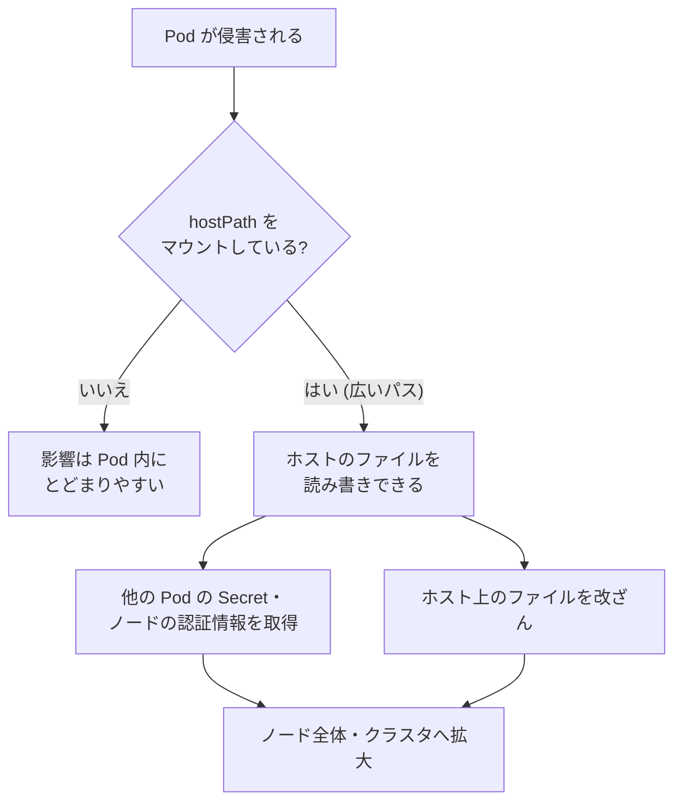

**対策の整理**

| 対策 | 内容 |
|---|---|
| `hostPath` を原則禁止 | PSS の Baseline 以上で制限される(HostPath ボリュームの扱いは Baseline/Restricted の制約対象)。必ず公式の Pod Security Standards で最新の制約を確認する [S8] |
| 必要な場合は読み取り専用+限定パス | `readOnly: true`、最小のサブパスのみ |
| 代替手段を使う | `emptyDir`、PersistentVolume、CSI ドライバー、Projected Volume |

### 8.4 v1.37 のストレージ堅牢化機能

2026年9月16日の公式ブログで、v1.37 の **emptyDir のパーミッションモード** と **バインドマウントオプション** が紹介されました。たとえば、書き込み可能ボリュームから任意のバイナリを実行させない、コンテナ間でのファイル削除を禁止する、といったポリシーを、Kubernetes 上で直接実現できるようになります。具体的には、`noexec`、`nodev`、`nosuid` といったセキュリティ関連のマウントオプションを指定できるようになり、セキュリティベンチマークに合わせたボリュームの堅牢化がしやすくなります。両機能は追加的(additive)で、バージョンスキューに配慮した設計だと説明されています [S3]。

> **注意: どちらも v1.37 時点で Alpha のため、既定では無効で使えません。** emptyDir のパーミッションモードは `EmptyDirVolumeMode`、バインドマウントオプションは `VolumeBindMountOptions` のフィーチャーゲートで制御され、使うにはそれぞれのゲートを関係するコンポーネント(API サーバーと kubelet)で有効化する必要があります。バインドマウントオプションはコンテナランタイム側の対応も必要です。Alpha の API は今後変わる可能性があり、マネージド Kubernetes では Alpha のゲートを有効にできないことがあります。

また、v1.37 では **SELinuxMount と SELinuxChangePolicy が Stable** になり、既定で有効です。対応する CSI ドライバー(`CSIDriver` で `seLinuxMount: true` を宣言)では、ボリュームが再帰的な再ラベルではなく `-o context=` でマウントされます [S2]。

| 機能(v1.37) | 守るもの | 状態 |
|---|---|---|
| bind mount オプション(`noexec` / `nodev` / `nosuid`) | 書き込み可能ボリューム経由の不正実行 | Alpha(既定で無効、`VolumeBindMountOptions`) [S3] |
| emptyDir のパーミッションモード | 意図しないファイル操作の抑止 | Alpha(既定で無効、`EmptyDirVolumeMode`) [S3] |
| SELinuxMount / SELinuxChangePolicy | ボリュームのラベル付けの効率化と一貫性 | Stable [S2] |
| 復号不能リソースの API 経由削除 | 暗号化運用の復旧性 | Beta [S2] |

> 注意: 機能の成熟度(Alpha / Beta / Stable)と既定値は、必ず自分が使うバージョンの公式ドキュメントで確認してください。

### 8.5 Pod 向けの短命な証明書(Pod Certificates)

v1.37 では、**Pod certificates と ClusterTrustBundles が Stable** になりました。Pod に **短命の X.509 証明書** を渡す標準的な方法で、kubelet が鍵ペアを生成して `PodCertificateRequest` を作成し、`PodCertificate` の projected volume で鍵と証明書を Pod へ配り、**自動でローテーション** します [S2][S31]。

> **注意**: Kubernetes 本体には `PodCertificateRequest` を処理する **署名者(signer)は含まれていません**。リクエストを承認・署名して証明書を発行するコントローラーを **別途デプロイ** する必要があり、projected volume は **発行後の証明書を配布するだけ** です。signer がなければ Pod は証明書を受け取れません。

| 従来の課題 | Pod Certificates による改善の方向 |
|---|---|
| 長寿命のトークンや鍵が盗まれる | 短命の証明書で盗まれても影響期間を狭める |
| 鍵の配布・更新が手作業 | kubelet が配布し自動更新 |
| ワークロード ID が曖昧 | 証明書を使った相互認証(mTLS)の土台になる |

### 8.6 点検コマンド(読み取り専用)

```bash
# Secret を読める権限(例: default ServiceAccount)の確認
kubectl auth can-i get secrets -n lab --as=system:serviceaccount:lab:default
kubectl auth can-i list secrets -n lab --as=system:serviceaccount:lab:default

# Secret をボリュームや環境変数として使っている Pod の洗い出し
# (env の secretKeyRef / envFrom の secretRef / secret・projected ボリューム。initContainers・ephemeralContainers も対象)
kubectl get pods -A -o json | jq -r '
  .items[]
  | select(
      any((.spec.containers[]?, .spec.initContainers[]?, .spec.ephemeralContainers[]?);
          any(.env[]?; .valueFrom.secretKeyRef != null)
          or any(.envFrom[]?; .secretRef != null))
      or any(.spec.volumes[]?; .secret != null or any(.projected.sources[]?; .secret != null)))
  | "\(.metadata.namespace)/\(.metadata.name)"'
```

---

## 9. Step 7: ハードマルチテナンシー(書籍 第7章)

### 9.1 「同居」はどこまで安全か

書籍の第7章は、Namespaced Resources、Node Pools、Node Taints、**Soft Multitenancy**、**Hard Multitenancy**、**Hostile Tenants(敵対的なテナント)**、サンドボックスとポリシー、パブリッククラウドでのマルチテナンシー、コントロールプレーン(API サーバーと etcd、スケジューラとコントローラーマネージャー)、データプレーン、クラスタ分離アーキテクチャ、セキュリティ監視まで扱います [S1]。

| 用語 | 意味 | 想定するテナント |
|---|---|---|
| ソフトマルチテナンシー | 同じ組織内など、**基本的に信頼できる** チーム同士の共存 | 社内の別チーム |
| ハードマルチテナンシー | **互いに信頼できない**(敵対的でありうる)テナントの共存 | 外部の顧客、コードを実行させるサービス |

### 9.2 分離レイヤーの比較

| 分離の仕組み | 何を分けるか | 限界 |
|---|---|---|
| Namespace | 名前・RBAC・クォータの単位 | **それ自体はセキュリティ境界として弱い**(カーネル、ノード、ネットワークは共有) |
| NetworkPolicy | Pod 間の通信 | CNI 依存。通信以外の隔離は提供しない |
| ResourceQuota / LimitRange | リソースの食い潰し防止 | 脱出や情報漏えいは防げない |
| Node Pool + Taint/Toleration | テナントごとにノードを分ける | ノード上の kubelet・ランタイムの欠陥は残る |
| サンドボックス(RuntimeClass) | カーネルの共有を弱める | ホスト側コンポーネントの欠陥(Step 3 の containerd の例)は別途対策が必要 [S13] |
| クラスタ分離(テナントごとに別クラスタ) | コントロールプレーンまで分離 | 運用コスト・費用が増える |

### 9.3 分離レベルの選び方

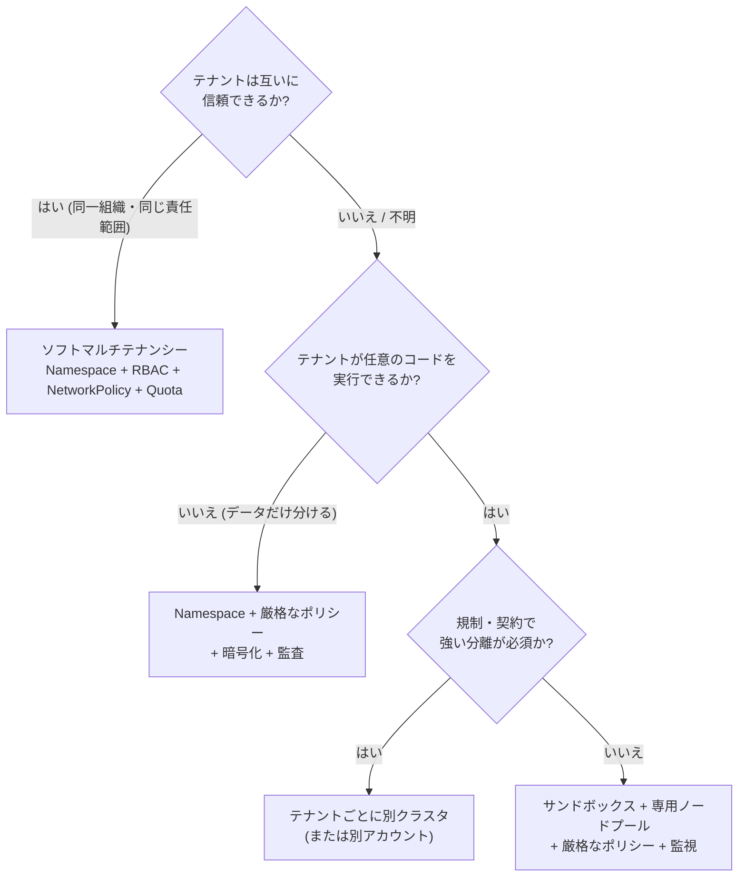

### 9.4 コントロールプレーンの共有に注意

同じクラスタを共有すると、**API サーバーと etcd も共有** します。1つのテナントの過剰な API 呼び出しが他へ影響したり、API サーバーのリダイレクトの性質に起因する、**修正されないまま残る設計上のリスク** もあります(Step 1 の CVE-2020-8561、CVE-2021-25740 など) [S7]。

### 9.5 実践の目安

| 状況 | 推奨 |
|---|---|
| 自社の複数チーム | Namespace 分離 + RBAC + NetworkPolicy + Quota + PSA(restricted) |
| 外部顧客のコードを動かす | **別クラスタ**、または少なくともサンドボックスと専用ノードの併用に加え、Pod 作成権限をテナントへ渡さない設計 |
| 規制業界 | 別クラスタを第一候補にし、監査の仕組みを用意 |

---

## 10. Step 8: ポリシー(書籍 第8章)

### 10.1 ポリシーの種類

書籍の第8章は、ポリシーを **ネットワーク、リソース割り当て(ResourceQuota)、ランタイム、アクセス制御** に分けて整理し、監査、認証・認可、ワークロード ID、**RBAC**、汎用ポリシーエンジン(**OPA、Kyverno**)を扱います [S1]。

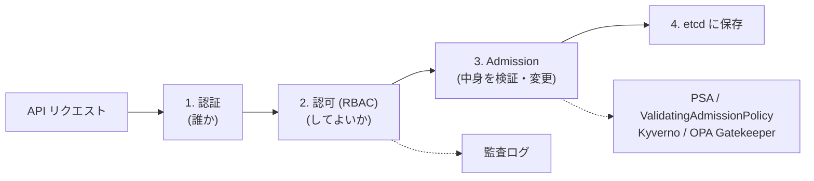

### 10.2 RBAC の基本

| リソース | 役割 |
|---|---|
| `Role` / `ClusterRole` | 「何に対して何をしてよいか」の権限の束 |
| `RoleBinding` / `ClusterRoleBinding` | 権限を「誰に」付与するか(User / Group / ServiceAccount) |

**最小権限の見本(Pod のログを見るだけ)**

```yaml
apiVersion: v1
kind: ServiceAccount
metadata:
  name: log-viewer
  namespace: lab
---
apiVersion: rbac.authorization.k8s.io/v1
kind: Role
metadata:
  name: pod-log-reader
  namespace: lab
rules:
- apiGroups: [""]
  resources: ["pods/log"]
  verbs: ["get"]
---
apiVersion: rbac.authorization.k8s.io/v1
kind: RoleBinding
metadata:
  name: pod-log-reader-binding
  namespace: lab
subjects:
- kind: ServiceAccount
  name: log-viewer
  namespace: lab
roleRef:
  kind: Role
  name: pod-log-reader
  apiGroup: rbac.authorization.k8s.io
```

### 10.3 RBAC の「危ない権限」早見表

Kubernetes 公式の RBAC Good Practices は、付与されると **権限昇格** につながりうる権限を明示し、Pod に強力な権限を持つ ServiceAccount を渡さないこと、既定の権限や冗長なエントリを定期的に見直すことを勧めています [S9]。

| 権限(verb / リソース) | なぜ危険か | 出典 |
|---|---|---|
| `escalate`(Role / ClusterRole) | 自分が持たない権限を含むロールを作れる(通常は組み込みの昇格防止が働く) | [S9] |
| `bind`(RoleBinding / ClusterRoleBinding) | 自分が持たない権限のロールへ紐付けできる | [S9] |
| `impersonate` | 他のユーザー・グループ・ServiceAccount になりすませる | [S9] |
| `create pods`(Pod の作成) | 同一 Namespace の任意の ServiceAccount を Pod にマウントして、その権限を使える。ノードへの足がかりにもなりうる(Step 3) | [S28][S13] |
| `secrets` の `get` / `list` / `watch` | 認証情報を取得できる | [S9][S28] |
| `nodes/proxy` | kubelet API へのアクセスにつながる(次項) | [S5][S10] |

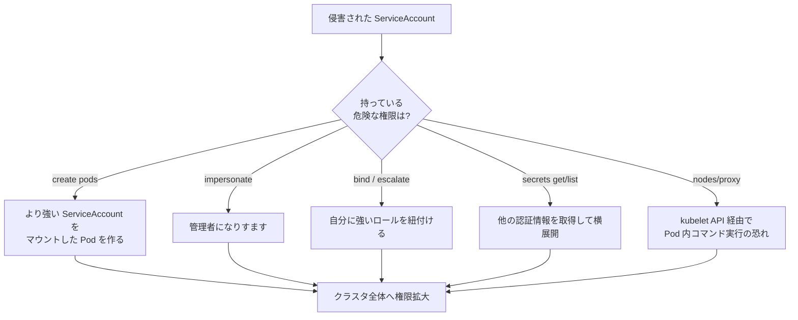

### 10.4 2026年の重要ケース: `nodes/proxy` GET の問題

**何が起きたか**

2026年1月26日、セキュリティ研究者 Graham Helton 氏が、監視・可観測性ツールによく付与される RBAC 権限 `nodes/proxy` の **GET** が、読み取り専用だと思われていたにもかかわらず、**kubelet API 経由で Pod 内の任意コマンド実行につながりうる** ことを示しました [S10][S32]。

原因は、WebSocket の接続開始が HTTP GET で行われるため、kubelet が **GET を RBAC の `get` 動詞に対応づけて認可し、その後の実際の操作(exec など)に必要な `create` 権限を確認しない** ことにあると説明されています [S5]。Horizon3.ai も、`nodes/proxy` GET を持つ ServiceAccount が、kubelet への到達性があれば、到達可能なノード上の Pod(特権の system Pod やコントロールプレーンの Pod を含む)でコマンドを実行できると報告しています [S11]。

**Kubernetes 側の扱い**

AKS のセキュリティ情報は、Kubernetes Security Team がこの挙動を「**想定どおりの動作(working as intended)**」と判断し、CVE を割り当てないとしたことを記載しています [S12]。一方で、Kubernetes は仕組みで緩和する方向へ進みました。

| 時期 | 動き |
|---|---|
| 2026年1月 | 問題が公開される(Helton 氏) [S10] |
| v1.33 | Fine-grained kubelet authorization が Beta・既定で有効(二次情報) [S32] |
| 2026年4月(v1.36) | **Fine-Grained Kubelet API Authorization が GA** [S5] |
| 2026年4月以降 | 監視ツールは `nodes/proxy` ではなく `nodes/metrics`、`nodes/stats`、`nodes/pods` などを使うよう推奨 [S5] |

**あなたが今すぐ確認すること(読み取りのみ)**

```bash
# nodes/proxy(またはワイルドカード "*")を含む ClusterRole を洗い出す
# nodes はクラスタースコープのため、Namespace 内の Role では付与できない(対象外)
# apiGroups に "" (core) または "*" を含む rule に限って resources を検査する
kubectl get clusterroles -o json | jq -r '
  .items[]
  | select(any(.rules[]?;
      any((.apiGroups // [])[]; . == "" or . == "*")
      and any((.resources // [])[]; . == "nodes/proxy" or . == "*")))
  | "\(.kind)/\(.metadata.name)"'
```

監視用途で置き換える場合の権限の例(v1.36 以降が前提。**自分の監視ツールが細分化された権限に対応しているか確認してから** 変更してください)。

```yaml
rules:
- apiGroups: [""]
  resources: ["nodes/metrics", "nodes/stats", "nodes/pods"]
  verbs: ["get"]
```

**補足(検知の観点)**: 二次情報では、この経路は Kubernetes API の監査ログに痕跡が残りにくいと指摘されています [S32]。そのため、Step 9 のランタイム検知(ノード側の可視化)と、kubelet(10250 番ポート)へのネットワーク到達性の制限を併用することが重要です。

### 10.5 汎用ポリシーエンジン: 3つの選択肢

| ツール | 特徴 | 2026年10月時点のメモ |
|---|---|---|
| **ValidatingAdmissionPolicy**(組み込み) | CEL 式で検証。外部コンポーネント不要 | Kubernetes 標準機能。まず検討する |
| **Kyverno** | Kubernetes のリソースの書き方に近い YAML でポリシーを記述 | 2026年3月24日に CNCF Graduated。CEL に全面対応し、サードパーティのセキュリティ監査も完了 [S17] |
| **OPA Gatekeeper** | Rego 言語による汎用ポリシー | 書籍が取り上げる代表格 [S1] |

**ValidatingAdmissionPolicy の例(`:latest` タグを拒否)**

```yaml
apiVersion: admissionregistration.k8s.io/v1
kind: ValidatingAdmissionPolicy
metadata:
  name: deny-latest-tag
spec:
  failurePolicy: Fail
  matchConstraints:
    resourceRules:
    - apiGroups: [""]
      apiVersions: ["v1"]
      operations: ["CREATE", "UPDATE"]
      resources: ["pods", "pods/ephemeralcontainers"]
  validations:
  - expression: "object.spec.containers.all(c, !c.image.endsWith(':latest')) && (!has(object.spec.initContainers) || object.spec.initContainers.all(c, !c.image.endsWith(':latest'))) && (!has(object.spec.ephemeralContainers) || object.spec.ephemeralContainers.all(c, !c.image.endsWith(':latest')))"
    message: "latest タグのイメージは使用できません"
---
apiVersion: admissionregistration.k8s.io/v1
kind: ValidatingAdmissionPolicyBinding
metadata:
  name: deny-latest-tag-binding
spec:
  policyName: deny-latest-tag
  validationActions: [Deny]
  matchResources:
    namespaceSelector:
      matchLabels:
        policy: enforced
```

> 注意: この例は教材用で、**タグ未指定(暗黙の latest)** は拒否できません。実運用では「digest 指定を必須にする」ルールを検討してください。また、ポリシーはまず `validationActions` を `Warn` / `Audit` にして影響を測ってから `Deny` にします。

**v1.37 の関連更新**: **マニフェストベースの Admission Control が Beta になった** と報告されています。API サーバー起動時からポリシーを強制でき、etcd が使えなくても Admission が動き続け、API ベースの Admission リソース自体を変更から保護できる、という利点が挙げられています(二次情報のため、公式リリースノートで確認してください) [S31]。

### 10.6 監査(Auditing)と「破れ窓(Breakglass)」

| 項目 | 内容 |
|---|---|
| 監査ログ | 誰が・いつ・何をしたかの記録。NSA/CISA は有効化・永続化・監視を推奨(既定では無効)[S25][S36] |
| Breakglass(緊急時の特権) | 障害時に一時的に強い権限を使う手順。**事前に手順・承認・事後レビューを決めておく** |
| 認可の見直し | 既定の権限・冗長な権限・退職者やアカウントの棚卸しを定期的に実施 [S9] |

### 10.7 点検コマンド(読み取り専用)

```bash
# ServiceAccount が持つ権限の一覧
kubectl auth can-i --list -n lab --as=system:serviceaccount:lab:default

# cluster-admin に紐付いている主体の確認
kubectl get clusterrolebindings -o json | jq -r '
  .items[]
  | select(.roleRef.name == "cluster-admin")
  | "\(.metadata.name): \([.subjects[]? | "\(.kind)/\(.name)"] | join(", "))"'

# Namespace 内で cluster-admin を参照している RoleBinding の確認
kubectl get rolebindings -A -o json | jq -r '
  .items[]
  | select(.roleRef.kind == "ClusterRole" and .roleRef.name == "cluster-admin")
  | "\(.metadata.namespace)/\(.metadata.name): \([.subjects[]? | "\(.kind)/\(.name)"] | join(", "))"'
```

---

## 11. Step 9: 侵入検知(書籍 第9章)

### 11.1 「破られる前提」で考える

書籍の第9章は、従来型 IDS、eBPF ベースの IDS、Kubernetes・コンテナ向けの侵入検知、**Falco**、機械学習によるアプローチ、**コンテナフォレンジクス**、**ハニーポット**、監査、**検知回避**、SOC(Security Operations Center)までを扱います [S1]。

> 考え方: 予防策(Step 2〜8)を完璧にしても、未知の脆弱性や設定ミスで破られる可能性は残ります。**「破られたことに早く気づき、被害を小さくする」** のが検知の目的です。

### 11.2 検知の層

| 層 | 見るもの | 代表的な手段 |
|---|---|---|
| Kubernetes API | 誰が何の API を呼んだか | 監査ログ |
| ノード・コンテナ(ランタイム) | システムコール、プロセス、ファイル、ネットワーク | Falco、eBPF ベースのツール |
| ネットワーク | 不審な通信・外部への持ち出し | NetworkPolicy ログ、フロー可視化 |
| 設定の変化 | 危険な設定の混入 | Admission / ポリシー違反の記録 |

**Falco** は Linux 向けのランタイムセキュリティツールで、**カーネルレベルのイベント(システムコールなど)をルールに基づいて監視・検知** し、コンテナランタイムや Kubernetes のメタデータでイベントを補強できます。CNCF の Graduated プロジェクトで、公式ルールセットが提供されています [S18]。

**ルールの例(教材用: コンテナ内でシェルが起動されたら警告)**

```yaml
- rule: Shell spawned in container (demo)
  desc: コンテナ内でシェルが起動されたことを検知する(学習用の簡易ルール)
  condition: spawned_process and container and proc.name in (bash, sh)
  output: >
    Shell in container (user=%user.name container=%container.name
    image=%container.image.repository cmd=%proc.cmdline)
  priority: WARNING
```

> 実運用では、公式ルールセット(`falcosecurity/rules`)をベースに、誤検知(正当なデバッグ作業など)を調整します [S18]。上記は構造を理解するための簡易例です。

### 11.3 検知の限界を知る(検知回避と死角)

`nodes/proxy` の事例(Step 8)では、Kubernetes API の監査ログだけでは見えにくい経路があると指摘されています [S32]。**API 層だけでなく、ノード・ランタイム層でも観測する** 設計が重要です。

### 11.4 インシデント対応の流れ

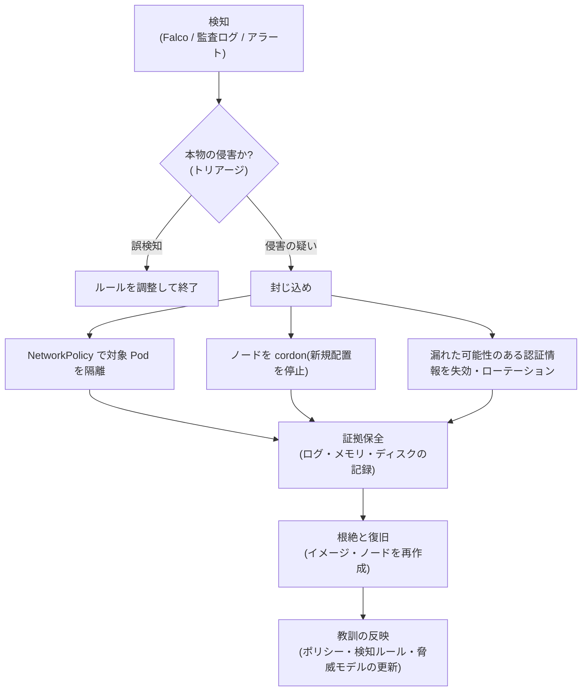

**封じ込めの具体例(隔離ラベル+ NetworkPolicy)**

```bash
# 疑わしい Pod に隔離用ラベルを付ける(Pod は消さない=証拠を残す)
kubectl label pod <pod名> -n lab quarantine=true

# ノードに新しい Pod が配置されないようにする
kubectl cordon <ノード名>
```

```yaml
# quarantine=true のラベルが付いた Pod の Pod ネットワーク上の通信を遮断する
# (loopback やノードからの通信の遮断は保証されない。下の注意を参照)
apiVersion: networking.k8s.io/v1
kind: NetworkPolicy
metadata:
  name: quarantine
  namespace: lab
spec:
  podSelector:
    matchLabels:
      quarantine: "true"
  policyTypes:
  - Ingress
  - Egress
```

> **確立済み接続の扱い**: ラベル付与と NetworkPolicy の適用後も、**すでに確立済みの接続が切断されずに継続する場合があります**。この挙動(既存コネクションを即座に切るか、新規接続のみ遮断するか)は CNI 実装に依存するため、利用している CNI で事前に確認してください。確立済み接続も含めて **即時に遮断する必要がある場合** は、下記の CNI 固有の deny ポリシー(Cilium / Calico / AdminNetworkPolicy など、既存接続への適用を確認済みのもの)や、ノード側の隔離(ファイアウォール・セキュリティグループ・隔離セグメントへの移動)を使用してください。

> **重要**: 標準の NetworkPolicy は **許可ルールの足し算(和集合)** で評価され、「拒否」で既存ポリシーを **上書きできません**。上の quarantine ポリシーだけでは、同じ Pod を選択する既存の許可ポリシーがあれば通信は通ったままです。確実に隔離するには、(1) 上の quarantine ポリシー(default-deny)は維持したまま、既存の許可ポリシーの `podSelector` に `matchExpressions: [{key: quarantine, operator: NotIn, values: ["true"]}]` を加えて quarantine=true の Pod を許可対象から外し、さらに既存ルールの `ingress.from` / `egress.to` の `podSelector` にも同じ条件を加えて、他の Pod の許可ルールが quarantine Pod を通信相手として指さないようにする、または (2) Cilium / Calico / AdminNetworkPolicy など **拒否の優先順位をサポートする CNI のポリシー** で deny を最優先に適用してください。

> **NetworkPolicy の適用範囲**: 標準の NetworkPolicy が制限するのは **Pod ネットワーク上の通信** です。Pod 内の loopback(`localhost`)通信や、Pod が動いているノード自身からの通信は、遮断が保証されません(Kubernetes の仕様上、ノードからの通信は CNI 実装によって常に許可されることがあります)。また `hostNetwork: true` の Pod に対する NetworkPolicy の動作は Kubernetes の仕様上 **未定義** で、CNI プラグインによって異なります(Pod ネットワークのポリシーとして扱う実装もあれば、無視する実装もあります)。利用している CNI のドキュメントで挙動を確認してください。完全に隔離する必要がある場合は、ノード側の制御も併用してください。たとえば、ノードのファイアウォール(iptables / nftables)やクラウドのセキュリティグループでノード単位の通信を制限する、ノードを隔離用のネットワークセグメントへ移す、kubelet(10250 番ポート)への到達性を絞る、といった方法があります。

> **フォレンジクスの注意**: コンテナのチェックポイント/復元機能は、証拠保全に便利な反面、2026年には **信頼できないチェックポイントからの復元がセキュリティ設定を回避する** 問題が報告されています(Step 3)[S13]。信頼できるチェックポイントだけを扱い、機能の利用範囲を制限してください。

### 11.5 ハニーポットの考え方

ハニーポットは、**攻撃者を誘い込む「おとり」** です。書籍も取り上げています [S1]。

| 種類 | 例 | 得られるもの |
|---|---|---|
| おとりの Secret | 本物に見えるが使われない認証情報 | 使われた時点で侵害の確実なシグナル |
| おとりの Pod・Service | 魅力的な名前の偽リソース | 探索行動の早期検知 |

> 注意: ハニーポットは **隔離された環境** に置き、本物の資産と接続しないでください。

---

## 12. Step 10: 組織(書籍 第10章)

### 12.1 最も弱いのは「人と組織」

書籍の第10章は、**The Weakest Link(最も弱い環)**、クラウドプロバイダーと**責任共有モデル**、**アカウントの衛生管理**、人やリソースのグルーピング、オンプレミス環境、**脅威モデルの爆発(Threat Model Explosion)**、SLO が与える圧力、**ソーシャルエンジニアリング**、プライバシーと規制上の懸念を扱います [S1]。

### 12.2 責任共有モデル(Shared Responsibility)

| 領域 | マネージド Kubernetes(EKS / GKE / AKS など) | 自前運用(オンプレミス) |
|---|---|---|
| コントロールプレーンの保守 | 主にクラウド事業者 | 自分たち |
| ノード OS・ランタイムのパッチ | **多くの場合、利用者側の責任(サービスにより異なる)** | 自分たち |
| ワークロードの設定(Pod・RBAC・NetworkPolicy) | **利用者** | 自分たち |
| アプリ・イメージ・サプライチェーン | **利用者** | 自分たち |
| IAM・アカウント管理 | **利用者(事業者の仕組みを使って)** | 自分たち |

> 例: GKE のセキュリティ情報では、脆弱性ごとに「GKE Autopilot は影響なし」「Ubuntu ノードのみ影響」「自分でインストールしたコンポーネントは各自で確認」のように、**影響範囲と利用者の対応が異なる** ことが示されています [S13]。**自分の環境のどこまでが自分の責任か** を、サービスごとに把握しておく必要があります。

### 12.3 アカウントの衛生管理チェック

| 項目 | 確認ポイント |
|---|---|
| 多要素認証 | 管理者・CI/CD の人間アカウントすべてで有効か |
| 長寿命の認証情報 | クラウドのアクセスキーや kubeconfig が長期間放置されていないか |
| 権限の棚卸し | 退職者・異動者の権限が残っていないか。同名アカウントの再作成による権限継承の危険にも注意 [S9] |
| CI/CD の権限 | パイプラインが本番へ過剰な権限を持っていないか(Trivy の事例 [S14][S15]) |

### 12.4 脅威モデルの爆発と優先順位づけ

クラスタ・クラウド・CI/CD・人が増えると、考慮すべき脅威は急増します(書籍の「Threat Model Explosion」)[S1]。すべてに同時に対処しようとせず、次の順で優先順位をつけます。

| 優先度 | 基準 | 例 |
|---|---|---|
| 最優先 | **悪用が容易で、影響が大きい** | 公開された API・退役済みコンポーネントの継続使用(ingress-nginx [S6])、`nodes/proxy` の過剰付与 [S10] |
| 高 | 侵害の起点になりやすい | 特権 Pod、広い hostPath、`create pods` の過剰付与 |
| 中 | 多層防御の強化 | NetworkPolicy の default deny、署名検証、ランタイム検知 |
| 低 | 理論上のリスクで補完策がある | 設計上受け入れたリスク(Step 1 [S7])+ 補完策の記録 |

### 12.5 SLO の圧力・ソーシャルエンジニアリング・規制

| 論点 | リスク | 対策の方向 |
|---|---|---|
| SLO(可用性目標)の圧力 | 「止められない」ためにパッチ・ポリシー強化が後回しになる | メンテナンス窓・カナリア・自動ロールバックを設計に組み込む |
| ソーシャルエンジニアリング | 人を騙して認証情報を得る(サプライチェーン侵害の足がかりにもなる) | 教育、フィッシング耐性の高い認証、最小権限 |
| プライバシー・規制 | データの所在・保持・アクセス記録の要件 | データ分類、監査ログの保持、別クラスタ/別アカウントでの分離(Step 7) |

---

## 13. 2026年の重要トピック総まとめ

### 13.1 時系列まとめ

| 時期 | トピック | 影響・学び | 関連 Step | 出典 |
|---|---|---|---|---|
| 2024-02-29 | Falco が CNCF Graduated | ランタイム検知の事実上の標準に | 9 | [S18] |
| 2026-01 | `nodes/proxy` GET の問題が公開 | 「読み取り専用」と思っていた権限が Pod 内コマンド実行につながりうる | 8, 9 | [S10][S11] |
| 2026-01-29 | Ingress NGINX 退役の共同声明(退役は2026年3月) | 以後パッチなし。移行計画が必須 | 5, 12 | [S6][S29] |
| 2026-03 | Trivy 関連の GitHub Actions タグ改ざん・悪意あるバイナリ/イメージ公開 | タグは不変でない。ツール自体も供給網 | 4, 12 | [S14][S15] |
| 2026-03-24 | Kyverno が CNCF Graduated | ポリシー as コードの成熟 | 8 | [S17] |
| 2026-04 | 悪意ある Docker イメージの公開(タグ上書き) | digest 固定・認証情報の扱い | 4 | [S16] |
| 2026-04-22 | Kubernetes v1.36 リリース | User Namespaces GA、Fine-Grained Kubelet Authorization GA | 2, 8 | [S4][S5] |
| 2026-04〜05 | Copy Fail / DirtyFrag / Fragnesia(カーネル起因のコンテナ脱出系) | 共有カーネルのリスク。`RuntimeDefault` seccomp などが緩和策に | 2, 3 | [S13] |
| 2026-05-26 | 修正されない古い CVE 記録の訂正予告(6/1 実施) | 設計上のリスクは「受け入れ+補完策」で管理 | 1, 7 | [S7] |
| 2026-06-18 | containerd の複数脆弱性 | Pod 作成権限の重要性。サンドボックスでも防げない経路がある | 3, 8 | [S13] |
| 2026-08-26 | Kubernetes v1.37 リリース | Pod Certificates・ClusterTrustBundles が Stable、SELinuxMount が Stable 等 | 6 | [S2] |
| 2026-09-09 | containerd checkpoint 復元の問題(GHSA-p7v4-vr35-mj6f) | チェックポイント機能の利用制限 | 3, 9 | [S13] |
| 2026-09-16 | v1.37 のストレージ堅牢化(bind mount オプション等) | `noexec` / `nodev` / `nosuid` をネイティブに | 6 | [S3] |

### 13.2 バージョン関連の補足

| バージョン | 補足 | 出典 |
|---|---|---|
| v1.34 | AppArmor が非推奨化(seccomp や Pod Security Standards への移行を推奨と案内される) | [S26] |
| v1.35 | cgroup v1 のサポートが非推奨となり、kubelet は既定で cgroup v1 のノードでの起動を拒否。containerd 1.x をサポートする最後のリリース | [S26] |
| v1.36 | User Namespaces GA、Fine-Grained Kubelet Authorization GA | [S4][S5] |
| v1.37 | 2026-08-26 リリース。セキュリティ上の変更が19件あるとの整理もある(Sysdig) | [S2][S27] |

> 自分のクラスタのバージョン(マネージドサービスの対応状況)を確認し、**サポート期間内の最新に近いバージョン** を保つことが、最も基本的で効果的な防御の一つです。

### 13.3 今日からできる「3つの最優先アクション」

| # | アクション | 確認方法 | 関連 |
|---|---|---|---|
| 1 | `ingress-nginx` を使っていないか確認し、使っていれば移行計画を立てる | `kubectl get pods -A --selector app.kubernetes.io/name=ingress-nginx` | [S6] |
| 2 | RBAC で `nodes/proxy`、`create pods`、`secrets list`、`impersonate/bind/escalate` の付与先を棚卸し | Step 8 の点検コマンド | [S9][S10] |
| 3 | `lab` Namespace に PSA の `warn` / `audit`(restricted)を入れて違反を可視化(自クラスタでは対象 Namespace ごとに同じコマンドを適用) | Step 2 のコマンド | [S8] |

---

## 14. 6週間ハンズオン学習計画

**前提**: Step 0 のラボ(kind 等の使い捨てクラスタ)で実施します。**本番環境では実施しないでください。**

| 週 | テーマ | やること | 成果物 | 対応 Step |
|---|---|---|---|---|
| 1 | ラボ構築と脅威モデル | kind でクラスタ作成、第1章を読み、Attack Tree を1枚作る | 脅威モデルワークシート | 0, 1 |
| 2 | Pod の堅牢化 | PSA を `warn` → `enforce` へ。堅牢化 Pod を作り、違反 Pod が拒否されるのを確認 | 堅牢化 Pod のテンプレート | 2 |
| 3 | ネットワーク | NetworkPolicy 対応 CNI を導入し、default deny → 最小許可。DNS 許可を忘れず | NetworkPolicy 一式 | 5 |
| 4 | RBAC と ポリシー | `auth can-i --list` で棚卸し、最小権限の Role を作る。ValidatingAdmissionPolicy を試す | RBAC 点検レポート | 8 |
| 5 | サプライチェーン | digest 固定、cosign 検証、CI の `uses:` を SHA 固定に変更する計画 | 供給網チェック表 | 4 |
| 6 | 検知と総合演習 | Falco を導入し簡易ルールを動かす。隔離クラスタで Kubernetes Goat のシナリオを1つ体験 | 検知ルールと振り返りメモ | 9, 0 |

> Kubernetes Goat は、**必ず隔離したローカルクラスタで実行し、終了後はクラスタごと削除** してください [S24]。

---

## 15. 総合セキュリティチェックリスト

| 領域 | チェック項目 | 確認の方法・ポイント | 関連 Step |
|---|---|---|---|
| バージョン | サポート内のバージョンを使い、更新計画があるか | `kubectl version`、マネージドサービスのサポート表 | 全般 |
| バージョン | ノード OS・ランタイムを迅速にパッチしているか | ベンダーのセキュリティ情報を購読 [S13] | 3 |
| Pod | 全 Namespace に PSA ラベルがあるか | `kubectl get ns -L pod-security.kubernetes.io/enforce` | 2 |
| Pod | 特権・hostPath・hostNetwork が不要に使われていないか | Step 2 の点検コマンド | 2 |
| Pod | 非 root・`RuntimeDefault`・`allowPrivilegeEscalation: false` | マニフェスト/ポリシーで強制 | 2 |
| Pod | `hostUsers: false` を検討したか | ノードの対応状況を確認 [S4] | 2 |
| ランタイム | 信頼できないコードにサンドボックスを使っているか | RuntimeClass | 3 |
| サプライチェーン | イメージを digest で参照しているか | マニフェストの `image:` | 4 |
| サプライチェーン | CI の Action・ツールを SHA/バージョン固定しているか | ワークフローの `uses:` [S14] | 4 |
| サプライチェーン | 署名検証・SBOM・スキャンを実施しているか | cosign、SBOM、スキャナ | 4 |
| ネットワーク | 各 Namespace に default deny があるか | NetworkPolicy 一覧と疎通テスト | 5 |
| ネットワーク | ingress-nginx を使っていないか | Step 5 のコマンド [S6] | 5 |
| ネットワーク | API サーバー・kubelet(10250)・etcd をインターネットに公開していないか | ネットワーク設定の確認 [S25] | 5, 8 |
| ストレージ | Secret の保存時暗号化(+KMS)を有効にしているか | API サーバー設定 | 6 |
| ストレージ | 広い hostPath がないか | Step 2 の点検コマンド | 6 |
| マルチテナント | 敵対的テナントを同じクラスタに入れていないか | 設計レビュー | 7 |
| RBAC | `nodes/proxy`・`create pods`・`secrets list`・`impersonate/bind/escalate` の付与先を把握しているか | Step 8 の点検コマンド [S9][S10] | 8 |
| RBAC | `cluster-admin` の付与先は最小か | Step 8 の点検コマンド | 8 |
| ポリシー | Admission(PSA / VAP / Kyverno / Gatekeeper)で強制しているか | ポリシー一覧 [S17] | 8 |
| 検知 | 監査ログを有効化し永続化しているか | API サーバー設定 [S25] | 9 |
| 検知 | ノード/ランタイム層の検知(Falco 等)があるか | 稼働状況 [S18] | 9 |
| 対応 | インシデント対応手順(隔離・証拠保全・認証情報ローテーション)があるか | 手順書と訓練 | 9 |
| 組織 | 責任共有の範囲を把握しているか | クラウド事業者のドキュメント [S13] | 10 |
| 組織 | MFA・権限棚卸し・CI 認証情報の短命化ができているか | IAM の確認 | 10 |

---

## 16. 用語集

| 用語 | 意味 |
|---|---|
| Admission Controller | API リクエストを検証・変更する仕組み。永続化の前に動く |
| Attack Tree | 攻撃の最終目標から手段を枝分かれで書き出す脅威分析の手法 |
| cgroup | プロセスのリソース(CPU・メモリなど)を制限・管理する Linux の仕組み |
| CEL | Common Expression Language。Admission ポリシーの条件式に使われる言語 |
| Container Breakout | コンテナからホスト(ノード)へ脱出する攻撃 |
| CNI | Container Network Interface。Pod ネットワークを実装するプラグイン |
| CSI | Container Storage Interface。ストレージを接続する標準インターフェース |
| digest | イメージ内容のハッシュ値(`sha256:...`)。タグと違い内容が変わると値が変わる |
| eBPF | カーネル内で安全にプログラムを動かす仕組み。可視化・制御に使われる |
| etcd | Kubernetes の状態を保存する分散キーバリューストア |
| Falco | カーネルイベントを監視するランタイム検知ツール(CNCF Graduated) |
| kubelet | 各ノード上で Pod を管理するエージェント |
| mTLS | 相互 TLS。通信の両端が証明書で互いを認証し、暗号化する |
| NetworkPolicy | Pod 間などの通信許可を宣言するリソース |
| PSA / PSS | Pod Security Admission / Pod Security Standards |
| RBAC | Role-Based Access Control。役割ベースのアクセス制御 |
| RuntimeClass | Pod が使うコンテナランタイム(サンドボックス等)を選ぶリソース |
| SBOM | ソフトウェア部品表 |
| seccomp | プロセスが呼べるシステムコールを制限する Linux の仕組み |
| ServiceAccount | Pod が API を使うための身分 |
| User Namespaces | コンテナ内のユーザー ID をホストの別 ID に対応づける仕組み(v1.36 で GA) |

---

## 17. 参考文献(ソース一覧)

> **種別の見方**: 「一次」= プロジェクト・事業者・研究者の公式/原典に近い情報、「二次」= 解説・報道・第三者ブログ。**二次情報は必ず一次情報で再確認してください。** 情報基準日は 2026年10月9日です。

### 17.1 書籍・著者・実務家

| ID | 内容 | URL | 種別 |
|---|---|---|---|
| S1 | O'Reilly: Hacking Kubernetes(書誌・目次・概要) | https://www.oreilly.com/library/view/hacking-kubernetes/9781492081722/ | 一次 |
| S19 | Rory McCune のプロフィール(CIS Benchmarks 主要著者、SIG-Security) | https://sessionize.com/rory-mccune | 一次(本人プロフィール) |
| S20 | Rory McCune 講演(RSAC 2025): So You've Deployed Kubernetes Everywhere, Now What? | https://www.rsaconference.com/library/presentation/usa/2025/so-youve-deployed-kubernetes-everywhere-now-what | 一次 |
| S21 | Andrew Martin の登壇者プロフィール(QCon London) | https://qconlondon.com/speakers/andrewmartin | 一次 |
| S22 | ControlPlane: Kubernetes and the UK(Andrew Martin の経歴・本書への言及) | https://control-plane.io/posts/kubernetes-and-the-uk/ | 一次 |
| S23 | ControlPlane at KubeCon EU 2024(CTF 運営・登壇) | https://control-plane.io/posts/controlplane-at-kubecon-eu-2024/ | 一次 |
| S24 | Kubernetes Goat(Madhu Akula 作成の学習用脆弱環境) | https://github.com/madhuakula/kubernetes-goat / https://madhuakula.com/kubernetes-goat | 一次 |

### 17.2 Kubernetes プロジェクト(公式)

| ID | 内容 | URL | 種別 |
|---|---|---|---|
| S2 | Kubernetes v1.37: Garhwal(リリースブログ、2026-08-26) | https://kubernetes.io/blog/2026/08/26/kubernetes-v1-37-release/ | 一次 |
| S3 | v1.37: Hardening Container Storage with Bind Mount Options and EmptyDir Permissions(2026-09-16) | https://kubernetes.io/blog/2026/09/16/kubernetes-v1-37-hardening-container-storage/ | 一次 |
| S4 | v1.36: User Namespaces in Kubernetes are finally GA(2026-04-23) | https://kubernetes.io/blog/2026/04/23/kubernetes-v1-36-userns-ga/ | 一次 |
| S5 | v1.36: Fine-Grained Kubelet API Authorization Graduates to GA(2026-04-24) | https://kubernetes.io/blog/2026/04/24/kubernetes-v1-36-fine-grained-kubelet-authorization-ga | 一次 |
| S6 | Ingress NGINX: Statement from the Kubernetes Steering and Security Response Committees(2026-01-29) | https://kubernetes.io/blog/2026/01/29/ingress-nginx-statement/ | 一次 |
| S7 | Reconciling the Past: Correcting Records for Unfixed Kubernetes CVEs(2026-05-26、Tabitha Sable ほか) | https://kubernetes.io/blog/2026/05/26/reconciling-unfixed-kubernetes-cves/ | 一次 |
| S8 | Pod Security Standards(公式ドキュメント) | https://kubernetes.io/docs/concepts/security/pod-security-standards | 一次 |
| S9 | Role Based Access Control Good Practices(公式ドキュメント) | https://kubernetes.io/docs/concepts/security/rbac-good-practices | 一次 |
| S30 | v1.37 リリース計画(sig-release) | https://github.com/kubernetes/sig-release/blob/master/releases/release-1.37/README.md | 一次 |

### 17.3 脆弱性・インシデント情報

| ID | 内容 | URL | 種別 |
|---|---|---|---|
| S10 | Graham Helton: `nodes/proxy` GET による RCE の報告(原典。本ガイド作成時は二次情報経由でリンクを確認したため、原典の記述は直接読んで確認してください) | https://grahamhelton.com/blog/nodes-proxy-rce | 一次(原典) |
| S11 | Horizon3.ai: When "Read-Only" Isn't: K8s nodes/proxy GET to RCE(2026-02-27) | https://horizon3.ai/attack-research/when-read-only-isnt-k8s-nodes-proxy-get-to-rce/ | 二次(セキュリティベンダー分析) |
| S12 | Azure Kubernetes Service セキュリティ情報(nodes/proxy 問題の扱いなど) | https://learn.microsoft.com/en-us/azure/aks/security-bulletins/overview | 一次(事業者) |
| S13 | GKE Security bulletins(Copy Fail、DirtyFrag、Fragnesia、containerd 脆弱性など) | https://docs.cloud.google.com/kubernetes-engine/security-bulletins | 一次(事業者) |
| S14 | Barracuda: Trivy Supply-Chain Compromise(Aqua Security の開示に基づく影響範囲・推奨対応) | https://trust.barracuda.com/security/information/trivy-supply-chain-compromise | 二次(事業者による集約) |
| S15 | Cloud Security Alliance Labs: TeamPCP CI/CD 研究ノート(2026-04-03) | https://labs.cloudsecurityalliance.org/research/csa-research-note-teampcp-cicd-supply-chain-20260403-csa-sty/ | 二次(業界団体の分析) |
| S16 | The Hacker News: 悪意ある KICS Docker イメージ(2026-04) | https://thehackernews.com/2026/04/malicious-kics-docker-images-and-vs.html | 二次(報道) |
| S33 | CERT-EU Security Advisory 2024-016(runc CVE-2024-21626) | https://cert.europa.eu/publications/security-advisories/2024-016/ | 一次(CERT) |
| S34 | Techzine: runC の3件の脆弱性 / CVE ID の確認に使った資料 | https://www.techzine.eu/news/security/136197/runtime-behind-docker-and-kubernetes-contains-three-vulnerabilities/ / https://www.gopher.security/news/critical-runc-vulnerabilities-allow-container-escape-in-docker-kubernetes | 二次 |

### 17.4 エコシステム・ガイダンス・解説

| ID | 内容 | URL | 種別 |
|---|---|---|---|
| S17 | CNCF: Kyverno の Graduation 発表(2026-03-24) | https://www.cncf.io/announcements/2026/03/24/cloud-native-computing-foundation-announces-kyvernos-graduation/ | 一次 |
| S18 | Falco(README。CNCF Graduated、公式ルールセット)/ CNCF による Graduation(2024-02-29)の関連記事 | https://github.com/draios/falco / https://www.cncf.io/search/Falco/ | 一次/二次 |
| S25 | NSA/CISA Kubernetes Hardening Guide v1.2(2022-08) | https://media.defense.gov/2022/Aug/29/2003066362/1/1/0/CTR_KUBERNETES_HARDENING_GUIDANCE_1.2_20220829.PDF | 一次 |
| S36 | Fairwinds: NSA Kubernetes Hardening Guide の解説 | https://fairwinds.com/blog/nsa-kubernetes-hardening-guide | 二次 |
| S26 | Amazon EKS: Kubernetes バージョン情報(v1.34〜1.36 の注意事項) | https://docs.aws.amazon.com/he_il/eks/latest/userguide/kubernetes-versions-standard.html | 一次(事業者) |
| S27 | Sysdig: Kubernetes 1.37 - New security features | https://www.sysdig.com/blog/kubernetes-1-37-new-security-features | 二次 |
| S28 | Certitude: Kubernetes RBAC Security Pitfalls | https://certitude.consulting/blog/en/kubernetes-rbac-security-pitfalls/ | 二次 |
| S29 | Datadog Security Labs: Ingress NGINX 退役の警告 | https://securitylabs.datadoghq.com/articles/kubernetes-ingress-nginx-retirement-warning/ | 二次 |
| S31 | Medium: Kubernetes v1.37 リリース解説(マニフェストベース Admission の Beta、Pod certificates 等)。**二次情報のため公式で要確認** | https://medium.com/@balajibal/kubernetes-v1-37-release-resilience-smarter-scheduling-and-better-efficiency-aaef5d45dbd7 | 二次 |
| S32 | zwindler: nodes/proxy GET(監査ログに残りにくい点、v1.33 の動き)/ Sweet Security の解説 | https://blog.zwindler.fr/en/2026/05/19/nodes/proxy-get-one-kubernetes-permission-too-many/ / https://www.sweet.security/blog/almost-everybody-is-affected-kubernetes-privilege-escalation-can-lead-to-rce | 二次 |

### 17.5 情報の鮮度を保つための確認先

| 目的 | 見る場所 |
|---|---|
| Kubernetes のリリースと変更点 | Kubernetes 公式ブログ・リリースノート(S2、S30) |
| Kubernetes の公式 CVE | Security Response Committee が運営する公式 CVE フィード(S7 を参照) |
| マネージドサービスの脆弱性対応 | GKE / AKS / EKS のセキュリティ情報(S12、S13) |
| 認定・演習 | 学習用環境は隔離クラスタで(S24) |

### 17.6 このガイドの限界と注意

- 本書(原著)の本文は引用していません。章の対応づけは O'Reilly の公開目次 [S1] に基づき、解説は独自の言葉で再構成しています。**詳細は原著をお読みください。**
- 2026年の脆弱性・インシデント情報は、事業者のセキュリティ情報や報道に基づきます。**影響範囲や修正バージョンは更新されることがある** ため、対応の前に必ず最新の一次情報を確認してください。
- 表中の「傾向」「目安」は一般的な整理です。**自分の環境で検証** してください。
- 本ガイドのコマンド・YAML は教材用です。**本番に適用する前に、使い捨てのラボで動作を確認** してください。

---

*作成日: 2026年10月9日 / 対象書籍: Hacking Kubernetes (O'Reilly, ISBN 9781492081722)*