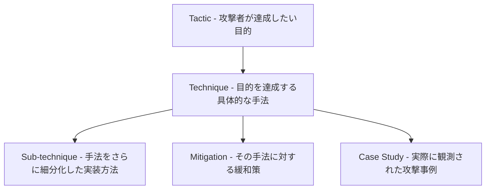
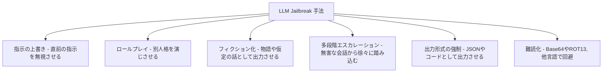
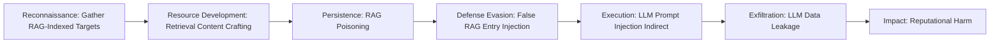

# MITRE ATLAS 完全ガイド ― AI/ML特化 攻撃者戦術・技術カタログを初学者向けに解説

> 対象読者: AIセキュリティ、AI Engineering、QAに関わり始めたばかりのエンジニア
> 前提知識: MITRE ATT&CKの基本用語(Tactics/Techniques)を聞いたことがある程度でOK

---

## 目次

1. [MITRE ATLASとは何か](#1-mitre-atlasとは何か)
2. [MITRE ATT&CKとの違い](#2-mitre-attckとの違い)
3. [ATLASの全体構造(データモデル)](#3-atlasの全体構造データモデル)
4. [16のTacticsを段階的に理解する](#4-16のtacticsを段階的に理解する)
5. [AI/ML特有の重要Techniques徹底解説](#5-aiml特有の重要techniques徹底解説)
6. [実際の攻撃チェーン例(複数Techniquesの連鎖)](#6-実際の攻撃チェーン例複数techniquesの連鎖)
7. [Mitigations(緩和策)の考え方と代表例](#7-mitigations緩和策の考え方と代表例)
8. [実在のCase Studies(ケーススタディ)](#8-実在のcase-studiesケーススタディ)
9. [ステップバイステップ: 組織にATLASを導入するベストプラクティス](#9-ステップバイステップ-組織にatlasを導入するベストプラクティス)
10. [他のAIセキュリティフレームワークとの関係](#10-他のaiセキュリティフレームワークとの関係)
11. [便利なツールとリソース](#11-便利なツールとリソース)
12. [まとめ](#12-まとめ)
13. [参考URL一覧](#13-参考url一覧)

---

## 1. MITRE ATLASとは何か

**MITRE ATLAS**(Adversarial Threat Landscape for Artificial-Intelligence Systems)は、AIおよび機械学習(ML)システムを狙う攻撃者の戦術・技術を体系化した、無償で公開されている「生きた」ナレッジベースです。非営利団体MITREが、産業界・政府・学術機関のコミュニティと協力しながら継続的に更新しています。2021年6月にMicrosoftとの協業から生まれ、現在はatlas.mitre.orgで公開されています。

ポイントは「理論上の脅威リスト」ではなく、**実際に観測された攻撃や、AIレッドチームによる実証済みのデモンストレーションに基づいて構築されている**という点です。ATLASは認証取得のための規格でも、コントロール(統制)カタログでもありません。あくまで「AIシステムがどのように攻撃されるか」を体系立てて理解するための知識ベースであり、脅威モデリング・レッドチーム演習・検知エンジニアリングに使うことを目的としています。

初学者がまず押さえるべきことは1つだけです。

> ATLAS = ATT&CKと同じ「Tactics → Techniques → Mitigations/Case Studies」という構造を、AI/ML特有の攻撃面(モデル、学習データ、推論API、RAG、AIエージェントなど)に適用したもの

---

## 2. MITRE ATT&CKとの違い

すでにサイバーセキュリティの世界で標準となっているMITRE ATT&CKと混同しやすいため、まず違いを整理します。

| 観点 | MITRE ATT&CK | MITRE ATLAS |
|---|---|---|
| 対象 | 従来型IT・クラウド・モバイル・OT環境全般 | AI/MLシステム(学習データ、モデル、推論API、生成AI、AIエージェント) |
| 誕生 | 2013年〜(Enterprise版は2015年公開) | 2021年6月(前身はAdversarial ML Threat Matrix、2020年) |
| Tactics | 14個(Enterprise) | 16個(うちAI Model Access・AI Attack Stagingの2つはAI特有。多くはATT&CKと共通の名称を継承しつつAI文脈で再定義) |
| 固有の攻撃 | ラテラルムーブメント、C2、ランサムウェアなど伝統的サイバー攻撃 | データポイズニング、プロンプトインジェクション、モデル抽出、RAGポイズニング、AIエージェント設定改ざんなど |
| 開発元 | MITRE | MITRE(Microsoftとの協業からスタート) |
| 関係性 | ATLASの土台。多くのTacticsはATT&CKのIDを引き継ぐ(例: ReconnaissanceはATT&CKのTA0043を参照) | ATT&CKを拡張し、AI特有の攻撃面を補完する |

つまり「ATT&CKはインフラの周りを攻める攻撃」、「ATLASはモデルそのものを攻める攻撃」を扱うと考えると整理しやすいです。実際の攻撃は両方のフレームワークをまたぐことが多く、実務では**両方を併用**するのが基本です。

なお、防御側の具体的な対策技術を体系化したMITRE D3FEND というフレームワークもあり、ATLASのTechniquesと対応付けて使われます。

---

## 3. ATLASの全体構造(データモデル)

ATLASのデータは5つの要素から構成されます。まずはこの構造を頭に入れることが、以降すべての理解の土台になります。

- **Tactic(戦術)**: 攻撃者が「なぜ」その行動を取るか、という目的レベルの分類。例: 「情報を盗みたい(Exfiltration)」
- **Technique(技術)**: 目的を達成する「どうやって」の部分。例: 「推論API経由で情報を盗む(Exfiltration via AI Inference API)」
- **Sub-technique(サブ技術)**: Techniqueをさらに具体化したもの。例: 「モデルそのものを丸ごと抽出する(Extract AI Model)」
- **Mitigation(緩和策)**: そのTechniqueを防ぐ、または検知するための対策
- **Case Study(ケーススタディ)**: 実際のインシデントやレッドチーム演習の記録。どのTactics/Techniquesが使われたかがタグ付けされている

2026年7月時点でATLASはおおよそ**16 Tactics、80以上のTechniques(サブテクニックを含めると140以上)、30以上のMitigations、40以上のCase Studies**を収録しています。ATLASは継続的に更新される生きたリソースであるため、正確な最新の数値は必ず公式サイト(atlas.mitre.org)またはGitHubリポジトリ(mitre-atlas/atlas-data)で確認してください。

---

## 4. 16のTacticsを段階的に理解する

ATLASのTacticsは、攻撃者が実際にたどる典型的なライフサイクルの順序で並んでいます。ただし公式ドキュメントも明言している通り、**これは「読みやすくするための順序」であり、攻撃者は任意の順序・同時並行でTacticsを使うことができます**。

まずは全体像をフェーズごとにグループ化した図で俯瞰しましょう。

```mermaid
flowchart LR
    subgraph P1["フェーズ1 - 準備"]
        direction TB
        T1["Reconnaissance 偵察"]
        T2["Resource Development リソース開発"]
    end
    subgraph P2["フェーズ2 - 侵入とモデルアクセス"]
        direction TB
        T3["Initial Access 初期アクセス"]
        T4["AI Model Access AIモデルアクセス"]
        T5["Execution 実行"]
    end
    subgraph P3["フェーズ3 - 居座りと回避"]
        direction TB
        T6["Persistence 永続化"]
        T7["Privilege Escalation 権限昇格"]
        T8["Defense Evasion 防御回避"]
        T9["Credential Access 認証情報アクセス"]
    end
    subgraph P4["フェーズ4 - 探索と展開"]
        direction TB
        T10["Discovery 発見"]
        T11["Lateral Movement 横展開"]
        T12["Collection 収集"]
    end
    subgraph P5["フェーズ5 - 攻撃準備と制御"]
        direction TB
        T13["AI Attack Staging AI攻撃準備"]
        T14["Command and Control C2"]
    end
    subgraph P6["フェーズ6 - 目的達成"]
        direction TB
        T15["Exfiltration 持ち出し"]
        T16["Impact 影響"]
    end
    P1 --> P2 --> P3 --> P4 --> P5 --> P6
```

続いて、それぞれのTacticを表で詳しく見ていきます。IDはATLAS公式データ(`AML.TA00xx`)に準拠しています。

| # | Tactic ID | 名称(英語 / 日本語) | 初学者向けの説明 |
|---|---|---|---|
| 1 | AML.TA0002 | Reconnaissance / 偵察 | 攻撃対象のAIシステムについて、論文・技術ブログ・APIの挙動などから情報を集める段階。攻撃を成功させるための下調べ。 |
| 2 | AML.TA0003 | Resource Development / リソース開発 | 攻撃に使うインフラ、アカウント、学習済みモデル、ツールなどを購入・作成・窃取して準備する段階。 |
| 3 | AML.TA0004 | Initial Access / 初期アクセス | 標的のAIシステムに最初の足がかりを得る段階。サプライチェーン経由や公開アプリの脆弱性利用など。 |
| 4 | AML.TA0000 | AI Model Access / AIモデルアクセス | AI特有のTactic。推論API経由、製品・サービス経由、物理環境経由など、モデルへのさまざまなレベルのアクセス手段を得る段階。 |
| 5 | AML.TA0005 | Execution / 実行 | 攻撃者が用意した悪意あるコードやプロンプトを標的システム上で実行させる段階。 |
| 6 | AML.TA0006 | Persistence / 永続化 | システム再起動や認証情報変更後もアクセスを維持する段階。汚染された学習データやモデルを仕込むことが多い。 |
| 7 | AML.TA0012 | Privilege Escalation / 権限昇格 | より高い権限を獲得する段階。設定ミスや脆弱性を悪用する。 |
| 8 | AML.TA0007 | Defense Evasion / 防御回避 | AIを活用したセキュリティ製品などによる検知を回避する段階。 |
| 9 | AML.TA0013 | Credential Access / 認証情報アクセス | アカウント名やパスワード、APIキーなどを盗み出す段階。 |
| 10 | AML.TA0008 | Discovery / 発見 | 侵入後、標的のAI環境(モデルの種類、エージェントの設定など)を探索し理解する段階。 |
| 11 | AML.TA0015 | Lateral Movement / 横展開 | モデルレジストリ、ベクトルデータベース、実験管理ツールなど、AI Ops基盤内の他システムへ移動する段階。 |
| 12 | AML.TA0009 | Collection / 収集 | 目的達成に必要なAIアーティファクトや関連情報をかき集める段階。 |
| 13 | AML.TA0001 | AI Attack Staging / AI攻撃準備 | AI特有のTactic。プロキシモデルの訓練、標的モデルのポイズニング、敵対的データの作成など、攻撃そのものを作り込む段階。 |
| 14 | AML.TA0014 | Command and Control / C2 | 侵害したAIシステムと通信し、遠隔から制御する段階。 |
| 15 | AML.TA0010 | Exfiltration / 持ち出し | モデルや学習データ、機密情報を外部に持ち出す段階。 |
| 16 | AML.TA0011 | Impact / 影響 | AIシステムの可用性や完全性を損ない、業務プロセスを操作・妨害・信頼失墜させる最終段階。 |

> 参照: [https://atlas.mitre.org/](https://atlas.mitre.org/)、[https://raw.githubusercontent.com/mitre-atlas/atlas-data/main/dist/ATLAS.yaml](https://raw.githubusercontent.com/mitre-atlas/atlas-data/main/dist/ATLAS.yaml)

---

## 5. AI/ML特有の重要Techniques徹底解説

ATT&CKと共通するTechniques(フィッシングやコマンドラインインタープリタの悪用など)は本ガイドでは割愛し、**AI/MLならではのTechniques**に絞って、初学者がまず押さえるべきものをステップバイステップで解説します。

### 5-1. 学習データ・モデルへの攻撃

#### Poison Training Data(AML.T0020)

攻撃者が学習データやそのラベルを改ざんし、モデルに気づかれにくい欠陥や裏口(バックドア)を埋め込む攻撃です。ポイントは「ラベルを変えなくても成立する場合がある」こと、そして仕込んだ欠陥は [Insert Backdoor Trigger](https://atlas.mitre.org/techniques/AML.T0043.004)(特定の入力パターン)によって後から起動される点です。汚染されたデータは、サプライチェーン経由([AI Supply Chain Compromise](https://atlas.mitre.org/techniques/AML.T0010)、AML.T0010)や、初期アクセス後の直接改ざんによって混入します。

#### Poison AI Model(AML.T0018.000)

学習データそのものではなく、**モデルの重み(weights)を直接書き換える**ことで挙動を変える攻撃です。ファインチューニングや訓練プロセスへの介入によっても実現できます。効果は特定カテゴリの誤分類のみに限定することも、性能全体を劣化させることも可能です。

#### AI Supply Chain Compromise(AML.T0010)

AI開発のサプライチェーン(ハードウェア、AIソフトウェアスタック、データ、モデルファイル、コンテナレジストリ)のいずれかを侵害して初期アクセスを得る攻撃です。サブテクニックとして以下があります。

| Sub-technique ID | 名称 | 内容 |
|---|---|---|
| AML.T0010.000 | Hardware | GPU・TPU・エッジデバイスなどハードウェアのサプライチェーンを狙う |
| AML.T0010.001 | AI Software | PyTorch、TensorFlow、LangChainなどのフレームワークや依存パッケージ、設定ファイルを狙う。LLMが幻覚で生成した架空パッケージ名を先回りして登録する「Slopsquatting」も含む |
| AML.T0010.002 | Data | 公開データセットやラベリング業務委託先を狙う |
| AML.T0010.003 | Model | 公開されているファインチューニング用のベースモデルを狙う |
| AML.T0010.004 | Container Registry | コンテナレジストリ内のイメージを改ざんし、CI/CDパイプライン経由で配布させる |

### 5-2. モデルへのアクセスと情報窃取

#### AI Model Inference API Access(AML.T0040)

推論APIへの正規のアクセス権を悪用して情報収集・攻撃検証・攻撃の実行を行う手法です。多くのアプリケーションが同じ基盤モデル(特にファウンデーションモデル)を利用しているため、ある推論APIで見つけたジェイルブレイクや幻覚の脆弱性が、同じモデルを使う他のサービスにも通用してしまう点が重要です。

#### Exfiltration via AI Inference API(AML.T0024)

推論API経由でプライベートな情報を盗み出す手法です。サブテクニックとして次の3つがあります。

| Sub-technique ID | 名称 | 内容 |
|---|---|---|
| AML.T0024.000 | Infer Training Data Membership | あるデータが学習データに含まれていたかどうかを推測する(メンバーシップ推論攻撃) |
| AML.T0024.001 | Invert AI Model | 推論APIが返す確信度スコアを使い、学習データを逆算的に復元する |
| AML.T0024.002 | Extract AI Model | 繰り返し推論APIを呼び出し、その入出力ペアから同等の性能を持つモデルを複製する(モデル抽出) |

モデル抽出は、[AI Intellectual Property Theft](https://atlas.mitre.org/techniques/AML.T0048.004)(知的財産窃取)という「External Harms」配下のTechniqueにもつながります。

#### Craft Adversarial Data(AML.T0043)

人間には元のデータと変わらないように見えるが、モデルには誤分類・誤検知を起こさせる「敵対的データ」を作成する手法です。攻撃者がモデルにどれだけアクセスできるかによって、White-Box Optimization(モデル内部を完全に把握した最適化)、Black-Box Optimization(API経由のみ)、Black-Box Transfer(代理モデルで作った攻撃を転用)、Manual Modification(手動での試行錯誤)という4つのアプローチがあります。

### 5-3. 生成AI・LLM特有の攻撃

#### LLM Prompt Injection(AML.T0051)

LLMに悪意あるプロンプトを入力し、本来の指示を無視させて攻撃者の指示に従わせる手法です。初学者がまず理解すべきは3つの侵入経路です。

- **Direct(AML.T0051.000)**: 攻撃者自身がユーザーとして直接プロンプトを入力する
- **Indirect(AML.T0051.001)**: Webページやデータベースなど、LLMが通常の処理で取り込む別のデータソース経由で間接的に注入される。ユーザーからは見えない・気づきにくい形で仕込まれることが多い
- **Triggered**: 特定のユーザー操作やシステムイベントをきっかけに発動する

#### LLM Jailbreak(AML.T0054)

LLMの安全性/アライメントの挙動やガードレールを無視・回避・上書きさせ、本来出力を控えるはずの内容を引き出す手法です。プロンプトによる手法と、モデルの重みや安全機構そのものを改変する手法の2系統があります。代表的なプロンプト戦略を整理すると以下のようになります。

これらは手動のプロンプトだけでなく、AutoDANやGPTFUZZERのようなアルゴリズムによる自動生成でも作られます。また、オープンソースモデルに対しては、ファインチューニングや重み編集によって拒否機能そのものを取り除いた「アンセンサード(uncensored)」モデルが公開・共有されることもあります。

#### RAGシステムを狙う攻撃群

RAG(Retrieval Augmented Generation)は近年のATLAS拡張で急速に手厚くなった領域です。攻撃の流れとしては次の4つのTechniquesが連携します。

| Technique ID | 名称 | 役割 |
|---|---|---|
| AML.T0064 | Gather RAG-Indexed Targets | RAGが参照している外部データソースを特定する(偵察) |
| AML.T0066 | Retrieval Content Crafting | 検索でヒットするように仕込んだ文書を作成する(リソース開発) |
| AML.T0070 | RAG Poisoning | 作成した悪意ある文書をRAGのインデックスに混入させる(永続化) |
| AML.T0071 | False RAG Entry Injection | 正規のRAGエントリの中に偽の文書を紛れ込ませ、監視をすり抜けつつ削除されにくくする(防御回避) |

#### AIエージェントを狙う攻撃群(2025年以降に大幅拡充)

AIエージェントやMCP(Model Context Protocol)の普及に伴い追加された、比較的新しいTechniques群です。

| Technique ID | 名称 | 内容 |
|---|---|---|
| AML.T0053 | AI Agent Tool Invocation | エージェントが利用できるツール(API連携・コード実行など)を、権限を持つアクセスを悪用して不正に呼び出す |
| AML.T0080 | AI Agent Context Poisoning | エージェントのLLMが参照するコンテキスト(記憶やスレッド)を汚染し、以後の応答や行動を持続的に操作する。サブテクニックはMemory(記憶への注入)とThread(会話スレッドへの注入) |
| AML.T0081 | Modify AI Agent Configuration | エージェントの設定ファイル(システムプロンプト、ナレッジソース、接続ツールの設定)を改ざんし、安全機構を弱体化させる |
| AML.T0084 | Discover AI Agent Configuration | エージェントがどんなツールにアクセスできるかを、設定ダッシュボードや質問への応答から探る(偵察・発見) |
| AML.T0082 | RAG Credential Harvesting | 社内文書に含まれる認証情報がRAGデータベースに誤って取り込まれ、エージェント経由で読み出されてしまう |
| AML.T0083 | Credentials from AI Agent Configuration | エージェントの設定ファイルに平文で保存されがちなAPIキーやトークンを窃取する |

#### 幻覚(Hallucination)を悪用する攻撃

| Technique ID | 名称 | 内容 |
|---|---|---|
| AML.T0062 | Discover LLM Hallucinations | LLMに繰り返し質問し、実在しないパッケージ名・URL・組織名などの幻覚を発見する |
| AML.T0060 | Publish Hallucinated Entities | 発見した幻覚(架空のパッケージ名など)を実際に攻撃者が登録・公開し、ユーザーがLLMの提案どおりにアクセスすると攻撃者の罠にかかる(いわゆる「Slopsquatting」) |

---

## 6. 実際の攻撃チェーン例(複数Techniquesの連鎖)

ATLASを理解する上で重要なのは、単一のTechniqueではなく、**複数のTacticsをまたいだ攻撃チェーン**として読み解く視点です。ここでは「RAGを踏み台にした情報漏洩」という典型的なシナリオを図解します。

読み方は次の通りです。

1. 攻撃者はまずRAGが参照しているデータソースを調査する(偵察)
2. そのデータソースに紛れ込ませる罠の文書を作成する(リソース開発)
3. 罠の文書をRAGのインデックスに混入させ居座らせる(永続化)
4. 監視をすり抜けるよう偽装して埋め込む(防御回避)
5. ユーザーがRAG経由で罠の文書を取得した瞬間、間接プロンプトインジェクションが発動する(実行)
6. LLMが機密情報を応答に含めて漏洩させる(持ち出し)
7. 最終的に組織の評判や信頼が損なわれる(影響)

このように図式化すると、「1つのTechniqueだけを対策しても、他のTechniqueで迂回されてしまう」という多層防御の必要性が直感的に理解できます。

---

## 7. Mitigations(緩和策)の考え方と代表例

ATLASのMitigationsは`AML.M00xx`というIDで管理されており、1つのTechniqueに対して複数のMitigationsが、また1つのMitigationsが複数のTechniquesに効くという多対多の関係になっています。代表的なものを紹介します。

| Mitigation ID | 名称 | 内容 |
|---|---|---|
| AML.M0000 | Limit Public Release of Information | 組織のAIスタックに関する技術情報の公開範囲を制限する。偵察(Reconnaissance)対策の基本 |
| AML.M0001 | Limit Model Artifact Release | 本番で使用しているデータ・アルゴリズム・モデルアーキテクチャの公開を制限する |
| AML.M0004 | Restrict Number of Queries | 推論APIへのクエリ数を制限し、Cost HarvestingやModel Extractionを難しくする |
| AML.M0013/M0014 | 供給元・アーティファクトの検証 | 外部から取得したデータセットやモデルの出所・整合性を検証する |
| AML.M0015 | Adversarial Input Detection | 通常の利用パターンから統計的に逸脱する入力をML的に検知する |
| AML.M0020 | GenAI Guardrails | モデルとユーザーの間にフィルタを設置し、攻撃的な入力を到達前にブロックする |
| AML.M0023 | AI Bill of Materials(AI BOM) | 使用しているモデル・データセット・依存パッケージを台帳管理し、サプライチェーンリスクを可視化する |
| AML.M0024 | AI Telemetry Logging | 推論への入力を記録し、インジェクションパターンなどを事後的に検知できるようにする |
| AML.M0026 | 最小権限の原則(Least Privilege) | AIエージェントに付与するツール権限を必要最小限にする |
| AML.M0029 | Human-in-the-loop承認 | 重大な操作を行う前に人間の承認を必須にする |
| AML.M0030 | Restrict Tool Invocation | 信頼できないデータ(RAG結果など)を根拠にしたツール呼び出しを制限する |

> 注: Mitigation IDと内容の対応関係は継続的に更新されるため、正確な最新の一覧は必ず公式ページ[https://atlas.mitre.org/mitigations](https://atlas.mitre.org/mitigations)を参照してください。本表は代表例の紹介であり、全網羅ではありません。

実務で重要なのは、「1つのTechniqueに複数の段階(開発時・デプロイ時・運用時監視)でMitigationsを重ねる」という**多層防御(defense in depth)**の考え方です。例えばモデル抽出(AML.T0024.002)への対策は、クエリ数制限(開発/運用)、出力の忠実度低減(開発)、異常検知(運用監視)を組み合わせて初めて実効性を持ちます。

---

## 8. 実在のCase Studies(ケーススタディ)

ATLASの最大の強みは、抽象的な脅威論ではなく**実際に発生した、または実証されたインシデント**を根拠にしている点です。代表的なCase Studiesを紹介します。

| Case Study ID | 名称 | 概要 |
|---|---|---|
| AML.CS0019 | PoisonGPT | 研究者がHuggingFaceから取得したオープンソースLLM(GPT-J-6B)の重みをRank-One Model Editing(ROME)で改変し、特定の質問に虚偽の回答をするよう仕込んだ上で、酷似した名前のリポジトリとして再公開した実証実験。ベンチマーク上の精度低下はごくわずかで、気づかれにくいことを示した。 |
| AML.CS0003 | ML型セキュリティ製品の回避 | 敵対的摂動を加えたマルウェアを作成し、モデルアーキテクチャの内部を知らない状態でも機械学習ベースのエンドポイントセキュリティ製品による検知を回避できることを示した事例。 |
| AML.CS0042 | SesameOp(AIエージェントバックドア) | AIエージェントの仕組みを悪用してバックドアを仕込み、持続的なアクセスを確立した事例。 |
| AML.CS0031 | 誤設定コンテナレジストリからのAIモデル露出 | 研究者がインターネット上に公開されている、書き込み権限まで許可された誤設定コンテナレジストリを大量に発見し、その中から機密性の高いAIモデルを多数収集できてしまった事例。 |
| - | ChatGPT Plugin Privacy Leak(2023) | 悪意あるWebサイトをChatGPTプラグイン経由で読み込ませることで間接プロンプトインジェクションを成立させ、チャットセッションを乗っ取って会話履歴を持ち出せることを示した事例。 |
| - | MathGPT Code Execution(2023) | GPT-3を利用した数学問題解答サービスに対しプロンプトインジェクションを行い、ホストシステムの環境変数やアプリケーションコードへのアクセスを奪取した事例。 |
| - | Morris II(自己複製プロンプトワーム) | メールに埋め込んだプロンプトが、RAGによるメール本文の取り込みを通じてユーザー操作なしに実行され、個人情報を持ち出しつつ自分自身を複製して他のエージェントにも感染を広げた実証実験。 |
| - | Microsoft Tay(2016) | 公開されたチャットボットがユーザーからの入力を学習し続けたことで、悪意あるユーザー群による大量投稿によって不適切な発言をするよう誘導された、生成AI以前からの古典的な事例。 |
| - | Deepfakeによるモバイル本人確認(KYC)突破 | ソーシャルエンジニアリングで得た本人の情報をもとにディープフェイク生成ツールを用い、仮想カメラで物理カメラ要件を回避し、銀行アプリの生体認証(liveness detection)を突破した事例。 |

> 一次情報は[https://atlas.mitre.org/studies](https://atlas.mitre.org/studies)にすべて掲載されています。Case StudyのIDが未確定のものは、公式サイトで名称検索することで該当ページを特定できます。

---

## 9. ステップバイステップ: 組織にATLASを導入するベストプラクティス

ここからは「ATLASを読んで終わり」にせず、実務でどう活かすかを段階的に解説します。

### Step 1: AI資産のインベントリ作成

まず、組織内にどのAIモデル・AIエージェント・MCPサーバー・RAGデータソースが存在するかを棚卸しします。Discovery系のTechniques(例: [Discover AI Agent Configuration](https://atlas.mitre.org/techniques/AML.T0084))は、そもそも攻撃者があなたの組織のAI資産を「偵察」する行為そのものです。自組織がインベントリを持っていなければ、攻撃者との情報の非対称性で最初から負けている状態になります。

### Step 2: ATLAS Navigatorでシステムマップに脅威モデリングを適用

インベントリができたら、システム構成図の各コンポーネントに対して、関連するTacticsとTechniquesを当てはめていきます。「ここでは誰がどんな影響力を行使できるか」「どのような統制がすでに存在するか」を1つずつ確認し、リスクの所有者(オーナー)を明確にします。オーナーが曖昧なリスクは対策が進みません。

### Step 3: 優先度の高いTechniquesにMitigationsをマッピングする

すべてのTechniquesに同時に対応するのは非現実的です。自組織のAIシステムの用途(予測型AIか、生成AI/LLMか、AIエージェントか)に応じて、影響度と実現可能性が高いTechniquesから優先的にMitigationsを適用します。

### Step 4: ATLASのTechniquesを使ったレッドチーム演習を実施する

現実的な被害を想定したシナリオでレッドチーム演習を行います。生成AIシステムであれば、プロンプト操作、検索コンテキストへの干渉、間接プロンプトインジェクションなどが代表的な演習シナリオになります。ATLAS ArsenalというCALDERAプラグインを使うと、こうした演習を自動化できます。

### Step 5: 検知ルールとログ収集(Telemetry)を整備する

AI Telemetry Logging(AML.M0024)のように、推論への入力や出力を記録し、後から異常なパターンを分析できる体制を整えます。検知エンジニアリングにおいては、Case Studiesで使われた具体的な攻撃パターン(プロンプト例など)を参考にすることが有効です。

### Step 6: 継続的な更新への追従

ATLASは継続的に更新されるリソースです。特にAIエージェントやMCP関連のTechniquesは2025年以降に急速に拡充されています。四半期に一度など定期的に公式サイトやGitHubの更新履歴(CHANGELOG)を確認し、自組織の脅威モデルをアップデートする運用サイクルを組み込みましょう。

---

## 10. 他のAIセキュリティフレームワークとの関係

ATLASは単独で使うものではなく、他のフレームワークと組み合わせることで真価を発揮します。それぞれの役割分担を整理します。

| フレームワーク | 位置づけ | ATLASとの関係 |
|---|---|---|
| OWASP LLM Top 10 / Agentic Top 10 | 開発者向けの「最重要リスクの優先順位付けリスト」 | ATLASは攻撃者視点のTTP(戦術・技術・手順)カタログ、OWASPは開発者視点の脆弱性チェックリスト。例: プロンプトインジェクションはATLASのAML.T0051、OWASPのLLM01に相当し、開発・コードレビュー段階ではOWASP、運用・脅威モデリング・検知段階ではATLASを使うのが基本的な使い分け |
| NIST AI RMF | AIリスクをガバナンスするためのマネジメントフレームワーク | ATLASはNIST AI RMFの「Map」「Measure」フェーズで参照する具体的な脅威情報源として機能する |
| MITRE D3FEND | 防御側の対策技術カタログ | ATLASのTechniquesに対応する具体的な防御手法(検知・回避・強化など)を提供する |
| Google SAIF | Googleが提唱するAIセキュリティの実践フレームワーク | 高レベルの原則を提示し、ATLASはその原則を裏付ける具体的な攻撃事例・技術詳細を提供する |
| ISO/IEC 42001 | AIマネジメントシステムの国際規格 | 組織のAIガバナンス全体の要求事項を規定し、ATLASはリスクアセスメントの具体的なインプットとして活用される |

一言でまとめると、「**ATLASは脅威(攻撃者側)の情報源、他のフレームワークはガバナンス・統制(防御側)の枠組み**」という役割分担になります。どちらか一方だけでは不十分で、組み合わせて初めて実務で機能します。

---

## 11. 便利なツールとリソース

| ツール名 | 概要 |
|---|---|
| ATLAS Navigator | ブラウザ上でATLASマトリクスを可視化し、脅威モデリングやカバレッジのマッピングができるWebツール。JSON/Excel/SVG形式でのエクスポートにも対応 |
| ATLAS Arsenal | Microsoftとの協業で開発された、AIレッドチーム演習を自動化するCALDERAプラグイン |
| AI Incident Sharing Initiative | 匿名化されたインシデント報告を通じて、コミュニティで脅威インテリジェンスを共有する仕組み |
| atlas-data(GitHub) | ATLASの全データをYAML/JSON/STIX 2.1形式で配布しているリポジトリ。自前のツールにATLASデータを組み込みたい場合はここから取得する |

---

## 12. まとめ

- MITRE ATLASは、AI/MLシステムを狙う攻撃者の戦術・技術を体系化した無償のナレッジベースであり、MITRE ATT&CKと同じ「Tactics → Techniques → Mitigations/Case Studies」という構造を採用している
- ATT&CKが伝統的なIT/クラウド環境を対象とするのに対し、ATLASはモデル・学習データ・推論API・RAG・AIエージェントといったAI特有の攻撃面を扱う
- 全16のTacticsは攻撃者の典型的なライフサイクルに沿って並んでいるが、実際の攻撃では順序も並行度も自由である
- プロンプトインジェクション、ジェイルブレイク、RAGポイズニング、AIエージェントのコンテキスト汚染など、生成AI・AIエージェント特有のTechniquesが2023年以降急速に拡充されている
- ATLASは単独で使うのではなく、OWASP LLM Top 10、NIST AI RMF、ISO/IEC 42001などのガバナンスフレームワークと組み合わせて実務に落とし込む
- 継続的に更新される「生きた」リソースであるため、定期的に公式サイト・GitHubを確認し続けることが重要

---

## 13. 参考URL一覧

- MITRE ATLAS公式サイト: [https://atlas.mitre.org/](https://atlas.mitre.org/)
- ATLASマトリクス(全体像): [https://atlas.mitre.org/matrices/ATLAS](https://atlas.mitre.org/matrices/ATLAS)
- ATLAS Case Studies一覧: [https://atlas.mitre.org/studies](https://atlas.mitre.org/studies)
- ATLAS Mitigations一覧: [https://atlas.mitre.org/mitigations](https://atlas.mitre.org/mitigations)
- ATLAS Navigator: [https://mitre-atlas.github.io/atlas-navigator/](https://mitre-atlas.github.io/atlas-navigator/)
- ATLASデータ(GitHubリポジトリ、YAML/JSON/STIX形式): [https://github.com/mitre-atlas/atlas-data](https://github.com/mitre-atlas/atlas-data)
- ATLAS公式データ(レガシーYAML、非推奨だが参照可能): [https://raw.githubusercontent.com/mitre-atlas/atlas-data/main/dist/ATLAS.yaml](https://raw.githubusercontent.com/mitre-atlas/atlas-data/main/dist/ATLAS.yaml)
- MITRE公式プレスリリース(生成AI拡張、2023年11月): [https://www.mitre.org/news-insights/news-release/mitre-and-microsoft-collaborate-address-generative-ai-security-risks](https://www.mitre.org/news-insights/news-release/mitre-and-microsoft-collaborate-address-generative-ai-security-risks)
- ATLAS概要説明(MITRE ATLASリード, NIST発表資料 2025年9月): [https://csrc.nist.gov/csrc/media/Presentations/2025/mitre-atlas/TuePM2.1-MITRE%20ATLAS%20Overview%20Sept%202025.pdf](https://csrc.nist.gov/csrc/media/Presentations/2025/mitre-atlas/TuePM2.1-MITRE%20ATLAS%20Overview%20Sept%202025.pdf)
- MITRE ATLAS for Agentic AI(2026年最新動向の解説): [https://anomity.ai/blog/mitre-atlas-agentic-ai-threats-guide/](https://anomity.ai/blog/mitre-atlas-agentic-ai-threats-guide/)
- MITRE ATLAS: AI security framework解説(16 Tactics/84 Techniquesの数値根拠): [https://www.vectra.ai/topics/mitre-atlas](https://www.vectra.ai/topics/mitre-atlas)
- MITRE ATLAS: AI Threat Framework & Compliance Guide(バージョン5.4.0時点の統計): [https://aisigil.com/mitre-atlas/](https://aisigil.com/mitre-atlas/)
- MITRE ATLAS Framework 2026 Guide(ATT&CKとの比較・FAQ形式): [https://www.practical-devsecops.com/mitre-atlas-framework-guide-securing-ai-systems/](https://www.practical-devsecops.com/mitre-atlas-framework-guide-securing-ai-systems/)
- The Ultimate Guide to MITRE ATLAS 2026: [https://www.getastra.com/blog/security-audit/mitre-atlas/](https://www.getastra.com/blog/security-audit/mitre-atlas/)
- What is MITRE ATLAS?(CrowdStrike): [https://www.crowdstrike.com/en-us/cybersecurity-101/artificial-intelligence/mitre-atlas/](https://www.crowdstrike.com/en-us/cybersecurity-101/artificial-intelligence/mitre-atlas/)
- Understanding the MITRE ATLAS Matrix for AI Threats(PointGuard AI): [https://www.pointguardai.com/blog/understanding-the-mitre-atlas-matrix-for-ai-threats](https://www.pointguardai.com/blog/understanding-the-mitre-atlas-matrix-for-ai-threats)
- MITREの規制フレームワークとしての解説(Palo Alto Networks): [https://www.paloaltonetworks.com/cyberpedia/mitre-sensible-regulatory-framework-atlas-matrix](https://www.paloaltonetworks.com/cyberpedia/mitre-sensible-regulatory-framework-atlas-matrix)
- MITRE ATLAS Matrix Overview(DETECTX): [https://www.detectx.com.au/atlas-matrix-overview/](https://www.detectx.com.au/atlas-matrix-overview/)
- MITRE ATLAS: How can AI be attacked?(Tarlogic、日本語圏でも読みやすい概説): [https://www.tarlogic.com/blog/mitre-atlas/](https://www.tarlogic.com/blog/mitre-atlas/)
- MITRE ATLAS Framework: AI Attack Techniques Mapped to Red-Team Operations(Repello AI): [https://repello.ai/blog/mitre-atlas-framework](https://repello.ai/blog/mitre-atlas-framework)
- MITRE ATLAS(DeepTeam、レッドチームフレームワークでの実装例): [https://www.trydeepteam.com/docs/frameworks-mitre-atlas](https://www.trydeepteam.com/docs/frameworks-mitre-atlas)
- Security Considerations for Multi-agent Systems(arXiv、RAG系Techniquesの学術的裏付け): [https://arxiv.org/pdf/2603.09002](https://arxiv.org/pdf/2603.09002)
- PoisonGPT Case Study詳細解説: [https://www.startupdefense.io/mitre-atlas-case-studies/aml-cs0019-poisongpt](https://www.startupdefense.io/mitre-atlas-case-studies/aml-cs0019-poisongpt)
- AI Threat Modeling & MITRE ATLAS Interview Q&A(Case Studies事例集): [https://ai.techclick.in/blog_ai_threat_modeling_interview_qa](https://ai.techclick.in/blog_ai_threat_modeling_interview_qa)
- ATLASとOWASP LLM Top 10のMitigationsマッピング解説: [https://blog.ogwilliam.com/post/mapping-mitre-atlas-mitigations-owasp-top-10-llms](https://blog.ogwilliam.com/post/mapping-mitre-atlas-mitigations-owasp-top-10-llms)
- AIUC-1 x MITRE ATLASクロスウォーク(Mitigations ID解説): [https://www.aiuc-1.com/crosswalks/mitre-atlas](https://www.aiuc-1.com/crosswalks/mitre-atlas)
- MITRE ATLAS Course of Action(MISP galaxy、Mitigationsの外部参照): [https://misp-galaxy.org/mitre-atlas-course-of-action/](https://misp-galaxy.org/mitre-atlas-course-of-action/)
- SAFE-AIレポート(NIST SP 800-53とのマッピング、MITRE公式PDF): [https://atlas.mitre.org/pdf-files/SAFEAI_Full_Report.pdf](https://atlas.mitre.org/pdf-files/SAFEAI_Full_Report.pdf)
- From Theory to Practice: Implementing MITRE ATLAS Defenses: [https://medium.com/@michael.hannecke/from-theory-to-practice-implementing-mitre-atlas-defenses-77dde19f9769](https://medium.com/@michael.hannecke/from-theory-to-practice-implementing-mitre-atlas-defenses-77dde19f9769)

---

*本ガイドは2026年7月時点で参照可能な情報をもとに作成しています。ATLASは継続的に更新される生きたナレッジベースであるため、最新のTactics/Techniques/Mitigations/Case Studiesの一覧は必ず公式サイト(atlas.mitre.org)でご確認ください。*