# Secure by Design 入門ガイド 〜「設計」でセキュリティを実現する考え方を、ステップバイステップで学ぶ〜

> **対象読者**: セキュリティの専門家ではないが、Java / C# / TypeScript など何らかの言語でアプリケーションを設計・実装・テストしている初学者〜中級者
> **情報の基準日**: 2026年10月8日時点(Web検索で確認できた範囲)
> **主な土台**: Manning 刊『Secure by Design』(Dan Bergh Johnsson / Daniel Deogun / Daniel Sawano 著、2019年9月刊、400ページ)
> **補強資料**: Google の Christoph Kern 氏の Safe Coding、IEEE Center for Secure Design、CISA ほか各国政府機関の Secure by Design 指針、Matt Raible 氏の書評・解説 ほか

---

## 0. このガイドの使い方

### 0.1 このガイドで分かること

1. 「Secure by Design(設計によるセキュリティ)」とは何か、なぜ「あとから足すセキュリティ」より強いのか
2. 書籍が提案する **コードレベルの具体的な設計テクニック**(不変性・フェイルファスト・バリデーション・ドメインプリミティブ・エンティティの設計 など)
3. **テスト・デリバリーパイプライン・障害設計・クラウド設計** にまで広がる設計の考え方
4. 世の中でよく混同される「**CISA などが推進する製品セキュリティ原則としての Secure by Design**」との違いと関係
5. 明日から現場で使える **チェックリスト・演習・理解度確認**

### 0.2 重要な前提(著作権・正確性について)

- 書籍の内容は **目次・公式紹介ページ・著者の無料公開記事・公開スライド・書評** をもとに、私(筆者)が自分の言葉で再構成しています。書籍本文の転載ではありません。**詳細な議論やコード全体は必ず書籍で確認してください。**
- コード例は、考え方を説明するために **本ガイド用に新しく書いたオリジナル** です(書籍のコードそのものではありません)。
- Java のコード例は `List.copyOf`(JDK 10 以降)と `instanceof` のパターンマッチング(JDK 16 以降)を使うため、**JDK 16 以降** を前提とします。
- 書籍の第12章(レガシー)・第13章(マイクロサービス)は、私が参照できた範囲では詳細な目次までは確認できませんでした。該当箇所は「**書評・目次レベルで確認できた内容**」と「**筆者の一般的な整理**」を区別して記載しています。

### 0.3 全体の学習ステップ

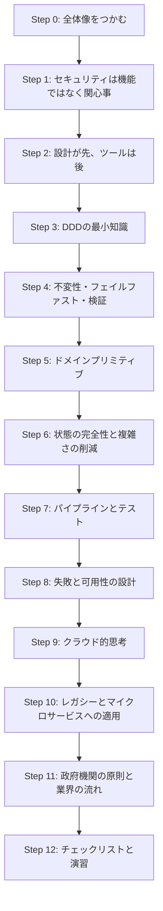

---

## 1. Step 0 ── Secure by Design とは何か(まず全体像)

### 1.1 一言でいうと

> **セキュリティを「あとから足す機能」ではなく、「良い設計の自然な結果」として手に入れる考え方。**

書籍の公式紹介では、セキュリティは開発プロセスの自然な成果物であるべきだと述べられ、設計を主な推進力としてセキュリティを実現するアプローチが解説されています。また、著者らは「開発者は開発者であり、セキュリティは副次的な関心事になりがちだ」という現実を踏まえ、**日々の設計習慣の中で自然に安全になる作り方**を目指していると紹介されています。

### 1.2 「Secure by Design」という言葉が指す2つの文脈

同じ言葉が、少し違う意味で使われています。混同しないことが最初の重要ポイントです。

| 観点 | ① 書籍の Secure by Design | ② CISA 等の Secure by Design |
|---|---|---|
| 主な主体 | 開発者・設計者(コードを書く人) | ソフトウェア製造事業者(経営層を含む組織) |
| 主な関心 | コード・ドメインモデル・テスト・運用の **設計技法** | 製品が顧客に与える **セキュリティ成果** と、その説明責任 |
| 代表的な内容 | ドメインプリミティブ、不変性、フェイルファスト、レジリエンス | 顧客のセキュリティ成果への責任、徹底した透明性、トップの主導、7つのゴールの誓約 |
| 性質 | 技術書・設計の実践知 | 政府機関の共同ガイダンス・自主的な誓約(pledge) |
| 両者の関係 | **「どう作るか」の具体的手段** | **「何を目指し、どう説明するか」の方針** |

> 💡 初学者向けの整理: ①は「手を動かす人の設計ワザ」、②は「組織として何にコミットするかの宣言」。②の目標(例:脆弱性のクラス全体を減らす)を達成するための具体的手段として、①の技法が役に立ちます。

### 1.3 「あとから足す」vs「設計に織り込む」

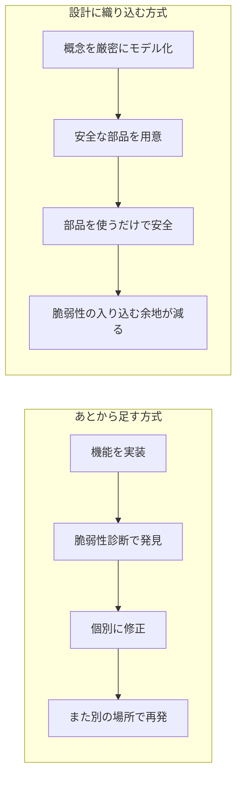

| 比較項目 | あとから足す方式 | 設計に織り込む方式 |
|---|---|---|
| 開発者に求める知識 | 全員がセキュリティ専門家になる必要がある | 設計部品の使い方を知っていれば良い |
| 漏れの起きやすさ | 人が思い出さないと漏れる | 部品を使えば自動的に守られる |
| コスト | 発見・修正を繰り返すため後半ほど高い | 初期に設計コストがかかるが、再発しにくい |
| 脆弱性への姿勢 | 個々のバグ(インスタンス)を潰す | バグが生まれる **構造そのもの** を潰す |

---

## 2. Step 1 ── セキュリティは「機能」ではなく「関心事」

(書籍 第1章 "Why design matters for security" の前半に相当)

### 2.1 機能(Feature)と関心事(Concern)の違い

書籍第1章の節見出しには「セキュリティは機能ではなく関心事である」という趣旨のものがあります。ここでの考え方を整理するとこうなります。

| 種類 | 例 | 特徴 |
|---|---|---|
| **セキュリティ機能** | ログイン画面、パスワードハッシュ、アクセス制御、暗号化ライブラリ | バックログに積んで「作れば完了」にできる |
| **セキュリティ関心事** | 入力が正しい範囲に収まっているか、状態が壊れないか、障害時に情報が漏れないか | 全ての機能・全てのコードに **横断的に** 関わる。「完了」の概念がない |

> 例えるなら、**「鍵」は機能ですが、「家の間取り・壁・窓の位置」は関心事** です。いくら高級な鍵を付けても、壁に穴が空いていれば守れません。

### 2.2 セキュリティ関心事の分類: CIA-T

書籍は、セキュリティ関心事を **CIA-T** という4つの観点で整理します(CIA に T を加えたもの)。

| 文字 | 観点 | 意味(平易な説明) | よくある設計上の落とし穴の例 |
|---|---|---|---|
| **C** | Confidentiality(機密性) | 見てはいけない人に見せない | ログや例外メッセージに個人情報が混ざる |
| **I** | Integrity(完全性) | データ・状態が勝手に壊れない/改ざんされない | 不正な値(負の数量など)がシステムに入り込む |
| **A** | Availability(可用性) | 必要な時に使える | 1件の重い処理や外部障害で全体が止まる |
| **T** | Traceability(追跡可能性) | 誰が何をしたか後から追える | 監査ログが残らない/改ざんできる |

> 書籍では T を Traceability として扱うと私は理解していますが、定義の細部は書籍本文で確認してください。

### 2.3 従来のセキュリティアプローチの限界

書籍第1章は、従来のやり方の問題点として次の3つの節を立てています。

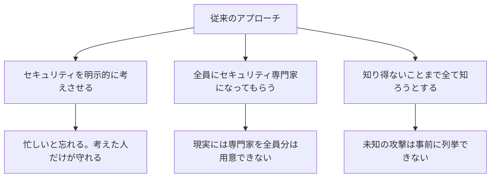

> 💡 Matt Raible 氏(Java Champion、Okta の開発者支援担当として知られる)は書評で、**開発者にセキュリティ関連 API 呼び出しを毎回思い出させる方式は難しく、セキュリティを設計に焼き込むほうが開発者は自然に安全になる**、という趣旨で本書の第1章を評価しています。

---

## 3. Step 2 ── 「設計」とは何か、設計でセキュリティを駆動する

### 3.1 設計の定義(広く捉える)

書籍は「設計」をコード1行〜アーキテクチャ全体にまたがる活動として扱います。つまり **クラス名・型・メソッドシグネチャの決め方も立派な設計** です。

| 設計のレベル | 具体例 | セキュリティへの効き方 |
|---|---|---|
| コード | 型の選び方、引数の型、例外の投げ方 | 不正値を「そもそも表現できない」ようにする |
| クラス/モジュール | エンティティの作り方、公開APIの形 | 不整合な状態を作れないようにする |
| アーキテクチャ | サービス分割、外部連携、設定管理 | 障害や侵害が全体に波及しないようにする |
| 運用/パイプライン | テスト、デプロイ、設定のコード化 | 設定ミスや回帰を自動で検出する |

### 3.2 ユーザーそのものを Secure by Design にする

第1章には「ユーザーを secure by design にする」という趣旨の節があります。ここでの含意は次のとおりです。

- 利用者(開発者を含む)が **間違った使い方をしにくい** 設計にする
- 安全な使い方を **いちばん楽な使い方** にする(安全な方がデフォルト)

これは後の章の「安全な部品(ドメインプリミティブ)を用意して、開発者はそれを使うだけ」という考え方につながります。

### 3.3 設計アプローチの利点と「折衷主義(eclectic)」

- 設計でセキュリティを駆動する利点: 開発者の日常作業に溶け込むため、継続しやすい
- ただし書籍は **設計だけが万能ではなく、他の手法と併用する** という姿勢(節見出し "Staying eclectic")も示しています。ペネトレーションテストや運用監視を捨てる話ではありません。

### 3.4 ケーススタディ: 「Billion Laughs」攻撃(XML)

第1章の後半では、文字列と XML を扱うときの **Billion Laughs 攻撃** を題材に、設計の考え方を適用します。

**どんな攻撃か(要点)**: XML の「内部エンティティ(置換用の名前)」を入れ子に定義して、パーサーに展開させると、小さな入力から巨大なデータが生成され、メモリや CPU を使い果たす(可用性の侵害)。

**書籍の節構成が示す対処の流れ**:

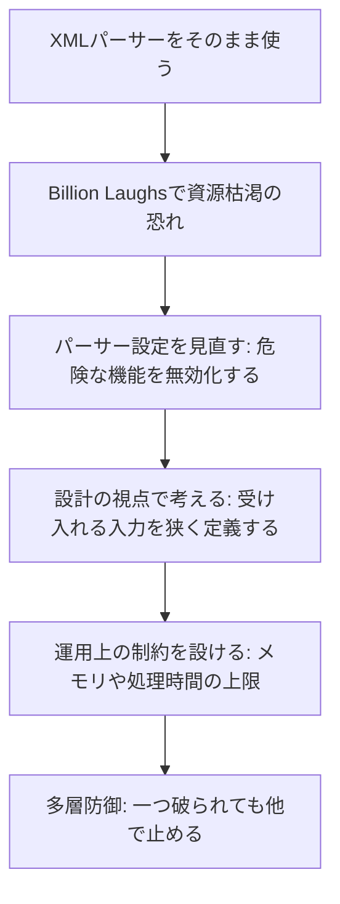

| 層 | 対策の方向性 | 狙い |
|---|---|---|
| パーサー設定 | 外部/巨大なエンティティ展開などの危険機能を無効にする | 攻撃経路そのものを塞ぐ |
| 設計 | 本当に必要な XML の形だけを受け付ける | 「受け入れ範囲」を狭くする |
| 運用制約 | メモリ・CPU・タイムアウトなどの上限 | 万一入り込んでも被害を限定 |
| 多層防御 | 上記を組み合わせる | 単一対策の抜けを補う |

> 具体的なパーサー設定のプロパティ名は言語・ライブラリごとに異なります。使用中のライブラリの公式ドキュメントで必ず確認してください。

---

## 4. Step 3 ── DDD(ドメイン駆動設計)の最小知識

(書籍 第3章 "Core concepts of Domain-Driven Design" に相当)

書籍の第2章(中間章)ではオンライン書店を題材にした例が展開され、第3章で DDD の核心概念を押さえます。**セキュリティの本ではありますが、DDD を知らないと次章以降の「ドメインプリミティブ」が理解しにくい**ため、必要最小限をここで整理します。

### 4.1 用語集(初学者向け)

| 用語 | 平易な説明 | 例 |
|---|---|---|
| ドメイン | 解きたい業務・問題領域 | オンライン書店、銀行、予約システム |
| ユビキタス言語 | 開発者と業務担当者が **同じ言葉** で話すための共通語彙 | 「数量」「注文」「配送先」を全員が同じ意味で使う |
| 境界づけられたコンテキスト | ある言葉の **意味が成り立つ範囲** | 「顧客」の意味は営業とサポートで違うことがある |
| 値オブジェクト | **値そのもの** で同一性が決まる不変の概念 | 金額、日付、メールアドレス |
| エンティティ | **ID** で同一性が決まり、時間とともに状態が変わる概念 | 注文、ユーザーアカウント |
| 集約 | 一貫性を保つ単位としてまとめたエンティティ群 | 注文と注文明細 |

### 4.2 なぜセキュリティに効くのか

- 言葉の意味が **曖昧** だと、コードも曖昧になり、その隙間が脆弱性になる
- 「この概念は何であり、何でないか」を詰める作業が、そのまま **不正値を弾くルール(不変条件)** の発見になる

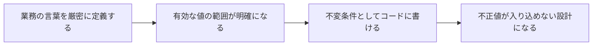

---

## 5. Step 4 ── コード構成要素: 不変性・フェイルファスト・バリデーション

(書籍 第4章 "Code constructs promoting security" に相当)

第4章は3つの柱で構成され、それぞれが解く問題が対応づけられています。

| 柱 | 主に解決する問題 |
|---|---|
| 不変性(Immutability) | データの完全性・可用性に関わる問題 |
| フェイルファスト(Failing fast)・契約 | 不正な入力や不正な状態に関わる問題 |
| バリデーション(Validation) | 入力検証に関わる問題 |

### 5.1 不変性(Immutability)

**考え方**: 一度作ったオブジェクトを後から変えられないようにする。

| 観点 | 可変オブジェクト | 不変オブジェクト |
|---|---|---|
| 値の信頼性 | 渡した先で書き換えられる恐れ | 渡しても変わらない |
| 並行処理 | 同時更新で壊れる恐れ | 共有しても安全 |
| 検証のタイミング | 検証後に変更されると検証が無意味になる | 検証済みの値がそのまま保たれる |

```java
// 悪い例: 外部から中身を書き換えられるリスト
public class Order {
    private final List<String> itemIds;
    public Order(List<String> itemIds) { this.itemIds = itemIds; }   // 参照をそのまま保持
    public List<String> getItemIds() { return itemIds; }              // 参照をそのまま返す
}

// 良い例: コピーして保持し、読み取り専用で返す
public final class SafeOrder {
    private final List<String> itemIds;
    public SafeOrder(List<String> itemIds) {
        this.itemIds = List.copyOf(itemIds);   // 防御的コピー(不変リスト)
    }
    public List<String> itemIds() { return itemIds; }  // 不変なのでそのまま返しても安全
}
```

> ポイント: 「検証した後に呼び出し元が中身を書き換える」という **検査時と使用時のズレ** を、不変性が構造的に防ぎます。

### 5.2 フェイルファスト(Failing fast)と契約

**考え方**: 不正な入力や状態を **できるだけ早い段階で、はっきりと失敗させる**。曖昧に処理を続けると、後ろの方で予期せぬ動作を引き起こします。

書籍の節見出しには「契約によるフェイルファスト」「不正な状態での失敗」などがあります。

| 失敗のさせ方 | 説明 | 例 |
|---|---|---|
| 事前条件のチェック | メソッド冒頭で引数を検査 | null や範囲外を即拒否 |
| 状態のチェック | 許されない状態遷移を拒否 | 出荷済みの注文のキャンセルを拒否 |
| 表明(assert)ではなく例外で | 本番で無効化されうる assert に頼らない | 明示的な例外をスロー |

```java
public void cancel() {
    if (status == OrderStatus.SHIPPED) {
        throw new IllegalStateException("出荷済みの注文はキャンセルできません");
    }
    this.status = OrderStatus.CANCELLED;
}
```

### 5.3 バリデーション(検証)── 順序が大切

書籍第4章には、**複数種類の検証を適切な順序で行う** という趣旨の節があり、節見出しには「データの字句内容(lexical content)のチェック」が含まれます。私の理解では、検証は **安価で粗い検査から、高価で細かい検査へ** の順に並べるのが基本です。

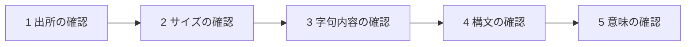

| 順 | 検証の種類 | 何を見るか | 例(ユーザー名) |
|---|---|---|---|
| 1 | 出所(Origin) | 想定した送信元・経路からのデータか | 想定する連携元システムや画面からの送信か |
| 2 | サイズ(Size) | 長さ・容量が許容範囲か | 3〜32文字、リクエスト本文の上限 |
| 3 | 字句内容(Lexical content) | 使ってよい文字だけか | 英小文字・数字・一部記号のみ |
| 4 | 構文(Syntax) | 形式が正しいか | 先頭は英字、連続記号なし |
| 5 | 意味(Semantics) | 業務ルール上、意味があるか | 予約語でない、重複しない |

> 認証・認可は入力検証とは **別の関心事** です。「誰からのリクエストか」「その操作が許されるか」は認証・認可で確認し、上の表には含めません。**認証済みのユーザーからの入力であっても**、サイズ・字句・構文・意味の検証は省略せずに行います(正規ユーザーのアカウントが乗っ取られている場合や、正規ユーザー自身が悪意を持つ場合があるため)。
>
> 注意: 上記の5段階の名称・順序は、書籍の節構成(字句内容の節が存在すること)と一般的な入力検証の定石に基づく私の整理です。**正確な分類は書籍第4章で確認してください。**

**やってはいけない例**: データを検証する **前に** 「修復」してしまう(例: 危険な文字を黙って削除してから検証する)。書籍第9章の節見出しにも「検証の前にデータを修復しない」とあります。修復の結果が攻撃者の意図した形になる恐れがあるためです。

---

## 6. Step 5 ── ドメインプリミティブ(本書の中核概念)

(書籍 第5章 "Domain primitives" に相当。著者らの無料公開記事も参照)

### 6.1 何が問題なのか: 「素の型」の曖昧さ

多くのコードは、概念を `String` や `int` で表します。しかしこれらの型は **何でも入る** ため、次の問題を起こします。

| 問題 | 例 |
|---|---|
| 不正値が通る | 数量に `-5` や `0`、メールアドレスに改行入りの文字列 |
| 引数の取り違え | `transfer(from, to, amount)` で `from` と `to` を逆に渡す(どちらも `String`) |
| 検証の重複と漏れ | あちこちで検証を書き、ある経路だけ検証が抜ける |
| 意味の不一致 | チームごとに「有効なメールアドレス」の定義が違う |

### 6.2 ドメインプリミティブの定義

著者らの記事によれば、ドメインプリミティブとは **「存在していること自体が、有効であることの証明になっている値オブジェクト」** です。DDD の値オブジェクトに、セキュリティの観点で次の制約を加えたものと説明されています。

| 条件 | 内容 |
|---|---|
| 不変条件(invariant)が存在する | 「何が有効か」を明文化している |
| 生成時に強制する | コンストラクタ等で検証し、不正なら **作れない** |
| 素の型・汎用型(null を含む)で概念を表さない | ドメインの概念は専用の型で表す |
| ドメイン内の意味を厳密に定義する | 外部標準と意味が違うなら用語を分ける |

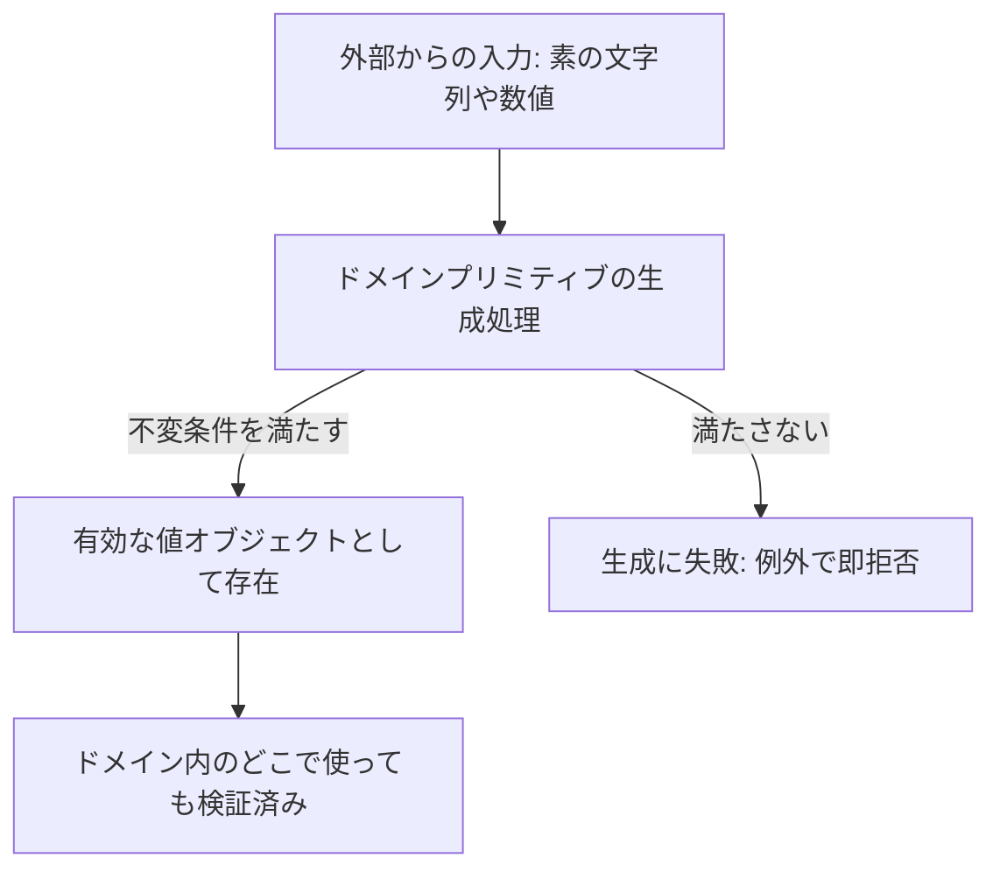

### 6.3 コード例(本ガイド用のオリジナル)

```java
// 注文数量: 1〜99 の整数のみ有効、と業務担当者と合意した想定
public final class OrderQuantity {
    private static final int MIN = 1;
    private static final int MAX = 99;

    private final int value;

    public OrderQuantity(int value) {
        if (value < MIN || value > MAX) {
            throw new IllegalArgumentException(
                "数量は " + MIN + " から " + MAX + " の範囲で指定してください");
        }
        this.value = value;
    }

    public int value() { return value; }

    // ドメイン上の操作は型の中に閉じ込める(ルールの置き忘れ防止)
    public OrderQuantity plus(OrderQuantity other) {
        return new OrderQuantity(this.value + other.value);   // 合計も範囲チェックされる
    }

    @Override public boolean equals(Object o) {
        return o instanceof OrderQuantity q && q.value == this.value;
    }
    @Override public int hashCode() { return Integer.hashCode(value); }
}
```

**ポイント**:

- 「負の数量を送りつけて想定外の動作を引き起こす」という攻撃が、**専用の対策コードを書かなくても** 成立しなくなる
- 足し算などの操作も型の中にあるため、ルールが変わっても修正箇所が1か所で済む

### 6.4 API を堅牢にする(引数・戻り値にドメインプリミティブを使う)

```java
// Before: どれも String / long。取り違えても、範囲外でもコンパイルが通る
void transfer(String fromAccount, String toAccount, long amount) { /* ... */ }

// After: 型が意味を持つ。取り違えはコンパイルエラー、不正値は生成時に拒否
void transfer(AccountNumber from, AccountNumber to, Money amount) { /* ... */ }
```

| 観点 | Before(素の型) | After(ドメインプリミティブ) |
|---|---|---|
| 入力検証 | メソッドごとに自分で書く | 型の生成時に1回。以降は不要 |
| 引数の取り違え | 気づけない | コンパイル時に検出 |
| 読みやすさ | 型から意味が読めない | 型名が仕様書になる |
| 開発者の認知負荷 | 毎回「検証したっけ?」と考える | 型があれば検証済みと信頼できる |

### 6.5 コンテキストの境界が意味を決める

著者らの記事は、同じ言葉(例: メールアドレス)でも **自分のドメインでの定義** を優先してよい、と説明します。例えば、国際標準(RFC)上は有効でも、自サービスでは「英小文字・数字・ドットのみ許可」と定義する、といった具合です。

一方、**ISBN のように外部標準で厳密に定義された用語は、意味を変えると混乱の元** になるため、再定義せず、別の用語(例: `BookId` が `ISBN` または `UnpublishedBookNumber` を包む)を導入するほうが安全、という考え方が示されています。

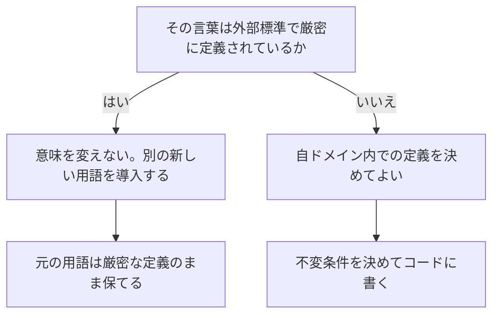

### 6.6 公開APIにドメインモデルをそのまま出さない

外部(インターネット向け REST API など)に公開する API では、内部のドメインオブジェクトをそのまま露出させません。

1. 公開API用には **別表現(DTO)** を用意する
2. API の入口で **DTO → ドメインプリミティブ** に変換する(ここで検証される)
3. こうすると、API と内部ドメインを **独立して進化** させられる

### 6.7 ドメインプリミティブライブラリを育てる

- 小さな概念まで含め、**ほぼ全ての概念** をドメインプリミティブとして整備する
- これは汎用ユーティリティクラスの寄せ集めではなく、**ドメイン概念の共通語彙** である
- 結果として「型を使うだけで安全」な部品箱になる

### 6.8 リードワンスオブジェクト(Read-once objects)

第5章には、**機密データの漏えい** を防ぐための「読み取り一回限りのオブジェクト」の節があります。考え方は、パスワードやトークンのような機密値を、**一度読んだら使えなくする** というものです。

```java
public final class SecretToken {
    private char[] chars;

    public SecretToken(char[] chars) { this.chars = chars.clone(); }

    // ラッパーから配列を取り出せるのは1回だけ。2回目は失敗する(意図しない再利用の検知にもなる)
    // 返した配列自体は使用不能にならない。読み取り後の消去・保持期間の管理は呼び出し側の責任
    public synchronized char[] consume() {
        if (chars == null) {
            throw new IllegalStateException("この値はすでに使用済みです");
        }
        char[] out = chars;
        chars = null;
        return out;
    }

    @Override public String toString() { return "[REDACTED]"; }   // うっかりログに出ても漏れない
}
```

> 補足: `consume()` が保証するのは **このラッパーから2回以上取り出せない** ことだけです。返された配列は通常の配列なので、呼び出し側は読み取り・保持・コピーができてしまいます。使い終わったら `Arrays.fill(out, '\0')` で消去する、他所に保持しない、といった取り出し後の管理は呼び出し側の責任です。
>
> `String` は内容を消去できないため、機密値には `char[]` を使う、といった言語固有の配慮も必要です。上記は考え方を示す簡略例です。

### 6.9 テイント分析の考え方

第5章は「テイント分析(taint analysis)」の発想にも触れます。テイント分析は、**信頼できない入力(ソース)が危険な利用先(シンク)まで届く流れを追跡する** 手法です。

ドメインプリミティブによるドメイン境界での検証は、これと **同じものではありません**。専用型が保証するのは **ドメインの不変条件を満たしていること(例: 数量が 1〜99 である)だけ** で、HTML・SQL・シェルなど **利用先での安全性は保証しません**。例えばドメイン上は正しい「表示名」でも、`<` や `'` を含めば HTML や SQL では危険になり得ます。そのため、ドメインプリミティブを使っていても、**SQL はパラメータ化クエリで渡す**、**出力先(HTML・属性・URL・JavaScript など)に応じたエンコードを行う** といった、利用先ごとの対策が別途必要です。

### 6.10 国際的な裏付け: Google の「Safe Coding」

Google の Christoph Kern 氏は、同社で長年、XSS や SQL インジェクションなどの脆弱性を **フレームワーク・API・プラットフォームの設計** によって防ぐ取り組みを率いてきた人物です。2025年の論文『Safe Coding』では次の要点が述べられています。

| 要点 | 内容 |
|---|---|
| 責任の移し替え | 安全性の責任を個々の開発者から、言語・ライブラリ・フレームワークへ移す |
| 安全な抽象 | 危険な操作を、公開APIが安全な「安全な抽象(safe abstraction)」の内側に閉じ込める |
| 型不変条件 | 安全のための前提条件を **型の不変条件に引き上げる** |
| 成果 | Google で XSS や SQL インジェクションをほぼ撲滅できたと報告 |

これは、ドメインプリミティブの発想(**型の存在が安全性を保証する**)と非常に近い考え方です。ただし書籍のドメインプリミティブは **業務ドメインの概念** を主眼に置き、Safe Coding は **危険な操作を安全な型で包む** 側面が強い、という違いがあります。

---

## 7. Step 6 ── 状態の完全性と複雑さの削減

(書籍 第6章 "Ensuring integrity of state"、第7章 "Reducing complexity of state" に相当)

### 7.1 なぜ状態が問題か

システムの本質は **状態の変化**(カートに入れる → 支払う → 発送する)です。ところが状態が壊れる(不整合になる)と、セキュリティ上の問題になります。第7章の導入には、搭乗しなかった乗客の荷物を載せたまま飛行機が離陸するような例えが出てきます。

### 7.2 エンティティを正しく作る(第6章)

| 論点 | 悪い設計 | 良い設計 |
|---|---|---|
| 生成時の一貫性 | 引数なしコンストラクタで空のオブジェクトを作り、後から setter で埋める | **必須項目は全てコンストラクタ引数** にし、生成した瞬間から有効にする |
| ORM との関係 | フレームワークの都合で引数なしコンストラクタを公開 | 可視性を絞る・生成経路を限定するなど、工夫して整合性を守る |
| 複雑な制約 | 呼び出し側の注意に頼る | 制約を **コードで強制**(生成時チェック) |
| コレクション | 内部リストをそのまま返す | 防御的コピーや読み取り専用ビューで守る |

```java
// 悪い例: 空の状態が存在できてしまう
public class Account {
    private String id;
    private Money balance;
    public Account() {}                    // 引数なし
    public void setId(String id) { ... }   // 後から設定
}

// 良い例: 作れた時点で有効
public final class SafeAccount {
    private final AccountNumber id;
    private Money balance;

    public SafeAccount(AccountNumber id, Money initialBalance) {
        this.id = Objects.requireNonNull(id);
        this.balance = Objects.requireNonNull(initialBalance);
    }
}
```

### 7.3 状態の複雑さを減らす4つのパターン(第7章)

| パターン | 一言で言うと | 向いている場面 |
|---|---|---|
| 部分的不変エンティティ | 変わらない部分は不変にして、変わる部分だけ可変にする | 一部の属性(IDや作成日時など)が不変のとき |
| エンティティ状態オブジェクト | 状態遷移のルールを **別オブジェクト** に切り出す | 状態が多く、遷移が複雑なとき |
| エンティティスナップショット | ある時点の状態を **不変オブジェクト** として渡す | 読み取り専用で参照させたいとき |
| エンティティのリレー | 変化を、フェーズごとに別のエンティティが受け継ぐ形で表す | 状態グラフをフェーズに分割できるとき |

**状態遷移を明示する例(注文)**:

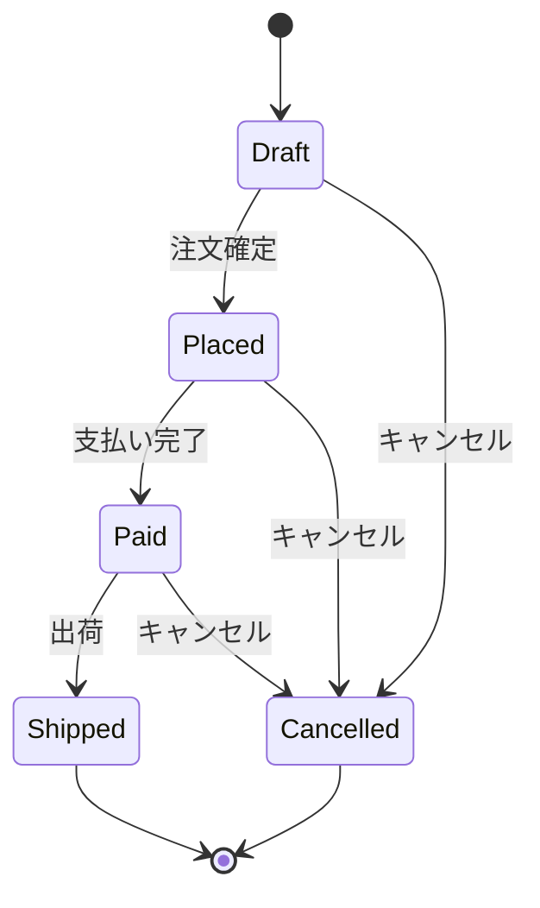

> この図に **書かれていない遷移**(例: `Shipped → Cancelled`)は、コード上でも **拒否される** ように設計します。これがフェイルファストと状態管理の組み合わせです。

### 7.4 同時更新への備え

第7章は、2つの主体(スレッド)が同じエンティティを同時に変更する問題にも触れています。不変オブジェクトやスナップショット、排他制御の設計が **完全性** を守る要素になります。

---

## 8. Step 7 ── デリバリーパイプラインとテストでセキュリティを守る

(書籍 第8章 "Leveraging your delivery pipeline for security" に相当)

### 8.1 基本姿勢: セキュリティテストも「ただのテスト」

第8章は、**セキュリティテストを特別扱いせず、通常のテストと同じ頻度で自動実行する** ことを主張します。毎コミットでペネトレーションテストを回せという意味ではなく、**変更のたびにセキュリティ上の懸念が自動的に検証される仕組み** を作るという考え方です。

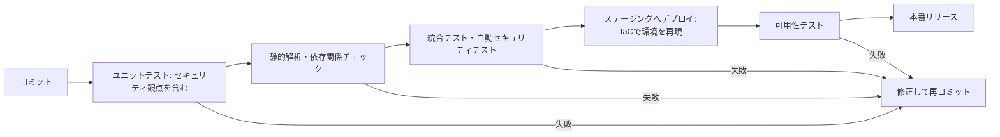

### 8.2 セキュリティのためのユニットテスト 4観点

書籍の節見出しは「通常動作」「境界動作」「不正入力」「極端な入力」のテストです。**QA 視点で最も取り入れやすい部分** です。

| テスト観点 | 目的 | `OrderQuantity` での例 |
|---|---|---|
| 通常動作 | 仕様どおり動くこと | 1, 50, 99 が生成できる |
| 境界動作 | 境界値の扱い | 0 と 100 は拒否、1 と 99 は許可 |
| 不正入力 | 想定外の入力を拒否 | 負数、極端に大きい値を拒否 |
| 極端な入力 | 限界でも壊れない | `Integer.MAX_VALUE`、許容範囲(1〜99)を超える加算 |

```java
class OrderQuantityTest {

    @Test void 通常範囲の値は生成できる() {
        assertEquals(50, new OrderQuantity(50).value());
    }

    @Test void 境界値_下限1は許可_0は拒否() {
        assertDoesNotThrow(() -> new OrderQuantity(1));
        assertThrows(IllegalArgumentException.class, () -> new OrderQuantity(0));
    }

    @Test void 境界値_上限99は許可_100は拒否() {
        assertDoesNotThrow(() -> new OrderQuantity(99));
        assertThrows(IllegalArgumentException.class, () -> new OrderQuantity(100));
    }

    @Test void 不正入力_負数は拒否() {
        assertThrows(IllegalArgumentException.class, () -> new OrderQuantity(-1));
    }

    @Test void 極端な入力_加算結果が範囲を超えたら拒否() {
        assertThrows(IllegalArgumentException.class,
            () -> new OrderQuantity(99).plus(new OrderQuantity(99)));
    }
}
```

> Matt Raible 氏は書評で、この章のコード例が JUnit 5 で書かれており、現在の Java のテスト実践に沿っていると評価しています。

### 8.3 第8章のその他のテーマ

| テーマ | 要点 |
|---|---|
| フィーチャートグルの安全性 | 機能の ON/OFF 切替が、意図せず未検証の機能や危険な設定を有効にしないか |
| 自動セキュリティテスト | セキュリティテストも自動化し、パイプラインの一部にする |
| IaC(Infrastructure as Code)の活用 | 環境構築をコード化し、再現性と検証可能性を高める |
| 可用性テスト | 負荷や障害でも動き続けるかを事前に確認する |
| 設定ミス | 設定の誤りが脆弱性を生む。設定も検証対象にする |

---

## 9. Step 8 ── 失敗と可用性を設計する

(書籍 第9章 "Handling failures securely" に相当)

### 9.1 なぜ「失敗」がセキュリティの話になるのか

第9章の導入では、**多くのシステムは失敗したときに内部の秘密を漏らす** こと、そして **失敗への対処の仕方がシステムの安全性の水準を決める** ことが示唆されています。

### 9.2 例外とそのペイロード(情報漏えいを防ぐ)

| 項目 | 悪い例 | 良い例 |
|---|---|---|
| 例外メッセージ | SQL文、テーブル名、内部IPアドレス、個人情報を含める | 利用者向けは一般的な文言+問い合わせ用の識別子 |
| 例外の種類 | 全て同じ例外で処理 | **業務例外** と **技術例外** を区別する |
| ログ | 機密値を平文で出す | 機密値はマスクし、相関IDで追跡できるようにする |

```java
// 悪い例: 内部情報をそのまま利用者へ返す
catch (SQLException e) {
    throw new RuntimeException("口座 " + accountNo + " の取得に失敗: " + e.getMessage());
}

// 良い例: 内部には詳細ログ、外には最小限
catch (SQLException e) {
    String errorId = UUID.randomUUID().toString();
    log.error("口座取得失敗 errorId={}", errorId, e);          // 詳細は内部ログのみ(機密はマスク)
    throw new ServiceUnavailableException("処理に失敗しました。ID: " + errorId);
}
```

### 9.3 「失敗は例外的ではない」

第9章には「失敗は例外的ではない」という趣旨の節があります。**外部システムの遅延・停止・不正なデータは日常的に起きる** ため、それを通常のフローとして設計に組み込みます。

### 9.4 可用性はセキュリティ目標(CIA の A)

Matt Raible 氏も書評で、**データやシステムの可用性は重要なセキュリティ目標であり CIA の一部** であることを指摘しています。

| 設計要素 | 意味 | 効果 |
|---|---|---|
| レジリエンス(回復力) | 障害から立ち直れる | 部分的な障害が全体停止にならない |
| レスポンシブネス(応答性) | 遅くても応答を返す | 資源を握ったまま待たない |
| タイムアウト | 待つ時間に上限を設ける | スレッド枯渇を防ぐ |
| サーキットブレーカー | 失敗が続く相手への呼び出しを一時遮断 | 連鎖障害(カスケード障害)を防ぐ |

**サーキットブレーカーの動き**:

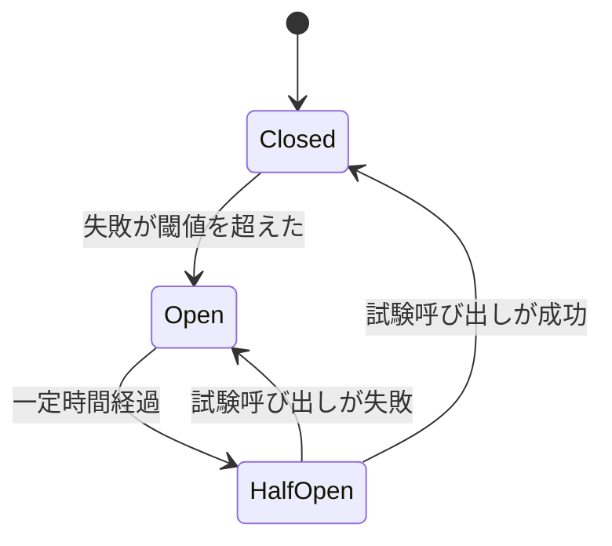

| 状態 | 動作 |
|---|---|
| Closed(閉) | 通常どおり呼び出す。失敗を数える |
| Open(開) | すぐに失敗を返し、相手を呼ばない(相手と自分を守る) |
| HalfOpen(半開) | 少数だけ試験的に呼び、回復を確認する |

### 9.5 不正データの扱い

- **検証前にデータを修復しない**(第5章の「検証」と同じ原則)
- 不正データは **拒否して記録する**。黙って補正しない
- ログに出す場合も、不正データがログの仕組み(ログインジェクション等)を悪用しないよう注意する

---

## 10. Step 9 ── クラウド的思考がもたらすセキュリティ上の利点

(書籍 第10章 "Benefits of cloud thinking" に相当)

### 10.1 ポイント

第10章の趣旨は、**クラウドネイティブ/12ファクターアプリの設計パターンが、副次的にセキュリティ上の利点をもたらす** という点です。著者の一人 Daniel Sawano 氏の公開講演スライドでも、**クラウドで動かしていなくても(オンプレミスでも)同じ利点が得られる** と説明されています。

### 10.2 12ファクターの要素と、セキュリティ上の利点

| 12ファクターの要素 | 内容 | セキュリティ上の利点(要旨) |
|---|---|---|
| Config | 設定は環境に置く | 秘密情報や設定をコードから分離し、差し替え・ローテーションしやすい |
| Backing services | DB やキューなどを **付け替え可能な資源** として扱う | 結合が緩く、侵害や障害の際に切り離しやすい |
| Processes | アプリは1つ以上の **ステートレスなプロセス** として実行 | 可用性と完全性の向上(Sawano 氏のスライドで言及) |
| Logs | ログは **イベントストリーム** として扱う | ログの集中管理・監視がしやすい(追跡可能性につながる) |
| Admin processes | 管理作業は使い捨てのプロセスで実行 | 常駐する特権経路を減らせる |

### 10.3 3つの R: Rotate / Repave / Repair

Matt Raible 氏の書評では、書籍の内容として **企業セキュリティの3つのR** が紹介されています。

| R | 内容 | 目安(書評の記載) |
|---|---|---|
| Rotate(ローテーション) | 秘密情報を頻繁に入れ替える | 数分〜数時間ごと |
| Repave(再構築) | サーバーやアプリを頻繁に作り直す | 数時間ごと |
| Repair(修復) | 脆弱なソフトウェアを速やかに直す | パッチ提供から数時間以内 |

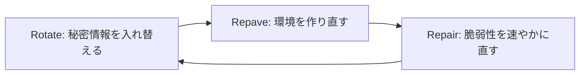

> 「数時間」といった頻度は理想的な目標像です。自組織で実現可能な水準から段階的に近づけるのが現実的です。

---

## 11. Step 10 ── レガシーコードとマイクロサービスへの適用

(書籍 第12章 "Guidance in legacy code"、第13章 "Guidance on microservices"、第14章 "A final word" に相当)

> ⚠️ この章は、私が確認できた **目次・書評レベルの情報** と、**筆者の一般的な整理** を分けて記載します。

### 11.1 確認できた内容

| 章 | 書評・目次で確認できた内容 |
|---|---|
| 第12章 レガシー | ドメインプリミティブをレガシーコードに導入する **複数の選択肢** が示される(Raible 氏の書評) |
| 第13章 マイクロサービス | ログが機密データを漏らし得ること、ログが **後から二次的な攻撃に使われ得る** ことが興味深い論点として挙げられている(同書評) |
| 第14章 最後に | コードレビューでのセキュリティの観点、ペネトレーションテストで設計に挑戦する、セキュリティをインスピレーションの源にする、といったガイドライン(同書評) |
| 第11章 中間章 | 「保険を無料で手に入れる」という趣旨のタイトルの読み物章(タイトルからの理解) |

### 11.2 筆者の一般的な整理: レガシーへの現実的な進め方

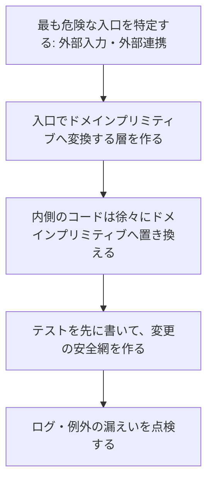

| ステップ | 内容 | 狙い |
|---|---|---|
| 1 | 外部入力・外部連携の入口を洗い出す | 優先順位をつける |
| 2 | 入口で素の型→ドメインプリミティブへ変換 | 以降のコードが検証済みを前提にできる |
| 3 | 引数の取り違えが起きやすい長い引数リストから型を導入 | 事故が起きやすい箇所から減らす |
| 4 | 既存の挙動を守るテストを追加してから置き換え | 回帰を防ぐ |
| 5 | ログ・例外メッセージの機密漏えいを点検 | 機密性の確保 |

### 11.3 筆者の一般的な整理: マイクロサービスでの視点

| 観点 | 設計上の考え方 |
|---|---|
| サービス間の入力 | 他サービスからの入力も **信頼せず**、入口でドメインプリミティブに変換 |
| 公開API | 内部ドメインを露出させず、DTO で境界を作る(Step 5 の 6.6) |
| 可用性 | タイムアウト・サーキットブレーカーで連鎖障害を防ぐ(Step 8) |
| ログ | 機密データを出さない。ログ基盤自体も攻撃対象になり得ると考える |
| 秘密情報 | 設定を環境に置き、頻繁にローテーションする(Step 9) |

> Matt Raible 氏は、本書の Java によるドメインプリミティブ例を気に入り、自身の「マイクロサービスアーキテクチャのセキュリティパターン」の記事で最初のパターン「Secure by Design であること」の説明に使ったと述べています。

---

## 12. Step 11 ── 政府機関の Secure by Design と、業界の流れ

ここからは「②組織としての Secure by Design」です。書籍の技法が、**製品を作る組織の方針** とどう結びつくかを見ます。

### 12.1 3つの原則(CISA と国際パートナーの共同ガイダンス)

CISA と各国のサイバーセキュリティ機関が共同で公表したガイダンス『Shifting the Balance of Cybersecurity Risk: Principles and Approaches for Secure by Design Software』は、2023年4月に最初の版が公表され、同年10月に拡充版が出ました。3つの原則は次のとおりです。

| 原則 | 平易な説明 |
|---|---|
| ① 顧客のセキュリティ成果に責任を持つ | 「安全に使うのは顧客の責任」にせず、デフォルトで安全な製品にする |
| ② 徹底した透明性と説明責任を受け入れる | 脆弱性情報の開示など、情報を公開して顧客と防御側を助ける |
| ③ トップから主導する | 経営層がセキュリティを製品設計の最優先事項として推進する |

拡充版では、日本の NISC と JPCERT/CC を含む多数の国際機関が共同署名しています。また、一部の Secure by Design の実践には AI 特有の考慮が必要になる場合があるものの、**3つの原則は AI システムにも当てはまる** とされています。

### 12.2 CISA の Secure by Design 誓約(Pledge)の7つのゴール

2024年5月に公表された自主的な誓約です。対象は主に **企業向けソフトウェア**(オンプレミス、クラウド、SaaS)で、署名企業は署名から1年以内に、各ゴールで測定可能な進捗を示すことに誠意をもって取り組みます。

| # | ゴール | 要点 |
|---|---|---|
| 1 | 多要素認証(MFA) | 製品全体でMFAの利用を測定可能な形で増やす |
| 2 | デフォルトパスワード | 共通の初期パスワードを使わない、減らす |
| 3 | 脆弱性の **クラス全体** を減らす | 個別修正ではなく、SQLi・XSS・メモリ安全性などの種類ごと減らす |
| 4 | セキュリティパッチ | 顧客によるパッチ適用が増えるようにする |
| 5 | 脆弱性開示ポリシー(VDP) | 善意のテストを認め、報告窓口と公開方針を整える |
| 6 | CVE | 正確な CWE・CPE 情報を含め、透明性を高める |
| 7 | 侵入の証拠 | 顧客が侵入の証拠を収集できる能力を高める |

**書籍との接点(ゴール3)**: CISA の誓約ページは、ゴール3の達成アプローチとして **「特定の種類の脆弱性を作り込めない(または作り込みにくい)安全な関数やライブラリの部品を開発者に提供する」** ことを挙げています。これは本書の **ドメインプリミティブ** や Google の **Safe Coding** と同じ発想です。

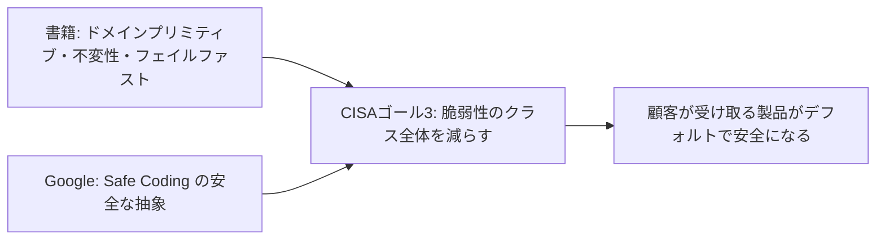

### 12.3 状況メモ(2026年10月8日時点で確認できた範囲)

| 項目 | 確認できた内容 | 注意点 |
|---|---|---|
| 署名企業数 | 誓約開始時は68社。第三者の解説記事(2026年5月)は300社超と報告。CISA の署名者一覧ページには385社と表示されていた | 時点によって数字が異なる。最新は CISA の公式一覧で確認すること |
| 誓約の性質 | 自主的で、法的拘束力はない。報告されている内容は自己申告ベース | 署名=製品が安全という保証ではない |
| 近年の動き | CISA・FBI は「Product Security Bad Practices」ガイダンスで、メモリ安全でない言語で書かれた既存製品について **2026年1月1日まで(2025年末)にメモリ安全性ロードマップを公開する** よう推奨していた。この期限は情報基準日の時点で **すでに経過している** | 期限経過後に各社がロードマップを公開したか、CISA が新たな期限を示したかは一次情報で確認できていない。**過去の推奨事項** として扱い、現状は CISA の公式情報で確認すること |
| 体制面 | 報道によれば、2025年4月に主要な推進者が CISA を離れ、Secure by Design の取り組みは一時的に目立たなくなったと伝えられた | 報道ベース。組織の動向は変わり得る |

> 実務上の含意: **政府の旗振りの強弱にかかわらず、設計で脆弱性を減らすという技術的な価値は変わりません。** 本書の技法は、制度の動向に依存せず使えます。

### 12.4 IEEE Center for Secure Design の「設計上の欠陥トップ10」

Google の Christoph Kern 氏が創設メンバーの一人として関わった IEEE Computer Society の Center for Secure Design は、2014年に報告書『Avoiding the Top 10 Software Security Design Flaws』を公表しました。**実装上のバグ(bugs)ではなく、設計上の欠陥(flaws)に焦点を移す** ことを目的としています。

| # | 推奨事項(要旨) | 本書との関連 |
|---|---|---|
| 1 | 信頼は与えるか獲得するもの。決して **仮定しない** | 外部入力・他サービスを信頼せず、入口で検証 |
| 2 | 迂回・改ざんできない認証メカニズムを使う | 認証はセキュリティ機能(関心事の一部) |
| 3 | 認証してから認可する | アクセス制御の設計 |
| 4 | データと制御命令を厳密に分離する | インジェクション対策(Billion Laughs や SQLi の根本原因) |
| 5 | 全てのデータを **明示的に検証** する方針を定める | バリデーション、ドメインプリミティブ |
| 6 | 暗号を正しく使う | 暗号は自作せず、実績あるライブラリを使う |
| 7 | 機密データを識別し、取り扱い方を決める | 機密性、リードワンスオブジェクト、ログ |
| 8 | 常に利用者を考慮する | 使いやすさと安全性の両立 |
| 9 | 外部コンポーネントの統合が攻撃面をどう変えるか理解する | 依存関係・サプライチェーン |
| 10 | 将来の変更に柔軟に対応できるようにする | 設計の進化可能性 |

> 上の10項目のうち、検索で直接確認できたのは #1・#3・#4 の見出しです。他の項目は同報告書の公開目次に基づく私の記憶による整理です。**正確な文言は報告書の原文で確認してください。**

---

## 13. Step 12 ── 実践: チェックリスト・演習・理解度確認

### 13.1 設計レビュー用チェックリスト

| # | チェック項目 | 該当する書籍の概念 |
|---|---|---|
| 1 | 業務概念を `String`/`int` のまま使っていない? | ドメインプリミティブ |
| 2 | 生成された時点で有効なオブジェクトだけが存在する? | 不変条件・生成時検証 |
| 3 | 検証は「出所 → サイズ → 字句 → 構文 → 意味」の順? | バリデーション |
| 4 | 検証の前にデータを「修復」していない? | 不正データの扱い |
| 5 | 値は不変? 内部コレクションを直接公開していない? | 不変性 |
| 6 | 不正な状態遷移を拒否している? | フェイルファスト・状態管理 |
| 7 | 例外やログに機密情報・内部情報が出ていない? | 例外ペイロード・機密性 |
| 8 | 外部呼び出しにタイムアウトとサーキットブレーカーがある? | 可用性・レジリエンス |
| 9 | セキュリティ観点のテスト(通常/境界/不正/極端)が自動実行される? | パイプライン |
| 10 | 秘密情報はコードに埋め込まず、環境から注入・定期的に入れ替えている? | 12ファクター・Rotate |
| 11 | 公開API用の DTO と内部ドメインを分離している? | API の堅牢化 |
| 12 | 外部標準の用語の意味を勝手に変えていない? | コンテキストの境界 |

### 13.2 ハンズオン演習(初学者向け)

**演習1: ドメインプリミティブを作る**

- 課題: 「ユーザー名」を `String` で扱っている小さなコードを見つけ、`Username` 型に置き換える
- 条件: 3〜20文字、英小文字・数字・アンダースコアのみ、先頭は英字
- ゴール: 不正値で生成すると例外になり、有効な `Username` だけが存在する

**演習2: 4観点のテストを書く**

- 課題: 演習1の `Username` に対し、通常・境界・不正入力・極端な入力のテストを書く
- ヒント: 2文字/3文字、20文字/21文字、空文字、非常に長い文字列、制御文字、全角文字

**演習3: 例外メッセージの点検**

- 課題: 自分のプロジェクトで `catch` している箇所を3つ選び、利用者に返る文言に内部情報が含まれていないか確認する
- ゴール: 外向きは一般的な文言+エラーID、内部ログに詳細

**演習4: 状態遷移図を描く**

- 課題: 身近なエンティティ(申請、予約、チケットなど)の状態遷移を Mermaid の `stateDiagram-v2` で描き、図にない遷移をコードで拒否する

### 13.3 理解度確認(自己採点)

| # | 問い | 答えの要点 |
|---|---|---|
| 1 | セキュリティが「機能」でなく「関心事」とはどういう意味か | 全ての機能・コードに横断的に関わり、ログイン機能を作れば完了、というものではない |
| 2 | CIA-T の4文字は何か | 機密性・完全性・可用性・追跡可能性 |
| 3 | ドメインプリミティブが通常の値オブジェクトと違う点は | 不変条件の存在と生成時の強制、素の型や null での表現の禁止 |
| 4 | なぜ `String` で業務概念を表すと危険か | 何でも入る・取り違えやすい・検証が漏れる・意味が人によって違う |
| 5 | 検証の前に入力を修復してはいけないのはなぜ | 修復結果が攻撃者の意図した形になり得るため |
| 6 | 可用性がセキュリティの話になる理由は | 使えなくすること自体が攻撃になるため(CIA の A) |
| 7 | サーキットブレーカーの3状態は | Closed / Open / HalfOpen |
| 8 | 12ファクターの「ステートレスなプロセス」がもたらす利点は | 可用性・完全性の向上(状態を外部に出し、プロセスを使い捨てにできる) |
| 9 | CISA の Secure by Design の3原則は | 顧客のセキュリティ成果への責任、徹底した透明性と説明責任、トップからの主導 |
| 10 | 本書の技法と CISA ゴール3の接点は | 安全な部品(型・ライブラリ)で、脆弱性のクラス全体を作り込めなくする |

### 13.4 よくある誤解

| 誤解 | 実際 |
|---|---|
| 「Secure by Design なら診断や監視は不要」 | 設計は主要な防御だが万能ではない。書籍も他の手法との併用を前提にしている |
| 「ドメインプリミティブはバリデーションライブラリの別名」 | 検証を **型の生成時に強制** し、型の存在を有効性の証明にする設計であり、概念の厳密化がセットになる |
| 「CISA の誓約に署名した製品は安全」 | 誓約は自主的・自己申告ベースで、署名は安全性の保証ではない |
| 「設計に時間がかかる」 | 初期投資は必要だが、検証の重複や再発する脆弱性への対応コストを減らせる(書籍も、日々の習慣として自然に行えると述べる) |

### 13.5 今後の学習ロードマップ

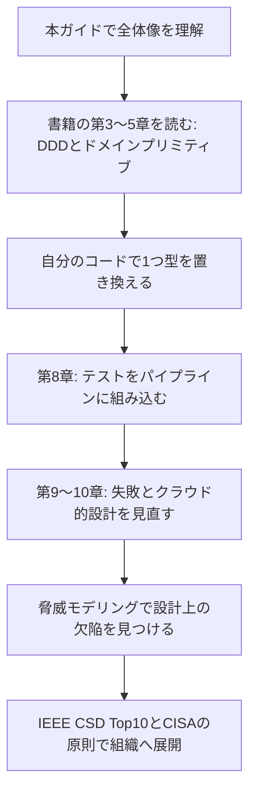

> 関連する学習として **脅威モデリング** があります。Secure by Design が「安全な構造を作る」ことに重きを置くのに対し、脅威モデリングは「設計の段階で、どこに脅威があるかを洗い出す」手法で、両者は補完関係にあります。

---

## 14. 用語集

| 用語 | 説明 |
|---|---|
| Secure by Design | 設計によってセキュリティを実現する考え方 |
| Secure by Default | 初期状態(デフォルト)で安全な設定にする考え方 |
| CIA-T | 機密性・完全性・可用性・追跡可能性 |
| 不変条件(invariant) | 常に成り立つべき条件 |
| ドメインプリミティブ | 存在すること自体が有効性を示す、不変条件付きの値オブジェクト |
| 値オブジェクト | 値で同一性が決まる不変の概念 |
| エンティティ | IDで同一性が決まり、状態が変化する概念 |
| フェイルファスト | 不正を早期に明確に失敗させる方針 |
| リードワンスオブジェクト | 一度だけ読み取れる機密値のためのオブジェクト |
| テイント分析 | 信頼できない値の流れを追跡する発想・手法 |
| サーキットブレーカー | 失敗が続く呼び出し先を一時的に遮断する仕組み |
| 12ファクターアプリ | クラウド向けアプリの設計原則集 |
| IaC | インフラ構成をコードで管理すること |
| Safe Coding | Google が提唱する、安全性を型・ライブラリ・フレームワークに移す設計実践 |
| Pledge(誓約) | CISA の Secure by Design 自主的誓約 |
| VDP | 脆弱性開示ポリシー |

---

## 15. 参考文献・根拠ソース一覧(URL)

> 確認日: 2026年10月8日時点。URL の内容は更新される可能性があります。

### 15.1 書籍そのもの(一次情報)

| 区分 | 内容 | URL |
|---|---|---|
| 公式商品ページ | Manning『Secure by Design』(ISBN 9781617294358、2019年9月、400ページ。日本語・ロシア語・簡体中国語版あり) | https://www.manning.com/books/secure-by-design |
| 目次(liveBook) | 第1章 Why design matters for security | https://livebook.manning.com/book/secure-by-design |
| 目次(liveBook) | 第4章 Code constructs promoting security | https://livebook.manning.com/book/secure-by-design/chapter-4 |
| 目次(liveBook) | 第5章 Domain primitives | https://livebook.manning.com/book/secure-by-design/chapter-5 |
| 目次(liveBook) | 第6章 Ensuring integrity of state | https://livebook.manning.com/book/secure-by-design/chapter-6 |
| 目次(liveBook) | 第7章 Reducing complexity of state | https://livebook.manning.com/book/secure-by-design/chapter-7 |
| 目次(liveBook) | 第8章 Leveraging your delivery pipeline for security | https://livebook.manning.com/book/secure-by-design/chapter-8 |
| 目次(liveBook) | 第9章 Handling failures securely | https://livebook.manning.com/book/secure-by-design/chapter-9 |
| 著者の無料記事 | Domain primitives: what they are and how you can use them to make more secure software | https://freecontent.manning.com/domain-primitives-what-they-are-and-how-you-can-use-them-to-make-more-secure-software/ |
| 書誌・目次 | O'Reilly Learning 上の書誌・目次 | https://oreilly.com/library/view/secure-by-design/9781617294358 |

### 15.2 著名な開発者・実務者の発信

| 発信者 | 内容 | URL |
|---|---|---|
| Matt Raible(Java Champion) | 本書の章ごとの書評(2020年5月) | https://raibledesigns.com/rd/entry/secure_by_design_book_review |
| Matt Raible | 「11 Patterns to Secure Microservice Architectures」(最初のパターンが Be Secure by Design) | https://dzone.com/articles/11-patterns-to-secure-microservice-architectures |
| Matt Raible | 同テーマの講演スライド(Speaker Deck) | https://speakerdeck.com/mraible/security-patterns-for-microservice-architectures-london-java-community-2020 |
| Daniel Sawano(著者) | 講演「Creating secure software - benefits from cloud thinking」スライド | https://noti.st/sawano/CRZBTX/creating-secure-software-benefits-from-cloud-thinking |
| Christoph Kern(Google) | USENIX Security での講演「Preventing Security Bugs through Software Design」 | https://www.usenix.org/conference/usenixsecurity15/symposium-program/presentation/kern |
| Christoph Kern(Google) | 論文「Safe Coding: Rigorous Modular Reasoning about Software Safety」(Queue 23(5)、2025) | https://research.google/pubs/safe-coding-rigorous-modular-reasoning-about-software-safety/ |
| Christoph Kern | OpenSSF ポッドキャスト #2 | https://openssf.org/podcast/2024/04/23/whats-in-the-soss-podcast-2-christoph-kern-and-the-challenge-of-keeping-google-secure/ |
| IEEE Center for Secure Design | 報告書「Avoiding the Top 10 Software Security Design Flaws」(2014) | https://www.spinellis.gr/pubs/tr/2014-CSD-Flaws/html/CSD-avoid-top10-flaws.html |
| IEEE Cybersecurity | 第1項目「Earn or Give, but Never Assume, Trust」解説 | https://cybersecurity.ieee.org/blog/2015/11/13/avoiding-the-top-10-software-security-design-flaws-earn-or-give-but-never-assume-trust/ |
| 12factor.net | The Twelve-Factor App | https://12factor.net/ |

### 15.3 政府機関・公的機関(組織としての Secure by Design)

| 発信元 | 内容 | URL |
|---|---|---|
| CISA | Secure by Design トップページ | https://www.cisa.gov/securebydesign |
| CISA | Secure by Design 誓約(ゴールと達成アプローチ) | https://www.cisa.gov/securebydesign/pledge |
| CISA | 誓約署名者一覧 | https://www.cisa.gov/securebydesign/pledge/secure-design-pledge-signers |
| CISA | 誓約への初期コミットメント発表(68社、7ゴール) | https://cisa.gov/news-events/news/cisa-announces-secure-design-commitments-leading-technology-providers |
| CISA ほか | 共同ガイダンス Shifting the Balance of Cybersecurity Risk(概要) | https://cisa.gov/resources-tools/resources/secure-by-design-and-default |
| CISA・FBI | Product Security Bad Practices(メモリ安全性ロードマップの公開期限を含む) | https://www.cisa.gov/resources-tools/resources/product-security-bad-practices |
| CISA ほか | 2023年10月の拡充版の公表アラート(共同署名機関一覧) | https://cisa.gov/news-events/alerts/2023/10/16/cisa-nsa-fbi-and-international-partners-release-updated-secure-design-guidance |
| ニュージーランド NCSC | 共同ガイダンスの解説ページ | https://www.ncsc.govt.nz/protect-your-organisation/principles-and-approaches-for-secure-by-design-software/ |

### 15.4 二次情報(最新動向の補助。一次情報での確認を推奨)

| 媒体 | 内容 | URL |
|---|---|---|
| Industrial Cyber | 拡充版ガイダンス(AI への言及を含む)の報道 | https://industrialcyber.co/cisa/global-security-agencies-update-secure-by-design-principles-and-guidance-for-technology-providers/ |
| Safeguard(解説記事) | CISA 誓約の解説(300社超、自己申告・非検証という指摘、2026年5月) | https://safeguard.sh/resources/blog/cisas-secure-by-design-pledge-explained |
| Safeguard(解説記事) | 誓約の2026年アップデート解説(2026年4月) | https://safeguard.sh/resources/blog/cisa-secure-by-design-pledge-update-2026 |
| Cybersecurity Dive | 主要推進者の退任後に取り組みが目立たなくなったとの報道 | https://www.cybersecuritydive.com/news/surveillance-camera-axis-signs-cisa-security-pledge/806907/ |

---

## 16. 最後に

Secure by Design の核心は、**「開発者が毎回セキュリティを思い出さなくても、普通に作れば安全になる土台を設計で用意する」** ことです。

1. まずは **小さな1つの概念(例: 数量、ユーザー名)をドメインプリミティブにする**
2. その **境界値テスト** を書く
3. 例外メッセージの **情報漏えい** を点検する

この3つだけでも、設計がセキュリティを支えるという感覚をつかめます。そこから、状態管理、パイプライン、可用性、クラウド的設計へと広げていってください。

> 本ガイドは学習用の整理です。実際のシステムに適用する際は、書籍本文、使用言語・フレームワークの公式ドキュメント、自組織のセキュリティ要件を必ず確認してください。
