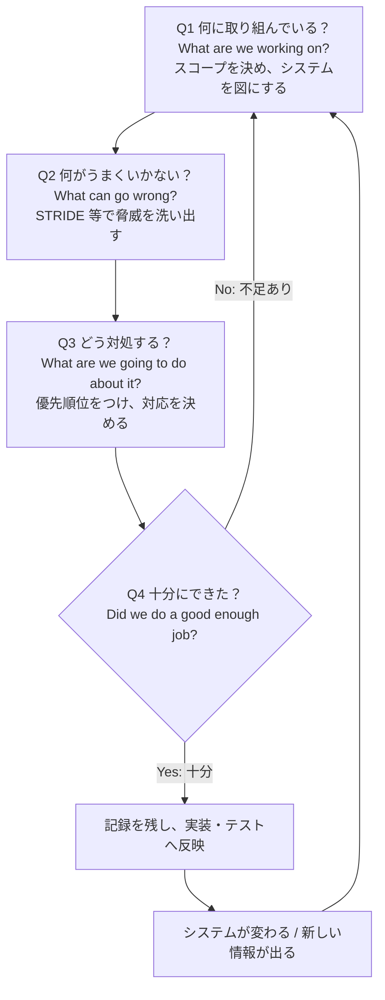
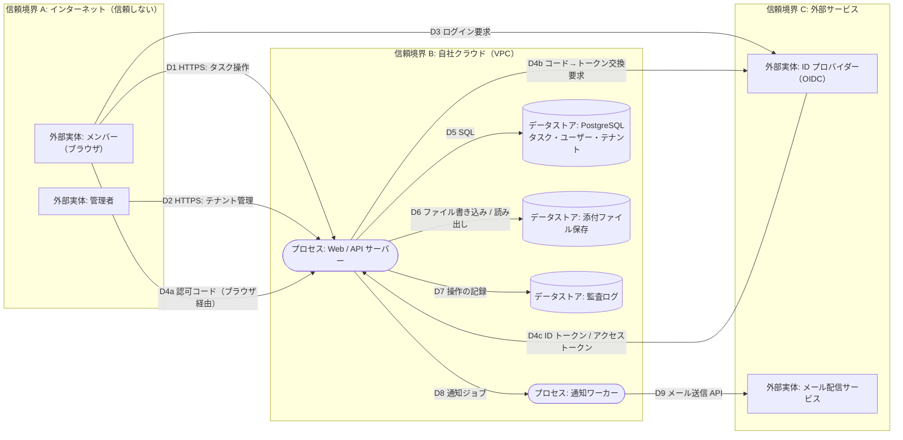
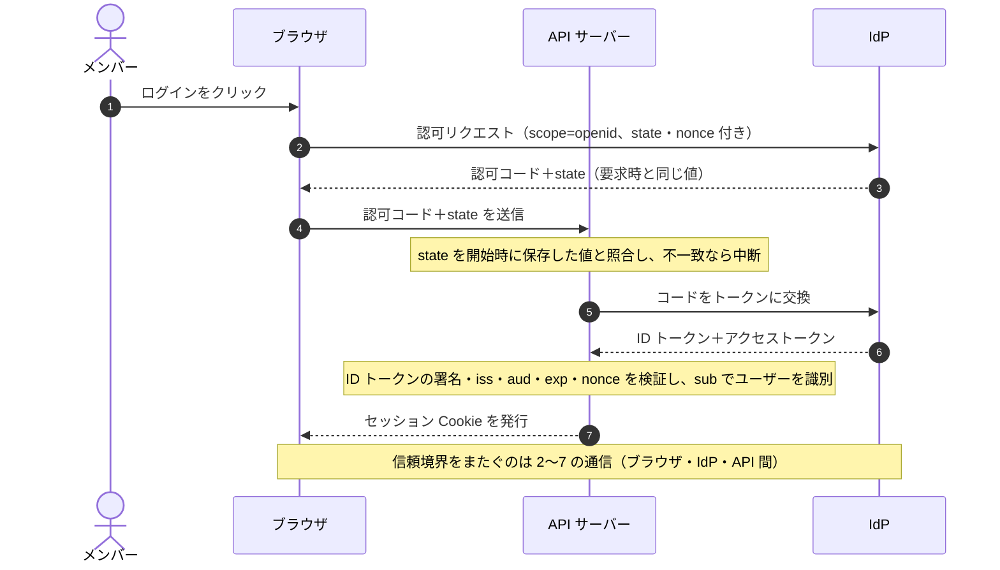
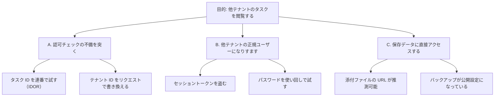
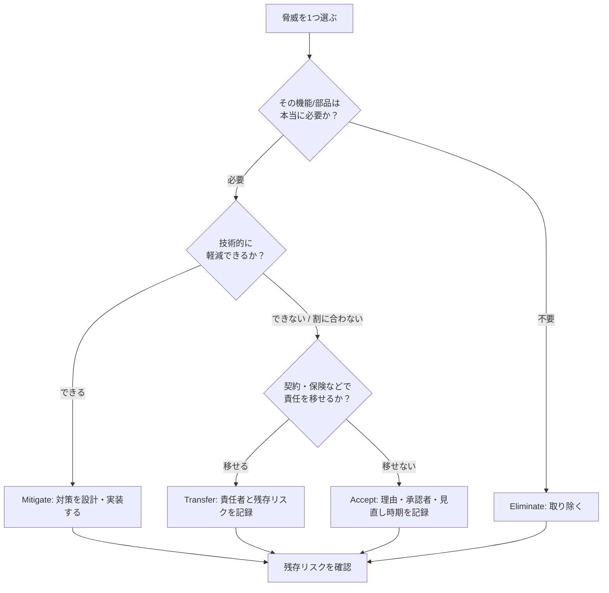
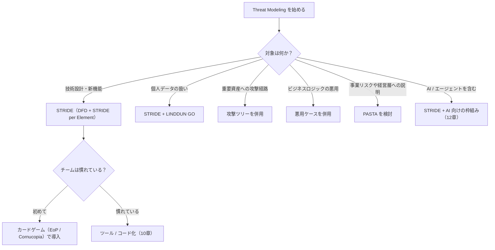
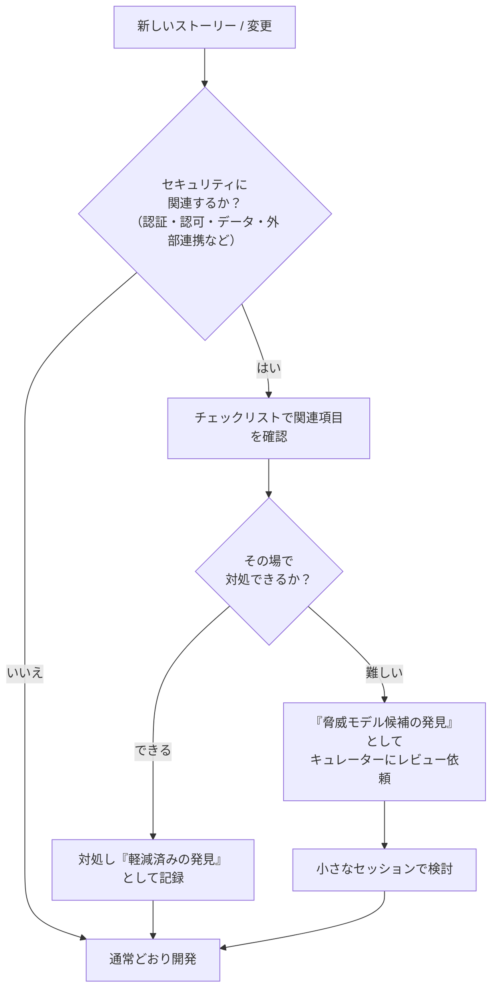
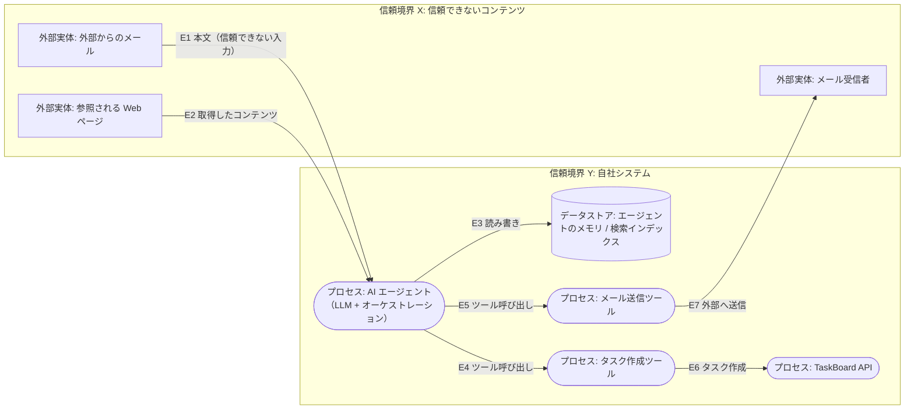
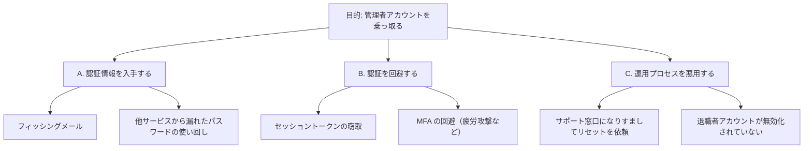

# Threat Modeling 入門ガイド（初学者向け・ステップバイステップ）

> **対象読者**: 開発者・QA・アーキテクト・セキュリティ初学者（セキュリティの専門知識がなくても読めるように書いています）
> **ゴール**: 読み終えたあとに、自分のチームで「30〜60分の最初の Threat Modeling セッション」を回せるようになること
> **情報の基準日**: 2026-10-05（Web 調査に基づく。参考 URL は末尾の「参考文献」に一覧）
> **ベース書籍**: *Threat Modeling*（Izar Tarandach / Matthew J. Coles, O'Reilly, 2020年11月, ISBN 9781492056546）

---

## 目次

1. [このガイドについて](#1-このガイドについて)
2. [Threat Modeling とは何か](#2-threat-modeling-とは何か)
3. [基本用語を整理する](#3-基本用語を整理する)
4. [全体像: 4つの質問（Four Question Framework）](#4-全体像-4つの質問four-question-framework)
5. [Step 1: 何を作っているか（システムのモデリング）](#5-step-1-何を作っているかシステムのモデリング)
6. [Step 2: 何がうまくいかない可能性があるか（脅威の洗い出し）](#6-step-2-何がうまくいかない可能性があるか脅威の洗い出し)
7. [Step 3: どう対処するか（リスク評価と対策）](#7-step-3-どう対処するかリスク評価と対策)
8. [Step 4: 十分にできたか（検証とレビュー）](#8-step-4-十分にできたか検証とレビュー)
9. [方法論の地図（STRIDE / PASTA / LINDDUN ほか）](#9-方法論の地図stride--pasta--linddun-ほか)
10. [自動化と Threat Modeling as Code](#10-自動化と-threat-modeling-as-code)
11. [継続的 Threat Modeling（Agile / DevOps との統合）](#11-継続的-threat-modelingagile--devops-との統合)
12. [2026年の動向: クラウドと AI / エージェント](#12-2026年の動向-クラウドと-ai--エージェント)
13. [Threat Modeling Champion になる（組織導入 FAQ）](#13-threat-modeling-champion-になる組織導入-faq)
14. [ハンズオン: 最初の60分セッション](#14-ハンズオン-最初の60分セッション)
15. [アンチパターンとチェックリスト](#15-アンチパターンとチェックリスト)
16. [演習問題と解答例](#16-演習問題と解答例)
17. [学習ロードマップ](#17-学習ロードマップ)
18. [参考文献（根拠となるソース URL）](#18-参考文献根拠となるソース-url)

---

## 1. このガイドについて

### 1.1 ベース書籍の位置づけ

O'Reilly の *Threat Modeling*（Tarandach & Coles）は、O'Reilly 上で難易度 **Beginner** と表示されている実践書です。書籍ページの概要では、次の考え方が打ち出されています。

- Threat Modeling は**高度なセキュリティ知識がなくても始められる**
- 継続するのに**途方もない努力は不要**
- コードが書かれる**前**に、低コストで問題を見つけられる点が価値

公開されている目次から、書籍の構成は次のとおりです（本ガイドの章立ても、これを意識して対応づけています）。

| 書籍の章 | 主なテーマ（目次の見出しに基づく） | 本ガイドの対応章 |
|---|---|---|
| Introduction | Threat Modeling の基本、SDLC での位置づけ、基本概念と用語、リスク/重大度、Core Properties、Fundamental Controls、安全な設計パターン | 2, 3 |
| 1. Modeling Systems | DFD・シーケンス図・プロセスフロー図・攻撃ツリー・フィッシュボーン図 | 5 |
| 2. A Generalized Approach | 基本ステップ、「よくある容疑者」、発見できないもの、Threat Intelligence | 4, 6 |
| 3. Threat Modeling Methodologies | STRIDE、PASTA、Trike、LINDDUN、SPARTA、INCLUDES NO DIRT、カードゲーム（Elevation of Privilege 等） | 6, 9 |
| 4. Automated Threat Modeling | コードからの/コードによるモデリング、pytm、Threagile、各種ツール、ML/AI | 10 |
| 5. Continuous Threat Modeling | Autodesk の継続的手法、Baselining、Threat Model Every Story | 11 |
| 6. Own Your Role as a Champion | 経営層・チームの巻き込み、失敗感、方法論選び、悪いニュースの伝え方 | 13 |
| Appendix A. A Worked Example | 最初のシステムモデルからの実例 | 5〜8, 14 |

> **注意（同名の別書籍）**: 「Threat Modeling」という題名の書籍には、Adam Shostack 著 *Threat Modeling: Designing for Security*（Wiley）もあります。こちらは別の書籍です。本ガイドは Tarandach & Coles 版をベースにしつつ、Shostack の「4つの質問」など、業界で広く参照される一次情報も併用します。

### 1.2 著作権と情報源についての方針

- 書籍の本文は転載していません。**公開されている目次・概要**と、**著者・標準化団体・OWASP などの公開資料**に基づき、自分の言葉で再構成しています。
- 各章の根拠は「参考文献」にまとめ、信頼度（◎一次情報・標準 / ○著名実務家・研究 / △ベンダー・二次情報）を付けました。
- 2025〜2026年に登場した新しい資料（AI/エージェント関連など）は、**成熟度がまだ高くないもの**があります。該当箇所に注意書きを入れています。

### 1.3 読み進め方

| 目的 | 読む章 |
|---|---|
| 最短で最初のセッションを回したい | 2章、4章、5章、6章、7章、8章、14章（ハンズオン） |
| 理解を深めたい | 9章、10章、11章 |
| 最新トピック（クラウド・AI）を知りたい | 12章 |
| 組織に広めたい | 13章、15章 |

---

## 2. Threat Modeling とは何か

### 2.1 一言でいうと

**「作ろうとしているものを図にして、『何がうまくいかない可能性があるか』をチームで考え、先に手を打つ活動」** です。

Threat Modeling Manifesto（2020年、実務家・研究者・著者ら約15名が策定）は、これを「システムの表現（図や説明）を分析し、セキュリティとプライバシーの懸念を浮かび上がらせること」と定義しています。ここで大事なのは次の3点です。

1. **設計段階**（コードを書く前後を問わず「早く」）で行う
2. **システムの表現**（ホワイトボードの図でもよい）を材料にする
3. **セキュリティだけでなくプライバシー**も対象にする

### 2.2 なぜ必要なのか

| 観点 | 説明 |
|---|---|
| コスト | 設計段階で見つけた問題は、本番稼働後に見つけるより修正が安く済む（OWASP は「後付け（bolted-on）ではなく作り込み（built-in）」と表現） |
| 抜け漏れ | 脆弱性スキャンやペンテストは「実装済みのもの」しか調べられない。設計上の欠陥（認可の穴・信頼境界の誤り）は設計レビューで見つけやすい |
| 共通理解 | 図を囲んで議論することで、開発・QA・運用・セキュリティが同じ理解を持てる |
| 根拠の提示 | 「なぜこの対策をするのか」を説明できる記録（assurance の根拠）になる |
| 教育効果 | 「攻撃者の視点」で考える経験が、チーム全体のセキュリティ感度を上げる |

### 2.3 Threat Modeling は「何ではない」か（よくある誤解）

| 誤解 | 実際 |
|---|---|
| セキュリティ専門家だけの仕事 | Manifesto は「**特別な才能は不要。誰でもできるし、すべきだ**」と明言（アンチパターン: *Hero Threat Modeler*） |
| 1回やれば終わり | システムが変われば脅威も変わる。**継続して更新**するもの（OWASP も「一度きりにしない」と明記） |
| 分厚い文書を作ること | 価値の中心は**対話**。文書は理解を記録し、測定を可能にするためのもの |
| 脆弱性スキャンやペンテストの代わり | 補完関係。Threat Modeling は「設計」を、テストは「実装・運用」を見る |
| 完璧な脅威リストを作ること | 目的は**システムを改善すること**。「十分にできたか」を問い続ける |
| 攻撃者の最新手口の暗記 | 現在観測されている攻撃だけに固執すると、未知の脅威を見落とす（Shostack の指摘） |

> **ポイント**: Manifesto の価値宣言は「Threat Modeling を**語る**より**行う**」ことを優先する、という趣旨です。完璧を待たず、小さく始めてください。

---

## 3. 基本用語を整理する

### 3.1 用語集

| 用語 | 意味 | たとえ話（自宅の防犯） |
|---|---|---|
| **Asset（資産）** | 守る価値のあるもの（データ、機能、評判、可用性） | 家の中の貴重品、家族 |
| **Threat（脅威）** | 資産に害を与えうる「起こりうること」 | 空き巣に入られる |
| **Threat Actor（脅威主体）** | 脅威を実行しうる人・組織・プログラム（外部/内部、悪意/うっかり） | 泥棒、鍵を無くした家族 |
| **Vulnerability（脆弱性）** | 脅威に悪用される弱点 | 施錠されない窓 |
| **Attack（攻撃）** | 脆弱性を突いて脅威を実現する行為 | 窓を割って侵入する |
| **Risk（リスク）** | 脅威が実現する可能性と、その影響の大きさの組み合わせ | 「窓が割られやすく、貴重品が多い」状態 |
| **Control / Mitigation（対策）** | 脅威を防ぐ・弱める・検知する仕組み | 補助錠、センサー、保険 |
| **Attack Surface（攻撃面）** | 攻撃者が接触できる入口の総体 | ドア、窓、ベランダ |
| **Trust Boundary（信頼境界）** | 信頼の度合いが変わる境目 | 玄関（外と内の境目） |
| **Assumption（前提）** | 「こうなっているはず」と置いた条件（後で検証する） | 「隣家は信頼できる」 |

> **脅威と脆弱性の違い**: 脆弱性は「弱点（状態）」、脅威は「その弱点を突いて起こりうる出来事」です。たとえば「API が個人情報を漏らす」は弱点で、「攻撃者がそれを見つけて悪用し、個人情報を入手する」が脅威です。

### 3.2 セキュリティの基本特性（Core Properties）

脅威を考えるときの物差しになります。STRIDE（6章）の各脅威は、これらの特性の侵害に対応します。

| 特性 | 英語 | 意味 | 侵害される例 |
|---|---|---|---|
| 機密性 | Confidentiality | 許可された人だけが見られる | 他人の注文履歴が見える |
| 完全性 | Integrity | 許可なく改ざんされない | 金額が書き換えられる |
| 可用性 | Availability | 必要なときに使える | サービスが落ちて使えない |
| 認証 | Authentication | 相手が本人だと確認できる | 他人になりすましてログイン |
| 認可 | Authorization | 許された操作だけができる | 一般ユーザーが管理画面を操作 |
| 否認防止・説明責任 | Non-repudiation / Accounting | 「やった/やらない」を後で示せる | 操作ログが残らず、誰がやったか不明 |

### 3.3 セキュリティ・プライバシー・安全性

書籍の概要は、**セキュリティ、プライバシー、セーフティ（人命・環境への影響）の関係**を理解することも目標に挙げています。たとえば医療機器や車載では、セキュリティ上の欠陥がそのまま「安全」の問題になります。プライバシーは、攻撃者がいなくても（組織自身のデータ利用方法によって）侵害されうる点が、セキュリティと違います（9章の LINDDUN で扱います）。

---

## 4. 全体像: 4つの質問（Four Question Framework）

### 4.1 4つの質問

Adam Shostack が提唱した「**Four Question Frame**」は、現在の Threat Modeling のほぼ共通の骨格です。Threat Modeling Manifesto や OWASP の Cheat Sheet も、この4つの質問で構成されています。

| # | 質問（英語） | 日本語 | この章での対応 |
|---|---|---|---|
| Q1 | What are we working on? | 私たちは何に取り組んでいるのか | 5章 |
| Q2 | What can go wrong? | 何がうまくいかない可能性があるか | 6章 |
| Q3 | What are we going to do about it? | それに対して何をするか | 7章 |
| Q4 | Did we do a good enough job? | 十分にできたか | 8章 |

> **表現の細かな経緯**: Shostack のリポジトリによれば、質問は初出（*Designing for Security*）から進化しています。「you」ではなく「we」にして協働を強調し、第3質問は「should」ではなく「are」で行動寄りにし、「building」ではなく「working on」にしてウォーターフォール的な発想を避けています。また Manifesto チームは第4質問に **「enough（十分に）」** を加えました。目的は「Threat Modeling が上手になること」ではなく、**システムを改善すること**だからです。

### 4.2 フロー



### 4.3 各質問の「活動」と「成果物」

| 質問 | 主な活動 | 代表的な成果物 |
|---|---|---|
| Q1 | スコープ決定、DFD 作成、資産・信頼境界・前提の明記 | DFD、資産リスト、前提リスト |
| Q2 | STRIDE などで脅威を列挙、攻撃ツリー、悪用ケース | 脅威リスト（どの要素に・どの脅威か） |
| Q3 | リスクの見積もり、対応方針（軽減/排除/移転/受容）、要件化 | 対応方針つき脅威リスト、セキュリティ要件・チケット |
| Q4 | レビュー、対策のテスト、振り返り | レビュー記録、残存リスク、次回見直し時期 |

### 4.4 スケールを変えて使える

Shostack は、この4つの質問は**さまざまな粒度で使える**と述べています。システム全体にも、1つのユーザーストーリーにも、1回のスプリントの変更にも適用できます。まずは小さな単位（1機能、1つの API）から始めるのがコツです。

---

## 5. Step 1: 何を作っているか（システムのモデリング）

> 目的: 「何を守るのか」「どこが入口か」「どこで信頼が変わるか」を**図と短い文章**で共有する。

### 5.1 まずスコープを決める

OWASP の整理では、第1質問は「スコープを決める質問」です。広すぎると終わらず、狭すぎると穴が残ります。

| 決めること | 例（本ガイドの題材 TaskBoard） |
|---|---|
| 対象 | 「チーム向けタスク管理 SaaS『TaskBoard』のログインとタスク共有機能」 |
| 対象外 | 請求・決済は別モデルで扱う（今回は対象外と明記） |
| 目的 | 本番公開前の設計レビュー |
| 参加者 | 開発2名、QA1名、運用1名、プロダクトオーナー1名 |
| 時間 | 60分 |

### 5.2 題材: TaskBoard の概要

- メンバーは、ブラウザから HTTPS で API サーバーにアクセスし、タスクを作成・共有する
- 認証は外部の ID プロバイダー（IdP）による OpenID Connect（OIDC）の認可コードフロー。API サーバーは IdP から受け取った **ID トークン**（署名・`iss`・`aud`・`exp`・`nonce`）を検証してユーザーの身元を確認する。アクセストークンは API 呼び出しの認可用であり、本人確認の証拠としては使わない
- データはクラウド上の PostgreSQL に保存、添付ファイルはオブジェクトストレージに保存
- 管理者は別の管理画面からテナント（会社単位）を管理する
- 通知メールは外部のメール配信サービスを使う

### 5.3 DFD（Data Flow Diagram）の5つの部品

OWASP の Cheat Sheet は、システムモデリングで最も一般的な手法として DFD を挙げ、**信頼境界・データフロー・データストア・プロセス・外部実体**が見えることを求めています。

| 部品 | 意味 | 例 |
|---|---|---|
| **外部実体（External Entity）** | システムの制御外にある人・外部システム | メンバー、管理者、IdP、メール配信サービス |
| **プロセス（Process）** | システムが制御するコード・処理 | Web/API サーバー、ワーカー |
| **データストア（Data Store）** | 保存されているデータ（at rest） | PostgreSQL、オブジェクトストレージ、ログ |
| **データフロー（Data Flow）** | 流れているデータ（in transit） | HTTPS リクエスト、DB クエリ |
| **信頼境界（Trust Boundary）** | 信頼度が変わる境目 | インターネットと社内/VPC の間、テナント間 |

> **信頼境界の見つけ方**: 「ここを越えると、相手が別の権限・別の組織・別のネットワークになる」場所を探します。信頼境界を**またぐデータフロー**は、攻撃の入口になりやすく、特に注意して脅威を考えます。

### 5.4 TaskBoard の DFD



**この図から最初に見える「注目ポイント」**（まだ脅威を挙げる前の観察）:

| 注目点 | 理由 |
|---|---|
| D1・D2・D4a・D4c（境界 A/C → B をまたぐフロー） | 外部からの入力が最初に入る場所。認証・入力検証が必要 |
| 1つの DB に複数テナントのデータがある | テナント間の分離が破れると影響が大きい |
| 管理者と一般メンバーが同じ API を使う | 認可（権限昇格）の設計が重要 |
| 添付ファイルのアップロード | 悪意あるファイル、巨大ファイルの扱い |

### 5.5 資産・前提・対象外を書き出す

図だけでは足りません。次の3つを短く書き添えます。

| 種類 | 例 |
|---|---|
| **資産（Assets）** | 顧客のタスク内容（機密性）、テナント分離（完全性）、サービスの稼働（可用性）、監査ログの信頼性 |
| **前提（Assumptions）** | 「IdP は正しくトークンを署名する」「VPC 内部のネットワークは外部から到達不能」 |
| **対象外（Out of scope）** | 「クラウド事業者の物理セキュリティ」「請求機能」 |

> **前提は必ず書く**: 前提は将来「崩れる」ことがあります（たとえば、設定ミスで VPC が外部公開される）。OWASP のガイドも、後から検証・見直せるよう**前提の一覧を脅威モデルに含める**ことを勧めています。

### 5.6 DFD 以外のモデルも使い分ける

書籍の第1章は、DFD に加えて複数のモデル表現を紹介しています。目的に応じて使い分けます。Manifesto も「**理想の単一ビューは存在せず、複数の表現が別の問題を照らす**」という趣旨の考え方を示しています。

| モデル | 向いている場面 |
|---|---|
| データフロー図（DFD） | 全体構造、信頼境界、データの流れを見たい |
| シーケンス図 | 認証・決済など「順序」が重要な処理 |
| プロセスフロー図 | 業務フローや承認フローの悪用を考えたい |
| 攻撃ツリー | 「攻撃者の目的」から逆算して経路を整理したい（6章） |
| フィッシュボーン図 | 問題の原因を分類して整理したい |

シーケンス図の例（ログインの流れ: OIDC 認可コードフロー）:



### 5.7 良いシステムモデルの条件（チェックリスト）

- [ ] 対象範囲（スコープ）と対象外が書いてある
- [ ] 信頼境界が明示されている
- [ ] すべてのデータフローに「何が流れるか」「プロトコル」がある
- [ ] 外部実体（人・外部サービス）が漏れていない
- [ ] 資産が書かれている（何を守るかが分かる）
- [ ] 前提が書かれている
- [ ] **実際のシステムと一致している**（設計図と実装の乖離は脅威の見落としにつながる）
- [ ] 全員が理解できる粒度（細かすぎても粗すぎてもいけない）

---

## 6. Step 2: 何がうまくいかない可能性があるか（脅威の洗い出し）

> 目的: 図の上の**どの要素・どのフローに、どんな脅威があるか**を、構造化された問いかけで列挙する。

Shostack は、この第2質問を **「Threat Modeling の中心であり、最も難しい部分」** と位置づけています。同時に、まず「何がうまくいかない？」と**素朴に問うだけでも非常に強力**だとも述べています。構造（STRIDE やキルチェーン）は、その問いに答えやすくするための補助です。

### 6.1 STRIDE（まず覚える1つの方法）

STRIDE は、Microsoft の Praerit Garg と Loren Kohnfelder が考案した、脅威を6種類に分類する覚え方です。各脅威は、3章で見たセキュリティ特性の**侵害**に対応します（下表は OWASP Cheat Sheet の対応に基づく）。

| 頭文字 | 脅威 | 侵害される特性 | TaskBoard での例 |
|---|---|---|---|
| **S** | Spoofing（なりすまし） | 認証 | 盗んだセッショントークンで他人としてタスクを操作 |
| **T** | Tampering（改ざん） | 完全性 | API に細工したリクエストを送り、他テナントのタスクを更新 |
| **R** | Repudiation（否認） | 説明責任 | 管理者が操作したのに、ログが残らず「やっていない」と主張できる |
| **I** | Information Disclosure（情報漏えい） | 機密性 | エラーメッセージや API 応答から他人のデータが見える |
| **D** | Denial of Service（サービス拒否） | 可用性 | 大量リクエストや巨大ファイルでサービスを停止 |
| **E** | Elevation of Privilege（権限昇格） | 認可 | トークン内の role を書き換えて管理者機能を実行 |

### 6.2 STRIDE per Element（要素ごとに当てはめる）

6種類すべてを全要素に当てはめると多すぎます。そこで、**DFD の要素の種類ごとに起こりやすい脅威**に絞ります。これが書籍でも扱われる *STRIDE per Element* です（Microsoft Threat Modeling Tool もこの考え方で脅威を提示します）。

| DFD の要素 | S | T | R | I | D | E |
|---|:-:|:-:|:-:|:-:|:-:|:-:|
| 外部実体 | ○ |  | ○ |  |  |  |
| プロセス | ○ | ○ | ○ | ○ | ○ | ○ |
| データストア |  | ○ | △ | ○ | ○ |  |
| データフロー |  | ○ |  | ○ | ○ |  |

（○: 一般に検討対象　△: ログを格納するデータストアなど、条件つき）

> 発展として、要素単体ではなく**フロー（相互作用）ごと**に見る *STRIDE per Interaction* もあります（書籍の第3章で扱われています）。慣れてきたら試してください。

### 6.3 その他の「問いかけの道具」

| 道具 | 内容 | いつ使う？ |
|---|---|---|
| **攻撃ツリー** | 攻撃者の目的を頂点に、達成経路を分解する | 重要な資産への攻撃経路を整理したいとき |
| **悪用ケース（Misuse / Abuse case）** | 正規の機能を「順序違い」「連打」「同時実行」「意図外の目的」で使う | ビジネスロジックの悪用を考えたいとき |
| **キルチェーン / ATT&CK 的視点** | 攻撃者の段階（侵入→横展開→目的達成）で考える | 侵入後の被害拡大を考えたいとき |
| **脅威カードゲーム** | Elevation of Privilege、OWASP Cornucopia など | 楽しく、非専門家が参加しやすい |
| **ブレインストーミング** | 付箋やホワイトボードで自由に挙げる | 非技術者が多い、ビジネス寄りのとき |

攻撃ツリーの例（目的: 他テナントのタスクを閲覧する）:



読み方: 頂点の目的は、**A・B・C のどれか1つ**（OR）で達成できます。対策は「全経路を塞ぐ」か「最も安価に塞げる共通点（例: すべての API で一貫したテナント認可）を作る」かを考えます。

### 6.4 洗い出しの手順（ステップバイステップ）

1. DFD を全員が見える場所に置く（ホワイトボード / 画面共有）
2. **信頼境界をまたぐフロー**から始める（D1, D2, D4a, D4c など）
3. 1つのフローに対して STRIDE の6文字を順に問いかける
   - 「このフローで、誰かになりすませる？（S）」「途中で書き換えられる？（T）」…
4. 出た脅威を**1行ずつ**表に書く（要素、STRIDE、脅威の説明）
5. 次に、プロセスとデータストアについても同様に行う
6. 詰まったら、攻撃ツリーや悪用ケースで視点を変える
7. **時間を区切る**（Security Compass の記事では「議論は最大30分程度、その後すぐ Threat Modeling を行う」という進め方が紹介されています）

> **重要**: この段階では「対策の議論」に入りすぎないこと。まず**幅広く挙げる**ことを優先します。

### 6.5 TaskBoard の脅威リスト（例）

| ID | 対象 | STRIDE | 脅威 | 影響（資産） |
|---|---|---|---|---|
| T-01 | D4a〜D4c 認可コード・トークン受け渡し | S | 攻撃者が他人の認可コードを横取りしてログインする | 機密性（他人のデータ） |
| T-02 | D1 タスク操作 | E | リクエスト内のテナント ID を書き換えて他テナントを操作 | テナント分離 |
| T-03 | API サーバー | T | 入力値にSQL断片を混入して DB を改ざん | 完全性 |
| T-04 | API サーバー | I | エラー応答にスタックトレースや内部情報が含まれる | 機密性 |
| T-05 | API サーバー | D | 1 ユーザーが大量リクエストで他テナントの利用を妨げる | 可用性 |
| T-06 | 監査ログ | R | 管理者操作が記録されない／ログが書き換え可能 | 説明責任 |
| T-07 | 添付ファイル保存 | I | 添付ファイルの URL が推測でき、認証なしで取得できる | 機密性 |
| T-08 | D9 メール送信 | T | 通知メールのテンプレートに任意の文面を差し込める | 完全性・信用 |
| T-09 | 管理者画面（D2） | S | 管理者アカウントが単一要素認証で乗っ取られる | 全テナント |
| T-10 | IdP（外部実体） | D | IdP 障害でログインできなくなる | 可用性 |

### 6.6 「見つけられないもの」にも期待しすぎない

書籍の第2章には *What You Should Not Expect to Discover* という見出しがあります。Threat Modeling は設計の分析であり、たとえば**コード中の具体的なバグ**（バッファオーバーフローの実装ミスなど）を網羅的に見つける手段ではありません。そこはコードレビュー、静的解析、ペンテストなど別の活動で補います。

---

## 7. Step 3: どう対処するか（リスク評価と対策）

> 目的: 見つけた脅威に**優先順位**をつけ、**対応方針**を決め、実行可能な**要件**に落とす。

### 7.1 リスクの見積もり

理屈の上では、リスクは「起こりやすさ（Likelihood）× 影響（Impact）」で評価します。OWASP の Cheat Sheet は、「**この2つは正確に算出するのが難しく、しかも対策にかかる労力が反映されない**」ことも指摘しています。完璧な数値化に時間をかけず、**相対的な優先順位**が付けば十分です。

初学者向けの簡易マトリクス:

| 影響 ＼ 起こりやすさ | 低 | 中 | 高 |
|---|---|---|---|
| **高** | 中 | 高 | **最優先** |
| **中** | 低 | 中 | 高 |
| **低** | 低 | 低 | 中 |

TaskBoard の例（一部）:

| ID | 起こりやすさ | 影響 | 優先度 | 根拠メモ |
|---|---|---|---|---|
| T-02 | 中 | 高 | 高 | マルチテナントの根幹。1件でも漏れれば信用を失う |
| T-07 | 中 | 高 | 高 | URL が推測可能なら自動化された攻撃で見つかる |
| T-09 | 中 | 高 | 高 | 管理者権限は全テナントに及ぶ |
| T-05 | 高 | 中 | 高 | 無料枠のユーザーでも実行可能 |
| T-10 | 低 | 中 | 低 | 外部依存。代替手段（再試行・案内表示）で十分 |

> **脆弱性のスコア（CVSS など）との違い**: CVSS は「見つかった脆弱性」の深刻度を評価する枠組みです。Threat Modeling の段階では、まだ脆弱性が確定していない「設計上の脅威」なので、簡易な評価で十分です。評価方法はチームで統一し、記録しておきます。

### 7.2 4つの対応方針

Shostack は、脅威への対応を次の4つに整理しています（OWASP Cheat Sheet でも紹介）。

| 方針 | 意味 | 例 |
|---|---|---|
| **Mitigate（軽減）** | 起こりにくくする／被害を小さくする | すべての API でテナント認可を強制する |
| **Eliminate（排除）** | 機能・部品自体を取り除く | 使われていない管理者向けエクスポート機能を削除 |
| **Transfer（移転）** | 契約や保険で責任を他者に移す | 決済処理を認定済みの外部事業者に委託 |
| **Accept（受容）** | 対策しないと**意識的に**決める | IdP 障害時のログイン不可は許容する |

> **移転は「リスクが消える」わけではありません**。OWASP は、移転しても発生確率や影響そのものは減らないため、**残りの対策と残存リスクの責任者を記録する**よう注意しています。
> **受容は「放置」ではありません**。理由・承認者・見直し時期を記録します。

対応方針の選び方のフロー:



### 7.3 脅威から対策へ（STRIDE 別の代表的な対策）

| 脅威 | 代表的な対策の方向性 | TaskBoard での具体例 |
|---|---|---|
| S なりすまし | 強い認証、MFA、トークンの短寿命化、証明書検証 | OAuth の state・PKCE 利用、管理者に MFA を必須化 |
| T 改ざん | 入力検証、パラメータ化クエリ、署名、整合性チェック | プレースホルダ付きクエリ、書き込み権限の最小化 |
| R 否認 | 改ざん困難な監査ログ、時刻同期 | 管理操作を追記専用ログへ記録 |
| I 情報漏えい | 暗号化、アクセス制御、最小限の応答、エラー処理 | 添付ファイルは署名付き一時 URL、本番ではスタックトレース非表示 |
| D サービス拒否 | レート制限、クォータ、タイムアウト、冗長化 | テナント単位のレート制限とファイルサイズ上限 |
| E 権限昇格 | 最小権限、サーバー側での認可、ロールの検証 | すべてのリクエストでサーバー側がテナントと role を再検証 |

> **ポイント**: 認可チェックは**クライアントを信用せず、サーバー側で一貫して**行います。T-02 のような問題は、個別のエンドポイントで対応するより、「共通の認可レイヤー」を設計パターンとして用意するほうが、抜け漏れが起きにくくなります。書籍の Introduction でも、基本的なコントロールと**安全なシステムのための設計パターン**が扱われています。

### 7.4 対策を「実行できる形」に落とす

Threat Modeling の成果は、**要件・チケット・テスト**になって初めて価値を持ちます。OWASP は、NIST SP 800-218（SSDF）の PW.1.2 を引き、決定事項を実行可能なセキュリティ要件にして最新に保つことを勧めています。

| 脅威 ID | 対応方針 | セキュリティ要件（例） | 担当 | 確認方法 |
|---|---|---|---|---|
| T-02 | Mitigate | すべての API は、リクエストのテナント ID ではなくセッションのテナント ID で認可する | API チーム | 自動テスト（他テナント ID でアクセスして 403 を確認） |
| T-07 | Mitigate | 添付ファイルは認証後に発行する有効期限付き URL のみで取得できる | API チーム | 期限切れ URL・未認証アクセスのテスト |
| T-09 | Mitigate | 管理者ログインに MFA を必須化する | 運用チーム | 設定確認、ログイン E2E テスト |
| T-10 | Accept | IdP 障害時は案内を表示。復旧まで待つ（承認: PO、見直し: 半年後） | PO | 判断記録の保管 |

---

## 8. Step 4: 十分にできたか（検証とレビュー）

> 目的: 「脅威モデルは現実に即しているか」「対策は効いているか」を確認し、改善の学びを次に活かす。

### 8.1 レビューの観点（OWASP のチェック項目に基づく）

OWASP の Cheat Sheet は、第4質問に対して**開発・セキュリティ双方を含む全ステークホルダーでレビューする**ことを求めています。観点は次のとおりです。

| 観点 | 確認内容 |
|---|---|
| モデルの正確さ | DFD（または相当する図）は実際のシステムを正しく表しているか |
| 網羅性 | 重要な脅威の抜けはないか（別の視点: 攻撃ツリー等で再点検） |
| 対応の合意 | 各脅威に対応方針が決まっているか |
| 十分性 | 「軽減」と決めた脅威について、リスクが許容範囲まで下がるか |
| 記録と保管 | 成果物は文書化され、必要な人だけがアクセスできるか |
| テスト可能性 | 対策の成否をテストや計測で確かめられるか |

### 8.2 QA・テストとの接続（QA エンジニア向け）

Threat Modeling の出力は、そのままテスト観点になります。

| 脅威 | テスト観点の例 |
|---|---|
| T-02 テナント越え | 認可テスト: 他テナントのリソース ID を指定して 403/404 を確認 |
| T-05 レート超過 | 負荷テスト: 上限を超えたときに 429 が返り、他テナントに影響しない |
| T-04 情報漏えい | 異常系テスト: エラー応答に内部情報が含まれない |
| T-06 否認 | ログ検証: 管理操作が必ず記録され、改ざん不可 |

### 8.3 振り返り（Retrospective）

Shostack のポッドキャストでは、第4質問に関連して**振り返り**の重要性が語られています。セッションの後に次を話し合います。

- 脅威の洗い出しで時間がかかった/効果があった部分は？
- 実際に起きたインシデントや外部の指摘と比較して、見落としはあったか？
- 次回、手順やツールを変えるべきか？

### 8.4 見直しのタイミング（トリガー）

| トリガー | 例 |
|---|---|
| 設計変更 | 新しい外部サービスの追加、認証方式の変更、データの保存先変更 |
| 新機能 | ファイル共有、API 公開、AI 機能の追加 |
| 外部情報 | 利用ライブラリの重大な脆弱性、類似サービスでのインシデント |
| 前提の崩壊 | 「VPC 内部は安全」という前提が崩れる構成変更 |
| 定期見直し | リリースサイクルごと、または半年〜1年ごと |

---

## 9. 方法論の地図（STRIDE / PASTA / LINDDUN ほか）

OWASP の Cheat Sheet は「**業界で普遍的に認められた唯一の標準プロセスは存在せず、すべてのケースに当てはまる正解もない**」と明言しています。多くの手法は、**システムのモデル化・脅威の特定・リスクへの対応**を何らかの形で含みます。違いは「どこに焦点を置くか」です。

### 9.1 主な方法論の比較

| 方法論 | 焦点 | 一言でいうと | 向いている場面 |
|---|---|---|---|
| **STRIDE** | ソフトウェアの設計（技術的な脅威） | 6種類の脅威を DFD に当てはめる | 技術設計のレビュー。**最初の1つはこれ** |
| **攻撃ツリー** | 攻撃者の目的・多段階の攻撃 | 目的から逆算して経路を分解 | 重要資産への攻撃経路の整理 |
| **悪用ケース** | 正規ワークフローの悪用 | 順序違い・連打・意図外の使い方を考える | ビジネスロジックの悪用 |
| **LINDDUN** | プライバシー | 7種類のプライバシー脅威を検討 | 個人データを扱う機能 |
| **PASTA** | 事業目標とリスク | 事業目的と技術要件を脅威に結びつける 7 段階のプロセス | 事業影響を重視したい、経営層に説明したい |
| **OCTAVE** | 組織全体のリスク | 重要資産に対する組織的リスクの評価と戦略策定 | 組織レベルのリスクマネジメント |
| **VAST** | 開発組織全体での拡張 | アプリケーションと運用の脅威モデルを分けて維持 | 多数のチームがある大規模組織 |
| **Trike** | リスク管理 | 受容可能なリスクの観点で整理 | リスク中心のアプローチを試したいとき |
| **特化型**（SPARTA、INCLUDES NO DIRT など） | 特定分野 | 書籍が紹介する特化型の手法 | 宇宙システム等、特定領域 |

（OWASP Cheat Sheet の比較表と、書籍の目次に基づく整理。SEI/CMU も「手法ごとに関心事が違い、組み合わせて使える」と整理しています。）

> **注意**: OWASP は「**包括的に見せるためだけに手法を足さない**」ことを勧めています。各手法を使う理由と、**その手法が扱わない懸念**を記録しておくのがコツです。

### 9.2 STRIDE と LINDDUN の関係（セキュリティ × プライバシー）

STRIDE はセキュリティの6特性の侵害を扱いますが、プライバシーの問題（たとえば「データを集めすぎる」「利用者が知らされない」）は十分に表現できません。そこで **LINDDUN**（KU Leuven が 2010 年に最初に公開）を補完として使います。

| LINDDUN の頭文字 | 脅威タイプ | 意味（TaskBoard での例） |
|---|---|---|
| **L** | Linking（関連付け） | 別々のデータが結びつけられ、個人の行動が追跡される |
| **I** | Identifying（特定） | 匿名のはずのデータから個人が特定される |
| **N** | Non-repudiation（否認不可） | 本人が否認できない形で行動が記録され、不利益になる |
| **D** | Detecting（検知） | 「その人がサービスを使っていること」自体が分かってしまう |
| **D** | Data Disclosure（データ開示） | 必要以上のデータが共有・開示される |
| **U** | Unawareness（認識不足）※ | 利用者がデータの扱いを知らず、制御できない |
| **N** | Non-compliance（不遵守） | 法令や自社ポリシーへの違反 |

※ 最新の更新では **Unawareness and Unintervenability**（認識不足と介入不能）と表記されています。

LINDDUN には、軽量版の **LINDDUN GO**（カード形式）や、体系的・網羅的な **LINDDUN PRO** があります。また、ISO 27550（プライバシーエンジニアリング）に含まれたことが、Open University の資料で紹介されています。

### 9.3 手法の選び方



---

## 10. 自動化と Threat Modeling as Code

書籍の第4章は、**なぜ自動化するのか**、**コードから（from code）モデルを得る方法**、**コードで（with code）モデルを書く方法**、各種ツール、**ML/AI の活用**を扱います。

### 10.1 自動化の目的と限界

| 目的 | 説明 |
|---|---|
| 一貫性 | 毎回同じ観点で脅威候補を出す |
| 速度 | 図の作成・レポート作成の手間を減らす |
| 追跡可能性 | モデルをバージョン管理し、変更点をレビューできる |
| スケール | 多数のチームで同じ水準を保つ |

> **限界**: ツールは**脅威の「候補」**を出すだけです。Manifesto の原則どおり、**対話が共通理解を作り、文書はそれを記録する**もの。自動生成の結果を鵜呑みにせず、チームで確認します。

### 10.2 主なツール

| ツール | 種別 | 特徴 | 備考 |
|---|---|---|---|
| **OWASP Threat Dragon** | OSS（Web / デスクトップ） | 図の作成と、ルールエンジンによる脅威・対策の自動生成。STRIDE / LINDDUN / CIA / DIE / PLOT4ai に対応 | OWASP のプロジェクトページで Production 扱い。Manifesto の価値と原則に従うと記載 |
| **Microsoft Threat Modeling Tool** | 無料ツール | Microsoft SDL の中核要素。STRIDE per Element による脅威と対策の分析 | 非セキュリティ専門家を想定して設計されたと説明されている |
| **OWASP pytm** | OSS（Python） | Python コードでシステムを記述し、DFD やレポートを生成 | Tarandach が作者に名を連ねる |
| **Threagile** | OSS（YAML） | アジャイルな脅威モデリング用ツールキット。リスクレポートを生成 | CI への組み込みを想定 |
| IriusRisk / SD Elements / ThreatModeler | 商用 | アーキテクチャから脅威・対策を自動生成、管理機能 | 書籍でも紹介される |
| CAIRIS / Mozilla SeaSponge / Tutamen Threat Model Automator | OSS・研究系 | 設計や要件との連携など、それぞれ特色あり | 書籍で紹介。最新の保守状況は各リポジトリで確認 |

**ファイル形式の互換性**: OWASP Threat Dragon の Wiki には、Threat Dragon（1.x / 2.x）のファイル形式が pytm・Threagile・Open Threat Model（OTM）と互換でないことが書かれています。そのため、**共通の Threat Model File（TMF）形式**の検討が進められています。ツール選びでは「出力を他へ移せるか」も確認しましょう。

### 10.3 pytm で「コードとして」モデルを書く（最小例）

pytm は、システムの構成要素を Python のオブジェクトとして書き、図やレポートを生成します。以下は TaskBoard の一部を表した最小例です。

```python
#!/usr/bin/env python3
from pytm import TM, Actor, Boundary, Dataflow, Datastore, Server

tm = TM("TaskBoard")
tm.description = "チーム向けタスク管理 SaaS: ログインとタスク共有"
tm.isOrdered = True

internet = Boundary("Internet")
vpc = Boundary("VPC")

member = Actor("Member")
member.inBoundary = internet

api = Server("API Server")
api.inBoundary = vpc

db = Datastore("PostgreSQL")
db.inBoundary = vpc

Dataflow(member, api, "D1 HTTPS: タスク操作")
Dataflow(api, db, "D5 SQL")

tm.process()
```

- 図やレポートの出力オプションは pytm のバージョンで異なる場合があります。**公式 README（https://github.com/OWASP/pytm）で最新のコマンドを確認**してください。
- ファイルをリポジトリに置けば、**プルリクエストでモデルの変更をレビュー**できます（コードと同じ運用）。

### 10.4 「Threat Modeling as Code」の運用の考え方

1. モデル（DFD と脅威リスト）を**リポジトリに保存**する（JSON / YAML / Python）
2. 設計変更のプルリクエストと**同時にモデルも更新**する
3. CI でレポートを生成し、**新しい脅威候補が増えていないか**を確認する
4. 重要な判断（受容・移転）は、コードではなく**議論の記録**として別に残す

### 10.5 LLM を使った支援（慎重に）

学術研究（NDSS 2024 併設ワークショップの論文など）では、設計文書を LLM で解析して脅威候補を出す試みが報告され、STRIDE-GPT のようなツールも登場しています。**有用な下書きにはなりますが**、次の点に注意します。

- LLM は**システム固有の前提**（信頼境界や運用実態）を知らない。人間が文脈を補う
- 出力を**根拠なく採用しない**（誤り・抜けがありうる）
- 機密性の高い設計情報を**外部サービスに送ってよいか**を事前に確認する

---

## 11. 継続的 Threat Modeling（Agile / DevOps との統合）

### 11.1 なぜ「継続的」なのか

アジャイルでは設計が開発とともに変化し続けるため、「最初に1回だけ大きな脅威モデルを作る」方式は陳腐化しやすくなります。Manifesto の原則も、**開発の進め方に合わせ、管理可能な範囲に区切って、繰り返し行う**ことを求めています。

### 11.2 Autodesk の Continuous Threat Modeling（CTM）

書籍の第5章で扱われる、Autodesk の Izar Tarandach が主導した手法です。公開リポジトリでは、**最小限のセキュリティ知識しかないチームでも、セキュリティ専門家への依存を減らして実施できる**ことを狙う、進化的で動的な手法だと説明されています。

「**Threat Model Every Story**」（すべてのストーリーで Threat Modeling する）の運用は、公開講演の要約によると次のようなものです。

1. 開発者が**各ストーリー**について「セキュリティ上の関連があるか？」を自問する
2. 関連があれば、**その場で対処**して「軽減済みの発見」として記録する、または「脅威モデル候補の発見」としてキュレーター（担当者）にレビューを依頼する
3. Autodesk では Jira のチケットにラベルを付けて追跡する
4. **「もしこれなら、あれを確認」形式のチェックリスト**で、関連する項目だけを確認する



### 11.3 ベースライン（Baselining）

書籍の第5章には *Baselining* と *Baseline Analysis* という見出しがあります。ざっくり言うと、**システムの現状を基準点（ベースライン）として記録し、以後の変更を差分として分析する**考え方です。毎回ゼロから全体を見直さず、変更部分に集中できます。

### 11.4 Threat Modeling Capabilities（組織としての成熟）

Manifesto の作成チームは 2024 年に **Threat Modeling Capabilities** を公開しました。組織の Threat Modeling 活動を作り込む・見直すための「できること」のカタログで、**7つのプロセス領域**にまとめられています。

| プロセス領域 | 意味（概要） |
|---|---|
| Strategy | 方針・目的を定める |
| Education | 学び方・教育を整える |
| Creating Threat Models | 脅威モデルを作る力 |
| Acting on Threat Models | 結果を実際の対応につなげる力 |
| Communications | 結果を関係者へ伝える力 |
| Measurement | 効果を測る力 |
| Program Management | 活動全体を運営する力 |

> チーム単位では、まず「**Creating** と **Acting**」（作る・対応につなげる）を安定させ、その後に Education・Measurement に広げるのが無理のない順序です（本ガイドの提案であり、公式の推奨順序ではありません）。

---

## 12. 2026年の動向: クラウドと AI / エージェント

> この章は、**変化が速く、成熟度の異なる資料が混在**しています。一次情報（OWASP・MITRE など）と、ベンダー・個人ブログ・プレプリントを区別して読んでください。

### 12.1 クラウドネイティブでの Threat Modeling

OWASP の Cheat Sheet は、クラウド環境では STRIDE や DFD といった従来技法に**調整が必要**だとし、次の観点を挙げています。

| 観点 | 具体的に考えること |
|---|---|
| 責任共有モデル | どの対策を事業者が、どれを自分たちが担うか |
| マネージドサービスと API | 設定ミス、権限の過剰付与、API 経由の操作 |
| マルチテナントと ID 連携 | テナント分離、フェデレーション設定 |
| 動的なインフラ | IaC、サーバーレス、コンテナの短命なリソース |
| コンプライアンスとデータ所在地 | 法域ごとの要件 |

### 12.2 AI / LLM / エージェントを含むシステム

AI を含むシステムでは、これまでの「入力 → 処理 → 出力」の前提が崩れる部分があります。

| 従来のシステム | AI / エージェントを含むシステム |
|---|---|
| 振る舞いはコードでほぼ決まる | 振る舞いが**モデルの出力**やプロンプトに左右される |
| 信頼できない入力は主に「ユーザー入力」 | メール・Web ページ・文書・ツール出力など**あらゆるデータが入力経路**になりうる |
| 権限は人間が操作するときに行使される | エージェントが**自律的に**ツールを呼び出し、権限を行使する |
| アーキテクチャ図が変わらなければ脅威も変わらない | モデル・プロンプト・ツール構成の変更で**脅威が変わる** |

#### 主な参照枠組み（2026年10月時点で確認できたもの）

| 枠組み | 概要 | 信頼度 |
|---|---|---|
| **OWASP Top 10 for Agentic Applications 2026** | 2025年12月9日公開。100名超の専門家の協力で作成された、自律的/エージェント型 AI の重大リスク一覧 | ◎ |
| **OWASP Agentic AI – Threats and Mitigations** | 2025年2月公開。エージェント設計・メモリ・計画/自律性・ツール利用・デプロイ/運用などの観点で脅威と対策を整理 | ◎ |
| **MITRE ATLAS** | AI システムに対する敵対的な戦術・技法の知識ベース（継続更新） | ◎ |
| **CSA MAESTRO** | エージェント型 AI を**7つの層**に分解して脅威を洗い出す枠組み（Cloud Security Alliance の2025年のブログで提唱） | ○ |
| **LINDDUN の GenAI 拡張** | 2026年の研究。LINDDUN の7種のうち3種を拡張し、約100件の GenAI 向け事例を知識ベースに追加 | ○（プレプリント） |
| OWASP Cheat Sheet Series の AI 関連シート | AI Agent Security、MCP Security、RAG Security、LLM Prompt Injection Prevention など | ◎ |

> OWASP の GenAI Security Project のサイトには、2026年8月3日付で「OWASP GenAI LLM Top 10 2026」も掲載されています（本ガイドでは存在の確認にとどめ、内容の詳細は公式資料で確認してください）。
> MAESTRO の層の名称・番号は資料によって表記にばらつきが見られるため、**CSA の公式ブログで確認**してください。

### 12.3 例: AI アシスタント付き TaskBoard の DFD

TaskBoard に「メール内容からタスクを自動作成する AI エージェント」を追加したとします。



**この図で考えるべき問い**（従来の STRIDE の問いに、AI 特有の問いを足す）:

| 観点 | 問い |
|---|---|
| 入力 | E1・E2 の内容に**隠れた指示**が含まれていたら、エージェントはそれに従ってしまうか？ |
| 権限 | エージェントが持つ権限（メール送信、タスク作成）は**最小限**か？ 人間の承認点はあるか？ |
| 分離 | 「信頼できない文書を読む役割」と「外部へ送る役割」を**同じエージェントに持たせていないか**？ |
| メモリ | E3 に悪意ある内容が書き込まれ、**後の処理に影響**しないか？ |
| 監査 | エージェントの判断・ツール呼び出しが**記録され、後から追える**か？ |
| 変更管理 | モデル・プロンプト・ツール定義が変わったとき、**脅威モデルも更新**されるか？ |

実務家向けのワークショップ資料（NHI Management Group）には、**「メール内の隠れた指示でチケットが外部へ転送される」**という例と、その対策（送信先を社内ドメインに制限する、信頼できないメールの読み取りと送信を分離する、外部送信にアラートを出す）が紹介されています。上の「分離」の問いと同じ発想です。

---

## 13. Threat Modeling Champion になる（組織導入 FAQ）

書籍の第6章は、現場で Threat Modeling を広める人（**Champion**）が直面する疑問に答える構成です。見出しに沿って、公開されている一般的な知見を整理します。

| 質問 | 実践のヒント |
|---|---|
| 経営層をどう巻き込む？ | 「脅威モデルは**ステークホルダーにとって価値がある**とき意味を持つ」（Manifesto）。技術用語でなく、**事業リスク・手戻りコスト・顧客の信頼**で語る。小さな成功事例を1つ作る |
| 開発チームの抵抗にどう向き合う？ | OWASP が挙げる課題は、**知識不足・時間の制約・部署間の連携不足**。大がかりな手順を持ち込まず、**30分の小さなセッション**から始める。セキュリティ担当をセッションに招き、教える・学ぶ場にする |
| 「失敗した」という感覚をどう扱う？ | 「Threat Modeling が上手になること」ではなく**システムの改善**が目的。第4質問の「十分に」を共有し、完璧を求めない |
| 方法論が多すぎて選べない | 9章のとおり、**最初は STRIDE + DFD**。足りない視点（プライバシー等）が出たら手法を足す |
| 「悪いニュース」をどう伝える？ | 責める言い方を避け、**事実・影響・選択肢（4つの対応方針）**の順に伝える。誰かのミスではなく、**設計上の課題**として扱う |
| 受容された発見にどう対処する？ | 理由・承認者・見直し時期を記録し、**前提が崩れたら再検討**する（7章） |
| 見落としていないか？ | 完全には防げない。**視点を変える**（攻撃ツリー、悪用ケース）、**多様な参加者**を入れる（Manifesto の *Varied Viewpoints*）、**事後の振り返り**を行う |

### 13.1 最初の90日の進め方（提案）

| 期間 | やること | 成果 |
|---|---|---|
| 1〜2週目 | 小さな機能を1つ選び、60分セッションを1回実施（14章） | 最初の脅威リストと要件 |
| 3〜6週目 | 同じ手順を別の機能で2〜3回。結果を**チケットとテストに反映** | 対応までの流れが回る実感 |
| 7〜10週目 | 「Threat Model Every Story」型の軽いチェックリストを導入（11章） | 日常業務への組み込み |
| 11〜13週目 | 振り返りを行い、成果（見つけた問題数・修正コスト）を共有 | 経営層・他チームへの説明材料 |

---

## 14. ハンズオン: 最初の60分セッション

### 14.1 準備（セッションの前日まで）

| 準備 | 内容 |
|---|---|
| 題材を1つ選ぶ | 小さめの機能（例: ログイン、ファイルアップロード、新しい外部連携） |
| 参加者を集める | 開発・QA・運用・プロダクトオーナー（**多様な視点**が大切）。3〜6名が目安 |
| 叩き台を用意 | 既存の設計資料から**ラフな DFD** を1枚だけ用意（完璧でなくてよい） |
| 道具 | ホワイトボードまたは共有ドキュメント、付箋、タイマー |
| 事前周知 | 目的（問題を責めるのではなく設計を良くする）と所要時間を伝える |

### 14.2 当日の進行

| 時間 | 質問 | やること | 成果物 |
|---|---|---|---|
| 0〜5分 | — | 目的・ルール・スコープを確認 | スコープ宣言 |
| 5〜20分 | Q1 | DFD を全員で確認・修正。信頼境界、資産、前提を書き足す | 修正版 DFD、資産・前提リスト |
| 20〜40分 | Q2 | 信頼境界をまたぐフローから STRIDE で脅威を挙げる | 脅威リスト |
| 40〜50分 | Q3 | 優先度の高い脅威（上位3〜5件）に対応方針を決める | 対応方針つきの表 |
| 50〜60分 | Q4 | 見落とし・前提・次の一手を確認。振り返り | アクション項目（チケット化）、次回見直し日 |

### 14.3 ファシリテーションのコツ

1. **最初に「正解探しではない」と宣言**する。変な指摘や素朴な質問ほど歓迎する
2. **記録係と進行役を分ける**
3. 対策の議論が長くなったら**駐車場（Parking Lot）**に書いて Q3 に回す
4. 技術者以外が置いていかれたら、**ブレインストーミングやカードゲーム**に切り替える
5. セッション終了時に**「次にやること」を必ずチケットにする**（記録だけで終わらせない）

### 14.4 記録テンプレート（コピーして使えます）

```markdown
# 脅威モデル: <対象システム/機能名>

- 日付 / 参加者:
- 対象範囲（スコープ）:
- 対象外:
- 版数 / 次回見直し予定:

## 1. システムモデル（Q1）
（DFD またはシーケンス図を貼る）

### 資産
| 資産 | 守るべき特性（機密性/完全性/可用性など） |
|---|---|

### 前提
| ID | 前提 | 検証方法・期限 |
|---|---|---|

## 2. 脅威（Q2）
| ID | 対象要素 | STRIDE | 脅威の説明 | 影響 |
|---|---|---|---|---|

## 3. 対応（Q3）
| ID | 優先度 | 方針（軽減/排除/移転/受容） | セキュリティ要件・対策 | 担当 | 期限 | チケット |
|---|---|---|---|---|---|---|

## 4. 検証と振り返り（Q4）
- レビュー参加者:
- 対策のテスト方法:
- 見落としの可能性・残存リスク:
- 振り返りメモ:
```

---

## 15. アンチパターンとチェックリスト

### 15.1 Manifesto が示す考え方（一部）

Threat Modeling Manifesto は、**価値・原則・パターン・アンチパターン**で構成されています。ここでは、公開資料で確認できたものを紹介します（完全な一覧は公式サイトで確認してください）。

| 種別 | 名称 | 要旨（本ガイドの言い換え） |
|---|---|---|
| 価値 | Doing over talking | 語るより、実際に行う |
| 原則 | 早く・頻繁に | セキュリティとプライバシーの向上には、**早期かつ頻繁な分析**が最も効果的 |
| 原則 | 開発の進め方に合わせる | 設計変更に追従し、**扱える大きさに区切って**反復する |
| 原則 | 関係者にとって価値がある | 成果が**ステークホルダーの役に立つ**とき意味を持つ |
| 原則 | 対話が鍵 | 対話が共通理解を生み、文書がそれを記録し、測定を可能にする |
| パターン | Systematic Approach | 網羅性と再現性のある進め方 |
| パターン | Informed Creativity | 専門家の創意を重んじる |
| パターン | Varied Viewpoints | 多様な視点・部署横断の協力 |
| アンチパターン | **Hero Threat Modeler** | 特別な才能を持つ一人に頼る。**誰でもできるし、すべきである** |
| アンチパターン | Tendency to Overfocus | 一部の側面に偏りすぎる |

### 15.2 よくある落とし穴（本ガイドのまとめ）

| 落とし穴 | 症状 | 対処 |
|---|---|---|
| 図だけ作って終わり | 脅威リストや要件に結びつかない | 14章の記録テンプレートで Q3・Q4 まで必ず回す |
| 巨大すぎるスコープ | 何カ月も終わらない | 1機能・1フロー単位に分割。**小さく繰り返す** |
| 脅威を挙げて満足 | 対応が決まらず放置 | 各脅威に必ず方針（軽減/排除/移転/受容）を付ける |
| 「受容」の乱用 | 理由なく「許容」にする | 理由・承認者・見直し時期を必須にする |
| 実装との乖離 | 図が古く、見落としが生まれる | 変更時に更新。コード化（10章）も検討 |
| 手法の足しすぎ | 包括的に見えるが実務で使われない | 使う理由と対象外を記録（OWASP の勧め） |
| 人に依存 | 担当者の異動で止まる | 参加者を多様化、手順とテンプレートを共有 |
| 外部資料を鵜呑み | AI 生成の脅威リストをそのまま採用 | 人間が文脈を補い、チームで確認 |

### 15.3 最終チェックリスト

- [ ] スコープ・対象外・前提を書いた
- [ ] DFD に信頼境界・データフロー・データストア・外部実体がある
- [ ] 信頼境界をまたぐフローから脅威を洗い出した
- [ ] 各脅威に優先度と対応方針がある
- [ ] 「軽減」の脅威はセキュリティ要件・チケット・テストに落とした
- [ ] 「受容」「移転」の理由・責任者・見直し時期を記録した
- [ ] 開発とセキュリティを含む関係者でレビューした
- [ ] 次回の見直しトリガーを決めた
- [ ] 振り返りを行い、次回に活かす点を残した

---

## 16. 演習問題と解答例

### 演習 1: 信頼境界を見つける

次の説明から、**信頼境界**になりうる場所を3つ以上挙げてください。

> 利用者はスマートフォンアプリから API ゲートウェイに接続する。ゲートウェイの背後にはマイクロサービス群と、会社ごとのデータを入れた共有データベースがある。決済は外部の決済事業者に委託している。

<details>
<summary>解答例</summary>

1. **スマホアプリとゲートウェイの間**（インターネットと自社システムの境目）
2. **自社システムと決済事業者の間**（別組織との境目）
3. **ゲートウェイとマイクロサービスの間**（サービス間で権限や信頼度が違う場合）
4. **会社ごとのデータの間**（テナントの境目。共有データベース内の論理的な信頼境界）

ポイント: ネットワーク上の境目だけでなく、**権限・組織・テナントが変わる境目**も信頼境界です。

</details>

### 演習 2: STRIDE で分類する

次の6つの事象は、STRIDE のどれに近いですか。

1. 管理操作のログを、管理者自身が削除できてしまう
2. API の応答に他人のメールアドレスが含まれている
3. 1 回のリクエストで大量のメモリを確保させられ、サービスが落ちる
4. 一般ユーザーが、管理者向け API を直接呼び出して実行できる
5. パスワードを無制限に試行でき、他人のアカウントに入れる
6. URL 中のタスク ID を書き換えると、他人のタスクを更新できる

<details>
<summary>解答例</summary>

1. **R（否認）**。ログの改ざん（T）の側面もあります
2. **I（情報漏えい）**
3. **D（サービス拒否）**
4. **E（権限昇格）**
5. **S（なりすまし）**。認証の突破にあたります
6. **E（権限昇格）**（認可の不備）と **T（改ざん）** の両面

注: 1つの事象が複数の分類にまたがることは普通です。**分類の正確さより、漏れなく考えること**が目的です。

</details>

### 演習 3: 対応方針を選ぶ

次の3つの脅威に対し、Mitigate / Eliminate / Transfer / Accept のどれを選びますか。理由も書いてください。

- (a) 使われていない「全データ CSV エクスポート」機能が、管理者権限で誰でもダウンロード可能
- (b) カード番号の保管・処理に関する脅威（自社で保管する設計）
- (c) 外部 IdP が数時間停止するとログインできなくなる

<details>
<summary>解答例</summary>

- (a) **Eliminate**。使われていない機能は削除すれば脅威自体が消える
- (b) **Eliminate または Transfer**。自社で保管しない設計（外部の認定事業者に委託）にするのが基本。**委託しても自社の責任がゼロにならない**ため、残るコントロールと責任者を記録する
- (c) **Accept**（または一部 Mitigate）。外部依存で、停止の頻度・影響が小さければ受容もありうる。理由・承認者・見直し時期を記録する

</details>

### 演習 4: 攻撃ツリーを描く

目的を「**管理者アカウントを乗っ取る**」として、攻撃ツリー（Mermaid の flowchart）の枝を3つ以上考えてください。

<details>
<summary>解答例</summary>



対策の例: 管理者へのフィッシング耐性の高い MFA、サポートでの本人確認手順の強化、退職者アカウントの自動停止。

</details>

### 演習 5: AI エージェントの脅威を考える

「社内文書を検索して要約し、結果をメールで送るエージェント」について、**信頼境界**と**最も注意すべきフロー**を挙げ、対策案を2つ書いてください。

<details>
<summary>解答例</summary>

- 信頼境界: ①社外から来る文書・メール（信頼できない入力）と自社システムの間、②エージェントとメール送信ツールの間（外部へ出る権限）
- 最も注意すべきフロー: **信頼できない文書の内容 → エージェント → メール送信ツール**。文書内の隠れた指示により、機密を外部へ送る恐れがある
- 対策案: ①メール送信先を**社内ドメインに制限**する、②信頼できない文書を読む処理と外部送信する処理を**分離**し、外部送信は**人間の承認**を挟む（さらに外部送信の監査ログとアラート）

</details>

---

## 17. 学習ロードマップ

| レベル | 目標 | やること |
|---|---|---|
| **入門** | 概念と4つの質問を理解する | 本ガイドの 2〜8 章を読む。Threat Modeling Manifesto（短い）を読む |
| **実践** | チームで実施できる | 14章のセッションを 2〜3 回実施。OWASP Threat Modeling Cheat Sheet を通読 |
| **中級** | 手法を使い分ける | 書籍（Tarandach & Coles）で方法論・自動化・継続的手法を学ぶ。pytm または Threat Dragon を試す。LINDDUN GO でプライバシーを検討 |
| **上級** | 組織の仕組みにする | Shostack の *Threat Modeling: Designing for Security* を読む。Threat Modeling Capabilities で現状評価。AI/エージェント向け枠組み（12章）を取り入れる |

> **おすすめの順序**: 「読む」より先に「小さく1回やってみる」ほうが、理解が速くなります（Manifesto の価値: Doing over talking）。

---

## 18. 参考文献（根拠となるソース URL）

> 取得日: 2026-10-05（Web 調査）。信頼度: ◎=一次情報・標準・公式 / ○=著名実務家・研究 / △=ベンダー・二次情報・プレプリント

### 18.1 書籍・著者

| 資料 | URL | 信頼度 | 主な根拠となった章 |
|---|---|---|---|
| O'Reilly: *Threat Modeling*（Tarandach & Coles）書籍ページ（目次・概要） | https://www.oreilly.com/library/view/threat-modeling/9781492056546/ | ◎ | 1, 5, 9, 10, 11, 13 |
| O'Reilly: *Threat Modeling*（Adam Shostack, Wiley）※別書籍 | https://www.oreilly.com/library/view/-/9781118810057/ | ◎ | 1（同名書籍の注意） |
| Izar Tarandach: Continuous Threat Modeling（GitHub） | https://github.com/izar/continuous-threat-modeling | ○ | 11 |
| tl;dr sec: Threat Model Every Story（講演要約） | https://tldrsec.com/p/appsec-threat-model-every-story-practical-continuous-threat-modeling-work-for-your-team | ○ | 11 |
| O'Reilly Software Architecture Conference 講演概要（Tarandach） | https://conferences.oreilly.com/software-architecture/sa-ny-2019/public/schedule/detail/71585.html | ○ | 11 |

### 18.2 Threat Modeling Manifesto / Four Question Frame（Shostack ほか）

| 資料 | URL | 信頼度 | 主な根拠となった章 |
|---|---|---|---|
| Threat Modeling Manifesto（公式） | https://www.threatmodelingmanifesto.org/ | ◎ | 2, 4, 15 |
| Threat Modeling Capabilities（公式） | https://www.threatmodelingmanifesto.org/capabilities/ | ◎ | 11 |
| Adam Shostack: 4QuestionFrame（GitHub） | https://github.com/adamshostack/4QuestionFrame | ◎ | 4 |
| Shostack: Threat Modeling Capabilities Released（ブログ） | https://shostack.org/blog/threat-modeling-capabilities/ | ○ | 11 |
| Shostack + Associates: Threat Modeling（リソース） | https://shostack.org/resources/threat-modeling | ○ | 4 |
| The Threat Modeling Podcast: The Four Question Framework with Adam Shostack | https://threatmodel.buzzsprout.com/2152378/episodes/12826352-the-four-question-framework-with-adam-shostack | ○ | 4, 6, 8 |
| Tromzo: Adam Shostack インタビュー（4つの質問のスケール） | https://tromzo.com/podcasts/adam-shostack-threat-modeling | ○ | 4 |
| Lean AppSec: The Four Question Framework（書き起こし） | https://www.leanappsec.com/resources/the-four-question-framework-for-threat-modeling | ○ | 4, 6 |
| Security Compass: Threat Modeling Manifesto 活用（Doing over Talking など） | https://devici.com/resources/blog/elevating-your-threat-modeling-game-how-to-use-the-threat-modeling-manifesto | △ | 6, 15 |
| Simone On Security: Manifesto の注釈 | https://simoneonsecurity.com/2020/11/26/threat-modeling-manifesto/ | ○ | 15 |
| Security Compass: Threat Modeling Capabilities の活用 | https://www.securitycompass.com/blog/threat-modeling-capabilities/ | △ | 11 |

### 18.3 OWASP・標準・公式ドキュメント

| 資料 | URL | 信頼度 | 主な根拠となった章 |
|---|---|---|---|
| OWASP Threat Modeling Cheat Sheet | https://cheatsheetseries.owasp.org/cheatsheets/Threat_Modeling_Cheat_Sheet.html | ◎ | 2, 4〜9, 12 |
| OWASP Developer Guide: Threat modeling in practice | https://devguide.owasp.org/en/04-design/01-threat-modeling/07-practical-threat-modeling/ | ◎ | 5, 10 |
| OWASP Community: Threat Modeling | https://owasp.org/www-community/Threat_Modeling | ◎ | 2 |
| SEI/CMU: Threat Modeling — A Summary of Available Methods | https://www.sei.cmu.edu/library/threat-modeling-a-summary-of-available-methods/ | ◎ | 9 |
| NIST SP 800-218（SSDF） | https://nvlpubs.nist.gov/nistpubs/SpecialPublications/NIST.SP.800-218.pdf | ◎ | 7 |
| Microsoft Threat Modeling Tool（Microsoft Learn） | https://learn.microsoft.com/en-us/azure/security/azure-security-threat-modeling-tool | ◎ | 6, 10 |
| Microsoft Learn: Power Platform の脅威分析（STRIDE の位置づけ） | https://learn.microsoft.com/en-us/power-platform/well-architected/security/threat-model | ◎ | 6 |
| Wikipedia: Threat model（歴史・概要） | https://en.wikipedia.org/wiki/Threat_model | △ | 2 |

### 18.4 プライバシー（LINDDUN）

| 資料 | URL | 信頼度 | 主な根拠となった章 |
|---|---|---|---|
| LINDDUN（KU Leuven 公式） | https://linddun.org/ | ◎ | 9 |
| LINDDUN: Privacy Threat Knowledge Support | https://linddun.org/threats/ | ◎ | 9 |
| LINDDUN PRO チュートリアル | https://downloads.linddun.org/tutorials/pro/v0/tutorial.pdf | ◎ | 9 |
| Open University: Privacy Threat Modeling Frameworks（ISO 27550 への言及） | https://www.open.edu/openlearncreate/mod/page/view.php?id=201450 | ○ | 9 |
| arXiv: A LINDDUN-based Privacy Threat Modeling Framework for GenAI | https://arxiv.org/html/2603.06051 | ○（プレプリント） | 12 |

### 18.5 ツール

| 資料 | URL | 信頼度 | 主な根拠となった章 |
|---|---|---|---|
| OWASP Threat Dragon | https://owasp.github.io/www-project-threat-dragon/ | ◎ | 10 |
| Threat Dragon Wiki: Threat Model File (TMF) format | https://github.com/OWASP/threat-dragon/wiki/Threat-Model-File-(TMF)-format | ○ | 10 |
| OWASP pytm（README で最新の使い方を確認） | https://github.com/OWASP/pytm | ○ | 10 |
| DeepStrike: Threat Modeling 2026（ツール動向の概観） | https://deepstrike.io/blog/threat-modeling | △ | 10 |
| NDSS 2024 AISCC: Facilitating Threat Modeling by Leveraging LLMs | https://www.ndss-symposium.org/wp-content/uploads/aiscc2024-16-paper.pdf | ○ | 10 |

### 18.6 AI / エージェント

| 資料 | URL | 信頼度 | 主な根拠となった章 |
|---|---|---|---|
| OWASP Top 10 for Agentic Applications for 2026 | https://genai.owasp.org/resource/owasp-top-10-for-agentic-applications-for-2026/ | ◎ | 12 |
| OWASP: Agentic AI – Threats and Mitigations | https://genai.owasp.org/resource/agentic-ai-threats-and-mitigations/ | ◎ | 12 |
| CSA: Agentic AI Threat Modeling Framework: MAESTRO | https://cloudsecurityalliance.org/blog/2025/02/06/agentic-ai-threat-modeling-framework-maestro | ○ | 12 |
| MITRE ATLAS | https://atlas.mitre.org/ | ◎ | 12 |
| CSA Labs: MITRE ATT&CK/ATLAS Agentic Gap Analysis | https://labs.cloudsecurityalliance.org/agentic/csa-research-note-atlas-agentic-gap-analysis-20260327/ | ○ | 12 |
| Augment Code: AI/Agentic Threat Modeling | https://www.augmentcode.com/guides/ai-agentic-threat-modeling | △ | 12 |
| NHI Management Group: Threat Modelling AI Agents ワークショップガイド | https://nhimg.org/ai-agent-threat-modelling-guide | △ | 12 |

### 18.7 調査の限界と、読者への注意

- **書籍の本文は有料のため読んでいません**。O'Reilly の公開ページ（目次・概要）と、著者・OWASP 等の公開資料から構成しています。書籍固有の詳細な手順や事例は、書籍本体でご確認ください。
- **一般知識に基づく記述**があります（今回の調査で一次情報を直接確認していないもの）: PASTA の「7段階」という構成、Trike の位置づけ、SPARTA / INCLUDES NO DIRT の対象領域、STRIDE per Element の対応表の細部、シーケンス図・DFD・攻撃ツリーなどの具体例。採用前に公式資料で確認してください。
- **変化の速い領域**（12章）は、MAESTRO の層の表記、OWASP GenAI LLM Top 10 2026 の内容、pytm のコマンドオプションなどを**今回は検証していません**。最新は各公式サイトを参照してください。
- 例題の TaskBoard は、**説明用の架空のシステム**です。実在の製品・実際のインシデントに基づくものではありません。
