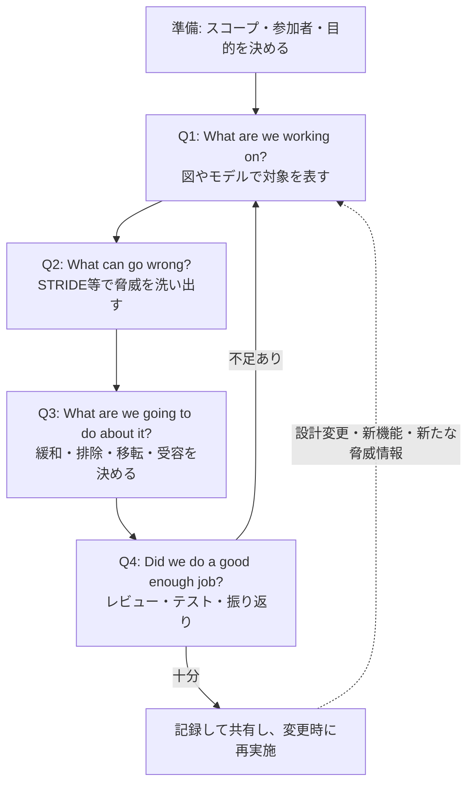
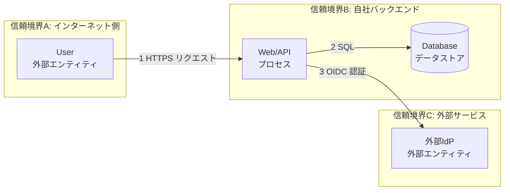
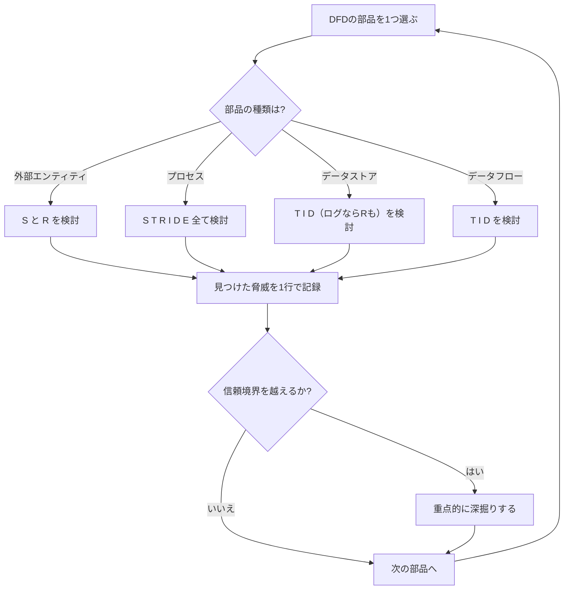
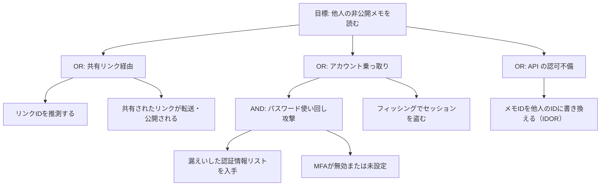
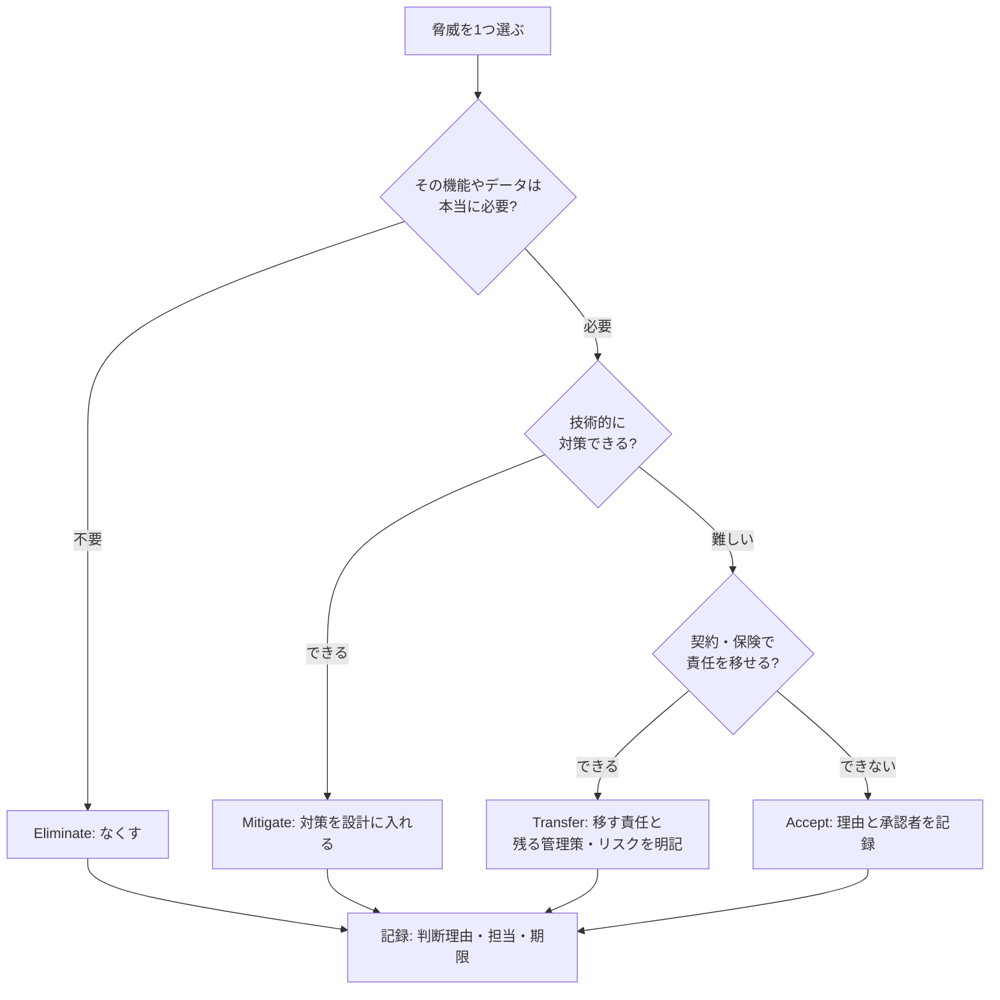
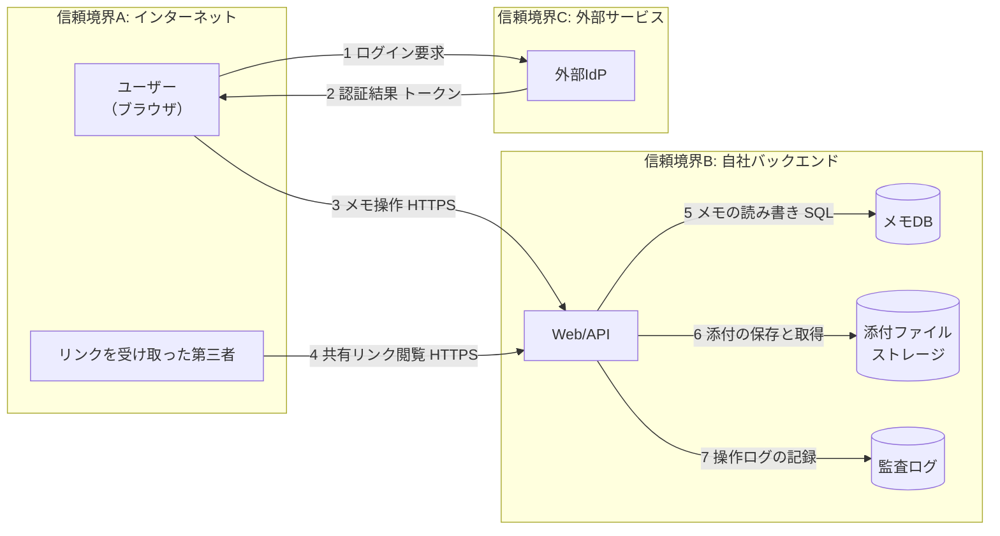
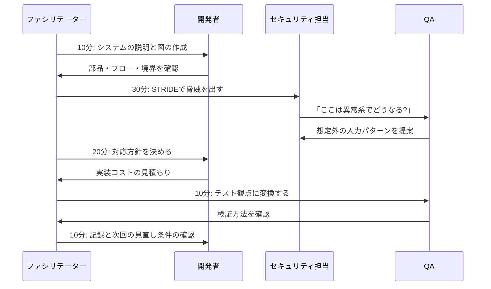
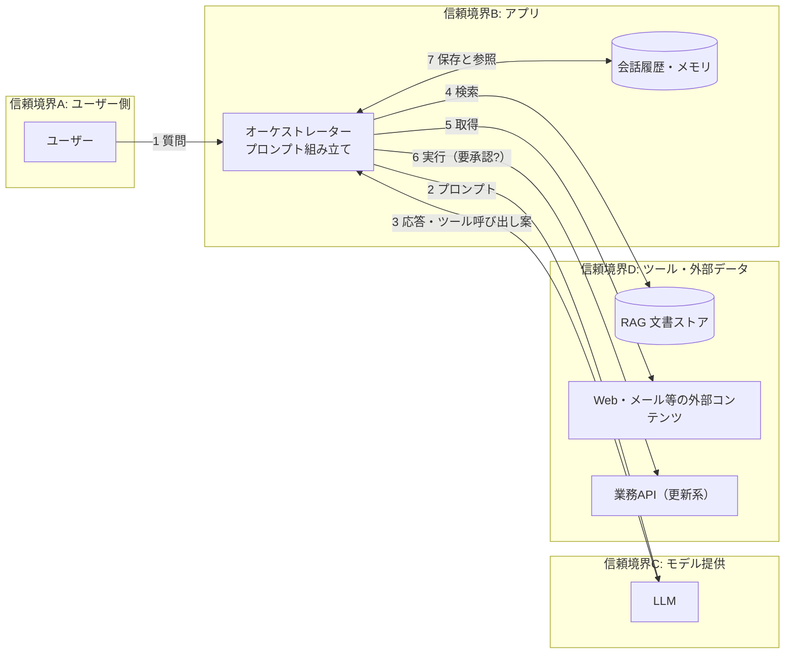
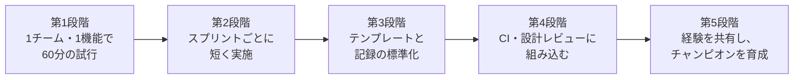

# 脅威モデリング（Threat Modeling）入門ガイド

**対象書籍**: Adam Shostack 著『Threat Modeling: Designing for Security』（Wiley, 2014）
**対象読者**: 初学者（開発者・QA・アーキテクト・セキュリティ未経験者）
**情報時点**: 2026年10月5日
**表記方針**: 日本語を基本とし、技術用語は英語のまま残します。図は Mermaid と Markdown の表のみを使用します。

> **このガイドの位置づけ**
> 書籍の内容を要約・転載するものではなく、書籍の考え方を入口にして、公開されている一次情報（Manifesto、OWASP、Shostack 氏のブログ等）で補強した「自分の言葉での解説」です。詳細は必ず原典（書籍・各 URL）で確認してください。出典は末尾の「参考文献」にまとめています。

---

## 目次

1. [脅威モデリングとは何か](#1-脅威モデリングとは何か)
2. [なぜ今、脅威モデリングなのか（2026年の文脈）](#2-なぜ今脅威モデリングなのか2026年の文脈)
3. [全体像：4つの質問（Four Question Framework）](#3-全体像4つの質問four-question-framework)
4. [Step 0：準備（スコープ・参加者・成果物）](#4-step-0準備スコープ参加者成果物)
5. [Step 1：What are we working on?（システムをモデル化する）](#5-step-1what-are-we-working-onシステムをモデル化する)
6. [Step 2：What can go wrong?（脅威を見つける）](#6-step-2what-can-go-wrong脅威を見つける)
7. [Step 3：What are we going to do about it?（対処する）](#7-step-3what-are-we-going-to-do-about-it対処する)
8. [Step 4：Did we do a good enough job?（検証する）](#8-step-4did-we-do-a-good-enough-job検証する)
9. [ハンズオン：メモ共有アプリを脅威モデリングする](#9-ハンズオンメモ共有アプリを脅威モデリングする)
10. [プライバシーの脅威モデリング（LINDDUN）](#10-プライバシーの脅威モデリングlinddun)
11. [AI・LLM・エージェントシステムの脅威モデリング](#11-aillmエージェントシステムの脅威モデリング)
12. [ツールとコードによる脅威モデリング](#12-ツールとコードによる脅威モデリング)
13. [組織に根づかせる（Manifesto と Capabilities）](#13-組織に根づかせるmanifesto-と-capabilities)
14. [初学者がやりがちな失敗](#14-初学者がやりがちな失敗)
15. [学習ロードマップと演習問題](#15-学習ロードマップと演習問題)
16. [用語集](#16-用語集)
17. [参考文献（情報源 URL）](#17-参考文献情報源-url)

---

## 1. 脅威モデリングとは何か

### 1.1 一文での定義

脅威モデリングとは、**システムの表現（図やモデル）を使って、セキュリティとプライバシーに関する懸念を洗い出し、対処を決める活動**です。Threat Modeling Manifesto はこの趣旨で定義しており、OWASP も「システムを敵対者の視点で分析し、脅威を特定して対応を決める、構造化された繰り返し可能なプロセス」と説明しています。

### 1.2 日常の例え：家の防犯

家を建てる前に、次のように考えるはずです。

| 質問 | 家の例 | ソフトウェアでの対応 |
|---|---|---|
| 何を作っている？ | 2階建て、玄関1つ、裏口1つ、窓6つ | アーキテクチャ図・データフロー図 |
| 何が悪くなりうる？ | 裏口の鍵が弱い、窓から侵入される、郵便物が盗まれる | 脅威の列挙（STRIDE など） |
| どうする？ | 鍵の交換、防犯ガラス、宅配ボックス | 緩和策（認証強化・暗号化・ログ） |
| 十分にできた？ | 鍵が本当に閉まるか確認、家族で確認 | レビュー・テスト・次回の見直し |

**建てた後に鍵を付け足すより、設計図の段階で考える方が安く済む**、というのが脅威モデリングの核心です。OWASP Cheat Sheet も、設計段階でセキュリティを「組み込む」（built-in）方が、運用後に「後付け」（bolted-on）するより効率的だと説明しています。

### 1.3 脅威モデリングが「やらないこと」

| よくある誤解 | 実際 |
|---|---|
| ペネトレーションテストの代わり | 設計段階の分析。テストは実装後の検証で、補完関係 |
| 脆弱性スキャナ | スキャナは「成果物」を見る。脅威モデリングは「設計と意図」を見る |
| セキュリティ専門家だけの仕事 | 開発者を含む全員がやるべきもの（Manifesto の Hero Threat Modeler アンチパターン） |
| 一度やれば終わり | システムの変化に合わせて繰り返す |
| 完璧な図が必要 | 完璧な表現は存在しない（Perfect Representation アンチパターン） |

### 1.4 書籍の位置づけ

Shostack 氏の本書は、2014年2月に Wiley から刊行された約624ページの書籍で、Microsoft の SDL（Security Development Lifecycle）での経験を土台にしています。特定の OS や言語に依存しない実践的な手順を、「資産中心・攻撃者中心・ソフトウェア中心」という3つの切り口で整理している点が特徴です（O'Reilly の書誌ページより）。

書籍の構成（章タイトルの概観）:

| Part | 内容 | 主な章 |
|---|---|---|
| I. Getting Started | まず飛び込んでやってみる | Dive In and Threat Model! / Strategies for Threat Modeling |
| II. Finding Threats | 脅威の見つけ方 | STRIDE / Attack Trees / Attack Libraries / Privacy Tools |
| III. Managing and Addressing Threats | 脅威の管理と対処 | Processing and Managing Threats / Defensive Tactics / Trade-Offs / Validating / Tools |
| IV. Technologies and Tricky Areas | 技術領域別 | Requirements Cookbook / Web and Cloud / Accounts and Identity / Human Factors / Cryptosystems |
| V. Taking It to the Next Level | 組織への展開 | Bringing TM to Your Organization / Experimental Approaches / Architecting for Success |

> **第2版について（2026年10月時点の最新情報）**
> Shostack 氏は2026年8月20日のブログで、第2版『Threat Modeling: Designing for Security in an AI World』の予約開始を発表しました。公式な刊行予定日は **2027年2月2日**です。内容の約半分が新規または大幅な書き直しで、LLM に関する新章2つ、境界（boundaries）の章、攻撃ライフサイクルモデルの章、防御パートの再構成、図とモデルの新章などが含まれると説明されています。また、初版の一部の章（Attack Trees、Attack Libraries、Threat Modeling Tools など）と付録の一部は、書籍のウェブサイトへ移す予定とのことです。
> **したがって本ガイドは「初版の考え方 ＋ 2026年時点の公開情報」で構成しています。** 第2版が出たら差分の確認をおすすめします。

---

## 2. なぜ今、脅威モデリングなのか（2026年の文脈）

### 2.1 設計の欠陥は「コードがきれいでも」起こる

OWASP Top 10:2025（2025年11月公開、2026年1月に確定）では、**A06: Insecure Design** は6位です。2021年版の4位から順位は下がりましたが、OWASP 自身が「脅威モデリングと安全な設計への注目が業界で高まった成果」と説明しています。設計の問題は「完璧なコードでも直せない」性質があるため、設計段階での分析が必要です。

OWASP Top 10:2025 の全体像（参考）:

| 順位 | カテゴリ | 脅威モデリングとの関係 |
|---|---|---|
| A01 | Broken Access Control（SSRF を吸収） | 認可の設計・信頼境界の見落とし |
| A02 | Security Misconfiguration | クラウド・IaC の境界と既定値 |
| A03 | Software Supply Chain Failures | 依存関係・CI/CD も「何を作っているか」に含める |
| A04 | Cryptographic Failures | 暗号の使いどころの設計 |
| A05 | Injection | 信頼境界を越える入力 |
| A06 | Insecure Design | 脅威モデリングそのものが対策 |
| A07 | Authentication Failures | Spoofing に対応 |
| A08 | Software or Data Integrity Failures | Tampering に対応 |
| A09 | Security Logging & Alerting Failures | Repudiation の対策に関係 |
| A10 | Mishandling of Exceptional Conditions | 失敗時の挙動（fail open など）の設計 |

### 2.2 AI が開発を加速しても、問いは変わらない

Shostack 氏は2026年8月の Black Hat USA での講演（PHANTOM-B アプローチ）について、「AI によって多くのものが再編される中でも、4つの質問はパイプラインの向こうにあるものが何であっても通用するので、脅威モデリングは最も影響を受けにくいセキュリティ手法の1つだ」という趣旨をまとめています（Shostack + Associates ブログ）。また Stephen de Vries 氏（Manifesto の共著者の1人）は、AI がコード生成・脆弱性発見・エクスプロイト開発を加速するほど、コードを書く前の設計段階での分析が重要になると論じています（2026年4月の Appsec roundup で紹介）。

### 2.3 規制・ガイダンスの流れ

脅威モデリングは「Secure by Design」の中核として位置づけられています。Manifesto の作成者グループは、CISA の Secure by Design 文書へのフィードバックで、ベンダーに「脅威モデリングをしているか、どの深さでやっているか」を尋ねることを提案しています。また OWASP Cheat Sheet は、NIST SP 800-218（SSDF）の PW.1.2 に沿って、脅威モデルの判断をシステムの変化に合わせて最新に保つよう推奨しています。

---

## 3. 全体像：4つの質問（Four Question Framework）

### 3.1 4つの質問

Shostack 氏が考案した、脅威モデリングの背骨です。Manifesto、OWASP Cheat Sheet もこれを採用しています。

| # | 質問（英語） | 日本語の意味 | この質問への主な手法 |
|---|---|---|---|
| 1 | What are we working on? | 何に取り組んでいるのか | DFD、アーキテクチャ図、ユースケース |
| 2 | What can go wrong? | 何がうまくいかなくなりうるか | STRIDE、攻撃木、キルチェーン、カードゲーム |
| 3 | What are we going to do about it? | それにどう対処するか | 緩和・排除・移転・受容 |
| 4 | Did we do a good enough job? | 十分にできたか | レビュー、テスト、振り返り |

### 3.2 質問文の「言葉選び」にも意味がある

Shostack 氏の GitHub リポジトリ（4QuestionFrame）によると、初版以降に次の調整が入っています。

| 変更点 | 意図 |
|---|---|
| you → **we** | 包括的・協働的にするため |
| should → **are**（第3問） | 行動に焦点を当てるため |
| building → **working on** | 新規開発だけでなく、改修・運用中のものも対象にするため |
| 第4問に「**enough**」を付ける（Manifesto の好み） | 目的は「脅威モデリングが上手になること」ではなく、「システムを改善すること」だから |

このフレームの論理は、2024年の Shostack + Associates ホワイトペーパー「Understanding the Four Question Framework for Threat Modeling」で詳しく解説されています。

### 3.3 プロセス全体のフロー



> **ポイント**: 矢印が「ループ」になっていることが大切です。Manifesto の価値観には、「1回の成果物」より「継続的な改善」、「スナップショット」より「理解の旅」が含まれます。

---

## 4. Step 0：準備（スコープ・参加者・成果物）

### 4.1 スコープを決める

第1の質問は、「何を作っているか」というより**スコープの質問**です。Shostack 氏自身、「今回のスプリントで何に取り組んでいるか」のような小さな単位で考えることを勧めています（Tromzo のポッドキャスト）。

| スコープ例 | 適切さ | 理由 |
|---|---|---|
| 「会社のシステム全部」 | 不適切 | 広すぎて終わらない |
| 「メモ共有アプリの共有リンク機能」 | 適切 | 1〜2時間で議論できる |
| 「今スプリントで追加するファイルアップロード」 | 適切 | 変更に追随できる |
| 「認証基盤の刷新」 | 適切 | 重要度が高く、分けて実施 |

スコープ外にしたものは「永久に対象外」ではなく、「**この脅威モデルでは扱わない**」という意味です。別の機会に分析します。

### 4.2 参加者

| 役割 | 貢献 |
|---|---|
| 開発者 | システムの実際の動作を知っている |
| アーキテクト | 全体構造と将来計画を知っている |
| QA | 異常系・境界値・誤用の発想が得意 |
| セキュリティ担当 | 既知の攻撃パターンと対策の知識 |
| プロダクト担当 | ビジネス上の重要度・許容できるリスク |
| 運用（SRE） | 実際の運用環境・監視・復旧 |

Manifesto は **Varied Viewpoints**（多様な視点）を推奨パターンとして挙げ、**Hero Threat Modeler**（特定の1人の天才に依存する状態）をアンチパターンとしています。

### 4.3 成果物の最小セット

| 成果物 | 内容 | 形式の例 |
|---|---|---|
| システム図 | 要素・データの流れ・信頼境界 | Mermaid、draw.io、ホワイトボード写真 |
| 脅威リスト | 脅威・影響する要素・重大度・対応・担当 | Markdown 表、Issue |
| 対応の記録 | 緩和策・受容理由・残留リスク | 同上 |
| 次回の見直し条件 | どんな変更で再実施するか | README の一節 |

---

## 5. Step 1：What are we working on?（システムをモデル化する）

### 5.1 データフロー図（DFD）の5つの部品

脅威モデリングで最もよく使われる図です。OWASP Cheat Sheet も「DFD が最も一般的なアプローチ」と述べています。

| 部品 | 意味 | 例 | 主な脅威 |
|---|---|---|---|
| **External Entity（外部エンティティ）** | システムの外にいる人やコード | ユーザー、外部 API、管理者 | Spoofing, Repudiation |
| **Process（プロセス）** | データを処理するコード | Web サーバー、API、ワーカー | STRIDE 全て |
| **Data Store（データストア）** | データを保存する場所 | DB、S3、キャッシュ、ログ | Tampering, Information Disclosure, DoS |
| **Data Flow（データフロー）** | データの移動 | HTTPS、SQL、メッセージキュー | Tampering, Information Disclosure, DoS |
| **Trust Boundary（信頼境界）** | 信頼レベルが変わる線 | インターネットと内部ネットワークの間 | 脅威が集中する場所 |

> 上表の「主な脅威」は「STRIDE per element」と呼ばれる整理の代表例です。ツールや流派で細部が異なります（たとえばログを保存するデータストアでは Repudiation も考えます）。Microsoft Threat Modeling Tool も STRIDE per element による案内を特徴として説明しています。

### 5.2 信頼境界（Trust Boundary）：最重要の概念

**信頼境界とは、「信頼レベルの異なる領域の間にあり、データや制御が両方向に越える線」**です。信頼されていない側から入ってくるフローだけでなく、信頼された側から外へ出ていくフロー（外部 API への送信、ログや応答に含まれる機密情報など）も境界を越えるものとして扱います。

| 境界の例 | 越えるもの | 考えること |
|---|---|---|
| インターネット → API ゲートウェイ | HTTP リクエスト | 誰からのものか確認できるか、入力は検証されるか |
| アプリ → データベース | SQL | 権限は最小か、入力がクエリを書き換えないか |
| 自社サービス → 外部 SaaS | API 呼び出し | 相手は正しい相手か、返ってきたデータを信用してよいか |
| ユーザーA のデータ → ユーザーB のデータ | テナント境界 | 認可で分離されているか |
| LLM への入力 → LLM の出力に基づく操作 | プロンプトとツール呼び出し | 外部コンテンツが指示になっていないか（第11章） |

Shostack 氏は2026年8月のブログで、第2版に「境界」の専用章を設けたことを紹介しています（理由は、受講者が境界で苦労する姿を多く見たため）。OWASP の解説でも「境界を明示することが STRIDE を適用する場所を決める」と整理されています。

### 5.3 DFD の例（Mermaid）

Mermaid では、信頼境界を `subgraph` で表現します。



### 5.4 良い図の条件

| チェック項目 | 理由 |
|---|---|
| 要素に名前が付いている | 会話で指せないと議論できない |
| データフローに「何が流れるか」が書いてある | 機密性の判断に必要 |
| 信頼境界が引かれている | 脅威が集中する場所 |
| 凡例・タイトル・日付がある | 後から見て分かる（Shostack 氏は共通要素の一貫した使用を成熟度の印と述べる） |
| 1枚に詰め込みすぎない | 全体図と詳細図を分ける（OWASP の推奨） |

### 5.5 「図」と「モデル」の違い（Shostack 氏の2026年の整理）

Shostack 氏は2026年9月24日のブログで、第2版では2つの言葉を区別したと説明しています。

| | 図（Diagram） | モデル（Model） |
|---|---|---|
| 性質 | 情報を「見せる」ピクセルの集まり | 属性が定義され、計算・検査できる構造 |
| 作りやすさ | 速くて自由（規則を破っても止められない） | 手間がかかるが、規則違反を検出できる |
| 例 | ホワイトボードの絵、draw.io | pytm・Threagile のようなコード/YAML モデル |
| 将来 | 説明用として残る | LLM がコストを下げ、モデル中心に移行する、と同氏は見通す |

**初学者への助言**: まずは図（ホワイトボードで十分）から始めてください。Shostack 氏自身、「Visio のライセンスが必要になるような障壁は、脅威モデルの品質を上げずにコストだけ上げる」という趣旨を述べています。

### 5.6 クラウド環境での注意

OWASP Cheat Sheet は、クラウドネイティブでは従来の STRIDE や DFD に調整が必要だと述べています。

| 観点 | 追加で図に載せるもの |
|---|---|
| 共有責任モデル | どの制御がクラウド事業者側で、どれが自社側か |
| ID と権限 | IAM ロール、フェデレーション、マルチテナント |
| 動的な基盤 | コンテナ、サーバーレス、IaC |
| データの所在 | リージョン、法規制（データレジデンシー） |

---

## 6. Step 2：What can go wrong?（脅威を見つける）

### 6.1 3つの切り口（書籍の整理）

脅威を探すときの「視点」は、大きく3つあります。

| 視点 | 問いの立て方 | 長所 | 短所 |
|---|---|---|---|
| **資産中心（Asset-centric）** | 守るべき大事なものは何か。それが狙われるとどうなるか | ビジネス上の重要度と結びつけやすい | 資産の洗い出し自体が重い |
| **攻撃者中心（Attacker-centric）** | 誰が、なぜ、どうやって攻撃するか | 動機や手口が具体的になる | 攻撃者像の想像が偏りやすい |
| **ソフトウェア中心（Software-centric）** | 設計・図の各部品に何が起こりうるか | 開発者が着手しやすく、網羅しやすい | 図に載っていないものは見落とす |

**初学者はソフトウェア中心（図＋STRIDE）から始める**のが最も取り組みやすく、書籍でも主軸になっています。

### 6.2 STRIDE：6種類の脅威

STRIDE は Loren Kohnfelder 氏と Praerit Garg 氏が1999年に Microsoft で考案した、脅威の分類法です。6つの頭文字で覚えます。**それぞれが「守りたい性質」の侵害に対応している**ことが理解の鍵です。

| 文字 | 脅威 | 破られる性質 | 一言でいうと | 具体例 | 代表的な対策 |
|---|---|---|---|---|---|
| **S** | Spoofing（なりすまし） | 認証（Authentication） | 他人のふりをする | 盗んだパスワードでログイン、偽の API クライアント | 多要素認証、相互認証、証明書、署名付きトークン |
| **T** | Tampering（改ざん） | 完全性（Integrity） | データやコードを書き換える | 通信中の値の書き換え、DB の直接編集、依存パッケージの差し替え | 署名、MAC、ハッシュ、アクセス制御、TLS、SBOM と署名検証 |
| **R** | Repudiation（否認） | 否認防止・説明責任（Non-repudiation / Accountability） | 「やっていない」と言える | 操作ログが無い、ログが改ざんできる | 監査ログ、ログの保護、タイムスタンプ、デジタル署名 |
| **I** | Information Disclosure（情報漏えい） | 機密性（Confidentiality） | 見せてはいけない情報が見える | エラーメッセージに内部情報、S3 が公開、他人のデータが見える | 暗号化、最小権限、データ最小化、適切なエラー処理 |
| **D** | Denial of Service（サービス拒否） | 可用性（Availability） | 使えなくする | 大量リクエスト、重い処理の連打、ディスクを満杯にする | レート制限、クォータ、タイムアウト、冗長化、キャッシュ |
| **E** | Elevation of Privilege（権限昇格） | 認可（Authorization） | 持っていない権限を得る | 一般ユーザーが管理 API を呼べる、IDOR | 認可チェックの一元化、最小権限、入力検証、サンドボックス |

> OWASP の Cheat Sheet では、R の対応を「Accounting（説明責任）」と表現しています。同じ概念を指しています。

#### STRIDE の覚え方（実務のコツ）

| 質問の形 | 対応する文字 |
|---|---|
| 「この相手は本当にその人か？」 | S |
| 「この値は途中で変えられないか？」 | T |
| 「あとで『やってない』と言われたら証明できるか？」 | R |
| 「見えてはいけない人に見えないか？」 | I |
| 「大量に使われたら止まらないか？」 | D |
| 「権限のない操作ができてしまわないか？」 | E |

### 6.3 STRIDE per element：図の部品ごとに当てはめる

DFD の各部品に、起こりうる脅威の文字を当てはめます。

| 図の部品 | S | T | R | I | D | E |
|---|:---:|:---:|:---:|:---:|:---:|:---:|
| 外部エンティティ | ○ |  | ○ |  |  |  |
| プロセス | ○ | ○ | ○ | ○ | ○ | ○ |
| データストア |  | ○ | △ | ○ | ○ |  |
| データフロー |  | ○ |  | ○ | ○ |  |

（△：ログを保存するデータストアの場合に考える。流派やツールによって細部は異なります。）



**進め方の例**: 「Web/API（プロセス）に Spoofing は？」→「トークンを盗まれたら他人として操作できる」→ 記録、のように1つずつ進めます。

### 6.4 攻撃木（Attack Tree）

攻撃木は、Bruce Schneier 氏が1999年に Dr. Dobb's Journal で紹介した手法で、**攻撃者の目標を根に置き、それを達成する方法を枝に展開**します。

| ノードの種類 | 意味 | コストの計算（コストを評価する場合） |
|---|---|---|
| **OR** | 子のどれか1つで達成できる | 子の中で最も安いもの |
| **AND** | 子の全てが必要 | 子の合計 |



**使いどころ**: 特に重要な1つの目標（例：機密データの流出）について、**攻撃の経路を網羅**したいときに有効です。第2版では、攻撃木の章を書籍のウェブサイトに移す予定と発表されています（前述）。

### 6.5 攻撃ライブラリ（Attack Libraries）とキルチェーン

ゼロから考えず、**既知の攻撃の一覧から思い出す**方法です。

| ライブラリ | 内容 | 使い方 |
|---|---|---|
| **CAPEC**（MITRE） | 攻撃パターンの体系的な一覧 | 設計上の弱点に対応するパターンを探す |
| **OWASP Top 10:2025** | Web アプリの主要リスク10種 | チェックリストとして図の部品に当てはめる |
| **MITRE ATT&CK** | 実際の攻撃者の戦術・技術の知識ベース | 侵入後の行動（横展開・持ち出し等）を考える |
| **Cyber Kill Chain**（Lockheed Martin、2011年） | 攻撃の段階を7つに分けたモデル | 「どの段階で止められるか」を考える |

> MITRE ATT&CK は継続的に更新されており、2026年時点では v19 系が公開されています（バージョンは必ず公式サイトで確認してください）。

### 6.6 カードゲーム：Elevation of Privilege（EoP）

Shostack 氏は2010年に、**脅威モデリングを学ぶカードゲーム「Elevation of Privilege」**を作りました。スートが STRIDE の6種類になっており、プレイヤーが自分のカードに書かれた脅威が対象システムに当てはまるかを議論し、当てはまれば得点を取ります。

| 項目 | 内容 |
|---|---|
| 目的 | 勝つこと自体より、**脅威の議論を引き出すこと** |
| 向いている場面 | チームで初めて脅威モデリングをするとき |
| 関連ゲーム | OWASP Cornucopia（Web アプリ向け）、Cumulus（クラウド向け）など |

初学者のチームには特におすすめです。**ツールの習得ではなく、会話から始められる**ためです。

### 6.7 どの手法を選ぶか

| 状況 | おすすめ |
|---|---|
| 初めて・時間が少ない | DFD ＋ STRIDE per element、または EoP |
| 特定の重要資産を深掘りしたい | 攻撃木 |
| Web アプリ全般 | OWASP Top 10 を併用 |
| 侵入後の被害拡大を考えたい | ATT&CK、キルチェーン |
| 個人データを扱う | LINDDUN（第10章）を併用 |
| LLM・エージェント | 第11章 |

> **重要**: 手法は道具です。OWASP の Cheat Sheet も、STRIDE と DFD は一例であり、他の手法でも構わないと述べています。目的は「脅威を見つけて対処すること」で、手法の遵守ではありません。

---

## 7. Step 3：What are we going to do about it?（対処する）

### 7.1 4つの対応方針

OWASP Cheat Sheet では、見つけた脅威への対応を次の4つで整理しています。

| 方針 | 意味 | 例 |
|---|---|---|
| **Mitigate（緩和）** | 自分たちの管理策で起こりにくくする・被害を小さくする | レート制限、入力検証、暗号化、標準ライブラリによるトークン検証 |
| **Eliminate（排除）** | 機能・データ自体をなくす | 使わない管理 API を削除、不要なデータを保存しない |
| **Transfer（移転）** | 契約や保険により、リスクの責任や金銭的損失を第三者に移す | サイバー保険、SLA・補償条項付きの委託契約 |
| **Accept（受容）** | リスクを理解したうえで何もしない | 影響が小さく対策費が見合わない |

> **Transfer の注意**: マネージド IdP などのサービスを使うだけでは Transfer になりません。トークン検証や設定は自分たちの管理策（Mitigate）として残ります。Transfer と記録する場合は、「契約上・金銭上で何の責任が移るか」と「自分たちに残る管理策と残留リスク」の両方を明記してください。



> **最も強いのは Eliminate** です。「守るべきものを持たなければ、守る必要がない」からです。

### 7.2 優先順位の付け方

全ての脅威を直すことはできません。優先順位が必要です。

| 方法 | 内容 | 注意点 |
|---|---|---|
| 単純な3段階（High / Medium / Low） | 影響と起こりやすさの感覚で分ける | 初学者にはこれで十分。基準を文章で決める |
| バグバー（Bug Bar） | 「この条件なら Critical」と事前に決めた基準 | Microsoft が DREAD の代わりに採用した考え方 |
| CVSS | 脆弱性の深刻度の標準指標 | 設計段階の脅威には粗すぎることがある |
| DREAD | 5項目の点数で評価 | 評価者によって値がばらつきやすく、Shostack 氏らは非推奨 |

**DREAD を避ける理由（概要）**: 「見つけやすさ」などの項目は主観が入りやすく、同じ脅威でも評価者で点数が変わります。さらに、見つけやすさは「攻撃者が知るまで低い」という時間依存の性質を持ちます。再現性の高い基準（バグバー）の方が運用しやすい、と整理されています。

### 7.3 「性質」から「対策」を引く表

STRIDE の各脅威は、守りたい性質に対応しているため、**対策もその性質から選べます**。

| 守りたい性質 | 対策の考え方 | 具体的な技術 |
|---|---|---|
| 認証 | 相手を確かめる | MFA、OIDC、mTLS、パスキー |
| 完全性 | 変えられない・変えたら分かる | 署名、ハッシュ、DB の権限分離、IaC のレビュー |
| 否認防止 | 記録して改ざんを防ぐ | 追記専用ログ、集中ログ、時刻同期 |
| 機密性 | 見える人を絞る | 暗号化（保存時・通信時）、最小権限、マスキング |
| 可用性 | 止まりにくくする | レート制限、オートスケール、バックアップ、タイムアウト |
| 認可 | 許可を中央で判断する | RBAC/ABAC、ポリシーエンジン、リソース単位のチェック |

**自作の暗号や認証に頼らない**ことが重要です。標準的で枯れた方式（TLS、OIDC など）を使うのが基本です。

### 7.4 脅威を記録する（テンプレート）

1つの脅威は、後から読んで分かる形で記録します。Issue トラッカーで管理する場合は、次の項目をそのまま Issue のテンプレートにできます。

```markdown
### TM-001: 共有リンクIDの推測による非公開メモの閲覧

- 対象要素: Web/API → DB（データフロー、信頼境界B）
- STRIDE: Information Disclosure
- 脅威の説明: 共有リンクのIDが連番のため、第三者が推測して他人のメモを閲覧できる
- 影響: High（個人のメモが漏えいする）
- 起こりやすさ: High（スクリプトで容易に試せる）
- 対応方針: Mitigate
- 対策: 十分に長いランダムIDを使用、リンクに有効期限を設定、失効機能を提供
- 担当 / 期限: （チームで決める）
- 状態: Open / In progress / Done / Accepted
```

---

## 8. Step 4：Did we do a good enough job?（検証する）

### 8.1 検証の3つの観点

| 観点 | 問い | 具体的な行動 |
|---|---|---|
| **モデルの品質** | 図は実態と合っているか。見落とした部品はないか | 実装担当者に図を確認してもらう |
| **脅威の網羅** | 全ての部品・境界に STRIDE を当てたか | 部品 × STRIDE のチェック表で埋める |
| **対策の実効性** | 決めた対策は実装され、効いているか | テスト、コードレビュー、ペンテスト |

### 8.2 部品 × STRIDE のチェック表（例）

| 要素 | S | T | R | I | D | E |
|---|:---:|:---:|:---:|:---:|:---:|:---:|
| User（外部） | TM-002 | - | TM-007 | - | - | - |
| Web/API | TM-003 | TM-004 | TM-007 | TM-001 | TM-008 | TM-005 |
| Database | - | TM-009 | 該当なし | TM-010 | TM-011 | - |
| User → API フロー | - | TM-004 | - | TM-012 | TM-008 | - |

「該当なし」と「未検討」を区別して書くことが大切です。

### 8.3 脅威モデルをテストにつなげる

脅威モデリングの結果は、QA やセキュリティテストの**テスト観点**になります。

| 脅威 | テストの例 |
|---|---|
| なりすまし | 期限切れ・改ざんトークンで API が拒否するか |
| 改ざん | リクエスト内の ID や金額を書き換えたとき拒否されるか |
| 否認 | 重要操作が誰が・いつ行ったか追えるか（ログ確認） |
| 情報漏えい | 他ユーザーのリソース ID を指定すると 403/404 になるか |
| サービス拒否 | 大きなファイル・大量リクエストで制限が働くか |
| 権限昇格 | 一般ユーザーが管理者 API を呼ぶと拒否されるか |

### 8.4 いつやり直すか

| きっかけ | 例 |
|---|---|
| 設計の変更 | 新しい外部サービスとの連携、認証方式の変更 |
| 新機能 | ファイルアップロード、共有機能の追加 |
| 新たな脅威情報 | 利用ライブラリの重大な脆弱性、類似サービスでの事故 |
| 事故・ヒヤリハット | インシデントの振り返りで見つかった前提の誤り |
| 定期見直し | 四半期・半期など、チームで決めた周期 |

OWASP Cheat Sheet も、脅威モデルを「リビングドキュメント（生きた文書）」として扱い、システムが変わるたびに更新するよう推奨しています。

---

## 9. ハンズオン：メモ共有アプリを脅威モデリングする

### 9.1 題材

**「メモ共有アプリ」**（架空）を題材に、4つの質問を最初から最後まで通します。

| 項目 | 内容 |
|---|---|
| 機能 | ログイン、メモの作成・編集、リンクで他人と共有、添付ファイルのアップロード |
| 構成 | ブラウザ → Web/API → データベース ＋ オブジェクトストレージ。ログインは外部 IdP（OIDC） |
| 守るべきもの | メモの内容（個人情報を含みうる）、アカウント、サービスの可用性 |
| スコープ | 今回は「共有リンク機能」と「添付ファイルのアップロード」 |

### 9.2 Q1：何に取り組んでいるか（DFD）



### 9.3 Q2：何が起こりうるか（STRIDE per element）

| ID | 対象 | STRIDE | 脅威 | 重大度 |
|---|---|---|---|---|
| TM-001 | フロー4（共有リンク） | I | リンクIDが推測可能で、他人の非公開メモが読める | High |
| TM-002 | フロー1〜2（認証） | S | 盗まれたトークンで他人になりすませる | High |
| TM-003 | Web/API | S | トークン検証が不十分で、偽造トークンを受け入れる | High |
| TM-004 | フロー3（メモ操作） | T | メモIDを書き換えて他人のメモを編集できる（IDOR） | High |
| TM-005 | Web/API | E | 一般ユーザーが管理用エンドポイントを呼べる | High |
| TM-006 | 添付ストレージ | T / I | 悪意あるファイルが配信され、閲覧者の端末で実行される | Medium |
| TM-007 | 監査ログ | R | 共有設定の変更が記録されず、誰がやったか追えない | Medium |
| TM-008 | Web/API | D | 巨大ファイルや大量リクエストでサービスが停止する | Medium |
| TM-009 | メモDB | T | API の入力が SQL に混入し、データが書き換えられる | High |
| TM-010 | メモDB | I | バックアップが暗号化されず、流出するとメモが全て読める | High |
| TM-011 | メモDB | D | 重いクエリの連発で DB が応答しなくなる | Medium |
| TM-012 | フロー5 | I | 内部通信が平文で、盗聴で内容が漏れる | Low |

> **気づきポイント**: 信頼境界（A→B、B→C）を越えるフローに High が集中しています。これが「境界を最初に引く」理由です。

### 9.4 Q3：どう対処するか

| ID | 方針 | 対策 |
|---|---|---|
| TM-001 | Mitigate | 128bit 以上のランダムID、リンクの有効期限と失効機能、既定は「リンクを知る人のみ」ではなく範囲を選べる UI |
| TM-002 | Mitigate | MFA/パスキーの提供、トークンの短寿命化、端末紐付け |
| TM-003 | Mitigate | 標準ライブラリで署名・有効期限・issuer・audience を検証。IdP のマネージド機能（鍵ローテーション等）を活用するが、検証の責任は自社に残る |
| TM-004 | Mitigate | 全 API でオブジェクト単位の認可チェックを共通化し、テストで検証 |
| TM-005 | Eliminate / Mitigate | 管理機能を別ネットワークに分離。不要なエンドポイントは削除 |
| TM-006 | Mitigate | ファイル種別の検証、別ドメインから配信、ダウンロード強制、スキャン |
| TM-007 | Mitigate | 共有設定変更を追記専用ログに記録（誰が・いつ・何を） |
| TM-008 | Mitigate | サイズ上限、レート制限、タイムアウト |
| TM-009 | Mitigate | プレースホルダ（パラメータ化クエリ）、DB 権限の最小化 |
| TM-010 | Mitigate | バックアップの暗号化、鍵の分離管理 |
| TM-011 | Mitigate | クエリのタイムアウト、ページング、接続数の上限 |
| TM-012 | Accept → 改善 | 当面は閉域内。将来のクラウド移行時に TLS 化する（理由と期限を記録） |

### 9.5 Q4：十分にできたか

| チェック | 結果の例 |
|---|---|
| 図は実態を反映しているか | 開発者レビューで、非同期ジョブ（サムネイル生成）が図から漏れていたと判明 → 図を更新 |
| 全要素に STRIDE を当てたか | チェック表で、監査ログの Tampering が未検討と判明 → TM-013 を追加 |
| 対策はテスト可能か | TM-004 は「他ユーザーのメモID指定で 403」をテストケース化 |
| 次回の見直し条件 | 新しい外部連携の追加時、または半期ごと |

### 9.6 会議の進め方（60〜90分の例）



---

## 10. プライバシーの脅威モデリング（LINDDUN）

STRIDE は主にセキュリティの脅威を扱います。**個人データを扱うシステム**では、プライバシー固有の脅威も見る必要があります。代表的な手法が **LINDDUN**（KU Leuven の研究グループが開発）です。

### 10.1 LINDDUN の7種類

| 文字 | 脅威 | 意味 | 例 |
|---|---|---|---|
| **L** | Linking | 別々のデータを結びつけられる | 匿名の閲覧履歴と購買履歴を突合して個人が分かる |
| **I** | Identifying | 個人が特定される | 「匿名」データから氏名が推測できる |
| **N** | Non-repudiation | 否認できない（プライバシー上は不利益になる場合がある） | 内部告発者の投稿が本人に結びつく |
| **D** | Detecting | 存在や関与が検知される | 特定のクリニックの予約システムに登録されている事実が分かる |
| **D** | Data Disclosure | データが過剰に開示される | 必要以上の項目を第三者に提供 |
| **U** | Unawareness & Unintervenability | 本人が知らない・関与できない | 利用目的が不明、削除要求ができない |
| **N** | Non-compliance | 規制や方針への不適合 | 同意の無い利用、保存期間の超過 |

> 初版の書籍にもプライバシー関連の章があります。LINDDUN は OWASP Threat Dragon などのツールでも選択でき、実務で使いやすくなっています。

### 10.2 STRIDE と LINDDUN の使い分け

| 状況 | 推奨 |
|---|---|
| 個人情報をほぼ扱わない | STRIDE で十分 |
| 個人情報を扱う | STRIDE ＋ LINDDUN（または LINDDUN の簡易カード版） |
| 要配慮情報（健康・位置情報など） | LINDDUN を重点的に。法務・プライバシー担当も参加 |

---

## 11. AI・LLM・エージェントシステムの脅威モデリング

### 11.1 基本姿勢：問いは変わらない、境界が増える

LLM を使うシステムでも、4つの質問は同じです。変わるのは「**信頼境界の位置**」と「**入力が指示にもなりうる**」という性質です。Shostack 氏は第2版で LLM に関する章を2つ設け、2026年のブログでも LLM への脅威を継続的に取り上げています。

LLM に関わる立場は、少なくとも3つに分けて考えると整理しやすくなります。

| 立場 | 例 | 主な懸念 |
|---|---|---|
| **LLM を呼び出す** | SaaS の API を使うアプリ | 外部へ送るデータ、返答の扱い、提供元への依存 |
| **LLM を動かす** | 自社環境でモデルをホスト | モデルとインフラの保護、重みの管理 |
| **LLM を学習・調整する** | ファインチューニング、RAG の構築 | 学習データの汚染、データ流出 |

### 11.2 LLM アプリの DFD（例）



**ポイント**: 「5 取得」した外部コンテンツは**信頼できない入力**ですが、プロンプトに入れた瞬間に LLM から見て「指示」と区別できなくなります。ここが従来のアプリに無い最大の違いです。

### 11.3 STRIDE を LLM に当てはめる

| STRIDE | LLM・エージェントでの具体例 | 対策の方向性 |
|---|---|---|
| Spoofing | 偽のツール／偽のエージェントになりすます、他ユーザーの会話を装う | ツールやエージェントの ID と認証、署名 |
| Tampering | 間接プロンプトインジェクションで指示が書き換わる、RAG 文書の汚染、メモリの改ざん | 外部データの分離・検証、書き込み権限の最小化 |
| Repudiation | エージェントが何をなぜ実行したか追えない | ツール呼び出しと根拠の完全な記録 |
| Information Disclosure | プロンプトや学習データ、他ユーザーの情報が応答に混ざる | 文脈ごとのアクセス制御、出力フィルタ、データ最小化 |
| Denial of Service | 長大な入力・再帰的なツール呼び出しでコストと時間が膨らむ | トークン・回数・費用の上限 |
| Elevation of Privilege | LLM に与えた権限で、ユーザーの権限を超える操作をしてしまう | **エージェントの権限をユーザーの権限以下に**、重要操作は人の承認 |

### 11.4 参照すべき公開フレームワーク

| 資料 | 内容 |
|---|---|
| OWASP Top 10 for LLM Applications（2025年版） | LLM アプリの主要リスク（プロンプトインジェクション等） |
| OWASP Top 10 for Agentic Applications 2026 | 自律的に動くエージェント特有のリスク10項目（2025年12月公開。最上位は Agent Goal Hijack（目標の乗っ取り）） |
| MITRE ATLAS | AI システムへの攻撃の戦術・技術の知識ベース（ATT&CK の AI 版） |
| Shostack 氏のブログ（2026年） | LLM への脅威、図とモデルの扱い、第2版の予告 |

### 11.5 AI を「使って」脅威モデリングする場合

| 使い方 | 向いている | 注意 |
|---|---|---|
| 図の下書き、文書からの要素抽出 | ○ | 実態と違う場合があるので、必ず開発者が確認 |
| STRIDE の網羅チェック（見落とし探し） | ○ | 「それらしい」脅威が並ぶだけになりやすい |
| 脅威の優先順位の最終判断 | △ | 文脈（事業・許容リスク）を知る人が決める |
| 人間の議論の代替 | × | 脅威モデリングの価値の多くは**チームの会話と共有理解**にある |

Manifesto の価値観にあるとおり、「ツールより人と協力」「やることが大事」という姿勢を保ち、AI は**下書きと見落とし発見の補助**として使うのが安全です。

---

## 12. ツールとコードによる脅威モデリング

### 12.1 主なツール

| ツール | 特徴 | 向いている人 |
|---|---|---|
| **Microsoft Threat Modeling Tool** | DFD を描くと STRIDE per element で脅威を提案する。SDL の一部として提供 | Microsoft 環境、初めての人 |
| **OWASP Threat Dragon** | オープンソース。Web／デスクトップ版。STRIDE や LINDDUN に対応 | 無料で GUI から始めたい人 |
| **pytm** | Python コードでシステムを書くと、DFD と脅威レポートを生成 | 開発者、CI に組み込みたい人 |
| **Threagile** | YAML でモデルを書き、リスクルールで自動評価 | アジャイル・DevOps チーム |
| ホワイトボード／draw.io／Mermaid | 道具に縛られない | 最初の1回、ワークショップ |

### 12.2 pytm の最小例

> 実際に動かす前に、公式リポジトリの README で最新の使い方を確認してください（API は更新されます）。

```python
from pytm import TM, Actor, Boundary, Datastore, Dataflow, Server

tm = TM("メモ共有アプリ")
tm.description = "共有リンクと添付アップロードを含む脅威モデル"
tm.isOrdered = True

internet = Boundary("Internet")
backend = Boundary("Backend")

user = Actor("User")
user.inBoundary = internet

api = Server("Web/API")
api.inBoundary = backend

db = Datastore("MemoDB")
db.inBoundary = backend

Dataflow(user, api, "メモ操作 (HTTPS)")
Dataflow(api, db, "メモの読み書き (SQL)")

tm.process()
```

実行の目安:

| 目的 | コマンド（pytm の README に基づく例） |
|---|---|
| 図を生成する | `python3 tm.py --dfd` を Graphviz に渡す |
| 脅威レポートを生成する | `python3 tm.py --report` を使う |

### 12.3 「コードとしての脅威モデル」の利点と注意

| 利点 | 注意 |
|---|---|
| コードと同じリポジトリでレビュー・差分管理できる | 書くための学習コストがある |
| 変更のたびに再生成できる（継続的） | 自動生成の脅威は**ノイズ**も多く、人の判断が必要 |
| 規則違反（境界を越えるのに暗号化なし等）を機械で検出できる | モデルが実態とずれると誤った安心につながる |

Shostack 氏は、図は「見せるためのもの」、モデルは「検査できるもの」と整理し、今後は LLM がモデル作成のコストを下げると見通しています（第5章 5.5 参照）。**初学者はまず図から始め、慣れたらコード化を検討**するのが現実的です。

---

## 13. 組織に根づかせる（Manifesto と Capabilities）

### 13.1 Threat Modeling Manifesto

2020年に、Shostack 氏を含む実践者たちが公開した宣言です。**価値観・原則・パターン・アンチパターン**で構成されます。

#### 価値観（左を右より重んじる）

| 重んじるもの | 軽んじるもの |
|---|---|
| 設計上の問題を見つけて直す文化 | 形式的なコンプライアンス |
| 人と協力 | プロセス・方法論・ツール |
| 理解の旅 | セキュリティ／プライバシーのスナップショット |
| 脅威モデリングを**やる** | 脅威モデリングについて**語る** |
| 継続的な改善 | 1回きりの成果物 |

#### パターン（良い習慣）

| パターン | 意味 |
|---|---|
| Systematic Approach | 体系的な手順に沿って行う |
| Informed Creativity | 知識と創造性で脅威を探す |
| Varied Viewpoints | 多様な立場の視点を入れる |
| Useful Toolkit | 目的に合う道具を揃える |
| Theory into Practice | 理論を実践へ落とし込む |

#### アンチパターン（避けたい習慣）

| アンチパターン | 意味 | 対処 |
|---|---|---|
| Hero Threat Modeler | 特定の1人に頼る | チームで実施し、知識を広げる |
| Admiration for the Problem | 問題を並べるだけで終わる | 必ず対応方針まで決める |
| Tendency to Overfocus | 一部（例：暗号）にこだわり、全体を見ない | 4つの質問に戻る |
| Perfect Representation | 完璧な図を作ろうとして進まない | 「十分な」図で始める |

### 13.2 Threat Modeling Capabilities

Manifesto の作成者グループは2024年に、**組織が持つべき脅威モデリング能力の一覧（Capabilities）**を公開しました。個人の手法ではなく、組織としての成熟度（誰が、どう学び、どう運用に組み込むか）を考えるための資料です。

### 13.3 小さく始めるためのロードマップ



| 段階 | 目標 | 成功の目安 |
|---|---|---|
| 1 | 1回やってみる | 脅威が5件以上出て、対応が1件以上決まる |
| 2 | 習慣にする | 新機能の設計レビューに必ず含まれる |
| 3 | 品質を揃える | 誰がやっても同じ項目が記録される |
| 4 | 仕組みに組み込む | 変更時に自動で再実施のきっかけが出る |
| 5 | 広げる | チーム外にも実施できる人がいる |

---

## 14. 初学者がやりがちな失敗

| # | 失敗 | なぜ問題か | 対処 |
|---|---|---|---|
| 1 | 図が複雑すぎて議論が進まない | 見るべき場所が分からない | 全体図と詳細図に分け、スコープを絞る |
| 2 | 信頼境界を引かない | 脅威が集中する場所を見落とす | 最初に境界を3つ引く |
| 3 | STRIDE の用語の暗記が目的になる | 脅威を見つけることが目的 | 「守りたい性質」から考える |
| 4 | 脅威を出して終わる | 対応が決まらないと価値がない | Q3 を必ず時間枠に入れる |
| 5 | セキュリティ担当だけで行う | システムの実態を知らず、的外れになる | 開発者・QA・運用を呼ぶ |
| 6 | 一度作った脅威モデルを放置する | システムとずれて無意味になる | 再実施のきっかけを記録する |
| 7 | 攻撃者を「全能」と仮定する | 全てが高リスクになり、優先順位が付かない | 攻撃者像（動機・能力・資源）を明示する |
| 8 | 対策を「検討済み」にするだけで実装を追わない | 絵に描いた餅になる | Issue 化し、テストで確認する |
| 9 | 自作の暗号・認証に頼る | 脆弱になりやすい | 標準方式・マネージドサービスを使う |
| 10 | ツール選びに時間をかける | 価値は会話から生まれる | ホワイトボードで始める |

---

## 15. 学習ロードマップと演習問題

### 15.1 4週間の学習プラン

| 週 | テーマ | 行うこと |
|---|---|---|
| 1 | 全体像 | 第1〜3章を読み、4つの質問を暗唱できるようにする。自分のシステムの図を1枚描く |
| 2 | 脅威の発見 | STRIDE per element で図の全要素に脅威を書く。EoP を同僚と1回遊ぶ |
| 3 | 対処と検証 | 脅威を Issue 化し、優先順位と対応方針を決め、テスト観点にする |
| 4 | 発展 | LINDDUN または LLM 向け（第10・11章）を試し、Manifesto を読む |

### 15.2 演習問題

**演習1（基本）**: 次の要素に、STRIDE のどの文字が主に当てはまるか答えてください。

| 要素 | 当てはまる文字は？ |
|---|---|
| (a) 外部エンティティ「ユーザー」 | |
| (b) データストア「DB」 | |
| (c) データフロー「HTTPS」 | |
| (d) プロセス「API」 | |

<details>
<summary>解答の目安</summary>

(a) S, R　(b) T, I, D（ログ保存ならR も）　(c) T, I, D　(d) S, T, R, I, D, E の全て

</details>

**演習2（境界）**: 自分のシステムで、信頼境界を3つ挙げ、それぞれ「何がその境界を越えるか」を書いてください。

**演習3（対応方針）**: 次の脅威に Mitigate / Eliminate / Transfer / Accept のどれが適切か、理由とともに答えてください。

| 脅威 | あなたの答え |
|---|---|
| 使っていない管理画面が外部に公開されている | |
| パスワード管理を自前で実装しているが、認証基盤のマネージドサービスが利用可能 | |
| 社内ツールの画面の表示が、まれに2秒遅くなる | |

<details>
<summary>解答の目安</summary>

1つ目は **Eliminate**（不要なら削除）。2つ目は **Mitigate**（自前実装をやめ、実績のあるマネージドサービスへ移行してリスクを下げる。連携設定やトークン検証の責任は自社に残るため、サービス利用だけでは Transfer ではない。契約で補償や責任分担を定めた部分のみ Transfer として記録する）。3つ目は影響が小さければ **Accept**（理由を記録）。

</details>

**演習4（LLM）**: 社内文書を検索して要約し、メールの下書きを作る LLM エージェントがあります。信頼境界を3つ挙げ、最も危険だと思う脅威を1つ選んで対策を書いてください。（ヒント：メールや文書の中身は「信頼できない入力」です）

**演習5（実践）**: 自分のチームの直近の機能を1つ選び、第9章と同じ手順で60分の脅威モデリングを実施し、結果を Markdown で記録してください。

---

## 16. 用語集

| 用語 | 意味 |
|---|---|
| Threat（脅威） | 資産に害を与えうる、起こりうる出来事 |
| Vulnerability（脆弱性） | 脅威に悪用されうる弱点 |
| Risk（リスク） | 脅威の起こりやすさと影響の組み合わせ |
| Asset（資産） | 守るべき価値のあるもの（データ・機能・信頼） |
| Mitigation（緩和策） | 脅威の起こりやすさや影響を下げる対策 |
| Attack Surface（攻撃面） | 攻撃者が接触できる入口の総体 |
| Trust Boundary（信頼境界） | 信頼レベルが変わる線 |
| DFD | Data Flow Diagram。データの流れを描く図 |
| STRIDE | 6種類の脅威分類（S/T/R/I/D/E） |
| LINDDUN | 7種類のプライバシー脅威分類 |
| Attack Tree（攻撃木） | 攻撃目標を根に、達成方法を枝に展開した木 |
| CAPEC | MITRE の攻撃パターン集 |
| ATT&CK | MITRE の実際の攻撃者の戦術・技術の知識ベース |
| IDOR | 他人のオブジェクトIDを指定してアクセスできてしまう認可不備 |
| SBOM | ソフトウェア部品表 |
| Secure by Design | 設計段階からセキュリティを組み込む考え方 |
| Prompt Injection | 入力に紛れ込ませた指示で LLM を意図しない動作に導く攻撃 |

---

## 17. 参考文献（情報源 URL）

### 17.1 書籍

| 資料 | URL |
|---|---|
| Adam Shostack『Threat Modeling: Designing for Security』（O'Reilly 書誌） | https://www.oreilly.com/library/view/threat-modeling/9781118810057/ |
| 同（Google ブックス） | https://books.google.co.jp/books?id=asPDAgAAQBAJ |

### 17.2 実践者・コミュニティの一次情報

| 資料 | 内容 | URL |
|---|---|---|
| Threat Modeling Manifesto | 価値観・原則・パターン・アンチパターン | https://www.threatmodelingmanifesto.org/ |
| OWASP Threat Modeling Cheat Sheet | 4つの質問、DFD、STRIDE、対応方針、クラウド向け留意点 | https://cheatsheetseries.owasp.org/cheatsheets/Threat_Modeling_Cheat_Sheet.html |
| Shostack + Associates：第2版の発表（2026年8月） | 第2版の構成・刊行予定（2027年2月2日） | https://shostack.org/blog/threat-modeling-2nd-edition/ |
| Shostack + Associates：Threats to LLMs | LLM への脅威の整理 | https://shostack.org/blog/threats-to-llms/ |
| Shostack + Associates：Diagrams versus Models（2026年9月） | 図とモデルの違い | https://shostack.org/blog/diagrams-versus-models/ |
| Shostack + Associates | 書籍・記事・ゲーム（EoP）の公式サイト | https://shostack.org/ |
| 4QuestionFrame（GitHub） | 4つの質問の語句の変遷と意図 | https://github.com/adamshostack/4QuestionFrame |
| Bruce Schneier：Attack Trees（1999） | 攻撃木の原典 | https://www.schneier.com/academic/archives/1999/12/attack_trees.html |

### 17.3 脅威・攻撃の知識ベース

| 資料 | URL |
|---|---|
| OWASP Top 10:2025 | https://owasp.org/Top10/2025/ |
| MITRE ATT&CK | https://attack.mitre.org/ |
| MITRE CAPEC | https://capec.mitre.org/ |
| MITRE ATLAS（AI 向け） | https://atlas.mitre.org/ |
| Lockheed Martin Cyber Kill Chain | https://www.lockheedmartin.com/en-us/capabilities/cyber/cyber-kill-chain.html |
| OWASP GenAI Security Project（LLM／Agentic Top 10） | https://genai.owasp.org/ |
| LINDDUN（プライバシー脅威モデリング） | https://linddun.org/ |
| NIST SP 800-218（SSDF） | https://csrc.nist.gov/pubs/sp/800/218/final |

### 17.4 ツール

| ツール | URL |
|---|---|
| Microsoft Threat Modeling Tool（Microsoft Learn） | https://learn.microsoft.com/en-us/azure/security/develop/threat-modeling-tool |
| OWASP Threat Dragon | https://owasp.org/www-project-threat-dragon/ |
| pytm | https://github.com/OWASP/pytm |
| Threagile | https://github.com/Threagile/threagile |

### 17.5 この資料の確からしさに関する注意

| 項目 | 注意 |
|---|---|
| 第2版の情報 | 2026年8月時点の著者の予告に基づく。刊行（2027年2月予定）前のため、構成は変わる可能性がある |
| 一部の記述の出典 | Shostack 氏の講演・インタビュー（Black Hat USA 2026 の PHANTOM-B、ポッドキャスト等）や、Stephen de Vries 氏のアプリセック情報まとめは、公開記事の要旨に基づく。原典で確認してください |
| STRIDE per element の表 | 流派・ツールで細部が異なる。ここでは代表的な整理を示した |
| URL | 2026年10月5日時点の情報に基づく。サイトの再編で変わる場合があるため、リンク切れの場合はトップページから検索してください |
| 書籍の内容 | 本資料は書籍の要約ではない。章構成の概観以外は、公開情報と筆者の解説で構成している |

---

*以上。まずは、ホワイトボードと付箋と30分から始めてください。*
