# Zero Trust Networks, 2nd Edition 初学者向けステップバイステップ解説ガイド

> **対象書籍**: *Zero Trust Networks, 2nd Edition*（Razi Rais, Christina Morillo, Evan Gilman, Doug Barth／O'Reilly Media, 2024年2月）
> **情報基準日**: 2026年10月9日（Webで確認できた公開情報にもとづく）
> **想定読者**: ネットワーク・セキュリティの実務経験が浅い、またはゼロトラストを体系的に学び直したいソフトウェア／QA／インフラエンジニア
> **ファイル形式**: Markdown（図解は Mermaid と Markdown 表のみ使用。ASCII アートは使用しません）

---

## 目次

- [0. このガイドの使い方](#0-このガイドの使い方)
- [1. 書籍の概要](#1-書籍の概要)
- [2. 学習ロードマップ](#2-学習ロードマップ)
- [3. 先に押さえる前提知識](#3-先に押さえる前提知識)
- [4. ゼロトラストを3分で理解する](#4-ゼロトラストを3分で理解する)
- [第1章 Zero Trust Fundamentals（ゼロトラストの基礎）](#第1章-zero-trust-fundamentalsゼロトラストの基礎)
- [第2章 Managing Trust（信頼の管理）](#第2章-managing-trust信頼の管理)
- [第3章 Context-Aware Agents（コンテキスト認識エージェント）](#第3章-context-aware-agentsコンテキスト認識エージェント)
- [第4章 Making Authorization Decisions（認可の意思決定）](#第4章-making-authorization-decisions認可の意思決定)
- [第5章 Trusting Devices（デバイスを信頼する）](#第5章-trusting-devicesデバイスを信頼する)
- [第6章 Trusting Identities（ID を信頼する）](#第6章-trusting-identitiesid-を信頼する)
- [第7章 Trusting Applications（アプリケーションを信頼する）](#第7章-trusting-applicationsアプリケーションを信頼する)
- [第8章 Trusting the Traffic（トラフィックを信頼する）](#第8章-trusting-the-trafficトラフィックを信頼する)
- [第9章 Realizing a Zero Trust Network（ゼロトラストネットワークの実現）](#第9章-realizing-a-zero-trust-networkゼロトラストネットワークの実現)
- [第10章 The Adversarial View（攻撃者の視点）](#第10章-the-adversarial-view攻撃者の視点)
- [第11章 Standards, Frameworks, and Guidelines（標準・フレームワーク・ガイドライン）](#第11章-standards-frameworks-and-guidelines標準フレームワークガイドライン)
- [第12章 Challenges and the Road Ahead（課題と今後）](#第12章-challenges-and-the-road-ahead課題と今後)
- [付録 ネットワークモデル入門](#付録-ネットワークモデル入門)
- [横断編A: 1つのリクエストが許可されるまで](#横断編a-1つのリクエストが許可されるまで)
- [横断編B: 導入ステップ（10ステップ）](#横断編b-導入ステップ10ステップ)
- [横断編C: 2024〜2026年の最新動向](#横断編c-20242026年の最新動向)
- [用語集](#用語集)
- [理解度チェック（総合）](#理解度チェック総合)
- [4週間学習プラン](#4週間学習プラン)
- [出典一覧（URL）](#出典一覧url)

---

## 0. このガイドの使い方

### 0.1 このガイドの目的

書籍は *Intermediate to advanced*（中級〜上級）と位置づけられています（[S1]）。本ガイドは、その書籍を読む前・読みながら・読んだ後に使える **「副読本」** として、各章の要点を初学者向けに噛み砕き、ステップ形式で整理したものです。

### 0.2 重要な注意（必ずお読みください）

| 項目 | 内容 |
|---|---|
| 書籍本文との関係 | 本ガイドは **書籍の目次・公式概要** と、**公開されている一次情報（NIST・CISA・NCSC・Google・CNCF など）** をもとに執筆した解説です。書籍本文の要約・転載ではありません。書籍の細かな主張・図・事例は必ず原著でご確認ください。 |
| 出典の表記 | `[S1]` のような記号は、末尾「出典一覧」の番号に対応します。**記号が付いていない説明は、ネットワーク／セキュリティの一般的な技術知識** にもとづく補足です。 |
| 情報の鮮度 | 2026年10月9日時点で Web 検索により確認できた範囲です。標準・ガイダンスは更新されるため、実装前に必ず一次情報を再確認してください。 |
| 確認できなかった点 | Forrester 原典の全文は有料（購入制）のため、公開されている要約・転載・インタビューで確認しています。NCSC の2026年1月更新は二次情報での確認のみです（詳細は出典一覧の信頼度表を参照）。 |

### 0.3 読み方の3パターン

| タイプ | おすすめの読み方 | 目安時間 |
|---|---|---|
| 最短で全体像を知りたい | 「4. ゼロトラストを3分で理解する」→ 各章の「この章のゴール」と「図解」だけ → 横断編A・B | 約2時間 |
| 書籍と並行して学びたい | 各章を書籍と同じ順序で読み、「STEP」→「確認問題」まで通読 | 約12〜16時間 |
| 実務に使いたい | 第9章・第10章・横断編B・横断編C を重点的に読み、出典の一次情報にあたる | 約6時間 |

### 0.4 各章の構成

すべての章は次の流れで統一しています。

1. **この章のゴール** — 読み終えたときに何ができるようになるか
2. **STEP 解説** — 初学者向けに段階的に説明
3. **重要用語** — 表で整理
4. **図解** — Mermaid／Markdown 表
5. **よくある誤解** — つまずきポイント
6. **確認問題** — 折りたたみ式の解答付き
7. **参考出典** — 末尾一覧の番号

---

## 1. 書籍の概要

### 1.1 基本情報

| 項目 | 内容 | 出典 |
|---|---|---|
| タイトル | Zero Trust Networks, 2nd Edition | [S1] |
| 著者 | Razi Rais, Christina Morillo, Evan Gilman, Doug Barth | [S1] |
| 出版社／刊行時期 | O'Reilly Media, Inc.／2024年2月 | [S1] |
| ISBN | 9781492096580 | [S1] |
| 規模・レベル | 334ページ、Intermediate to advanced（中級〜上級）、英語 | [S1] |
| 第1版 | *Zero Trust Networks*（Evan Gilman, Doug Barth） | [S1] |
| 第2版の特徴 | シナリオ・実例・主要概念の詳細解説が増補され、NIST・CISA・DoD などのアーキテクチャ／標準／フレームワークの解説が加わった | [S1] |
| 著者紹介（抜粋） | Razi Rais は 20年超の経験を持つサイバーセキュリティリーダーで、Microsoft で10年以上勤務。Christina Morillo は 20年超の経験を持つ企業情報セキュリティ／テクノロジーリーダー | [S2] |

### 1.2 本書の中心メッセージ（Japanese paraphrase）

公式概要によると、本書は従来の境界型セキュリティを前提とせず、**「常に侵害されているものとして設計する」「決して暗黙には信頼せず、常に検証する」** という考え方を軸にしています（[S1]）。要点は次の3つです。

1. **ネットワークは敵対的**だと仮定する（社内ネットワークも例外にしない）
2. **信頼は場所（IPアドレス）ではなく、ID・デバイス・アプリ・通信の「検証結果」に置く**
3. 上記を実現するために **コントロールプレーン（判断を行う部分）** をネットワークの制御と分離する

### 1.3 章構成と難易度

| 章 | 原題 | 一言で言うと | 難易度 |
|---|---|---|---|
| 1 | Zero Trust Fundamentals | 境界型の限界とゼロトラストの全体像 | ★☆☆ |
| 2 | Managing Trust | 脅威モデル・PKI・最小権限・信頼スコア | ★★☆ |
| 3 | Context-Aware Agents | 端末の状態を伝えるエージェント | ★★☆ |
| 4 | Making Authorization Decisions | ポリシーエンジンと信頼エンジン | ★★★ |
| 5 | Trusting Devices | デバイスの身元と健全性 | ★★★ |
| 6 | Trusting Identities | ユーザー・ワークロードの ID | ★★☆ |
| 7 | Trusting Applications | ソースからランタイムまでの信頼 | ★★★ |
| 8 | Trusting the Traffic | 通信の暗号化・認証・フィルタリング | ★★★ |
| 9 | Realizing a Zero Trust Network | 移行手順と事例（BeyondCorp ほか） | ★★☆ |
| 10 | The Adversarial View | 攻撃者から見た弱点 | ★★☆ |
| 11 | Standards, Frameworks, and Guidelines | NIST・CISA・NCSC などの整理 | ★☆☆ |
| 12 | Challenges and the Road Ahead | 課題と量子・AI・PET | ★☆☆ |
| 付録 | A Brief Introduction to Network Models | OSI／TCP/IP の復習 | ★☆☆ |

---

## 2. 学習ロードマップ

章どうしの依存関係を示します。**第4章が「判断の中心」** で、第5〜8章はその判断に使う材料（デバイス・ID・アプリ・通信）の話です。

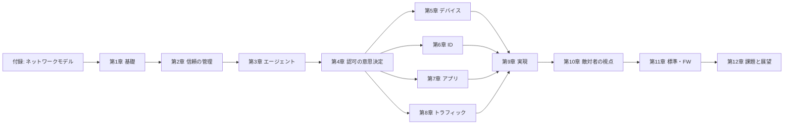

---

## 3. 先に押さえる前提知識

次の表のうち「△」「×」がある項目は、先に調べておくと本編が格段に読みやすくなります。

| 分野 | 用語 | 一言説明 | 主に出る章 |
|---|---|---|---|
| ネットワーク | OSI 参照モデル／TCP/IP | 通信を層に分けて考える枠組み | 付録・第8章 |
| ネットワーク | プライベート IP／NAT | 社内専用アドレスと、外部と通信する際の変換 | 第1章 |
| ネットワーク | ファイアウォール／VPN | 境界で通信を制限／社外から社内へ入る暗号トンネル | 第1章・第8章 |
| 暗号 | 対称鍵／公開鍵暗号 | 同じ鍵で暗号化／鍵ペアで暗号化・署名 | 第2章・第8章 |
| 暗号 | デジタル署名・ハッシュ・HMAC | 改ざん検知と作成者確認 | 第7章・第8章 |
| 暗号 | X.509 証明書・CA・PKI | 「この公開鍵は誰のものか」を保証する仕組み | 第2章・第5章 |
| 暗号 | TLS／mTLS | 通信の暗号化と、必要に応じ双方向の証明書認証 | 第8章 |
| 認証・認可 | 認証（Authentication）／認可（Authorization） | 「誰か」を確かめる／「何をしてよいか」を決める | 第4章・第6章 |
| 認証・認可 | MFA／SSO／TOTP | 多要素認証／一度のログインで複数サービス／ワンタイムコード | 第6章 |
| 運用 | 構成管理（Ansible・Puppet・Chef など） | サーバ設定をコードで管理 | 第5章・第9章 |
| 開発 | CI/CD・SBOM | ビルド／配信の自動化、部品表 | 第7章 |

> **ポイント**: 認証は「あなたは誰か」、認可は「あなたはこれをしてよいか」です。ゼロトラストは **リクエストのたびに認可を判断する** ことが中心なので、この区別は最初に身につけてください。

---

## 4. ゼロトラストを3分で理解する

### 4.1 ひとことで言うと

> **「ネットワークの内側にいるから信頼する」をやめて、「そのリクエストを出した主体（ユーザー・デバイス・アプリ）が、いま、そのリソースにアクセスしてよいか」を毎回検証する考え方。**

NIST SP 800-207 は、ゼロトラストを「防御の対象を広いネットワーク境界から、個別またはごく小さなリソース群に絞り込む、進化中のセキュリティ・パラダイム群」として説明しています。背景には、リモート利用者やネットワーク境界の外にあるクラウド資産の増加があります（[S3]）。

### 4.2 なぜ必要になったか（STEP で理解する）

**STEP 1: 昔の守り方**
社内ネットワークを城壁（ファイアウォール）で囲み、「中は安全、外は危険」とする。

**STEP 2: 前提が崩れた**
クラウド、テレワーク、モバイル端末、SaaS により、守るべき資産が城壁の外にも出た（[S3]）。

**STEP 3: 内側に入られると弱い**
一度内側に侵入されると、攻撃者は「信頼された内部通信」を利用して横移動（lateral movement）できる。Forrester の John Kindervag は 2010年のレポート "No More Chewy Centers" で、この「外は硬く中は柔らかい」構造を批判し、ゼロトラストモデルを提唱した（[S9]）。

**STEP 4: 発想の転換**
信頼を「場所」ではなく「検証結果」に置き換える。これがゼロトラスト。

### 4.3 境界型 vs ゼロトラスト

| 比較軸 | 境界型（Perimeter） | ゼロトラスト |
|---|---|---|
| 信頼の根拠 | ネットワーク上の位置（内側か外側か） | ID・デバイス状態・コンテキスト・ポリシー |
| 内部通信 | 原則として信頼 | 内部も敵対的と仮定し、都度認可 |
| 認証のタイミング | 入口で1回（VPN ログインなど） | リクエストごと／継続的 |
| 権限 | 広め（ネットワークに入れれば多くに届く） | 最小権限（必要な宛先だけ） |
| 侵害時の被害範囲 | 広がりやすい | 小さく閉じ込めやすい |
| 可視性 | 境界を通る通信が中心 | 全アクセスの判断ログが取れる |
| 運用 | 静的ルール中心 | 動的ポリシー・自動化が前提 |

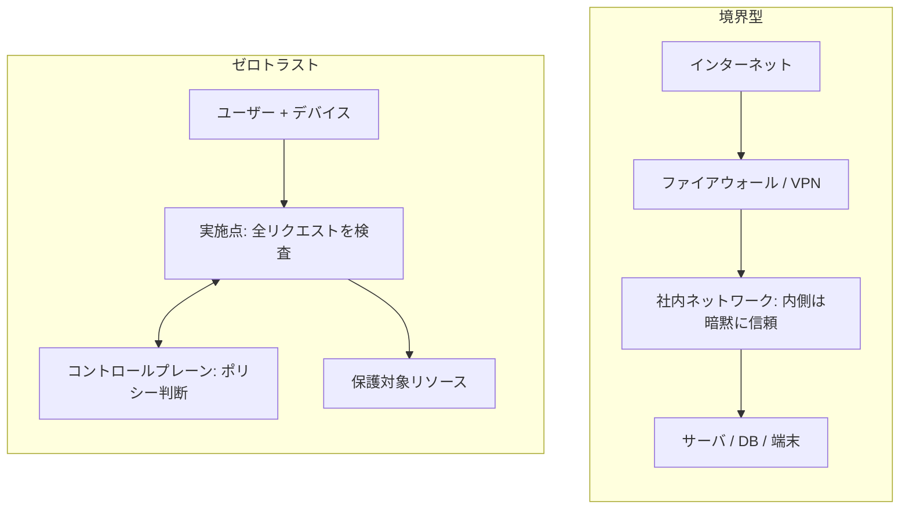

### 4.4 3つの合言葉（Microsoft の整理）

Microsoft はゼロトラストを次の3原則で整理しています（[S11]）。

| 原則 | 意味 | 具体例 |
|---|---|---|
| Verify explicitly（明示的に検証する） | ネットワーク位置のような弱い根拠ではなく、利用可能なすべてのシグナルで検証する | ID・端末状態・場所・リスクを総合して判断 |
| Use least privileged access（最小権限） | 目的に必要な権限だけを、必要な環境・端末から与える | 閲覧のみ、期限付き、特定アプリのみ |
| Assume breach（侵害を前提にする） | 侵害はすでに起きた、または起きると仮定して設計する | 通信の暗号化、セグメント分割、ログ・検知 |

### 4.5 よくある誤解

| 誤解 | 実際 |
|---|---|
| ゼロトラストは製品を買えば実現する | **戦略・アーキテクチャ**であり、単一製品ではない。Microsoft も「製品やツールではなく戦略」と明記（[S11]）。Kindervag も製品ではなく目的（ミッション）が中心だと述べている（[S9]） |
| VPN をやめることがゼロトラスト | VPN の有無ではなく、**暗黙の信頼を排除できているか**が本質。 |
| MFA を入れれば完了 | MFA は ID の一部。デバイス・アプリ・通信・ポリシーも必要。 |
| 一度導入すれば終わり | 継続的な取り組み。Kindervag のレポートにも「一回限りのプロジェクトではない」という趣旨の主張がある（[S9]） |

---

## 第1章 Zero Trust Fundamentals（ゼロトラストの基礎）

### この章のゴール

- 境界型モデルがどのように生まれ、なぜ限界を迎えたかを説明できる
- ゼロトラストネットワークの定義と、**コントロールプレーン**の役割を説明できる
- 自動化とクラウドがゼロトラストにどう関わるかを理解する

> 書籍の章内トピック（目次より）: ゼロトラストネットワークとは／コントロールプレーン紹介／境界モデルの進化（グローバル IP 空間、プライベート IP、NAT、現代の境界）／脅威の進化／境界の欠点／信頼の所在／自動化／境界 vs ゼロトラストのクラウド適用／国家サイバーセキュリティにおけるゼロトラスト（[S1]）

### STEP 解説

**STEP 1: 境界型モデルとは**
企業の LAN を「内側」、インターネットを「外側」と分け、境界にファイアウォールを置く構成です。内側の端末同士は、互いに（ほぼ）自由に通信できるのが一般的でした。

**STEP 2: なぜ「内側＝信頼」になったのか（歴史）**
1. インターネットの IP アドレスは世界で一意に管理される必要がある（グローバル IP 空間の管理）。
2. 組織内だけで使える**プライベート IP アドレス**が定義され、内部ネットワークを独立して設計できるようになった。
3. 内部から外部へ出るために **NAT** が使われ、内側のアドレスは外から直接見えなくなった。
4. 結果として「外から内側へは簡単に届かない＝内側は安全」という感覚が定着した。

> ただし **NAT は本来セキュリティ機能ではなく、アドレス節約の仕組み** です。「見えにくい」ことと「信頼できる」ことは別物です。

**STEP 3: 現代の境界モデル**
ファイアウォール、DMZ、VPN、プロキシ、IDS／IPS などを組み合わせ、境界に防御を集中させます。リモートワーカーは VPN で「内側に入る」ことで社内資源を使います。

**STEP 4: 脅威の進化と境界の欠点**
- フィッシング、マルウェア、盗まれた認証情報により、攻撃者は**正規の経路で内側に入る**ことがある。
- 一度内側に入れば、信頼された内部ネットワークで**横移動**できる。
- 内部不正（悪意ある従業員）は境界では防げない。
- 「信頼の所在」が **IP アドレス（場所）** に置かれているため、場所を偽装・獲得されると崩れる。

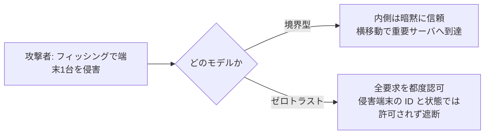

**STEP 5: ゼロトラストネットワークの定義**
本書の立場は、**ネットワークを常に敵対的と見なし、すべてのリクエストを認証・認可してから許可する** というものです（[S1][S20]）。NIST SP 800-207 も、ゼロトラストの中心を「資産やユーザーアカウントに、ネットワーク位置や所有権だけを根拠とした暗黙の信頼を与えない」ことに置いています（[S3]）。

**STEP 6: コントロールプレーンの導入**
ゼロトラストは次の2つに役割を分けて考えます。

| プレーン | 役割 | 例 |
|---|---|---|
| コントロールプレーン | 誰に何を許可するかを**判断**し、設定を配る | ポリシーエンジン、信頼エンジン、デバイス／ID の管理 |
| データプレーン | 実際の通信を**転送・実施**する | アプリ間通信、プロキシ、ファイアウォール |

**STEP 7: 自動化はなぜ必須か**
デバイス・ユーザー・アプリごとに動的に判断するには、人手の設定変更では追いつきません。構成管理・証明書発行・ポリシー配布の**自動化がゼロトラストの前提条件**です（書籍の「Automation as an Enabler」の趣旨）。

**STEP 8: クラウドへの適用**
クラウドでは「内側」の境界が曖昧で、IP アドレスも動的に変わります。だからこそ、**ID と属性ベースで通信を制御する**ゼロトラストと相性が良いのです。

**STEP 9: 国家のサイバーセキュリティにおける役割**
米国では大統領令 EO 14028 が連邦政府にゼロトラスト移行計画の策定を求め、CISA の Zero Trust Maturity Model（ZTMM）2.0 がその一つの道筋として2023年4月に公表されました（[S5][S19]）。英国 NCSC、日本のデジタル庁も指針を公表しています（[S12][S18]）。詳細は第11章で扱います。

### 重要用語

| 用語 | 説明 |
|---|---|
| 境界型セキュリティ | ネットワーク境界の防御を中心にする従来モデル |
| 横移動（Lateral Movement） | 侵入後に別のホストへ移動して被害を広げる行為 |
| コントロールプレーン | 判断・制御を担う部分 |
| データプレーン | 実際にデータを運ぶ部分 |
| NAT | プライベートアドレスと外部アドレスの変換 |

### よくある誤解

- 「ゼロトラスト＝誰も信用しない（人を疑う）」ではなく、**「検証なしに信頼しない（仕組みで確かめる）」** という意味です。
- 「境界防御は不要になる」のではなく、**境界は多層防御の1要素に格下げ**されます。

### 確認問題

<details>
<summary>Q1. 境界型モデルの最大の弱点を、「信頼の所在」という言葉を使って説明してください。</summary>

**解答例**: 信頼がネットワーク上の位置（IPアドレス＝内側かどうか）に置かれているため、攻撃者が一度でも内側に入る（または内側の端末を乗っ取る）と、内部の資産へ横移動して被害を広げられる点。
</details>

<details>
<summary>Q2. コントロールプレーンとデータプレーンの違いを1行で述べてください。</summary>

**解答例**: コントロールプレーンは「許可するかどうかを判断・設定する部分」、データプレーンは「実際の通信を転送・実施する部分」。
</details>

### 参考出典
[S1] [S3] [S5] [S9] [S12] [S18] [S19] [S20]

---

## 第2章 Managing Trust（信頼の管理）

### この章のゴール

- 脅威モデルとは何か、ゼロトラストの脅威モデルが何を前提にするかを説明できる
- **強い認証**、**PKI**、**最小権限**、**動的な信頼（信頼スコア）** の関係を理解する

> 書籍の章内トピック（目次より）: 脅威モデル（一般的なモデル／ゼロトラストの脅威モデル）／強い認証（信頼の認証、認証局とは、ゼロトラストにおける PKI の重要性、プライベート PKI と公開 PKI、公開 PKI でもないよりまし）／最小権限／動的な信頼（信頼スコアとその課題）／コントロールプレーンとデータプレーン（[S1]）

### STEP 解説

**STEP 1: 脅威モデルとは**
「誰が」「何を狙い」「どんな能力を持つか」を先に定義し、それに対抗する設計を行う考え方です。例えば STRIDE（なりすまし・改ざん・否認・情報漏えい・サービス拒否・権限昇格）は代表的な分類です（一般知識）。

**STEP 2: ゼロトラストの脅威モデル（核心）**
ゼロトラストは次の前提で設計します。

1. ネットワークは**すでに侵害されている／盗聴・改ざんされうる**
2. ネットワーク上のどのホストも**インターネット上のホストと同等に扱う**
3. したがって、**各通信ごとに「相手の身元」と「通信の完全性」を確認**する

> 出版社系の書誌紹介でも、本書は「すべてのホストをインターネットに面しているものとして扱い、ネットワーク全体を侵害済み・敵対的と見なす」方式として紹介されています（[S20]）。

**STEP 3: 強い認証と PKI**
ネットワークの位置を信用しない以上、**暗号学的に相手を証明する手段**が必要です。その中心が **X.509 証明書と PKI** です。

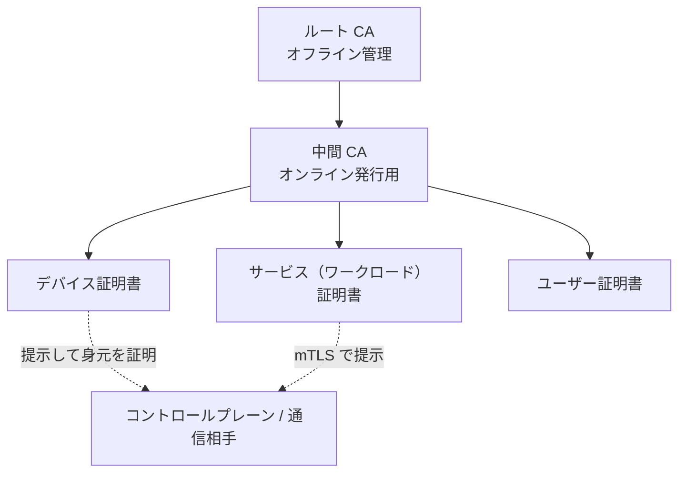

| 項目 | プライベート PKI | 公開 PKI |
|---|---|---|
| 運営者 | 自組織（社内 CA） | 公的な認証局（ブラウザが信頼） |
| 発行対象 | デバイス・社内サービス・ワークロード | 主にインターネット公開サイト |
| 長所 | 有効期限・属性・失効を自由に設計できる／大量発行しやすい | 運用負荷が低い／すぐ使える |
| 短所 | CA の運用・鍵管理が重い | 発行対象・属性の自由度が低い |
| 書籍の立場 | ゼロトラストでは重要（社内の身元保証） | 「ないよりはまし」という現実的位置づけ |

**STEP 4: 最小権限（Least Privilege）**
「必要なものだけ・必要な間だけ」を与える原則です。ゼロトラストでは、**宛先（どのサービスか）・操作（読み取りか削除か）・時間・端末状態**まで粒度を細かくします（Microsoft の3原則の2番目と同じ考え方：[S11]）。

**STEP 5: 動的な信頼と信頼スコア**
信頼は「付与したら終わり」ではなく**状況で変化**します。例えば端末のパッチが古くなった、普段と違う国からアクセスされた、といった変化を反映し、**信頼スコア**として数値化して判断に使う方式があります。

| 信頼スコアの利点 | 信頼スコアの課題（書籍の章題が示す論点） |
|---|---|
| 状況に応じた柔軟な判断ができる | スコアの根拠が不透明だと説明できない（なぜ拒否されたか） |
| 段階的な対応ができる（追加認証など） | 誤検知で業務が止まる／回避を狙われる |
| 多様なシグナルを統合できる | 重み付けの設計・運用が難しい |

**STEP 6: コントロールプレーンとデータプレーン（再整理）**
信頼の「判断」はコントロールプレーンに集約し、データプレーンはその決定を**実施**します。ここを分けることで、判断ロジックを更新しても通信経路を作り替えなくて済みます。

### 重要用語

| 用語 | 説明 |
|---|---|
| 脅威モデル | 攻撃者と攻撃経路を定義し、対策を設計する枠組み |
| PKI | 公開鍵基盤。証明書の発行・検証・失効を行う仕組み |
| CA（認証局） | 証明書に署名して身元を保証する主体 |
| 最小権限 | 必要最小限の権限だけ付与する原則 |
| 信頼スコア | 複数シグナルから算出する「信頼度」の数値 |

### よくある誤解

- 「公開 PKI は社内用途に使えない」のではなく、**目的により使い分ける**ものです。ただし、ゼロトラストで必要な大量・短寿命・属性付きの証明書発行には、プライベート PKI の方が柔軟です。
- 「スコアが高ければ何でも許可」ではありません。**リソースの重要度ごとに必要スコアを変える**のが原則です（第4章）。

### 確認問題

<details>
<summary>Q1. ゼロトラストの脅威モデルが「ネットワークは敵対的」と仮定すると、通信にどんな要件が生じますか。</summary>

**解答例**: 通信相手の身元を暗号学的に確認する（認証）、通信内容の盗聴・改ざんを防ぐ（暗号化・完全性）、各リクエストごとに認可を行う。
</details>

<details>
<summary>Q2. 信頼スコアを導入する際の課題を2つ挙げてください。</summary>

**解答例**: 根拠の説明可能性（なぜ拒否されたか）、誤検知による業務停止、重み付け設計の難しさ、スコアを知った攻撃者による回避、など。
</details>

### 参考出典
[S1] [S11] [S20]

---

## 第3章 Context-Aware Agents（コンテキスト認識エージェント）

### この章のゴール

- **エージェント**が何を集め、何のために使われるかを説明できる
- **「エージェントは認証のためのものではない」** という重要な注意点を理解する

> 書籍の章内トピック（目次より）: エージェントとは／エージェントの揮発性／エージェントの中身／使われ方／エージェントは認証用ではない／エージェントの公開方法／硬直性と流動性の両立／標準化が望ましい／当面は（[S1]）

### STEP 解説

**STEP 1: エージェントとは**
端末（またはサーバ）上で動き、その**状態（コンテキスト）を収集してコントロールプレーンへ伝える**ソフトウェアです。

| 収集する情報の例 | 使い道 |
|---|---|
| OS／パッチの状態 | 古い端末のアクセス制限 |
| ディスク暗号化・画面ロック設定 | 端末の基本衛生の確認 |
| 稼働中のプロセス／構成 | 不審なソフトウェアの検知 |
| 位置・ネットワーク情報 | 普段と違うアクセスの判断 |
| 最後のイメージ適用日時 | 端末の鮮度の判断（第5章） |

**STEP 2: エージェントの「揮発性」**
端末状態は**刻々と変わります**（パッチ適用、アプリ起動、ネットワーク切替）。そのため、判断に使う情報は**鮮度**が重要で、古いデータを信じ続けるのは危険です。

**STEP 3: エージェントの中身と使われ方**
- **データ収集**（ローカル計測）
- **報告**（コントロールプレーンへの送信）
- **実施の補助**（ポリシーに従ったローカル制御）

**STEP 4: 重要 — エージェントは認証のためのものではない**
エージェントが「この端末は安全です」と報告しても、**その報告自体が偽装される可能性**があります。端末が侵害されていれば、エージェントも嘘をつけるからです。したがって次のように役割を分けます。

| 役割 | 担当 |
|---|---|
| 「あなたは誰か」を証明する（認証） | 証明書・TPM など、暗号学的な根拠（第5章） |
| 「いまの状態はどうか」を伝える（コンテキスト） | エージェント（補助的なシグナル） |
| 最終判断 | コントロールプレーン（複数のシグナルを統合） |

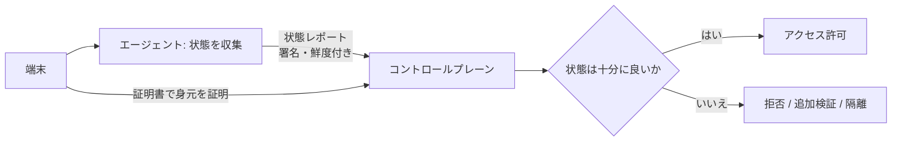

**STEP 5: エージェントの公開方法**
エージェントが集めた情報を、誰がどう参照できるようにするかには設計上の選択肢があります（一般的な整理）。

| 方式 | 概要 | 注意点 |
|---|---|---|
| プッシュ型 | エージェントが定期的に報告 | 報告間隔が長いと古い情報で判断してしまう |
| プル型 | コントロールプレーンが問い合わせ | 到達性・負荷の設計が必要 |
| 第三者検証型 | 外部（ハードウェア等）の証明で裏付け | 導入コストが高い（リモート計測、第5章） |

**STEP 6: 硬直性と流動性、標準化**
- エージェントの**仕様は固定的（硬直）**であるほうが実装・監査しやすい一方、**収集する項目は流動的**（脅威や環境に応じて変わる）。
- 標準化が望ましいものの、書籍が示す通り**現状は十分に標準化されていない**ため、当面は各組織・製品で工夫が必要、というのが論点です。

### 重要用語

| 用語 | 説明 |
|---|---|
| エージェント | 端末状態を収集・報告するソフトウェア |
| コンテキスト | アクセス判断に使う周辺情報（状態・場所・時刻など） |
| 揮発性 | 状態が短時間で変化する性質 |
| リモート計測 | 外部から端末状態を検証する仕組み |

### よくある誤解

- 「エージェントを入れれば認証が済む」 → **不可**。認証には暗号学的な証明が必要。
- 「エージェントの情報は常に正しい」 → **侵害された端末は嘘の報告をしうる**。

### 確認問題

<details>
<summary>Q1. なぜエージェントは認証手段として使ってはいけないのですか。</summary>

**解答例**: 端末が侵害されると、エージェントの報告自体を攻撃者が偽装できるため。認証は証明書・ハードウェア由来の鍵など暗号学的根拠で行い、エージェントは補助的なコンテキスト提供に留める。
</details>

<details>
<summary>Q2. エージェント情報の「鮮度」が重要な理由を述べてください。</summary>

**解答例**: 端末状態は頻繁に変わるため、古い情報で判断すると、すでにパッチが外れた／マルウェアに感染した端末を信頼し続けてしまうから。
</details>

### 参考出典
[S1]

---

## 第4章 Making Authorization Decisions（認可の意思決定）

### この章のゴール

- 認可アーキテクチャの登場人物（**実施点・ポリシーエンジン・ポリシー保管・信頼エンジン・データストア**）の役割を説明できる
- 「良いポリシー」の条件と、誰がポリシーを定義・レビューするかを理解する
- 信頼スコアを**外部に公開すると危険**な理由を説明できる

> 書籍の章内トピック（目次より）: 認可アーキテクチャ（実施、ポリシーエンジン、ポリシー保管）／良いポリシーとは／誰がポリシーを定義するか／ポリシーレビュー／信頼エンジン（スコア対象のエンティティ、スコア公開のリスク、データストア）／シナリオ（[S1]）

### STEP 解説

**STEP 1: 全体像をつかむ**
ゼロトラストの「頭脳」にあたる部分です。クライアントからのアクセス要求に対し、次の流れで許可・拒否を決めます。

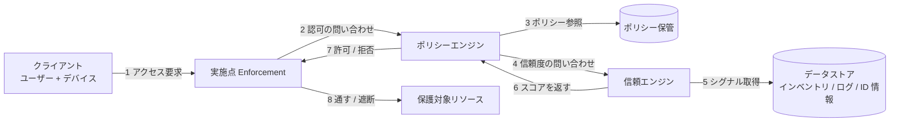

**STEP 2: NIST の用語との対応**
NIST SP 800-207 は同様の論理コンポーネントを定義しています（[S3]）。呼び方は違っても役割は同じです。

| 本書の呼び方 | NIST SP 800-207 の呼び方 | 役割 |
|---|---|---|
| 実施（Enforcement） | PEP（Policy Enforcement Point） | リソースの手前で通信を通す／遮断する |
| ポリシーエンジン | PE（Policy Engine）＋PA（Policy Administrator） | 判断を下し、実施点へ指示する |
| 信頼エンジン | 信頼度・リスクの評価（PE が参照する入力） | 主体の信頼度を算出する |
| データストア | CDM・ID 管理・ログ・脅威情報などのデータソース | 判断材料の供給元 |

**STEP 3: 実施（Enforcement）**
実施点は「門番」です。**判断はしない**で、ポリシーエンジンの結論に従います。配置は、リソースの直前（ホスト上、プロキシ、ゲートウェイ）など複数あり、第8章で詳しく扱います。

**STEP 4: ポリシーエンジンとポリシー保管**
- ポリシーエンジン: 要求（誰が・どの端末で・何に・何をしたい）と、ポリシー、信頼スコアを突き合わせて結論を出す。
- ポリシー保管: ポリシーを**バージョン管理して安全に保存**する場所。コードと同じく変更履歴・レビューが必要。

**STEP 5: 良いポリシーとは**

| 条件 | 説明 | 悪い例 |
|---|---|---|
| デフォルト拒否 | 明示的に許可されたものだけ通す | 「例外以外すべて許可」 |
| 最小権限 | 宛先・操作・時間を絞る | 部署全員に全サーバ許可 |
| 人間が読める | 意図が読み取れ、レビューできる | 何百行もの暗号的ルール |
| 関係性ベース | 「サービスAはサービスBを呼べる」のように関係で表す | IP アドレス直書き |
| テスト可能 | 変更前に影響を確認できる | 本番で試すしかない |
| 監査可能 | 判断理由がログに残る | 拒否理由が不明 |

**STEP 6: 誰がポリシーを定義し、レビューするか**
- 定義: リソースの**オーナー（業務側）**と**セキュリティ部門**の協業が基本。セキュリティだけが決めると業務実態とずれる。
- レビュー: **定期的な棚卸し**（使われていない許可の削除）と、**変更時のレビュー**（2人承認など）を仕組み化する。

**STEP 7: 信頼エンジン**
複数のシグナルから**エンティティごとの信頼度**を算出します。

| スコア対象 | 例 | 主なシグナル |
|---|---|---|
| ユーザー | 従業員 A | 認証強度、普段の行動、役割 |
| デバイス | 端末 X | パッチ状況、構成、イメージの鮮度 |
| アプリケーション／ワークロード | サービス B | ビルドの出自、バージョン、実行環境 |
| ネットワーク／場所 | 接続元 | 国、回線種別、匿名化の有無 |

**STEP 8: スコアを公開するのはなぜ危険か**
書籍の章題にも「スコア公開は危険とみなされる」という論点があります。理由は次のとおりです（一般的な整理）。

1. 攻撃者がスコアを**観測して、閾値ぎりぎりまで最適化**できる。
2. どのシグナルが効くかを**逆算**され、偽装されやすくなる。
3. スコアが外部に出ると、**別システムが無条件に信頼**してしまう依存が生まれる。

対策は、拒否理由を詳細に返さず（利用者向けには「追加の確認が必要」程度）、**詳細は内部ログに限定**することです。

**STEP 9: データストア**
信頼エンジンの材料となる情報源です。**インベントリ（資産台帳）**、**ID ディレクトリ**、**ログ**、**脅威情報**などで、第5章・第6章で詳しく扱います。ここが汚染されると判断全体が崩れるため、**データストア自体の保護も重要**です。

### 学習用の最小コード例（概念理解用）

実運用向けではなく、**「ポリシー × 信頼スコアで判断する」** 構造を理解するための例です。

```python
from dataclasses import dataclass

@dataclass
class Request:
    user_groups: set
    mfa_passed: bool
    device_compliant: bool
    device_age_days: int      # 最後のイメージ適用からの日数
    resource: str
    action: str

# リソースと操作ごとに、必要なグループと最低スコアを定義
POLICY = {
    ("finance-report", "read"): {"groups": {"finance"}, "min_score": 70},
    ("email", "delete"):        {"groups": {"employee"}, "min_score": 50},
}

def trust_score(req: Request) -> int:
    score = 0
    score += 40 if req.mfa_passed else 0
    score += 30 if req.device_compliant else 0
    score += 30 if req.device_age_days <= 30 else 0
    return score

def decide(req: Request):
    rule = POLICY.get((req.resource, req.action))
    if rule is None:
        return "deny", "no matching policy (default deny)"
    if not (req.user_groups & rule["groups"]):
        return "deny", "not in allowed group"
    score = trust_score(req)
    if score < rule["min_score"]:
        return "deny", "additional verification required"   # 詳細スコアは返さない
    return "allow", f"score={score}"                        # 内部ログ用

print(decide(Request({"finance"}, True, True, 10, "finance-report", "read")))
```

ポイントは3つです。**(1) 一致するポリシーがなければ拒否（デフォルト拒否）**、**(2) 重要なリソースほど高い閾値**、**(3) 利用者への返答に詳細スコアを含めない**。

### 本ガイドによるシナリオ例

「経理担当の Bob が、自宅から機密性の高い財務レポートを閲覧する」場合の判断を段階で表します（書籍のシナリオそのものではなく、理解のための例です）。

| 段階 | 判断 | 結果 |
|---|---|---|
| 1 | 要求に一致するポリシーがあるか | あり（finance-report / read） |
| 2 | Bob は finance グループか | はい |
| 3 | MFA は成功しているか | はい |
| 4 | 端末は管理下で、最近イメージが更新されているか | はい |
| 5 | 信頼スコアは閾値以上か | 閾値以上 → **許可** |

### 重要用語

| 用語 | 説明 |
|---|---|
| 実施点（PEP） | 通信を通す／遮断する門番 |
| ポリシーエンジン | 要求・ポリシー・スコアから結論を出す部分 |
| 信頼エンジン | エンティティの信頼度を算出する部分 |
| デフォルト拒否 | 許可がなければ拒否する設計原則 |
| ポリシーレビュー | ポリシーの定期的な棚卸しと変更審査 |

### よくある誤解

- 「ポリシーは一度作れば終わり」 → **棚卸しと更新が必須**。使われない許可は攻撃面になる。
- 「スコアは見せたほうが親切」 → **攻撃者にも親切になってしまう**ため、詳細は公開しない。

### 確認問題

<details>
<summary>Q1. 実施点とポリシーエンジンを分ける利点は何ですか。</summary>

**解答例**: 判断ロジックを一箇所に集約できるため、ポリシー更新が全実施点に一貫して反映され、実施点は軽量・単純に保てる。判断の監査もしやすい。
</details>

<details>
<summary>Q2. 信頼スコアを利用者に詳細に返すと、どんな危険がありますか。</summary>

**解答例**: 攻撃者が閾値を探り、スコアを上げる行動を最適化したり、どのシグナルが効くかを逆算して偽装したりできる。
</details>

### 参考出典
[S1] [S3]

---

## 第5章 Trusting Devices（デバイスを信頼する）

### この章のゴール

- デバイスが**最初の信頼をどう獲得するか（ブートストラップ）**を説明できる
- **X.509 証明書・TPM・インベントリ・計測**の役割を整理できる
- 判断に使う**信頼シグナル**を挙げられる

> 書籍の章内トピック（目次より）: 信頼のブートストラップ／ID の生成と保護（静的・動的システム）／コントロールプレーンへのデバイス認証（X.509、TPM、HSM・TPM への攻撃経路）／インベントリ管理（何を期待するか、セキュアイントロダクション）／デバイス信頼の更新と計測（ローカル計測、リモート計測、UEM、構成管理、検索可能なインベントリ、信頼できる情報源）／ユーザー認可へのデバイスデータ活用（時間経過、過去のアクセス、場所、通信パターン、機械学習）／シナリオ（印刷、メール削除）（[S1]）

### STEP 解説

**STEP 1: なぜデバイスの信頼が先か**
ユーザー認証が完璧でも、**乗っ取られた端末**からの操作は危険です。ゼロトラストでは「どの人か」と同じくらい「どの端末か・その端末は健全か」を重視します。BeyondCorp も、ユーザーとデバイスの両方に基づく認証・認可を中核に据えています（[S10]）。

**STEP 2: ブートストラップ問題**
「最初の信頼」はどこから来るのか。デバイスが自分の ID（鍵・証明書）を**安全に生成し、安全に登録し、コントロールプレーンに初めて認識してもらう**必要があります。これを **セキュアイントロダクション**と呼びます。

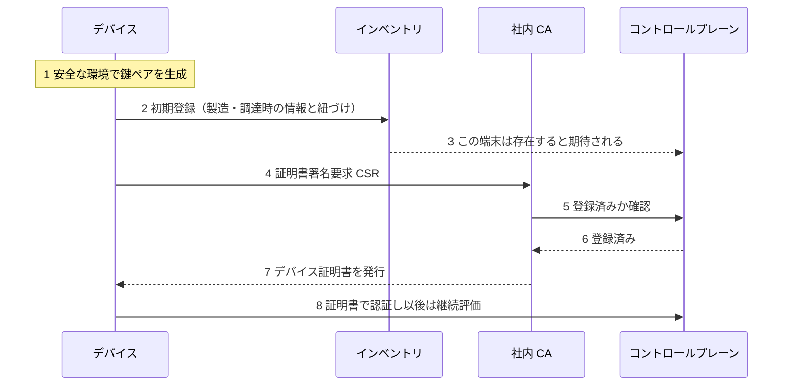

**STEP 3: デバイス ID の生成と保護**

| システムの種類 | ID の扱い | 注意点 |
|---|---|---|
| 静的（固定的なサーバ、長期稼働） | 長寿命の証明書・鍵 | 鍵の漏えい時の影響が大きい。ローテーション計画が必要 |
| 動的（コンテナ、VM、短命インスタンス） | 起動ごとに発行する短寿命の ID | 発行の自動化と、起動時の身元確認が鍵 |

**STEP 4: コントロールプレーンへの認証手段**

| 手段 | 概要 | 強み | 弱み・注意 |
|---|---|---|---|
| X.509 証明書 | 秘密鍵を持つことで身元を証明 | 標準的で広く対応 | 秘密鍵がコピーされると成りすまされる |
| TPM | 端末に搭載された耐タンパチップに鍵を封じる | 鍵が端末から取り出しにくい | 搭載の有無・世代差・運用の複雑さ |
| HSM | 専用の鍵保管装置 | 高い保護水準 | コストと可用性設計 |

**TPM／HSM への攻撃経路**として、書籍は注意を促しています。一般に、**物理アクセス**、**サイドチャネル**、**ファームウェア脆弱性**、**使用権限の悪用（鍵そのものは盗めなくても署名を“使わせる”）** が論点になります。結論は、**「鍵を封じた」だけで安心せず、端末の健全性の計測と組み合わせる**ことです。

**STEP 5: インベントリ管理 — 「何があるはずか」を知る**
知らない端末は信頼できません。インベントリは、**期待される端末の一覧**です。

| 項目 | 内容 |
|---|---|
| 何を期待するか | 端末の種類・所有者・用途・期待される構成 |
| セキュアイントロダクション | 新規端末を、信頼できる経路で台帳と結びつける |
| 検索可能なインベントリ | 「このパッチが未適用の端末は？」と即座に聞ける |
| 信頼できる情報源（Source of Truth） | 台帳が改ざんされない・一元化されている |
| 構成管理ベースの台帳 | Ansible／Puppet 等の管理情報から自動的に台帳を作る |

**STEP 6: デバイス信頼の更新と計測**

| 方式 | 概要 | 長所 | 短所 |
|---|---|---|---|
| ローカル計測 | 端末内で状態を計測して報告 | 詳細な情報を取れる | 侵害されると偽装される（第3章） |
| リモート計測 | 外部（コントロールプレーン／ハードウェア）が検証 | 偽装しにくい | 仕組みが複雑・対応機器が必要 |
| UEM（統合エンドポイント管理） | 端末の構成・配布・更新を一元管理 | 運用を一括化できる | 製品依存、管理対象外の端末が残る |

**STEP 7: 信頼シグナルの例**

| シグナル | 例 | 判断の意味 |
|---|---|---|
| イメージ適用からの経過時間 | 長期間更新なし | パッチ未適用のリスクが高い |
| 過去のアクセス履歴 | 初めて触れるリソース | 通常と異なる行動 |
| 場所 | 普段と異なる国・回線 | リスク上昇（ただし偽装されうる） |
| ネットワーク通信パターン | 突然の大量通信 | 不審な挙動 |
| 機械学習による異常検知 | 学習済みの通常行動からの逸脱 | 補助的に利用（説明可能性に注意） |

### 本ガイドによるシナリオ例（書籍のシナリオ題材より）

書籍には「Bob が文書を印刷に送る」「Bob がメールを削除する」というシナリオがあります（[S1]）。以下は、**理解のための本ガイドの解釈例**です。

| シナリオ | 重要度 | 判断のポイント |
|---|---|---|
| 文書を印刷に送る | 比較的低〜中（文書の機密度次第） | 端末が登録済みか、プリンタが正当なサービスか、文書の機密区分 |
| メールを削除する | 中（不可逆な操作） | 破壊的操作のため、端末の鮮度・MFA の強さを要求 |

同じ Bob でも、**操作の重要度が上がるほど要求する信頼度を上げる**のがゼロトラストの典型です。

### 重要用語

| 用語 | 説明 |
|---|---|
| セキュアイントロダクション | 新規デバイスを安全に台帳・コントロールプレーンへ結びつける手続き |
| TPM | 端末内の耐タンパ性のあるセキュリティチップ |
| HSM | 専用の鍵保管・暗号処理装置 |
| UEM | 統合エンドポイント管理 |
| リモート計測 | 外部からデバイスの状態を検証する方式 |
| Source of Truth | 唯一の信頼できる情報源 |

### よくある誤解

- 「証明書を入れれば端末は信頼できる」 → 証明書は**身元**であって**健全性**ではない。**状態の継続的な計測**が必要。
- 「TPM があれば安全」 → 鍵は守れても、**端末上で動く悪意あるコードが鍵を“使う”**ことは防げない場合がある。

### 確認問題

<details>
<summary>Q1. セキュアイントロダクションとは何ですか。なぜ必要ですか。</summary>

**解答例**: 新しいデバイスを、改ざんされにくい経路で台帳・コントロールプレーンに結びつけ、初めて信頼を与える手続き。最初の信頼が偽装されると、その後の全判断が崩れるため。
</details>

<details>
<summary>Q2. ローカル計測とリモート計測の違いを述べてください。</summary>

**解答例**: ローカル計測は端末自身が状態を測って報告するため詳細だが偽装されうる。リモート計測は外部が検証するため偽装しにくいが、仕組みが複雑で対応機器が必要。
</details>

### 参考出典
[S1] [S10]

---

## 第6章 Trusting Identities（ID を信頼する）

### この章のゴール

- 「ID の権威」「ID の保管」「いつ・どう認証するか」を整理できる
- 認証方式（知識・所持・生体・行動）の特徴と弱点を比較できる
- **ワークロード ID**（SPIFFE）と**グループ認証**（Shamir 秘密分散）の考え方を理解する

> 書籍の章内トピック（目次より）: ID 権威（私設システムでの ID ブートストラップ、公的身分証、対面確認の重要性）／ID の保管（ユーザーディレクトリ、ディレクトリ保守）／いつ認証するか（信頼を認証の駆動力に、複数チャネル、ID・信頼のキャッシュ）／どう認証するか（パスワード、TOTP、証明書、セキュリティトークン、生体、行動パターン、帯域外認証、SSO、ワークロード ID、ローカル認証へ）／グループの認証・認可（Shamir の秘密分散、Red October、See Something Say Something）／信頼シグナル／シナリオ（[S1]）

### STEP 解説

**STEP 1: ID の権威（Identity Authority）**
「この人は本当に Alice か」を最終的に保証する根拠が **ID 権威**です。企業では、**入社時の対面確認や公的身分証の確認**が出発点になります。どんなに高度な暗号でも、**最初に誰を Alice と登録するか**が誤っていれば全体が崩れます。書籍が「対面（meatspace）に勝るものはない」と強調する趣旨はここにあります。

**STEP 2: ID の保管 — ユーザーディレクトリ**
ユーザー情報・グループ・属性を保管する場所です。

| 論点 | 内容 |
|---|---|
| 一元化 | 退職・異動の反映漏れを防ぐ |
| ディレクトリ保守 | 休眠アカウントの棚卸し、権限の定期レビュー |
| ディレクトリ自体の保護 | 侵害されると全 ID の信頼が崩れる（第10章） |

**STEP 3: いつ認証するか — 信頼が認証を駆動する**
従来は「ログイン時に1回」でしたが、ゼロトラストでは**信頼の変化に応じて認証を求めます**。

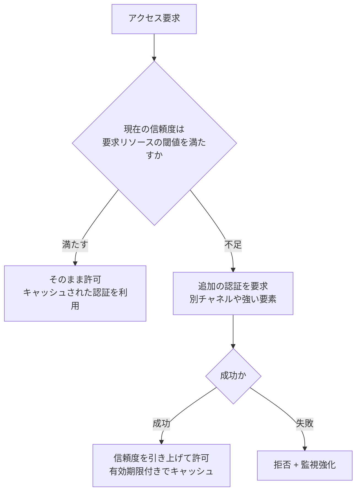

- **複数チャネル**: パスワードだけでなく、別経路（スマホ通知など）を併用する。
- **ID・信頼のキャッシュ**: 毎回認証すると使い勝手が落ちるため、**短い有効期限で再利用**する。ただしキャッシュの盗用対策が必要。

**STEP 4: どう認証するか — 方式の比較**

| 区分 | 方式 | 長所 | 弱点・注意 |
|---|---|---|---|
| 知っているもの | パスワード | 導入が容易 | 使い回し・フィッシング・漏えいに弱い |
| 持っているもの | TOTP（ワンタイムコード） | 追加コストが小さい | リアルタイムのフィッシング（中継）に弱い |
| 持っているもの | 証明書 | 暗号的に強い・自動化しやすい | 秘密鍵の保護・配布・失効の運用 |
| 持っているもの | セキュリティトークン | 物理的で強力 | 紛失・配布コスト |
| 本人の特性 | 生体認証 | 利便性が高い | 変更できない、偽造・誤認識、プライバシー |
| 行動 | 行動パターン | 継続的に評価できる | 誤検知、説明可能性 |
| 別経路 | 帯域外（Out-of-Band）認証 | 経路が別で攻撃が難しい | 経路自体（SMS 等）の弱点 |

> 補足（一般知識）: フィッシング耐性の高い方式として、公開鍵暗号にもとづく **FIDO2／WebAuthn（パスキー）** が広く使われています。TOTP より中継型フィッシングに強いのが特徴です。

**STEP 5: シングルサインオン（SSO）**
一度の認証で複数サービスを使える仕組みです。**利便性とセキュリティ（認証強度の一元管理）を両立**できますが、**SSO の ID プロバイダが侵害されると影響が全体に及ぶ**ため、保護の優先度が最も高くなります。

**STEP 6: ワークロード ID — 人以外の ID**
サービス・コンテナ・バッチなどの「**人でない主体**」にも ID が必要です。パスワードや固定 API キーを配ると、漏えい・使い回しで危険です。業界標準的な選択肢が **SPIFFE／SPIRE** です。

| 要素 | 説明 |
|---|---|
| SPIFFE | ワークロード ID の仕様（Secure Production Identity Framework for Everyone） |
| SPIFFE ID | ワークロードを一意に表す URI（例: `spiffe://example.org/payments-service`） |
| SVID | その ID を運ぶ署名付き資格情報（X.509 または JWT 形式） |
| Workload API | ワークロードが認証なしでローカルから ID を取得する API |
| SPIRE | SPIFFE の本番向けリファレンス実装（検証・発行・ローテーションを担う） |

CNCF（Cloud Native Computing Foundation）では SPIFFE／SPIRE が 2022年9月に graduated（卒業）プロジェクトとなり、成熟度が認められています（[S13]）。

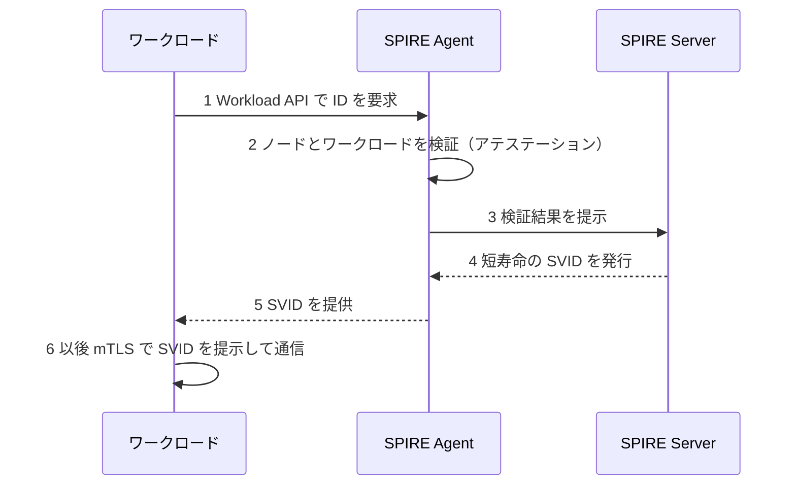

**STEP 7: ローカル認証へ**
外部の ID プロバイダに常に依存すると、**障害や侵害の影響**を受けます。書籍は「ローカルな認証ソリューションへ」という論点を扱っており、**リソース側で検証できる仕組み（証明書など）を持つ**ことで、可用性と信頼境界を改善する考え方を示します。

**STEP 8: グループの認証と認可 — 複数人の合意が必要な操作**
極めて重要な操作（ルート鍵の使用など）は、**1人の判断**に委ねないほうが安全です。

| 概念 | 説明 |
|---|---|
| Shamir の秘密分散 | 秘密を n 個に分割し、**k 個以上集まったときだけ復元できる**方式（k of n） |
| Red October | 複数人の承認がそろって初めて鍵を使える、「二人ルール」を実装したソフトウェアとして知られる（一般知識） |
| See Something, Say Something | 不審を見つけたら**誰でも報告できる**文化・仕組みを信頼シグナルに組み込む考え方 |

**STEP 9: 信頼シグナルと確認**
ID に関するシグナル（認証強度、普段の行動、役割、直近の異常）を信頼エンジンへ渡し、第4章の判断に使います。

### 本ガイドによるシナリオ例

「Bob が機密性の高い財務レポートを閲覧する」場合、ID 面では次のように判断できます（[S1] のシナリオ題材に沿った本ガイドの解釈）。

| 確認項目 | 内容 |
|---|---|
| ID 権威 | Bob は人事台帳に登録された本人か |
| 認証強度 | MFA（フィッシング耐性のある方式が望ましい）が成功しているか |
| ID 保管 | ディレクトリ上で finance グループに属し、休眠アカウントでないか |
| 信頼 | 普段と異なる場所・時間でないか。不足なら追加認証 |

### 重要用語

| 用語 | 説明 |
|---|---|
| ID 権威 | 本人性を最終的に保証する根拠・主体 |
| TOTP | 時間ベースのワンタイムパスワード |
| 帯域外認証 | 通常と別の経路で行う認証 |
| SSO | 一度の認証で複数サービスを利用する仕組み |
| SPIFFE／SVID | ワークロード ID の標準仕様／その資格情報 |
| Shamir の秘密分散 | k of n で秘密を復元する方式 |

### よくある誤解

- 「MFA なら安全」 → 方式により**フィッシング耐性**が大きく異なる。
- 「サービス間は内部通信だから認証不要」 → ゼロトラストでは**ワークロードにも ID**が必要。

### 確認問題

<details>
<summary>Q1. 「信頼が認証を駆動する」とはどういう意味ですか。</summary>

**解答例**: ログイン時の1回で済ませず、リソースの重要度と現在の信頼度に応じて追加認証を求めること。信頼が足りなければ要求し、十分なら省略する。
</details>

<details>
<summary>Q2. ワークロード ID に固定 API キーでなく SPIFFE のような仕組みを使う利点は？</summary>

**解答例**: 短寿命の資格情報が自動発行・自動更新され、漏えい時の影響が小さい。共有シークレットを配らずに済み、アテステーションで「何者か」を検証できる。
</details>

### 参考出典
[S1] [S13]

---

## 第7章 Trusting Applications（アプリケーションを信頼する）

### この章のゴール

- アプリケーションの信頼を**ソース→ビルド→配布→実行**の連鎖で捉えられる
- **SBOM・再現可能ビルド・SLSA** の位置づけを説明できる
- **コンフィデンシャルコンピューティングとアテステーション**の意味を理解する

> 書籍の章内トピック（目次より）: アプリケーションパイプライン／ソースコードの信頼（リポジトリ保護、監査証跡、コードレビュー）／ビルドの信頼（SBOM のリスク、信頼できる入出力、再現可能ビルド、リリースと成果物バージョンの分離）／配布の信頼（成果物の昇格、完全性と真正性、配布網、人間の介在）／インスタンスの信頼（アップグレードのみのポリシー、認可されたインスタンス）／ランタイムセキュリティ／セキュア SDLC／プライバシー保護（クラウドを信頼できるか、コンフィデンシャルコンピューティング、ハードウェア RoT、アテステーション）／シナリオ（[S1]）

### STEP 解説

**STEP 1: なぜアプリの信頼が必要か**
ユーザーと端末が正しくても、**アクセス先のアプリが改ざんされていたら**意味がありません。逆に、**不正なアプリ（インスタンス）がネットワーク上に紛れ込む**こともあります。

**STEP 2: アプリケーションパイプラインの全体像**

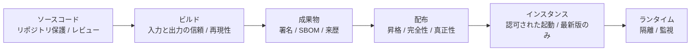

**STEP 3: ソースコードの信頼**

| 対策 | 目的 |
|---|---|
| リポジトリの保護（ブランチ保護、強い認証） | 無断変更の防止 |
| 監査証跡（誰がいつ何を変更したか） | 追跡・説明責任 |
| コードレビュー（複数人の承認） | 悪意・ミスの検出（第6章の「二人ルール」の応用） |

**STEP 4: ビルドの信頼**

| 論点 | 説明 |
|---|---|
| 信頼できる入力・出力 | 依存パッケージ・ビルド環境・出力成果物の出所を検証する |
| 再現可能ビルド | 同じソースから**同じバイナリが再現できる**ようにし、改ざんを検出しやすくする |
| SBOM | ソフトウェア部品表。含まれる部品を可視化できるが、**SBOM だけでは安全性は保証されない**（書籍が「リスク」と表現する論点） |
| リリースと成果物バージョンの分離 | 「どのコミットがどの成果物か」を明確にし、追跡可能にする |

> サプライチェーン対策の標準的な枠組みとして **SLSA**（"salsa" と読む）があります。ビルドの出所と完全性を段階的に高めるための合意形成された仕様で、v1.1 は Build トラックを中心に定義されています（[S15]）。SLSA は多層防御の一部であり、これだけで十分とは言えません（[S15]）。

**STEP 5: 配布の信頼**
- **成果物の昇格（Promotion）**: テスト環境で検証済みの成果物**そのもの**を本番へ進める（再ビルドしない）。
- **完全性と真正性**: ハッシュで改ざん検知、署名で作成者を確認。
- **配布網の信頼**: レジストリ・ミラー・CDN が侵害されても検知できる設計。
- **人間の介在**: 本番への配布には**承認者**を置く（自動化と統制の両立）。

**STEP 6: インスタンスの信頼**
「正しい成果物から作られた、認可された実行体か」を確認します。

| ポリシー | 内容 |
|---|---|
| アップグレードのみ | 古いバージョンへの**ロールバックを制限**し、脆弱な版の復活を防ぐ |
| 認可されたインスタンス | 起動を許可されたものだけが ID（証明書）を得られる（第6章の SPIFFE など） |

**STEP 7: ランタイムセキュリティとセキュア SDLC**

| 領域 | 内容 |
|---|---|
| セキュアコーディング | 入力検証、メモリ安全、秘密情報の扱い |
| 隔離 | コンテナ・サンドボックス・権限分離 |
| 能動的監視 | 異常な挙動や通信を検知 |
| セキュア SDLC | 要件・設計、実装、静的／動的解析、レビュー、QA、デプロイ・保守、継続的改善の各工程にセキュリティを組み込む |

**STEP 8: クラウドは信頼できるのか — コンフィデンシャルコンピューティング**
公開クラウド上では、**クラウド事業者の管理者から実行中のデータを守る**必要が出てきます。Confidential Computing Consortium（Linux Foundation）は、これを **「ハードウェアにもとづく、アテステーション付きの信頼できる実行環境（TEE）で計算を行うことでデータ使用中の保護を実現する」** と定義しています（[S16]）。

| 用語 | 説明 |
|---|---|
| TEE | コード・データの完全性と機密性を、ハードウェアで保護する実行環境 |
| ハードウェアルートオブトラスト（RoT） | 信頼の起点となるハードウェア |
| アテステーション | 「この環境は期待どおりの構成だ」という**証拠**を示し、相手が検証する仕組み |

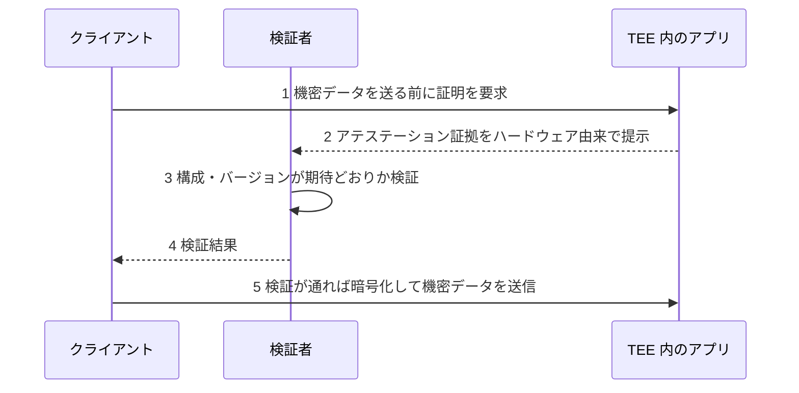

CCC は2022年末に、定義へアテステーションを明示的に追加しています（[S16]）。アテステーションは「評価して信頼するかを決めるための証拠」と位置づけられます。

### 本ガイドによるシナリオ例

書籍には「Bob が極めて機密性の高いデータを、金融アプリに計算させる」シナリオがあります（[S1]）。本ガイドの解釈例です。

| 確認ポイント | 内容 |
|---|---|
| ソース〜配布 | アプリは信頼できるパイプラインで作られ、署名・来歴を検証できるか |
| インスタンス | 認可された最新のインスタンスか |
| 実行環境 | クラウド事業者を信頼しなくてよいよう、TEE とアテステーションを使えるか |
| 通信 | 検証後にのみデータを送る設計か |

### 重要用語

| 用語 | 説明 |
|---|---|
| SBOM | ソフトウェア部品表 |
| 再現可能ビルド | 同じ入力から同一の成果物を再現できるビルド |
| SLSA | サプライチェーンの完全性を段階的に高める仕様 |
| TEE | ハードウェアで保護された実行環境 |
| アテステーション | 実行環境の状態を証明する仕組み |

### よくある誤解

- 「SBOM があれば安全」 → **可視化の手段**であり、脆弱性の対処・検証が別途必要。
- 「クラウドの暗号化で十分」 → 保存時・通信時は守れても、**使用中のデータ**は別の対策（TEE など）が必要。

### 確認問題

<details>
<summary>Q1. 再現可能ビルドがゼロトラストに役立つ理由は？</summary>

**解答例**: 独立した環境で同じバイナリを再現できれば、ビルド環境の改ざんや混入を検出でき、成果物の信頼を第三者が検証できるため。
</details>

<details>
<summary>Q2. アテステーションとは何ですか。</summary>

**解答例**: 実行環境が期待どおりの状態であることを、ハードウェア由来の証拠で示し、相手が検証できる仕組み。
</details>

### 参考出典
[S1] [S15] [S16]

---

## 第8章 Trusting the Traffic（トラフィックを信頼する）

### この章のゴール

- **暗号化と認証の違い**を説明できる
- 「最初のパケット」問題と、**Single Packet Authorization（SPA）** の発想を理解する
- ゼロトラストを**ネットワークモデルのどの層で実現するか**の選択肢と現実的な落としどころを整理できる

> 書籍の章内トピック（目次より）: 暗号化 vs 認証／暗号なしの真正性？／最初のパケット（fwknop、短命な例外、SPA ペイロード、暗号化、HMAC）／ゼロトラストをネットワークモデルのどこに置くか（クライアント・サーバ分割、ネットワーク／デバイス／アプリの対応問題）／現実的アプローチ（Microsoft Server Isolation、IKE と IPsec、相互認証 TLS）／クラウドトラフィック（CASB、ID フェデレーション）／フィルタリング（ホスト、ブックエンド、中間）／シナリオ（匿名プロキシ網経由のメールサービスアクセス）（[S1]）

### STEP 解説

**STEP 1: 暗号化と認証は別物**

| 項目 | 暗号化 | 認証 |
|---|---|---|
| 目的 | 盗み見を防ぐ（機密性） | 相手が誰かを確かめる |
| 例 | 通信路の暗号化 | 証明書による相手確認 |
| 落とし穴 | 暗号化していても**相手が偽物**なら意味がない | 認証していても**中身が平文**なら盗聴される |

ゼロトラストでは**両方が必須**です（暗号化されていても認証されていない通信は信頼しない）。

**STEP 2: 「最初のパケット」問題**
通信を始めるには、まず相手のサーバに**到達**する必要があります。しかし到達できる時点で、サーバは**攻撃者にも見える**状態です（ポートスキャン、脆弱性の悪用）。つまり「認証の前の、最初のパケット」をどう扱うかが課題です。

**STEP 3: Single Packet Authorization（SPA）の発想**
**fwknop** は Michael Rash が開発した SPA の実装で、**1つの暗号化されたパケット**で、許可したい接続や実行コマンドなどの情報を伝えます。サーバ側は libpcap で受動的に監視するため、**従来の意味で接続を受け付ける“サーバ”が存在しない**のが特徴です（[S14]）。

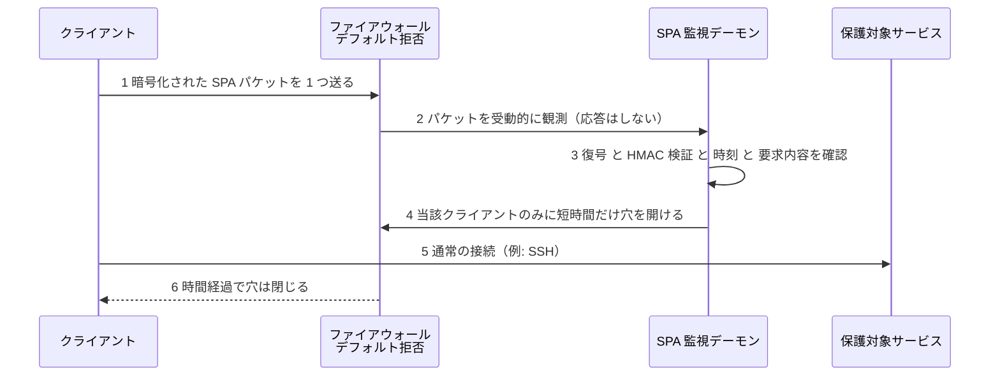

| SPA の要素 | 役割 |
|---|---|
| 短命な例外（Short-lived exceptions） | 許可は短時間だけ。使い終わったら自動で閉じる |
| ペイロード暗号化 | 要求内容（誰が・何を）を盗み見られないようにする |
| HMAC | ペイロードの**改ざん検知**と送信者の検証 |
| 受動監視 | サーバは応答しないため、**スキャンしても存在が見えにくい** |

fwknop の作者は、SPA はポートノッキングより、**1パケットで多くの情報を伝えられ、速い**と説明しています（[S14]）。なお fwknop の資料によれば、Tor 経由で SPA を送る場合は TCP 接続上で送る必要があり、厳密には「単一パケット」ではなくなります（[S14]）。これは本章の「匿名プロキシ網経由」シナリオと関連する論点です。

**STEP 4: ゼロトラストをどの層に置くか**

| 層 | 例 | 長所 | 短所 |
|---|---|---|---|
| ネットワーク層（L3） | IPsec／IKE | アプリ改修が不要 | 粒度が粗くなりやすい／デバイス・ネットワーク機器の対応が必要 |
| トランスポート層（L4〜L5） | 相互認証 TLS（mTLS） | 通信ごとに相互認証・暗号化できる／広く普及 | 証明書の発行・更新の自動化が前提 |
| アプリケーション層（L7） | アプリ内の認可、API ゲートウェイ | 最も細かい粒度（操作単位） | アプリごとに実装が必要 |

層を上げるほど**粒度は細かく**なりますが、**アプリ側の対応コスト**が増えます。逆に下げるほど対応は少なくて済みますが、判断が粗くなります（付録のモデルと対応づけて確認してください）。

**STEP 5: クライアント・サーバ分割と対応問題**
本書は、次の3つの「対応の壁」を指摘しています。

| 壁 | 内容 |
|---|---|
| ネットワーク機器の対応 | 古い機器・独自プロトコルが新方式を通せない |
| デバイスの対応 | 古い端末・IoT が証明書やエージェントを扱えない |
| アプリケーションの対応 | レガシーアプリが mTLS／ID 連携に対応していない |

**STEP 6: 現実的なアプローチ**
全面的な作り直しは現実的ではないため、**使える技術を組み合わせる**考え方です。

| 手法 | 概要 |
|---|---|
| Microsoft Server Isolation | Windows 環境で、ドメイン参加サーバ間の通信を IPsec ポリシーで制限する方式（既存環境に段階導入しやすい） |
| IKE と IPsec | 鍵交換（IKE）と暗号化・認証（IPsec）で、ホスト間通信を保護 |
| 相互認証 TLS（mTLS） | クライアントとサーバの**双方が証明書を提示**して認証 |

mTLS の最小設定例（NGINX）です。`ssl_verify_client on` により、**社内 CA が署名したクライアント証明書を持たない接続は拒否**されます。

```nginx
server {
    listen 443 ssl;
    server_name internal.example.com;

    ssl_certificate         /etc/ssl/server.crt;
    ssl_certificate_key     /etc/ssl/server.key;

    # クライアント証明書を検証する社内 CA
    ssl_client_certificate  /etc/ssl/internal-ca.crt;
    ssl_verify_client       on;

    ssl_protocols TLSv1.2 TLSv1.3;
}
```

動作確認の例（クライアント側）です。

```bash
openssl s_client -connect internal.example.com:443 \
  -cert client.crt -key client.key -CAfile ca.crt
```

**STEP 7: クラウドトラフィックの信頼**
クラウド（SaaS を含む）では、通信は**自社ネットワークを通らない**ことが多く、境界で見えません。そこで次を組み合わせます。

| 手段 | 役割 |
|---|---|
| CASB | クラウドサービスの利用を可視化・制御する |
| ID フェデレーション | 自社の ID 基盤でクラウドの認証を統合する |

**STEP 8: フィルタリングの配置**

| 配置 | 概要 | 向いている場面 |
|---|---|---|
| ホストフィルタリング | 各ホスト自身で許可通信だけ受ける | 最小権限を徹底したい |
| ブックエンドフィルタリング | 通信の**両端**で同じポリシーを適用 | 中間経路を信頼したくない |
| 中間フィルタリング | プロキシ／ゲートウェイで集中制御 | 導入しやすい・レガシー混在 |

### 本ガイドによるシナリオ例

書籍には「Bob が匿名プロキシ網を経由してメールサービスにアクセスを要求する」シナリオがあります（[S1]）。本ガイドの解釈例です。

| 観点 | 判断の例 |
|---|---|
| 場所のシグナル | 匿名化されており、場所の信頼度は**低い** |
| 認証 | 端末証明書・ユーザー認証が成立するか（匿名経路でも暗号学的な身元は確認できる） |
| 結論 | 場所が不明でも**証明書と追加認証が強ければ段階的に許可**できる。ただしリスクの高い操作は制限する |

### 重要用語

| 用語 | 説明 |
|---|---|
| SPA | 1つの暗号化パケットで認可情報を伝える方式 |
| fwknop | SPA のオープンソース実装 |
| HMAC | 鍵付きハッシュによる改ざん検知 |
| mTLS | クライアントとサーバが相互に証明書で認証する TLS |
| IKE／IPsec | 鍵交換／ネットワーク層の暗号化・認証 |
| CASB | クラウドアクセスセキュリティブローカー |

### よくある誤解

- 「TLS で暗号化していればゼロトラスト」 → サーバ認証のみの TLS は**クライアントを認証していない**。
- 「SPA はステルス性があるから十分」 → SPA は**最初の到達性を絞る**手段であり、その後の認証・認可・暗号化を省略できるわけではない。

### 確認問題

<details>
<summary>Q1. 暗号化されているのに信頼できない通信の例を挙げてください。</summary>

**解答例**: 偽のサーバとの TLS 通信（サーバ認証をしていない場合）や、盗まれた認証情報を使った攻撃者との暗号化通信。
</details>

<details>
<summary>Q2. mTLS を導入する際に自動化が必要な理由は？</summary>

**解答例**: 多数の端末・サービスに証明書を発行し、短い有効期限で更新・失効するには、人手では運用が破綻するため。
</details>

### 参考出典
[S1] [S14]

---

## 第9章 Realizing a Zero Trust Network（ゼロトラストネットワークの実現）

### この章のゴール

- 既存の境界型ネットワークを、**段階的にゼロトラストへ移行する手順**を説明できる
- マイクロセグメンテーション、SDP、ゼロトラストプロキシなどの手法を使い分けられる
- Google **BeyondCorp** の事例から学べる点を整理できる

> 書籍の章内トピック（目次より）: 現状理解（スコープ選定、評価と計画、要件、システム図、フローの理解）／マイクロセグメンテーション／ソフトウェア定義境界／コントローラレスアーキテクチャ／構成管理による「近道」／実装フェーズ（アプリ認証・認可、ロードバランサ／プロキシの認証、関係指向ポリシー、ポリシー配布、ポリシー定義・実装、ゼロトラストプロキシ、クライアント側 vs サーバ側移行、エンドポイントセキュリティ）／事例（Google BeyondCorp、PagerDuty のクラウド非依存ネットワーク）（[S1]）

### STEP 解説

**STEP 1: 最初の一歩は「現状を知る」こと**
知らない通信は守れません。次の順序で進めます。

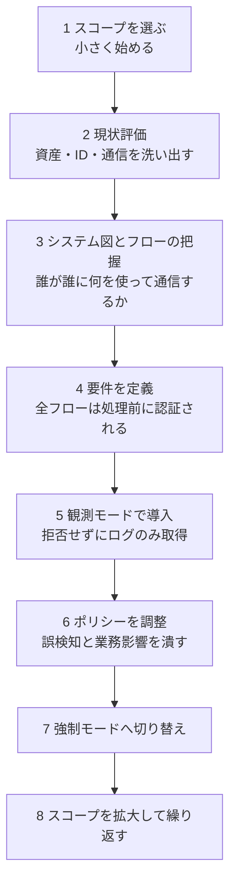

**STEP 2: スコープの選び方**
全社一斉は失敗しやすいため、**価値が高く境界が明確な範囲**から始めます。

| 選択基準 | 例 |
|---|---|
| 重要度が高い | 財務システム、顧客データ基盤 |
| 依存が少ない | 独立性の高い新規サービス |
| 効果が見えやすい | リモートアクセス（VPN 置き換え） |

**STEP 3: 要件の基本**
書籍の中心要件は、**「すべてのネットワークフローは、処理される前に認証されなければならない」** という趣旨です。ここでの「処理」は、アプリがデータを解釈する前を指します。**認証前の入力を解釈しない**ことで、パーサの脆弱性などを突く攻撃面を狭められます。

**STEP 4: システム図とフローの把握**
「ホスト」ではなく「**フロー（誰→誰、どのプロトコル）**」を一覧化します。表で十分に管理できます。

| 送信元 | 宛先 | プロトコル／ポート | 目的 | 認証方式 | 現状 | 備考 |
|---|---|---|---|---|---|---|
| Web 層 | API 層 | HTTPS／443 | 業務 API 呼び出し | mTLS を予定 | 平文の社内通信 | 優先度高 |
| バッチ | DB | TCP／5432 | 夜間集計 | 証明書認証を予定 | 共有パスワード | 要改善 |

**STEP 5: 主要な実現手法**

| 手法 | 概要 | 長所 | 注意点 |
|---|---|---|---|
| マイクロセグメンテーション | ワークロード単位で通信を細かく分割・制限 | 横移動を抑制 | ルールが爆発しやすい。可視化が前提 |
| ソフトウェア定義境界（SDP） | 認証・認可を終えた主体にだけ、リソースへの経路を動的に見せる | リソースを「見えなく」できる | コントローラの可用性・保護が重要 |
| コントローラレスアーキテクチャ | 中央コントローラに依存せず、各ホストがポリシーを持つ | 単一障害点を避ける | ポリシー配布・更新の仕組みが必要 |
| 構成管理による「近道」 | Ansible 等の構成管理で、ファイアウォールや証明書を自動配布 | 既存ツールで早く始められる | 構成管理基盤が侵害されると影響大 |

**STEP 6: 実装フェーズの要点**

| 項目 | 内容 |
|---|---|
| アプリの認証・認可 | 各アプリが誰のリクエストかを検証し、細かく認可する |
| LB・プロキシの認証 | 中間装置も**認証される主体**にする。ここで検証が途切れると穴になる |
| 関係指向ポリシー | IP でなく「サービスAはサービスBを呼べる」という**関係**で書く |
| ポリシー配布 | 判断の更新を、すべての実施点へ**安全・迅速に**届ける |
| ゼロトラストプロキシ | アプリを改修せずに前段で認証・認可を行う（レガシー対応） |
| クライアント側 vs サーバ側移行 | どちらから先に切り替えるかで、影響と難易度が変わる |
| エンドポイントセキュリティ | 端末の保護が弱いと全体が崩れる（第5章） |

クライアント側とサーバ側のどちらから移行するか、一般的な整理は次のとおりです。

| 方式 | 進め方 | 利点 | 課題 |
|---|---|---|---|
| サーバ側から | まず保護対象サーバに認証を課す | 重要資産を先に守れる | 全クライアントが対応するまで互換性維持が必要 |
| クライアント側から | まず端末側でゲートウェイ／エージェントを導入 | 利用者体験を揃えやすい | サーバ側に脆弱な経路が残る |

### 事例1: Google BeyondCorp

**背景**: Google は、2009年に発生した高度な標的型攻撃（Operation Aurora）をきっかけに、従業員とデバイスが社内アプリにアクセスする方法を見直す取り組みを始めました（[S10]）。

**考え方**: **特権的な社内ネットワークをやめ、社内アプリをインターネット越しに提供**します。アクセス判断は、接続元ネットワークではなく**ユーザーとデバイスの状態**に基づきます。公式サイトでは「ネットワークの接続元がアクセスできるサービスを決めてはならない」という趣旨の原則（perimeterless design）が示されています（[S10]）。

**目標**: 全従業員が、**VPN なしに、信頼できないネットワークからでも安全に働ける**こと（BeyondCorp のミッション。2011年以降）（[S10]）。

**公開資料**: Google は BeyondCorp の経緯と設計を複数の論文で公開しています（概要、設計から展開まで、アクセスプロキシ、移行）（[S10]）。

| 論文・資料 | 内容 |
|---|---|
| A New Approach to Enterprise Security（2014 年、;login:） | 全体像。すべてのアクセスは認証・認可・暗号化され、デバイス状態とユーザー資格情報に基づく（[S10]） |
| Design to Deployment at Google | どのように実現したか |
| The Access Proxy | Google のフロントエンド基盤 |
| Migrating to BeyondCorp | 生産性を保ちながら移行する方法 |

書籍では、BeyondCorp の主要コンポーネント、GFE（Google Front End）の活用・拡張、複数プラットフォームでの認証の難しさ、移行、教訓が扱われています（目次より）（[S1]）。

**学べる点（初学者向けまとめ）**

| 学び | 内容 |
|---|---|
| 段階的な移行 | 一度に切り替えず、生産性を維持しながら進める |
| デバイスの重視 | ユーザーだけでなく、管理された端末の台帳と状態が判断の要 |
| 中央のアクセスプロキシ | アプリ改修を最小限に、入口で認証・認可を行う |

### 事例2: PagerDuty のクラウド非依存ネットワーク

書籍では、PagerDuty の事例として、**特定のクラウド事業者に依存しない**ゼロトラストの実現が紹介されています（目次より：構成管理を自動化基盤として活用／動的に計算されるローカルファイアウォール／分散型のトラフィック暗号化／分散型のユーザー管理／ロールアウト／プロバイダ非依存の価値）（[S1]）。第2版・第1版を通じて、**構成管理を「自動化の土台」にして、各ホストのファイアウォールを動的に計算する**というコントローラレスに近い発想が学べます。

### 重要用語

| 用語 | 説明 |
|---|---|
| マイクロセグメンテーション | 通信をワークロード単位で細分化して制限 |
| SDP | 認証後にだけ経路を見せるソフトウェア定義の境界 |
| 関係指向ポリシー | 主体間の関係で表現するポリシー |
| ゼロトラストプロキシ | 前段で認証・認可を行う中間装置 |
| BeyondCorp | Google によるゼロトラスト実装 |

### よくある誤解

- 「全部作り直さないとゼロトラストにならない」 → **段階移行**が基本（観測→強制）。
- 「VPN を廃止すれば完了」 → VPN 廃止は**手段の1つ**。評価・ポリシー・継続運用が本体。

### 確認問題

<details>
<summary>Q1. なぜ「観測モード」から始めるのですか。</summary>

**解答例**: いきなり拒否すると業務を止めるため。まず通信とポリシー適用結果をログで確認し、誤検知や漏れを調整してから強制に切り替える。
</details>

<details>
<summary>Q2. BeyondCorp の中心的な考え方を一文で述べてください。</summary>

**解答例**: 特権的な社内ネットワークをやめ、ユーザーとデバイスの状態にもとづいて、すべてのアクセスを認証・認可・暗号化する。
</details>

### 参考出典
[S1] [S10]

---

## 第10章 The Adversarial View（攻撃者の視点）

### この章のゴール

- ゼロトラストを導入しても残る**落とし穴と攻撃経路**を理解する
- 各攻撃に対する**考え方**を整理できる

> 書籍の章内トピック（目次より）: 落とし穴と危険／攻撃経路（ID とアクセス：認証情報窃取、権限昇格と横移動／インフラとネットワーク：コントロールプレーンの保護、エンドポイント列挙、信頼できないコンピューティング基盤、DDoS、中間者攻撃／無効化／フィッシング／物理的強要）／サイバー保険の役割（[S1]）

### STEP 解説

**STEP 1: ゼロトラストは「魔法」ではない**
攻撃者は、新しい防御の**弱い継ぎ目**を探します。特に、**コントロールプレーンが最大の標的**になります（判断を握られると全体が崩れるため）。

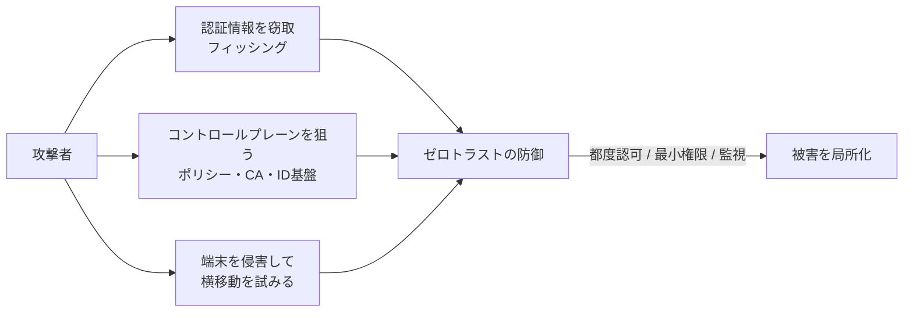

**STEP 2: 攻撃経路と考え方**

| 攻撃 | 何が起きるか | 考え方・対策 |
|---|---|---|
| 認証情報の窃取 | パスワード・トークンが盗まれる | フィッシング耐性のある認証、短寿命の資格情報、デバイス束縛 |
| 権限昇格・横移動 | 侵入後に権限を広げ、別ホストへ移る | 最小権限、マイクロセグメンテーション、異常行動の検知 |
| コントロールプレーンの保護 | ポリシー／CA／ID 基盤が奪われる | 最重要資産として隔離・多重承認・監査・可用性設計 |
| エンドポイント列挙 | どのホストが存在するかを探られる | SPA 等で到達性を絞る、スキャン検知（第8章） |
| 信頼できないコンピューティング基盤 | クラウド事業者や基盤が信頼できない | TEE・アテステーション（第7章） |
| DDoS | サービス妨害で可用性を奪う | 分散・レート制限。コントロールプレーンが止まった場合の挙動を決めておく |
| 中間者攻撃（MitM） | 通信を傍受・改ざんされる | mTLS、証明書検証の徹底 |
| 無効化（Invalidation） | 失効・取り消しが間に合わず、盗まれた資格情報が使われ続ける | 短寿命化で「失効に頼らない」設計、迅速な失効伝搬 |
| フィッシング | 人が騙されて資格情報を渡す | 方式選定（パスキー等）、教育、通報文化（第6章） |
| 物理的強要 | 人が脅されて認証を突破させられる | 多人数承認（Shamir 等）、強要時の警告手段（第6章） |

**STEP 3: 設計上の落とし穴**

| 落とし穴 | 内容 |
|---|---|
| コントロールプレーンの単一障害点化 | 停止すると全員が使えなくなる／逆に「止まったら許可」にしてしまう |
| 過度な例外 | 例外ルールが増えて、実質的に境界型に逆戻りする |
| 可視化なしの導入 | 通信を把握せずに拒否し、業務障害を起こす |
| 信頼シグナルの過信 | 場所や端末状態は偽装されうる（第3章） |

**STEP 4: サイバー保険の役割**
サイバー保険は**リスクの移転手段**であり、**防御の代替ではありません**。実務上は、保険会社が**MFA や資産管理などの実施状況**を条件にすることが多く、ゼロトラストの取り組みを評価・促進する面があります（一般的な整理）。

### 重要用語

| 用語 | 説明 |
|---|---|
| 横移動 | 侵入後に別ホストへ展開する行為 |
| 無効化（失効） | 発行済み資格情報を取り消すこと |
| コントロールプレーン保護 | 判断基盤そのものを守ること |
| 物理的強要 | 脅迫等で認証を突破させる攻撃 |

### よくある誤解

- 「ゼロトラストを導入すれば侵害されない」 → **侵害を前提に被害を局所化する**設計であり、侵害ゼロを保証しない。
- 「保険に入れば安全」 → 保険は**事後の損失補填**であり、事前防御ではない。

### 確認問題

<details>
<summary>Q1. なぜコントロールプレーンが最大の標的になるのですか。</summary>

**解答例**: 認可の判断・ポリシー・証明書発行など信頼の根幹を握っており、奪われると攻撃者が正規の許可を得られるため。
</details>

<details>
<summary>Q2. 「失効に頼らない設計」とはどういう意味ですか。</summary>

**解答例**: 資格情報を短寿命にして、失効が間に合わなくても自然に無効化されるようにすること。
</details>

### 参考出典
[S1]

---

## 第11章 Standards, Frameworks, and Guidelines（標準・フレームワーク・ガイドライン）

### この章のゴール

- NIST・CISA・DoD・NCSC など**主要な標準・フレームワークの役割と違い**を整理できる
- 自組織の用途に合わせて**どれを参照すべきか**を判断できる

> 書籍の章内トピック（目次より）: 政府（米国、英国、EU）／民間・公的組織（Cloud Security Alliance、The Open Group、Gartner、Forrester、ISO）／商用ベンダー（[S1]）

### STEP 解説

**STEP 1: まず全体像**

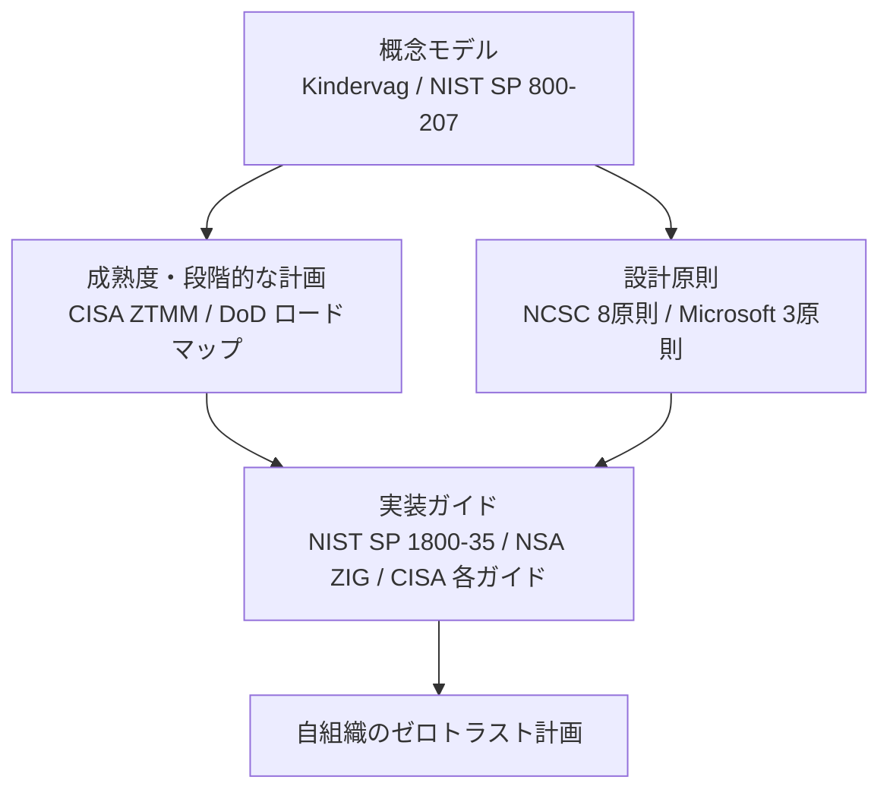

**STEP 2: 比較表**

| 名称 | 発行元 | 種類 | 概要 | 出典 |
|---|---|---|---|---|
| No More Chewy Centers | Forrester（John Kindervag） | 概念の原典（2010年） | ゼロトラストモデルを提唱。境界型の「外は硬く、中は柔らかい」構造を批判 | [S9] |
| NIST SP 800-207 | NIST | 抽象的なアーキテクチャ定義（2020年8月最終） | ゼロトラストの定義・論理コンポーネント・展開モデル・ユースケース・移行ロードマップ | [S3] |
| NIST SP 1800-35 | NIST NCCoE | 実装プラクティスガイド（2025年6月最終） | 24社のベンダーと19種のサンプル実装を示す。SP 800-207 の概念を実装に落とし込む | [S4] |
| CISA ZTMM 2.0 | CISA | 成熟度モデル（2023年4月） | 5つの柱と4つの段階、3つの横断的能力で、段階的な移行を支援 | [S5] |
| DoD Zero Trust Strategy | 米国防総省 | 戦略・ロードマップ（2022年） | 7つの柱、152 のアクティビティ。ターゲットレベルを FY2027 までに達成 | [S8] |
| NCSC 設計原則 | 英国 NCSC | 設計原則（v1.0 は 2021年7月） | 8つの原則 | [S12] |
| Microsoft の3原則 | Microsoft | ベンダーの整理 | 明示的な検証・最小権限・侵害前提 | [S11] |
| NSA ZIG | NSA | 実装ガイドライン（2026年1月） | ターゲットレベル達成のための活動を段階（Phase）ごとに整理 | [S7] |

**STEP 3: NIST SP 800-207 の7つのテナント（要点）**

NIST SP 800-207 は、ゼロトラストの前提となる**7つの基本方針（テナント）**を示しています（一般的に知られる内容を日本語で要約。正確な表現は原典で確認してください）（[S3]）。

| 番号 | 要点 |
|---|---|
| 1 | すべてのデータソースとコンピューティングサービスを「リソース」と見なす |
| 2 | ネットワーク上の位置にかかわらず、すべての通信を保護する |
| 3 | リソースへのアクセスは**セッション単位**で付与する |
| 4 | アクセスは**動的ポリシー**（クライアントの状態・行動・環境など）で決める |
| 5 | 保有・関連する全資産の整合性とセキュリティ状態を**監視・測定**する |
| 6 | リソースの認証・認可は動的で、**アクセス許可の前に厳格に実施**する |
| 7 | 資産・ネットワーク・通信の現状をできる限り収集し、**セキュリティ態勢の改善に使う** |

**STEP 4: CISA Zero Trust Maturity Model 2.0**
CISA は2023年4月に ZTMM 2.0 を公開しました（[S5]）。**5つの柱**（ID、デバイス、ネットワーク、アプリケーションとワークロード、データ）、**4つの段階**（Traditional、Initial、Advanced、Optimal）、**3つの横断的能力**（可視化と分析、自動化とオーケストレーション、ガバナンス）で構成されます（[S5]）。

| 柱 | 成熟度を上げる方向性の例 |
|---|---|
| ID | MFA の採用、リアルタイムなリスクの把握 |
| デバイス | 継続的なコンプライアンス確認、資産の網羅的な把握 |
| ネットワーク | 広範なマイクロセグメンテーション、通信の暗号化 |
| アプリケーション／ワークロード | 継続的な認可、リアルタイムのリスク分析 |
| データ | 継続的なインベントリ、自動分類 |

CISA は「各柱は独自のペースで進められるが、最適化に近づくにつれて、柱をまたぐ連携が必要になる」と説明しています（[S5]）。

**STEP 5: 米国 DoD の戦略**
DoD の戦略・実行ロードマップは、7つの柱で 152 のアクティビティを定義し、うち 91 が「ターゲットレベル」（2027 会計年度末＝2027年9月30日までに達成）、61 が「アドバンスドレベル」（2032 年まで）です（[S8]）。柱は、ユーザー、デバイス、アプリケーションとワークロード、データ、ネットワークと環境、自動化とオーケストレーション、可視化と分析で構成されます。

**STEP 6: 英国 NCSC の8原則**
NCSC は、ゼロトラストを「ネットワークへの固有の信頼を取り除き、ネットワークは敵対的と仮定し、各要求をアクセスポリシーで検証する設計方針」と説明しています（[S12]）。8原則は次のとおりです（[S12]）。

| 番号 | 原則 |
|---|---|
| 1 | ユーザー・デバイス・サービス・データを含む**アーキテクチャを把握**する |
| 2 | ユーザー・サービス・デバイスの**ID を把握**する |
| 3 | ユーザー行動とデバイス・サービスの**健全性を評価**する |
| 4 | **ポリシー**でリクエストを認可する |
| 5 | **どこでも認証・認可**する |
| 6 | ユーザー・デバイス・サービスに焦点を当てて**監視**する |
| 7 | 自組織を含め、**どのネットワークも信頼しない** |
| 8 | ゼロトラストを前提に設計された**サービスを選ぶ** |

**STEP 7: その他の組織（目次に記載）**
書籍は、EU、Cloud Security Alliance（CSA）、The Open Group、Gartner、Forrester、ISO、商用ベンダーの取り組みも整理しています（[S1]）。本ガイドでは詳細な内容までは確認できていないため、**各組織の最新資料は一次情報で確認**してください（CSA は NCSC の設計原則を資料として掲載しています：[S12]）。

**STEP 8: 日本の動向（補足）**
日本では、デジタル庁が政府情報システムのセキュリティ関連技術ガイドライン群の一つとして「ゼロトラスト・アーキテクチャ適用方針」を位置づけています（2022年資料）。資料では、ゼロトラストは**ソリューションではなく概念モデル**であり、ネットワークのセグメンテーションだけを信頼源とせず、**デジタルアイデンティティにもとづく信頼付与へシフトする**という考え方が、NIST・CISA・NCSC を出典として整理されています（[S18]）。

**STEP 9: どれを参照すべきか**

| あなたの目的 | まず読むもの |
|---|---|
| 概念を理解したい | Kindervag の原典の解説、NIST SP 800-207 |
| 設計の原則を知りたい | NCSC 8原則、Microsoft 3原則 |
| 進捗を評価・計画したい | CISA ZTMM 2.0 |
| 実装例を参考にしたい | NIST SP 1800-35 |
| 日本の政府系の文脈 | デジタル庁の適用方針 |
| OT／制御系 | CISA の OT 向けガイド（横断編C参照） |

### 重要用語

| 用語 | 説明 |
|---|---|
| ZTA | ゼロトラストアーキテクチャ |
| ZTMM | ゼロトラスト成熟度モデル（CISA） |
| NCCoE | NIST の国家サイバーセキュリティ卓越センター |
| テナント | NIST SP 800-207 が示す基本方針 |

### よくある誤解

- 「どれか1つの標準に従えば十分」 → **目的別に併用**する（概念＋原則＋成熟度＋実装）。
- 「米国政府向けだから無関係」 → **民間でも広く参照**されている（ZTMM は政府向けだがどの組織でも活用できると説明されている：[S5]）。

### 確認問題

<details>
<summary>Q1. NIST SP 800-207 と SP 1800-35 の関係を述べてください。</summary>

**解答例**: SP 800-207 は抽象的な概念・論理アーキテクチャを定義し、SP 1800-35 はその概念に沿った実装プラクティス（サンプル実装・ベンダー協業の結果）を示す。
</details>

<details>
<summary>Q2. CISA ZTMM 2.0 の5つの柱と4つの段階を挙げてください。</summary>

**解答例**: 柱は ID、デバイス、ネットワーク、アプリケーションとワークロード、データ。段階は Traditional、Initial、Advanced、Optimal。
</details>

### 参考出典
[S1] [S3] [S4] [S5] [S7] [S8] [S9] [S11] [S12] [S18]

---

## 第12章 Challenges and the Road Ahead（課題と今後）

### この章のゴール

- ゼロトラスト導入で現実に直面する**課題**を整理できる
- **量子コンピューティング・AI・プライバシー強化技術（PET）** との関係を理解する

> 書籍の章内トピック（目次より）: 課題（マインドセットの転換、シャドー IT、縦割り組織、統合されたゼロトラスト製品の不足、スケーラビリティと性能）／要点／技術の進歩（量子コンピューティング、人工知能、プライバシー強化技術）（[S1]）

### STEP 解説

**STEP 1: 課題**

| 課題 | 内容 | 対処の方向性 |
|---|---|---|
| マインドセットの転換 | 「中は安全」という感覚の変更が最大の壁 | 経営層の合意、教育、成功事例の共有 |
| シャドー IT | 管理外のクラウド・端末が見えない | CASB・ID フェデレーション等による可視化 |
| 縦割り組織 | ネットワーク／セキュリティ／アプリ／運用が分断 | 横断チーム、共通の指標（CISA ZTMM 等） |
| 統合製品の不足 | 1製品でゼロトラスト全体を満たせない | 標準（mTLS、SPIFFE 等）で相互運用性を確保 |
| スケーラビリティと性能 | 全リクエストの判断が負荷・遅延になる | キャッシュ、分散判断、ローカル実施 |

**STEP 2: 要点**
- ゼロトラストは**製品でなく継続的な取り組み**。
- 段階的に進め、**観測→強制**で業務影響を抑える。
- **ID・デバイス・アプリ・通信・データ**の全体で考える。

**STEP 3: 量子コンピューティングとの関係**
量子コンピュータが実用化すると、**RSA・ECDH・ECDSA などの現行の公開鍵暗号が破られる**おそれがあります。ゼロトラストは**証明書・鍵交換・署名**に大きく依存するため影響が大きい領域です。

NIST は2024年8月13日に、3つのポスト量子暗号（PQC）標準を最終化しました（[S17]）。

| 標準 | アルゴリズム | 用途 | 置き換え対象の例 |
|---|---|---|---|
| FIPS 203 | ML-KEM | 鍵確立 | RSA／DH、ECDH の鍵交換 |
| FIPS 204 | ML-DSA | デジタル署名 | RSA、ECDSA の署名 |
| FIPS 205 | SLH-DSA | ハッシュベース署名（保守的な代替） | 同上（バックアップ的位置づけ） |

> 補足: 2025年3月に NIST は HQC をバックアップの鍵カプセル化方式として選定しました。FALCON 系の FN-DSA（FIPS 206）は、2026年半ばの時点でも草案段階とする資料があります（[S17]。最新状況は NIST の公式情報で確認してください）。

ゼロトラストの観点では、次の3点が実務上の論点です。

| 論点 | 内容 |
|---|---|
| 暗号の可視化 | 自組織のどこで公開鍵暗号を使っているか（mTLS、PKI、コード署名、VPN 等）を棚卸しする |
| 暗号の俊敏性（Crypto-agility） | アルゴリズムを後から差し替えられる設計にする |
| 「今盗んで、後で解読」への備え | 長期保存が必要な機密通信は、早めに移行を検討する |

**STEP 4: 人工知能（AI）との関係**

| 観点 | 内容 |
|---|---|
| 防御側の活用 | 異常検知、信頼シグナルの分析（第5章の機械学習）。ただし**説明可能性**が課題 |
| 攻撃側の活用 | フィッシング文面の高度化、攻撃の自動化 |
| AI エージェントの ID | AI エージェントも**非人間の ID**であり、ワークロード ID（第6章）と最小権限の対象にすべき（一般的な整理） |

**STEP 5: プライバシー強化技術（PET）**
データを守りながら活用する技術群です（一般知識）。

| 技術 | 概要 |
|---|---|
| 準同型暗号 | 暗号化したまま計算する |
| 秘密計算（MPC） | 複数者が互いのデータを見せずに共同計算する |
| 差分プライバシー | 統計にノイズを加えて個人を特定しにくくする |
| コンフィデンシャルコンピューティング | TEE で使用中のデータを保護（第7章、[S16]） |

### 重要用語

| 用語 | 説明 |
|---|---|
| シャドー IT | 組織が把握していない IT の利用 |
| PQC | ポスト量子暗号 |
| ML-KEM／ML-DSA／SLH-DSA | NIST が標準化した PQC アルゴリズム |
| 暗号の俊敏性 | アルゴリズムを入れ替えやすい設計 |
| PET | プライバシー強化技術 |

### よくある誤解

- 「量子対策は将来の話」 → 長期保存データは**今の通信が将来解読される**リスクがあり、**棚卸しは今から**始められる。
- 「AI を入れればゼロトラストは自動化できる」 → AI は補助であり、**ポリシーと説明責任の設計**が先に必要。

### 確認問題

<details>
<summary>Q1. ゼロトラストが量子コンピューティングの影響を受けやすいのはなぜですか。</summary>

**解答例**: 証明書（署名）や鍵交換といった公開鍵暗号に依存しており、それらが破られると身元証明も通信の保護も崩れるため。
</details>

<details>
<summary>Q2. 「暗号の俊敏性」を高める具体策を1つ挙げてください。</summary>

**解答例**: アルゴリズムをコードに埋め込まず設定で切り替えられるようにする、暗号の利用箇所をインベントリ化する、など。
</details>

### 参考出典
[S1] [S16] [S17]

---

## 付録 ネットワークモデル入門

### この付録のゴール

OSI 参照モデルと TCP/IP モデルを復習し、**ゼロトラストの施策がどの層に対応するか**を理解します。

> 書籍の付録トピック（目次より）: ネットワーク層の図解、OSI モデル（第1層〜第7層）、TCP/IP モデル（[S1]）

### OSI 参照モデルとゼロトラスト

| 層 | 名称 | 役割 | 例 | ゼロトラストとの関係 |
|---|---|---|---|---|
| 7 | アプリケーション | ユーザー向けサービス | HTTP、DNS、SMTP | アプリ内の認可、API 認可（第8章） |
| 6 | プレゼンテーション | データ形式・暗号化 | TLS（実装上） | 暗号化・証明書 |
| 5 | セッション | 通信の管理 | セッション管理 | セッション単位の認可（NIST テナント3） |
| 4 | トランスポート | 信頼性のある転送 | TCP、UDP | mTLS、ポート制御、SPA |
| 3 | ネットワーク | 経路選択 | IP | IPsec、セグメンテーション |
| 2 | データリンク | 隣接機器間の転送 | Ethernet、Wi-Fi | 802.1X 等のポート認証 |
| 1 | 物理 | 信号の伝送 | ケーブル、無線 | 物理アクセス対策 |

### TCP/IP モデルとの対応

| TCP/IP モデル | 対応する OSI 層 |
|---|---|
| アプリケーション層 | 5〜7 |
| トランスポート層 | 4 |
| インターネット層 | 3 |
| ネットワークインターフェース層 | 1〜2 |

> **覚え方**: 層が低いほど「どこから来たか（場所）」に近く、層が高いほど「誰が何をしたいか（意図）」に近い。ゼロトラストは**高い層（意図）の情報**で判断することを重視します。

---

## 横断編A: 1つのリクエストが許可されるまで

各章の要素が、**1回のアクセスの中でどう連携するか**を通しで確認します（本ガイドによる総合例です）。

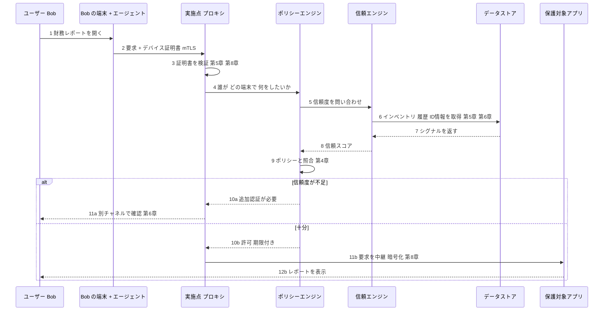

| 手順 | 関連する章 | 要点 |
|---|---|---|
| 2〜3 | 第5章・第8章 | デバイスの身元を暗号学的に確認（エージェント報告だけに頼らない：第3章） |
| 4〜9 | 第4章 | 判断は実施点ではなく、ポリシーエンジンが行う |
| 6〜8 | 第5章・第6章 | デバイス・ID・行動のシグナルを統合 |
| 10a〜11a | 第6章 | 信頼が不足なら、追加認証で補う |
| 11b | 第7章・第8章 | 接続先アプリが認可されたインスタンスであること、通信の暗号化 |

---

## 横断編B: 導入ステップ（10ステップ）

第9章の手順と、CISA の5つの柱（[S5]）を組み合わせた、本ガイドによる実務向けの整理です。

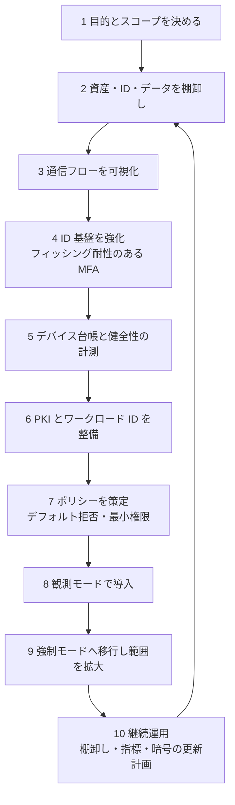

| ステップ | 成果物 | 主な柱（CISA ZTMM） | 参照章 |
|---|---|---|---|
| 1 | 目的・対象・成功指標 | 全体（ガバナンス） | 第1章・第9章 |
| 2 | 資産・ID・データの台帳 | デバイス・ID・データ | 第5章・第6章 |
| 3 | フロー一覧表 | ネットワーク | 第9章 |
| 4 | MFA・SSO の方針 | ID | 第6章 |
| 5 | デバイス台帳・計測基盤 | デバイス | 第5章 |
| 6 | 社内 CA・SPIFFE 等 | ID・アプリケーション | 第2章・第6章 |
| 7 | ポリシー文書とレビュー体制 | 全体 | 第4章 |
| 8 | 観測ログと誤検知の一覧 | 可視化と分析 | 第9章 |
| 9 | 強制対象の拡大計画 | ネットワーク・アプリケーション | 第8章・第9章 |
| 10 | 棚卸し・KPI・PQC 移行計画 | 自動化・ガバナンス | 第10章・第12章 |

**進捗の見える化例（簡易）**: 各柱について、CISA の4段階（Traditional／Initial／Advanced／Optimal）で現在地を自己評価し、四半期ごとに更新します（[S5]）。

---

## 横断編C: 2024〜2026年の最新動向

書籍の刊行（2024年2月）以降も、標準・ガイダンスの更新が続いています。**書籍を補完する最新情報**として確認してください。

| 時期 | 出来事 | 意味合い | 出典 |
|---|---|---|---|
| 2010年9月 | Forrester が "No More Chewy Centers" を公開 | ゼロトラストモデルの原典 | [S9] |
| 2014年 | Google が BeyondCorp の最初の論文を公開 | 大規模実装の公開事例 | [S10] |
| 2020年8月 | NIST SP 800-207 最終版 | 標準的な概念定義 | [S3] |
| 2021年7月 | 英国 NCSC が設計原則 v1.0 を公開 | 8原則 | [S12] |
| 2022年9月 | SPIFFE／SPIRE が CNCF の graduated に | ワークロード ID の成熟 | [S13] |
| 2022年 | DoD がゼロトラスト戦略とロードマップを公開（資料により10〜11月と表記が分かれる） | 7つの柱・152 アクティビティ | [S8] |
| 2022年 | 日本のデジタル庁が「ゼロトラスト・アーキテクチャ適用方針」を含む技術ガイドライン群を整理 | 政府情報システムへの適用 | [S18] |
| 2023年4月 | CISA ZTMM 2.0 | 成熟度の4段階と5つの柱 | [S5] |
| 2024年2月 | 本書第2版刊行 | 本ガイドの対象 | [S1] |
| 2024年8月 | NIST が FIPS 203／204／205 を最終化 | PQC への移行開始 | [S17] |
| 2025年3月 | NIST が HQC を選定（バックアップの KEM） | PQC の選択肢拡大 | [S17] |
| 2025年6月 | NIST SP 1800-35 最終版 | 24社・19の実装例 | [S4] |
| 2026年1月 | NSA が Zero Trust Implementation Guideline（ZIG）Phase One／Two を公開（文書表記は2026年1月、報道では2月） | ターゲットレベル達成の活動を整理。NSA は2026年中に既存の CSI を ZIG に合わせて更新する予定と記載 | [S7] |
| 2026年1月 | NCSC がゼロトラスト関連ガイダンスを更新したとの記載（二次情報のみで確認。一次情報での確認を推奨） | 英国政府の標準化の方向性 | [S12] |
| 2026年4月 | CISA ほかが "Adapting Zero Trust Principles to Operational Technology" を公開 | OT 環境（レガシー・稼働要件）への適用 | [S6] |
| 2026年6月 | CISA が SASE を活用して TIC 2.0 から TIC 3.0 へ移行するガイドを公開 | SASE・ZTNA 等の位置づけの整理 | [S6] |

**ポイント**
- 書籍の刊行時点では未公開だった **NIST SP 1800-35（実装）** と **2026年の NSA／CISA の各ガイド**は、**第9章（実現）を補完**する資料として有用です。
- 米国の文書では、国防総省の呼称が **DoD から DoW（Department of War）** に変わっている表記があります（[S7]）。検索や引用の際はどちらの表記も確認してください。

---

## 用語集

| 用語 | 説明 |
|---|---|
| アテステーション | 実行環境の状態を証拠で示し、相手が検証する仕組み |
| 暗号の俊敏性 | アルゴリズムを後から入れ替えやすい設計 |
| インベントリ | 資産（端末・サービス）の台帳 |
| 横移動 | 侵入後に別ホストへ広がる行為 |
| 最小権限 | 必要最小限の権限だけを付与する原則 |
| 実施点（PEP） | 通信を通す／遮断する門番 |
| ID 権威 | 本人性を最終保証する主体・根拠 |
| コントロールプレーン | 判断・制御を担う部分 |
| データプレーン | 実際の通信を運ぶ部分 |
| コンフィデンシャルコンピューティング | TEE で使用中のデータを保護する技術 |
| 再現可能ビルド | 同じ入力から同一の成果物を再現できるビルド |
| 信頼エンジン | エンティティの信頼度を算出する部分 |
| 信頼スコア | 複数シグナルから算出した信頼度の数値 |
| ゼロトラストプロキシ | 前段で認証・認可を行う中間装置 |
| セキュアイントロダクション | 新規デバイスを安全に台帳・基盤へ結びつける手続き |
| ソフトウェア定義境界（SDP） | 認証後にだけ経路を見せる境界の方式 |
| ポリシーエンジン | 要求・ポリシー・スコアから結論を出す部分 |
| デフォルト拒否 | 許可がなければ拒否する原則 |
| マイクロセグメンテーション | 通信をワークロード単位で細分化して制限 |
| mTLS | クライアントとサーバが相互に証明書で認証する TLS |
| SPA | 1つの暗号化パケットで認可情報を伝える方式 |
| SPIFFE／SVID | ワークロード ID の仕様／その資格情報 |
| SBOM | ソフトウェア部品表 |
| SLSA | サプライチェーン完全性の段階的な仕様 |
| TEE | ハードウェアで保護された実行環境 |
| TPM | 端末内の耐タンパ性のあるセキュリティチップ |
| ZTA | ゼロトラストアーキテクチャ |
| ZTMM | ゼロトラスト成熟度モデル（CISA） |

---

## 理解度チェック（総合）

<details>
<summary>Q1. ゼロトラストの3つの合言葉（Microsoft の整理）を挙げ、それぞれ一言で説明してください。</summary>

**解答例**: 明示的な検証（利用可能な全シグナルで確認）、最小権限（必要なものだけ付与）、侵害前提（侵害を前提に設計）。
</details>

<details>
<summary>Q2. 認証と認可の違いは？ ゼロトラストで特に重視されるのはどちらですか。</summary>

**解答例**: 認証は「誰か」の確認、認可は「何をしてよいか」の判断。ゼロトラストは両方必須だが、リクエストごとの**認可判断**を中心に据える。
</details>

<details>
<summary>Q3. エージェントを認証手段にしてはいけない理由は？</summary>

**解答例**: 侵害された端末はエージェントの報告を偽装できるため。認証は暗号学的証拠で行い、エージェントは補助的なコンテキスト。
</details>

<details>
<summary>Q4. 信頼スコアの詳細を利用者に返さない理由は？</summary>

**解答例**: 攻撃者が閾値を探って最適化したり、効くシグナルを逆算したりできてしまうため。
</details>

<details>
<summary>Q5. セキュアイントロダクションとは何か。</summary>

**解答例**: 新規デバイスを信頼できる経路で台帳・コントロールプレーンに結びつけ、最初の信頼を与える手続き。
</details>

<details>
<summary>Q6. ワークロード ID に SPIFFE を使う利点を2つ挙げてください。</summary>

**解答例**: 短寿命の資格情報を自動発行・更新できる、共有シークレットを配らずにアテステーションで検証できる。
</details>

<details>
<summary>Q7. SPA が解決しようとする課題は何ですか。</summary>

**解答例**: 「最初のパケット」問題。認証前のサーバが外部から見えてしまう点を、1つの暗号化パケットで認可し、短時間だけ到達性を開くことで緩和する。
</details>

<details>
<summary>Q8. 再現可能ビルドと SLSA は、それぞれ何に役立ちますか。</summary>

**解答例**: 再現可能ビルドは成果物の改ざん検出に、SLSA はビルドの出所と完全性を段階的に高める共通言語として役立つ。
</details>

<details>
<summary>Q9. 移行で「観測モード」を挟む理由は？</summary>

**解答例**: 業務を止めずに通信とポリシー適用結果を確認し、誤検知を調整してから強制に移るため。
</details>

<details>
<summary>Q10. CISA ZTMM 2.0 の3つの横断的能力は？</summary>

**解答例**: 可視化と分析、自動化とオーケストレーション、ガバナンス。
</details>

<details>
<summary>Q11. なぜ量子コンピューティングはゼロトラストに影響しますか。</summary>

**解答例**: 証明書・鍵交換・署名といった公開鍵暗号に依存するため。NIST は FIPS 203／204／205 を2024年8月に最終化し、移行が始まっている。
</details>

<details>
<summary>Q12. サイバー保険は何の代替になりますか。</summary>

**解答例**: 防御の代替にはならない。リスク移転の手段であり、事前防御は別途必要。
</details>

---

## 4週間学習プラン

| 週 | 学習内容 | 到達目標 | 目安時間 |
|---|---|---|---|
| 第1週 | 前提知識（3章）、4章（3分で理解）、第1〜3章 | 境界型の限界、コントロールプレーン、PKI を説明できる | 約5時間 |
| 第2週 | 第4章〜第6章 | ポリシー／信頼エンジン、デバイス、ID の役割を説明できる | 約6時間 |
| 第3週 | 第7章〜第9章、BeyondCorp 論文（[S10]） | パイプライン信頼、層の選択、段階移行を説明できる | 約6時間 |
| 第4週 | 第10章〜第12章、横断編A〜C、NIST SP 800-207 と NCSC 原則（[S3][S12]） | 標準を使い分け、自組織の計画案を作れる | 約5時間 |

**アウトプット課題（任意）**: 自組織（または架空の組織）について、横断編Bの10ステップを埋めた「ゼロトラスト移行計画 1 ページ」を作成し、フロー一覧表（第9章）を最低5行書いてみてください。

---

## 出典一覧（URL）

### 信頼度の凡例

| 区分 | 意味 |
|---|---|
| ◎ | 政府・標準化団体・公式サイト・原著論文など一次情報 |
| ○ | 公式ベンダー文書・業界コミュニティ・著名技術メディア |
| △ | 二次情報（ブログ・解説記事）。他の出典との併読を推奨 |

### 出典と URL

| 番号 | 区分 | 内容 | URL |
|---|---|---|---|
| S1 | ◎ | 書籍ページ（目次・概要・メタデータ）O'Reilly | https://www.oreilly.com/library/view/zero-trust-networks/9781492096580/ |
| S2 | ◎ | 書籍の著者紹介（O'Reilly） | https://www.oreilly.com/library/view/zero-trust-networks/9781492096580/colophon01.html |
| S3 | ◎ | NIST SP 800-207 Zero Trust Architecture（最終版 2020年8月）。公表ページ、DOI、PDF | https://csrc.nist.gov/news/2020/zero-trust-architecture-nist-publishes-sp-800-207 ／ https://doi.org/10.6028/NIST.SP.800-207 ／ https://nvlpubs.nist.gov/nistpubs/specialpublications/NIST.SP.800-207.pdf |
| S4 | ◎ | NIST SP 1800-35 Implementing a Zero Trust Architecture（2025年6月）。公表ページ、DOI、全文 | https://csrc.nist.gov/news/2025/implementing-a-zero-trust-architecture-sp-1800-35 ／ https://doi.org/10.6028/NIST.SP.1800-35 ／ https://pages.nist.gov/zero-trust-architecture/ |
| S5 | ○ | CISA Zero Trust Maturity Model 2.0（2023年4月）の解説。SecurityWeek、CSIAC（CISA 発表の再掲） | https://www.securityweek.com/cisa-publishes-new-guidance-for-achieving-zero-trust-maturity/ ／ https://csiac.dtic.mil/?p=78939 |
| S6 | ◎ | CISA の2026年のガイド（OT 向け 2026年4月、SASE と TIC 3.0 向け 2026年6月）。補足: Infosecurity Magazine | https://www.cisa.gov/news-events/news/cisa-and-us-government-partners-unveil-guide-accelerate-zero-trust-adoption-operational-technology ／ https://www.cisa.gov/news-events/news/new-cisa-guide-assists-federal-agencies-transitioning-modernized-zero-trust-architectures ／ https://www.infosecurity-magazine.com/news/cisa-sase-tic-3-0-zero-trust/ |
| S7 | ◎ | NSA Zero Trust Implementation Guideline Phase One／Two（2026年1月版） | https://media.defense.gov/2026/Jan/30/2003868308/-1/-1/0/CTR_ZIG_PHASE_ONE.PDF ／ https://media.defense.gov/2026/Jan/30/2003868302/-1/-1/0/CTR_ZIG_PHASE_TWO.PDF |
| S8 | ○ | DoD Zero Trust Strategy とロードマップの解説（Microsoft、SDxCentral、The Defense Post） | https://www.microsoft.com/en-us/security/blog/2024/04/16/new-microsoft-guidance-for-the-dod-zero-trust-strategy/ ／ https://www.sdxcentral.com/articles/news/dod-discloses-zero-trust-strategy-roadmap/2022/11/ ／ https://thedefensepost.com/2023/09/13/pentagon-zero-trust-cybersecurity/amp/ |
| S9 | ◎／○ | Forrester "No More Chewy Centers"（John Kindervag, 2010年9月）。全文は有料のため、公開されている PDF 版、Forrester の要約ページ、Kindervag 本人のインタビュー（CyberWire）、ISC2 の解説を参照 | https://media.paloaltonetworks.com/documents/Forrester-No-More-Chewy-Centers.pdf ／ https://www.forrester.com/report/No-More-Chewy-Centers/RES56682 ／ https://thecyberwire.com/podcasts/cso-perspectives/116/transcript ／ https://www.isc2.org/insights/2025/10/15-years-of-zero-trust |
| S10 | ◎ | Google BeyondCorp（Rory Ward・Betsy Beyer、;login: 2014）と公式サイト、Google ブログ | https://research.google/pubs/beyondcorp-a-new-approach-to-enterprise-security/ ／ https://www.usenix.net/system/files/login/articles/login_dec14_02_ward.pdf ／ https://beyondcorp.com/ ／ https://www.blog.google/products/google-cloud/how-use-beyondcorp-ditch-your-vpn-improve-security-and-go-cloud/ |
| S11 | ◎ | Microsoft のゼロトラスト3原則（公式ブログ、開発者向けドキュメント） | https://www.microsoft.com/en-us/security/blog/?p=92582 ／ https://learn.microsoft.com/en-in/entra/identity-platform/zero-trust-for-developers |
| S12 | ◎／△ | 英国 NCSC Zero trust architecture design principles（公式）。8原則の一覧は Jisc の転載。2026年1月更新は二次情報（Phoenix）のみ | https://www.ncsc.gov.uk/collection/zero-trust-architecture ／ https://cybersecurity.jiscinvolve.org/wp/2021/07/23/ncsc-publishes-zero-trust-architecture-design-principles/ ／ https://www.phoenixs.co.uk/resources/blog/a-guide-to-the-ncscs-eight-zero-trust-design-principles/ |
| S13 | ○ | SPIFFE／SPIRE の CNCF graduated（2022年9月）。InfoQ、HPE Developer、技術解説 | https://www.infoq.com/news/2022/09/spire-graduates-cncf/ ／ https://developer.hpe.com/blog/spiffe-spire-graduates-enabling-greater-security-solutions ／ https://evertrust.io/guide/spiffe-spire |
| S14 | ◎ | fwknop（Michael Rash）。公式 FAQ・機能説明、USENIX ;login: 論文 | https://cipherdyne.cipherdyne.org/fwknop/docs/faq.html ／ https://cipherdyne.cipherdyne.org/fwknop/docs/features.html ／ https://www.usenix.net/system/files/login/articles/920/rash_2.pdf |
| S15 | ◎ | SLSA（OpenSSF）仕様 v1.1 | https://slsa.dev/spec/v1.1/about |
| S16 | ◎ | Confidential Computing Consortium（Linux Foundation）の定義、アテステーション、Microsoft Azure・Intel の解説 | https://confidentialcomputing.io/about/ ／ https://confidentialcomputing.io/?p=2035 ／ https://learn.microsoft.com/en-us/Azure/confidential-computing/overview ／ https://www.intel.com/content/www/us/en/developer/articles/community/how-confidential-computing-builds-a-secure-future.html |
| S17 | ○ | NIST の PQC 標準（FIPS 203／204／205、2024年8月13日）。CSA、Encryption Consulting、BleepingComputer。HQC と FIPS 206 の状況は二次情報のため NIST 公式で再確認 | https://cloudsecurityalliance.org/articles/nist-fips-203-204-and-205-finalized-an-important-step-towards-a-quantum-safe-future ／ https://www.encryptionconsulting.com/nist-pqc-standards-fips-203-204-205/ ／ https://www.bleepingcomputer.com/news/security/nist-releases-first-encryption-tools-to-resist-quantum-computing/amp/ |
| S18 | ◎ | 日本のデジタル庁「ゼロトラスト・アーキテクチャ適用方針」を含むセキュリティ技術ガイドライン群の資料。補足: トレンドマイクロの NIST SP 800-207 解説、NEC の SP 1800-35 解説 | https://www.digital.go.jp/assets/contents/node/basic_page/field_ref_resources/d2a406cb-a8be-472c-8422-eefa6b39a13e/769c838e/20220524_policies_development_management_outline_04.pdf ／ https://www.digital.go.jp/assets/contents/node/basic_page/field_ref_resources/5589466b-5eb7-447d-9164-2cfa048a0d0f/67c7208c/20220224_meeting_security_architecture_guideline_02.pdf ／ https://trendmicro.com/ja_jp/jp-security/23/e/security-strategy-20230529-02.html ／ https://jpn.nec.com/cybersecurity/blog/260220/index.html |
| S19 | ◎／○ | 米国 EO 14028 と OMB M-22-09（CISA ZTMM 2.0 との関係）。Microsoft Learn、PSC の解説 | https://learn.microsoft.com/en-us/security/zero-trust/cisa-zero-trust-maturity-model-intro ／ https://pscouncil.org/a/Resources/2023/PSCCAC_DHSZTGv2_20230411.aspx |
| S20 | △ | 書籍の出版社系書誌紹介（「すべてのホストをインターネットに面するものとして扱い、ネットワーク全体を侵害済み・敵対的と見なす」という趣旨の紹介文） | https://skillsoft.com/audiobook/zero-trust-networks-building-secure-systems-in-untrusted-network-2nd-edition-ed4ec1ee-8a9c-4dfc-9949-bd751c4b44cf |

### 出典の取り扱いに関する注記

| 項目 | 注記 |
|---|---|
| 書籍本文 | 本ガイドは書籍の目次・公式概要と上記の公開情報にもとづく解説です。書籍の主張・図・事例の詳細は原著で確認してください。 |
| 一般知識 | 出典記号のない説明（OSI／TLS／TOTP／Shamir 秘密分散／NIST の7テナントの要約など）は一般的な技術知識によります。NIST SP 800-207 の7テナントは原典の表現で確認してください。 |
| Forrester 原典 | 全文が有料のため、公開されている版・要約・本人のインタビューで確認しました。 |
| NCSC の更新 | 2026年1月の更新は二次情報のみで確認しています。一次情報（NCSC 公式）で再確認してください。 |
| PQC の最新状況 | HQC と FIPS 206 の状況は二次情報によるため、NIST の公式ページで再確認してください。 |
| 日付の揺れ | DoD 戦略の公表月（10月／11月）や NSA ZIG の公開月（1月／2月）は資料間で表記が異なるため、本文では併記しました。 |

---

*このガイドは、2026年10月9日時点の公開情報にもとづく学習用の解説であり、書籍の代替ではありません。実運用では必ず最新の一次情報を確認してください。*
