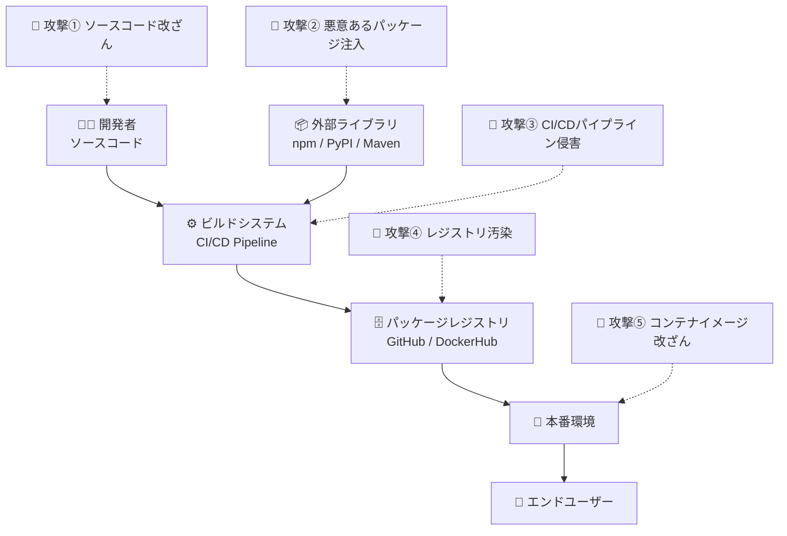
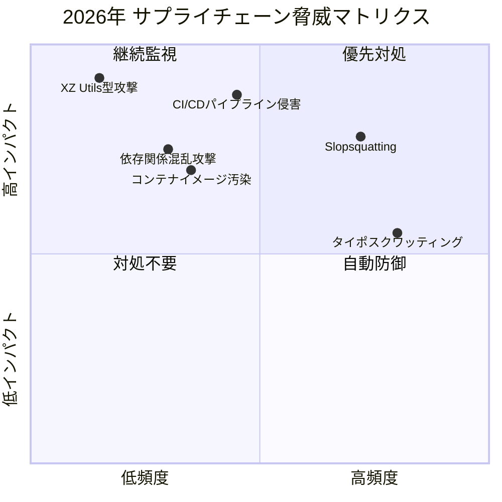
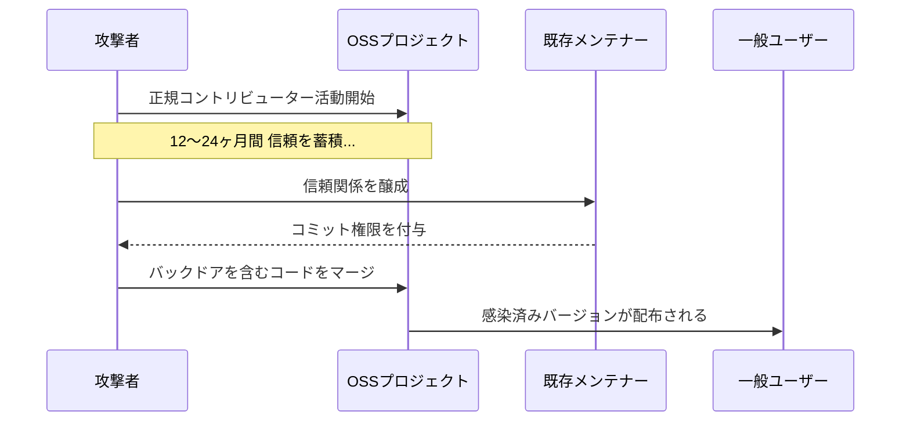
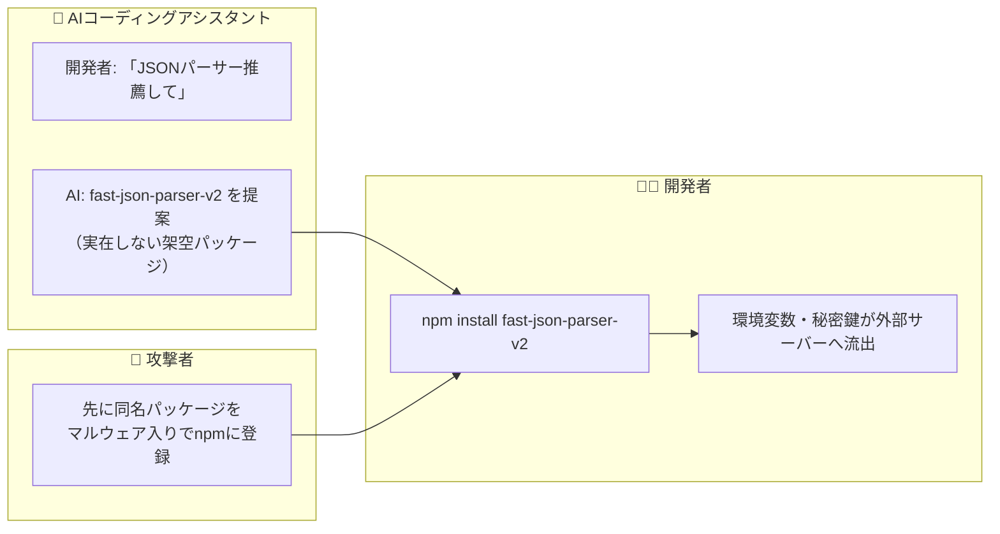
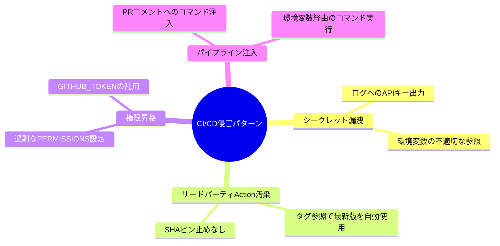
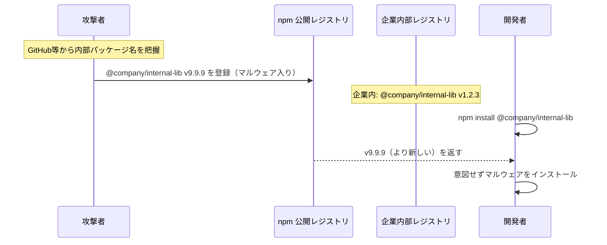
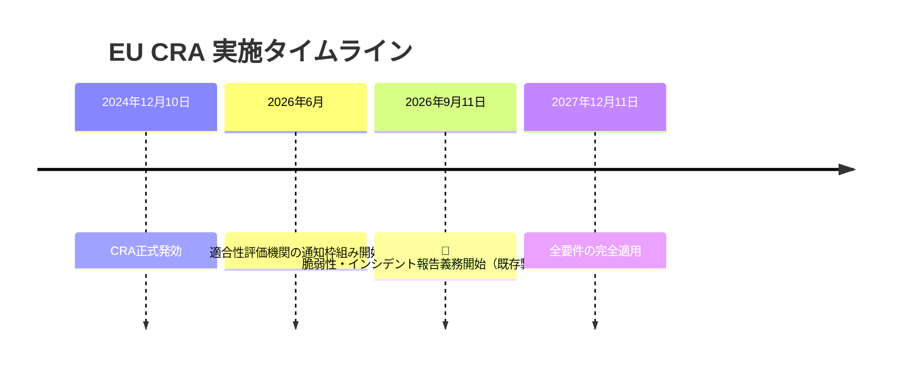
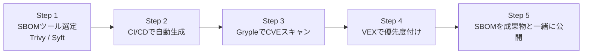
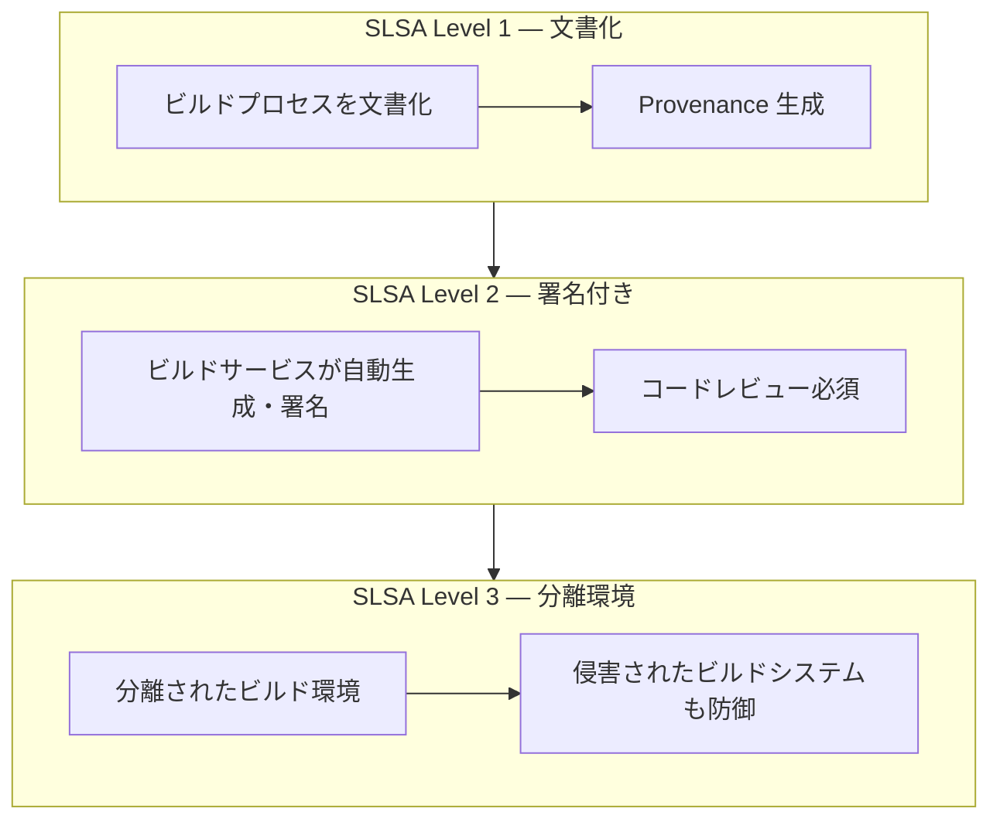
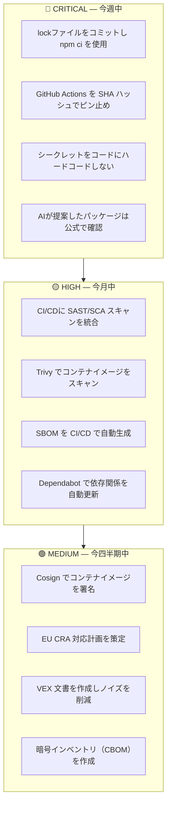

# 2026年 サプライチェーンセキュリティ 完全ガイド

> **対象読者**: 初学者〜中級者  
> **最終更新**: 2026年5月

---

## 目次

1. サプライチェーンセキュリティとは
2. 2026年の脅威ランドスケープ総括
3. 主要インシデント・特記事項
4. EU CRA 2026年対応
5. SBOM の義務化と現実
6. SLSA・Cosign による来歴証明
7. VEX によるノイズ削減
8. PQC のサプライチェーンへの影響
9. ベストプラクティス総合チェックリスト
10. 参考ソース一覧

---

## 1. サプライチェーンセキュリティとは

**ポイント**: 現代アプリのコードの 80〜90% は外部依存ライブラリで構成されており、どの工程でも攻撃が可能です。



---

## 2. 2026年の脅威ランドスケープ総括



| 脅威カテゴリ | 2025年比 | 主な原因 |
|---|---|---|
| AIコード生成悪用（Slopsquatting） | **+320%** | AIコーディングツールの爆発的普及 |
| CI/CDパイプライン侵害 | **+145%** | GitHub Actions等の設定不備 |
| 長期潜伏型メンテナー攻撃 | **+88%** | ソーシャルエンジニアリング高度化 |
| EU CRA非準拠リスク | **新規** | 2026年9月の報告義務化 |

---

## 3. 主要インシデント・特記事項

### 3.1 XZ Utils型 長期潜伏攻撃の継続



**原因**: メンテナーが少人数・コードレビュー不十分・来歴検証の仕組みがない

**解決策**:

```bash
# GPGコミット署名の義務化
git config --global commit.gpgsign true
git config --global user.signingkey YOUR_KEY_ID
```

> 📌 https://openssf.org/blog/2024/03/30/xz-utils-backdoor-cve-2024-3094/

---

### 3.2 Slopsquatting（AIハルシネーション悪用）



| モデル種別 | Slopsquatting発生率 |
|---|---|
| 商用LLM（GPT-4o, Claude等） | 約 5% |
| オープンソースLLM | 約 22% |

**解決策**:

```bash
# インストール前に必ず公式レジストリで確認
npm info fast-json-parser-v2

# Socket.devでマルウェアスキャン
npx socket@latest npm install fast-json-parser-v2

# lockファイルで固定
npm ci  # npm install ではなく npm ci を使用
```

> 📌 https://socket.dev/blog/slopsquatting-how-ai-hallucinations-are-fueling-a-new-class-of-supply-chain-attacks

---

### 3.3 CI/CDパイプライン侵害の高度化



**解決策 — SHAハッシュでActionをピン止め（必須）**:

```yaml
# ❌ 危険: タグ指定（タグ書き換えで改ざん可能）
- uses: actions/checkout@v4

# ✅ 安全: SHAハッシュで固定（改ざん不可）
- uses: actions/checkout@11bd71901bbe5b1630ceea73d27597364c9af683  # v4.2.2
```

**解決策 — 最小権限設定**:

```yaml
permissions: read-all  # デフォルトを最小化

jobs:
  build:
    permissions:
      contents: read
      packages: write  # 必要な権限のみ
```

> 📌 https://docs.github.com/en/actions/security-guides/security-hardening-for-github-actions

---

### 3.4 依存関係混乱攻撃



**解決策 — `.npmrc` でスコープを固定**:

```ini
# .npmrc
@company:registry=https://internal-registry.company.com/
always-auth=true
```

---

### 3.5 コンテナイメージへの悪意あるレイヤー混入

**解決策 — Trivyスキャン + Cosign署名**:

```bash
# スキャン
trivy image --severity HIGH,CRITICAL \
  --exit-code 1 myapp:v1.0.0

# キーレス署名（GitHub Actions）
cosign sign --yes ghcr.io/my-org/my-app@$DIGEST

# デプロイ前検証
cosign verify \
  --certificate-identity="https://github.com/my-org/my-repo/.github/workflows/build.yml@refs/heads/main" \
  --certificate-oidc-issuer="https://token.actions.githubusercontent.com" \
  ghcr.io/my-org/my-app:v1.0.0
```

> 📌 https://github.com/sigstore/cosign

---

## 4. EU サイバーレジリエンス法（CRA）2026年対応



- 違反ペナルティ: **最大1,500万ユーロ** または **年間売上高の2.5%**
- 日本企業も EU 域内でソフトウェアを販売・提供する場合は対象

> 📌 https://digital-strategy.ec.europa.eu/en/policies/cyber-resilience-act

---

## 5. SBOMの義務化と現実



```bash
# Node.js プロジェクトのSBOM生成
npx @cyclonedx/cyclonedx-npm --output-format JSON --output-file sbom.json

# コンテナイメージ全体
trivy image --format cyclonedx --output sbom-image.json myapp:v1.0.0

# CVEスキャン
grype sbom:./sbom.json --fail-on high
```

> ⚠️ DigiCert 2026年調査: 完全なSBOMを動的に提供できている組織は **わずか11%**
> 📌 https://www.digicert.com/campaigns/state-of-software-supply-chain-security-2026

---

## 6. SLSA・Cosignによる来歴証明



```bash
# 来歴の検証
slsa-verifier verify-image "myapp:v1.2.0" \
  --provenance-path provenance.json \
  --source-uri github.com/my-org/my-repo \
  --source-tag v1.2.0

# ✅ 成功時: PASSED: Verified SLSA provenance
```

> 📌 https://slsa.dev/

---

## 7. VEXによるノイズ削減

| ステータス | 意味 | 対応 |
|---|---|---|
| `affected` | 実際に悪用可能 | 即座にパッチ適用 |
| `not_affected` | 悪用不可能 | 対象機能を未使用・無効化済み |
| `fixed` | 修正済み | 対応不要 |
| `under_investigation` | 調査中 | 48〜72時間以内に更新 |

> 📌 https://openssf.org/blog/2026/01/08/signal-in-the-noise-an-industry-wide-perspective-on-the-state-of-vex/

---

## 8. PQCのサプライチェーンへの影響

| 影響領域 | 現在の問題 | 対応 |
|---|---|---|
| コード署名 | RSA/ECDSAが将来的に破られる | ML-DSA-65 への移行 |
| TLS通信（パッケージ取得） | ECDHEが量子で脆弱化 | X25519+ML-KEM-768 ハイブリッド |
| コンテナ署名（Cosign） | RSAベースの署名 | ML-DSA への移行 |

> 📌 https://csrc.nist.gov/projects/post-quantum-cryptography

---

## 9. ベストプラクティス 優先度別チェックリスト



### 推奨ツールスタック

| カテゴリ | ツール | コスト |
|---|---|---|
| SBOM 生成 | Trivy / Syft | 無料 |
| 脆弱性スキャン | Grype | 無料 |
| コンテナスキャン | Trivy | 無料 |
| 署名・検証 | Cosign / Sigstore | 無料 |
| 来歴証明 | SLSA Verifier | 無料 |
| マルウェア検出 | Socket.dev | 一部有料 |
| Actions 監査 | zizmor | 無料 |
| シークレット検出 | gitleaks | 無料 |
| 依存関係更新 | Dependabot | 無料 |

---

## 10. 参考ソース一覧

| ソース | URL |
|---|---|
| OWASP A03:2025 | https://owasp.org/Top10/2025/A03_2025-Software_Supply_Chain_Failures/ |
| SLSA Framework | https://slsa.dev/ |
| Sigstore/Cosign | https://github.com/sigstore/cosign |
| NIST PQC | https://csrc.nist.gov/projects/post-quantum-cryptography |
| EU CRA 公式 | https://digital-strategy.ec.europa.eu/en/policies/cyber-resilience-act |
| OpenSSF VEX | https://openssf.org/blog/2026/01/08/signal-in-the-noise-an-industry-wide-perspective-on-the-state-of-vex/ |
| XZ Utils 解説 | https://openssf.org/blog/2024/03/30/xz-utils-backdoor-cve-2024-3094/ |
| Dependency Confusion | https://medium.com/@alex.birsan/dependency-confusion-4a5d60fec610 |
| Slopsquatting | https://socket.dev/blog/slopsquatting-how-ai-hallucinations-are-fueling-a-new-class-of-supply-chain-attacks |
| DigiCert 2026 調査 | https://www.digicert.com/campaigns/state-of-software-supply-chain-security-2026 |
| M-Trends 2026 | https://cloud.google.com/blog/topics/threat-intelligence/m-trends-2026 |
| GH Actions セキュリティ | https://docs.github.com/en/actions/security-guides/security-hardening-for-github-actions |
| zizmor | https://woodruffw.github.io/zizmor/ |
